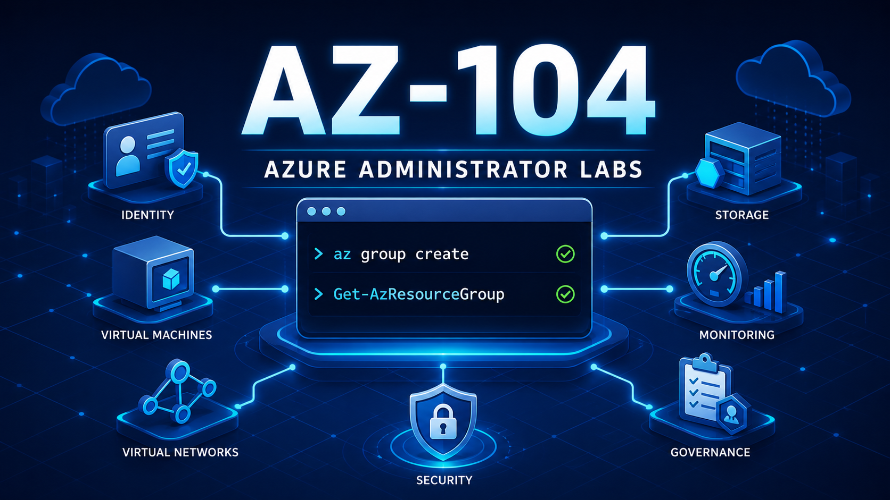
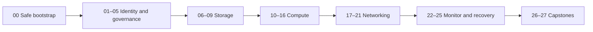

# AZ-104 Azure Administrator Labs

A command-first, self-paced lab curriculum for the Microsoft Certified: Azure Administrator Associate exam. The repository follows the official skills measured as of **April 17, 2026** and is designed around Azure CLI, Az/Graph PowerShell, real validation, safe cleanup, and architecture diagrams.

> [!IMPORTANT]
> This is an independent learning project, not an official Microsoft course. Azure resources can incur charges. Use a disposable sandbox subscription, read each cost notice, and complete cleanup before leaving a lab.

## Current milestone

All 28 labs are implemented and offline-validated. Live Azure execution remains pending for each lab and must use a disposable environment with the declared permissions, cost gates, validation, and cleanup boundary.

## Exam coverage

| Domain | Exam weight | Labs |
|---|---:|---:|
| Manage Azure identities and governance | 20–25% | 5 |
| Implement and manage storage | 15–20% | 4 |
| Deploy and manage Azure compute resources | 20–25% | 7 |
| Implement and manage virtual networking | 15–20% | 5 |
| Monitor and maintain Azure resources | 10–15% | 4 |
| Foundation and capstones | — | 3 |

The verified blueprint contains **82 official objective bullets**. The curriculum adds five clearly marked foundation objectives for tooling, context, cost control, safe state, and cleanup.

## Learning model

Each lab follows the same loop:

1. Observe the starting state and predict the outcome.
2. Implement with one complete Azure CLI or PowerShell lane.
3. Test both expected and denied/failure behavior where relevant.
4. Validate using read-only commands and machine-readable results.
5. Record redacted Azure CLI or PowerShell validation evidence.
6. Clean up and audit for residual resources.
7. Complete ten original multiple-choice questions using the separate answer key.

Every lab is self-contained under `labs/<number>-<slug>/`. It does not import runtime files from another lab.

## Curriculum

| Lab | Topic | Primary surface | Status |
|---:|---|---|---|
| 00 | Safe bootstrap | CLI + PowerShell | Offline-validated |
| 01 | Entra users and groups | Azure CLI/Graph | Offline-validated |
| 02 | Entra licenses, guests, and SSPR | Graph/Entra PowerShell | Offline-validated |
| 03 | Azure RBAC scopes | Az PowerShell | Offline-validated |
| 04 | Resource hierarchy, tags, and locks | Azure CLI | Offline-validated |
| 05 | Policy, costs, and Advisor | Az PowerShell | Offline-validated |
| 06 | Storage accounts and security | Azure CLI | Offline-validated |
| 07 | Storage networking and SAS | Az PowerShell | Offline-validated |
| 08 | Blob lifecycle and replication | Azure CLI | Offline-validated |
| 09 | Azure Files identity | Az PowerShell | Offline-validated |
| 10 | ARM and Bicep lifecycle | Azure CLI + Bicep | Offline-validated |
| 11 | VM lifecycle, disks, and host encryption | Azure CLI | Offline-validated |
| 12 | VM resilience, scale, and mobility | Az PowerShell | Offline-validated |
| 13 | ACR and ACI | Azure CLI | Offline-validated |
| 14 | Azure Container Apps | Azure CLI | Offline-validated |
| 15 | App Service scaling and slots | Az PowerShell | Offline-validated |
| 16 | App Service TLS, DNS, backup, and networking | Azure CLI | Offline-validated |
| 17 | VNets, subnets, peering, and public IPs | Az PowerShell | Offline-validated |
| 18 | Routing, NSGs, and ASGs | Azure CLI | Offline-validated |
| 19 | Service and private endpoints | Az PowerShell | Offline-validated |
| 20 | Azure DNS and Bastion | Azure CLI | Offline-validated |
| 21 | Load Balancer and Network Watcher | Az PowerShell | Offline-validated |
| 22 | Azure Monitor logs and Insights | Azure CLI + KQL | Offline-validated |
| 23 | Monitor alerts and actions | Azure CLI | Offline-validated |
| 24 | Azure Backup and restore | Az PowerShell | Offline-validated |
| 25 | Site Recovery and failover | Az PowerShell | Offline-validated |
| 26 | Capstone: build | Azure CLI + Bicep | Offline-validated |
| 27 | Capstone: operate and recover | Az PowerShell + KQL | Offline-validated |

## Start here

1. Read [prerequisites](docs/prerequisites.md).
2. Read [cost and cleanup safety](docs/cost-and-cleanup.md).
3. Complete [Lab 00: Safe bootstrap](labs/00-safe-bootstrap/README.md).
4. In an authorized disposable tenant, complete [Lab 01: Entra users and groups](labs/01-entra-users-groups/README.md).
5. Follow the generated [lab catalog](labs/catalog.yml) and [objective map](docs/objective-map.md).

Labs can be run locally, in GitHub Codespaces, or in Azure Cloud Shell. Tool versions and permissions are checked by each lab rather than assumed.

## Important documentation

- [Official blueprint research](docs/research/az-104-blueprint.md)
- [Objective map](docs/objective-map.md)
- [Permissions matrix](docs/permissions-matrix.md)
- [Study plan](docs/study-plan.md)
- [Troubleshooting](docs/troubleshooting.md)
- [Command cheat sheet](docs/command-cheatsheet.md)
- [CLI and PowerShell evidence handling](docs/evidence-handling.md)
- [Assessment authoring guide](docs/assessment-guide.md)
- [Question bank index](docs/question-bank-index.md)
- [Implementation status](docs/implementation-status.md)
- [Project mega prompt](AZ-104-GITHUB-LABS-MEGA-PROMPT.md)

## Safety defaults

- Default primary region: `westeurope`; secondary: `northeurope`, subject to availability.
- Default live-test budget: no spending without approval; authorized batches are capped at €10.
- Preflight and validation are read-only.
- Cleanup is idempotent and limited to the recorded run ID.
- Pull-request CI never authenticates to Azure.
- Live verification is based on redacted Azure CLI or PowerShell validation output and cleanup evidence.
- Mermaid and SVG architecture diagrams are the repository's only instructional visuals.
- The assessment bank contains exactly 50 questions for each of the five official domains.

## License

Code and documentation are available under the [MIT License](LICENSE).
