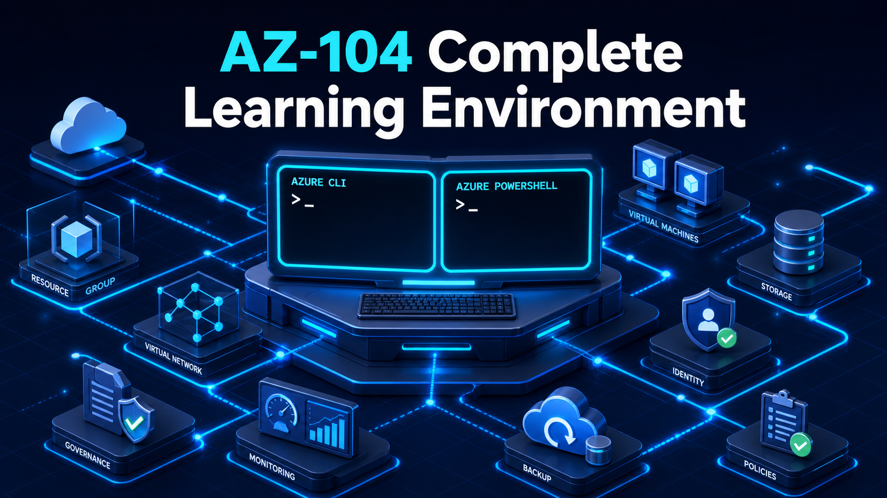

# AZ-104 Complete Learning Environment



A command-first path from Azure fundamentals to job-ready administration, aligned with the Microsoft AZ-104 skills measured as of **April 17, 2026**.

All learner Azure operations use Azure CLI (`az` and `az rest`), Bicep, AzCopy, or KQL from PowerShell 7. There are no browser-based lab steps, screenshots, or screenshot-evidence requirements. Architecture diagrams are the only instructional visuals.

> [!IMPORTANT]
> This independent project is not an official Microsoft course. Azure resources can incur charges. Use an approved disposable subscription, review each lab's cost and permission gates, and complete its residual-resource audit.

## Choose a pathway

| Pathway | Best for | Route |
|---|---|---|
| Quick start | New learners who want a safe first deployment | Readiness → Lab 00 → Labs 01, 06, 10, 17, and 22 |
| Full exam preparation | Learners covering every official objective | Labs 00–25 in order → all 1,250 questions → Capstones 26–27 |
| Job ready | Learners practising operational ownership | Labs 00–25 → every break/fix and job-style challenge → both capstones |

The searchable documentation site adds generated domain navigation, a glossary, cost guidance, and private browser-local progress. From PowerShell, stage and preview the site with:

```powershell
python -m pip install -r requirements-dev.txt -r requirements-docs.txt
python tools/build_docs_site.py
python -m mkdocs serve --strict
```

The Pages workflow builds on pull requests and deploys only from `main`. Before
the first deployment, the repository owner must enable GitHub Pages with
**GitHub Actions** as its publishing source; the workflow does not change that
repository setting.

## Start safely

1. Install or open PowerShell 7.4 or later.
2. Run `./tools/Initialize-LabEnvironment.ps1` for the blocking readiness report.
3. Review [prerequisites](docs/prerequisites.md) and [cost and cleanup safety](docs/cost-and-cleanup.md).
4. Complete [Lab 00: Safe bootstrap](labs/00-safe-bootstrap/README.md).
5. Choose a pathway above or continue through the [lab catalog](labs/README.md).

The initializer checks Azure CLI, `az bicep`, AzCopy, Python, Node, required extensions, local configuration, and lab-specific prerequisites. It does not authenticate, install dependencies silently, register providers, or deploy Azure resources.

## What every lab provides

Each of the 28 standalone lab folders includes:

- a real-world scenario, learner role, outcome, completion criteria, and objective-to-checkpoint map;
- an accessible architecture diagram and service-topology walkthrough;
- explicit inputs, permissions, cost gates, and read-only preflight checks;
- direct Azure CLI commands in PowerShell blocks for every guided checkpoint;
- expected output, positive and negative checks, safe retry guidance, and evidence to retain;
- deterministic break/fix, troubleshooting, service-specific validation, and optional job challenge;
- dependency-aware cleanup, ownership refusal, and residual-resource checks;
- synchronized `Preflight.ps1`, `Setup.ps1`, `Validate.ps1`, and `Cleanup.ps1` automation;
- 50 original assessment questions in Labs 01–25, each mapped back to a task and official objective.

`Setup.ps1` and `Cleanup.ps1` preview by default. Mutations require `-Execute`; moderate or elevated cost requires `-AcknowledgeCost`; tenant-wide changes require `-AcknowledgeTenantChange`. Lab 00 and Capstones 26–27 are hands-on only.

## Coverage

| Official AZ-104 domain | Labs | Questions |
|---|---|---:|
| Manage Azure identities and governance | 01–05 | 250 |
| Implement and manage storage | 06–09 | 200 |
| Deploy and manage Azure compute resources | 10–16 | 350 |
| Implement and manage virtual networking | 17–21 | 250 |
| Monitor and maintain Azure resources | 22–25 | 200 |
| Foundation and capstones | 00, 26–27 | Hands-on only |

All 82 official objective bullets are covered. Every assessment-enabled lab contains exactly 50 questions with a 15 foundational / 25 applied / 10 advanced mix, for **1,250 questions total**.

## Learning and safety model

Use a different run ID for the guided and automated lanes. A successful run follows this loop:

1. Confirm tools, context, region, quota, SKU, permissions, and inputs without changing Azure.
2. Preview the setup and review the exact ownership boundary.
3. Build each checkpoint with Azure CLI hosted in PowerShell.
4. Prove both the expected state and a denied, absent, or misconfigured state.
5. Diagnose and repair the deterministic break/fix condition.
6. Save redacted command evidence and machine-readable validation results.
7. Preview cleanup, execute it only when ready, and prove no active managed resource remains.
8. Use the assessment's remediation links to repeat weak tasks.

A deployment is a pass only when every required checkpoint passes. Skipped optional gates produce a partial result. Cleanup passes only when no active managed resources remain; deliberately retained or soft-deleted items must be listed in `cleanup.json`.

## Repository interfaces

- [Lab catalog](labs/README.md)
- [Objective map](docs/objective-map.md)
- [Permissions matrix](docs/permissions-matrix.md)
- [Study plan](docs/study-plan.md)
- [Troubleshooting](docs/troubleshooting.md)
- [Command cheat sheet](docs/command-cheatsheet.md)
- [Evidence handling](docs/evidence-handling.md)
- [Assessment guide](docs/assessment-guide.md)
- [Assessment dashboard](docs/question-bank-index.md)
- [Generated lab dashboard](docs/implementation-status.md)

Repository authoring and automated validation are performed offline. No lab is labeled live-verified until a separately approved disposable-environment run completes the inline path, break/fix, validation, cleanup, and residual audit.

## License

Code and documentation are available under the [MIT License](LICENSE).
