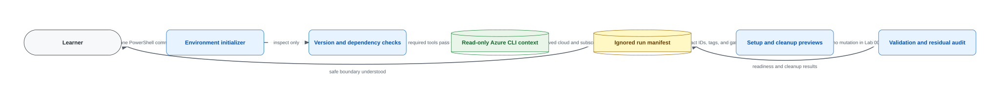

# Lab 00 — Safe Azure lab bootstrap

> **Status:** Offline-validated; live Azure queries are pending.
> **Blueprint:** AZ-104 skills measured as of 2026-04-17.
> **Azure changes:** None. The scripts observe Azure and prepare lab-local state only.

You have inherited access to an Azure sandbox, but you do not yet know which tenant and subscription your terminal targets, whether the intended regions are available, which resource providers are registered, or whether regional compute quota can be read. Your first administrator task is to establish those facts and create a safe run record before any lab is allowed to deploy.

## Outcome

By the end of this lab, you will be able to:

- verify the exact cloud, tenant, subscription, and subscription state before running commands;
- distinguish read-only discovery from configuration changes;
- inspect region availability, provider registration, and compute usage/quota;
- produce a reusable run ID, naming stem, and mandatory tag set without creating a resource;
- generate a machine-readable validation report; and
- preview and remove only the selected run's local state.

This is a foundation lab, not direct scored-objective coverage. Its IDs support every later lab:

| Foundation objective | What you prove |
|---|---|
| `FD-TOOLS-01` | Required tools and maintained command surfaces are available. |
| `FD-CONTEXT-01` | The active tenant and subscription are explicit and correct. |
| `FD-COST-01` | Cost class, billable resources, and safe-stop behavior are understood. |
| `FD-SAFETY-01` | Naming and tags are prepared without leaking sensitive data. |
| `FD-CLEANUP-01` | Validation and cleanup remain scoped to a recorded run. |

## Architecture



The Azure control plane is queried but never changed. `setup` writes `run.json`; `validate` reads Azure and writes `validation.json`; `cleanup` previews or removes exactly one `.state/<run-id>/` directory.

## Choose a command lane

Both lanes are complete. Use one for the exercise, then compare the other if you want practice translating administrator intent between tools.

| Lane | Requirements | Offline-tested versions |
|---|---|---|
| Azure CLI | Bash, Azure CLI, jq 1.6+ | Azure CLI 2.88.0 |
| Az PowerShell | PowerShell 7, `Az.Accounts`, `Az.Resources`, `Az.Compute` | PowerShell 7.6.5; Az.Accounts 2.12.1; Az.Resources 6.5.3; Az.Compute 5.5.0 |

Commands target public Azure by default. Sovereign-cloud learners must confirm that the selected regions and documentation apply to their cloud.

## Time, difficulty, cost, and permissions

- **Time:** 45–60 minutes
- **Difficulty:** Foundational
- **Cost class:** None
- **Billable resources:** None
- **Safe-stop point:** Every point in this lab; no Azure resource is created
- **Recommended access:** Reader at the target sandbox subscription
- **Entra roles / Graph scopes / licenses:** None
- **Default regions:** `westeurope` and `northeurope`, both configurable
- **Quota changes:** None; the scripts only read regional compute usage/quota
- **Provider changes:** None; an unregistered provider produces a warning

Do not use a production or employer subscription. Later labs can incur charges. Estimate them with the [Azure pricing calculator](https://learn.microsoft.com/en-us/azure/cost-management-billing/costs/pricing-calculator), obtain authorization, and tear them down promptly. A Cost Management budget is an alerting mechanism: exceeding a budget does not stop resources or consumption.

## Resources and local state

No Azure resources, RBAC assignments, provider registrations, tenant settings, or CLI/PowerShell contexts are changed.

Setup creates only:

```text
.state/<run-id>/
└── run.json
```

Validation adds `validation.json`. The lab-local `.gitignore` excludes `.state/`. State includes tenant and subscription IDs so the scripts can prevent context drift; it never includes user names, tokens, keys, passwords, connection strings, or SAS values.

Prepared tags for later labs are:

```text
purpose=az104-lab
labId=00-safe-bootstrap
runId=<run-id>
expiresOn=<UTC date>
```

Tags are plain text and can appear in cost reports and logs. Never put sensitive data in them.

## Before you begin

1. Use a dedicated non-production sandbox.
2. Sign in interactively. The lab never signs in for you and never stores credentials.
3. Review the active context yourself.

Azure CLI:

```bash
az login
az account show --output table
# If necessary, make a deliberate local context choice:
az account set --subscription '<sandbox-subscription-id>'
```

Az PowerShell:

```powershell
Connect-AzAccount
Get-AzContext
# If necessary, make a deliberate local context choice:
Set-AzContext -Subscription '<sandbox-subscription-id>'
```

Context-changing commands above affect only your local Azure tool session, but they are intentionally not hidden inside the lab scripts. Stop if the tenant or subscription is not the sandbox you intend to use.

<!-- BEGIN GENERATED INLINE COMMANDS -->
## Complete inline command implementation

The lifecycle commands below are the complete learner-facing implementation. They are embedded from the retained script files so the README and automation cannot drift. Review each stage here before running it. Use a different run ID if you later try the optional scripted lane against the same sandbox.

### Preflight: `scripts/cli/preflight.sh`

```bash
#!/usr/bin/env bash

set -euo pipefail

usage() {
  cat <<'EOF'
Read-only preflight for Lab 00.

Usage:
  ./preflight.sh [--subscription-id GUID] [--tenant-id GUID]
                 [--location NAME] [--secondary-location NAME]

Exit codes:
  0  all required checks passed
  1  a required check failed
  2  required checks passed, with warnings or skipped optional checks

This script never signs in, changes the active subscription, registers a
provider, creates a resource, or changes Azure state.
EOF
}

subscription_id=""
expected_tenant_id=""
location="westeurope"
secondary_location="northeurope"

while (( $# > 0 )); do
  case "$1" in
    --subscription-id)
      [[ $# -ge 2 ]] || { echo "ERROR: --subscription-id requires a value." >&2; exit 1; }
      subscription_id="$2"
      shift 2
      ;;
    --tenant-id)
      [[ $# -ge 2 ]] || { echo "ERROR: --tenant-id requires a value." >&2; exit 1; }
      expected_tenant_id="$2"
      shift 2
      ;;
    --location)
      [[ $# -ge 2 ]] || { echo "ERROR: --location requires a value." >&2; exit 1; }
      location="$2"
      shift 2
      ;;
    --secondary-location)
      [[ $# -ge 2 ]] || { echo "ERROR: --secondary-location requires a value." >&2; exit 1; }
      secondary_location="$2"
      shift 2
      ;;
    -h|--help)
      usage
      exit 0
      ;;
    *)
      echo "ERROR: unknown argument '$1'." >&2
      usage >&2
      exit 1
      ;;
  esac
done

guid_pattern='^[0-9a-fA-F]{8}-[0-9a-fA-F]{4}-[0-9a-fA-F]{4}-[0-9a-fA-F]{4}-[0-9a-fA-F]{12}$'
location_pattern='^[a-z0-9-]+$'

if [[ -n "$subscription_id" && ! "$subscription_id" =~ $guid_pattern ]]; then
  echo "ERROR: --subscription-id must be a subscription GUID." >&2
  exit 1
fi
if [[ -n "$expected_tenant_id" && ! "$expected_tenant_id" =~ $guid_pattern ]]; then
  echo "ERROR: --tenant-id must be a tenant GUID." >&2
  exit 1
fi
if [[ ! "$location" =~ $location_pattern || ! "$secondary_location" =~ $location_pattern ]]; then
  echo "ERROR: region names may contain only lowercase letters, digits, and hyphens." >&2
  exit 1
fi

errors=0
warnings=0

pass() { printf '[PASS] %s\n' "$1"; }
fail() { printf '[FAIL] %s\n' "$1" >&2; errors=$((errors + 1)); }
warn() { printf '[WARN] %s\n' "$1"; warnings=$((warnings + 1)); }

echo "Lab 00 - Azure CLI preflight (read only)"
echo "========================================="

if ! command -v az >/dev/null 2>&1; then
  fail "Azure CLI is not available on PATH."
  exit 1
fi

cli_version="$(az version --query '"azure-cli"' --output tsv 2>/dev/null || true)"
if [[ -n "$cli_version" ]]; then
  pass "Azure CLI version: $cli_version"
else
  fail "Azure CLI version could not be read."
fi

account_json="$(az account show --only-show-errors --output json 2>/dev/null || true)"
if [[ -z "$account_json" ]]; then
  fail "No active Azure CLI session. Run 'az login' interactively, then rerun preflight."
  exit 1
fi

current_subscription_id="$(az account show --query id --output tsv --only-show-errors 2>/dev/null || true)"
current_tenant_id="$(az account show --query tenantId --output tsv --only-show-errors 2>/dev/null || true)"
current_subscription_name="$(az account show --query name --output tsv --only-show-errors 2>/dev/null || true)"
current_state="$(az account show --query state --output tsv --only-show-errors 2>/dev/null || true)"
cloud_name="$(az cloud show --query name --output tsv 2>/dev/null || true)"

[[ -n "$subscription_id" ]] || subscription_id="$current_subscription_id"

echo
echo "Exact active context (redact identifiers from any retained evidence):"
printf '  Cloud:        %s\n' "$cloud_name"
printf '  Subscription: %s\n' "$current_subscription_name"
printf '  Subscription ID: %s\n' "$current_subscription_id"
printf '  Tenant ID:       %s\n' "$current_tenant_id"

if [[ "$current_subscription_id" == "$subscription_id" ]]; then
  pass "The active subscription matches the requested subscription."
else
  fail "Active subscription does not match --subscription-id. Review it, then use 'az account set --subscription <id>' yourself."
fi

if [[ -z "$expected_tenant_id" || "$current_tenant_id" == "$expected_tenant_id" ]]; then
  pass "The active tenant matches the requested tenant (or no tenant override was supplied)."
else
  fail "Active tenant does not match --tenant-id. Stop and sign in to the intended sandbox tenant."
fi

if [[ "$current_state" == "Enabled" ]]; then
  pass "Subscription state is Enabled."
else
  fail "Subscription state is '$current_state', not Enabled."
fi

for region in "$location" "$secondary_location"; do
  available="$(az account list-locations --subscription "$subscription_id" --query "length([?name=='$region'])" --output tsv --only-show-errors 2>/dev/null || true)"
  if [[ "$available" == "1" ]]; then
    pass "Region '$region' is listed for this subscription."
  else
    fail "Region '$region' was not found for this subscription. Choose another region."
  fi
done

if [[ "$location" == "$secondary_location" ]]; then
  warn "Primary and secondary regions are identical; later resilience labs need two regions."
fi

echo
echo "Observed provider registration (this script does not register providers):"
providers=(
  Microsoft.Authorization
  Microsoft.Compute
  Microsoft.Insights
  Microsoft.Network
  Microsoft.RecoveryServices
  Microsoft.Storage
)
for provider in "${providers[@]}"; do
  provider_state="$(az provider show --namespace "$provider" --subscription "$subscription_id" --query registrationState --output tsv --only-show-errors 2>/dev/null || true)"
  if [[ "$provider_state" == "Registered" ]]; then
    pass "$provider is Registered."
  elif [[ -n "$provider_state" ]]; then
    warn "$provider is $provider_state. Register it only when a later authorized lab requires it."
  else
    warn "$provider registration state could not be read with the current permissions."
  fi
done

if az vm list-usage --location "$location" --subscription "$subscription_id" --only-show-errors --output none >/dev/null 2>&1; then
  pass "Regional compute usage/quota can be queried in '$location'."
else
  warn "Compute usage/quota could not be queried in '$location'; check Reader access and Microsoft.Compute registration."
fi

echo
echo "Cost guardrail"
echo "  This lab creates zero Azure resources and has cost class 'none'."
echo "  Later labs may be billable: estimate first, obtain authorization, tag every"
echo "  resource, and tear it down in the same session. Azure budgets alert; they"
echo "  do not stop resources or consumption."

echo
if (( errors > 0 )); then
  echo "Preflight result: FAIL ($errors required check(s) failed, $warnings warning(s))."
  exit 1
elif (( warnings > 0 )); then
  echo "Preflight result: PARTIAL ($warnings warning(s); review before later labs)."
  exit 2
else
  echo "Preflight result: PASS."
  exit 0
fi
```

### Setup: `scripts/cli/setup.sh`

```bash
#!/usr/bin/env bash

set -euo pipefail
umask 077

SCRIPT_DIR="$(cd -- "$(dirname -- "${BASH_SOURCE[0]}")" && pwd -P)"
LAB_ROOT="$(cd -- "$SCRIPT_DIR/../.." && pwd -P)"

usage() {
  cat <<'EOF'
Create Lab 00 local run state. No Azure resources or settings are changed.

Usage:
  ./setup.sh [--subscription-id GUID] [--tenant-id GUID]
             [--location NAME] [--secondary-location NAME]
             [--run-id ID] [--state-root PATH]

The active Azure CLI subscription and tenant must match any IDs supplied.
EOF
}

subscription_id=""
expected_tenant_id=""
location="westeurope"
secondary_location="northeurope"
run_id=""
state_root="$LAB_ROOT/.state"

while (( $# > 0 )); do
  case "$1" in
    --subscription-id) [[ $# -ge 2 ]] || exit 1; subscription_id="$2"; shift 2 ;;
    --tenant-id) [[ $# -ge 2 ]] || exit 1; expected_tenant_id="$2"; shift 2 ;;
    --location) [[ $# -ge 2 ]] || exit 1; location="$2"; shift 2 ;;
    --secondary-location) [[ $# -ge 2 ]] || exit 1; secondary_location="$2"; shift 2 ;;
    --run-id) [[ $# -ge 2 ]] || exit 1; run_id="$2"; shift 2 ;;
    --state-root) [[ $# -ge 2 ]] || exit 1; state_root="$2"; shift 2 ;;
    -h|--help) usage; exit 0 ;;
    *) echo "ERROR: unknown argument '$1'." >&2; usage >&2; exit 1 ;;
  esac
done

guid_pattern='^[0-9a-fA-F]{8}-[0-9a-fA-F]{4}-[0-9a-fA-F]{4}-[0-9a-fA-F]{4}-[0-9a-fA-F]{12}$'
location_pattern='^[a-z0-9-]+$'
run_pattern='^[a-z0-9][a-z0-9-]{2,31}$'

command -v az >/dev/null 2>&1 || { echo "ERROR: Azure CLI is required." >&2; exit 1; }
command -v jq >/dev/null 2>&1 || { echo "ERROR: jq 1.6 or later is required by the CLI lane." >&2; exit 1; }

current_account="$(az account show --only-show-errors --output json 2>/dev/null || true)"
[[ -n "$current_account" ]] || { echo "ERROR: no active Azure CLI session. Run 'az login' interactively." >&2; exit 1; }

current_subscription_id="$(jq -r '.id // empty' <<<"$current_account")"
current_tenant_id="$(jq -r '.tenantId // empty' <<<"$current_account")"
current_state="$(jq -r '.state // empty' <<<"$current_account")"
cloud_name="$(jq -r '.environmentName // empty' <<<"$current_account")"

[[ -n "$subscription_id" ]] || subscription_id="$current_subscription_id"
[[ -n "$expected_tenant_id" ]] || expected_tenant_id="$current_tenant_id"

[[ "$subscription_id" =~ $guid_pattern ]] || { echo "ERROR: subscription ID must be a GUID." >&2; exit 1; }
[[ "$expected_tenant_id" =~ $guid_pattern ]] || { echo "ERROR: tenant ID must be a GUID." >&2; exit 1; }
[[ "$location" =~ $location_pattern && "$secondary_location" =~ $location_pattern ]] || { echo "ERROR: invalid region name." >&2; exit 1; }
[[ "$location" != "$secondary_location" ]] || { echo "ERROR: primary and secondary regions must differ." >&2; exit 1; }

if [[ "$current_subscription_id" != "$subscription_id" || "$current_tenant_id" != "$expected_tenant_id" ]]; then
  echo "ERROR: active Azure context does not match the requested tenant/subscription." >&2
  echo "Review 'az account show', change context yourself, and rerun setup." >&2
  exit 1
fi
[[ "$current_state" == "Enabled" ]] || { echo "ERROR: subscription state is '$current_state'." >&2; exit 1; }

for region in "$location" "$secondary_location"; do
  available="$(az account list-locations --subscription "$subscription_id" --query "length([?name=='$region'])" --output tsv --only-show-errors 2>/dev/null || true)"
  [[ "$available" == "1" ]] || { echo "ERROR: region '$region' is unavailable to this subscription." >&2; exit 1; }
done

if [[ -z "$run_id" ]]; then
  run_id="az10400-$(date -u +%Y%m%d%H%M%S)-$(printf '%04d' "$((RANDOM % 10000))")"
fi
[[ "$run_id" =~ $run_pattern ]] || { echo "ERROR: run ID must match $run_pattern." >&2; exit 1; }

mkdir -p -- "$state_root"
state_root="$(cd -- "$state_root" && pwd -P)"
run_dir="$state_root/$run_id"
manifest="$run_dir/run.json"

if [[ -f "$manifest" ]]; then
  existing_lab="$(jq -r '.labId // empty' "$manifest" 2>/dev/null || true)"
  existing_run="$(jq -r '.runId // empty' "$manifest" 2>/dev/null || true)"
  if [[ "$existing_lab" == "00-safe-bootstrap" && "$existing_run" == "$run_id" ]]; then
    echo "Run '$run_id' is already initialized; existing state was left unchanged."
    echo "State: $manifest"
    exit 0
  fi
  echo "ERROR: an incompatible manifest already exists at '$manifest'." >&2
  exit 1
fi
if [[ -e "$run_dir" ]]; then
  echo "ERROR: '$run_dir' exists without a valid run manifest; refusing to overwrite it." >&2
  exit 1
fi

mkdir -- "$run_dir"
token="$(printf '%s' "$run_id" | tr -cd 'a-z0-9')"
token="${token: -10}"
resource_group_name="rg-az104-00-$token"
global_name_stem="az10400$token"
global_name_stem="${global_name_stem:0:24}"
created_at="$(date -u +%Y-%m-%dT%H:%M:%SZ)"
if expires_on="$(date -u -d '+1 day' +%Y-%m-%d 2>/dev/null)"; then
  :
elif expires_on="$(date -u -v+1d +%Y-%m-%d 2>/dev/null)"; then
  :
else
  expires_on="$(date -u +%Y-%m-%d)"
fi

temp_manifest="$run_dir/run.json.tmp"
trap 'rm -f -- "$temp_manifest"' EXIT

jq -n \
  --arg createdAt "$created_at" \
  --arg runId "$run_id" \
  --arg subscriptionId "$subscription_id" \
  --arg tenantId "$expected_tenant_id" \
  --arg cloudName "$cloud_name" \
  --arg primaryRegion "$location" \
  --arg secondaryRegion "$secondary_location" \
  --arg resourceGroup "$resource_group_name" \
  --arg globalNameStem "$global_name_stem" \
  --arg expiresOn "$expires_on" \
  '{
    schemaVersion: "1.0",
    labId: "00-safe-bootstrap",
    runId: $runId,
    createdAt: $createdAt,
    context: {
      cloudName: $cloudName,
      subscriptionId: $subscriptionId,
      tenantId: $tenantId
    },
    regions: {
      primary: $primaryRegion,
      secondary: $secondaryRegion
    },
    naming: {
      resourceGroup: $resourceGroup,
      globalNameStem: $globalNameStem
    },
    tags: {
      purpose: "az104-lab",
      labId: "00-safe-bootstrap",
      runId: $runId,
      expiresOn: $expiresOn
    },
    observedProviders: [
      "Microsoft.Authorization",
      "Microsoft.Compute",
      "Microsoft.Insights",
      "Microsoft.Network",
      "Microsoft.RecoveryServices",
      "Microsoft.Storage"
    ],
    resources: [],
    tenantScopedChanges: [],
    liveAzureMutations: false
  }' >"$temp_manifest"

mv -- "$temp_manifest" "$manifest"
trap - EXIT

echo "Local Lab 00 state initialized."
echo "  Run ID:          $run_id"
echo "  Primary region:  $location"
echo "  Secondary region:$secondary_location"
echo "  Name example:    $resource_group_name"
echo "  State:           $manifest"
echo "No Azure resources or settings were changed."
```

### Validate: `scripts/cli/validate.sh`

```bash
#!/usr/bin/env bash

set -euo pipefail
umask 077

SCRIPT_DIR="$(cd -- "$(dirname -- "${BASH_SOURCE[0]}")" && pwd -P)"
LAB_ROOT="$(cd -- "$SCRIPT_DIR/../.." && pwd -P)"

usage() {
  cat <<'EOF'
Read-only Azure validation for an initialized Lab 00 run.

Usage:
  ./validate.sh --run-id ID [--state-root PATH]

The only write is the local .state/<run-id>/validation.json report.
EOF
}

run_id=""
state_root="$LAB_ROOT/.state"
while (( $# > 0 )); do
  case "$1" in
    --run-id) [[ $# -ge 2 ]] || exit 1; run_id="$2"; shift 2 ;;
    --state-root) [[ $# -ge 2 ]] || exit 1; state_root="$2"; shift 2 ;;
    -h|--help) usage; exit 0 ;;
    *) echo "ERROR: unknown argument '$1'." >&2; usage >&2; exit 1 ;;
  esac
done

run_pattern='^[a-z0-9][a-z0-9-]{2,31}$'
[[ "$run_id" =~ $run_pattern ]] || { echo "ERROR: --run-id is required and must match $run_pattern." >&2; exit 1; }
command -v az >/dev/null 2>&1 || { echo "ERROR: Azure CLI is required." >&2; exit 1; }
command -v jq >/dev/null 2>&1 || { echo "ERROR: jq 1.6 or later is required." >&2; exit 1; }

state_root="$(cd -- "$state_root" 2>/dev/null && pwd -P)" || { echo "ERROR: state root does not exist." >&2; exit 1; }
run_dir="$state_root/$run_id"
manifest="$run_dir/run.json"
report="$run_dir/validation.json"
[[ -f "$manifest" && ! -L "$run_dir" ]] || { echo "ERROR: valid run state was not found at '$run_dir'." >&2; exit 1; }
jq empty "$manifest" 2>/dev/null || { echo "ERROR: run.json is not valid JSON." >&2; exit 1; }

checks='[]'
add_check() {
  local id="$1" status="$2" message="$3"
  checks="$(jq -c --arg id "$id" --arg status "$status" --arg message "$message" '. + [{id:$id,status:$status,message:$message}]' <<<"$checks")"
  printf '[%s] %s\n' "$(tr '[:lower:]' '[:upper:]' <<<"$status")" "$message"
}

echo "Lab 00 - Azure CLI validation (Azure reads only)"
echo "================================================"

state_lab_id="$(jq -r '.labId // empty' "$manifest")"
state_run_id="$(jq -r '.runId // empty' "$manifest")"
expected_subscription_id="$(jq -r '.context.subscriptionId // empty' "$manifest")"
expected_tenant_id="$(jq -r '.context.tenantId // empty' "$manifest")"
primary_region="$(jq -r '.regions.primary // empty' "$manifest")"
secondary_region="$(jq -r '.regions.secondary // empty' "$manifest")"

if [[ "$state_lab_id" == "00-safe-bootstrap" && "$state_run_id" == "$run_id" ]]; then
  add_check "state.identity" "pass" "Run manifest belongs to Lab 00 and run '$run_id'."
else
  add_check "state.identity" "fail" "Run manifest identity does not match the selected Lab 00 run."
fi

required_tag_count="$(jq '[.tags.purpose,.tags.labId,.tags.runId,.tags.expiresOn] | map(select(type == "string" and length > 0)) | length' "$manifest")"
if [[ "$required_tag_count" == "4" && "$(jq -r '.tags.runId' "$manifest")" == "$run_id" ]]; then
  add_check "state.tags" "pass" "Required purpose, labId, runId, and expiresOn tags are prepared."
else
  add_check "state.tags" "fail" "Required tag metadata is missing or inconsistent."
fi

resource_count="$(jq '.resources | if type == "array" then length else -1 end' "$manifest")"
tenant_change_count="$(jq '.tenantScopedChanges | if type == "array" then length else -1 end' "$manifest")"
live_mutations="$(jq -r '.liveAzureMutations // empty' "$manifest")"
if [[ "$resource_count" == "0" && "$tenant_change_count" == "0" && "$live_mutations" == "false" ]]; then
  add_check "state.safety-boundary" "pass" "State records no Azure resources, tenant changes, or live mutations."
else
  add_check "state.safety-boundary" "fail" "Unexpected Azure resources or shared-setting changes are recorded; stop and review."
fi

account_json="$(az account show --only-show-errors --output json 2>/dev/null || true)"
if [[ -z "$account_json" ]]; then
  add_check "azure.session" "fail" "No active Azure CLI session is available."
  current_subscription_id=""
  current_tenant_id=""
else
  current_subscription_id="$(jq -r '.id // empty' <<<"$account_json")"
  current_tenant_id="$(jq -r '.tenantId // empty' <<<"$account_json")"
  current_state="$(jq -r '.state // empty' <<<"$account_json")"
  if [[ "$current_state" == "Enabled" ]]; then
    add_check "azure.session" "pass" "Azure CLI session is active and the subscription state is Enabled."
  else
    add_check "azure.session" "fail" "Active subscription state is '$current_state', not Enabled."
  fi
fi

if [[ -n "${current_subscription_id:-}" && "$current_subscription_id" == "$expected_subscription_id" ]]; then
  add_check "azure.subscription-context" "pass" "Active subscription matches the run manifest."
else
  add_check "azure.subscription-context" "fail" "Active subscription does not match the run manifest."
fi
if [[ -n "${current_tenant_id:-}" && "$current_tenant_id" == "$expected_tenant_id" ]]; then
  add_check "azure.tenant-context" "pass" "Active tenant matches the run manifest."
else
  add_check "azure.tenant-context" "fail" "Active tenant does not match the run manifest."
fi

if [[ -n "$expected_subscription_id" && -n "$primary_region" ]]; then
  location_count="$(az account list-locations --subscription "$expected_subscription_id" --query "length([?name=='$primary_region'])" --output tsv --only-show-errors 2>/dev/null || true)"
  if [[ "$location_count" == "1" ]]; then
    add_check "azure.primary-region" "pass" "Primary region '$primary_region' is available to the subscription."
  else
    add_check "azure.primary-region" "fail" "Primary region '$primary_region' is not available or could not be queried."
  fi
else
  add_check "azure.primary-region" "fail" "Subscription or primary-region metadata is missing."
fi

if [[ -n "$expected_subscription_id" && -n "$secondary_region" ]]; then
  location_count="$(az account list-locations --subscription "$expected_subscription_id" --query "length([?name=='$secondary_region'])" --output tsv --only-show-errors 2>/dev/null || true)"
  if [[ "$location_count" == "1" ]]; then
    add_check "azure.secondary-region" "pass" "Secondary region '$secondary_region' is available to the subscription."
  else
    add_check "azure.secondary-region" "fail" "Secondary region '$secondary_region' is not available or could not be queried."
  fi
else
  add_check "azure.secondary-region" "fail" "Subscription or secondary-region metadata is missing."
fi

if [[ -n "$primary_region" && -n "$secondary_region" && "$primary_region" != "$secondary_region" ]]; then
  add_check "azure.region-separation" "pass" "Primary and secondary regions are distinct."
else
  add_check "azure.region-separation" "fail" "Primary and secondary regions must be distinct."
fi

mapfile -t providers < <(jq -r '.observedProviders[]?' "$manifest")
if (( ${#providers[@]} == 0 )); then
  add_check "azure.providers" "fail" "No provider namespaces are declared in run state."
else
  for provider in "${providers[@]}"; do
    provider_state="$(az provider show --namespace "$provider" --subscription "$expected_subscription_id" --query registrationState --output tsv --only-show-errors 2>/dev/null || true)"
    if [[ "$provider_state" == "Registered" ]]; then
      add_check "azure.provider.$provider" "pass" "$provider is Registered."
    elif [[ -n "$provider_state" ]]; then
      add_check "azure.provider.$provider" "warning" "$provider is $provider_state; no registration was attempted."
    else
      add_check "azure.provider.$provider" "warning" "$provider registration state could not be read."
    fi
  done
fi

quota_items="$(az vm list-usage --location "$primary_region" --subscription "$expected_subscription_id" --query 'length(@)' --output tsv --only-show-errors 2>/dev/null || true)"
if [[ "$quota_items" =~ ^[1-9][0-9]*$ ]]; then
  add_check "azure.compute-quota" "pass" "Compute usage/quota returned $quota_items item(s) for '$primary_region'."
else
  add_check "azure.compute-quota" "warning" "Compute usage/quota could not be read; no quota change was attempted."
fi

failure_count="$(jq '[.[] | select(.status == "fail")] | length' <<<"$checks")"
warning_count="$(jq '[.[] | select(.status == "warning" or .status == "skipped")] | length' <<<"$checks")"
if (( failure_count > 0 )); then
  result="fail"
  exit_code=1
elif (( warning_count > 0 )); then
  result="partial"
  exit_code=2
else
  result="pass"
  exit_code=0
fi

generated_at="$(date -u +%Y-%m-%dT%H:%M:%SZ)"
cli_version="$(az version --query '"azure-cli"' --output tsv 2>/dev/null || true)"
temp_report="$run_dir/validation.json.tmp"
trap 'rm -f -- "$temp_report"' EXIT
jq -n \
  --arg generatedAt "$generated_at" \
  --arg runId "$run_id" \
  --arg result "$result" \
  --arg subscriptionId "$expected_subscription_id" \
  --arg tenantId "$expected_tenant_id" \
  --arg cliVersion "$cli_version" \
  --argjson checks "$checks" \
  '{
    schemaVersion: "1.0",
    labId: "LAB-00",
    runId: $runId,
    generatedAt: $generatedAt,
    result: $result,
    toolLane: "azure-cli",
    toolVersions: {azureCli: $cliVersion},
    targetContext: {subscriptionId: $subscriptionId, tenantId: $tenantId},
    checks: $checks
  }' >"$temp_report"
mv -- "$temp_report" "$report"
trap - EXIT

echo
echo "Validation result: $result"
echo "Machine-readable report: $report"
exit "$exit_code"
```

### Cleanup: `scripts/cli/cleanup.sh`

```bash
#!/usr/bin/env bash

set -euo pipefail

SCRIPT_DIR="$(cd -- "$(dirname -- "${BASH_SOURCE[0]}")" && pwd -P)"
LAB_ROOT="$(cd -- "$SCRIPT_DIR/../.." && pwd -P)"

usage() {
  cat <<'EOF'
Preview or remove one Lab 00 local state directory.

Usage:
  ./cleanup.sh --run-id ID [--state-root PATH] [--execute]

Without --execute, cleanup is report-only. Lab 00 never deletes Azure resources.
If state records any Azure resource or tenant-scoped change, cleanup refuses.
EOF
}

run_id=""
state_root="$LAB_ROOT/.state"
execute=false
while (( $# > 0 )); do
  case "$1" in
    --run-id) [[ $# -ge 2 ]] || exit 1; run_id="$2"; shift 2 ;;
    --state-root) [[ $# -ge 2 ]] || exit 1; state_root="$2"; shift 2 ;;
    --execute) execute=true; shift ;;
    -h|--help) usage; exit 0 ;;
    *) echo "ERROR: unknown argument '$1'." >&2; usage >&2; exit 1 ;;
  esac
done

run_pattern='^[a-z0-9][a-z0-9-]{2,31}$'
[[ "$run_id" =~ $run_pattern ]] || { echo "ERROR: --run-id is required and must match $run_pattern." >&2; exit 1; }
command -v jq >/dev/null 2>&1 || { echo "ERROR: jq 1.6 or later is required." >&2; exit 1; }

if [[ ! -d "$state_root" ]]; then
  echo "Nothing to clean: state root does not exist."
  exit 0
fi
state_root="$(cd -- "$state_root" && pwd -P)"
run_dir="$state_root/$run_id"

if [[ ! -e "$run_dir" ]]; then
  echo "Nothing to clean for run '$run_id'."
  exit 0
fi
if [[ -L "$run_dir" || ! -d "$run_dir" ]]; then
  echo "ERROR: selected run path is not a regular directory; refusing cleanup." >&2
  exit 1
fi
run_dir_resolved="$(cd -- "$run_dir" && pwd -P)"
case "$run_dir_resolved" in
  "$state_root"/*) ;;
  *) echo "ERROR: resolved run path escapes the selected state root." >&2; exit 1 ;;
esac
[[ "$run_dir_resolved" != "$state_root" ]] || { echo "ERROR: refusing to remove the state root itself." >&2; exit 1; }

manifest="$run_dir_resolved/run.json"
[[ -f "$manifest" ]] || { echo "ERROR: run.json is missing; refusing cleanup." >&2; exit 1; }
jq empty "$manifest" 2>/dev/null || { echo "ERROR: run.json is invalid; refusing cleanup." >&2; exit 1; }

state_lab_id="$(jq -r '.labId // empty' "$manifest")"
state_run_id="$(jq -r '.runId // empty' "$manifest")"
resource_count="$(jq '.resources | if type == "array" then length else -1 end' "$manifest")"
tenant_change_count="$(jq '.tenantScopedChanges | if type == "array" then length else -1 end' "$manifest")"
live_mutations="$(jq -r '.liveAzureMutations // empty' "$manifest")"

if [[ "$state_lab_id" != "00-safe-bootstrap" || "$state_run_id" != "$run_id" ]]; then
  echo "ERROR: manifest identity does not match the selected run." >&2
  exit 1
fi
if [[ "$resource_count" != "0" || "$tenant_change_count" != "0" || "$live_mutations" != "false" ]]; then
  echo "ERROR: state records Azure resources or shared-setting changes." >&2
  echo "Lab 00 cleanup never deletes Azure objects. Stop and review the manifest manually." >&2
  exit 1
fi

echo "Cleanup plan"
echo "  Azure deletions:       none"
echo "  Tenant restorations:   none"
echo "  Local directory:       $run_dir_resolved"
echo "  Local files to remove: $(find "$run_dir_resolved" -type f | wc -l | tr -d ' ')"

if [[ "$execute" != "true" ]]; then
  echo "Preview only. Rerun with --execute to remove exactly this local run directory."
  exit 0
fi

rm -rf -- "$run_dir_resolved"
if [[ -e "$run_dir_resolved" ]]; then
  echo "ERROR: local run directory still exists after cleanup." >&2
  exit 1
fi
echo "Removed local state for run '$run_id'. No Azure changes were made."
```

### Preflight: `scripts/powershell/Preflight.ps1`

```powershell
[CmdletBinding()]
[Diagnostics.CodeAnalysis.SuppressMessageAttribute(
    'PSAvoidUsingWriteHost',
    '',
    Justification = 'Interactive lab status uses host colors; machine-readable output is produced separately by validation.'
)]
param(
    [string] $SubscriptionId,
    [string] $TenantId,
    [ValidatePattern('^[a-z0-9-]+$')]
    [string] $Location = 'westeurope',
    [ValidatePattern('^[a-z0-9-]+$')]
    [string] $SecondaryLocation = 'northeurope'
)

Set-StrictMode -Version Latest
$ErrorActionPreference = 'Stop'

$script:Errors = 0
$script:Warnings = 0

function Write-Pass([string] $Message) {
    Write-Host "[PASS] $Message" -ForegroundColor Green
}
function Write-Fail([string] $Message) {
    Write-Host "[FAIL] $Message" -ForegroundColor Red
    $script:Errors++
}
function Write-WarningCheck([string] $Message) {
    Write-Host "[WARN] $Message" -ForegroundColor Yellow
    $script:Warnings++
}

Write-Host 'Lab 00 - Az PowerShell preflight (read only)'
Write-Host '=============================================='

$requiredModules = @('Az.Accounts', 'Az.Resources', 'Az.Compute')
foreach ($moduleName in $requiredModules) {
    $module = Get-Module -ListAvailable -Name $moduleName |
        Sort-Object Version -Descending |
        Select-Object -First 1
    if ($null -eq $module) {
        Write-Fail "$moduleName is not installed."
    }
    else {
        Write-Pass "$moduleName version $($module.Version) is available."
    }
}
if ($script:Errors -gt 0) {
    exit 1
}

$context = Get-AzContext
if ($null -eq $context -or $null -eq $context.Subscription -or $null -eq $context.Tenant) {
    Write-Fail "No active Az PowerShell context. Run Connect-AzAccount interactively, then rerun preflight."
    exit 1
}

$currentSubscriptionId = [string] $context.Subscription.Id
$currentTenantId = [string] $context.Tenant.Id
if ([string]::IsNullOrWhiteSpace($SubscriptionId)) {
    $SubscriptionId = $currentSubscriptionId
}
if ([string]::IsNullOrWhiteSpace($TenantId)) {
    $TenantId = $currentTenantId
}

$guidPattern = '^[0-9a-fA-F]{8}-[0-9a-fA-F]{4}-[0-9a-fA-F]{4}-[0-9a-fA-F]{4}-[0-9a-fA-F]{12}$'
if ($SubscriptionId -notmatch $guidPattern) {
    throw 'SubscriptionId must be a subscription GUID.'
}
if ($TenantId -notmatch $guidPattern) {
    throw 'TenantId must be a tenant GUID.'
}

Write-Host ''
Write-Host 'Exact active context (redact identifiers from any retained evidence):'
Write-Host "  Environment:     $($context.Environment.Name)"
Write-Host "  Subscription:    $($context.Subscription.Name)"
Write-Host "  Subscription ID: $currentSubscriptionId"
Write-Host "  Tenant ID:       $currentTenantId"

if ($currentSubscriptionId -eq $SubscriptionId) {
    Write-Pass 'The active subscription matches the requested subscription.'
}
else {
    Write-Fail "Active subscription does not match -SubscriptionId. Review it, then run Set-AzContext yourself if appropriate."
}
if ($currentTenantId -eq $TenantId) {
    Write-Pass 'The active tenant matches the requested tenant.'
}
else {
    Write-Fail 'Active tenant does not match -TenantId. Stop and connect to the intended sandbox tenant.'
}

try {
    $subscription = Get-AzSubscription -SubscriptionId $currentSubscriptionId -TenantId $currentTenantId
    if ([string] $subscription.State -eq 'Enabled') {
        Write-Pass 'Subscription state is Enabled.'
    }
    else {
        Write-Fail "Subscription state is '$($subscription.State)', not Enabled."
    }
}
catch {
    Write-Fail "Subscription state could not be read: $($_.Exception.Message)"
}

$availableLocations = $null
try {
    $availableLocations = @(Get-AzLocation)
}
catch {
    Write-Fail "Azure locations could not be queried: $($_.Exception.Message)"
}
if ($null -ne $availableLocations) {
    foreach ($region in @($Location, $SecondaryLocation)) {
        if ($availableLocations.Location -contains $region) {
            Write-Pass "Region '$region' is listed for this subscription."
        }
        else {
            Write-Fail "Region '$region' was not found for this subscription."
        }
    }
}
if ($Location -eq $SecondaryLocation) {
    Write-WarningCheck 'Primary and secondary regions are identical; later resilience labs need two regions.'
}

Write-Host ''
Write-Host 'Observed provider registration (this script does not register providers):'
$providers = @(
    'Microsoft.Authorization',
    'Microsoft.Compute',
    'Microsoft.Insights',
    'Microsoft.Network',
    'Microsoft.RecoveryServices',
    'Microsoft.Storage'
)
foreach ($provider in $providers) {
    try {
        $providerState = (Get-AzResourceProvider -ProviderNamespace $provider).RegistrationState |
            Select-Object -First 1
        if ($providerState -eq 'Registered') {
            Write-Pass "$provider is Registered."
        }
        elseif ([string]::IsNullOrWhiteSpace([string] $providerState)) {
            Write-WarningCheck "$provider registration state returned no value."
        }
        else {
            Write-WarningCheck "$provider is $providerState. Register it only when a later authorized lab requires it."
        }
    }
    catch {
        Write-WarningCheck "$provider registration state could not be read with the current permissions."
    }
}

try {
    $usage = @(Get-AzVMUsage -Location $Location)
    if ($usage.Count -gt 0) {
        Write-Pass "Regional compute usage/quota returned $($usage.Count) item(s) in '$Location'."
    }
    else {
        Write-WarningCheck "Compute usage/quota returned no items in '$Location'."
    }
}
catch {
    Write-WarningCheck "Compute usage/quota could not be queried in '$Location'; check Reader access and Microsoft.Compute registration."
}

Write-Host ''
Write-Host 'Cost guardrail'
Write-Host "  This lab creates zero Azure resources and has cost class 'none'."
Write-Host '  Later labs may be billable: estimate first, obtain authorization, tag every'
Write-Host '  resource, and tear it down in the same session. Azure budgets alert; they'
Write-Host '  do not stop resources or consumption.'

Write-Host ''
if ($script:Errors -gt 0) {
    Write-Host "Preflight result: FAIL ($($script:Errors) required check(s) failed, $($script:Warnings) warning(s))."
    exit 1
}
if ($script:Warnings -gt 0) {
    Write-Host "Preflight result: PARTIAL ($($script:Warnings) warning(s); review before later labs)."
    exit 2
}
Write-Host 'Preflight result: PASS.'
exit 0
```

### Setup: `scripts/powershell/Setup.ps1`

```powershell
[CmdletBinding()]
[Diagnostics.CodeAnalysis.SuppressMessageAttribute(
    'PSAvoidUsingWriteHost',
    '',
    Justification = 'Interactive lab status uses host output; structured state is written to run.json.'
)]
param(
    [string] $SubscriptionId,
    [string] $TenantId,
    [ValidatePattern('^[a-z0-9-]+$')]
    [string] $Location = 'westeurope',
    [ValidatePattern('^[a-z0-9-]+$')]
    [string] $SecondaryLocation = 'northeurope',
    [string] $RunId,
    [string] $StateRoot = (Join-Path $PSScriptRoot '..\..\.state')
)

Set-StrictMode -Version Latest
$ErrorActionPreference = 'Stop'

foreach ($moduleName in @('Az.Accounts', 'Az.Resources')) {
    if ($null -eq (Get-Module -ListAvailable -Name $moduleName | Select-Object -First 1)) {
        throw "$moduleName is required."
    }
}

$context = Get-AzContext
if ($null -eq $context -or $null -eq $context.Subscription -or $null -eq $context.Tenant) {
    throw 'No active Az PowerShell context. Run Connect-AzAccount interactively.'
}

$currentSubscriptionId = [string] $context.Subscription.Id
$currentTenantId = [string] $context.Tenant.Id
if ([string]::IsNullOrWhiteSpace($SubscriptionId)) {
    $SubscriptionId = $currentSubscriptionId
}
if ([string]::IsNullOrWhiteSpace($TenantId)) {
    $TenantId = $currentTenantId
}

$guidPattern = '^[0-9a-fA-F]{8}-[0-9a-fA-F]{4}-[0-9a-fA-F]{4}-[0-9a-fA-F]{4}-[0-9a-fA-F]{12}$'
if ($SubscriptionId -notmatch $guidPattern -or $TenantId -notmatch $guidPattern) {
    throw 'SubscriptionId and TenantId must be GUIDs.'
}
if ($currentSubscriptionId -ne $SubscriptionId -or $currentTenantId -ne $TenantId) {
    throw 'Active Az context does not match the requested tenant/subscription. Review Get-AzContext, change context yourself, and rerun setup.'
}

$subscription = Get-AzSubscription -SubscriptionId $SubscriptionId -TenantId $TenantId
if ([string] $subscription.State -ne 'Enabled') {
    throw "Subscription state is '$($subscription.State)', not Enabled."
}

$availableLocations = @(Get-AzLocation)
foreach ($region in @($Location, $SecondaryLocation)) {
    if ($availableLocations.Location -notcontains $region) {
        throw "Region '$region' is unavailable to the active subscription."
    }
}
if ($Location -eq $SecondaryLocation) {
    throw 'Primary and secondary regions must differ.'
}

if ([string]::IsNullOrWhiteSpace($RunId)) {
    $randomSuffix = (Get-Random -Minimum 0 -Maximum 10000).ToString('0000')
    $RunId = 'az10400-{0}-{1}' -f [DateTime]::UtcNow.ToString('yyyyMMddHHmmss'), $randomSuffix
}
$runPattern = '^[a-z0-9][a-z0-9-]{2,31}$'
if ($RunId -notmatch $runPattern) {
    throw "RunId must match $runPattern."
}

$stateRootFull = [IO.Path]::GetFullPath($StateRoot)
$null = New-Item -ItemType Directory -Path $stateRootFull -Force
$runDirectory = Join-Path $stateRootFull $RunId
$manifestPath = Join-Path $runDirectory 'run.json'

if (Test-Path -LiteralPath $manifestPath -PathType Leaf) {
    $existing = Get-Content -LiteralPath $manifestPath -Raw | ConvertFrom-Json
    if ([string] $existing.labId -eq '00-safe-bootstrap' -and [string] $existing.runId -eq $RunId) {
        Write-Host "Run '$RunId' is already initialized; existing state was left unchanged."
        Write-Host "State: $manifestPath"
        exit 0
    }
    throw "An incompatible manifest already exists at '$manifestPath'."
}
if (Test-Path -LiteralPath $runDirectory) {
    throw "'$runDirectory' exists without a valid run manifest; refusing to overwrite it."
}

$null = New-Item -ItemType Directory -Path $runDirectory
$token = ($RunId -replace '[^a-z0-9]', '')
if ($token.Length -gt 10) {
    $token = $token.Substring($token.Length - 10)
}
$resourceGroupName = "rg-az104-00-$token"
$globalNameStem = "az10400$token"
if ($globalNameStem.Length -gt 24) {
    $globalNameStem = $globalNameStem.Substring(0, 24)
}
$expiresOn = [DateTime]::UtcNow.AddDays(1).ToString('yyyy-MM-dd')

$state = [ordered]@{
    schemaVersion       = '1.0'
    labId              = '00-safe-bootstrap'
    runId              = $RunId
    createdAt          = [DateTime]::UtcNow.ToString('yyyy-MM-ddTHH:mm:ssZ')
    context            = [ordered]@{
        cloudName      = [string] $context.Environment.Name
        subscriptionId = $SubscriptionId
        tenantId       = $TenantId
    }
    regions            = [ordered]@{
        primary   = $Location
        secondary = $SecondaryLocation
    }
    naming             = [ordered]@{
        resourceGroup  = $resourceGroupName
        globalNameStem = $globalNameStem
    }
    tags               = [ordered]@{
        purpose   = 'az104-lab'
        labId     = '00-safe-bootstrap'
        runId     = $RunId
        expiresOn = $expiresOn
    }
    observedProviders  = @(
        'Microsoft.Authorization',
        'Microsoft.Compute',
        'Microsoft.Insights',
        'Microsoft.Network',
        'Microsoft.RecoveryServices',
        'Microsoft.Storage'
    )
    resources           = @()
    tenantScopedChanges = @()
    liveAzureMutations  = $false
}

$temporaryPath = Join-Path $runDirectory 'run.json.tmp'
try {
    $json = $state | ConvertTo-Json -Depth 8
    [IO.File]::WriteAllText($temporaryPath, $json, [Text.UTF8Encoding]::new($false))
    Move-Item -LiteralPath $temporaryPath -Destination $manifestPath
}
finally {
    if (Test-Path -LiteralPath $temporaryPath) {
        Remove-Item -LiteralPath $temporaryPath -Force
    }
}

Write-Host 'Local Lab 00 state initialized.'
Write-Host "  Run ID:           $RunId"
Write-Host "  Primary region:   $Location"
Write-Host "  Secondary region: $SecondaryLocation"
Write-Host "  Name example:     $resourceGroupName"
Write-Host "  State:            $manifestPath"
Write-Host 'No Azure resources or settings were changed.'
```

### Validate: `scripts/powershell/Validate.ps1`

```powershell
[CmdletBinding()]
[Diagnostics.CodeAnalysis.SuppressMessageAttribute(
    'PSAvoidUsingWriteHost',
    '',
    Justification = 'Interactive check status uses host colors; validation.json is the pipeline-safe result.'
)]
param(
    [Parameter(Mandatory)]
    [string] $RunId,
    [string] $StateRoot = (Join-Path $PSScriptRoot '..\..\.state')
)

Set-StrictMode -Version Latest
$ErrorActionPreference = 'Stop'

$runPattern = '^[a-z0-9][a-z0-9-]{2,31}$'
if ($RunId -notmatch $runPattern) {
    throw "RunId must match $runPattern."
}

$stateRootFull = [IO.Path]::GetFullPath($StateRoot)
$runDirectory = Join-Path $stateRootFull $RunId
$manifestPath = Join-Path $runDirectory 'run.json'
$reportPath = Join-Path $runDirectory 'validation.json'
if (-not (Test-Path -LiteralPath $manifestPath -PathType Leaf)) {
    throw "Valid run state was not found at '$runDirectory'."
}

$state = Get-Content -LiteralPath $manifestPath -Raw | ConvertFrom-Json
$checks = [Collections.Generic.List[object]]::new()

function Add-Check {
    param(
        [Parameter(Mandatory)][string] $Id,
        [Parameter(Mandatory)][ValidateSet('pass', 'fail', 'warning', 'skipped')][string] $Status,
        [Parameter(Mandatory)][string] $Message
    )
    $checks.Add([pscustomobject][ordered]@{ id = $Id; status = $Status; message = $Message })
    $color = switch ($Status) {
        'pass' { 'Green' }
        'fail' { 'Red' }
        default { 'Yellow' }
    }
    Write-Host "[$($Status.ToUpperInvariant())] $Message" -ForegroundColor $color
}

Write-Host 'Lab 00 - Az PowerShell validation (Azure reads only)'
Write-Host '====================================================='

if ([string] $state.labId -eq '00-safe-bootstrap' -and [string] $state.runId -eq $RunId) {
    Add-Check -Id 'state.identity' -Status pass -Message "Run manifest belongs to Lab 00 and run '$RunId'."
}
else {
    Add-Check -Id 'state.identity' -Status fail -Message 'Run manifest identity does not match the selected Lab 00 run.'
}

$requiredTagValues = @($state.tags.purpose, $state.tags.labId, $state.tags.runId, $state.tags.expiresOn)
$presentTagCount = @($requiredTagValues | Where-Object {
        -not [string]::IsNullOrWhiteSpace(([string] $_))
    }).Count
if ($presentTagCount -eq 4 -and [string] $state.tags.runId -eq $RunId) {
    Add-Check -Id 'state.tags' -Status pass -Message 'Required purpose, labId, runId, and expiresOn tags are prepared.'
}
else {
    Add-Check -Id 'state.tags' -Status fail -Message 'Required tag metadata is missing or inconsistent.'
}

$resourceCount = @($state.resources).Count
$tenantChangeCount = @($state.tenantScopedChanges).Count
$hasExactFalseMutationFlag = $state.liveAzureMutations -is [bool] -and $state.liveAzureMutations -eq $false
if ($resourceCount -eq 0 -and $tenantChangeCount -eq 0 -and $hasExactFalseMutationFlag) {
    Add-Check -Id 'state.safety-boundary' -Status pass -Message 'State records no Azure resources, tenant changes, or live mutations.'
}
else {
    Add-Check -Id 'state.safety-boundary' -Status fail -Message 'Unexpected Azure resources or shared-setting changes are recorded; stop and review.'
}

$context = $null
try {
    $context = Get-AzContext
}
catch {
    Add-Check -Id 'azure.session' -Status fail -Message "Az context could not be read: $($_.Exception.Message)"
}
if ($null -eq $context -or $null -eq $context.Subscription -or $null -eq $context.Tenant) {
    Add-Check -Id 'azure.session' -Status fail -Message 'No active Az PowerShell context is available.'
}
else {
    try {
        $subscription = Get-AzSubscription -SubscriptionId $context.Subscription.Id -TenantId $context.Tenant.Id
        if ([string] $subscription.State -eq 'Enabled') {
            Add-Check -Id 'azure.session' -Status pass -Message 'Az PowerShell context is active and the subscription state is Enabled.'
        }
        else {
            Add-Check -Id 'azure.session' -Status fail -Message "Active subscription state is '$($subscription.State)', not Enabled."
        }
    }
    catch {
        Add-Check -Id 'azure.session' -Status fail -Message "Subscription state could not be read: $($_.Exception.Message)"
    }
}

$expectedSubscriptionId = [string] $state.context.subscriptionId
$expectedTenantId = [string] $state.context.tenantId
if ($null -ne $context -and [string] $context.Subscription.Id -eq $expectedSubscriptionId) {
    Add-Check -Id 'azure.subscription-context' -Status pass -Message 'Active subscription matches the run manifest.'
}
else {
    Add-Check -Id 'azure.subscription-context' -Status fail -Message 'Active subscription does not match the run manifest.'
}
if ($null -ne $context -and [string] $context.Tenant.Id -eq $expectedTenantId) {
    Add-Check -Id 'azure.tenant-context' -Status pass -Message 'Active tenant matches the run manifest.'
}
else {
    Add-Check -Id 'azure.tenant-context' -Status fail -Message 'Active tenant does not match the run manifest.'
}

$primaryRegion = [string] $state.regions.primary
$secondaryRegion = [string] $state.regions.secondary
try {
    $locations = @(Get-AzLocation)
    if ($locations.Location -contains $primaryRegion) {
        Add-Check -Id 'azure.primary-region' -Status pass -Message "Primary region '$primaryRegion' is available to the subscription."
    }
    else {
        Add-Check -Id 'azure.primary-region' -Status fail -Message "Primary region '$primaryRegion' is not listed for the subscription."
    }
    if ($locations.Location -contains $secondaryRegion) {
        Add-Check -Id 'azure.secondary-region' -Status pass -Message "Secondary region '$secondaryRegion' is available to the subscription."
    }
    else {
        Add-Check -Id 'azure.secondary-region' -Status fail -Message "Secondary region '$secondaryRegion' is not listed for the subscription."
    }
}
catch {
    Add-Check -Id 'azure.primary-region' -Status fail -Message "Primary region could not be queried: $($_.Exception.Message)"
    Add-Check -Id 'azure.secondary-region' -Status fail -Message "Secondary region could not be queried: $($_.Exception.Message)"
}
if (-not [string]::IsNullOrWhiteSpace($primaryRegion) -and
    -not [string]::IsNullOrWhiteSpace($secondaryRegion) -and
    $primaryRegion -ne $secondaryRegion) {
    Add-Check -Id 'azure.region-separation' -Status pass -Message 'Primary and secondary regions are distinct.'
}
else {
    Add-Check -Id 'azure.region-separation' -Status fail -Message 'Primary and secondary regions must be distinct.'
}

foreach ($provider in @($state.observedProviders)) {
    try {
        $providerState = (Get-AzResourceProvider -ProviderNamespace ([string] $provider)).RegistrationState |
            Select-Object -First 1
        if ($providerState -eq 'Registered') {
            Add-Check -Id "azure.provider.$provider" -Status pass -Message "$provider is Registered."
        }
        elseif ([string]::IsNullOrWhiteSpace([string] $providerState)) {
            Add-Check -Id "azure.provider.$provider" -Status warning -Message "$provider registration state returned no value."
        }
        else {
            Add-Check -Id "azure.provider.$provider" -Status warning -Message "$provider is $providerState; no registration was attempted."
        }
    }
    catch {
        Add-Check -Id "azure.provider.$provider" -Status warning -Message "$provider registration state could not be read."
    }
}

try {
    $usage = @(Get-AzVMUsage -Location $primaryRegion)
    if ($usage.Count -gt 0) {
        Add-Check -Id 'azure.compute-quota' -Status pass -Message "Compute usage/quota returned $($usage.Count) item(s) for '$primaryRegion'."
    }
    else {
        Add-Check -Id 'azure.compute-quota' -Status warning -Message 'Compute usage/quota returned no items; no quota change was attempted.'
    }
}
catch {
    Add-Check -Id 'azure.compute-quota' -Status warning -Message 'Compute usage/quota could not be read; no quota change was attempted.'
}

$failureCount = @($checks | Where-Object status -eq 'fail').Count
$warningCount = @($checks | Where-Object { $_.status -in @('warning', 'skipped') }).Count
if ($failureCount -gt 0) {
    $result = 'fail'
    $exitCode = 1
}
elseif ($warningCount -gt 0) {
    $result = 'partial'
    $exitCode = 2
}
else {
    $result = 'pass'
    $exitCode = 0
}

$moduleVersions = [ordered]@{}
foreach ($moduleName in @('Az.Accounts', 'Az.Resources', 'Az.Compute')) {
    $module = Get-Module -ListAvailable -Name $moduleName | Sort-Object Version -Descending | Select-Object -First 1
    $moduleVersions[$moduleName] = if ($null -eq $module) { $null } else { [string] $module.Version }
}
$report = [ordered]@{
    schemaVersion = '1.0'
    labId         = 'LAB-00'
    runId         = $RunId
    generatedAt   = [DateTime]::UtcNow.ToString('yyyy-MM-ddTHH:mm:ssZ')
    result        = $result
    toolLane      = 'az-powershell'
    toolVersions  = $moduleVersions
    targetContext = [ordered]@{
        subscriptionId = $expectedSubscriptionId
        tenantId       = $expectedTenantId
    }
    checks         = @($checks)
}

$temporaryPath = Join-Path $runDirectory 'validation.json.tmp'
try {
    $json = $report | ConvertTo-Json -Depth 8
    [IO.File]::WriteAllText($temporaryPath, $json, [Text.UTF8Encoding]::new($false))
    Move-Item -LiteralPath $temporaryPath -Destination $reportPath -Force
}
finally {
    if (Test-Path -LiteralPath $temporaryPath) {
        Remove-Item -LiteralPath $temporaryPath -Force
    }
}

Write-Host ''
Write-Host "Validation result: $result"
Write-Host "Machine-readable report: $reportPath"
exit $exitCode
```

### Cleanup: `scripts/powershell/Cleanup.ps1`

```powershell
[CmdletBinding()]
[Diagnostics.CodeAnalysis.SuppressMessageAttribute(
    'PSAvoidUsingWriteHost',
    '',
    Justification = 'Cleanup is an explicitly interactive preview/execute workflow.'
)]
param(
    [Parameter(Mandatory)]
    [string] $RunId,
    [string] $StateRoot = (Join-Path $PSScriptRoot '..\..\.state'),
    [switch] $Execute
)

Set-StrictMode -Version Latest
$ErrorActionPreference = 'Stop'

$runPattern = '^[a-z0-9][a-z0-9-]{2,31}$'
if ($RunId -notmatch $runPattern) {
    throw "RunId must match $runPattern."
}

$stateRootFull = [IO.Path]::GetFullPath($StateRoot).TrimEnd([IO.Path]::DirectorySeparatorChar, [IO.Path]::AltDirectorySeparatorChar)
if (-not (Test-Path -LiteralPath $stateRootFull -PathType Container)) {
    Write-Host 'Nothing to clean: state root does not exist.'
    exit 0
}

$runDirectory = [IO.Path]::GetFullPath((Join-Path $stateRootFull $RunId))
$requiredPrefix = $stateRootFull + [IO.Path]::DirectorySeparatorChar
if (-not $runDirectory.StartsWith($requiredPrefix, [StringComparison]::OrdinalIgnoreCase)) {
    throw 'Resolved run path escapes the selected state root.'
}
if (-not (Test-Path -LiteralPath $runDirectory)) {
    Write-Host "Nothing to clean for run '$RunId'."
    exit 0
}

$runItem = Get-Item -LiteralPath $runDirectory -Force
if (-not $runItem.PSIsContainer -or ($runItem.Attributes -band [IO.FileAttributes]::ReparsePoint)) {
    throw 'Selected run path is not a regular directory; refusing cleanup.'
}

$manifestPath = Join-Path $runDirectory 'run.json'
if (-not (Test-Path -LiteralPath $manifestPath -PathType Leaf)) {
    throw 'run.json is missing; refusing cleanup.'
}
$state = Get-Content -LiteralPath $manifestPath -Raw | ConvertFrom-Json

$resourceCount = @($state.resources).Count
$tenantChangeCount = @($state.tenantScopedChanges).Count
$hasExactFalseMutationFlag = $state.liveAzureMutations -is [bool] -and $state.liveAzureMutations -eq $false
if ([string] $state.labId -ne '00-safe-bootstrap' -or [string] $state.runId -ne $RunId) {
    throw 'Manifest identity does not match the selected run.'
}
if ($resourceCount -ne 0 -or $tenantChangeCount -ne 0 -or -not $hasExactFalseMutationFlag) {
    throw 'State records Azure resources or shared-setting changes. Lab 00 cleanup never deletes Azure objects; review the manifest manually.'
}

$fileCount = @(Get-ChildItem -LiteralPath $runDirectory -File -Recurse -Force).Count
Write-Host 'Cleanup plan'
Write-Host '  Azure deletions:       none'
Write-Host '  Tenant restorations:   none'
Write-Host "  Local directory:       $runDirectory"
Write-Host "  Local files to remove: $fileCount"

if (-not $Execute) {
    Write-Host 'Preview only. Rerun with -Execute to remove exactly this local run directory.'
    exit 0
}

Remove-Item -LiteralPath $runDirectory -Recurse -Force
if (Test-Path -LiteralPath $runDirectory) {
    throw 'Local run directory still exists after cleanup.'
}
Write-Host "Removed local state for run '$RunId'. No Azure changes were made."
```

<!-- END GENERATED INLINE COMMANDS -->
## Checkpoint 1 — Observe and predict your context

Before running preflight, predict:

- which tenant and subscription are active;
- whether the subscription state is `Enabled`; and
- whether your requested tenant/subscription IDs will match.

Run the read-only preflight with explicit IDs. Supplying both IDs makes an accidental-context error visible.

Azure CLI:

```bash
./scripts/cli/preflight.sh \
  --subscription-id '<sandbox-subscription-id>' \
  --tenant-id '<sandbox-tenant-id>' \
  --location westeurope \
  --secondary-location northeurope
```

Az PowerShell:

```powershell
./scripts/powershell/Preflight.ps1 `
  -SubscriptionId '<sandbox-subscription-id>' `
  -TenantId '<sandbox-tenant-id>' `
  -Location westeurope `
  -SecondaryLocation northeurope
```

Expected state:

- the exact context is printed locally;
- matching context and enabled subscription checks pass;
- unavailable regions fail;
- unregistered or unreadable providers and quota produce warnings, never automatic fixes.

Exit code `0` means all checks passed, `1` means a required check failed, and `2` means required checks passed with an optional warning. In PowerShell, inspect `$LASTEXITCODE`; in Bash, inspect `$?` immediately after the command.

Record only redacted Azure CLI or PowerShell validation output from the exact active context. Never commit the complete account object.

## Checkpoint 2 — Prepare a run record

Predict which values must be unique and which should stay stable across resources. A run ID should be unique per attempt; `purpose` and `labId` stay stable; resource-type prefixes vary.

Choose a run ID and initialize local state.

Azure CLI:

```bash
RUN_ID="az10400-$(date -u +%Y%m%d%H%M%S)"
./scripts/cli/setup.sh \
  --subscription-id '<sandbox-subscription-id>' \
  --tenant-id '<sandbox-tenant-id>' \
  --location westeurope \
  --secondary-location northeurope \
  --run-id "$RUN_ID"

jq '{runId, regions, naming, tags, resources, liveAzureMutations}' \
  ".state/$RUN_ID/run.json"
```

Az PowerShell:

```powershell
$runId = 'az10400-{0}' -f [DateTime]::UtcNow.ToString('yyyyMMddHHmmss')
./scripts/powershell/Setup.ps1 `
  -SubscriptionId '<sandbox-subscription-id>' `
  -TenantId '<sandbox-tenant-id>' `
  -Location westeurope `
  -SecondaryLocation northeurope `
  -RunId $runId

Get-Content ".state/$runId/run.json" -Raw |
  ConvertFrom-Json |
  Select-Object runId, regions, naming, tags, resources, liveAzureMutations
```

Expected state: `resources` and `tenantScopedChanges` are empty and `liveAzureMutations` is `false`. Rerunning setup with the same valid run ID is idempotent and leaves the existing manifest unchanged.

## Checkpoint 3 — Inspect provider readiness

Predict which result means “ready for a later deployment”: `Registered`. `NotRegistered` is not an invitation to register everything. Least privilege and smaller attack surface favor registering only providers that an authorized workload needs.

The scripts observe these namespaces:

- `Microsoft.Authorization`
- `Microsoft.Compute`
- `Microsoft.Insights`
- `Microsoft.Network`
- `Microsoft.RecoveryServices`
- `Microsoft.Storage`

Optional focused query:

Azure CLI:

```bash
az provider show \
  --namespace Microsoft.Compute \
  --subscription '<sandbox-subscription-id>' \
  --query '{namespace:namespace,state:registrationState}' \
  --output table
```

Az PowerShell:

```powershell
Get-AzResourceProvider -ProviderNamespace Microsoft.Compute |
  Select-Object ProviderNamespace, RegistrationState -Unique
```

These are read-only commands. Do not run `az provider register` or `Register-AzResourceProvider` in this lab.

## Checkpoint 4 — Inspect regional quota and cost risk

Quota is regional and service-specific. A successful read does not guarantee that every VM SKU is available or that a future request fits within the remaining quota.

Azure CLI:

```bash
az vm list-usage \
  --location westeurope \
  --subscription '<sandbox-subscription-id>' \
  --output table
```

Az PowerShell:

```powershell
Get-AzVMUsage -Location westeurope |
  Sort-Object CurrentValue -Descending |
  Select-Object -First 10 Name, CurrentValue, Limit
```

Expected state: usage and limit rows are returned, or the scripts record a warning explaining that permissions/provider readiness must be reviewed. This lab never requests quota.

## Checkpoint 5 — Positive and negative tests

### Positive test: validate the recorded run

Azure CLI:

```bash
./scripts/cli/validate.sh --run-id "$RUN_ID"
jq '{result, toolLane, checks}' ".state/$RUN_ID/validation.json"
```

Az PowerShell:

```powershell
./scripts/powershell/Validate.ps1 -RunId $runId
Get-Content ".state/$runId/validation.json" -Raw | ConvertFrom-Json
```

Validation reads Azure and writes only the local report. A provider or quota warning produces overall result `partial` and exit code `2`; it is never disguised as full verification.

### Negative safety test: detect a risky region choice

Use the same primary and secondary region. This changes nothing and should return exit code `2` with a resilience warning, provided required checks pass.

Azure CLI:

```bash
./scripts/cli/preflight.sh \
  --location westeurope \
  --secondary-location westeurope
```

Az PowerShell:

```powershell
./scripts/powershell/Preflight.ps1 `
  -Location westeurope `
  -SecondaryLocation westeurope
```

## Break/fix challenge — Configuration drift

Create a backup of `run.json`, change only `regions.primary` in the working copy to the nonexistent value `moonbase-1`, and run validation. You should get a failed `azure.primary-region` check and exit code `1`.

Your task is to restore the original value without rerunning setup or weakening validation.

Hints:

1. The backup is authoritative because setup refuses to overwrite an initialized run.
2. Compare the two JSON files before restoring.
3. Do not edit tenant/subscription IDs to make validation pass.

The exact recovery commands are in [solution/README.md](solution/README.md). Do not open the solution until you have diagnosed the failed check.

## Cleanup and residual-state audit

Cleanup is report-only by default. It refuses to proceed if the manifest records an Azure resource, a tenant-scoped change, or a live Azure mutation.

Azure CLI:

```bash
./scripts/cli/cleanup.sh --run-id "$RUN_ID"
./scripts/cli/cleanup.sh --run-id "$RUN_ID" --execute
test ! -e ".state/$RUN_ID" && echo 'PASS: no local run state remains'
```

Az PowerShell:

```powershell
./scripts/powershell/Cleanup.ps1 -RunId $runId
./scripts/powershell/Cleanup.ps1 -RunId $runId -Execute
if (-not (Test-Path ".state/$runId")) { 'PASS: no local run state remains' }
```

Deletion scope is exactly `.state/<run-id>/`. No Azure deletion, provider unregistration, context change, or tenant restoration occurs. Cleanup is idempotent: rerunning it after removal reports that nothing remains.

## Exam and administrator takeaways

- A tenant is the Microsoft Entra identity boundary; a subscription is an Azure resource, governance, and billing scope.
- Most CLI/cmdlet operations use the active context unless a subscription is explicitly supplied.
- Provider registration is subscription-scoped and should be intentional.
- Quota and service/SKU availability are different checks and often vary by region.
- Azure resource naming rules differ by resource type and uniqueness scope.
- Tags do not automatically inherit from a resource group to its resources.
- Budgets notify; they are not universal hard spending caps.
- Cleanup should use recorded IDs plus identifying tags, never a broad name-only or subscription-wide delete.

## Knowledge check

Lab 00 is hands-on only. After completing the safety workflow, continue with the generated [domain question-bank index](../../docs/question-bank-index.md).

## Official references

Last verified: **2026-08-30**.

- [AZ-104 study guide](https://learn.microsoft.com/en-us/credentials/certifications/resources/study-guides/az-104)
- [Manage Azure subscriptions with Azure CLI](https://learn.microsoft.com/en-us/cli/azure/manage-azure-subscriptions-azure-cli?view=azure-cli-latest)
- [Manage Azure subscriptions with Azure PowerShell](https://learn.microsoft.com/en-us/powershell/azure/manage-subscriptions-azureps)
- [Azure resource providers and types](https://learn.microsoft.com/en-us/azure/azure-resource-manager/management/resource-providers-and-types)
- [Azure CLI VM usage command](https://learn.microsoft.com/en-us/cli/azure/vm?view=azure-cli-latest#az-vm-list-usage)
- [Get-AzVMUsage](https://learn.microsoft.com/en-us/powershell/module/az.compute/get-azvmusage)
- [Define an Azure naming convention](https://learn.microsoft.com/en-us/azure/cloud-adoption-framework/ready/azure-best-practices/resource-naming)
- [Use tags to organize Azure resources](https://learn.microsoft.com/en-us/azure/azure-resource-manager/management/tag-resources)
- [Create and manage Cost Management budgets](https://learn.microsoft.com/en-us/azure/cost-management-billing/costs/tutorial-acm-create-budgets)

Command output and service behavior can change. Recheck the linked Microsoft documentation and keep validation assertions current.
