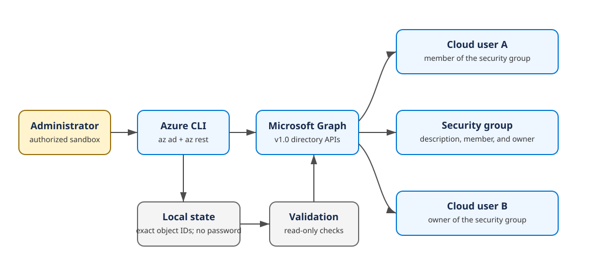

# Lab 01 — Create and manage Microsoft Entra users and groups

> **Status:** Offline-validated; tenant execution is pending.
> **Blueprint:** AZ-104 skills measured as of 2026-04-17.
> **Tenant changes:** Two cloud-only users, one security group, one membership, and one owner assignment.

Your organization is preparing a small Azure operations team. You must create two cloud-only identities, maintain useful user and group properties, give one user membership in an operations group, make the other user the group owner, prove the resulting state, and remove only the identities created by this run.

This lab uses Azure CLI's GA Microsoft Entra commands plus `az rest` for Microsoft Graph properties that the simplified `az ad` commands do not expose.

## Objectives

This lab directly covers:

| Objective | Skill practiced |
|---|---|
| `IG-USERS-01` | Create cloud-only users and a Microsoft Entra security group. |
| `IG-USERS-02` | Manage display, department, job title, office, group description, membership, and ownership properties. |

By the end, you can:

- distinguish Microsoft Entra roles from Azure RBAC roles;
- create cloud-only member users with verified-domain UPNs;
- create and describe a security group;
- manage direct group members and owners by object ID;
- validate positive state and a negative control;
- repair membership drift; and
- clean up active objects without broad tenant searches.

## Architecture



User A becomes a direct member. User B becomes the owner but deliberately remains outside the membership list. That difference creates a useful negative validation control.

## Time, cost, permissions, and risk

- **Time:** 60–75 minutes
- **Difficulty:** Foundational
- **Azure resource cost:** None
- **Licenses assigned:** None
- **Recommended directory role:** Microsoft Entra User Administrator in the disposable tenant
- **Azure RBAC role required:** None
- **Region:** Not applicable; Microsoft Entra objects are tenant-scoped
- **Safe-stop point:** Before setup is rerun with `--execute`
- **Cleanup behavior:** Group deletion is immediate; user deletion is recoverable unless separately purged

Use a dedicated non-production tenant. Owner or Contributor on an Azure subscription does not grant user-management permissions in Microsoft Entra ID. Conversely, User Administrator does not make someone Owner of Azure subscriptions.

This exercise does not require a paid license for the basic cloud-only users and security group it creates. Tenant policies, administrative units, restricted management administrative units, or protected accounts can still affect authorization. Never target production identities or privileged administrators.

## Command lane and offline-tested tools

The canonical lane is Bash with Azure CLI:

| Tool | Offline-tested version |
|---|---|
| Azure CLI | 2.88.0 |
| Bash | Git for Windows / GNU-compatible Bash |
| jq | 1.6 or newer |

Run commands from this lab directory. Azure Cloud Shell, a Linux dev container, WSL, or Git Bash can provide the Bash lane. The repository dev container is the most reproducible choice.

## What the scripts store

Setup creates a local manifest:

```text
.state/<run-id>/
└── run.json
```

Validation adds `validation.json`. State contains tenant ID, verified domain, synthetic display names, UPNs, exact object IDs, and expected properties. It never contains the temporary password, tokens, cookies, or Azure CLI credential cache.

The two user-creation request files exist only transiently with restrictive local permissions and are removed immediately after the Graph request. Do not run setup with shell tracing such as `bash -x` because tracing can expose secrets.

## Before you begin

1. Obtain permission to create and delete identities in a disposable tenant.
2. Confirm your signed-in administrator has the required Microsoft Entra role.
3. Choose one verified tenant domain, commonly a tenant's `*.onmicrosoft.com` domain.
4. Sign in yourself and review the tenant. Lab scripts never perform login or context changes.

```bash
az login --tenant '<sandbox-tenant-id>'
az account show --output table
az ad signed-in-user show \
  --query '{displayName:displayName,userPrincipalName:userPrincipalName,id:id}' \
  --output table
```

If you deliberately change tenants or subscriptions, do so before the lab and rerun the context checks. Do not hide context selection inside reusable scripts.

Set working values:

```bash
TENANT_ID='<sandbox-tenant-id>'
DOMAIN='<verified-tenant-domain>'
RUN_ID="az104l01-$(date -u +%Y%m%d%H%M%S)"
```

The run ID accepts 3–21 lowercase letters, digits, or hyphens.

<!-- BEGIN GENERATED INLINE COMMANDS -->
## Complete inline command implementation

The lifecycle commands below are the complete learner-facing implementation. They are embedded from the retained script files so the README and automation cannot drift. Review each stage here before running it. Use a different run ID if you later try the optional scripted lane against the same sandbox.

### Preflight: `scripts/cli/preflight.sh`

```bash
#!/usr/bin/env bash
set -Eeuo pipefail

usage() {
  cat <<'EOF'
Usage: preflight.sh --domain <verified-domain> [--tenant-id <tenant-guid>]

Runs read-only checks for the Lab 01 Azure CLI lane. The script never signs in,
changes context, assigns roles, or creates directory objects.
EOF
}

domain=""
expected_tenant_id=""

while (($#)); do
  case "$1" in
    --domain) domain="${2:-}"; shift 2 ;;
    --tenant-id) expected_tenant_id="${2:-}"; shift 2 ;;
    -h|--help) usage; exit 0 ;;
    *) echo "ERROR: Unknown argument: $1" >&2; usage >&2; exit 1 ;;
  esac
done

for tool in az jq; do
  if ! command -v "$tool" >/dev/null 2>&1; then
    echo "ERROR: Required tool not found: $tool" >&2
    exit 1
  fi
done

if [[ ! "$domain" =~ ^[A-Za-z0-9][A-Za-z0-9.-]*\.[A-Za-z]{2,}$ ]]; then
  echo "ERROR: --domain must be a verified DNS-style tenant domain." >&2
  exit 1
fi

if ! account_json=$(az account show --output json 2>/dev/null); then
  echo "ERROR: Azure CLI is not signed in. Run az login yourself and verify the tenant." >&2
  exit 1
fi

active_tenant_id=$(jq -r '.tenantId // empty' <<<"$account_json")
subscription_name=$(jq -r '.name // "<unknown>"' <<<"$account_json")
subscription_id=$(jq -r '.id // "<unknown>"' <<<"$account_json")

if [[ -z "$active_tenant_id" ]]; then
  echo "ERROR: The active Azure CLI context did not return a tenant ID." >&2
  exit 1
fi

if [[ -n "$expected_tenant_id" && "${active_tenant_id,,}" != "${expected_tenant_id,,}" ]]; then
  echo "ERROR: Active tenant $active_tenant_id does not match --tenant-id $expected_tenant_id." >&2
  exit 1
fi

graph_url="https://graph.microsoft.com/v1.0/domains/$domain?\$select=id,isVerified,authenticationType"
if ! domain_json=$(az rest --method get --url "$graph_url" --output json 2>/dev/null); then
  echo "ERROR: Microsoft Graph could not read domain '$domain'." >&2
  echo "Confirm the domain, Azure CLI sign-in, tenant role, and Graph access." >&2
  exit 1
fi

verified=$(jq -r '.isVerified // false' <<<"$domain_json")
if [[ "$verified" != "true" ]]; then
  echo "ERROR: Domain '$domain' is not reported as verified." >&2
  exit 1
fi

if ! az rest \
  --method get \
  --url 'https://graph.microsoft.com/v1.0/users?$top=1&$select=id,userPrincipalName' \
  --output none 2>/dev/null; then
  echo "ERROR: Microsoft Graph user discovery failed for the signed-in identity." >&2
  exit 1
fi

signed_in_upn=$(az ad signed-in-user show --query userPrincipalName --output tsv 2>/dev/null || true)

cat <<EOF
PASS: Azure CLI and Microsoft Graph read-only checks succeeded.
  Tenant ID:        $active_tenant_id
  Subscription:     $subscription_name ($subscription_id)
  Signed-in user:   ${signed_in_upn:-<not returned>}
  Verified domain:  $domain

Preflight cannot prove write authorization. The complete lab normally requires
Microsoft Entra User Administrator at the intended tenant scope. Azure RBAC roles
such as Owner or Contributor do not grant Microsoft Entra user management rights.
EOF
```

### Setup: `scripts/cli/setup.sh`

```bash
#!/usr/bin/env bash
set -Eeuo pipefail

usage() {
  cat <<'EOF'
Usage: setup.sh --run-id <id> --domain <verified-domain> [--tenant-id <guid>] [--execute]

Without --execute, prints the planned tenant changes. With --execute, creates two
cloud-only users and one security group. Set AZ104_LAB_INITIAL_PASSWORD in the
environment before execution. The password is never written to run.json.
EOF
}

run_id=""
domain=""
expected_tenant_id=""
execute=false

while (($#)); do
  case "$1" in
    --run-id) run_id="${2:-}"; shift 2 ;;
    --domain) domain="${2:-}"; shift 2 ;;
    --tenant-id) expected_tenant_id="${2:-}"; shift 2 ;;
    --execute) execute=true; shift ;;
    -h|--help) usage; exit 0 ;;
    *) echo "ERROR: Unknown argument: $1" >&2; usage >&2; exit 1 ;;
  esac
done

if [[ ! "$run_id" =~ ^[a-z0-9][a-z0-9-]{2,20}$ ]]; then
  echo "ERROR: --run-id must be 3-21 lowercase letters, digits, or hyphens." >&2
  exit 1
fi
if [[ ! "$domain" =~ ^[A-Za-z0-9][A-Za-z0-9.-]*\.[A-Za-z]{2,}$ ]]; then
  echo "ERROR: --domain must be a verified DNS-style tenant domain." >&2
  exit 1
fi

for tool in az jq; do
  command -v "$tool" >/dev/null 2>&1 || { echo "ERROR: Required tool not found: $tool" >&2; exit 1; }
done

script_dir=$(cd -- "$(dirname -- "${BASH_SOURCE[0]}")" && pwd)
lab_root=$(cd -- "$script_dir/../.." && pwd)
state_dir="$lab_root/.state/$run_id"
manifest="$state_dir/run.json"
compact_id=$(tr -cd 'a-z0-9' <<<"$run_id" | cut -c1-16)
user_a_alias="az104l01a${compact_id}"
user_b_alias="az104l01b${compact_id}"
group_alias="az104l01g${compact_id}"
user_a_upn="$user_a_alias@$domain"
user_b_upn="$user_b_alias@$domain"
user_a_name="AZ104-L01-$run_id-Alex"
user_b_name="AZ104-L01-$run_id-Blair"
group_name="AZ104-L01-$run_id-Operators"

cat <<EOF
Planned Microsoft Entra changes for run '$run_id':
  Create user:  $user_a_name ($user_a_upn)
  Create user:  $user_b_name ($user_b_upn)
  Create group: $group_name ($group_alias)
  Set user department/job title properties
  Add user A as a direct group member
  Add user B as a group owner

No Azure resources, licenses, roles, or subscriptions will be changed.
EOF

if [[ "$execute" != "true" ]]; then
  echo "PLAN ONLY: rerun with --execute after reviewing the tenant and names."
  exit 0
fi

if [[ -z "${AZ104_LAB_INITIAL_PASSWORD:-}" || ${#AZ104_LAB_INITIAL_PASSWORD} -lt 12 ]]; then
  echo "ERROR: Set AZ104_LAB_INITIAL_PASSWORD to a policy-compliant temporary password of at least 12 characters." >&2
  exit 1
fi

preflight_args=(--domain "$domain")
[[ -n "$expected_tenant_id" ]] && preflight_args+=(--tenant-id "$expected_tenant_id")
"$script_dir/preflight.sh" "${preflight_args[@]}"

if [[ -f "$manifest" ]]; then
  state_status=$(jq -r '.status // "unknown"' "$manifest")
  echo "Existing state found for '$run_id'; setup will not create or replace objects."
  if [[ "$state_status" == "created" ]]; then
    "$script_dir/validate.sh" --run-id "$run_id"
    exit $?
  fi
  echo "ERROR: The recorded run status is '$state_status', which can represent a partial or cleaned run." >&2
  echo "Review the manifest and use cleanup's exact-ID preview before choosing a new run ID." >&2
  exit 1
fi

if az ad user show --id "$user_a_upn" --output none >/dev/null 2>&1 \
  || az ad user show --id "$user_b_upn" --output none >/dev/null 2>&1; then
  echo "ERROR: A planned user already exists but is not recorded in this run." >&2
  exit 1
fi

group_collision=$(az ad group list --filter "mailNickname eq '$group_alias'" --query 'length(@)' --output tsv 2>/dev/null || echo 1)
if [[ "$group_collision" != "0" ]]; then
  echo "ERROR: A planned group alias already exists or collision detection failed." >&2
  exit 1
fi

umask 077
mkdir -p "$state_dir"
active_tenant_id=$(az account show --query tenantId --output tsv)
created_at=$(date -u +%Y-%m-%dT%H:%M:%SZ)

jq -n \
  --arg labId "LAB-01" \
  --arg runId "$run_id" \
  --arg tenantId "$active_tenant_id" \
  --arg domain "$domain" \
  --arg createdAt "$created_at" \
  --arg userAUpn "$user_a_upn" \
  --arg userBUpn "$user_b_upn" \
  --arg userAName "$user_a_name" \
  --arg userBName "$user_b_name" \
  --arg groupName "$group_name" \
  --arg groupAlias "$group_alias" \
  '{labId:$labId,runId:$runId,tenantId:$tenantId,domain:$domain,createdAt:$createdAt,status:"creating",names:{userA:{displayName:$userAName,userPrincipalName:$userAUpn},userB:{displayName:$userBName,userPrincipalName:$userBUpn},group:{displayName:$groupName,mailNickname:$groupAlias}},resources:[],passwordStored:false}' \
  >"$manifest"

update_manifest() {
  local filter="$1"
  shift
  jq "$@" "$filter" "$manifest" >"$manifest.tmp"
  mv -f "$manifest.tmp" "$manifest"
}

secret_file=""
secure_remove_secret() {
  [[ -z "$secret_file" || ! -f "$secret_file" ]] && return 0
  if command -v shred >/dev/null 2>&1; then
    shred -u "$secret_file"
  else
    rm -f "$secret_file"
  fi
}
trap secure_remove_secret EXIT

create_user() {
  local key="$1" display_name="$2" alias="$3" upn="$4" department="$5" title="$6"
  secret_file="$state_dir/.${key}-create.json"
  jq -n \
    --arg displayName "$display_name" \
    --arg mailNickname "$alias" \
    --arg userPrincipalName "$upn" \
    --arg password "$AZ104_LAB_INITIAL_PASSWORD" \
    '{accountEnabled:true,displayName:$displayName,mailNickname:$mailNickname,userPrincipalName:$userPrincipalName,passwordProfile:{forceChangePasswordNextSignIn:true,password:$password}}' \
    >"$secret_file"
  chmod 600 "$secret_file"

  local created_json object_id
  created_json=$(az rest --method post --url 'https://graph.microsoft.com/v1.0/users' --body "@$secret_file" --output json)
  secure_remove_secret
  secret_file=""
  object_id=$(jq -r '.id // empty' <<<"$created_json")
  [[ -n "$object_id" ]] || { echo "ERROR: Microsoft Graph did not return an object ID for $upn." >&2; return 1; }

  update_manifest '.resources += [{kind:"user",key:$key,id:$id,userPrincipalName:$upn,displayName:$name}]' \
    --arg key "$key" --arg id "$object_id" --arg upn "$upn" --arg name "$display_name"

  local patch_body
  patch_body=$(jq -nc --arg department "$department" --arg title "$title" --arg office "AZ104 Lab" '{department:$department,jobTitle:$title,officeLocation:$office}')
  az rest --method patch --url "https://graph.microsoft.com/v1.0/users/$object_id" --body "$patch_body" --output none
  printf '%s\n' "$object_id"
}

user_a_id=$(create_user "userA" "$user_a_name" "$user_a_alias" "$user_a_upn" "Cloud Operations" "Azure Administrator Trainee")
user_b_id=$(create_user "userB" "$user_b_name" "$user_b_alias" "$user_b_upn" "Identity Operations" "Identity Administrator Trainee")

group_json=$(az ad group create \
  --display-name "$group_name" \
  --mail-nickname "$group_alias" \
  --description "Initial AZ-104 Lab 01 group; runId=$run_id" \
  --output json)
group_id=$(jq -r '.id // empty' <<<"$group_json")
[[ -n "$group_id" ]] || { echo "ERROR: Azure CLI did not return a group object ID." >&2; exit 1; }

update_manifest '.resources += [{kind:"group",key:"group",id:$id,mailNickname:$alias,displayName:$name}]' \
  --arg id "$group_id" --arg alias "$group_alias" --arg name "$group_name"

managed_description="Managed AZ-104 Lab 01 security group; runId=$run_id"
group_patch=$(jq -nc --arg description "$managed_description" '{description:$description}')
az rest --method patch --url "https://graph.microsoft.com/v1.0/groups/$group_id" --body "$group_patch" --output none
az ad group member add --group "$group_id" --member-id "$user_a_id" --output none
az ad group owner add --group "$group_id" --owner-object-id "$user_b_id" --output none

completed_at=$(date -u +%Y-%m-%dT%H:%M:%SZ)
update_manifest '.status="created" | .completedAt=$completedAt | .relationships={memberUserId:$memberId,ownerUserId:$ownerId,groupId:$groupId} | .expected={userADepartment:"Cloud Operations",userBDepartment:"Identity Operations",userAJobTitle:"Azure Administrator Trainee",userBJobTitle:"Identity Administrator Trainee",officeLocation:"AZ104 Lab",groupDescription:$description}' \
  --arg completedAt "$completed_at" \
  --arg memberId "$user_a_id" \
  --arg ownerId "$user_b_id" \
  --arg groupId "$group_id" \
  --arg description "$managed_description"

unset AZ104_LAB_INITIAL_PASSWORD
echo "PASS: Lab 01 objects were created and exact object IDs were recorded in $manifest"
echo "Run: ./scripts/cli/validate.sh --run-id '$run_id'"
```

### Validate: `scripts/cli/validate.sh`

```bash
#!/usr/bin/env bash
set -Eeuo pipefail

usage() {
  echo "Usage: validate.sh --run-id <id>" >&2
}

run_id=""
while (($#)); do
  case "$1" in
    --run-id) run_id="${2:-}"; shift 2 ;;
    -h|--help) usage; exit 0 ;;
    *) echo "ERROR: Unknown argument: $1" >&2; usage; exit 1 ;;
  esac
done

if [[ ! "$run_id" =~ ^[a-z0-9][a-z0-9-]{2,20}$ ]]; then
  echo "ERROR: Invalid --run-id." >&2
  exit 1
fi
for tool in az jq; do
  command -v "$tool" >/dev/null 2>&1 || { echo "ERROR: Required tool not found: $tool" >&2; exit 1; }
done

script_dir=$(cd -- "$(dirname -- "${BASH_SOURCE[0]}")" && pwd)
lab_root=$(cd -- "$script_dir/../.." && pwd)
state_dir="$lab_root/.state/$run_id"
manifest="$state_dir/run.json"
report="$state_dir/validation.json"

[[ -f "$manifest" ]] || { echo "ERROR: Missing state manifest: $manifest" >&2; exit 1; }

umask 077
generated_at=$(date -u +%Y-%m-%dT%H:%M:%SZ)
jq -n --arg labId "LAB-01" --arg runId "$run_id" --arg generatedAt "$generated_at" '{labId:$labId,runId:$runId,generatedAt:$generatedAt,result:"skipped",checks:[]}' >"$report"

add_check() {
  local id="$1" status="$2" message="$3"
  jq --arg id "$id" --arg status "$status" --arg message "$message" '.checks += [{id:$id,status:$status,message:$message}]' "$report" >"$report.tmp"
  mv -f "$report.tmp" "$report"
}

tenant_id=$(jq -r '.tenantId // empty' "$manifest")
active_tenant_id=$(az account show --query tenantId --output tsv 2>/dev/null || true)
if [[ -n "$tenant_id" && "${tenant_id,,}" == "${active_tenant_id,,}" ]]; then
  add_check "context.tenant" "pass" "Active Azure CLI tenant matches the recorded tenant."
else
  add_check "context.tenant" "fail" "Active tenant does not match the recorded tenant; validation stopped before trusting directory results."
  jq '.result="fail"' "$report" >"$report.tmp"
  mv -f "$report.tmp" "$report"
  jq '{labId,runId,generatedAt,result,checks}' "$report"
  exit 1
fi

user_a_id=$(jq -r '.relationships.memberUserId // empty' "$manifest")
user_b_id=$(jq -r '.relationships.ownerUserId // empty' "$manifest")
group_id=$(jq -r '.relationships.groupId // empty' "$manifest")

validate_user() {
  local key="$1" object_id="$2" expected_upn="$3" expected_name="$4" expected_department="$5" expected_title="$6"
  local url user_json actual
  url="https://graph.microsoft.com/v1.0/users/$object_id?\$select=id,displayName,userPrincipalName,accountEnabled,department,jobTitle,officeLocation"
  if user_json=$(az rest --method get --url "$url" --output json 2>/dev/null); then
    actual=$(jq -r '[.id,.userPrincipalName,.displayName,(.accountEnabled|tostring),.department,.jobTitle,.officeLocation] | @tsv' <<<"$user_json")
    expected=$(printf '%s\t%s\t%s\ttrue\t%s\t%s\tAZ104 Lab' "$object_id" "$expected_upn" "$expected_name" "$expected_department" "$expected_title")
    if [[ "$actual" == "$expected" ]]; then
      add_check "identity.$key" "pass" "$expected_upn exists with the expected managed properties."
    else
      add_check "identity.$key" "fail" "$expected_upn exists but one or more managed properties drifted."
    fi
  else
    add_check "identity.$key" "fail" "Recorded user $expected_upn could not be read by exact object ID."
  fi
}

validate_user \
  "user-a" "$user_a_id" \
  "$(jq -r '.names.userA.userPrincipalName' "$manifest")" \
  "$(jq -r '.names.userA.displayName' "$manifest")" \
  "$(jq -r '.expected.userADepartment' "$manifest")" \
  "$(jq -r '.expected.userAJobTitle' "$manifest")"

validate_user \
  "user-b" "$user_b_id" \
  "$(jq -r '.names.userB.userPrincipalName' "$manifest")" \
  "$(jq -r '.names.userB.displayName' "$manifest")" \
  "$(jq -r '.expected.userBDepartment' "$manifest")" \
  "$(jq -r '.expected.userBJobTitle' "$manifest")"

group_url="https://graph.microsoft.com/v1.0/groups/$group_id?\$select=id,displayName,mailNickname,description,securityEnabled,mailEnabled"
if group_json=$(az rest --method get --url "$group_url" --output json 2>/dev/null); then
  group_actual=$(jq -r '[.id,.displayName,.mailNickname,.description,(.securityEnabled|tostring),(.mailEnabled|tostring)] | @tsv' <<<"$group_json")
  group_expected=$(printf '%s\t%s\t%s\t%s\ttrue\tfalse' \
    "$group_id" \
    "$(jq -r '.names.group.displayName' "$manifest")" \
    "$(jq -r '.names.group.mailNickname' "$manifest")" \
    "$(jq -r '.expected.groupDescription' "$manifest")")
  if [[ "$group_actual" == "$group_expected" ]]; then
    add_check "identity.group" "pass" "The recorded security group has the expected managed properties."
  else
    add_check "identity.group" "fail" "The recorded group exists but its type or managed properties drifted."
  fi
else
  add_check "identity.group" "fail" "The recorded group could not be read by exact object ID."
fi

member_value=$(az ad group member check --group "$group_id" --member-id "$user_a_id" --query value --output tsv 2>/dev/null || true)
if [[ "${member_value,,}" == "true" ]]; then
  add_check "relationship.member" "pass" "User A is a direct member of the lab group."
else
  add_check "relationship.member" "fail" "User A is not a direct member of the lab group."
fi

negative_member_value=$(az ad group member check --group "$group_id" --member-id "$user_b_id" --query value --output tsv 2>/dev/null || true)
if [[ "${negative_member_value,,}" == "false" ]]; then
  add_check "relationship.negative-member" "pass" "Negative control passed: user B is not a direct group member."
else
  add_check "relationship.negative-member" "fail" "Negative control failed: user B unexpectedly became a direct member."
fi

owner_count=$(az ad group owner list --group "$group_id" --query "[?id=='$user_b_id'] | length(@)" --output tsv 2>/dev/null || echo 0)
if [[ "$owner_count" == "1" ]]; then
  add_check "relationship.owner" "pass" "User B is an owner of the lab group."
else
  add_check "relationship.owner" "fail" "User B is not recorded as a group owner."
fi

failures=$(jq '[.checks[] | select(.status=="fail")] | length' "$report")
warnings=$(jq '[.checks[] | select(.status=="warning")] | length' "$report")
if ((failures > 0)); then
  result="fail"
  exit_code=1
elif ((warnings > 0)); then
  result="partial"
  exit_code=2
else
  result="pass"
  exit_code=0
fi

jq --arg result "$result" '.result=$result' "$report" >"$report.tmp"
mv -f "$report.tmp" "$report"
jq '{labId,runId,generatedAt,result,checks}' "$report"
exit "$exit_code"
```

### Cleanup: `scripts/cli/cleanup.sh`

```bash
#!/usr/bin/env bash
set -Eeuo pipefail

usage() {
  cat <<'EOF'
Usage: cleanup.sh --run-id <id> [--execute] [--purge-deleted-users]

Default behavior is a deletion preview. --execute deletes the exact recorded group
and users. User deletion is recoverable. --purge-deleted-users permanently removes
the two exact deleted user objects and is irreversible.
EOF
}

run_id=""
execute=false
purge=false
while (($#)); do
  case "$1" in
    --run-id) run_id="${2:-}"; shift 2 ;;
    --execute) execute=true; shift ;;
    --purge-deleted-users) purge=true; shift ;;
    -h|--help) usage; exit 0 ;;
    *) echo "ERROR: Unknown argument: $1" >&2; usage >&2; exit 1 ;;
  esac
done

if [[ ! "$run_id" =~ ^[a-z0-9][a-z0-9-]{2,20}$ ]]; then
  echo "ERROR: Invalid --run-id." >&2
  exit 1
fi
if [[ "$purge" == "true" && "$execute" != "true" ]]; then
  echo "ERROR: --purge-deleted-users requires --execute." >&2
  exit 1
fi
for tool in az jq; do
  command -v "$tool" >/dev/null 2>&1 || { echo "ERROR: Required tool not found: $tool" >&2; exit 1; }
done

script_dir=$(cd -- "$(dirname -- "${BASH_SOURCE[0]}")" && pwd)
lab_root=$(cd -- "$script_dir/../.." && pwd)
state_dir="$lab_root/.state/$run_id"
manifest="$state_dir/run.json"
[[ -f "$manifest" ]] || { echo "Nothing to clean: state does not exist for '$run_id'."; exit 0; }

tenant_id=$(jq -r '.tenantId // empty' "$manifest")
active_tenant_id=$(az account show --query tenantId --output tsv 2>/dev/null || true)
if [[ -z "$tenant_id" || "${tenant_id,,}" != "${active_tenant_id,,}" ]]; then
  echo "ERROR: Active tenant does not match the recorded tenant. No deletion attempted." >&2
  exit 1
fi

resource_count=$(jq '.resources | length' "$manifest")
unknown_resources=$(jq '[.resources[] | select((.kind!="user" and .kind!="group") or (.kind=="user" and (.key!="userA" and .key!="userB")) or (.id|type)!="string" or (.id|length)==0)] | length' "$manifest")
duplicate_keys=$(jq '[.resources[].key] | length != (unique | length)' "$manifest")
if ((resource_count > 3)) || [[ "$unknown_resources" != "0" || "$duplicate_keys" != "false" ]]; then
  echo "ERROR: State contains an unexpected, duplicate, or invalid directory object. No deletion attempted." >&2
  exit 1
fi

group_id=$(jq -r '[.resources[] | select(.kind=="group") | .id][0] // empty' "$manifest")
user_a_id=$(jq -r '[.resources[] | select(.key=="userA") | .id][0] // empty' "$manifest")
user_b_id=$(jq -r '[.resources[] | select(.key=="userB") | .id][0] // empty' "$manifest")

cat <<EOF
Deletion plan for tenant $tenant_id and run '$run_id':
  Group object ID: ${group_id:-<not recorded>}
  User A object ID: ${user_a_id:-<not recorded>}
  User B object ID: ${user_b_id:-<not recorded>}
  User deletion mode: $([[ "$purge" == "true" ]] && echo permanent-purge || echo recoverable-soft-delete)
EOF

if [[ "$execute" != "true" ]]; then
  echo "PLAN ONLY: rerun with --execute after reviewing the exact object IDs."
  exit 0
fi

expected_group_name=$(jq -r '.names.group.displayName' "$manifest")
if [[ -n "$group_id" ]] && group_json=$(az ad group show --group "$group_id" --output json 2>/dev/null); then
  actual_group_name=$(jq -r '.displayName // empty' <<<"$group_json")
  [[ "$actual_group_name" == "$expected_group_name" ]] || { echo "ERROR: Group identity check failed; refusing deletion." >&2; exit 1; }
  az ad group delete --group "$group_id" --output none
fi

delete_user_if_expected() {
  local object_id="$1" expected_upn="$2"
  if user_json=$(az ad user show --id "$object_id" --output json 2>/dev/null); then
    actual_upn=$(jq -r '.userPrincipalName // empty' <<<"$user_json")
    [[ "${actual_upn,,}" == "${expected_upn,,}" ]] || { echo "ERROR: User identity check failed for $object_id; refusing deletion." >&2; return 1; }
    az ad user delete --id "$object_id" --output none
  fi
}

[[ -n "$user_a_id" ]] && delete_user_if_expected "$user_a_id" "$(jq -r '.names.userA.userPrincipalName' "$manifest")"
[[ -n "$user_b_id" ]] && delete_user_if_expected "$user_b_id" "$(jq -r '.names.userB.userPrincipalName' "$manifest")"

if [[ "$purge" == "true" ]]; then
  echo "Permanently purging the two exact recorded deleted user IDs. This cannot be undone."
  for object_id in "$user_a_id" "$user_b_id"; do
    [[ -z "$object_id" ]] && continue
    az rest --method delete --url "https://graph.microsoft.com/v1.0/directory/deletedItems/$object_id" --output none
  done
fi

cleanup_at=$(date -u +%Y-%m-%dT%H:%M:%SZ)
jq --arg cleanupAt "$cleanup_at" --arg mode "$([[ "$purge" == "true" ]] && echo purged || echo soft-deleted)" '.status="cleaned" | .cleanup={completedAt:$cleanupAt,userDeletionMode:$mode}' "$manifest" >"$manifest.tmp"
mv -f "$manifest.tmp" "$manifest"

residual=0
[[ -n "$group_id" ]] && az ad group show --group "$group_id" --output none >/dev/null 2>&1 && residual=$((residual + 1))
[[ -n "$user_a_id" ]] && az ad user show --id "$user_a_id" --output none >/dev/null 2>&1 && residual=$((residual + 1))
[[ -n "$user_b_id" ]] && az ad user show --id "$user_b_id" --output none >/dev/null 2>&1 && residual=$((residual + 1))

if ((residual > 0)); then
  echo "ERROR: $residual active directory object(s) remain. Keep state and investigate." >&2
  exit 1
fi

echo "PASS: No active Lab 01 directory objects remain."
if [[ "$purge" != "true" ]]; then
  echo "INFO: The users remain recoverable in Deleted users until retention expires or an authorized permanent purge is performed."
fi
echo "Local audit state remains at $manifest. Remove it only after reviewing cleanup evidence."
```

<!-- END GENERATED INLINE COMMANDS -->
## Checkpoint 1 — Preflight the directory context

Predict whether an Azure subscription Owner without a Microsoft Entra role can create users. Then run the read-only preflight:

```bash
./scripts/cli/preflight.sh \
  --tenant-id "$TENANT_ID" \
  --domain "$DOMAIN"
```

Preflight verifies:

- Azure CLI and jq are available;
- the active Azure CLI context has the expected tenant ID;
- Microsoft Graph is reachable with the signed-in identity;
- the supplied domain exists and is verified; and
- basic user discovery is readable.

It cannot prove write authorization without attempting a write. If preflight passes but setup receives `Authorization_RequestDenied`, review the Microsoft Entra role assignment and scope rather than assigning an Azure subscription role.

## Checkpoint 2 — Review and create users

First run setup without `--execute`:

```bash
./scripts/cli/setup.sh \
  --run-id "$RUN_ID" \
  --tenant-id "$TENANT_ID" \
  --domain "$DOMAIN"
```

Expected result: a plan lists two UPNs and one group, but no state directory or tenant object is created.

When the tenant and names are correct, enter a policy-compliant temporary password without putting it in shell history:

```bash
read -rsp 'Temporary password for both disposable lab users: ' AZ104_LAB_INITIAL_PASSWORD
echo
export AZ104_LAB_INITIAL_PASSWORD

./scripts/cli/setup.sh \
  --run-id "$RUN_ID" \
  --tenant-id "$TENANT_ID" \
  --domain "$DOMAIN" \
  --execute

unset AZ104_LAB_INITIAL_PASSWORD
```

The password must satisfy the tenant's password policy. Both users are configured to change it at first sign-in, but this lab never signs in as either user.

Setup performs these actions:

1. Creates user A and user B through Microsoft Graph.
2. Applies department, job title, and office location properties.
3. Creates a security group with `az ad group create`.
4. Changes the group description through a Graph `PATCH` request.
5. Adds user A as a direct member.
6. Adds user B as an owner.
7. Records exact object IDs in `run.json`.

Inspect only the safe state fields:

```bash
jq '{labId,runId,tenantId,domain,status,names,resources,relationships,expected,passwordStored}' \
  ".state/$RUN_ID/run.json"
```

Expected result: three resources are recorded and `passwordStored` is `false`.

### Command evidence: users

Use the independent validator and exact object IDs to confirm both accounts are enabled. Retain only a minimal redacted result; do not retain the bootstrap password, access tokens, unrelated users, or a complete tenant inventory.

## Checkpoint 3 — Inspect managed properties

Read the exact object IDs from state:

```bash
USER_A_ID=$(jq -r '.relationships.memberUserId' ".state/$RUN_ID/run.json")
USER_B_ID=$(jq -r '.relationships.ownerUserId' ".state/$RUN_ID/run.json")
GROUP_ID=$(jq -r '.relationships.groupId' ".state/$RUN_ID/run.json")
```

Inspect user properties through Graph:

```bash
az rest \
  --method get \
  --url "https://graph.microsoft.com/v1.0/users/$USER_A_ID?\$select=displayName,userPrincipalName,accountEnabled,department,jobTitle,officeLocation" \
  --output json
```

Inspect the group:

```bash
az rest \
  --method get \
  --url "https://graph.microsoft.com/v1.0/groups/$GROUP_ID?\$select=displayName,mailNickname,description,securityEnabled,mailEnabled" \
  --output json
```

Expected group type: `securityEnabled=true` and `mailEnabled=false`. Its description contains this run ID. Display names are convenient for people but are not safe cleanup identifiers because directories can contain duplicates.

Record the exact redacted Graph response fields needed to prove the group type and managed description.

## Checkpoint 4 — Compare membership and ownership

Check the direct member:

```bash
az ad group member check \
  --group "$GROUP_ID" \
  --member-id "$USER_A_ID" \
  --output json
```

Expected: `value` is `true`.

List owners and members separately:

```bash
az ad group member list \
  --group "$GROUP_ID" \
  --query '[].{displayName:displayName,id:id}' \
  --output table

az ad group owner list \
  --group "$GROUP_ID" \
  --query '[].{displayName:displayName,id:id}' \
  --output table
```

User B owns the group but is not automatically a member. Ownership grants group-management capability according to tenant policy; it does not grant access that is assigned to group members.

Use the redacted member and owner command results as separate evidence; ownership must not be inferred from membership or vice versa.

## Checkpoint 5 — Validate positive and negative state

Run the read-only validator:

```bash
./scripts/cli/validate.sh --run-id "$RUN_ID"
jq '{result,checks}' ".state/$RUN_ID/validation.json"
```

Expected checks include:

- tenant context matches;
- both users have their exact expected properties;
- the group is a non-mail-enabled security group with the managed description;
- user A is a member;
- user B is not a member—the negative control; and
- user B is an owner.

Exit code `0` means pass, `1` means one or more required checks failed, and `2` means partial validation with warnings. The validator never repairs drift.

## Break/fix challenge — Missing membership

Simulate a common access incident by removing only user A's membership:

```bash
az ad group member remove \
  --group "$GROUP_ID" \
  --member-id "$USER_A_ID" \
  --output none

./scripts/cli/validate.sh --run-id "$RUN_ID"
```

Expected result: `relationship.member` fails while user and group property checks remain intact.

Repair the incident using exact IDs without recreating the user or group. Verify that user B remains an owner and does not become a member. The recovery commands and reasoning are in [solution/README.md](solution/README.md).

## Cleanup preview, execution, and audit

Preview first:

```bash
./scripts/cli/cleanup.sh --run-id "$RUN_ID"
```

For a completed run, the preview shows exactly one group ID and two user IDs. For a setup that failed partway through, it safely lists and deletes the recorded subset. Cleanup refuses an active-tenant mismatch, more than three objects, duplicate keys, unknown object types, or missing IDs.

Perform recoverable cleanup:

```bash
./scripts/cli/cleanup.sh --run-id "$RUN_ID" --execute
```

This deletes the group and soft-deletes both users. The script then confirms none of the three objects remains active. The user objects stay recoverable under **Users > Deleted users** until Microsoft Entra retention expires.

If tenant policy requires immediate permanent removal and you are explicitly authorized, preview the recorded IDs again, then use the irreversible mode:

```bash
./scripts/cli/cleanup.sh \
  --run-id "$RUN_ID" \
  --execute \
  --purge-deleted-users
```

Permanent purge cannot be undone and can require additional permissions. Do not use it on an ID that was not recorded by this run.

Cleanup retains local `run.json` as audit evidence. After reviewing the cleanup status, you may remove only `.state/$RUN_ID/` locally. The entire `.state/` tree is excluded from Git.

## Administrator and exam takeaways

- Microsoft Entra roles manage directory objects; Azure RBAC roles manage Azure resource access.
- A cloud user's UPN must use a verified tenant domain.
- Object IDs are immutable identifiers; display names can be duplicated and changed.
- A group owner and a group member are different relationships.
- Group membership can grant downstream access only where that group is assigned access.
- Direct membership checks do not automatically answer every transitive-membership question.
- Rich user and group properties can be managed through Microsoft Graph when a simplified CLI command lacks a parameter.
- Deleting a user normally moves it to Deleted users; permanent deletion is a separate lifecycle decision.
- Validation should detect drift, and cleanup should use recorded IDs rather than broad searches.

## Knowledge check

Complete the ten questions in [assessment/QUESTIONS.md](assessment/QUESTIONS.md) before opening [assessment/ANSWERS.md](assessment/ANSWERS.md). Questions are original learning material, not certification exam items.

## Official references

Last verified: **2026-08-30**.

- [AZ-104 study guide](https://learn.microsoft.com/en-us/credentials/certifications/resources/study-guides/az-104)
- [Azure CLI: manage Microsoft Entra users](https://learn.microsoft.com/en-us/cli/azure/ad/user?view=azure-cli-latest)
- [Azure CLI: manage Microsoft Entra groups](https://learn.microsoft.com/en-us/cli/azure/ad/group?view=azure-cli-latest)
- [Azure CLI: manage group members](https://learn.microsoft.com/en-us/cli/azure/ad/group/member?view=azure-cli-latest)
- [Microsoft Graph: create user](https://learn.microsoft.com/en-us/graph/api/user-post-users?view=graph-rest-1.0)
- [Microsoft Graph: create group](https://learn.microsoft.com/en-us/graph/api/group-post-groups?view=graph-rest-1.0)
- [Microsoft Entra built-in roles](https://learn.microsoft.com/en-us/entra/identity/role-based-access-control/permissions-reference)
- [Recover or permanently remove recently deleted users](https://learn.microsoft.com/en-us/entra/fundamentals/users-restore)

Permissions and commands evolve. Revalidate the documentation and command assertions whenever service behavior changes.
