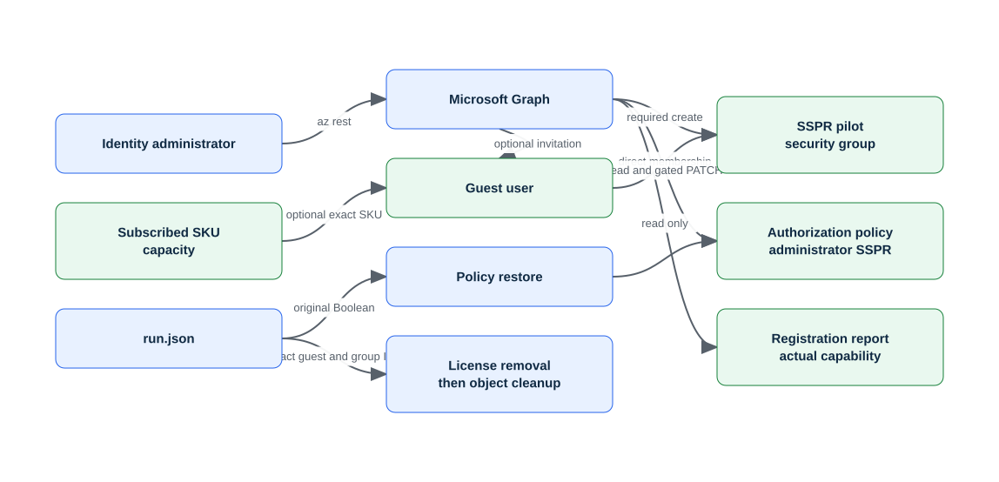

# Lab 02: Manage Entra licenses, guests, and self-service password reset

> Status: **offline-authored and contract-tested; live Azure verification is pending.**

Build a disposable identity cohort, inventory available licenses, invite an external user, and scope self-service password reset without assigning a license or changing tenant policy unless the required gates are explicitly supplied.

This folder is self-contained. It does not depend on another lab's runtime state. Use a disposable environment, keep the generated run manifest, and never substitute a production scope for a missing lab prerequisite.

## Learning objectives

| ID | Microsoft AZ-104 objective |
|---|---|
| `IG-USERS-03` | Manage licenses in Microsoft Entra ID |
| `IG-USERS-04` | Manage external users |
| `IG-USERS-05` | Configure self-service password reset (SSPR) |

Blueprint source: [Microsoft AZ-104 study guide](https://learn.microsoft.com/en-us/credentials/certifications/resources/study-guides/az-104), effective 2026-04-17.

## Architecture



The editable Mermaid source is [diagrams/architecture.mmd](diagrams/architecture.mmd). The diagram describes the learning boundary, not a production reference architecture.

## Scenario and outcome

You are the Azure administrator for a training environment. Your task is to implement the smallest isolated configuration that demonstrates the mapped exam objectives, validate it independently, retain redacted command evidence, and remove only what this run recorded.

The key design idea is: **SSPR and group-based licensing are tenant capabilities with role and license gates; inventory and scoped pilots are safer than tenant-wide changes.**

## Time, cost, and permissions

| Item | Value |
|---|---|
| Estimated time | 105 minutes |
| Cost class | `none` |
| Command surface | Microsoft Graph PowerShell |
| Required boundary | User Administrator and License Administrator; Authentication Policy Administrator for the SSPR policy path |
| External/live gate | Requires a real disposable guest email for invitation, an available SKU for license assignment, and an authorized tenant policy change for SSPR. |

Cost is not a fixed promise. Check current pricing, free allowances, quotas, and regional availability before using `--execute` or `-Execute`. Labs marked moderate or elevated should be cleaned up in the same study session.

## Resources and dependencies

| # | Intended resource or object |
|---:|---|
| 1 | security group |
| 2 | invited guest user |
| 3 | optional license assignment |
| 4 | optional SSPR scope |

- Resource providers observed by preflight: No Azure resource provider; tenant/Graph plane only
- PowerShell modules used when applicable: `Microsoft.Graph.Authentication`, `Microsoft.Graph.Users`, `Microsoft.Graph.Groups`, `Microsoft.Graph.Identity.SignIns`
- Repository state: `.state/<run-id>/run.json` and `.state/<run-id>/validation.json`
- Secrets, access keys, SAS tokens, generated passwords, and shared keys must remain in memory and must not enter the manifest, command evidence, or Git history.

## Safety contract

1. Preflight is read-only. It does not sign in, register providers, or switch the active context.
2. Setup is preview-only unless the explicit execution switch is supplied.
3. State is written before the first cloud mutation and updated with exact returned IDs.
4. Validation reads live state independently; it does not repair a failed configuration.
5. Cleanup previews exact targets, verifies run ownership, then requires the explicit execution switch.
6. Tenant-wide, DNS, licensing, notification, failover, and policy gates are never guessed.

## Before you begin

- Use a disposable non-production tenant/subscription and verify the displayed tenant and subscription IDs.
- Install the declared command surface and supporting dependencies.
- Confirm the role boundary above at the smallest possible scope.
- Review provider registration and quota output; preflight reports requirements but does not register providers.
- Read the external gate. An unavailable gate is a documented `skipped` checkpoint, not a pass.
- Choose a unique run ID matching `^[a-z0-9-]+$`, such as `az104l02-01`.

<!-- BEGIN GENERATED INLINE COMMANDS -->
## Complete inline command implementation

The lifecycle commands below are the complete learner-facing implementation. They are embedded from the retained script files so the README and automation cannot drift. Review each stage here before running it. Use a different run ID if you later try the optional scripted lane against the same sandbox.

### Preflight: `scripts/powershell/Preflight.ps1`

```powershell
#requires -Version 7.4
[CmdletBinding()]
[Diagnostics.CodeAnalysis.SuppressMessageAttribute('PSAvoidUsingWriteHost', '', Justification = 'Interactive lab progress is intentionally written to the host.')]
[Diagnostics.CodeAnalysis.SuppressMessageAttribute('PSReviewUnusedParameter', '', Justification = 'All lanes keep a consistent explicit context interface.')]
param(
    [string]$SubscriptionId = '',
    [Parameter(Mandatory)][string]$Location
)

$ErrorActionPreference = 'Stop'
$requiredModules = @(
    'Microsoft.Graph.Authentication',
    'Microsoft.Graph.Users',
    'Microsoft.Graph.Groups',
    'Microsoft.Graph.Identity.SignIns'
)
foreach ($module in $requiredModules) {
    if (-not (Get-Module -ListAvailable -Name $module)) { throw "Missing required module: $module" }
}

$graphContext = Get-MgContext
if (-not $graphContext) { throw 'No Microsoft Graph context is active. Sign in deliberately before running this lab.' }
Write-Host "Graph tenant: $($graphContext.TenantId)"
Write-Host "Graph account: $($graphContext.Account)"
Write-Host 'Lab: LAB-02'
Write-Host 'Location:' $Location
Write-Host 'Cost class: none'
Write-Host 'Role boundary: User Administrator and License Administrator; Authentication Policy Administrator for the SSPR policy path'
Write-Host 'Azure provider checks are not applicable to this tenant-scoped lab.'
Write-Host 'Preflight is read-only. It does not connect, change context, register providers, or create resources.'
```

### Setup: `scripts/powershell/Setup.ps1`

```powershell
#requires -Version 7.4
[CmdletBinding()]
[Diagnostics.CodeAnalysis.SuppressMessageAttribute('PSAvoidUsingWriteHost', '', Justification = 'Interactive lab progress is intentionally written to the host.')]
[Diagnostics.CodeAnalysis.SuppressMessageAttribute('PSReviewUnusedParameter', '', Justification = 'All lanes keep a consistent explicit context and region interface.')]
[Diagnostics.CodeAnalysis.SuppressMessageAttribute('PSUseDeclaredVarsMoreThanAssignments', '', Justification = 'Named checkpoint results improve readability even when the object is used only to enforce failure handling.')]
[Diagnostics.CodeAnalysis.SuppressMessageAttribute('PSAvoidUsingConvertToSecureStringWithPlainText', '', Justification = 'The disposable generated VMSS credential remains in memory and is never persisted.')]
param(
    [string]$SubscriptionId = '',
    [Parameter(Mandatory)][ValidatePattern('^[a-z0-9-]+$')][string]$RunId,
    [Parameter(Mandatory)][string]$Location,
    [string]$SecondaryLocation = $env:AZURE_SECONDARY_LOCATION,
    [switch]$Execute
)

$ErrorActionPreference = 'Stop'
$LabRoot = (Resolve-Path (Join-Path $PSScriptRoot '../..')).Path
$ResourceGroupName = 'rg-az104-l02-' + $RunId
$suffix = (($RunId -replace '[^a-z0-9]', '') + '000000000000').Substring(0, 12)
$StateDir = Join-Path $LabRoot ".state/$RunId"
$Manifest = Join-Path $StateDir 'run.json'

Write-Host 'LAB-02 plan'
Write-Host '  subscription:' $(if ($SubscriptionId) { $SubscriptionId } else { 'tenant-scoped / not applicable' })
Write-Host '  location:' $Location
Write-Host '  resource group:' $(if ($false) { $ResourceGroupName } else { 'none (tenant objects)' })
Write-Host '  cost class: none'
Write-Host '  external gate: Requires a real disposable guest email for invitation, an available SKU for license assignment, and an authorized tenant policy change for SSPR.'
Write-Host '  resources: security group, invited guest user, optional license assignment, optional SSPR scope'
if (-not $Execute) {
    Write-Host 'Preview only. Re-run with -Execute after approving context, permissions, cost, and gates.'
    return
}

& (Join-Path $PSScriptRoot 'Preflight.ps1') -Location $Location
if (Test-Path -LiteralPath $Manifest) { throw "State already exists at $Manifest; choose a new run ID." }
New-Item -ItemType Directory -Path $StateDir -Force | Out-Null
$graphContext = Get-MgContext
$TenantId = $graphContext.TenantId
$state = [ordered]@{
    labId = 'LAB-02'
    runId = $RunId
    tenantId = $TenantId
    subscriptionId = $SubscriptionId
    location = $Location
    createdAt = (Get-Date).ToUniversalTime().ToString('o')
    status = 'recorded-before-mutation'
    resourceGroup = [ordered]@{ name = $(if ($false) { $ResourceGroupName } else { $null }); id = $null }
    resources = @()
    external = [ordered]@{}
}
$state | ConvertTo-Json -Depth 20 | Set-Content -LiteralPath $Manifest -Encoding utf8


$displayName = "AZ104-L02-$RunId-SSPR-Pilot"
$group = New-MgGroup -DisplayName $displayName -MailEnabled:$false -MailNickname ("az104l02" + $suffix) -SecurityEnabled
$state.external.groupId = $group.Id
if ($env:AZ104_GUEST_EMAIL) {
    $invitation = New-MgInvitation -InvitedUserEmailAddress $env:AZ104_GUEST_EMAIL -InviteRedirectUrl 'https://myapps.microsoft.com' -SendInvitationMessage:$false
    $state.external.guestUserId = $invitation.InvitedUser.Id
}
if ($env:AZ104_LICENSE_SKU_ID -and $state.external.guestUserId) {
    Set-MgUserLicense -UserId $state.external.guestUserId -AddLicenses @(@{SkuId = [Guid]$env:AZ104_LICENSE_SKU_ID}) -RemoveLicenses @()
    $state.external.licenseSkuId = $env:AZ104_LICENSE_SKU_ID
}
if ($env:AZ104_ALLOW_SSPR_POLICY_CHANGE -eq 'YES') {
    $policy = Get-MgPolicyAuthorizationPolicy
    $state.external.originalAllowedToUseSspr = $policy.AllowedToUseSspr
    Update-MgPolicyAuthorizationPolicy -AllowedToUseSspr:$true
    $state.external.ssprChanged = $true
}

$state.status = 'setup-complete'
$state | ConvertTo-Json -Depth 20 | Set-Content -LiteralPath $Manifest -Encoding utf8
Write-Host "Setup complete. State: $Manifest"
Write-Host 'Run Validate.ps1 before recording command evidence.'
```

### Validate: `scripts/powershell/Validate.ps1`

```powershell
#requires -Version 7.4
[CmdletBinding()]
[Diagnostics.CodeAnalysis.SuppressMessageAttribute('PSReviewUnusedParameter', '', Justification = 'Tenant and subscription lanes share a consistent validation interface.')]
param(
    [string]$SubscriptionId = '',
    [Parameter(Mandatory)][ValidatePattern('^[a-z0-9-]+$')][string]$RunId
)

$ErrorActionPreference = 'Stop'
$LabRoot = (Resolve-Path (Join-Path $PSScriptRoot '../..')).Path
$StateDir = Join-Path $LabRoot ".state/$RunId"
$Manifest = Join-Path $StateDir 'run.json'
$Report = Join-Path $StateDir 'validation.json'
if (-not (Test-Path -LiteralPath $Manifest)) { throw "Missing state: $Manifest" }
$state = Get-Content -LiteralPath $Manifest -Raw | ConvertFrom-Json -Depth 20
$checks = [System.Collections.Generic.List[object]]::new()
function Add-Check([string]$Id, [string]$Status, [string]$Message) {
    $checks.Add([ordered]@{ id = $Id; status = $Status; message = $Message })
}

$graphContext = Get-MgContext
if (-not $graphContext) { throw 'No Microsoft Graph context is active.' }
if ($graphContext.TenantId -ne $state.tenantId) { throw 'Recorded tenant does not match the active Graph context.' }
$groupId = $state.external.groupId
if ($groupId) {
    $group = Get-MgGroup -GroupId $groupId -ErrorAction SilentlyContinue
    if ($group) { Add-Check 'entra.group' 'pass' 'The exact recorded pilot group exists.' }
    else { Add-Check 'entra.group' 'fail' 'The recorded pilot group is absent.' }
} else { Add-Check 'entra.group' 'warning' 'No group ID was recorded; setup did not reach the tenant mutation.' }
if ($state.external.guestUserId) {
    $guest = Get-MgUser -UserId $state.external.guestUserId -ErrorAction SilentlyContinue
    if ($guest) { Add-Check 'entra.guest' 'pass' 'The exact invited guest exists.' }
    else { Add-Check 'entra.guest' 'fail' 'A guest ID was recorded but the guest is absent.' }
} else { Add-Check 'entra.guest' 'skipped' 'Guest invitation was gated because AZ104_GUEST_EMAIL was not supplied.' }
$failures = @($checks | Where-Object status -eq 'fail').Count
$warnings = @($checks | Where-Object status -in @('warning','skipped')).Count
$result = if ($failures -gt 0) { 'fail' } elseif ($warnings -gt 0) { 'partial' } else { 'pass' }
$output = [ordered]@{ labId = 'LAB-02'; runId = $RunId; generatedAt = (Get-Date).ToUniversalTime().ToString('o'); result = $result; checks = @($checks) }
$output | ConvertTo-Json -Depth 20 | Set-Content -LiteralPath $Report -Encoding utf8
$output | ConvertTo-Json -Depth 20
if ($result -eq 'fail') { exit 1 }
```

### Cleanup: `scripts/powershell/Cleanup.ps1`

```powershell
#requires -Version 7.4
[CmdletBinding()]
[Diagnostics.CodeAnalysis.SuppressMessageAttribute('PSAvoidUsingWriteHost', '', Justification = 'Interactive cleanup previews are intentionally written to the host.')]
[Diagnostics.CodeAnalysis.SuppressMessageAttribute('PSReviewUnusedParameter', '', Justification = 'Tenant and subscription lanes share a consistent cleanup interface.')]
param(
    [string]$SubscriptionId = '',
    [Parameter(Mandatory)][ValidatePattern('^[a-z0-9-]+$')][string]$RunId,
    [switch]$Execute
)

$ErrorActionPreference = 'Stop'
$LabRoot = (Resolve-Path (Join-Path $PSScriptRoot '../..')).Path
$Manifest = Join-Path $LabRoot ".state/$RunId/run.json"
if (-not (Test-Path -LiteralPath $Manifest)) { throw "Missing state: $Manifest" }
$state = Get-Content -LiteralPath $Manifest -Raw | ConvertFrom-Json -Depth 20
Write-Host 'Cleanup preview for LAB-02'
Write-Host '  exact target:' $($state.external | ConvertTo-Json -Compress)
Write-Host '  residual/soft-delete behavior must be audited after deletion.'
if (-not $Execute) { Write-Host 'Preview only. Re-run with -Execute after checking every target.'; return }
$graphContext = Get-MgContext
if (-not $graphContext -or $graphContext.TenantId -ne $state.tenantId) { throw 'Active Graph tenant does not match the manifest.' }
if ($state.external.licenseSkuId -and $state.external.guestUserId) {
    Set-MgUserLicense -UserId $state.external.guestUserId -AddLicenses @() -RemoveLicenses @([Guid]$state.external.licenseSkuId)
}
if ($state.external.guestUserId) { Remove-MgUser -UserId $state.external.guestUserId -Confirm:$false -ErrorAction SilentlyContinue }
if ($state.external.groupId) { Remove-MgGroup -GroupId $state.external.groupId -Confirm:$false -ErrorAction SilentlyContinue }
if ($state.external.ssprChanged -and $null -ne $state.external.originalAllowedToUseSspr) {
    Update-MgPolicyAuthorizationPolicy -AllowedToUseSspr ([bool]$state.external.originalAllowedToUseSspr)
}
Write-Host 'Exact active tenant objects were removed. Deleted-user retention was not purged.'
$state.status = 'cleanup-complete'
$state | ConvertTo-Json -Depth 20 | Set-Content -LiteralPath $Manifest -Encoding utf8
```

<!-- END GENERATED INLINE COMMANDS -->
## Run the lab

The complete learner-facing implementations are embedded above. The commands in this section are optional shortcuts that run the identical retained script files. Run them from this lab folder. The examples intentionally use placeholders rather than silently reading an arbitrary subscription.

### 1. Preview

```ps1
pwsh ./scripts/powershell/Setup.ps1 -RunId az104l02-01 -Location <region>
```

Review the context, names, tags, cost class, providers, and gated branches printed by the script.

### 2. Execute the approved baseline

```ps1
pwsh ./scripts/powershell/Setup.ps1 -RunId az104l02-01 -Location <region> -Execute
```

The script records its run before creating resources. If a cloud operation fails partway through, keep the state directory and use validation plus cleanup against that exact run.

### 3. Complete and reason through the checkpoints

### Checkpoint 1: Create a security group that represents the SSPR pilot cohort

Create a security group that represents the SSPR pilot cohort.

Evidence to retain:

- The command output or exact resource/object ID for checkpoint 1.
- A positive assertion proving the intended state.
- A negative assertion showing that broader or anonymous access was not introduced.
- Any asynchronous operation state, timestamp, and final result.

### Checkpoint 2: Invite a disposable external account only when AZ104_GUEST_EMAIL is supplied

Invite a disposable external account only when AZ104_GUEST_EMAIL is supplied.

Evidence to retain:

- The command output or exact resource/object ID for checkpoint 2.
- A positive assertion proving the intended state.
- A negative assertion showing that broader or anonymous access was not introduced.
- Any asynchronous operation state, timestamp, and final result.

### Checkpoint 3: Inventory subscribed SKUs and assign only AZ104_LICENSE_SKU_ID when explicitly supplied

Inventory subscribed SKUs and assign only AZ104_LICENSE_SKU_ID when explicitly supplied.

Evidence to retain:

- The command output or exact resource/object ID for checkpoint 3.
- A positive assertion proving the intended state.
- A negative assertion showing that broader or anonymous access was not introduced.
- Any asynchronous operation state, timestamp, and final result.

### Checkpoint 4: Read the authorization policy and enable the gated SSPR pilot path only after AZ104_ALLOW_SSPR_POLICY_CHANGE=YES

Read the authorization policy and enable the gated SSPR pilot path only after AZ104_ALLOW_SSPR_POLICY_CHANGE=YES.

Evidence to retain:

- The command output or exact resource/object ID for checkpoint 4.
- A positive assertion proving the intended state.
- A negative assertion showing that broader or anonymous access was not introduced.
- Any asynchronous operation state, timestamp, and final result.

### 4. Validate independently

```ps1
pwsh ./scripts/powershell/Validate.ps1 -RunId az104l02-01
```

Inspect `.state/az104l02-01/validation.json`. A `pass` applies only to checks that could be executed. A gated or asynchronous path must remain `warning` or `skipped` until its evidence exists.

Positive checks should prove the intended resources, configuration, relationships, or health. Negative checks should prove that anonymous access, excess scope, accidental inheritance, unresolved DNS, unhealthy probes, or unrecorded resources were not introduced where the scenario forbids them.

## Break/fix exercise

1. Pick one reversible configuration created inside the recorded lab boundary.
2. Record the exact ID and current value.
3. Introduce one bounded mismatch; do not weaken a tenant-wide or production control.
4. Run validation and connect the failed check to an exact CLI/PowerShell query and the machine-readable validation result.
5. Repair only the identified setting, rerun validation, and compare the evidence.

The [solution notes](solution/README.md) provide a diagnostic sequence without hiding the reasoning behind an opaque repair script.

## Cleanup

Preview cleanup first:

```ps1
pwsh ./scripts/powershell/Cleanup.ps1 -RunId az104l02-01
```

After verifying every printed target belongs to this run:

```ps1
pwsh ./scripts/powershell/Cleanup.ps1 -RunId az104l02-01 -Execute
```

Run validation again after deletion. Some services use soft delete, retained recovery points, asynchronous deletion, or external DNS/tenant state; the cleanup report must distinguish active cleanup from retention and must list residual items instead of claiming success prematurely.

## Exam practice

- Complete [assessment/QUESTIONS.md](assessment/QUESTIONS.md) without opening the answer key.
- Review [assessment/ANSWERS.md](assessment/ANSWERS.md) and trace each explanation to its Microsoft Learn source.
- Revisit every mapped objective whose answer you could not justify from the resource state.

## Microsoft Learn sources

- [https://learn.microsoft.com/en-us/entra/fundamentals/how-to-manage-user-profile-info](https://learn.microsoft.com/en-us/entra/fundamentals/how-to-manage-user-profile-info)
- [https://learn.microsoft.com/en-us/entra/external-id/b2b-quickstart-invite-powershell](https://learn.microsoft.com/en-us/entra/external-id/b2b-quickstart-invite-powershell)
- [https://learn.microsoft.com/en-us/entra/identity/users/licensing-powershell-graph-examples](https://learn.microsoft.com/en-us/entra/identity/users/licensing-powershell-graph-examples)
- [https://learn.microsoft.com/en-us/entra/identity/authentication/tutorial-enable-sspr](https://learn.microsoft.com/en-us/entra/identity/authentication/tutorial-enable-sspr)

Last curriculum/source review: 2026-08-30. Azure interfaces and command modules evolve; confirm current syntax in the linked primary documentation before a live run.
