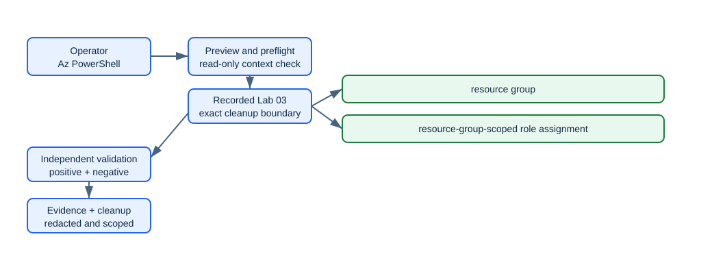

<!-- BEGIN GENERATED AZ104 V2 -->
# Lab 03: Assign and interpret Azure RBAC at multiple scopes

[Previous: Lab 02](../02-entra-licenses-guests-sspr/README.md) · [Catalog](../README.md) · [Next: Lab 04](../04-resource-hierarchy-tags-locks/README.md)

This self-contained lab uses Azure CLI commands hosted in PowerShell. Complete the guided lane or the automated lane—not both with the same run ID.

## Scenario, role, and outcome

Scenario: A platform administrator granting least-privilege access to a workload team is responding to an operational request: Build and interpret direct and inherited Azure RBAC assignments across resource-group and resource scopes, including a remediated over-privilege fault.

Learner role: A platform administrator granting least-privilege access to a workload team.

Outcome: Build and interpret direct and inherited Azure RBAC assignments across resource-group and resource scopes, including a remediated over-privilege fault.

| Item | Value |
|---|---|
| Duration | 90 minutes |
| Difficulty | foundational |
| Cost class | `none` |
| Command surface | Azure CLI (`az`, `az rest`, Bicep, AzCopy, or KQL where required) hosted in PowerShell |
| Live state | Not executed during this offline rebuild |

Completion criteria:

- All required checkpoints report pass.
- The deterministic break/fix is injected, diagnosed, and repaired.
- cleanup.json reports no active run-owned resources, with any retained item explicitly documented.

## Objectives and checkpoints

| Objective | Skill | Checkpoints |
|---|---|---|
| `IG-ACCESS-01` | Manage built-in Azure roles | `LAB03-CP01`, `LAB03-CP04`, `LAB03-CP05` |
| `IG-ACCESS-02` | Assign roles at different scopes | `LAB03-CP02`, `LAB03-CP05` |
| `IG-ACCESS-03` | Interpret access assignments | `LAB03-CP03`, `LAB03-CP05` |

The authoritative objective wording comes from the [Microsoft AZ-104 study guide](https://learn.microsoft.com/en-us/credentials/certifications/resources/study-guides/az-104), skills measured as of 2026-04-17.

## Architecture and service topology



The editable source is [architecture.mmd](diagrams/architecture.mmd). The principal receives Reader at the resource group. A child storage account inherits Reader and also receives a direct blob data-plane role. A temporary Contributor assignment demonstrates how scope and role definition combine to create excess access before exact-ID remediation.

## Concept primer and design decisions

Azure RBAC evaluation combines role definition, principal, scope, and inheritance. A role assignment is effective below its scope, while deny assignments and management-group inheritance can change the final result.

Design decisions:

- Use built-in roles before considering custom roles.
- Assign Reader at resource-group scope and Storage Blob Data Reader at one storage-account scope.
- Interpret control-plane actions, dataActions, direct assignments, and inheritance separately.

## Required and optional inputs

| Input | Required | Source | Safe example | Gate behavior |
|---|:---:|---|---|---|
| `run-id` — Unique lowercase run ownership identifier | Yes | parameter | `az104l03-01` | `block` |
| `subscription-id` — Expected disposable subscription ID | Yes | parameter-or-environment (`AZ104_SUBSCRIPTION_ID`) | `00000000-0000-0000-0000-000000000000` | `block` |
| `location` — Approved primary Azure region | Yes | parameter-or-environment (`AZ104_LOCATION`) | `westeurope` | `block` |
| `principal-object-id` — Disposable principal object ID | Yes | environment (`AZ104_PRINCIPAL_OBJECT_ID`) | `00000000-0000-0000-0000-000000000000` | `block` |

Secrets stay in temporary environment variables and are never written to `run.json`, validation evidence, or Git. A `skip-checkpoint` gate produces a visible partial result; it never becomes a pass.

## Read-only preflight

Sign in deliberately, inspect the active context, then run the lab preflight. It never signs in, changes context, installs an extension, registers a provider, or creates a resource.

```powershell
az login
az account show --query '{cloud:environmentName,subscription:id,tenant:tenantId,user:user.name}' --output json
./scripts/cli/Preflight.ps1 -SubscriptionId $env:AZ104_SUBSCRIPTION_ID -RunId 'az104l03-01' -Location 'westeurope'
```

Representative redacted output:

```text
context                 True  cloud=AzureCloud; tenant=<redacted>; subscription=<redacted>
azure-cli               True  2.88.x
provider:<namespace>    True  Registered
region                  True  westeurope
Preflight passed. It performed no Azure mutation.
```

If a required row fails, stop. Correct the local tool, context, provider, quota, SKU, region, permission, or input outside the lab, then rerun preflight.

## Task 1 — Resolve the principal and inspect existing scope inheritance {#task-1}

Checkpoint: `LAB03-CP01`

Purpose and operational relevance: Verify the exact principal object, built-in roles, and pre-existing assignments before creating new access. Display-name ambiguity and inherited access are common causes of incorrect RBAC conclusions.

Run these commands from PowerShell. If you already used the automated lane, choose a new run ID before trying this guided lane.

```powershell
$principal = az rest --method get --url "https://graph.microsoft.com/v1.0/directoryObjects/$($env:AZ104_PRINCIPAL_OBJECT_ID)" --output json | ConvertFrom-Json
if (-not $principal.id) { throw 'The supplied principal object ID was not found in the active tenant.' }
$state.inputs['principal-object-id'] = [string]$principal.id
Save-RunState
az role definition list --name Reader --query '[0].{id:id,actions:permissions[0].actions,dataActions:permissions[0].dataActions}' --output json
az role assignment list --scope "/subscriptions/$SubscriptionId/resourceGroups/$ResourceGroupName" --include-inherited --output table
```

Expected state: The exact principal resolves, Reader exposes control-plane read actions and no blob dataActions, and inherited baseline assignments are visible.

Representative redacted output:

```text
principal=<redacted>; Reader.actions=*/read; Reader.dataActions=[]; inheritedBaseline=<count>
```

Positive validation:

```powershell
$reader = @(az role definition list --name Reader --output json | ConvertFrom-Json)
if ($reader.Count -ne 1 -or '*/read' -notin $reader[0].permissions.actions) { throw 'Built-in Reader definition was not resolved as expected.' }
$reader[0].permissions
```

Expected positive result: Exactly one built-in Reader role definition includes */read.

Negative validation:

```powershell
$baseline = @(az role assignment list --assignee-object-id $principalObjectId --scope $scope --include-inherited --output json | ConvertFrom-Json)
$unexpected = @($baseline | Where-Object { $_.roleDefinitionName -in @('Owner','User Access Administrator') })
if ($unexpected.Count -gt 0) { throw 'The disposable principal already has elevated inherited access at the lab scope.' }
$baseline | Select-Object roleDefinitionName,scope
```

Expected negative result: The disposable principal has no pre-existing Owner or User Access Administrator assignment effective at lab scope.

Evidence to retain:

- `LAB03-CP01` UTC result for resolve the principal and inspect existing scope inheritance.
- Exact run-owned ID and asserted service properties from: Exactly one built-in Reader role definition includes */read.
- Negative-boundary outcome from: The disposable principal has no pre-existing Owner or User Access Administrator assignment effective at lab scope.
- Cleanup dependency recorded for the objects created or configured by LAB03-CP01.

Common failure and safe retry: The object belongs to another tenant or the signed-in administrator cannot read directory objects or assignments. Correct the exact object ID or authorization, then rerun the read-only baseline without changing assignments.

Cleanup dependency: This task only persists the non-secret principal ID.

## Task 2 — Assign Reader at resource-group scope and persist the assignment ID {#task-2}

Checkpoint: `LAB03-CP02`

Purpose and operational relevance: Create one least-privilege control-plane assignment at the workload lifecycle boundary. The assignment ID, not its friendly role name, is the deterministic rollback target.

Run these commands from PowerShell. If you already used the automated lane, choose a new run ID before trying this guided lane.

```powershell
$principalObjectId = [string]$state.inputs['principal-object-id']
$scope = "/subscriptions/$SubscriptionId/resourceGroups/$ResourceGroupName"
$odataType = az rest --method get --url "https://graph.microsoft.com/v1.0/directoryObjects/$principalObjectId" --query '"@odata.type"' --output tsv
$principalType = switch ($odataType) { '#microsoft.graph.user' { 'User' } '#microsoft.graph.group' { 'Group' } default { 'ServicePrincipal' } }
$assignment = az role assignment create --assignee-object-id $principalObjectId --assignee-principal-type $principalType --role Reader --scope $scope --output json | ConvertFrom-Json
Add-ManagedObject -CheckpointId 'LAB03-CP02' -Kind 'azure-resource' -Id ([string]$assignment.id) -Name 'Reader' -Type 'Microsoft.Authorization/roleAssignments' -Scope $scope -OwnershipMethod 'manifest-id'
```

Expected state: One direct Reader assignment exists at the exact resource-group scope and its ID is durable in run.json.

Representative redacted output:

```text
role=Reader; scope=.../resourceGroups/<redacted>; assignmentId=<redacted>
```

Positive validation:

```powershell
$direct = @(az role assignment list --assignee-object-id $principalObjectId --scope $scope --output json | ConvertFrom-Json | Where-Object { $_.roleDefinitionName -eq 'Reader' -and $_.scope -eq $scope })
if ($direct.Count -ne 1) { throw 'Expected one direct Reader assignment at resource-group scope.' }
$direct | Select-Object id,roleDefinitionName,scope
```

Expected positive result: Exactly one direct Reader assignment matches the principal and exact scope.

Negative validation:

```powershell
$directElevated = @(az role assignment list --assignee-object-id $principalObjectId --scope $scope --output json | ConvertFrom-Json | Where-Object roleDefinitionName -in @('Owner','Contributor','User Access Administrator'))
if ($directElevated.Count -gt 0) { throw 'An elevated direct assignment is present at resource-group scope.' }
'No elevated direct assignment.'
```

Expected negative result: No direct Owner, Contributor, or User Access Administrator assignment exists at the resource group.

Evidence to retain:

- `LAB03-CP02` UTC result for assign Reader at resource-group scope and persist the assignment ID.
- Exact run-owned ID and asserted service properties from: Exactly one direct Reader assignment matches the principal and exact scope.
- Negative-boundary outcome from: No direct Owner, Contributor, or User Access Administrator assignment exists at the resource group.
- Cleanup dependency recorded for the objects created or configured by LAB03-CP02.

Common failure and safe retry: The identity lacks role-assignment write permission or the supplied principal type cannot be resolved. List assignments for the exact principal and scope before retrying; record an existing matching assignment rather than cloning it.

Cleanup dependency: The assignment is removed with the resource group or by its exact manifest ID before residual validation.

## Task 3 — Add a resource-scoped blob data role {#task-3}

Checkpoint: `LAB03-CP03`

Purpose and operational relevance: Create a tagged storage account and assign Storage Blob Data Reader only at that child resource. Azure Reader grants control-plane visibility but no blob data access; dataActions require a separate data-plane role.

Run these commands from PowerShell. If you already used the automated lane, choose a new run ID before trying this guided lane.

```powershell
$storage = "st03$suffix"
$createdStorage = az storage account create --name $storage --resource-group $ResourceGroupName --location $Location --sku Standard_LRS --kind StorageV2 --https-only true --min-tls-version TLS1_2 --allow-blob-public-access false --tags purpose=az104-lab labId=03 runId=$RunId --output json | ConvertFrom-Json
$storageId = [string]$createdStorage.id
Add-ManagedObject -CheckpointId 'LAB03-CP03' -Kind 'azure-resource' -Id $storageId -Name $storage -Type 'Microsoft.Storage/storageAccounts' -Scope $scope -OwnershipMethod 'manifest-id-and-tags'
$dataAssignment = az role assignment create --assignee-object-id $principalObjectId --role 'Storage Blob Data Reader' --scope $storageId --output json | ConvertFrom-Json
Add-ManagedObject -CheckpointId 'LAB03-CP03' -Kind 'azure-resource' -Id ([string]$dataAssignment.id) -Name 'Storage Blob Data Reader' -Type 'Microsoft.Authorization/roleAssignments' -Scope $storageId -OwnershipMethod 'manifest-id'
```

Expected state: The storage account inherits Reader and has one direct Storage Blob Data Reader assignment for the principal.

Representative redacted output:

```text
effectiveRoles=Reader(inherited),Storage Blob Data Reader(direct); dataActions=blob/read
```

Positive validation:

```powershell
$storageId = az storage account show --name $storage --resource-group $ResourceGroupName --query id --output tsv
$effective = @(az role assignment list --assignee-object-id $principalObjectId --scope $storageId --include-inherited --output json | ConvertFrom-Json)
foreach ($role in @('Reader','Storage Blob Data Reader')) { if ($role -notin $effective.roleDefinitionName) { throw "Missing effective role: $role" } }
$effective | Select-Object roleDefinitionName,scope
```

Expected positive result: Reader is inherited from the resource group and Storage Blob Data Reader is direct at the storage account.

Negative validation:

```powershell
$dataRole = @(az role definition list --name 'Storage Blob Data Reader' --output json | ConvertFrom-Json)
if (@($dataRole[0].permissions.dataActions).Count -eq 0) { throw 'Blob data role contains no dataActions.' }
if ('Microsoft.Storage/storageAccounts/listKeys/action' -in $dataRole[0].permissions.actions) { throw 'Data reader unexpectedly permits key listing.' }
$dataRole[0].permissions
```

Expected negative result: The data role has blob read dataActions but cannot list storage keys.

Evidence to retain:

- `LAB03-CP03` UTC result for add a resource-scoped blob data role.
- Exact run-owned ID and asserted service properties from: Reader is inherited from the resource group and Storage Blob Data Reader is direct at the storage account.
- Negative-boundary outcome from: The data role has blob read dataActions but cannot list storage keys.
- Cleanup dependency recorded for the objects created or configured by LAB03-CP03.

Common failure and safe retry: Role propagation is delayed or the operator confuses Reader with a storage data-plane role. Requery exact assignment IDs and allow propagation; do not add broader roles to bypass delay.

Cleanup dependency: Remove the resource-scoped assignment before or with the storage account and resource group.

## Task 4 — Inject, detect, and remove an over-privileged assignment {#task-4}

Checkpoint: `LAB03-CP04`

Purpose and operational relevance: Create a temporary Contributor assignment, persist it before inspection, detect it by exact scope, and delete it by exact ID. Least-privilege reviews must identify effective excess access and produce an auditable rollback target.

Run these commands from PowerShell. If you already used the automated lane, choose a new run ID before trying this guided lane.

```powershell
$risky = az role assignment create --assignee-object-id $principalObjectId --role Contributor --scope $scope --output json | ConvertFrom-Json
Add-ManagedObject -CheckpointId 'LAB03-CP04' -Kind 'azure-resource' -Id ([string]$risky.id) -Name 'temporary-Contributor' -Type 'Microsoft.Authorization/roleAssignments' -Scope $scope -OwnershipMethod 'manifest-id'
$detected = @(az role assignment list --assignee-object-id $principalObjectId --scope $scope --output json | ConvertFrom-Json | Where-Object id -eq $risky.id)
if ($detected.Count -ne 1) { throw 'The injected Contributor assignment was not detected.' }
az role assignment delete --ids $risky.id
$record = @($state.managedObjects | Where-Object id -eq $risky.id)[0]
$record.lifecycleStatus = 'deleted'
Save-RunState
```

Expected state: The Contributor fault is observed once, removed by assignment ID, and retained only as deleted lifecycle evidence.

Representative redacted output:

```text
injected=Contributor; detected=1; remediated=True; lifecycleStatus=deleted
```

Positive validation:

```powershell
$remaining = @(az role assignment list --assignee-object-id $principalObjectId --scope $scope --output json | ConvertFrom-Json | Where-Object roleDefinitionName -eq 'Reader')
if ($remaining.Count -ne 1) { throw 'Least-privilege Reader assignment was damaged during remediation.' }
$remaining
```

Expected positive result: The intended Reader assignment remains after remediation.

Negative validation:

```powershell
$excess = @(az role assignment list --assignee-object-id $principalObjectId --scope $scope --output json | ConvertFrom-Json | Where-Object roleDefinitionName -eq 'Contributor')
if ($excess.Count -ne 0) { throw 'Contributor remains after break/fix remediation.' }
'Contributor assignments at exact scope: 0'
```

Expected negative result: No direct Contributor assignment remains at resource-group scope.

Evidence to retain:

- `LAB03-CP04` UTC result for inject, detect, and remove an over-privileged assignment.
- Exact run-owned ID and asserted service properties from: The intended Reader assignment remains after remediation.
- Negative-boundary outcome from: No direct Contributor assignment remains at resource-group scope.
- Cleanup dependency recorded for the objects created or configured by LAB03-CP04.

Common failure and safe retry: The assignment already exists, propagation delays detection, or a broad delete selector would remove Reader too. Query by exact assignment ID; if it exists, delete only that ID and preserve its manifest lifecycle record.

Cleanup dependency: A surviving injected assignment is cleaned by exact ID before the intended assignments or resource group.

## Task 5 — Build the final direct-versus-inherited access matrix {#task-5}

Checkpoint: `LAB03-CP05`

Purpose and operational relevance: Correlate role definitions, assignment scopes, inheritance, principal ID, and rollback IDs into one least-privilege record. Effective access is the union of assignments, while the rollback unit is each individual assignment ID.

Run these commands from PowerShell. If you already used the automated lane, choose a new run ID before trying this guided lane.

```powershell
$storageId = az storage account show --name $storage --resource-group $ResourceGroupName --query id --output tsv
$matrix = @(az role assignment list --assignee-object-id $principalObjectId --scope $storageId --include-inherited --output json | ConvertFrom-Json)
$matrix | Select-Object roleDefinitionName,scope,@{n='inherited';e={$_.scope -ne $storageId}}
```

Expected state: The final matrix shows only Reader inherited from the resource group and Storage Blob Data Reader direct at storage.

Representative redacted output:

```text
Reader | rg scope | inherited=True; Storage Blob Data Reader | storage scope | inherited=False
```

Positive validation:

```powershell
$storageId = az storage account show --name $storage --resource-group $ResourceGroupName --query id --output tsv
$matrix = @(az role assignment list --assignee-object-id $principalObjectId --scope $storageId --include-inherited --output json | ConvertFrom-Json)
if (@($matrix | Where-Object roleDefinitionName -in @('Reader','Storage Blob Data Reader')).Count -ne 2) { throw 'Final role matrix is incomplete.' }
$matrix
```

Expected positive result: Both intended effective roles are present at their designed scopes.

Negative validation:

```powershell
$all = @(az role assignment list --assignee-object-id $principalObjectId --all --output json | ConvertFrom-Json)
$labExcess = @($all | Where-Object { $_.scope -like "$scope*" -and $_.roleDefinitionName -in @('Owner','Contributor','User Access Administrator') })
if ($labExcess.Count -gt 0) { throw 'Elevated access remains inside the lab boundary.' }
'Elevated lab-scope assignments: 0'
```

Expected negative result: No elevated role remains at or below the lab resource-group scope.

Evidence to retain:

- `LAB03-CP05` UTC result for build the final direct-versus-inherited access matrix.
- Exact run-owned ID and asserted service properties from: Both intended effective roles are present at their designed scopes.
- Negative-boundary outcome from: No elevated role remains at or below the lab resource-group scope.
- Cleanup dependency recorded for the objects created or configured by LAB03-CP05.

Common failure and safe retry: Queries omit --include-inherited or use a broader subscription scope that obscures the workload boundary. Repeat the inventory at the storage resource ID and compare each assignment scope literally.

Cleanup dependency: Delete assignments by manifest ID, then the resource group; residual checks query the principal again at the former scope.

## Final validation and result interpretation

Run independent deployment validation after all required checkpoints:

```powershell
./scripts/cli/Validate.ps1 -RunId 'az104l03-01' -Mode Deployment
az resource list --resource-group 'rg-az104-l03-az104l03-01' --query '[].{name:name,type:type}' --output table
```

- `pass`: every required positive and negative check passed.
- `partial`: every required check passed, but at least one optional gate was deliberately skipped.
- `fail`: a required checkpoint failed; do not record the lab as complete.

Keep the redacted `validation.json`; do not retain credentials, tokens, access keys, certificate material, email addresses, tenant IDs, or unredacted command output.

## Deterministic break/fix exercise

Injection: Add Contributor at resource-group scope to the same principal.

Expected symptom: The effective matrix shows broad write actions in addition to the intended read roles.

Diagnose with a read-only service query:

```powershell
$baseline = @(az role assignment list --assignee-object-id $principalObjectId --scope $scope --include-inherited --output json | ConvertFrom-Json)
$unexpected = @($baseline | Where-Object { $_.roleDefinitionName -in @('Owner','User Access Administrator') })
if ($unexpected.Count -gt 0) { throw 'The disposable principal already has elevated inherited access at the lab scope.' }
$baseline | Select-Object roleDefinitionName,scope
```

Diagnosis: Filter the principal's assignments by exact scope and inspect Contributor actions instead of relying on a display name.

Repair: Delete only the injected assignment ID, then prove Reader and the storage data role remain.

Before/after evidence must show the failed negative or positive check before repair and the same check passing afterward. Do not inject a second fault until the first is removed.

## Optional job-style challenge

Produce a least-privilege recommendation for an operator who may read all resources but restart only one VM.

Deliver a short change record containing assumptions, exact commands, redacted evidence, cost and risk notes, rollback, and residual results. The challenge is optional and never changes required checkpoint status.

## Troubleshooting

| Symptom | Likely cause | Safe next step |
|---|---|---|
| Context mismatch | Active CLI context differs from `run.json` | Stop, inspect `az account show`, and select the intended disposable context yourself. |
| Provider or feature unavailable | Registration, region, feature, or SKU gate is unmet | Read the preflight result; do not register or enable tenant features implicitly. |
| Name already exists | The run ID is reused or a globally unique name collided | Keep existing state intact and choose a new run ID. |
| Expected state is delayed | The service is converging asynchronously | Repeat only the read-only query with bounded retries; do not duplicate creation. |
| Permission denied | Role, Graph scope, or data-plane authorization is insufficient | Confirm the declared least-privilege boundary; do not broaden access automatically. |
| Cleanup refuses ownership | ID, context, or tags differ from the manifest | Investigate the mismatch; never bypass ownership verification. |

## Cleanup and residual verification

Preview exact targets first, execute only after ownership review, then validate post-cleanup:

```powershell
./scripts/cli/Cleanup.ps1 -RunId 'az104l03-01'
./scripts/cli/Cleanup.ps1 -RunId 'az104l03-01' -Execute
./scripts/cli/Validate.ps1 -RunId 'az104l03-01' -Mode PostCleanup
$all = @(az role assignment list --assignee-object-id $principalObjectId --all --output json | ConvertFrom-Json)
$labExcess = @($all | Where-Object { $_.scope -like "$scope*" -and $_.roleDefinitionName -in @('Owner','Contributor','User Access Administrator') })
if ($labExcess.Count -gt 0) { throw 'Elevated access remains inside the lab boundary.' }
'Elevated lab-scope assignments: 0'
```

`cleanup.json` passes only when no active manifest-managed object remains. Soft-deleted or intentionally retained items must be listed with their reason and expected disposition. The lifecycle never performs irreversible purge automatically.

## Exam debrief and assessment

Explain why the expected state, negative check, and cleanup boundary matter—not only which command was used. Map any missed concept back to its task anchor before reviewing the answer key.

Complete [QUESTIONS.md](assessment/QUESTIONS.md), then use [ANSWERS.md](assessment/ANSWERS.md) for option-by-option remediation. Scores of 85–100% indicate mastery, 70–84% indicate targeted review, and below 70% means repeat the mapped tasks.

## Microsoft Learn sources

- [Microsoft AZ-104 study guide](https://learn.microsoft.com/en-us/credentials/certifications/resources/study-guides/az-104)
- [Assign Azure roles using Azure CLI](https://learn.microsoft.com/en-us/azure/role-based-access-control/role-assignments-cli)
- [Azure built-in roles reference](https://learn.microsoft.com/en-us/azure/role-based-access-control/built-in-roles)
- [List Azure role assignments using Azure CLI](https://learn.microsoft.com/en-us/azure/role-based-access-control/role-assignments-list-cli)
- [Check access for an Azure resource](https://learn.microsoft.com/en-us/azure/role-based-access-control/check-access)

## Lifecycle script appendix

The guided task blocks above and these executable scripts are generated from the same checkpoint data. The scripts are an optional automated lane; use a different run ID if you already completed the guided lane.

### `Preflight.ps1`

```powershell
# BEGIN GENERATED AZ104 V2
#requires -Version 7.4
[CmdletBinding()]
[Diagnostics.CodeAnalysis.SuppressMessageAttribute('PSAvoidUsingWriteHost', '', Justification = 'Interactive lab progress is intentionally written to the host.')]
[Diagnostics.CodeAnalysis.SuppressMessageAttribute('PSReviewUnusedParameter', '', Justification = 'All lifecycle scripts expose a stable cross-lab interface.')]
[Diagnostics.CodeAnalysis.SuppressMessageAttribute('PSUseDeclaredVarsMoreThanAssignments', '', Justification = 'Generated task variables are intentionally shared across checkpoint blocks.')]
param(
    [string]$SubscriptionId = $env:AZ104_SUBSCRIPTION_ID,
    [Parameter(Mandatory)][ValidatePattern('^[a-z0-9](?:[a-z0-9-]{0,30}[a-z0-9])?$')][string]$RunId,
    [Parameter(Mandatory)][ValidatePattern('^[a-z0-9]+$')][string]$Location,
    [string]$SecondaryLocation = $env:AZ104_SECONDARY_LOCATION
)

Set-StrictMode -Version Latest
$ErrorActionPreference = 'Stop'
$PSNativeCommandUseErrorActionPreference = $true

if (-not (Get-Command az -ErrorAction SilentlyContinue)) {
    throw 'Azure CLI is required. Run the repository readiness initializer, then retry.'
}

$account = az account show --output json | ConvertFrom-Json
if (-not $account) { throw 'No active Azure CLI context. Run az login deliberately before this lab.' }
if ($SubscriptionId -and [string]$account.id -ne $SubscriptionId) {
    throw "Context mismatch: active subscription is $($account.id), expected $SubscriptionId. Preflight will not switch it."
}
if (-not $SubscriptionId) { $SubscriptionId = [string]$account.id }
# The account read above is the mandatory context gate. All remaining Azure
# probes are collected as results instead of allowing one unavailable SKU or
# provider query to abort the readiness report before it can explain the gap.
$PSNativeCommandUseErrorActionPreference = $false
$suffix = (($RunId -replace '[^a-z0-9]', '') + '000000000000').Substring(0, 12)
$ResourceGroupName = $(if ('03' -in @('00', '01', '02')) { $null } else { "rg-az104-l03-$RunId" })

$checks = [System.Collections.Generic.List[object]]::new()
function Add-PreflightResult {
    param([string]$Id, [bool]$Required, [bool]$Passed, [string]$Actual)
    $checks.Add([pscustomobject]@{ id = $Id; required = $Required; passed = $Passed; actual = $Actual })
}

Add-PreflightResult -Id 'context' -Required $true -Passed $true -Actual "cloud=$($account.environmentName); tenant=<redacted>; subscription=<redacted>"
$azVersion = (az version --query '"azure-cli"' --output tsv)
$bicepVersion = (az bicep version 2>&1 | Out-String).Trim()
Add-PreflightResult -Id 'azure-cli' -Required $true -Passed ([bool]$azVersion) -Actual $azVersion
Add-PreflightResult -Id 'powershell' -Required $true -Passed ($PSVersionTable.PSVersion -ge [version]'7.4') -Actual $PSVersionTable.PSVersion.ToString()
Add-PreflightResult -Id 'bicep' -Required $true -Passed ([bool]$bicepVersion) -Actual $bicepVersion

$requiredEnvironmentVariables = @(
    'AZ104_PRINCIPAL_OBJECT_ID'
)
foreach ($variableName in $requiredEnvironmentVariables) {
    $present = -not [string]::IsNullOrWhiteSpace([Environment]::GetEnvironmentVariable($variableName))
    Add-PreflightResult -Id "input:$variableName" -Required $true -Passed $present -Actual $(if ($present) { 'present (value redacted)' } else { 'missing' })
}

$providers = @(
    'Microsoft.Authorization'
    'Microsoft.Resources'
)
foreach ($provider in $providers) {
    $registrationState = az provider show --namespace $provider --query registrationState --output tsv 2>$null
    Add-PreflightResult -Id "provider:$provider" -Required $true -Passed ($registrationState -eq 'Registered') -Actual $(if ($registrationState) { $registrationState } else { 'Unavailable' })
}

$knownLocation = az account list-locations --query "[?name=='$Location'].name | [0]" --output tsv
Add-PreflightResult -Id 'region' -Required $true -Passed ($knownLocation -eq $Location) -Actual $(if ($knownLocation) { $knownLocation } else { 'not available' })

$principalObjectId = [Environment]::GetEnvironmentVariable('AZ104_PRINCIPAL_OBJECT_ID')
$storage = "st03$suffix"

$probePassed = $true
$probeActual = 'assertion passed (output not persisted)'
try {
    $LASTEXITCODE = 0
    & {
$principal = az rest --method get --url "https://graph.microsoft.com/v1.0/directoryObjects/$principalObjectId?%24select=id" --output json | ConvertFrom-Json
if ($principal.id -ne $principalObjectId) { throw 'The supplied principal does not resolve in the active tenant.' }
foreach ($role in @('Reader','Storage Blob Data Reader')) {
    if (@(az role definition list --name $role --output json | ConvertFrom-Json).Count -ne 1) { throw "Built-in role not resolved: $role" }
}
    } | Out-Null
    if ($LASTEXITCODE -ne 0) { throw "native exit code $LASTEXITCODE" }
} catch {
    $probePassed = $false
    $probeActual = "assertion failed: $($_.Exception.GetType().Name)"
}
Add-PreflightResult -Id 'preflight.authored.lab03.principal-and-roles' -Required $true -Passed $probePassed -Actual $probeActual

$probePassed = $true
$probeActual = 'assertion passed (output not persisted)'
try {
    $LASTEXITCODE = 0
    & {
$availability = az storage account check-name --name $storage --output json | ConvertFrom-Json
if (-not $availability.nameAvailable) { throw "Storage name unavailable: $($availability.reason)" }
    } | Out-Null
    if ($LASTEXITCODE -ne 0) { throw "native exit code $LASTEXITCODE" }
} catch {
    $probePassed = $false
    $probeActual = "assertion failed: $($_.Exception.GetType().Name)"
}
Add-PreflightResult -Id 'preflight.authored.lab03.storage-name' -Required $true -Passed $probePassed -Actual $probeActual

$checks | Format-Table -AutoSize
$failedRequired = @($checks | Where-Object { $_.required -and -not $_.passed })
if ($failedRequired.Count -gt 0) {
    throw "Preflight blocked: $($failedRequired.id -join ', ')"
}
Write-Host 'Preflight passed. It performed no sign-in, context switch, provider registration, or Azure mutation.'
# END GENERATED AZ104 V2
```

### `Setup.ps1`

```powershell
# BEGIN GENERATED AZ104 V2
#requires -Version 7.4
[CmdletBinding()]
[Diagnostics.CodeAnalysis.SuppressMessageAttribute('PSAvoidUsingWriteHost', '', Justification = 'Interactive lab progress is intentionally written to the host.')]
[Diagnostics.CodeAnalysis.SuppressMessageAttribute('PSReviewUnusedParameter', '', Justification = 'All lifecycle scripts expose a stable cross-lab interface.')]
[Diagnostics.CodeAnalysis.SuppressMessageAttribute('PSUseDeclaredVarsMoreThanAssignments', '', Justification = 'Generated task variables are intentionally shared across checkpoint blocks.')]
param(
    [string]$SubscriptionId = $env:AZ104_SUBSCRIPTION_ID,
    [Parameter(Mandatory)][ValidatePattern('^[a-z0-9](?:[a-z0-9-]{0,30}[a-z0-9])?$')][string]$RunId,
    [Parameter(Mandatory)][ValidatePattern('^[a-z0-9]+$')][string]$Location,
    [string]$SecondaryLocation = $env:AZ104_SECONDARY_LOCATION,
    [switch]$AcknowledgeCost,
    [switch]$AcknowledgeTenantChange,
    [switch]$Execute
)

Set-StrictMode -Version Latest
$ErrorActionPreference = 'Stop'
$PSNativeCommandUseErrorActionPreference = $true

if (-not (Get-Command az -ErrorAction SilentlyContinue)) {
    throw 'Azure CLI is required. Run the repository readiness initializer, then retry.'
}

$LabRoot = (Resolve-Path (Join-Path $PSScriptRoot '../..')).Path
$StateDir = Join-Path $LabRoot ".state/$RunId"
$Manifest = Join-Path $StateDir 'run.json'
$ResourceGroupName = $(if ('03' -in @('00', '01', '02')) { $null } else { "rg-az104-l03-$RunId" })
$suffix = (($RunId -replace '[^a-z0-9]', '') + '000000000000').Substring(0, 12)

Write-Host 'LAB-03 execution plan'
Write-Host "  subscription: $SubscriptionId"
Write-Host "  location: $Location"
Write-Host '  command surface: Azure CLI hosted in PowerShell'
Write-Host '  state: run.json, validation.json, cleanup.json'
if (-not $Execute) {
    Write-Host 'Preview only. Review context, inputs, cost, tenant scope, and cleanup before using -Execute.'
    return
}
if ($false -and -not $AcknowledgeCost) { throw 'This lab requires -AcknowledgeCost before execution.' }
if ($false -and -not $AcknowledgeTenantChange) { throw 'This lab requires -AcknowledgeTenantChange before execution.' }

& (Join-Path $PSScriptRoot 'Preflight.ps1') -SubscriptionId $SubscriptionId -RunId $RunId -Location $Location -SecondaryLocation $SecondaryLocation
if (Test-Path -LiteralPath $Manifest) { throw "State already exists at $Manifest. Choose a new run ID." }
New-Item -ItemType Directory -Path $StateDir -Force | Out-Null
$account = az account show --output json | ConvertFrom-Json
if (-not $SubscriptionId) { $SubscriptionId = [string]$account.id }
$now = (Get-Date).ToUniversalTime().ToString('o')
$state = @{
    schemaVersion = '1.0.0'
    labId = 'LAB-03'
    runId = $RunId
    createdAt = $now
    updatedAt = $now
    status = 'initialized'
    context = @{ cloud = [string]$account.environmentName; tenantId = [string]$account.tenantId; subscriptionId = [string]$SubscriptionId }
    acknowledgements = @{ cost = [bool]$AcknowledgeCost; tenantChange = [bool]$AcknowledgeTenantChange }
    inputs = @{ 'location' = $Location; 'secondary-location' = $SecondaryLocation }
    checkpointStates = @(
        @{ checkpointId = 'LAB03-CP01'; required = $true; status = 'pending'; updatedAt = $now; message = 'Not started.' }
        @{ checkpointId = 'LAB03-CP02'; required = $true; status = 'pending'; updatedAt = $now; message = 'Not started.' }
        @{ checkpointId = 'LAB03-CP03'; required = $true; status = 'pending'; updatedAt = $now; message = 'Not started.' }
        @{ checkpointId = 'LAB03-CP04'; required = $true; status = 'pending'; updatedAt = $now; message = 'Not started.' }
        @{ checkpointId = 'LAB03-CP05'; required = $true; status = 'pending'; updatedAt = $now; message = 'Not started.' }
    )
    managedObjects = @()
    originalSettings = @()
}
$external = @{}

function Save-RunState {
    $state.updatedAt = (Get-Date).ToUniversalTime().ToString('o')
    $state | ConvertTo-Json -Depth 30 | Set-Content -LiteralPath $Manifest -Encoding utf8
}

function Save-ExternalState {
    foreach ($key in @($external.Keys)) {
        $value = $external[$key]
        if ($null -eq $value -or $value -is [string] -or $value -is [ValueType]) {
            $inputKey = 'external-' + (([string]$key -creplace '([a-z0-9])([A-Z])', '$1-$2') -replace '[^a-zA-Z0-9-]', '-').ToLowerInvariant()
            $state.inputs[$inputKey] = $value
        }
    }
    Save-RunState
}

function Write-CheckpointState {
    param([string]$CheckpointId, [string]$Status, [string]$Message)
    $entry = @($state.checkpointStates | Where-Object { $_.checkpointId -eq $CheckpointId })[0]
    $entry.status = $Status
    $entry.updatedAt = (Get-Date).ToUniversalTime().ToString('o')
    $entry.message = $Message
}

function Add-ManagedObject {
    param([string]$CheckpointId, [string]$Kind, [string]$Id, [string]$Name, [string]$Type, [string]$Scope, [string]$OwnershipMethod)
    if ([string]::IsNullOrWhiteSpace($Id)) { return }
    $existing = @($state.managedObjects | Where-Object { $_.id -eq $Id })
    if ($existing.Count -gt 0) { return }
    $expectedTags = @{}
    if ($OwnershipMethod -eq 'manifest-id-and-tags') {
        $expectedTags = @{ purpose = 'az104-lab'; labId = '03'; runId = $RunId }
    }
    $state.managedObjects += @{
        checkpointId = $CheckpointId
        kind = $Kind
        id = $Id
        name = $Name
        type = $Type
        scope = $Scope
        ownership = @{ method = $OwnershipMethod; expectedTags = $expectedTags }
        recordedAt = (Get-Date).ToUniversalTime().ToString('o')
        lifecycleStatus = 'active'
    }
    Save-RunState
}

function Sync-ManagedResource {
    param([string]$CheckpointId)
    # The entire recovery inventory is best effort so a state-helper or Azure
    # query failure cannot mask the original mutation error. Every object that
    # can be recovered is still persisted immediately as it is discovered.
    $nativePreference = $PSNativeCommandUseErrorActionPreference
    $PSNativeCommandUseErrorActionPreference = $false
    try {
        Save-ExternalState
        $resourceGroupNames = [System.Collections.Generic.HashSet[string]]::new([System.StringComparer]::OrdinalIgnoreCase)
        if ($ResourceGroupName) { $null = $resourceGroupNames.Add([string]$ResourceGroupName) }
        foreach ($key in @($external.Keys | Where-Object { [string]$_ -match '(?i)ResourceGroupName$' })) {
            if ($external[$key]) { $null = $resourceGroupNames.Add([string]$external[$key]) }
        }
        foreach ($groupName in $resourceGroupNames) {
            $groupJson = az group show --subscription $SubscriptionId --name $groupName --output json 2>$null
            $group = $(if ($LASTEXITCODE -eq 0 -and $groupJson) { $groupJson | ConvertFrom-Json } else { $null })
            if ($group) {
                $groupCheckpoint = $(if ([string]$group.name -eq [string]$ResourceGroupName) { 'LAB03-CP01' } else { $CheckpointId })
                Add-ManagedObject -CheckpointId $groupCheckpoint -Kind 'azure-resource' -Id ([string]$group.id) -Name ([string]$group.name) -Type 'Microsoft.Resources/resourceGroups' -Scope "/subscriptions/$SubscriptionId" -OwnershipMethod 'manifest-id-and-tags'
                $resourcesJson = az resource list --subscription $SubscriptionId --resource-group $groupName --output json 2>$null
                $resources = @($(if ($LASTEXITCODE -eq 0 -and $resourcesJson) { $resourcesJson | ConvertFrom-Json } else { @() }))
                foreach ($resource in $resources) {
                    Add-ManagedObject -CheckpointId $CheckpointId -Kind 'azure-resource' -Id ([string]$resource.id) -Name ([string]$resource.name) -Type ([string]$resource.type) -Scope ([string]$group.id) -OwnershipMethod 'manifest-id-and-tags'
                }
            }
        }
        if ($external.ContainsKey('groupId') -and $external.groupId) { Add-ManagedObject -CheckpointId $CheckpointId -Kind 'entra-object' -Id ([string]$external.groupId) -Name 'lab-group' -Type 'Microsoft.Graph/group' -Scope $state.context.tenantId -OwnershipMethod 'manifest-id' }
        if ($external.ContainsKey('guestUserId') -and $external.guestUserId) { Add-ManagedObject -CheckpointId $CheckpointId -Kind 'entra-object' -Id ([string]$external.guestUserId) -Name 'guest-user' -Type 'Microsoft.Graph/user' -Scope $state.context.tenantId -OwnershipMethod 'manifest-id' }
        if ($external.ContainsKey('userIds')) {
            foreach ($userId in @($external.userIds)) { Add-ManagedObject -CheckpointId $CheckpointId -Kind 'entra-object' -Id ([string]$userId) -Name 'lab-user' -Type 'Microsoft.Graph/user' -Scope $state.context.tenantId -OwnershipMethod 'manifest-id' }
        }
        if ($external.ContainsKey('delegationRecordId') -and $external.delegationRecordId) {
            Add-ManagedObject -CheckpointId $CheckpointId -Kind 'azure-resource' -Id ([string]$external.delegationRecordId) -Name ([string]$external.delegationRecordName) -Type 'Microsoft.Network/dnsZones/NS' -Scope ([string]$external.parentZoneId) -OwnershipMethod 'manifest-id'
        }
        if ($external.ContainsKey('connectionMonitorId') -and $external.connectionMonitorId) {
            Add-ManagedObject -CheckpointId $CheckpointId -Kind 'azure-resource' -Id ([string]$external.connectionMonitorId) -Name ([string]$external.connectionMonitorName) -Type 'Microsoft.Network/networkWatchers/connectionMonitors' -Scope ([string]$external.networkWatcherId) -OwnershipMethod 'manifest-id'
        }
    } catch {
        Write-Warning "Recovery inventory for $CheckpointId was incomplete: $($_.Exception.Message)"
    } finally {
        $PSNativeCommandUseErrorActionPreference = $nativePreference
    }
}

# The manifest exists before the first Azure mutation.
Save-RunState
$state.status = 'setup-in-progress'
Save-RunState

$expiresOn = (Get-Date).ToUniversalTime().AddDays(1).ToString('yyyy-MM-dd')
try {
    az group create --subscription $SubscriptionId --name $ResourceGroupName --location $Location --tags purpose=az104-lab labId=03 runId=$RunId expiresOn=$expiresOn --output none
} catch {
    Write-CheckpointState -CheckpointId 'LAB03-CP01' -Status 'fail' -Message "Resource-group boundary creation failed: $($_.Exception.GetType().Name)"
    $state.status = 'failed'
    Save-RunState
    throw
} finally {
    Sync-ManagedResource -CheckpointId 'LAB03-CP01'
}

# CHECKPOINT LAB03-CP01 BEGIN
try {
    Write-CheckpointState -CheckpointId 'LAB03-CP01' -Status 'in-progress' -Message 'Checkpoint execution started.'
    $activeCheckpointId = 'LAB03-CP01'
    Save-RunState

    $principal = az rest --method get --url "https://graph.microsoft.com/v1.0/directoryObjects/$($env:AZ104_PRINCIPAL_OBJECT_ID)" --output json | ConvertFrom-Json
    if (-not $principal.id) { throw 'The supplied principal object ID was not found in the active tenant.' }
    $state.inputs['principal-object-id'] = [string]$principal.id
    Save-RunState
    az role definition list --name Reader --query '[0].{id:id,actions:permissions[0].actions,dataActions:permissions[0].dataActions}' --output json
    az role assignment list --scope "/subscriptions/$SubscriptionId/resourceGroups/$ResourceGroupName" --include-inherited --output table

    Sync-ManagedResource -CheckpointId 'LAB03-CP01'
    Write-CheckpointState -CheckpointId 'LAB03-CP01' -Status 'pass' -Message 'The exact principal resolves, Reader exposes control-plane read actions and no blob dataActions, and inherited baseline assignments are visible.'
    Save-RunState
} catch {
    Sync-ManagedResource -CheckpointId 'LAB03-CP01'
    Write-CheckpointState -CheckpointId 'LAB03-CP01' -Status 'fail' -Message "Checkpoint failed: $($_.Exception.GetType().Name)"
    $state.status = 'failed'
    Save-RunState
    throw
}
# CHECKPOINT LAB03-CP01 END

# CHECKPOINT LAB03-CP02 BEGIN
try {
    Write-CheckpointState -CheckpointId 'LAB03-CP02' -Status 'in-progress' -Message 'Checkpoint execution started.'
    $activeCheckpointId = 'LAB03-CP02'
    Save-RunState

    $principalObjectId = [string]$state.inputs['principal-object-id']
    $scope = "/subscriptions/$SubscriptionId/resourceGroups/$ResourceGroupName"
    $odataType = az rest --method get --url "https://graph.microsoft.com/v1.0/directoryObjects/$principalObjectId" --query '"@odata.type"' --output tsv
    $principalType = switch ($odataType) { '#microsoft.graph.user' { 'User' } '#microsoft.graph.group' { 'Group' } default { 'ServicePrincipal' } }
    try {
        $assignment = az role assignment create --assignee-object-id $principalObjectId --assignee-principal-type $principalType --role Reader --scope $scope --output json | ConvertFrom-Json
    } finally {
        Sync-ManagedResource -CheckpointId 'LAB03-CP02'
    }
    Add-ManagedObject -CheckpointId 'LAB03-CP02' -Kind 'azure-resource' -Id ([string]$assignment.id) -Name 'Reader' -Type 'Microsoft.Authorization/roleAssignments' -Scope $scope -OwnershipMethod 'manifest-id'

    Sync-ManagedResource -CheckpointId 'LAB03-CP02'
    Write-CheckpointState -CheckpointId 'LAB03-CP02' -Status 'pass' -Message 'One direct Reader assignment exists at the exact resource-group scope and its ID is durable in run.json.'
    Save-RunState
} catch {
    Sync-ManagedResource -CheckpointId 'LAB03-CP02'
    Write-CheckpointState -CheckpointId 'LAB03-CP02' -Status 'fail' -Message "Checkpoint failed: $($_.Exception.GetType().Name)"
    $state.status = 'failed'
    Save-RunState
    throw
}
# CHECKPOINT LAB03-CP02 END

# CHECKPOINT LAB03-CP03 BEGIN
try {
    Write-CheckpointState -CheckpointId 'LAB03-CP03' -Status 'in-progress' -Message 'Checkpoint execution started.'
    $activeCheckpointId = 'LAB03-CP03'
    Save-RunState

    $storage = "st03$suffix"
    try {
        $createdStorage = az storage account create --name $storage --resource-group $ResourceGroupName --location $Location --sku Standard_LRS --kind StorageV2 --https-only true --min-tls-version TLS1_2 --allow-blob-public-access false --tags purpose=az104-lab labId=03 runId=$RunId --output json | ConvertFrom-Json
    } finally {
        Sync-ManagedResource -CheckpointId 'LAB03-CP03'
    }
    $storageId = [string]$createdStorage.id
    Add-ManagedObject -CheckpointId 'LAB03-CP03' -Kind 'azure-resource' -Id $storageId -Name $storage -Type 'Microsoft.Storage/storageAccounts' -Scope $scope -OwnershipMethod 'manifest-id-and-tags'
    try {
        $dataAssignment = az role assignment create --assignee-object-id $principalObjectId --role 'Storage Blob Data Reader' --scope $storageId --output json | ConvertFrom-Json
    } finally {
        Sync-ManagedResource -CheckpointId 'LAB03-CP03'
    }
    Add-ManagedObject -CheckpointId 'LAB03-CP03' -Kind 'azure-resource' -Id ([string]$dataAssignment.id) -Name 'Storage Blob Data Reader' -Type 'Microsoft.Authorization/roleAssignments' -Scope $storageId -OwnershipMethod 'manifest-id'

    Sync-ManagedResource -CheckpointId 'LAB03-CP03'
    Write-CheckpointState -CheckpointId 'LAB03-CP03' -Status 'pass' -Message 'The storage account inherits Reader and has one direct Storage Blob Data Reader assignment for the principal.'
    Save-RunState
} catch {
    Sync-ManagedResource -CheckpointId 'LAB03-CP03'
    Write-CheckpointState -CheckpointId 'LAB03-CP03' -Status 'fail' -Message "Checkpoint failed: $($_.Exception.GetType().Name)"
    $state.status = 'failed'
    Save-RunState
    throw
}
# CHECKPOINT LAB03-CP03 END

# CHECKPOINT LAB03-CP04 BEGIN
try {
    Write-CheckpointState -CheckpointId 'LAB03-CP04' -Status 'in-progress' -Message 'Checkpoint execution started.'
    $activeCheckpointId = 'LAB03-CP04'
    Save-RunState

    try {
        $risky = az role assignment create --assignee-object-id $principalObjectId --role Contributor --scope $scope --output json | ConvertFrom-Json
    } finally {
        Sync-ManagedResource -CheckpointId 'LAB03-CP04'
    }
    Add-ManagedObject -CheckpointId 'LAB03-CP04' -Kind 'azure-resource' -Id ([string]$risky.id) -Name 'temporary-Contributor' -Type 'Microsoft.Authorization/roleAssignments' -Scope $scope -OwnershipMethod 'manifest-id'
    $detected = @(az role assignment list --assignee-object-id $principalObjectId --scope $scope --output json | ConvertFrom-Json | Where-Object id -eq $risky.id)
    if ($detected.Count -ne 1) { throw 'The injected Contributor assignment was not detected.' }
    az role assignment delete --ids $risky.id
    $record = @($state.managedObjects | Where-Object id -eq $risky.id)[0]
    $record.lifecycleStatus = 'deleted'
    Save-RunState

    Sync-ManagedResource -CheckpointId 'LAB03-CP04'
    Write-CheckpointState -CheckpointId 'LAB03-CP04' -Status 'pass' -Message 'The Contributor fault is observed once, removed by assignment ID, and retained only as deleted lifecycle evidence.'
    Save-RunState
} catch {
    Sync-ManagedResource -CheckpointId 'LAB03-CP04'
    Write-CheckpointState -CheckpointId 'LAB03-CP04' -Status 'fail' -Message "Checkpoint failed: $($_.Exception.GetType().Name)"
    $state.status = 'failed'
    Save-RunState
    throw
}
# CHECKPOINT LAB03-CP04 END

# CHECKPOINT LAB03-CP05 BEGIN
try {
    Write-CheckpointState -CheckpointId 'LAB03-CP05' -Status 'in-progress' -Message 'Checkpoint execution started.'
    $activeCheckpointId = 'LAB03-CP05'
    Save-RunState

    $storageId = az storage account show --name $storage --resource-group $ResourceGroupName --query id --output tsv
    $matrix = @(az role assignment list --assignee-object-id $principalObjectId --scope $storageId --include-inherited --output json | ConvertFrom-Json)
    $matrix | Select-Object roleDefinitionName,scope,@{n='inherited';e={$_.scope -ne $storageId}}

    Sync-ManagedResource -CheckpointId 'LAB03-CP05'
    Write-CheckpointState -CheckpointId 'LAB03-CP05' -Status 'pass' -Message 'The final matrix shows only Reader inherited from the resource group and Storage Blob Data Reader direct at storage.'
    Save-RunState
} catch {
    Sync-ManagedResource -CheckpointId 'LAB03-CP05'
    Write-CheckpointState -CheckpointId 'LAB03-CP05' -Status 'fail' -Message "Checkpoint failed: $($_.Exception.GetType().Name)"
    $state.status = 'failed'
    Save-RunState
    throw
}
# CHECKPOINT LAB03-CP05 END

$skippedRequired = @($state.checkpointStates | Where-Object { $_.required -and $_.status -eq 'skipped' })
if ($skippedRequired.Count -gt 0) {
    $state.status = 'failed'
    Save-RunState
    throw "Required checkpoints were skipped: $($skippedRequired.checkpointId -join ', ')"
}
$skippedOptional = @($state.checkpointStates | Where-Object { -not $_.required -and $_.status -eq 'skipped' })
$state.status = $(if ($skippedOptional.Count -gt 0) { 'partial' } else { 'setup-complete' })
Save-RunState
Write-Host "Setup result: $($state.status). State: $Manifest"
Write-Host "Next: ./Validate.ps1 -RunId $RunId -Mode Deployment"
# END GENERATED AZ104 V2
```

### `Validate.ps1`

```powershell
# BEGIN GENERATED AZ104 V2
#requires -Version 7.4
[CmdletBinding()]
[Diagnostics.CodeAnalysis.SuppressMessageAttribute('PSAvoidUsingWriteHost', '', Justification = 'Interactive lab progress is intentionally written to the host.')]
[Diagnostics.CodeAnalysis.SuppressMessageAttribute('PSReviewUnusedParameter', '', Justification = 'All lifecycle scripts expose a stable cross-lab interface.')]
[Diagnostics.CodeAnalysis.SuppressMessageAttribute('PSUseDeclaredVarsMoreThanAssignments', '', Justification = 'Generated task variables are intentionally shared across checkpoint blocks.')]
param(
    [string]$SubscriptionId = $env:AZ104_SUBSCRIPTION_ID,
    [Parameter(Mandatory)][ValidatePattern('^[a-z0-9](?:[a-z0-9-]{0,30}[a-z0-9])?$')][string]$RunId,
    [ValidateSet('Deployment', 'PostCleanup')][string]$Mode = 'Deployment'
)

Set-StrictMode -Version Latest
$ErrorActionPreference = 'Stop'
$PSNativeCommandUseErrorActionPreference = $true

if (-not (Get-Command az -ErrorAction SilentlyContinue)) {
    throw 'Azure CLI is required. Run the repository readiness initializer, then retry.'
}

$LabRoot = (Resolve-Path (Join-Path $PSScriptRoot '../..')).Path
$StateDir = Join-Path $LabRoot ".state/$RunId"
$Manifest = Join-Path $StateDir 'run.json'
$ValidationPath = Join-Path $StateDir 'validation.json'
if (-not (Test-Path -LiteralPath $Manifest)) { throw "Run manifest not found: $Manifest" }
$state = Get-Content -LiteralPath $Manifest -Raw | ConvertFrom-Json -AsHashtable
if ($state.labId -ne 'LAB-03' -or $state.runId -ne $RunId) { throw 'Manifest ownership does not match this lab and run ID.' }
$PSNativeCommandUseErrorActionPreference = $false
$accountJson = az account show --output json 2>$null
$account = $(if ($LASTEXITCODE -eq 0 -and $accountJson) { $accountJson | ConvertFrom-Json } else { $null })
if (-not $account -or [string]$account.tenantId -ne [string]$state.context.tenantId -or [string]$account.id -ne [string]$state.context.subscriptionId) {
    $capturedAt = (Get-Date).ToUniversalTime().ToString('o')
    $actualContext = $(if ($account) { "tenant=$($account.tenantId); subscription=$($account.id)" } else { 'active context unavailable' })
    $contextFailure = @{
        schemaVersion = '1.0.0'; labId = 'LAB-03'; runId = $RunId; mode = $Mode
        generatedAt = $capturedAt; result = 'fail'
        summary = @{ required = 1; passed = 0; failed = 1; skipped = 0 }
        checks = @(@{ id = 'context.active'; checkpointId = 'LAB03-CP01'; kind = 'context'; required = $true; status = 'fail'; message = 'Active Azure context does not match the run manifest.'; evidence = @{ command = 'az account show --output json'; expected = 'tenant and subscription exactly match run.json'; actual = $actualContext; capturedAt = $capturedAt; redacted = $true } })
    }
    $contextFailure | ConvertTo-Json -Depth 30 | Set-Content -LiteralPath $ValidationPath -Encoding utf8
    Write-Host "Validation $Mode result: fail"
    Write-Host "Artifact: $ValidationPath"
    exit 1
}
$SubscriptionId = [string]$state.context.subscriptionId
$Location = [string]$state.inputs['location']
$SecondaryLocation = [string]$state.inputs['secondary-location']
$ResourceGroupName = $(if ('03' -in @('00', '01', '02')) { $null } else { "rg-az104-l03-$RunId" })
$suffix = (($RunId -replace '[^a-z0-9]', '') + '000000000000').Substring(0, 12)
$principalObjectId = [string]$state.inputs['principal-object-id']
$scope = "/subscriptions/$($state.context.subscriptionId)/resourceGroups/$ResourceGroupName"
$storage = "st03$suffix"

$checks = [System.Collections.Generic.List[object]]::new()
function Add-ValidationCheck {
    param([string]$Id, [string]$CheckpointId, [string]$Kind, [bool]$Required, [bool]$Passed, [string]$Command, [string]$Expected, [string]$Actual, [bool]$Skipped = $false)
    $capturedAt = (Get-Date).ToUniversalTime().ToString('o')
    $checks.Add(@{
        id = $Id
        checkpointId = $CheckpointId
        kind = $Kind
        required = $Required
        status = $(if ($Skipped) { 'skipped' } elseif ($Passed) { 'pass' } else { 'fail' })
        message = $(if ($Skipped) { 'Optional gate was deliberately skipped.' } elseif ($Passed) { 'Expected state observed.' } else { 'Expected state was not observed.' })
        evidence = @{ command = $Command; expected = $Expected; actual = $Actual; capturedAt = $capturedAt; redacted = $true }
    })
}

# CHECKPOINT LAB03-CP01 BEGIN
$checkpointState = @($state.checkpointStates | Where-Object { $_.checkpointId -eq 'LAB03-CP01' })[0]
$checkpointObjects = @($state.managedObjects | Where-Object { $_.checkpointId -eq 'LAB03-CP01' })

if ($Mode -eq 'Deployment') {
    if ($checkpointState.status -eq 'skipped') {
        Add-ValidationCheck -Id 'lab03-cp01.positive' -CheckpointId 'LAB03-CP01' -Kind 'positive' -Required ([bool]$checkpointState.required) -Passed $true -Skipped $true -Command 'optional gate evaluation' -Expected 'The optional checkpoint is explicitly skipped when its documented input is absent.' -Actual 'optional gate absent'
        Add-ValidationCheck -Id 'lab03-cp01.negative' -CheckpointId 'LAB03-CP01' -Kind 'negative' -Required ([bool]$checkpointState.required) -Passed $true -Skipped $true -Command 'optional gate evaluation' -Expected 'No mutation occurs for a skipped optional checkpoint.' -Actual 'optional gate absent'
    } else {
    $positivePassed = $checkpointState.status -eq 'pass'
    $positiveActual = "checkpoint=$($checkpointState.status); managedObjects=$($checkpointObjects.Count)"
    foreach ($managedObject in $checkpointObjects) {
        if ($managedObject.type -eq 'Microsoft.Management/managementGroups') {
            $null = az account management-group show --name $managedObject.name --output none 2>$null
            if ($LASTEXITCODE -ne 0) { $positivePassed = $false; $positiveActual += "; missing=$($managedObject.id)" }
        } elseif ($managedObject.kind -eq 'azure-resource') {
            $null = az resource show --ids $managedObject.id --output none 2>$null
            if ($LASTEXITCODE -ne 0) { $positivePassed = $false; $positiveActual += "; missing=$($managedObject.id)" }
        } elseif ($managedObject.kind -eq 'entra-object') {
            $null = az rest --method get --url "https://graph.microsoft.com/v1.0/directoryObjects/$($managedObject.id)" --output none 2>$null
            if ($LASTEXITCODE -ne 0) { $positivePassed = $false; $positiveActual += "; missing=$($managedObject.id)" }
        }
    }

    # AUTHORED SERVICE ASSERTION: positive
    try {
        $LASTEXITCODE = 0
        & {
$reader = @(az role definition list --name Reader --output json | ConvertFrom-Json)
if ($reader.Count -ne 1 -or '*/read' -notin $reader[0].permissions.actions) { throw 'Built-in Reader definition was not resolved as expected.' }
$reader[0].permissions
        } | Out-Null
        if ($LASTEXITCODE -ne 0) {
            $positivePassed = $false
            $positiveActual += "; serviceProbeExit=$LASTEXITCODE"
        } else {
            $positiveActual += '; serviceProbe=pass (output not persisted)'
        }
    } catch {
        $positivePassed = $false
        $positiveActual += "; serviceProbeError=$($_.Exception.GetType().Name)"
    }
    Add-ValidationCheck -Id 'lab03-cp01.positive' -CheckpointId 'LAB03-CP01' -Kind 'positive' -Required ([bool]$checkpointState.required) -Passed $positivePassed -Command 'query each manifest-recorded object by exact ID and run the authored service probe' -Expected 'Checkpoint state is pass, recorded objects exist, and service state matches.' -Actual $positiveActual

    $unsafe = @($checkpointObjects | Where-Object { $_.ownership.method -eq 'manifest-id-and-tags' -and ($_.ownership.expectedTags.runId -ne $RunId) })

    # AUTHORED SERVICE ASSERTION: negative
    $negativeProbePassed = $true
    $negativeProbeActual = 'serviceProbe=pass (output not persisted)'
    try {
        $LASTEXITCODE = 0
        & {
$baseline = @(az role assignment list --assignee-object-id $principalObjectId --scope $scope --include-inherited --output json | ConvertFrom-Json)
$unexpected = @($baseline | Where-Object { $_.roleDefinitionName -in @('Owner','User Access Administrator') })
if ($unexpected.Count -gt 0) { throw 'The disposable principal already has elevated inherited access at the lab scope.' }
$baseline | Select-Object roleDefinitionName,scope
        } | Out-Null
        if ($LASTEXITCODE -ne 0) {
            $negativeProbePassed = $false
            $negativeProbeActual = "serviceProbeExit=$LASTEXITCODE"
        }
    } catch {
        $negativeProbePassed = $false
        $negativeProbeActual = "serviceProbeError=$($_.Exception.GetType().Name)"
    }
    $negativePassed = $unsafe.Count -eq 0 -and $negativeProbePassed
    $negativeActual = "unsafeObjects=$($unsafe.Count)" + "; $negativeProbeActual"
    Add-ValidationCheck -Id 'lab03-cp01.negative' -CheckpointId 'LAB03-CP01' -Kind 'negative' -Required ([bool]$checkpointState.required) -Passed $negativePassed -Command 'run the authored denied-state probe and compare manifest ownership' -Expected 'The service boundary and ownership checks both pass.' -Actual $negativeActual
    }
} else {
    $active = [System.Collections.Generic.List[string]]::new()
    foreach ($managedObject in $checkpointObjects) {
        if ($managedObject.type -eq 'Microsoft.Management/managementGroups') {
            $null = az account management-group show --name $managedObject.name --output none 2>$null
            if ($LASTEXITCODE -eq 0) { $active.Add([string]$managedObject.id) }
        } elseif ($managedObject.kind -eq 'azure-resource') {
            $null = az resource show --ids $managedObject.id --output none 2>$null
            if ($LASTEXITCODE -eq 0) { $active.Add([string]$managedObject.id) }
        } elseif ($managedObject.kind -eq 'entra-object') {
            $null = az rest --method get --url "https://graph.microsoft.com/v1.0/directoryObjects/$($managedObject.id)" --output none 2>$null
            if ($LASTEXITCODE -eq 0) { $active.Add([string]$managedObject.id) }
        }
    }
    Add-ValidationCheck -Id 'lab03-cp01.residual' -CheckpointId 'LAB03-CP01' -Kind 'residual' -Required ([bool]$checkpointState.required) -Passed ($active.Count -eq 0) -Command 'query every recorded object by exact ID after cleanup' -Expected 'No active manifest-managed object remains.' -Actual "active=$($active -join ',')"
}
# CHECKPOINT LAB03-CP01 END

# CHECKPOINT LAB03-CP02 BEGIN
$checkpointState = @($state.checkpointStates | Where-Object { $_.checkpointId -eq 'LAB03-CP02' })[0]
$checkpointObjects = @($state.managedObjects | Where-Object { $_.checkpointId -eq 'LAB03-CP02' })

if ($Mode -eq 'Deployment') {
    if ($checkpointState.status -eq 'skipped') {
        Add-ValidationCheck -Id 'lab03-cp02.positive' -CheckpointId 'LAB03-CP02' -Kind 'positive' -Required ([bool]$checkpointState.required) -Passed $true -Skipped $true -Command 'optional gate evaluation' -Expected 'The optional checkpoint is explicitly skipped when its documented input is absent.' -Actual 'optional gate absent'
        Add-ValidationCheck -Id 'lab03-cp02.negative' -CheckpointId 'LAB03-CP02' -Kind 'negative' -Required ([bool]$checkpointState.required) -Passed $true -Skipped $true -Command 'optional gate evaluation' -Expected 'No mutation occurs for a skipped optional checkpoint.' -Actual 'optional gate absent'
    } else {
    $positivePassed = $checkpointState.status -eq 'pass'
    $positiveActual = "checkpoint=$($checkpointState.status); managedObjects=$($checkpointObjects.Count)"
    foreach ($managedObject in $checkpointObjects) {
        if ($managedObject.type -eq 'Microsoft.Management/managementGroups') {
            $null = az account management-group show --name $managedObject.name --output none 2>$null
            if ($LASTEXITCODE -ne 0) { $positivePassed = $false; $positiveActual += "; missing=$($managedObject.id)" }
        } elseif ($managedObject.kind -eq 'azure-resource') {
            $null = az resource show --ids $managedObject.id --output none 2>$null
            if ($LASTEXITCODE -ne 0) { $positivePassed = $false; $positiveActual += "; missing=$($managedObject.id)" }
        } elseif ($managedObject.kind -eq 'entra-object') {
            $null = az rest --method get --url "https://graph.microsoft.com/v1.0/directoryObjects/$($managedObject.id)" --output none 2>$null
            if ($LASTEXITCODE -ne 0) { $positivePassed = $false; $positiveActual += "; missing=$($managedObject.id)" }
        }
    }

    # AUTHORED SERVICE ASSERTION: positive
    try {
        $LASTEXITCODE = 0
        & {
$direct = @(az role assignment list --assignee-object-id $principalObjectId --scope $scope --output json | ConvertFrom-Json | Where-Object { $_.roleDefinitionName -eq 'Reader' -and $_.scope -eq $scope })
if ($direct.Count -ne 1) { throw 'Expected one direct Reader assignment at resource-group scope.' }
$direct | Select-Object id,roleDefinitionName,scope
        } | Out-Null
        if ($LASTEXITCODE -ne 0) {
            $positivePassed = $false
            $positiveActual += "; serviceProbeExit=$LASTEXITCODE"
        } else {
            $positiveActual += '; serviceProbe=pass (output not persisted)'
        }
    } catch {
        $positivePassed = $false
        $positiveActual += "; serviceProbeError=$($_.Exception.GetType().Name)"
    }
    Add-ValidationCheck -Id 'lab03-cp02.positive' -CheckpointId 'LAB03-CP02' -Kind 'positive' -Required ([bool]$checkpointState.required) -Passed $positivePassed -Command 'query each manifest-recorded object by exact ID and run the authored service probe' -Expected 'Checkpoint state is pass, recorded objects exist, and service state matches.' -Actual $positiveActual

    $unsafe = @($checkpointObjects | Where-Object { $_.ownership.method -eq 'manifest-id-and-tags' -and ($_.ownership.expectedTags.runId -ne $RunId) })

    # AUTHORED SERVICE ASSERTION: negative
    $negativeProbePassed = $true
    $negativeProbeActual = 'serviceProbe=pass (output not persisted)'
    try {
        $LASTEXITCODE = 0
        & {
$directElevated = @(az role assignment list --assignee-object-id $principalObjectId --scope $scope --output json | ConvertFrom-Json | Where-Object roleDefinitionName -in @('Owner','Contributor','User Access Administrator'))
if ($directElevated.Count -gt 0) { throw 'An elevated direct assignment is present at resource-group scope.' }
'No elevated direct assignment.'
        } | Out-Null
        if ($LASTEXITCODE -ne 0) {
            $negativeProbePassed = $false
            $negativeProbeActual = "serviceProbeExit=$LASTEXITCODE"
        }
    } catch {
        $negativeProbePassed = $false
        $negativeProbeActual = "serviceProbeError=$($_.Exception.GetType().Name)"
    }
    $negativePassed = $unsafe.Count -eq 0 -and $negativeProbePassed
    $negativeActual = "unsafeObjects=$($unsafe.Count)" + "; $negativeProbeActual"
    Add-ValidationCheck -Id 'lab03-cp02.negative' -CheckpointId 'LAB03-CP02' -Kind 'negative' -Required ([bool]$checkpointState.required) -Passed $negativePassed -Command 'run the authored denied-state probe and compare manifest ownership' -Expected 'The service boundary and ownership checks both pass.' -Actual $negativeActual
    }
} else {
    $active = [System.Collections.Generic.List[string]]::new()
    foreach ($managedObject in $checkpointObjects) {
        if ($managedObject.type -eq 'Microsoft.Management/managementGroups') {
            $null = az account management-group show --name $managedObject.name --output none 2>$null
            if ($LASTEXITCODE -eq 0) { $active.Add([string]$managedObject.id) }
        } elseif ($managedObject.kind -eq 'azure-resource') {
            $null = az resource show --ids $managedObject.id --output none 2>$null
            if ($LASTEXITCODE -eq 0) { $active.Add([string]$managedObject.id) }
        } elseif ($managedObject.kind -eq 'entra-object') {
            $null = az rest --method get --url "https://graph.microsoft.com/v1.0/directoryObjects/$($managedObject.id)" --output none 2>$null
            if ($LASTEXITCODE -eq 0) { $active.Add([string]$managedObject.id) }
        }
    }
    Add-ValidationCheck -Id 'lab03-cp02.residual' -CheckpointId 'LAB03-CP02' -Kind 'residual' -Required ([bool]$checkpointState.required) -Passed ($active.Count -eq 0) -Command 'query every recorded object by exact ID after cleanup' -Expected 'No active manifest-managed object remains.' -Actual "active=$($active -join ',')"
}
# CHECKPOINT LAB03-CP02 END

# CHECKPOINT LAB03-CP03 BEGIN
$checkpointState = @($state.checkpointStates | Where-Object { $_.checkpointId -eq 'LAB03-CP03' })[0]
$checkpointObjects = @($state.managedObjects | Where-Object { $_.checkpointId -eq 'LAB03-CP03' })

if ($Mode -eq 'Deployment') {
    if ($checkpointState.status -eq 'skipped') {
        Add-ValidationCheck -Id 'lab03-cp03.positive' -CheckpointId 'LAB03-CP03' -Kind 'positive' -Required ([bool]$checkpointState.required) -Passed $true -Skipped $true -Command 'optional gate evaluation' -Expected 'The optional checkpoint is explicitly skipped when its documented input is absent.' -Actual 'optional gate absent'
        Add-ValidationCheck -Id 'lab03-cp03.negative' -CheckpointId 'LAB03-CP03' -Kind 'negative' -Required ([bool]$checkpointState.required) -Passed $true -Skipped $true -Command 'optional gate evaluation' -Expected 'No mutation occurs for a skipped optional checkpoint.' -Actual 'optional gate absent'
    } else {
    $positivePassed = $checkpointState.status -eq 'pass'
    $positiveActual = "checkpoint=$($checkpointState.status); managedObjects=$($checkpointObjects.Count)"
    foreach ($managedObject in $checkpointObjects) {
        if ($managedObject.type -eq 'Microsoft.Management/managementGroups') {
            $null = az account management-group show --name $managedObject.name --output none 2>$null
            if ($LASTEXITCODE -ne 0) { $positivePassed = $false; $positiveActual += "; missing=$($managedObject.id)" }
        } elseif ($managedObject.kind -eq 'azure-resource') {
            $null = az resource show --ids $managedObject.id --output none 2>$null
            if ($LASTEXITCODE -ne 0) { $positivePassed = $false; $positiveActual += "; missing=$($managedObject.id)" }
        } elseif ($managedObject.kind -eq 'entra-object') {
            $null = az rest --method get --url "https://graph.microsoft.com/v1.0/directoryObjects/$($managedObject.id)" --output none 2>$null
            if ($LASTEXITCODE -ne 0) { $positivePassed = $false; $positiveActual += "; missing=$($managedObject.id)" }
        }
    }

    # AUTHORED SERVICE ASSERTION: positive
    try {
        $LASTEXITCODE = 0
        & {
$storageId = az storage account show --name $storage --resource-group $ResourceGroupName --query id --output tsv
$effective = @(az role assignment list --assignee-object-id $principalObjectId --scope $storageId --include-inherited --output json | ConvertFrom-Json)
foreach ($role in @('Reader','Storage Blob Data Reader')) { if ($role -notin $effective.roleDefinitionName) { throw "Missing effective role: $role" } }
$effective | Select-Object roleDefinitionName,scope
        } | Out-Null
        if ($LASTEXITCODE -ne 0) {
            $positivePassed = $false
            $positiveActual += "; serviceProbeExit=$LASTEXITCODE"
        } else {
            $positiveActual += '; serviceProbe=pass (output not persisted)'
        }
    } catch {
        $positivePassed = $false
        $positiveActual += "; serviceProbeError=$($_.Exception.GetType().Name)"
    }
    Add-ValidationCheck -Id 'lab03-cp03.positive' -CheckpointId 'LAB03-CP03' -Kind 'positive' -Required ([bool]$checkpointState.required) -Passed $positivePassed -Command 'query each manifest-recorded object by exact ID and run the authored service probe' -Expected 'Checkpoint state is pass, recorded objects exist, and service state matches.' -Actual $positiveActual

    $unsafe = @($checkpointObjects | Where-Object { $_.ownership.method -eq 'manifest-id-and-tags' -and ($_.ownership.expectedTags.runId -ne $RunId) })

    # AUTHORED SERVICE ASSERTION: negative
    $negativeProbePassed = $true
    $negativeProbeActual = 'serviceProbe=pass (output not persisted)'
    try {
        $LASTEXITCODE = 0
        & {
$dataRole = @(az role definition list --name 'Storage Blob Data Reader' --output json | ConvertFrom-Json)
if (@($dataRole[0].permissions.dataActions).Count -eq 0) { throw 'Blob data role contains no dataActions.' }
if ('Microsoft.Storage/storageAccounts/listKeys/action' -in $dataRole[0].permissions.actions) { throw 'Data reader unexpectedly permits key listing.' }
$dataRole[0].permissions
        } | Out-Null
        if ($LASTEXITCODE -ne 0) {
            $negativeProbePassed = $false
            $negativeProbeActual = "serviceProbeExit=$LASTEXITCODE"
        }
    } catch {
        $negativeProbePassed = $false
        $negativeProbeActual = "serviceProbeError=$($_.Exception.GetType().Name)"
    }
    $negativePassed = $unsafe.Count -eq 0 -and $negativeProbePassed
    $negativeActual = "unsafeObjects=$($unsafe.Count)" + "; $negativeProbeActual"
    Add-ValidationCheck -Id 'lab03-cp03.negative' -CheckpointId 'LAB03-CP03' -Kind 'negative' -Required ([bool]$checkpointState.required) -Passed $negativePassed -Command 'run the authored denied-state probe and compare manifest ownership' -Expected 'The service boundary and ownership checks both pass.' -Actual $negativeActual
    }
} else {
    $active = [System.Collections.Generic.List[string]]::new()
    foreach ($managedObject in $checkpointObjects) {
        if ($managedObject.type -eq 'Microsoft.Management/managementGroups') {
            $null = az account management-group show --name $managedObject.name --output none 2>$null
            if ($LASTEXITCODE -eq 0) { $active.Add([string]$managedObject.id) }
        } elseif ($managedObject.kind -eq 'azure-resource') {
            $null = az resource show --ids $managedObject.id --output none 2>$null
            if ($LASTEXITCODE -eq 0) { $active.Add([string]$managedObject.id) }
        } elseif ($managedObject.kind -eq 'entra-object') {
            $null = az rest --method get --url "https://graph.microsoft.com/v1.0/directoryObjects/$($managedObject.id)" --output none 2>$null
            if ($LASTEXITCODE -eq 0) { $active.Add([string]$managedObject.id) }
        }
    }
    Add-ValidationCheck -Id 'lab03-cp03.residual' -CheckpointId 'LAB03-CP03' -Kind 'residual' -Required ([bool]$checkpointState.required) -Passed ($active.Count -eq 0) -Command 'query every recorded object by exact ID after cleanup' -Expected 'No active manifest-managed object remains.' -Actual "active=$($active -join ',')"
}
# CHECKPOINT LAB03-CP03 END

# CHECKPOINT LAB03-CP04 BEGIN
$checkpointState = @($state.checkpointStates | Where-Object { $_.checkpointId -eq 'LAB03-CP04' })[0]
$checkpointObjects = @($state.managedObjects | Where-Object { $_.checkpointId -eq 'LAB03-CP04' })

if ($Mode -eq 'Deployment') {
    if ($checkpointState.status -eq 'skipped') {
        Add-ValidationCheck -Id 'lab03-cp04.positive' -CheckpointId 'LAB03-CP04' -Kind 'positive' -Required ([bool]$checkpointState.required) -Passed $true -Skipped $true -Command 'optional gate evaluation' -Expected 'The optional checkpoint is explicitly skipped when its documented input is absent.' -Actual 'optional gate absent'
        Add-ValidationCheck -Id 'lab03-cp04.negative' -CheckpointId 'LAB03-CP04' -Kind 'negative' -Required ([bool]$checkpointState.required) -Passed $true -Skipped $true -Command 'optional gate evaluation' -Expected 'No mutation occurs for a skipped optional checkpoint.' -Actual 'optional gate absent'
    } else {
    $positivePassed = $checkpointState.status -eq 'pass'
    $positiveActual = "checkpoint=$($checkpointState.status); managedObjects=$($checkpointObjects.Count)"
    foreach ($managedObject in $checkpointObjects) {
        if ($managedObject.type -eq 'Microsoft.Management/managementGroups') {
            $null = az account management-group show --name $managedObject.name --output none 2>$null
            if ($LASTEXITCODE -ne 0) { $positivePassed = $false; $positiveActual += "; missing=$($managedObject.id)" }
        } elseif ($managedObject.kind -eq 'azure-resource') {
            $null = az resource show --ids $managedObject.id --output none 2>$null
            if ($LASTEXITCODE -ne 0) { $positivePassed = $false; $positiveActual += "; missing=$($managedObject.id)" }
        } elseif ($managedObject.kind -eq 'entra-object') {
            $null = az rest --method get --url "https://graph.microsoft.com/v1.0/directoryObjects/$($managedObject.id)" --output none 2>$null
            if ($LASTEXITCODE -ne 0) { $positivePassed = $false; $positiveActual += "; missing=$($managedObject.id)" }
        }
    }

    # AUTHORED SERVICE ASSERTION: positive
    try {
        $LASTEXITCODE = 0
        & {
$remaining = @(az role assignment list --assignee-object-id $principalObjectId --scope $scope --output json | ConvertFrom-Json | Where-Object roleDefinitionName -eq 'Reader')
if ($remaining.Count -ne 1) { throw 'Least-privilege Reader assignment was damaged during remediation.' }
$remaining
        } | Out-Null
        if ($LASTEXITCODE -ne 0) {
            $positivePassed = $false
            $positiveActual += "; serviceProbeExit=$LASTEXITCODE"
        } else {
            $positiveActual += '; serviceProbe=pass (output not persisted)'
        }
    } catch {
        $positivePassed = $false
        $positiveActual += "; serviceProbeError=$($_.Exception.GetType().Name)"
    }
    Add-ValidationCheck -Id 'lab03-cp04.positive' -CheckpointId 'LAB03-CP04' -Kind 'positive' -Required ([bool]$checkpointState.required) -Passed $positivePassed -Command 'query each manifest-recorded object by exact ID and run the authored service probe' -Expected 'Checkpoint state is pass, recorded objects exist, and service state matches.' -Actual $positiveActual

    $unsafe = @($checkpointObjects | Where-Object { $_.ownership.method -eq 'manifest-id-and-tags' -and ($_.ownership.expectedTags.runId -ne $RunId) })

    # AUTHORED SERVICE ASSERTION: negative
    $negativeProbePassed = $true
    $negativeProbeActual = 'serviceProbe=pass (output not persisted)'
    try {
        $LASTEXITCODE = 0
        & {
$excess = @(az role assignment list --assignee-object-id $principalObjectId --scope $scope --output json | ConvertFrom-Json | Where-Object roleDefinitionName -eq 'Contributor')
if ($excess.Count -ne 0) { throw 'Contributor remains after break/fix remediation.' }
'Contributor assignments at exact scope: 0'
        } | Out-Null
        if ($LASTEXITCODE -ne 0) {
            $negativeProbePassed = $false
            $negativeProbeActual = "serviceProbeExit=$LASTEXITCODE"
        }
    } catch {
        $negativeProbePassed = $false
        $negativeProbeActual = "serviceProbeError=$($_.Exception.GetType().Name)"
    }
    $negativePassed = $unsafe.Count -eq 0 -and $negativeProbePassed
    $negativeActual = "unsafeObjects=$($unsafe.Count)" + "; $negativeProbeActual"
    Add-ValidationCheck -Id 'lab03-cp04.negative' -CheckpointId 'LAB03-CP04' -Kind 'negative' -Required ([bool]$checkpointState.required) -Passed $negativePassed -Command 'run the authored denied-state probe and compare manifest ownership' -Expected 'The service boundary and ownership checks both pass.' -Actual $negativeActual
    }
} else {
    $active = [System.Collections.Generic.List[string]]::new()
    foreach ($managedObject in $checkpointObjects) {
        if ($managedObject.type -eq 'Microsoft.Management/managementGroups') {
            $null = az account management-group show --name $managedObject.name --output none 2>$null
            if ($LASTEXITCODE -eq 0) { $active.Add([string]$managedObject.id) }
        } elseif ($managedObject.kind -eq 'azure-resource') {
            $null = az resource show --ids $managedObject.id --output none 2>$null
            if ($LASTEXITCODE -eq 0) { $active.Add([string]$managedObject.id) }
        } elseif ($managedObject.kind -eq 'entra-object') {
            $null = az rest --method get --url "https://graph.microsoft.com/v1.0/directoryObjects/$($managedObject.id)" --output none 2>$null
            if ($LASTEXITCODE -eq 0) { $active.Add([string]$managedObject.id) }
        }
    }
    Add-ValidationCheck -Id 'lab03-cp04.residual' -CheckpointId 'LAB03-CP04' -Kind 'residual' -Required ([bool]$checkpointState.required) -Passed ($active.Count -eq 0) -Command 'query every recorded object by exact ID after cleanup' -Expected 'No active manifest-managed object remains.' -Actual "active=$($active -join ',')"
}
# CHECKPOINT LAB03-CP04 END

# CHECKPOINT LAB03-CP05 BEGIN
$checkpointState = @($state.checkpointStates | Where-Object { $_.checkpointId -eq 'LAB03-CP05' })[0]
$checkpointObjects = @($state.managedObjects | Where-Object { $_.checkpointId -eq 'LAB03-CP05' })

if ($Mode -eq 'Deployment') {
    if ($checkpointState.status -eq 'skipped') {
        Add-ValidationCheck -Id 'lab03-cp05.positive' -CheckpointId 'LAB03-CP05' -Kind 'positive' -Required ([bool]$checkpointState.required) -Passed $true -Skipped $true -Command 'optional gate evaluation' -Expected 'The optional checkpoint is explicitly skipped when its documented input is absent.' -Actual 'optional gate absent'
        Add-ValidationCheck -Id 'lab03-cp05.negative' -CheckpointId 'LAB03-CP05' -Kind 'negative' -Required ([bool]$checkpointState.required) -Passed $true -Skipped $true -Command 'optional gate evaluation' -Expected 'No mutation occurs for a skipped optional checkpoint.' -Actual 'optional gate absent'
    } else {
    $positivePassed = $checkpointState.status -eq 'pass'
    $positiveActual = "checkpoint=$($checkpointState.status); managedObjects=$($checkpointObjects.Count)"
    foreach ($managedObject in $checkpointObjects) {
        if ($managedObject.type -eq 'Microsoft.Management/managementGroups') {
            $null = az account management-group show --name $managedObject.name --output none 2>$null
            if ($LASTEXITCODE -ne 0) { $positivePassed = $false; $positiveActual += "; missing=$($managedObject.id)" }
        } elseif ($managedObject.kind -eq 'azure-resource') {
            $null = az resource show --ids $managedObject.id --output none 2>$null
            if ($LASTEXITCODE -ne 0) { $positivePassed = $false; $positiveActual += "; missing=$($managedObject.id)" }
        } elseif ($managedObject.kind -eq 'entra-object') {
            $null = az rest --method get --url "https://graph.microsoft.com/v1.0/directoryObjects/$($managedObject.id)" --output none 2>$null
            if ($LASTEXITCODE -ne 0) { $positivePassed = $false; $positiveActual += "; missing=$($managedObject.id)" }
        }
    }

    # AUTHORED SERVICE ASSERTION: positive
    try {
        $LASTEXITCODE = 0
        & {
$storageId = az storage account show --name $storage --resource-group $ResourceGroupName --query id --output tsv
$matrix = @(az role assignment list --assignee-object-id $principalObjectId --scope $storageId --include-inherited --output json | ConvertFrom-Json)
if (@($matrix | Where-Object roleDefinitionName -in @('Reader','Storage Blob Data Reader')).Count -ne 2) { throw 'Final role matrix is incomplete.' }
$matrix
        } | Out-Null
        if ($LASTEXITCODE -ne 0) {
            $positivePassed = $false
            $positiveActual += "; serviceProbeExit=$LASTEXITCODE"
        } else {
            $positiveActual += '; serviceProbe=pass (output not persisted)'
        }
    } catch {
        $positivePassed = $false
        $positiveActual += "; serviceProbeError=$($_.Exception.GetType().Name)"
    }
    Add-ValidationCheck -Id 'lab03-cp05.positive' -CheckpointId 'LAB03-CP05' -Kind 'positive' -Required ([bool]$checkpointState.required) -Passed $positivePassed -Command 'query each manifest-recorded object by exact ID and run the authored service probe' -Expected 'Checkpoint state is pass, recorded objects exist, and service state matches.' -Actual $positiveActual

    $unsafe = @($checkpointObjects | Where-Object { $_.ownership.method -eq 'manifest-id-and-tags' -and ($_.ownership.expectedTags.runId -ne $RunId) })

    # AUTHORED SERVICE ASSERTION: negative
    $negativeProbePassed = $true
    $negativeProbeActual = 'serviceProbe=pass (output not persisted)'
    try {
        $LASTEXITCODE = 0
        & {
$all = @(az role assignment list --assignee-object-id $principalObjectId --all --output json | ConvertFrom-Json)
$labExcess = @($all | Where-Object { $_.scope -like "$scope*" -and $_.roleDefinitionName -in @('Owner','Contributor','User Access Administrator') })
if ($labExcess.Count -gt 0) { throw 'Elevated access remains inside the lab boundary.' }
'Elevated lab-scope assignments: 0'
        } | Out-Null
        if ($LASTEXITCODE -ne 0) {
            $negativeProbePassed = $false
            $negativeProbeActual = "serviceProbeExit=$LASTEXITCODE"
        }
    } catch {
        $negativeProbePassed = $false
        $negativeProbeActual = "serviceProbeError=$($_.Exception.GetType().Name)"
    }
    $negativePassed = $unsafe.Count -eq 0 -and $negativeProbePassed
    $negativeActual = "unsafeObjects=$($unsafe.Count)" + "; $negativeProbeActual"
    Add-ValidationCheck -Id 'lab03-cp05.negative' -CheckpointId 'LAB03-CP05' -Kind 'negative' -Required ([bool]$checkpointState.required) -Passed $negativePassed -Command 'run the authored denied-state probe and compare manifest ownership' -Expected 'The service boundary and ownership checks both pass.' -Actual $negativeActual
    }
} else {
    $active = [System.Collections.Generic.List[string]]::new()
    foreach ($managedObject in $checkpointObjects) {
        if ($managedObject.type -eq 'Microsoft.Management/managementGroups') {
            $null = az account management-group show --name $managedObject.name --output none 2>$null
            if ($LASTEXITCODE -eq 0) { $active.Add([string]$managedObject.id) }
        } elseif ($managedObject.kind -eq 'azure-resource') {
            $null = az resource show --ids $managedObject.id --output none 2>$null
            if ($LASTEXITCODE -eq 0) { $active.Add([string]$managedObject.id) }
        } elseif ($managedObject.kind -eq 'entra-object') {
            $null = az rest --method get --url "https://graph.microsoft.com/v1.0/directoryObjects/$($managedObject.id)" --output none 2>$null
            if ($LASTEXITCODE -eq 0) { $active.Add([string]$managedObject.id) }
        }
    }
    Add-ValidationCheck -Id 'lab03-cp05.residual' -CheckpointId 'LAB03-CP05' -Kind 'residual' -Required ([bool]$checkpointState.required) -Passed ($active.Count -eq 0) -Command 'query every recorded object by exact ID after cleanup' -Expected 'No active manifest-managed object remains.' -Actual "active=$($active -join ',')"
}
# CHECKPOINT LAB03-CP05 END

$requiredChecks = @($checks | Where-Object { $_.required })
$failedChecks = @($checks | Where-Object { $_.status -eq 'fail' })
$requiredSkippedChecks = @($checks | Where-Object { $_.required -and $_.status -eq 'skipped' })
$skippedChecks = @($checks | Where-Object { $_.status -eq 'skipped' })
$result = if ($failedChecks.Count -gt 0 -or $requiredSkippedChecks.Count -gt 0) { 'fail' } elseif ($skippedChecks.Count -gt 0) { 'partial' } else { 'pass' }
$document = @{
    schemaVersion = '1.0.0'
    labId = 'LAB-03'
    runId = $RunId
    mode = $Mode
    generatedAt = (Get-Date).ToUniversalTime().ToString('o')
    result = $result
    summary = @{
        required = $requiredChecks.Count
        passed = @($checks | Where-Object { $_.status -eq 'pass' }).Count
        failed = $failedChecks.Count
        skipped = $skippedChecks.Count
    }
    checks = @($checks)
}
$document | ConvertTo-Json -Depth 30 | Set-Content -LiteralPath $ValidationPath -Encoding utf8
Write-Host "Validation $Mode result: $result"
Write-Host "Artifact: $ValidationPath"
if ($result -eq 'fail') { exit 1 }
# END GENERATED AZ104 V2
```

### `Cleanup.ps1`

```powershell
# BEGIN GENERATED AZ104 V2
#requires -Version 7.4
[CmdletBinding()]
[Diagnostics.CodeAnalysis.SuppressMessageAttribute('PSAvoidUsingWriteHost', '', Justification = 'Interactive lab progress is intentionally written to the host.')]
[Diagnostics.CodeAnalysis.SuppressMessageAttribute('PSReviewUnusedParameter', '', Justification = 'All lifecycle scripts expose a stable cross-lab interface.')]
[Diagnostics.CodeAnalysis.SuppressMessageAttribute('PSUseDeclaredVarsMoreThanAssignments', '', Justification = 'Generated task variables are intentionally shared across checkpoint blocks.')]
param(
    [string]$SubscriptionId = $env:AZ104_SUBSCRIPTION_ID,
    [Parameter(Mandatory)][ValidatePattern('^[a-z0-9](?:[a-z0-9-]{0,30}[a-z0-9])?$')][string]$RunId,
    [switch]$Execute
)

Set-StrictMode -Version Latest
$ErrorActionPreference = 'Stop'
$PSNativeCommandUseErrorActionPreference = $true

if (-not (Get-Command az -ErrorAction SilentlyContinue)) {
    throw 'Azure CLI is required. Run the repository readiness initializer, then retry.'
}

$LabRoot = (Resolve-Path (Join-Path $PSScriptRoot '../..')).Path
$StateDir = Join-Path $LabRoot ".state/$RunId"
$Manifest = Join-Path $StateDir 'run.json'
$CleanupPath = Join-Path $StateDir 'cleanup.json'
if (-not (Test-Path -LiteralPath $Manifest)) { throw "Run manifest not found: $Manifest" }
$state = Get-Content -LiteralPath $Manifest -Raw | ConvertFrom-Json -AsHashtable
$active = @($state.managedObjects | Where-Object { $_.lifecycleStatus -eq 'active' })
function Write-CleanupRefusal {
    param([string]$Message)
    $refusalActions = @($active | ForEach-Object {
        @{ checkpointId = [string]$_.checkpointId; targetId = [string]$_.id; targetType = [string]$_.type; ownership = @{ method = [string]$_.ownership.method; verified = $false }; status = 'failed'; message = $Message }
    })
    $refusal = @{
        schemaVersion = '1.0.0'; labId = 'LAB-03'; runId = $RunId
        generatedAt = (Get-Date).ToUniversalTime().ToString('o')
        executionMode = $(if ($Execute) { 'execute' } else { 'preview' })
        result = $(if ($Execute) { 'fail' } else { 'preview' })
        ownershipVerified = $false; actions = $refusalActions
        residualChecks = @(@{ id = 'ownership.refusal'; command = 'compare manifest, active context, exact IDs, and ownership proof'; expected = 'all ownership checks pass before mutation'; actual = $Message; status = $(if ($Execute) { 'fail' } else { 'skipped' }) })
        activeManagedObjects = @($active | ForEach-Object id); retainedItems = @()
    }
    $refusal | ConvertTo-Json -Depth 30 | Set-Content -LiteralPath $CleanupPath -Encoding utf8
    throw $Message
}
if ($state.labId -ne 'LAB-03' -or $state.runId -ne $RunId) {
    Write-CleanupRefusal -Message 'Cleanup ownership refusal: manifest lab ID or run ID does not match.'
}
if ($Execute -and $active.Count -eq 0 -and $state.status -eq 'cleaned') {
    $priorRetained = @()
    if (Test-Path -LiteralPath $CleanupPath) {
        try { $priorRetained = @((Get-Content -LiteralPath $CleanupPath -Raw | ConvertFrom-Json).retainedItems) } catch { $priorRetained = @() }
    }
    $idempotent = @{
        schemaVersion = '1.0.0'; labId = 'LAB-03'; runId = $RunId
        generatedAt = (Get-Date).ToUniversalTime().ToString('o'); executionMode = 'execute'; result = 'pass'
        ownershipVerified = $true; actions = @(); activeManagedObjects = @(); retainedItems = $priorRetained
        residualChecks = @(@{ id = 'cleanup.idempotent'; command = 'read run.json active managed-object inventory'; expected = 'zero active manifest-managed objects'; actual = 'active=0; prior cleanup already completed'; status = 'pass' })
    }
    $idempotent | ConvertTo-Json -Depth 30 | Set-Content -LiteralPath $CleanupPath -Encoding utf8
    Write-Host 'Cleanup result: pass (already cleaned)'
    Write-Host "Artifact: $CleanupPath"
    return
}
try {
    $account = az account show --output json | ConvertFrom-Json
} catch {
    Write-CleanupRefusal -Message 'Cleanup ownership refusal: active Azure context could not be read.'
}
if ([string]$account.tenantId -ne [string]$state.context.tenantId -or [string]$account.id -ne [string]$state.context.subscriptionId) {
    Write-CleanupRefusal -Message 'Cleanup ownership refusal: active context does not match the manifest.'
}
$SubscriptionId = [string]$state.context.subscriptionId
$Location = [string]$state.inputs['location']
$SecondaryLocation = [string]$state.inputs['secondary-location']
$ResourceGroupName = $(if ('03' -in @('00', '01', '02')) { $null } else { "rg-az104-l03-$RunId" })
$suffix = (($RunId -replace '[^a-z0-9]', '') + '000000000000').Substring(0, 12)


$ownershipVerified = $true
$verifiedOwnershipById = @{}
$absentIds = [System.Collections.Generic.HashSet[string]]::new([System.StringComparer]::OrdinalIgnoreCase)
$verifiedResourceGroupIds = [System.Collections.Generic.List[string]]::new()
$resourceGroupObjects = @($active | Where-Object { $_.type -eq 'Microsoft.Resources/resourceGroups' })
$resourceGroupObject = $resourceGroupObjects | Select-Object -First 1
$nativeProbePreference = $PSNativeCommandUseErrorActionPreference
$PSNativeCommandUseErrorActionPreference = $false

# A manifest entry is necessary but is not, by itself, proof of ownership. Verify
# each manifest-id-and-tags boundary against the live Azure tags before mutation.
foreach ($groupObject in $resourceGroupObjects) {
    $groupVerified = $false
    try {
        $tagJson = az group show --ids $groupObject.id --query tags --output json 2>$null
        if ($LASTEXITCODE -eq 0 -and $tagJson) {
            $tags = $tagJson | ConvertFrom-Json -AsHashtable
            $expectedTags = $groupObject.ownership.expectedTags
            $groupVerified =
                $groupObject.ownership.method -eq 'manifest-id-and-tags' -and
                [string]$tags['purpose'] -eq [string]$expectedTags['purpose'] -and
                [string]$tags['labId'] -eq [string]$expectedTags['labId'] -and
                [string]$tags['runId'] -eq [string]$expectedTags['runId'] -and
                [string]$tags['purpose'] -eq 'az104-lab' -and
                [string]$tags['labId'] -eq '03' -and
                [string]$tags['runId'] -eq $RunId
        } else {
            $groupExists = az group exists --subscription $state.context.subscriptionId --name $groupObject.name --output tsv 2>$null
            if ($LASTEXITCODE -eq 0 -and $groupExists -eq 'false') {
                $null = $absentIds.Add([string]$groupObject.id)
                $groupVerified = $true
            }
        }
    } catch {
        $groupVerified = $false
    }
    $verifiedOwnershipById[[string]$groupObject.id] = $groupVerified
    if ($groupVerified) { $verifiedResourceGroupIds.Add([string]$groupObject.id) }
    if (-not $groupVerified) { $ownershipVerified = $false }
}

foreach ($object in $active) {
    $objectId = [string]$object.id
    if ($verifiedOwnershipById.ContainsKey($objectId)) { continue }
    $method = [string]$object.ownership.method
    $objectVerified = $false

    $absentGroupBoundary = @($resourceGroupObjects | Where-Object {
        $absentIds.Contains([string]$_.id) -and $objectId.StartsWith("$($_.id)/", [System.StringComparison]::OrdinalIgnoreCase)
    }).Count -gt 0
    if ($absentGroupBoundary) {
        $null = $absentIds.Add($objectId)
        $verifiedOwnershipById[$objectId] = $true
        continue
    }

    if ($method -eq 'manifest-id-and-tags' -and $object.kind -eq 'azure-resource') {
        $expectedTags = $object.ownership.expectedTags
        $manifestTagsMatch =
            [string]$expectedTags['purpose'] -eq 'az104-lab' -and
            [string]$expectedTags['labId'] -eq '03' -and
            [string]$expectedTags['runId'] -eq $RunId
        $verifiedByGroupBoundary = @($verifiedResourceGroupIds | Where-Object {
            $objectId.StartsWith("$_/", [System.StringComparison]::OrdinalIgnoreCase)
        }).Count -gt 0
        $verifiedByOwnTags = $false
        try {
            $tagJson = az resource show --ids $objectId --query tags --output json 2>$null
            if ($LASTEXITCODE -eq 0 -and $tagJson) {
                $tags = $tagJson | ConvertFrom-Json -AsHashtable
                $verifiedByOwnTags =
                    [string]$tags['purpose'] -eq [string]$expectedTags['purpose'] -and
                    [string]$tags['labId'] -eq [string]$expectedTags['labId'] -and
                    [string]$tags['runId'] -eq [string]$expectedTags['runId']
            } elseif ($verifiedByGroupBoundary) {
                $parentGroupObject = $resourceGroupObjects | Where-Object { $objectId.StartsWith("$($_.id)/", [System.StringComparison]::OrdinalIgnoreCase) } | Select-Object -First 1
                $exactCount = az resource list --resource-group $parentGroupObject.name --query "[?id=='$objectId'] | length(@)" --output tsv 2>$null
                if ($LASTEXITCODE -eq 0 -and [int]$exactCount -eq 0) {
                    $null = $absentIds.Add($objectId)
                    $verifiedByOwnTags = $true
                }
            }
        } catch {
            $verifiedByOwnTags = $false
        }
        $objectVerified = $manifestTagsMatch -and ($verifiedByOwnTags -or $verifiedByGroupBoundary)
    } elseif ($method -eq 'manifest-id' -and $object.kind -eq 'azure-resource' -and $object.type -eq 'Microsoft.Management/managementGroups') {
        try {
            $managementGroupJson = az account management-group show --name $object.name --expand --recurse --output json 2>&1
            if ($LASTEXITCODE -eq 0) {
                $managementGroup = $managementGroupJson | ConvertFrom-Json
                $objectVerified = [string]$managementGroup.id -eq $objectId -and @($managementGroup.children).Count -eq 0
            } elseif ([string]$managementGroupJson -match '(?i)404|not.?found') {
                $null = $absentIds.Add($objectId)
                $objectVerified = $true
            }
        } catch {
            $objectVerified = $false
        }
    } elseif ($method -eq 'manifest-id' -and $object.kind -eq 'entra-object') {
        try {
            $graphResult = az rest --method get --url "https://graph.microsoft.com/v1.0/directoryObjects/$objectId" --output none 2>&1
            if ($LASTEXITCODE -eq 0) {
                $objectVerified = $true
            } elseif ([string]$graphResult -match '(?i)404|Request_ResourceNotFound') {
                $null = $absentIds.Add($objectId)
                $objectVerified = $true
            }
        } catch {
            $objectVerified = $false
        }
    } elseif ($method -eq 'manifest-id' -and $object.kind -eq 'azure-resource') {
        try {
            $resourceResult = az resource show --ids $objectId --output none 2>&1
            if ($LASTEXITCODE -eq 0) {
                $objectVerified = $true
            } elseif ([string]$resourceResult -match '(?i)404|ResourceNotFound|could not be found') {
                $null = $absentIds.Add($objectId)
                $objectVerified = $true
            }
        } catch {
            $objectVerified = $false
        }
    } elseif ($method -eq 'local-path') {
        try {
            $candidate = if ([System.IO.Path]::IsPathRooted($objectId)) { $objectId } else { Join-Path $LabRoot $objectId }
            $fullPath = [System.IO.Path]::GetFullPath($candidate)
            $statePrefix = [System.IO.Path]::GetFullPath($StateDir).TrimEnd([System.IO.Path]::DirectorySeparatorChar) + [System.IO.Path]::DirectorySeparatorChar
            $inStateBoundary = $fullPath.StartsWith($statePrefix, [System.StringComparison]::OrdinalIgnoreCase)
            $objectVerified = $inStateBoundary
            if ($inStateBoundary -and -not (Test-Path -LiteralPath $fullPath)) { $null = $absentIds.Add($objectId) }
        } catch {
            $objectVerified = $false
        }
    }

    $verifiedOwnershipById[$objectId] = $objectVerified
    if (-not $objectVerified) { $ownershipVerified = $false }
}
$PSNativeCommandUseErrorActionPreference = $nativeProbePreference

if (-not $ownershipVerified) {
    $failedOwnershipIds = @($active | Where-Object { -not $verifiedOwnershipById[[string]$_.id] } | ForEach-Object id)
    Write-CleanupRefusal -Message "Cleanup ownership refusal: live ID and ownership proof failed for $($failedOwnershipIds -join ', ')."
}

$actions = [System.Collections.Generic.List[object]]::new()
$residualChecks = [System.Collections.Generic.List[object]]::new()
if (-not $Execute) {
    Write-Host 'Preview only. The exact manifest-owned targets below will not be changed.'
}

# CHECKPOINT LAB03-CP05 BEGIN
$targets = @($state.managedObjects | Where-Object { $_.checkpointId -eq 'LAB03-CP05' -and $_.lifecycleStatus -eq 'active' })
foreach ($target in $targets) {
    $alreadyAbsent = $absentIds.Contains([string]$target.id)
    $actions.Add(@{ checkpointId = 'LAB03-CP05'; targetId = [string]$target.id; targetType = [string]$target.type; ownership = @{ method = [string]$target.ownership.method; verified = [bool]$verifiedOwnershipById[[string]$target.id] }; status = $(if ($alreadyAbsent) { 'skipped' } else { 'preview' }); message = $(if ($alreadyAbsent) { 'The exact manifest ID was already absent; idempotent cleanup recorded the safe end state.' } elseif ($Execute) { 'Pending removal through the dependency-safe ownership boundary.' } else { 'Would remove this exact manifest-recorded target.' }) })
}
$state.updatedAt = (Get-Date).ToUniversalTime().ToString('o')
$state | ConvertTo-Json -Depth 30 | Set-Content -LiteralPath $Manifest -Encoding utf8
# CHECKPOINT LAB03-CP05 END

# CHECKPOINT LAB03-CP04 BEGIN
$targets = @($state.managedObjects | Where-Object { $_.checkpointId -eq 'LAB03-CP04' -and $_.lifecycleStatus -eq 'active' })
foreach ($target in $targets) {
    $alreadyAbsent = $absentIds.Contains([string]$target.id)
    $actions.Add(@{ checkpointId = 'LAB03-CP04'; targetId = [string]$target.id; targetType = [string]$target.type; ownership = @{ method = [string]$target.ownership.method; verified = [bool]$verifiedOwnershipById[[string]$target.id] }; status = $(if ($alreadyAbsent) { 'skipped' } else { 'preview' }); message = $(if ($alreadyAbsent) { 'The exact manifest ID was already absent; idempotent cleanup recorded the safe end state.' } elseif ($Execute) { 'Pending removal through the dependency-safe ownership boundary.' } else { 'Would remove this exact manifest-recorded target.' }) })
}
$state.updatedAt = (Get-Date).ToUniversalTime().ToString('o')
$state | ConvertTo-Json -Depth 30 | Set-Content -LiteralPath $Manifest -Encoding utf8
# CHECKPOINT LAB03-CP04 END

# CHECKPOINT LAB03-CP03 BEGIN
$targets = @($state.managedObjects | Where-Object { $_.checkpointId -eq 'LAB03-CP03' -and $_.lifecycleStatus -eq 'active' })
foreach ($target in $targets) {
    $alreadyAbsent = $absentIds.Contains([string]$target.id)
    $actions.Add(@{ checkpointId = 'LAB03-CP03'; targetId = [string]$target.id; targetType = [string]$target.type; ownership = @{ method = [string]$target.ownership.method; verified = [bool]$verifiedOwnershipById[[string]$target.id] }; status = $(if ($alreadyAbsent) { 'skipped' } else { 'preview' }); message = $(if ($alreadyAbsent) { 'The exact manifest ID was already absent; idempotent cleanup recorded the safe end state.' } elseif ($Execute) { 'Pending removal through the dependency-safe ownership boundary.' } else { 'Would remove this exact manifest-recorded target.' }) })
}
$state.updatedAt = (Get-Date).ToUniversalTime().ToString('o')
$state | ConvertTo-Json -Depth 30 | Set-Content -LiteralPath $Manifest -Encoding utf8
# CHECKPOINT LAB03-CP03 END

# CHECKPOINT LAB03-CP02 BEGIN
$targets = @($state.managedObjects | Where-Object { $_.checkpointId -eq 'LAB03-CP02' -and $_.lifecycleStatus -eq 'active' })
foreach ($target in $targets) {
    $alreadyAbsent = $absentIds.Contains([string]$target.id)
    $actions.Add(@{ checkpointId = 'LAB03-CP02'; targetId = [string]$target.id; targetType = [string]$target.type; ownership = @{ method = [string]$target.ownership.method; verified = [bool]$verifiedOwnershipById[[string]$target.id] }; status = $(if ($alreadyAbsent) { 'skipped' } else { 'preview' }); message = $(if ($alreadyAbsent) { 'The exact manifest ID was already absent; idempotent cleanup recorded the safe end state.' } elseif ($Execute) { 'Pending removal through the dependency-safe ownership boundary.' } else { 'Would remove this exact manifest-recorded target.' }) })
}
$state.updatedAt = (Get-Date).ToUniversalTime().ToString('o')
$state | ConvertTo-Json -Depth 30 | Set-Content -LiteralPath $Manifest -Encoding utf8
# CHECKPOINT LAB03-CP02 END

# CHECKPOINT LAB03-CP01 BEGIN
$targets = @($state.managedObjects | Where-Object { $_.checkpointId -eq 'LAB03-CP01' -and $_.lifecycleStatus -eq 'active' })
foreach ($target in $targets) {
    $alreadyAbsent = $absentIds.Contains([string]$target.id)
    $actions.Add(@{ checkpointId = 'LAB03-CP01'; targetId = [string]$target.id; targetType = [string]$target.type; ownership = @{ method = [string]$target.ownership.method; verified = [bool]$verifiedOwnershipById[[string]$target.id] }; status = $(if ($alreadyAbsent) { 'skipped' } else { 'preview' }); message = $(if ($alreadyAbsent) { 'The exact manifest ID was already absent; idempotent cleanup recorded the safe end state.' } elseif ($Execute) { 'Pending removal through the dependency-safe ownership boundary.' } else { 'Would remove this exact manifest-recorded target.' }) })
}
$state.updatedAt = (Get-Date).ToUniversalTime().ToString('o')
$state | ConvertTo-Json -Depth 30 | Set-Content -LiteralPath $Manifest -Encoding utf8
# CHECKPOINT LAB03-CP01 END

$cleanupFailure = $null
if ($Execute) {
    $PSNativeCommandUseErrorActionPreference = $true
    $state.status = 'cleanup-in-progress'
    $state.updatedAt = (Get-Date).ToUniversalTime().ToString('o')
    $state | ConvertTo-Json -Depth 30 | Set-Content -LiteralPath $Manifest -Encoding utf8

    try {
        # Restore shared or tenant-wide settings before removing the disposable
        # objects that were used to exercise them.
        foreach ($setting in @($state.originalSettings)) {
            if ($setting.targetId -eq 'authorizationPolicy' -and $setting.property -eq 'allowedToUseSSPR') {
                $restoreBody = @{ allowedToUseSSPR = [bool]$setting.value } | ConvertTo-Json -Compress
                az rest --method patch --url 'https://graph.microsoft.com/v1.0/policies/authorizationPolicy' --headers 'Content-Type=application/json' --body $restoreBody --output none
                $restored = az rest --method get --url 'https://graph.microsoft.com/v1.0/policies/authorizationPolicy?$select=allowedToUseSSPR' --query allowedToUseSSPR --output tsv
                if ([bool]::Parse([string]$restored) -ne [bool]$setting.value) {
                    throw 'Cleanup stopped because authorizationPolicy.allowedToUseSSPR was not restored.'
                }
            }
        }
        foreach ($object in @($active | Where-Object { $_.type -eq 'Microsoft.Management/managementGroups' -and -not $absentIds.Contains([string]$_.id) })) {
            az account management-group delete --name $object.name --output none
        }
        $hasLiveManagedTarget = @($active | Where-Object { -not $absentIds.Contains([string]$_.id) }).Count -gt 0
        if ($hasLiveManagedTarget) {

        }
        foreach ($groupToDelete in @($resourceGroupObjects | Where-Object { -not $absentIds.Contains([string]$_.id) })) {
            az group delete --ids $groupToDelete.id --yes
        }
        foreach ($object in @($active | Where-Object { $_.kind -eq 'entra-object' -and -not $absentIds.Contains([string]$_.id) })) {
            $collection = switch ([string]$object.type) {
                'Microsoft.Graph/user' { 'users' }
                'Microsoft.Graph/group' { 'groups' }
                default { 'directoryObjects' }
            }
            az rest --method delete --url "https://graph.microsoft.com/v1.0/$collection/$($object.id)" --output none 2>$null
        }
        foreach ($object in $state.managedObjects) {
            $object.lifecycleStatus = 'deleted'
        }
        foreach ($action in $actions) {
            if ($action.status -eq 'skipped') { continue }
            $action.status = 'deleted'
            $action.message = 'The exact manifest-recorded target was removed through its ownership boundary.'
        }
    } catch {
        $cleanupFailure = "Cleanup mutation failed: $($_.Exception.GetType().Name)"
        foreach ($action in $actions) {
            if ($action.status -eq 'preview') {
                $action.status = 'failed'
                $action.message = $cleanupFailure
            }
        }
    }
}

$PSNativeCommandUseErrorActionPreference = $false
$remaining = [System.Collections.Generic.List[string]]::new()
foreach ($object in $state.managedObjects) {
    if (-not $Execute -and $object.lifecycleStatus -eq 'active') { $remaining.Add([string]$object.id); continue }
    if ($Execute -and $object.type -eq 'Microsoft.Management/managementGroups') {
        $null = az account management-group show --name $object.name --output none 2>$null
        if ($LASTEXITCODE -eq 0) { $remaining.Add([string]$object.id) }
    } elseif ($Execute -and $object.type -eq 'Microsoft.Resources/resourceGroups') {
        $groupExists = az group exists --subscription $SubscriptionId --name $object.name --output tsv 2>$null
        if ($LASTEXITCODE -ne 0 -or $groupExists -ne 'false') { $remaining.Add([string]$object.id) }
    } elseif ($Execute -and $object.kind -eq 'azure-resource') {
        $null = az resource show --ids $object.id --output none 2>$null
        if ($LASTEXITCODE -eq 0) {
            $remaining.Add([string]$object.id)
        } elseif ($object.type -eq 'Microsoft.RecoveryServices/vaults' -and $false) {
            $deletedVault = az backup deleted-vault get --location $Location --name $object.name --output json 2>$null
            if ($LASTEXITCODE -eq 0 -and $deletedVault) {
                $object.lifecycleStatus = 'soft-deleted'
                foreach ($action in @($actions | Where-Object { [string]$_.targetId -eq [string]$object.id -and $_.status -ne 'skipped' })) {
                    $action.status = 'soft-deleted'
                    $action.message = 'The active ARM vault is absent and the exact recoverable deleted-vault record was confirmed; no purge was performed.'
                }
            } else {
                $remaining.Add([string]$object.id)
            }
        }
    } elseif ($Execute -and $object.kind -eq 'entra-object') {
        $null = az rest --method get --url "https://graph.microsoft.com/v1.0/directoryObjects/$($object.id)" --output none 2>$null
        if ($LASTEXITCODE -eq 0) { $remaining.Add([string]$object.id) }
    }
}
$residualChecks.Clear()
$checkpointRemaining = @($remaining | Where-Object { $_ -in @($state.managedObjects | Where-Object { $_.checkpointId -eq 'LAB03-CP01' } | ForEach-Object id) }); $residualChecks.Add(@{ id = 'cp01.residual'; command = 'query manifest-recorded IDs for LAB03-CP01'; expected = 'zero active objects for LAB03-CP01'; actual = "active=$($checkpointRemaining.Count)"; status = $(if ($Execute -and $checkpointRemaining.Count -eq 0) { 'pass' } elseif (-not $Execute) { 'skipped' } else { 'fail' }) })
$checkpointRemaining = @($remaining | Where-Object { $_ -in @($state.managedObjects | Where-Object { $_.checkpointId -eq 'LAB03-CP02' } | ForEach-Object id) }); $residualChecks.Add(@{ id = 'cp02.residual'; command = 'query manifest-recorded IDs for LAB03-CP02'; expected = 'zero active objects for LAB03-CP02'; actual = "active=$($checkpointRemaining.Count)"; status = $(if ($Execute -and $checkpointRemaining.Count -eq 0) { 'pass' } elseif (-not $Execute) { 'skipped' } else { 'fail' }) })
$checkpointRemaining = @($remaining | Where-Object { $_ -in @($state.managedObjects | Where-Object { $_.checkpointId -eq 'LAB03-CP03' } | ForEach-Object id) }); $residualChecks.Add(@{ id = 'cp03.residual'; command = 'query manifest-recorded IDs for LAB03-CP03'; expected = 'zero active objects for LAB03-CP03'; actual = "active=$($checkpointRemaining.Count)"; status = $(if ($Execute -and $checkpointRemaining.Count -eq 0) { 'pass' } elseif (-not $Execute) { 'skipped' } else { 'fail' }) })
$checkpointRemaining = @($remaining | Where-Object { $_ -in @($state.managedObjects | Where-Object { $_.checkpointId -eq 'LAB03-CP04' } | ForEach-Object id) }); $residualChecks.Add(@{ id = 'cp04.residual'; command = 'query manifest-recorded IDs for LAB03-CP04'; expected = 'zero active objects for LAB03-CP04'; actual = "active=$($checkpointRemaining.Count)"; status = $(if ($Execute -and $checkpointRemaining.Count -eq 0) { 'pass' } elseif (-not $Execute) { 'skipped' } else { 'fail' }) })
$checkpointRemaining = @($remaining | Where-Object { $_ -in @($state.managedObjects | Where-Object { $_.checkpointId -eq 'LAB03-CP05' } | ForEach-Object id) }); $residualChecks.Add(@{ id = 'cp05.residual'; command = 'query manifest-recorded IDs for LAB03-CP05'; expected = 'zero active objects for LAB03-CP05'; actual = "active=$($checkpointRemaining.Count)"; status = $(if ($Execute -and $checkpointRemaining.Count -eq 0) { 'pass' } elseif (-not $Execute) { 'skipped' } else { 'fail' }) })
if ($Execute -and $remaining.Count -gt 0) {
    foreach ($object in $state.managedObjects) {
        if ([string]$object.id -in @($remaining)) { $object.lifecycleStatus = 'active' }
    }
    foreach ($action in $actions) {
        if ([string]$action.targetId -in @($remaining) -and $action.status -ne 'skipped') {
            $action.status = 'failed'
            $action.message = 'Residual query found the target still active after cleanup.'
        }
    }
}
$result = if (-not $Execute) { 'preview' } elseif ($cleanupFailure -or $remaining.Count -gt 0) { 'fail' } else { 'pass' }
$cleanup = @{
    schemaVersion = '1.0.0'
    labId = 'LAB-03'
    runId = $RunId
    generatedAt = (Get-Date).ToUniversalTime().ToString('o')
    executionMode = $(if ($Execute) { 'execute' } else { 'preview' })
    result = $result
    ownershipVerified = $ownershipVerified
    actions = @($actions)
    residualChecks = @($residualChecks)
    activeManagedObjects = @($remaining)
    retainedItems = @(

    )
}
$cleanup | ConvertTo-Json -Depth 30 | Set-Content -LiteralPath $CleanupPath -Encoding utf8
if ($Execute) {
    if ($result -eq 'pass') { $state.status = 'cleaned' }
    $state.updatedAt = (Get-Date).ToUniversalTime().ToString('o')
    $state | ConvertTo-Json -Depth 30 | Set-Content -LiteralPath $Manifest -Encoding utf8
}
Write-Host "Cleanup result: $result"
Write-Host "Artifact: $CleanupPath"
Write-Host 'Irreversible purge is never automated; retained or soft-deleted items must be documented explicitly.'
if ($result -eq 'fail') { exit 1 }
# END GENERATED AZ104 V2
```

[Previous: Lab 02](../02-entra-licenses-guests-sspr/README.md) · [Catalog](../README.md) · [Next: Lab 04](../04-resource-hierarchy-tags-locks/README.md)
<!-- END GENERATED AZ104 V2 -->
