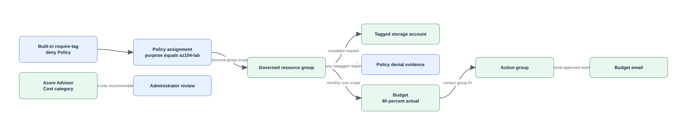

<!-- BEGIN GENERATED AZ104 V2 -->
# Lab 05: Enforce policy and manage costs with budgets and Advisor

[Previous: Lab 04](../04-resource-hierarchy-tags-locks/README.md) · [Catalog](../README.md) · [Next: Lab 06](../06-storage-accounts-security/README.md)

This self-contained lab uses Azure CLI commands hosted in PowerShell. Complete the guided lane or the automated lane—not both with the same run ID.

## Scenario, role, and outcome

Scenario: A cloud governance analyst enforcing standards and controlling spend is responding to an operational request: Enforce a real deny Policy, prove compliant and denied requests, create a resource-group budget wired to an action group, and review Advisor cost recommendations.

Learner role: A cloud governance analyst enforcing standards and controlling spend.

Outcome: Enforce a real deny Policy, prove compliant and denied requests, create a resource-group budget wired to an action group, and review Advisor cost recommendations.

| Item | Value |
|---|---|
| Duration | 120 minutes |
| Difficulty | foundational |
| Cost class | `none` |
| Command surface | Azure CLI (`az`, `az rest`, Bicep, AzCopy, or KQL where required) hosted in PowerShell |
| Live state | Not executed during this offline rebuild |

Completion criteria:

- All required checkpoints report pass.
- The deterministic break/fix is injected, diagnosed, and repaired.
- cleanup.json reports no active run-owned resources, with any retained item explicitly documented.

## Objectives and checkpoints

| Objective | Skill | Checkpoints |
|---|---|---|
| `IG-GOVERN-01` | Implement and manage Azure Policy | `LAB05-CP01`, `LAB05-CP04`, `LAB05-CP05` |
| `IG-GOVERN-06` | Manage costs by using alerts, budgets, and Azure Advisor recommendations | `LAB05-CP02`, `LAB05-CP05` |
| `IG-GOVERN-07` | Configure management groups | `LAB05-CP03`, `LAB05-CP05` |

The authoritative objective wording comes from the [Microsoft AZ-104 study guide](https://learn.microsoft.com/en-us/credentials/certifications/resources/study-guides/az-104), skills measured as of 2026-04-17.

## Architecture and service topology



The editable source is [architecture.mmd](diagrams/architecture.mmd). A built-in Policy assignment evaluates child resources at resource-group scope. A compliant storage account passes and an untagged request is denied. Cost Management evaluates the same resource-group scope and routes the 80-percent threshold to an action group, while Advisor supplies independent recommendations.

## Concept primer and design decisions

Azure Policy evaluates resource compliance; it does not replace RBAC. Budgets signal spend thresholds but do not stop resources, and Advisor recommendations are contextual guidance that administrators must review.

Design decisions:

- Assign built-in Policy at lab scope.
- Treat compliance convergence as asynchronous.
- Always wire the budget to a manifest-owned action group; add email only when an approved address is supplied.

## Required and optional inputs

| Input | Required | Source | Safe example | Gate behavior |
|---|:---:|---|---|---|
| `run-id` — Unique lowercase run ownership identifier | Yes | parameter | `az104l05-01` | `block` |
| `subscription-id` — Expected disposable subscription ID | Yes | parameter-or-environment (`AZ104_SUBSCRIPTION_ID`) | `00000000-0000-0000-0000-000000000000` | `block` |
| `location` — Approved primary Azure region | Yes | parameter-or-environment (`AZ104_LOCATION`) | `westeurope` | `block` |
| `budget-email` — Approved budget notification address | No | environment (`AZ104_BUDGET_EMAIL`) | `alerts@example.test` | `skip-checkpoint` |

Secrets stay in temporary environment variables and are never written to `run.json`, validation evidence, or Git. A `skip-checkpoint` gate produces a visible partial result; it never becomes a pass.

## Read-only preflight

Sign in deliberately, inspect the active context, then run the lab preflight. It never signs in, changes context, installs an extension, registers a provider, or creates a resource.

```powershell
az login
az account show --query '{cloud:environmentName,subscription:id,tenant:tenantId,user:user.name}' --output json
./scripts/cli/Preflight.ps1 -SubscriptionId $env:AZ104_SUBSCRIPTION_ID -RunId 'az104l05-01' -Location 'westeurope'
```

Representative redacted output:

```text
context                 True  cloud=AzureCloud; tenant=<redacted>; subscription=<redacted>
azure-cli               True  2.88.x
provider:<namespace>    True  Registered
region                  True  westeurope
Preflight passed. It performed no Azure mutation.
```

If a required row fails, stop. Correct the local tool, context, provider, quota, SKU, region, permission, or input outside the lab, then rerun preflight.

## Task 1 — Resolve the built-in Policy and governance service prerequisites {#task-1}

Checkpoint: `LAB05-CP01`

Purpose and operational relevance: Identify the immutable built-in definition ID and confirm Policy, Cost Management, Monitor, and Advisor providers before mutation. Friendly Policy names can be localized or duplicated; assignments should bind to the exact definition ID.

Run these commands from PowerShell. If you already used the automated lane, choose a new run ID before trying this guided lane.

```powershell
$definitionGuid = '1e30110a-5ceb-460c-a204-c1c3969c6d62'
$definitionId = "/providers/Microsoft.Authorization/policyDefinitions/$definitionGuid"
$definition = az policy definition show --name $definitionGuid --output json | ConvertFrom-Json
if ($definition.id -ne $definitionId -or $definition.policyRule.then.effect -ne 'deny') { throw 'Required immutable built-in tag Policy definition was not found.' }
foreach ($provider in @('Microsoft.PolicyInsights','Microsoft.Consumption','Microsoft.Insights','Microsoft.Advisor')) {
    $stateValue = az provider show --namespace $provider --query registrationState --output tsv
    if ($stateValue -ne 'Registered') { throw "Provider is not registered: $provider" }
}
```

Expected state: One built-in definition ID is resolved and every governance provider is already Registered without preflight mutation.

Representative redacted output:

```text
definitionId=/providers/Microsoft.Authorization/policyDefinitions/<redacted>; providers=4 Registered
```

Positive validation:

```powershell
$definitionGuid = '1e30110a-5ceb-460c-a204-c1c3969c6d62'
$definition = az policy definition show --name $definitionGuid --output json | ConvertFrom-Json
if ($definition.name -ne $definitionGuid -or $definition.policyRule.then.effect -ne 'deny') { throw 'Expected the immutable built-in deny definition.' }
$definition | Select-Object id,displayName,policyType
```

Expected positive result: Exactly one built-in definition resolves and its effect is deny.

Negative validation:

```powershell
$existing = @(az policy assignment list --scope $scope --output json | ConvertFrom-Json | Where-Object name -eq $policyName)
if ($existing.Count -ne 1 -or $existing[0].scope -ne $scope) { throw 'Expected exactly one run-specific assignment at the exact lab scope.' }
'Run-specific policy assignments at exact scope: 1'
```

Expected negative result: Exactly one manifest-recorded assignment uses the run-specific name and exact scope after deployment.

Evidence to retain:

- `LAB05-CP01` UTC result for resolve the built-in Policy and governance service prerequisites.
- Exact run-owned ID and asserted service properties from: Exactly one built-in definition resolves and its effect is deny.
- Negative-boundary outcome from: Exactly one manifest-recorded assignment uses the run-specific name and exact scope after deployment.
- Cleanup dependency recorded for the objects created or configured by LAB05-CP01.

Common failure and safe retry: A provider is unregistered or the operator lacks Policy or Cost Management read permission. Register providers only through an approved platform process, then rerun this read-only check.

Cleanup dependency: This checkpoint is read-only.

## Task 2 — Assign the built-in tag Policy at resource-group scope {#task-2}

Checkpoint: `LAB05-CP02`

Purpose and operational relevance: Create a manifest-recorded deny assignment requiring purpose=az104-lab on child resources. Policy assignment scope and parameters determine enforcement; the definition alone changes nothing.

Run these commands from PowerShell. If you already used the automated lane, choose a new run ID before trying this guided lane.

```powershell
$definitionId = '/providers/Microsoft.Authorization/policyDefinitions/1e30110a-5ceb-460c-a204-c1c3969c6d62'
$parameters = '{"tagName":{"value":"purpose"},"tagValue":{"value":"az104-lab"}}'

$assignment = az policy assignment create --name $policyName --display-name "AZ104 require purpose $RunId" --scope $scope --policy $definitionId --params $parameters --enforcement-mode Default --output json | ConvertFrom-Json

Add-ManagedObject -CheckpointId 'LAB05-CP02' -Kind 'azure-resource' -Id ([string]$assignment.id) -Name $policyName -Type 'Microsoft.Authorization/policyAssignments' -Scope $scope -OwnershipMethod 'manifest-id'
```

Expected state: One Default-enforcement assignment targets the exact resource group with tagName purpose and tagValue az104-lab.

Representative redacted output:

```text
assignment=require-purpose-<redacted>; enforcementMode=Default; parameters=purpose:az104-lab
```

Positive validation:

```powershell
$assignment = az policy assignment show --name $policyName --scope $scope --output json | ConvertFrom-Json
if ($assignment.enforcementMode -ne 'Default' -or $assignment.parameters.tagValue.value -ne 'az104-lab') { throw 'Policy enforcement or parameter mismatch.' }
$assignment | Select-Object id,name,enforcementMode,parameters
```

Expected positive result: The assignment uses Default enforcement and the expected tag parameters.

Negative validation:

```powershell
$duplicates = @(az policy assignment list --scope $scope --output json | ConvertFrom-Json | Where-Object { $_.displayName -like "AZ104 require purpose $RunId*" })
if ($duplicates.Count -ne 1) { throw 'Expected exactly one run-specific Policy assignment.' }
'Run-specific assignments: 1'
```

Expected negative result: No duplicate assignment exists for the run.

Evidence to retain:

- `LAB05-CP02` UTC result for assign the built-in tag Policy at resource-group scope.
- Exact run-owned ID and asserted service properties from: The assignment uses Default enforcement and the expected tag parameters.
- Negative-boundary outcome from: No duplicate assignment exists for the run.
- Cleanup dependency recorded for the objects created or configured by LAB05-CP02.

Common failure and safe retry: Policy write permission is missing, the definition lookup is localized, or a prior assignment owns the deterministic name. Query the assignment by exact scope and name; record a matching result instead of creating a duplicate.

Cleanup dependency: Remove the exact Policy assignment before final resource-group deletion.

## Task 3 — Prove compliant creation and an intentionally denied request {#task-3}

Checkpoint: `LAB05-CP03`

Purpose and operational relevance: Create one correctly tagged storage account and attempt a second untagged account under the deny assignment. Compliance evidence needs both an allowed state and a controlled failure that exposes the Policy effect.

Run these commands from PowerShell. If you already used the automated lane, choose a new run ID before trying this guided lane.

```powershell
$compliant = az storage account create --name $storage --resource-group $ResourceGroupName --location $Location --sku Standard_LRS --kind StorageV2 --https-only true --min-tls-version TLS1_2 --allow-blob-public-access false --tags purpose=az104-lab labId=05 runId=$RunId --output json | ConvertFrom-Json
Add-ManagedObject -CheckpointId 'LAB05-CP03' -Kind 'azure-resource' -Id ([string]$compliant.id) -Name $storage -Type 'Microsoft.Storage/storageAccounts' -Scope $scope -OwnershipMethod 'manifest-id-and-tags'
$deniedName = "st05bad$suffix"
$PSNativeCommandUseErrorActionPreference = $false
$deniedOutput = az storage account create --name $deniedName --resource-group $ResourceGroupName --location $Location --sku Standard_LRS --kind StorageV2 --output json 2>&1
$deniedExit = $LASTEXITCODE
$PSNativeCommandUseErrorActionPreference = $true
if ($deniedExit -eq 0) {
    $unexpected = az storage account show --name $deniedName --resource-group $ResourceGroupName --output json | ConvertFrom-Json
    Add-ManagedObject -CheckpointId 'LAB05-CP03' -Kind 'azure-resource' -Id ([string]$unexpected.id) -Name $deniedName -Type 'Microsoft.Storage/storageAccounts' -Scope $scope -OwnershipMethod 'manifest-id'
    throw 'The untagged request was not denied; keep the unexpected resource recorded and wait for Policy propagation before repair.'
}
$state.inputs['denied-request-observed'] = $true
Save-RunState
```

Expected state: The tagged account exists and the untagged account request returns a Policy denial without creating a resource.

Representative redacted output:

```text
compliantStorage=created; untaggedRequest=denied; policyAssignment=require-purpose-<redacted>
```

Positive validation:

```powershell
$account = az storage account show --name $storage --resource-group $ResourceGroupName --output json | ConvertFrom-Json
if ($account.tags.purpose -ne 'az104-lab' -or $account.tags.runId -ne $RunId) { throw 'Compliant storage tags do not match the Policy and run boundary.' }
$account | Select-Object id,tags
```

Expected positive result: The compliant storage account exists with the exact required value and ownership tags.

Negative validation:

```powershell
$deniedName = "st05bad$suffix"
$unexpectedId = az storage account show --name $deniedName --resource-group $ResourceGroupName --query id --output tsv 2>$null
if ($LASTEXITCODE -eq 0 -and $unexpectedId) { throw 'The intentionally untagged storage account exists.' }
'Untagged storage resources: 0'
```

Expected negative result: The denied account name does not resolve to an active storage resource.

Evidence to retain:

- `LAB05-CP03` UTC result for prove compliant creation and an intentionally denied request.
- Exact run-owned ID and asserted service properties from: The compliant storage account exists with the exact required value and ownership tags.
- Negative-boundary outcome from: The denied account name does not resolve to an active storage resource.
- Cleanup dependency recorded for the objects created or configured by LAB05-CP03.

Common failure and safe retry: Policy assignment propagation is incomplete, or the request includes inherited/automatic tags from organization Policy. Query assignment enforcement and Policy events; delete only a manifest-recorded unexpected resource, then repeat after convergence.

Cleanup dependency: Delete any recorded unexpected resource and the compliant account before the resource group.

## Task 4 — Create an action group and resource-group budget notification {#task-4}

Checkpoint: `LAB05-CP04`

Purpose and operational relevance: Wire an 80-percent monthly cost threshold to a manifest-owned action group, adding email only through the approved input gate. Budgets notify; they do not stop resources. A receiver path must be tested and cleaned independently.

Run these commands from PowerShell. If you already used the automated lane, choose a new run ID before trying this guided lane.

```powershell
if ($env:AZ104_BUDGET_EMAIL) {
    $actionGroup = az monitor action-group create --name $actionGroupName --resource-group $ResourceGroupName --short-name az104cost --tags purpose=az104-lab labId=05 runId=$RunId --action email ApprovedBudgetEmail $env:AZ104_BUDGET_EMAIL usecommonalertschema --output json | ConvertFrom-Json
} else {
    $actionGroup = az monitor action-group create --name $actionGroupName --resource-group $ResourceGroupName --short-name az104cost --tags purpose=az104-lab labId=05 runId=$RunId --output json | ConvertFrom-Json
}
Add-ManagedObject -CheckpointId 'LAB05-CP04' -Kind 'azure-resource' -Id ([string]$actionGroup.id) -Name $actionGroupName -Type 'Microsoft.Insights/actionGroups' -Scope $scope -OwnershipMethod 'manifest-id-and-tags'
$startDate = (Get-Date -Day 1 -Hour 0 -Minute 0 -Second 0).ToUniversalTime().ToString('yyyy-MM-ddTHH:mm:ssZ')
$endDate = (Get-Date -Day 1 -Hour 0 -Minute 0 -Second 0).AddYears(1).ToUniversalTime().ToString('yyyy-MM-ddTHH:mm:ssZ')
$contacts = if ($env:AZ104_BUDGET_EMAIL) { @($env:AZ104_BUDGET_EMAIL) } else { @() }
$budgetBody = @{ properties = @{ category = 'Cost'; amount = 25; timeGrain = 'Monthly'; timePeriod = @{ startDate = $startDate; endDate = $endDate }; notifications = @{ Actual_GreaterThanOrEqualTo_80_Percent = @{ enabled = $true; operator = 'GreaterThanOrEqualTo'; threshold = 80; thresholdType = 'Actual'; contactEmails = $contacts; contactGroups = @($actionGroup.id); contactRoles = @() } } } } | ConvertTo-Json -Depth 12 -Compress
$budgetUrl = "https://management.azure.com$scope/providers/Microsoft.Consumption/budgets/$budgetName?api-version=2023-05-01"
$budget = az rest --method put --url $budgetUrl --body $budgetBody --output json | ConvertFrom-Json
Add-ManagedObject -CheckpointId 'LAB05-CP04' -Kind 'azure-resource' -Id ([string]$budget.id) -Name $budgetName -Type 'Microsoft.Consumption/budgets' -Scope $scope -OwnershipMethod 'manifest-id'
```

Expected state: The monthly 25-unit budget has an enabled actual-cost threshold at 80 percent and references the exact action-group ID.

Representative redacted output:

```text
amount=25; timeGrain=Monthly; threshold=80; contactGroups=[<redacted action-group ID>]
```

Positive validation:

```powershell
$budgetUrl = "https://management.azure.com$scope/providers/Microsoft.Consumption/budgets/$budgetName?api-version=2023-05-01"
$budget = az rest --method get --url $budgetUrl --output json | ConvertFrom-Json
$notice = $budget.properties.notifications.Actual_GreaterThanOrEqualTo_80_Percent
if ($budget.properties.amount -ne 25 -or $notice.threshold -ne 80 -or $notice.contactGroups.Count -ne 1) { throw 'Budget notification configuration mismatch.' }
$budget.properties | Select-Object amount,timeGrain,notifications
```

Expected positive result: Budget amount, time grain, threshold, and action-group target match the design.

Negative validation:

```powershell
$groups = @(az monitor action-group list --resource-group $ResourceGroupName --output json | ConvertFrom-Json | Where-Object name -eq $actionGroupName)
if ($groups.Count -ne 1) { throw 'Expected exactly one run action group.' }
if (-not $env:AZ104_BUDGET_EMAIL -and @($groups[0].emailReceivers).Count -gt 0) { throw 'An email receiver exists without the approved input gate.' }
$groups[0] | Select-Object id,name,emailReceivers
```

Expected negative result: There is one action group and no email receiver unless the approved address input was supplied.

Evidence to retain:

- `LAB05-CP04` UTC result for create an action group and resource-group budget notification.
- Exact run-owned ID and asserted service properties from: Budget amount, time grain, threshold, and action-group target match the design.
- Negative-boundary outcome from: There is one action group and no email receiver unless the approved address input was supplied.
- Cleanup dependency recorded for the objects created or configured by LAB05-CP04.

Common failure and safe retry: Cost Management permission is unavailable, budget dates are not month-aligned, or the receiver address is unapproved. GET the exact budget and action group first; update only the mismatched property and preserve the returned eTag when required.

Cleanup dependency: Delete the budget before the action group, then verify neither exact ID resolves.

## Task 5 — Correlate Policy compliance, budget state, and Advisor recommendations {#task-5}

Checkpoint: `LAB05-CP05`

Purpose and operational relevance: Trigger a Policy scan, read current compliance and budget configuration, and inventory Advisor cost recommendations without auto-applying them. Policy, budgets, and Advisor answer different governance questions and converge on different schedules.

Run these commands from PowerShell. If you already used the automated lane, choose a new run ID before trying this guided lane.

```powershell
az policy state trigger-scan --resource-group $ResourceGroupName --no-wait
az policy state list --resource-group $ResourceGroupName --filter "PolicyAssignmentName eq '$policyName'" --all --output table
az advisor recommendation list --category Cost --query '[].{impact:impact,resource:resourceMetadata.resourceId,problem:shortDescription.problem}' --output table
```

Expected state: Governance evidence distinguishes current compliant/non-compliant Policy state, configured budget notification, and zero or more contextual Advisor recommendations.

Representative redacted output:

```text
policyAssignment=present; deniedResource=absent; budget=active; AdvisorCostRecommendations=<0..n>
```

Positive validation:

```powershell
$assignment = az policy assignment show --name $policyName --scope $scope --output json | ConvertFrom-Json
$budgetUrl = "https://management.azure.com$scope/providers/Microsoft.Consumption/budgets/$budgetName?api-version=2023-05-01"
$budget = az rest --method get --url $budgetUrl --output json | ConvertFrom-Json
if (-not $assignment.id -or -not $budget.id) { throw 'Policy assignment or budget is missing.' }
[pscustomobject]@{ policy = $assignment.id; budget = $budget.id }
```

Expected positive result: The exact Policy assignment and budget IDs both resolve.

Negative validation:

```powershell
$deniedName = "st05bad$suffix"
$bad = az storage account show --name $deniedName --resource-group $ResourceGroupName --query id --output tsv 2>$null
if ($LASTEXITCODE -eq 0 -and $bad) { throw 'The non-compliant break/fix resource still exists.' }
$advisor = @(az advisor recommendation list --category Cost --output json | ConvertFrom-Json)
[pscustomobject]@{ deniedResourceCount = 0; advisorRecommendationCount = $advisor.Count }
```

Expected negative result: The denied resource is absent; zero Advisor recommendations is a valid observed state, not a test failure.

Evidence to retain:

- `LAB05-CP05` UTC result for correlate Policy compliance, budget state, and Advisor recommendations.
- Exact run-owned ID and asserted service properties from: The exact Policy assignment and budget IDs both resolve.
- Negative-boundary outcome from: The denied resource is absent; zero Advisor recommendations is a valid observed state, not a test failure.
- Cleanup dependency recorded for the objects created or configured by LAB05-CP05.

Common failure and safe retry: Policy compliance is still Unknown or Advisor has no recommendation for this disposable workload. Preserve assignment and denial evidence, rerun the scan later, and never fabricate an Advisor result.

Cleanup dependency: Delete budget, action group, Policy assignment, and child resources before the resource group; Advisor is read-only.

## Final validation and result interpretation

Run independent deployment validation after all required checkpoints:

```powershell
./scripts/cli/Validate.ps1 -RunId 'az104l05-01' -Mode Deployment
az resource list --resource-group 'rg-az104-l05-az104l05-01' --query '[].{name:name,type:type}' --output table
```

- `pass`: every required positive and negative check passed.
- `partial`: every required check passed, but at least one optional gate was deliberately skipped.
- `fail`: a required checkpoint failed; do not record the lab as complete.

Keep the redacted `validation.json`; do not retain credentials, tokens, access keys, certificate material, email addresses, tenant IDs, or unredacted command output.

## Deterministic break/fix exercise

Injection: Create a resource without the required purpose tag after policy assignment.

Expected symptom: The request is denied or the resource is reported non-compliant, depending on effect.

Diagnose with a read-only service query:

```powershell
$existing = @(az policy assignment list --scope $scope --output json | ConvertFrom-Json | Where-Object name -eq $policyName)
if ($existing.Count -ne 1 -or $existing[0].scope -ne $scope) { throw 'Expected exactly one run-specific assignment at the exact lab scope.' }
'Run-specific policy assignments at exact scope: 1'
```

Diagnosis: Inspect the assignment parameters and compliance reason.

Repair: Apply the required tag and retry after confirming the intended effect.

Before/after evidence must show the failed negative or positive check before repair and the same check passing afterward. Do not inject a second fault until the first is removed.

## Optional job-style challenge

Draft a cost-control response that combines tags, a budget threshold, an action group, and Advisor review.

Deliver a short change record containing assumptions, exact commands, redacted evidence, cost and risk notes, rollback, and residual results. The challenge is optional and never changes required checkpoint status.

## Troubleshooting

| Symptom | Likely cause | Safe next step |
|---|---|---|
| Context mismatch | Active CLI context differs from `run.json` | Stop, inspect `az account show`, and select the intended disposable context yourself. |
| Provider or feature unavailable | Registration, region, feature, or SKU gate is unmet | Read the preflight result; do not register or enable tenant features implicitly. |
| Name already exists | The run ID is reused or a globally unique name collided | Keep existing state intact and choose a new run ID. |
| Expected state is delayed | The service is converging asynchronously | Repeat only the read-only query with bounded retries; do not duplicate creation. |
| Permission denied | Role, Graph scope, or data-plane authorization is insufficient | Confirm the declared least-privilege boundary; do not broaden access automatically. |
| Cleanup refuses ownership | ID, context, or tags differ from the manifest | Investigate the mismatch; never bypass ownership verification. |

## Cleanup and residual verification

Preview exact targets first, execute only after ownership review, then validate post-cleanup:

```powershell
./scripts/cli/Cleanup.ps1 -RunId 'az104l05-01'
./scripts/cli/Cleanup.ps1 -RunId 'az104l05-01' -Execute
./scripts/cli/Validate.ps1 -RunId 'az104l05-01' -Mode PostCleanup
$deniedName = "st05bad$suffix"
$bad = az storage account show --name $deniedName --resource-group $ResourceGroupName --query id --output tsv 2>$null
if ($LASTEXITCODE -eq 0 -and $bad) { throw 'The non-compliant break/fix resource still exists.' }
$advisor = @(az advisor recommendation list --category Cost --output json | ConvertFrom-Json)
[pscustomobject]@{ deniedResourceCount = 0; advisorRecommendationCount = $advisor.Count }
```

`cleanup.json` passes only when no active manifest-managed object remains. Soft-deleted or intentionally retained items must be listed with their reason and expected disposition. The lifecycle never performs irreversible purge automatically.

## Exam debrief and assessment

Explain why the expected state, negative check, and cleanup boundary matter—not only which command was used. Map any missed concept back to its task anchor before reviewing the answer key.

Complete [QUESTIONS.md](assessment/QUESTIONS.md), then use [ANSWERS.md](assessment/ANSWERS.md) for option-by-option remediation. Scores of 85–100% indicate mastery, 70–84% indicate targeted review, and below 70% means repeat the mapped tasks.

## Microsoft Learn sources

- [Microsoft AZ-104 study guide](https://learn.microsoft.com/en-us/credentials/certifications/resources/study-guides/az-104)
- [Create an Azure Policy assignment using Azure CLI](https://learn.microsoft.com/en-us/azure/governance/policy/assign-policy-azurecli)
- [Create and manage Azure budgets](https://learn.microsoft.com/en-us/azure/cost-management-billing/costs/tutorial-acm-create-budgets)
- [Microsoft.Consumption budgets REST resource](https://learn.microsoft.com/en-us/azure/templates/microsoft.consumption/2023-05-01/budgets)
- [Azure Advisor cost recommendations](https://learn.microsoft.com/en-us/azure/advisor/advisor-cost-recommendations)

## Lifecycle script appendix

The guided task blocks above and these executable scripts are generated from the same checkpoint data. The scripts are an optional automated lane; use a different run ID if you already completed the guided lane.

### `Preflight.ps1`

```powershell
# BEGIN GENERATED AZ104 V2
#requires -Version 7.4
[CmdletBinding()]
[Diagnostics.CodeAnalysis.SuppressMessageAttribute('PSAvoidUsingWriteHost', '', Justification = 'Interactive lab progress is intentionally written to the host.')]
[Diagnostics.CodeAnalysis.SuppressMessageAttribute('PSReviewUnusedParameter', '', Justification = 'All lifecycle scripts expose a stable cross-lab interface.')]
[Diagnostics.CodeAnalysis.SuppressMessageAttribute('PSUseDeclaredVarsMoreThanAssignments', '', Justification = 'Generated task variables are intentionally shared across checkpoint blocks.')]
param(
    [string]$SubscriptionId = $env:AZ104_SUBSCRIPTION_ID,
    [Parameter(Mandatory)][ValidatePattern('^[a-z0-9](?:[a-z0-9-]{0,30}[a-z0-9])?$')][string]$RunId,
    [Parameter(Mandatory)][ValidatePattern('^[a-z0-9]+$')][string]$Location,
    [string]$SecondaryLocation = $env:AZ104_SECONDARY_LOCATION
)

Set-StrictMode -Version Latest
$ErrorActionPreference = 'Stop'
$PSNativeCommandUseErrorActionPreference = $true

if (-not (Get-Command az -ErrorAction SilentlyContinue)) {
    throw 'Azure CLI is required. Run the repository readiness initializer, then retry.'
}

$account = az account show --output json | ConvertFrom-Json
if (-not $account) { throw 'No active Azure CLI context. Run az login deliberately before this lab.' }
if ($SubscriptionId -and [string]$account.id -ne $SubscriptionId) {
    throw "Context mismatch: active subscription is $($account.id), expected $SubscriptionId. Preflight will not switch it."
}
if (-not $SubscriptionId) { $SubscriptionId = [string]$account.id }
# The account read above is the mandatory context gate. All remaining Azure
# probes are collected as results instead of allowing one unavailable SKU or
# provider query to abort the readiness report before it can explain the gap.
$PSNativeCommandUseErrorActionPreference = $false
$suffix = (($RunId -replace '[^a-z0-9]', '') + '000000000000').Substring(0, 12)
$ResourceGroupName = $(if ('05' -in @('00', '01', '02')) { $null } else { "rg-az104-l05-$RunId" })

$checks = [System.Collections.Generic.List[object]]::new()
function Add-PreflightResult {
    param([string]$Id, [bool]$Required, [bool]$Passed, [string]$Actual)
    $checks.Add([pscustomobject]@{ id = $Id; required = $Required; passed = $Passed; actual = $Actual })
}

Add-PreflightResult -Id 'context' -Required $true -Passed $true -Actual "cloud=$($account.environmentName); tenant=<redacted>; subscription=<redacted>"
$azVersion = (az version --query '"azure-cli"' --output tsv)
$bicepVersion = (az bicep version 2>&1 | Out-String).Trim()
Add-PreflightResult -Id 'azure-cli' -Required $true -Passed ([bool]$azVersion) -Actual $azVersion
Add-PreflightResult -Id 'powershell' -Required $true -Passed ($PSVersionTable.PSVersion -ge [version]'7.4') -Actual $PSVersionTable.PSVersion.ToString()
Add-PreflightResult -Id 'bicep' -Required $true -Passed ([bool]$bicepVersion) -Actual $bicepVersion

$requiredEnvironmentVariables = @()
foreach ($variableName in $requiredEnvironmentVariables) {
    $present = -not [string]::IsNullOrWhiteSpace([Environment]::GetEnvironmentVariable($variableName))
    Add-PreflightResult -Id "input:$variableName" -Required $true -Passed $present -Actual $(if ($present) { 'present (value redacted)' } else { 'missing' })
}

$providers = @(
    'Microsoft.Authorization'
    'Microsoft.Advisor'
    'Microsoft.Consumption'
    'Microsoft.CostManagement'
)
foreach ($provider in $providers) {
    $registrationState = az provider show --namespace $provider --query registrationState --output tsv 2>$null
    Add-PreflightResult -Id "provider:$provider" -Required $true -Passed ($registrationState -eq 'Registered') -Actual $(if ($registrationState) { $registrationState } else { 'Unavailable' })
}

$knownLocation = az account list-locations --query "[?name=='$Location'].name | [0]" --output tsv
Add-PreflightResult -Id 'region' -Required $true -Passed ($knownLocation -eq $Location) -Actual $(if ($knownLocation) { $knownLocation } else { 'not available' })

$storage = "st05$suffix"

$probePassed = $true
$probeActual = 'assertion passed (output not persisted)'
try {
    $LASTEXITCODE = 0
    & {
$definitionGuid = '1e30110a-5ceb-460c-a204-c1c3969c6d62'
$definition = az policy definition show --name $definitionGuid --output json | ConvertFrom-Json
if ($definition.name -ne $definitionGuid -or $definition.policyRule.then.effect -ne 'deny') { throw 'The immutable built-in deny Policy was not resolved.' }
foreach ($provider in @('Microsoft.PolicyInsights','Microsoft.Consumption','Microsoft.Insights','Microsoft.Advisor')) {
    if ((az provider show --namespace $provider --query registrationState --output tsv) -ne 'Registered') { throw "Provider is not registered: $provider" }
}
    } | Out-Null
    if ($LASTEXITCODE -ne 0) { throw "native exit code $LASTEXITCODE" }
} catch {
    $probePassed = $false
    $probeActual = "assertion failed: $($_.Exception.GetType().Name)"
}
Add-PreflightResult -Id 'preflight.authored.lab05.policy-and-governance' -Required $true -Passed $probePassed -Actual $probeActual

$probePassed = $true
$probeActual = 'assertion passed (output not persisted)'
try {
    $LASTEXITCODE = 0
    & {
$availability = az storage account check-name --name $storage --output json | ConvertFrom-Json
if (-not $availability.nameAvailable) { throw "Storage name unavailable: $($availability.reason)" }
    } | Out-Null
    if ($LASTEXITCODE -ne 0) { throw "native exit code $LASTEXITCODE" }
} catch {
    $probePassed = $false
    $probeActual = "assertion failed: $($_.Exception.GetType().Name)"
}
Add-PreflightResult -Id 'preflight.authored.lab05.storage-name' -Required $true -Passed $probePassed -Actual $probeActual

$checks | Format-Table -AutoSize
$failedRequired = @($checks | Where-Object { $_.required -and -not $_.passed })
if ($failedRequired.Count -gt 0) {
    throw "Preflight blocked: $($failedRequired.id -join ', ')"
}
Write-Host 'Preflight passed. It performed no sign-in, context switch, provider registration, or Azure mutation.'
# END GENERATED AZ104 V2
```

### `Setup.ps1`

```powershell
# BEGIN GENERATED AZ104 V2
#requires -Version 7.4
[CmdletBinding()]
[Diagnostics.CodeAnalysis.SuppressMessageAttribute('PSAvoidUsingWriteHost', '', Justification = 'Interactive lab progress is intentionally written to the host.')]
[Diagnostics.CodeAnalysis.SuppressMessageAttribute('PSReviewUnusedParameter', '', Justification = 'All lifecycle scripts expose a stable cross-lab interface.')]
[Diagnostics.CodeAnalysis.SuppressMessageAttribute('PSUseDeclaredVarsMoreThanAssignments', '', Justification = 'Generated task variables are intentionally shared across checkpoint blocks.')]
param(
    [string]$SubscriptionId = $env:AZ104_SUBSCRIPTION_ID,
    [Parameter(Mandatory)][ValidatePattern('^[a-z0-9](?:[a-z0-9-]{0,30}[a-z0-9])?$')][string]$RunId,
    [Parameter(Mandatory)][ValidatePattern('^[a-z0-9]+$')][string]$Location,
    [string]$SecondaryLocation = $env:AZ104_SECONDARY_LOCATION,
    [switch]$AcknowledgeCost,
    [switch]$AcknowledgeTenantChange,
    [switch]$Execute
)

Set-StrictMode -Version Latest
$ErrorActionPreference = 'Stop'
$PSNativeCommandUseErrorActionPreference = $true

if (-not (Get-Command az -ErrorAction SilentlyContinue)) {
    throw 'Azure CLI is required. Run the repository readiness initializer, then retry.'
}

$LabRoot = (Resolve-Path (Join-Path $PSScriptRoot '../..')).Path
$StateDir = Join-Path $LabRoot ".state/$RunId"
$Manifest = Join-Path $StateDir 'run.json'
$ResourceGroupName = $(if ('05' -in @('00', '01', '02')) { $null } else { "rg-az104-l05-$RunId" })
$suffix = (($RunId -replace '[^a-z0-9]', '') + '000000000000').Substring(0, 12)

Write-Host 'LAB-05 execution plan'
Write-Host "  subscription: $SubscriptionId"
Write-Host "  location: $Location"
Write-Host '  command surface: Azure CLI hosted in PowerShell'
Write-Host '  state: run.json, validation.json, cleanup.json'
if (-not $Execute) {
    Write-Host 'Preview only. Review context, inputs, cost, tenant scope, and cleanup before using -Execute.'
    return
}
if ($false -and -not $AcknowledgeCost) { throw 'This lab requires -AcknowledgeCost before execution.' }
if ($false -and -not $AcknowledgeTenantChange) { throw 'This lab requires -AcknowledgeTenantChange before execution.' }

& (Join-Path $PSScriptRoot 'Preflight.ps1') -SubscriptionId $SubscriptionId -RunId $RunId -Location $Location -SecondaryLocation $SecondaryLocation
if (Test-Path -LiteralPath $Manifest) { throw "State already exists at $Manifest. Choose a new run ID." }
New-Item -ItemType Directory -Path $StateDir -Force | Out-Null
$account = az account show --output json | ConvertFrom-Json
if (-not $SubscriptionId) { $SubscriptionId = [string]$account.id }
$now = (Get-Date).ToUniversalTime().ToString('o')
$state = @{
    schemaVersion = '1.0.0'
    labId = 'LAB-05'
    runId = $RunId
    createdAt = $now
    updatedAt = $now
    status = 'initialized'
    context = @{ cloud = [string]$account.environmentName; tenantId = [string]$account.tenantId; subscriptionId = [string]$SubscriptionId }
    acknowledgements = @{ cost = [bool]$AcknowledgeCost; tenantChange = [bool]$AcknowledgeTenantChange }
    inputs = @{ 'location' = $Location; 'secondary-location' = $SecondaryLocation }
    checkpointStates = @(
        @{ checkpointId = 'LAB05-CP01'; required = $true; status = 'pending'; updatedAt = $now; message = 'Not started.' }
        @{ checkpointId = 'LAB05-CP02'; required = $true; status = 'pending'; updatedAt = $now; message = 'Not started.' }
        @{ checkpointId = 'LAB05-CP03'; required = $true; status = 'pending'; updatedAt = $now; message = 'Not started.' }
        @{ checkpointId = 'LAB05-CP04'; required = $true; status = 'pending'; updatedAt = $now; message = 'Not started.' }
        @{ checkpointId = 'LAB05-CP05'; required = $true; status = 'pending'; updatedAt = $now; message = 'Not started.' }
    )
    managedObjects = @()
    originalSettings = @()
}
$external = @{}

function Save-RunState {
    $state.updatedAt = (Get-Date).ToUniversalTime().ToString('o')
    $state | ConvertTo-Json -Depth 30 | Set-Content -LiteralPath $Manifest -Encoding utf8
}

function Save-ExternalState {
    foreach ($key in @($external.Keys)) {
        $value = $external[$key]
        if ($null -eq $value -or $value -is [string] -or $value -is [ValueType]) {
            $inputKey = 'external-' + (([string]$key -creplace '([a-z0-9])([A-Z])', '$1-$2') -replace '[^a-zA-Z0-9-]', '-').ToLowerInvariant()
            $state.inputs[$inputKey] = $value
        }
    }
    Save-RunState
}

function Write-CheckpointState {
    param([string]$CheckpointId, [string]$Status, [string]$Message)
    $entry = @($state.checkpointStates | Where-Object { $_.checkpointId -eq $CheckpointId })[0]
    $entry.status = $Status
    $entry.updatedAt = (Get-Date).ToUniversalTime().ToString('o')
    $entry.message = $Message
}

function Add-ManagedObject {
    param([string]$CheckpointId, [string]$Kind, [string]$Id, [string]$Name, [string]$Type, [string]$Scope, [string]$OwnershipMethod)
    if ([string]::IsNullOrWhiteSpace($Id)) { return }
    $existing = @($state.managedObjects | Where-Object { $_.id -eq $Id })
    if ($existing.Count -gt 0) { return }
    $expectedTags = @{}
    if ($OwnershipMethod -eq 'manifest-id-and-tags') {
        $expectedTags = @{ purpose = 'az104-lab'; labId = '05'; runId = $RunId }
    }
    $state.managedObjects += @{
        checkpointId = $CheckpointId
        kind = $Kind
        id = $Id
        name = $Name
        type = $Type
        scope = $Scope
        ownership = @{ method = $OwnershipMethod; expectedTags = $expectedTags }
        recordedAt = (Get-Date).ToUniversalTime().ToString('o')
        lifecycleStatus = 'active'
    }
    Save-RunState
}

function Sync-ManagedResource {
    param([string]$CheckpointId)
    # The entire recovery inventory is best effort so a state-helper or Azure
    # query failure cannot mask the original mutation error. Every object that
    # can be recovered is still persisted immediately as it is discovered.
    $nativePreference = $PSNativeCommandUseErrorActionPreference
    $PSNativeCommandUseErrorActionPreference = $false
    try {
        Save-ExternalState
        $resourceGroupNames = [System.Collections.Generic.HashSet[string]]::new([System.StringComparer]::OrdinalIgnoreCase)
        if ($ResourceGroupName) { $null = $resourceGroupNames.Add([string]$ResourceGroupName) }
        foreach ($key in @($external.Keys | Where-Object { [string]$_ -match '(?i)ResourceGroupName$' })) {
            if ($external[$key]) { $null = $resourceGroupNames.Add([string]$external[$key]) }
        }
        foreach ($groupName in $resourceGroupNames) {
            $groupJson = az group show --subscription $SubscriptionId --name $groupName --output json 2>$null
            $group = $(if ($LASTEXITCODE -eq 0 -and $groupJson) { $groupJson | ConvertFrom-Json } else { $null })
            if ($group) {
                $groupCheckpoint = $(if ([string]$group.name -eq [string]$ResourceGroupName) { 'LAB05-CP01' } else { $CheckpointId })
                Add-ManagedObject -CheckpointId $groupCheckpoint -Kind 'azure-resource' -Id ([string]$group.id) -Name ([string]$group.name) -Type 'Microsoft.Resources/resourceGroups' -Scope "/subscriptions/$SubscriptionId" -OwnershipMethod 'manifest-id-and-tags'
                $resourcesJson = az resource list --subscription $SubscriptionId --resource-group $groupName --output json 2>$null
                $resources = @($(if ($LASTEXITCODE -eq 0 -and $resourcesJson) { $resourcesJson | ConvertFrom-Json } else { @() }))
                foreach ($resource in $resources) {
                    Add-ManagedObject -CheckpointId $CheckpointId -Kind 'azure-resource' -Id ([string]$resource.id) -Name ([string]$resource.name) -Type ([string]$resource.type) -Scope ([string]$group.id) -OwnershipMethod 'manifest-id-and-tags'
                }
            }
        }
        if ($external.ContainsKey('groupId') -and $external.groupId) { Add-ManagedObject -CheckpointId $CheckpointId -Kind 'entra-object' -Id ([string]$external.groupId) -Name 'lab-group' -Type 'Microsoft.Graph/group' -Scope $state.context.tenantId -OwnershipMethod 'manifest-id' }
        if ($external.ContainsKey('guestUserId') -and $external.guestUserId) { Add-ManagedObject -CheckpointId $CheckpointId -Kind 'entra-object' -Id ([string]$external.guestUserId) -Name 'guest-user' -Type 'Microsoft.Graph/user' -Scope $state.context.tenantId -OwnershipMethod 'manifest-id' }
        if ($external.ContainsKey('userIds')) {
            foreach ($userId in @($external.userIds)) { Add-ManagedObject -CheckpointId $CheckpointId -Kind 'entra-object' -Id ([string]$userId) -Name 'lab-user' -Type 'Microsoft.Graph/user' -Scope $state.context.tenantId -OwnershipMethod 'manifest-id' }
        }
        if ($external.ContainsKey('delegationRecordId') -and $external.delegationRecordId) {
            Add-ManagedObject -CheckpointId $CheckpointId -Kind 'azure-resource' -Id ([string]$external.delegationRecordId) -Name ([string]$external.delegationRecordName) -Type 'Microsoft.Network/dnsZones/NS' -Scope ([string]$external.parentZoneId) -OwnershipMethod 'manifest-id'
        }
        if ($external.ContainsKey('connectionMonitorId') -and $external.connectionMonitorId) {
            Add-ManagedObject -CheckpointId $CheckpointId -Kind 'azure-resource' -Id ([string]$external.connectionMonitorId) -Name ([string]$external.connectionMonitorName) -Type 'Microsoft.Network/networkWatchers/connectionMonitors' -Scope ([string]$external.networkWatcherId) -OwnershipMethod 'manifest-id'
        }
    } catch {
        Write-Warning "Recovery inventory for $CheckpointId was incomplete: $($_.Exception.Message)"
    } finally {
        $PSNativeCommandUseErrorActionPreference = $nativePreference
    }
}

# The manifest exists before the first Azure mutation.
Save-RunState
$state.status = 'setup-in-progress'
Save-RunState

$expiresOn = (Get-Date).ToUniversalTime().AddDays(1).ToString('yyyy-MM-dd')
try {
    az group create --subscription $SubscriptionId --name $ResourceGroupName --location $Location --tags purpose=az104-lab labId=05 runId=$RunId expiresOn=$expiresOn --output none
} catch {
    Write-CheckpointState -CheckpointId 'LAB05-CP01' -Status 'fail' -Message "Resource-group boundary creation failed: $($_.Exception.GetType().Name)"
    $state.status = 'failed'
    Save-RunState
    throw
} finally {
    Sync-ManagedResource -CheckpointId 'LAB05-CP01'
}

# CHECKPOINT LAB05-CP01 BEGIN
try {
    Write-CheckpointState -CheckpointId 'LAB05-CP01' -Status 'in-progress' -Message 'Checkpoint execution started.'
    $activeCheckpointId = 'LAB05-CP01'
    Save-RunState

    $definitionGuid = '1e30110a-5ceb-460c-a204-c1c3969c6d62'
    $definitionId = "/providers/Microsoft.Authorization/policyDefinitions/$definitionGuid"
    $definition = az policy definition show --name $definitionGuid --output json | ConvertFrom-Json
    if ($definition.id -ne $definitionId -or $definition.policyRule.then.effect -ne 'deny') { throw 'Required immutable built-in tag Policy definition was not found.' }
    foreach ($provider in @('Microsoft.PolicyInsights','Microsoft.Consumption','Microsoft.Insights','Microsoft.Advisor')) {
        $stateValue = az provider show --namespace $provider --query registrationState --output tsv
        if ($stateValue -ne 'Registered') { throw "Provider is not registered: $provider" }
    }

    Sync-ManagedResource -CheckpointId 'LAB05-CP01'
    Write-CheckpointState -CheckpointId 'LAB05-CP01' -Status 'pass' -Message 'One built-in definition ID is resolved and every governance provider is already Registered without preflight mutation.'
    Save-RunState
} catch {
    Sync-ManagedResource -CheckpointId 'LAB05-CP01'
    Write-CheckpointState -CheckpointId 'LAB05-CP01' -Status 'fail' -Message "Checkpoint failed: $($_.Exception.GetType().Name)"
    $state.status = 'failed'
    Save-RunState
    throw
}
# CHECKPOINT LAB05-CP01 END

# CHECKPOINT LAB05-CP02 BEGIN
try {
    Write-CheckpointState -CheckpointId 'LAB05-CP02' -Status 'in-progress' -Message 'Checkpoint execution started.'
    $activeCheckpointId = 'LAB05-CP02'
    Save-RunState

    $definitionId = '/providers/Microsoft.Authorization/policyDefinitions/1e30110a-5ceb-460c-a204-c1c3969c6d62'
    $parameters = '{"tagName":{"value":"purpose"},"tagValue":{"value":"az104-lab"}}'

    try {
        $assignment = az policy assignment create --name $policyName --display-name "AZ104 require purpose $RunId" --scope $scope --policy $definitionId --params $parameters --enforcement-mode Default --output json | ConvertFrom-Json
    } finally {
        Sync-ManagedResource -CheckpointId 'LAB05-CP02'
    }

    Add-ManagedObject -CheckpointId 'LAB05-CP02' -Kind 'azure-resource' -Id ([string]$assignment.id) -Name $policyName -Type 'Microsoft.Authorization/policyAssignments' -Scope $scope -OwnershipMethod 'manifest-id'

    Sync-ManagedResource -CheckpointId 'LAB05-CP02'
    Write-CheckpointState -CheckpointId 'LAB05-CP02' -Status 'pass' -Message 'One Default-enforcement assignment targets the exact resource group with tagName purpose and tagValue az104-lab.'
    Save-RunState
} catch {
    Sync-ManagedResource -CheckpointId 'LAB05-CP02'
    Write-CheckpointState -CheckpointId 'LAB05-CP02' -Status 'fail' -Message "Checkpoint failed: $($_.Exception.GetType().Name)"
    $state.status = 'failed'
    Save-RunState
    throw
}
# CHECKPOINT LAB05-CP02 END

# CHECKPOINT LAB05-CP03 BEGIN
try {
    Write-CheckpointState -CheckpointId 'LAB05-CP03' -Status 'in-progress' -Message 'Checkpoint execution started.'
    $activeCheckpointId = 'LAB05-CP03'
    Save-RunState

    try {
        $compliant = az storage account create --name $storage --resource-group $ResourceGroupName --location $Location --sku Standard_LRS --kind StorageV2 --https-only true --min-tls-version TLS1_2 --allow-blob-public-access false --tags purpose=az104-lab labId=05 runId=$RunId --output json | ConvertFrom-Json
    } finally {
        Sync-ManagedResource -CheckpointId 'LAB05-CP03'
    }
    Add-ManagedObject -CheckpointId 'LAB05-CP03' -Kind 'azure-resource' -Id ([string]$compliant.id) -Name $storage -Type 'Microsoft.Storage/storageAccounts' -Scope $scope -OwnershipMethod 'manifest-id-and-tags'
    $deniedName = "st05bad$suffix"
    $PSNativeCommandUseErrorActionPreference = $false
    try {
        $deniedOutput = az storage account create --name $deniedName --resource-group $ResourceGroupName --location $Location --sku Standard_LRS --kind StorageV2 --output json 2>&1
    } finally {
        Sync-ManagedResource -CheckpointId 'LAB05-CP03'
    }
    $deniedExit = $LASTEXITCODE
    $PSNativeCommandUseErrorActionPreference = $true
    if ($deniedExit -eq 0) {
        $unexpected = az storage account show --name $deniedName --resource-group $ResourceGroupName --output json | ConvertFrom-Json
        Add-ManagedObject -CheckpointId 'LAB05-CP03' -Kind 'azure-resource' -Id ([string]$unexpected.id) -Name $deniedName -Type 'Microsoft.Storage/storageAccounts' -Scope $scope -OwnershipMethod 'manifest-id'
        throw 'The untagged request was not denied; keep the unexpected resource recorded and wait for Policy propagation before repair.'
    }
    $state.inputs['denied-request-observed'] = $true
    Save-RunState

    Sync-ManagedResource -CheckpointId 'LAB05-CP03'
    Write-CheckpointState -CheckpointId 'LAB05-CP03' -Status 'pass' -Message 'The tagged account exists and the untagged account request returns a Policy denial without creating a resource.'
    Save-RunState
} catch {
    Sync-ManagedResource -CheckpointId 'LAB05-CP03'
    Write-CheckpointState -CheckpointId 'LAB05-CP03' -Status 'fail' -Message "Checkpoint failed: $($_.Exception.GetType().Name)"
    $state.status = 'failed'
    Save-RunState
    throw
}
# CHECKPOINT LAB05-CP03 END

# CHECKPOINT LAB05-CP04 BEGIN
try {
    Write-CheckpointState -CheckpointId 'LAB05-CP04' -Status 'in-progress' -Message 'Checkpoint execution started.'
    $activeCheckpointId = 'LAB05-CP04'
    Save-RunState

    if ($env:AZ104_BUDGET_EMAIL) {
    try {
            $actionGroup = az monitor action-group create --name $actionGroupName --resource-group $ResourceGroupName --short-name az104cost --tags purpose=az104-lab labId=05 runId=$RunId --action email ApprovedBudgetEmail $env:AZ104_BUDGET_EMAIL usecommonalertschema --output json | ConvertFrom-Json
    } finally {
        Sync-ManagedResource -CheckpointId 'LAB05-CP04'
    }
    } else {
    try {
            $actionGroup = az monitor action-group create --name $actionGroupName --resource-group $ResourceGroupName --short-name az104cost --tags purpose=az104-lab labId=05 runId=$RunId --output json | ConvertFrom-Json
    } finally {
        Sync-ManagedResource -CheckpointId 'LAB05-CP04'
    }
    }
    Add-ManagedObject -CheckpointId 'LAB05-CP04' -Kind 'azure-resource' -Id ([string]$actionGroup.id) -Name $actionGroupName -Type 'Microsoft.Insights/actionGroups' -Scope $scope -OwnershipMethod 'manifest-id-and-tags'
    $startDate = (Get-Date -Day 1 -Hour 0 -Minute 0 -Second 0).ToUniversalTime().ToString('yyyy-MM-ddTHH:mm:ssZ')
    $endDate = (Get-Date -Day 1 -Hour 0 -Minute 0 -Second 0).AddYears(1).ToUniversalTime().ToString('yyyy-MM-ddTHH:mm:ssZ')
    $contacts = if ($env:AZ104_BUDGET_EMAIL) { @($env:AZ104_BUDGET_EMAIL) } else { @() }
    $budgetBody = @{ properties = @{ category = 'Cost'; amount = 25; timeGrain = 'Monthly'; timePeriod = @{ startDate = $startDate; endDate = $endDate }; notifications = @{ Actual_GreaterThanOrEqualTo_80_Percent = @{ enabled = $true; operator = 'GreaterThanOrEqualTo'; threshold = 80; thresholdType = 'Actual'; contactEmails = $contacts; contactGroups = @($actionGroup.id); contactRoles = @() } } } } | ConvertTo-Json -Depth 12 -Compress
    $budgetUrl = "https://management.azure.com$scope/providers/Microsoft.Consumption/budgets/$budgetName?api-version=2023-05-01"
    try {
        $budget = az rest --method put --url $budgetUrl --body $budgetBody --output json | ConvertFrom-Json
    } finally {
        Sync-ManagedResource -CheckpointId 'LAB05-CP04'
    }
    Add-ManagedObject -CheckpointId 'LAB05-CP04' -Kind 'azure-resource' -Id ([string]$budget.id) -Name $budgetName -Type 'Microsoft.Consumption/budgets' -Scope $scope -OwnershipMethod 'manifest-id'

    Sync-ManagedResource -CheckpointId 'LAB05-CP04'
    Write-CheckpointState -CheckpointId 'LAB05-CP04' -Status 'pass' -Message 'The monthly 25-unit budget has an enabled actual-cost threshold at 80 percent and references the exact action-group ID.'
    Save-RunState
} catch {
    Sync-ManagedResource -CheckpointId 'LAB05-CP04'
    Write-CheckpointState -CheckpointId 'LAB05-CP04' -Status 'fail' -Message "Checkpoint failed: $($_.Exception.GetType().Name)"
    $state.status = 'failed'
    Save-RunState
    throw
}
# CHECKPOINT LAB05-CP04 END

# CHECKPOINT LAB05-CP05 BEGIN
try {
    Write-CheckpointState -CheckpointId 'LAB05-CP05' -Status 'in-progress' -Message 'Checkpoint execution started.'
    $activeCheckpointId = 'LAB05-CP05'
    Save-RunState

    az policy state trigger-scan --resource-group $ResourceGroupName --no-wait
    az policy state list --resource-group $ResourceGroupName --filter "PolicyAssignmentName eq '$policyName'" --all --output table
    az advisor recommendation list --category Cost --query '[].{impact:impact,resource:resourceMetadata.resourceId,problem:shortDescription.problem}' --output table

    Sync-ManagedResource -CheckpointId 'LAB05-CP05'
    Write-CheckpointState -CheckpointId 'LAB05-CP05' -Status 'pass' -Message 'Governance evidence distinguishes current compliant/non-compliant Policy state, configured budget notification, and zero or more contextual Advisor recommendations.'
    Save-RunState
} catch {
    Sync-ManagedResource -CheckpointId 'LAB05-CP05'
    Write-CheckpointState -CheckpointId 'LAB05-CP05' -Status 'fail' -Message "Checkpoint failed: $($_.Exception.GetType().Name)"
    $state.status = 'failed'
    Save-RunState
    throw
}
# CHECKPOINT LAB05-CP05 END

$skippedRequired = @($state.checkpointStates | Where-Object { $_.required -and $_.status -eq 'skipped' })
if ($skippedRequired.Count -gt 0) {
    $state.status = 'failed'
    Save-RunState
    throw "Required checkpoints were skipped: $($skippedRequired.checkpointId -join ', ')"
}
$skippedOptional = @($state.checkpointStates | Where-Object { -not $_.required -and $_.status -eq 'skipped' })
$state.status = $(if ($skippedOptional.Count -gt 0) { 'partial' } else { 'setup-complete' })
Save-RunState
Write-Host "Setup result: $($state.status). State: $Manifest"
Write-Host "Next: ./Validate.ps1 -RunId $RunId -Mode Deployment"
# END GENERATED AZ104 V2
```

### `Validate.ps1`

```powershell
# BEGIN GENERATED AZ104 V2
#requires -Version 7.4
[CmdletBinding()]
[Diagnostics.CodeAnalysis.SuppressMessageAttribute('PSAvoidUsingWriteHost', '', Justification = 'Interactive lab progress is intentionally written to the host.')]
[Diagnostics.CodeAnalysis.SuppressMessageAttribute('PSReviewUnusedParameter', '', Justification = 'All lifecycle scripts expose a stable cross-lab interface.')]
[Diagnostics.CodeAnalysis.SuppressMessageAttribute('PSUseDeclaredVarsMoreThanAssignments', '', Justification = 'Generated task variables are intentionally shared across checkpoint blocks.')]
param(
    [string]$SubscriptionId = $env:AZ104_SUBSCRIPTION_ID,
    [Parameter(Mandatory)][ValidatePattern('^[a-z0-9](?:[a-z0-9-]{0,30}[a-z0-9])?$')][string]$RunId,
    [ValidateSet('Deployment', 'PostCleanup')][string]$Mode = 'Deployment'
)

Set-StrictMode -Version Latest
$ErrorActionPreference = 'Stop'
$PSNativeCommandUseErrorActionPreference = $true

if (-not (Get-Command az -ErrorAction SilentlyContinue)) {
    throw 'Azure CLI is required. Run the repository readiness initializer, then retry.'
}

$LabRoot = (Resolve-Path (Join-Path $PSScriptRoot '../..')).Path
$StateDir = Join-Path $LabRoot ".state/$RunId"
$Manifest = Join-Path $StateDir 'run.json'
$ValidationPath = Join-Path $StateDir 'validation.json'
if (-not (Test-Path -LiteralPath $Manifest)) { throw "Run manifest not found: $Manifest" }
$state = Get-Content -LiteralPath $Manifest -Raw | ConvertFrom-Json -AsHashtable
if ($state.labId -ne 'LAB-05' -or $state.runId -ne $RunId) { throw 'Manifest ownership does not match this lab and run ID.' }
$PSNativeCommandUseErrorActionPreference = $false
$accountJson = az account show --output json 2>$null
$account = $(if ($LASTEXITCODE -eq 0 -and $accountJson) { $accountJson | ConvertFrom-Json } else { $null })
if (-not $account -or [string]$account.tenantId -ne [string]$state.context.tenantId -or [string]$account.id -ne [string]$state.context.subscriptionId) {
    $capturedAt = (Get-Date).ToUniversalTime().ToString('o')
    $actualContext = $(if ($account) { "tenant=$($account.tenantId); subscription=$($account.id)" } else { 'active context unavailable' })
    $contextFailure = @{
        schemaVersion = '1.0.0'; labId = 'LAB-05'; runId = $RunId; mode = $Mode
        generatedAt = $capturedAt; result = 'fail'
        summary = @{ required = 1; passed = 0; failed = 1; skipped = 0 }
        checks = @(@{ id = 'context.active'; checkpointId = 'LAB05-CP01'; kind = 'context'; required = $true; status = 'fail'; message = 'Active Azure context does not match the run manifest.'; evidence = @{ command = 'az account show --output json'; expected = 'tenant and subscription exactly match run.json'; actual = $actualContext; capturedAt = $capturedAt; redacted = $true } })
    }
    $contextFailure | ConvertTo-Json -Depth 30 | Set-Content -LiteralPath $ValidationPath -Encoding utf8
    Write-Host "Validation $Mode result: fail"
    Write-Host "Artifact: $ValidationPath"
    exit 1
}
$SubscriptionId = [string]$state.context.subscriptionId
$Location = [string]$state.inputs['location']
$SecondaryLocation = [string]$state.inputs['secondary-location']
$ResourceGroupName = $(if ('05' -in @('00', '01', '02')) { $null } else { "rg-az104-l05-$RunId" })
$suffix = (($RunId -replace '[^a-z0-9]', '') + '000000000000').Substring(0, 12)
$scope = "/subscriptions/$($state.context.subscriptionId)/resourceGroups/$ResourceGroupName"
$policyName = "require-purpose-$suffix"
$actionGroupName = "ag05-$suffix"
$budgetName = "budget05-$suffix"
$storage = "st05$suffix"

$checks = [System.Collections.Generic.List[object]]::new()
function Add-ValidationCheck {
    param([string]$Id, [string]$CheckpointId, [string]$Kind, [bool]$Required, [bool]$Passed, [string]$Command, [string]$Expected, [string]$Actual, [bool]$Skipped = $false)
    $capturedAt = (Get-Date).ToUniversalTime().ToString('o')
    $checks.Add(@{
        id = $Id
        checkpointId = $CheckpointId
        kind = $Kind
        required = $Required
        status = $(if ($Skipped) { 'skipped' } elseif ($Passed) { 'pass' } else { 'fail' })
        message = $(if ($Skipped) { 'Optional gate was deliberately skipped.' } elseif ($Passed) { 'Expected state observed.' } else { 'Expected state was not observed.' })
        evidence = @{ command = $Command; expected = $Expected; actual = $Actual; capturedAt = $capturedAt; redacted = $true }
    })
}

# CHECKPOINT LAB05-CP01 BEGIN
$checkpointState = @($state.checkpointStates | Where-Object { $_.checkpointId -eq 'LAB05-CP01' })[0]
$checkpointObjects = @($state.managedObjects | Where-Object { $_.checkpointId -eq 'LAB05-CP01' })

if ($Mode -eq 'Deployment') {
    if ($checkpointState.status -eq 'skipped') {
        Add-ValidationCheck -Id 'lab05-cp01.positive' -CheckpointId 'LAB05-CP01' -Kind 'positive' -Required ([bool]$checkpointState.required) -Passed $true -Skipped $true -Command 'optional gate evaluation' -Expected 'The optional checkpoint is explicitly skipped when its documented input is absent.' -Actual 'optional gate absent'
        Add-ValidationCheck -Id 'lab05-cp01.negative' -CheckpointId 'LAB05-CP01' -Kind 'negative' -Required ([bool]$checkpointState.required) -Passed $true -Skipped $true -Command 'optional gate evaluation' -Expected 'No mutation occurs for a skipped optional checkpoint.' -Actual 'optional gate absent'
    } else {
    $positivePassed = $checkpointState.status -eq 'pass'
    $positiveActual = "checkpoint=$($checkpointState.status); managedObjects=$($checkpointObjects.Count)"
    foreach ($managedObject in $checkpointObjects) {
        if ($managedObject.type -eq 'Microsoft.Management/managementGroups') {
            $null = az account management-group show --name $managedObject.name --output none 2>$null
            if ($LASTEXITCODE -ne 0) { $positivePassed = $false; $positiveActual += "; missing=$($managedObject.id)" }
        } elseif ($managedObject.kind -eq 'azure-resource') {
            $null = az resource show --ids $managedObject.id --output none 2>$null
            if ($LASTEXITCODE -ne 0) { $positivePassed = $false; $positiveActual += "; missing=$($managedObject.id)" }
        } elseif ($managedObject.kind -eq 'entra-object') {
            $null = az rest --method get --url "https://graph.microsoft.com/v1.0/directoryObjects/$($managedObject.id)" --output none 2>$null
            if ($LASTEXITCODE -ne 0) { $positivePassed = $false; $positiveActual += "; missing=$($managedObject.id)" }
        }
    }

    # AUTHORED SERVICE ASSERTION: positive
    try {
        $LASTEXITCODE = 0
        & {
$definitionGuid = '1e30110a-5ceb-460c-a204-c1c3969c6d62'
$definition = az policy definition show --name $definitionGuid --output json | ConvertFrom-Json
if ($definition.name -ne $definitionGuid -or $definition.policyRule.then.effect -ne 'deny') { throw 'Expected the immutable built-in deny definition.' }
$definition | Select-Object id,displayName,policyType
        } | Out-Null
        if ($LASTEXITCODE -ne 0) {
            $positivePassed = $false
            $positiveActual += "; serviceProbeExit=$LASTEXITCODE"
        } else {
            $positiveActual += '; serviceProbe=pass (output not persisted)'
        }
    } catch {
        $positivePassed = $false
        $positiveActual += "; serviceProbeError=$($_.Exception.GetType().Name)"
    }
    Add-ValidationCheck -Id 'lab05-cp01.positive' -CheckpointId 'LAB05-CP01' -Kind 'positive' -Required ([bool]$checkpointState.required) -Passed $positivePassed -Command 'query each manifest-recorded object by exact ID and run the authored service probe' -Expected 'Checkpoint state is pass, recorded objects exist, and service state matches.' -Actual $positiveActual

    $unsafe = @($checkpointObjects | Where-Object { $_.ownership.method -eq 'manifest-id-and-tags' -and ($_.ownership.expectedTags.runId -ne $RunId) })

    # AUTHORED SERVICE ASSERTION: negative
    $negativeProbePassed = $true
    $negativeProbeActual = 'serviceProbe=pass (output not persisted)'
    try {
        $LASTEXITCODE = 0
        & {
$existing = @(az policy assignment list --scope $scope --output json | ConvertFrom-Json | Where-Object name -eq $policyName)
if ($existing.Count -ne 1 -or $existing[0].scope -ne $scope) { throw 'Expected exactly one run-specific assignment at the exact lab scope.' }
'Run-specific policy assignments at exact scope: 1'
        } | Out-Null
        if ($LASTEXITCODE -ne 0) {
            $negativeProbePassed = $false
            $negativeProbeActual = "serviceProbeExit=$LASTEXITCODE"
        }
    } catch {
        $negativeProbePassed = $false
        $negativeProbeActual = "serviceProbeError=$($_.Exception.GetType().Name)"
    }
    $negativePassed = $unsafe.Count -eq 0 -and $negativeProbePassed
    $negativeActual = "unsafeObjects=$($unsafe.Count)" + "; $negativeProbeActual"
    Add-ValidationCheck -Id 'lab05-cp01.negative' -CheckpointId 'LAB05-CP01' -Kind 'negative' -Required ([bool]$checkpointState.required) -Passed $negativePassed -Command 'run the authored denied-state probe and compare manifest ownership' -Expected 'The service boundary and ownership checks both pass.' -Actual $negativeActual
    }
} else {
    $active = [System.Collections.Generic.List[string]]::new()
    foreach ($managedObject in $checkpointObjects) {
        if ($managedObject.type -eq 'Microsoft.Management/managementGroups') {
            $null = az account management-group show --name $managedObject.name --output none 2>$null
            if ($LASTEXITCODE -eq 0) { $active.Add([string]$managedObject.id) }
        } elseif ($managedObject.kind -eq 'azure-resource') {
            $null = az resource show --ids $managedObject.id --output none 2>$null
            if ($LASTEXITCODE -eq 0) { $active.Add([string]$managedObject.id) }
        } elseif ($managedObject.kind -eq 'entra-object') {
            $null = az rest --method get --url "https://graph.microsoft.com/v1.0/directoryObjects/$($managedObject.id)" --output none 2>$null
            if ($LASTEXITCODE -eq 0) { $active.Add([string]$managedObject.id) }
        }
    }
    Add-ValidationCheck -Id 'lab05-cp01.residual' -CheckpointId 'LAB05-CP01' -Kind 'residual' -Required ([bool]$checkpointState.required) -Passed ($active.Count -eq 0) -Command 'query every recorded object by exact ID after cleanup' -Expected 'No active manifest-managed object remains.' -Actual "active=$($active -join ',')"
}
# CHECKPOINT LAB05-CP01 END

# CHECKPOINT LAB05-CP02 BEGIN
$checkpointState = @($state.checkpointStates | Where-Object { $_.checkpointId -eq 'LAB05-CP02' })[0]
$checkpointObjects = @($state.managedObjects | Where-Object { $_.checkpointId -eq 'LAB05-CP02' })

if ($Mode -eq 'Deployment') {
    if ($checkpointState.status -eq 'skipped') {
        Add-ValidationCheck -Id 'lab05-cp02.positive' -CheckpointId 'LAB05-CP02' -Kind 'positive' -Required ([bool]$checkpointState.required) -Passed $true -Skipped $true -Command 'optional gate evaluation' -Expected 'The optional checkpoint is explicitly skipped when its documented input is absent.' -Actual 'optional gate absent'
        Add-ValidationCheck -Id 'lab05-cp02.negative' -CheckpointId 'LAB05-CP02' -Kind 'negative' -Required ([bool]$checkpointState.required) -Passed $true -Skipped $true -Command 'optional gate evaluation' -Expected 'No mutation occurs for a skipped optional checkpoint.' -Actual 'optional gate absent'
    } else {
    $positivePassed = $checkpointState.status -eq 'pass'
    $positiveActual = "checkpoint=$($checkpointState.status); managedObjects=$($checkpointObjects.Count)"
    foreach ($managedObject in $checkpointObjects) {
        if ($managedObject.type -eq 'Microsoft.Management/managementGroups') {
            $null = az account management-group show --name $managedObject.name --output none 2>$null
            if ($LASTEXITCODE -ne 0) { $positivePassed = $false; $positiveActual += "; missing=$($managedObject.id)" }
        } elseif ($managedObject.kind -eq 'azure-resource') {
            $null = az resource show --ids $managedObject.id --output none 2>$null
            if ($LASTEXITCODE -ne 0) { $positivePassed = $false; $positiveActual += "; missing=$($managedObject.id)" }
        } elseif ($managedObject.kind -eq 'entra-object') {
            $null = az rest --method get --url "https://graph.microsoft.com/v1.0/directoryObjects/$($managedObject.id)" --output none 2>$null
            if ($LASTEXITCODE -ne 0) { $positivePassed = $false; $positiveActual += "; missing=$($managedObject.id)" }
        }
    }

    # AUTHORED SERVICE ASSERTION: positive
    try {
        $LASTEXITCODE = 0
        & {
$assignment = az policy assignment show --name $policyName --scope $scope --output json | ConvertFrom-Json
if ($assignment.enforcementMode -ne 'Default' -or $assignment.parameters.tagValue.value -ne 'az104-lab') { throw 'Policy enforcement or parameter mismatch.' }
$assignment | Select-Object id,name,enforcementMode,parameters
        } | Out-Null
        if ($LASTEXITCODE -ne 0) {
            $positivePassed = $false
            $positiveActual += "; serviceProbeExit=$LASTEXITCODE"
        } else {
            $positiveActual += '; serviceProbe=pass (output not persisted)'
        }
    } catch {
        $positivePassed = $false
        $positiveActual += "; serviceProbeError=$($_.Exception.GetType().Name)"
    }
    Add-ValidationCheck -Id 'lab05-cp02.positive' -CheckpointId 'LAB05-CP02' -Kind 'positive' -Required ([bool]$checkpointState.required) -Passed $positivePassed -Command 'query each manifest-recorded object by exact ID and run the authored service probe' -Expected 'Checkpoint state is pass, recorded objects exist, and service state matches.' -Actual $positiveActual

    $unsafe = @($checkpointObjects | Where-Object { $_.ownership.method -eq 'manifest-id-and-tags' -and ($_.ownership.expectedTags.runId -ne $RunId) })

    # AUTHORED SERVICE ASSERTION: negative
    $negativeProbePassed = $true
    $negativeProbeActual = 'serviceProbe=pass (output not persisted)'
    try {
        $LASTEXITCODE = 0
        & {
$duplicates = @(az policy assignment list --scope $scope --output json | ConvertFrom-Json | Where-Object { $_.displayName -like "AZ104 require purpose $RunId*" })
if ($duplicates.Count -ne 1) { throw 'Expected exactly one run-specific Policy assignment.' }
'Run-specific assignments: 1'
        } | Out-Null
        if ($LASTEXITCODE -ne 0) {
            $negativeProbePassed = $false
            $negativeProbeActual = "serviceProbeExit=$LASTEXITCODE"
        }
    } catch {
        $negativeProbePassed = $false
        $negativeProbeActual = "serviceProbeError=$($_.Exception.GetType().Name)"
    }
    $negativePassed = $unsafe.Count -eq 0 -and $negativeProbePassed
    $negativeActual = "unsafeObjects=$($unsafe.Count)" + "; $negativeProbeActual"
    Add-ValidationCheck -Id 'lab05-cp02.negative' -CheckpointId 'LAB05-CP02' -Kind 'negative' -Required ([bool]$checkpointState.required) -Passed $negativePassed -Command 'run the authored denied-state probe and compare manifest ownership' -Expected 'The service boundary and ownership checks both pass.' -Actual $negativeActual
    }
} else {
    $active = [System.Collections.Generic.List[string]]::new()
    foreach ($managedObject in $checkpointObjects) {
        if ($managedObject.type -eq 'Microsoft.Management/managementGroups') {
            $null = az account management-group show --name $managedObject.name --output none 2>$null
            if ($LASTEXITCODE -eq 0) { $active.Add([string]$managedObject.id) }
        } elseif ($managedObject.kind -eq 'azure-resource') {
            $null = az resource show --ids $managedObject.id --output none 2>$null
            if ($LASTEXITCODE -eq 0) { $active.Add([string]$managedObject.id) }
        } elseif ($managedObject.kind -eq 'entra-object') {
            $null = az rest --method get --url "https://graph.microsoft.com/v1.0/directoryObjects/$($managedObject.id)" --output none 2>$null
            if ($LASTEXITCODE -eq 0) { $active.Add([string]$managedObject.id) }
        }
    }
    Add-ValidationCheck -Id 'lab05-cp02.residual' -CheckpointId 'LAB05-CP02' -Kind 'residual' -Required ([bool]$checkpointState.required) -Passed ($active.Count -eq 0) -Command 'query every recorded object by exact ID after cleanup' -Expected 'No active manifest-managed object remains.' -Actual "active=$($active -join ',')"
}
# CHECKPOINT LAB05-CP02 END

# CHECKPOINT LAB05-CP03 BEGIN
$checkpointState = @($state.checkpointStates | Where-Object { $_.checkpointId -eq 'LAB05-CP03' })[0]
$checkpointObjects = @($state.managedObjects | Where-Object { $_.checkpointId -eq 'LAB05-CP03' })

if ($Mode -eq 'Deployment') {
    if ($checkpointState.status -eq 'skipped') {
        Add-ValidationCheck -Id 'lab05-cp03.positive' -CheckpointId 'LAB05-CP03' -Kind 'positive' -Required ([bool]$checkpointState.required) -Passed $true -Skipped $true -Command 'optional gate evaluation' -Expected 'The optional checkpoint is explicitly skipped when its documented input is absent.' -Actual 'optional gate absent'
        Add-ValidationCheck -Id 'lab05-cp03.negative' -CheckpointId 'LAB05-CP03' -Kind 'negative' -Required ([bool]$checkpointState.required) -Passed $true -Skipped $true -Command 'optional gate evaluation' -Expected 'No mutation occurs for a skipped optional checkpoint.' -Actual 'optional gate absent'
    } else {
    $positivePassed = $checkpointState.status -eq 'pass'
    $positiveActual = "checkpoint=$($checkpointState.status); managedObjects=$($checkpointObjects.Count)"
    foreach ($managedObject in $checkpointObjects) {
        if ($managedObject.type -eq 'Microsoft.Management/managementGroups') {
            $null = az account management-group show --name $managedObject.name --output none 2>$null
            if ($LASTEXITCODE -ne 0) { $positivePassed = $false; $positiveActual += "; missing=$($managedObject.id)" }
        } elseif ($managedObject.kind -eq 'azure-resource') {
            $null = az resource show --ids $managedObject.id --output none 2>$null
            if ($LASTEXITCODE -ne 0) { $positivePassed = $false; $positiveActual += "; missing=$($managedObject.id)" }
        } elseif ($managedObject.kind -eq 'entra-object') {
            $null = az rest --method get --url "https://graph.microsoft.com/v1.0/directoryObjects/$($managedObject.id)" --output none 2>$null
            if ($LASTEXITCODE -ne 0) { $positivePassed = $false; $positiveActual += "; missing=$($managedObject.id)" }
        }
    }

    # AUTHORED SERVICE ASSERTION: positive
    try {
        $LASTEXITCODE = 0
        & {
$account = az storage account show --name $storage --resource-group $ResourceGroupName --output json | ConvertFrom-Json
if ($account.tags.purpose -ne 'az104-lab' -or $account.tags.runId -ne $RunId) { throw 'Compliant storage tags do not match the Policy and run boundary.' }
$account | Select-Object id,tags
        } | Out-Null
        if ($LASTEXITCODE -ne 0) {
            $positivePassed = $false
            $positiveActual += "; serviceProbeExit=$LASTEXITCODE"
        } else {
            $positiveActual += '; serviceProbe=pass (output not persisted)'
        }
    } catch {
        $positivePassed = $false
        $positiveActual += "; serviceProbeError=$($_.Exception.GetType().Name)"
    }
    Add-ValidationCheck -Id 'lab05-cp03.positive' -CheckpointId 'LAB05-CP03' -Kind 'positive' -Required ([bool]$checkpointState.required) -Passed $positivePassed -Command 'query each manifest-recorded object by exact ID and run the authored service probe' -Expected 'Checkpoint state is pass, recorded objects exist, and service state matches.' -Actual $positiveActual

    $unsafe = @($checkpointObjects | Where-Object { $_.ownership.method -eq 'manifest-id-and-tags' -and ($_.ownership.expectedTags.runId -ne $RunId) })

    # AUTHORED SERVICE ASSERTION: negative
    $negativeProbePassed = $true
    $negativeProbeActual = 'serviceProbe=pass (output not persisted)'
    try {
        $LASTEXITCODE = 0
        & {
$deniedName = "st05bad$suffix"
$unexpectedId = az storage account show --name $deniedName --resource-group $ResourceGroupName --query id --output tsv 2>$null
if ($LASTEXITCODE -eq 0 -and $unexpectedId) { throw 'The intentionally untagged storage account exists.' }
'Untagged storage resources: 0'
        } | Out-Null
        if ($LASTEXITCODE -ne 0) {
            $negativeProbePassed = $false
            $negativeProbeActual = "serviceProbeExit=$LASTEXITCODE"
        }
    } catch {
        $negativeProbePassed = $false
        $negativeProbeActual = "serviceProbeError=$($_.Exception.GetType().Name)"
    }
    $negativePassed = $unsafe.Count -eq 0 -and $negativeProbePassed
    $negativeActual = "unsafeObjects=$($unsafe.Count)" + "; $negativeProbeActual"
    Add-ValidationCheck -Id 'lab05-cp03.negative' -CheckpointId 'LAB05-CP03' -Kind 'negative' -Required ([bool]$checkpointState.required) -Passed $negativePassed -Command 'run the authored denied-state probe and compare manifest ownership' -Expected 'The service boundary and ownership checks both pass.' -Actual $negativeActual
    }
} else {
    $active = [System.Collections.Generic.List[string]]::new()
    foreach ($managedObject in $checkpointObjects) {
        if ($managedObject.type -eq 'Microsoft.Management/managementGroups') {
            $null = az account management-group show --name $managedObject.name --output none 2>$null
            if ($LASTEXITCODE -eq 0) { $active.Add([string]$managedObject.id) }
        } elseif ($managedObject.kind -eq 'azure-resource') {
            $null = az resource show --ids $managedObject.id --output none 2>$null
            if ($LASTEXITCODE -eq 0) { $active.Add([string]$managedObject.id) }
        } elseif ($managedObject.kind -eq 'entra-object') {
            $null = az rest --method get --url "https://graph.microsoft.com/v1.0/directoryObjects/$($managedObject.id)" --output none 2>$null
            if ($LASTEXITCODE -eq 0) { $active.Add([string]$managedObject.id) }
        }
    }
    Add-ValidationCheck -Id 'lab05-cp03.residual' -CheckpointId 'LAB05-CP03' -Kind 'residual' -Required ([bool]$checkpointState.required) -Passed ($active.Count -eq 0) -Command 'query every recorded object by exact ID after cleanup' -Expected 'No active manifest-managed object remains.' -Actual "active=$($active -join ',')"
}
# CHECKPOINT LAB05-CP03 END

# CHECKPOINT LAB05-CP04 BEGIN
$checkpointState = @($state.checkpointStates | Where-Object { $_.checkpointId -eq 'LAB05-CP04' })[0]
$checkpointObjects = @($state.managedObjects | Where-Object { $_.checkpointId -eq 'LAB05-CP04' })

if ($Mode -eq 'Deployment') {
    if ($checkpointState.status -eq 'skipped') {
        Add-ValidationCheck -Id 'lab05-cp04.positive' -CheckpointId 'LAB05-CP04' -Kind 'positive' -Required ([bool]$checkpointState.required) -Passed $true -Skipped $true -Command 'optional gate evaluation' -Expected 'The optional checkpoint is explicitly skipped when its documented input is absent.' -Actual 'optional gate absent'
        Add-ValidationCheck -Id 'lab05-cp04.negative' -CheckpointId 'LAB05-CP04' -Kind 'negative' -Required ([bool]$checkpointState.required) -Passed $true -Skipped $true -Command 'optional gate evaluation' -Expected 'No mutation occurs for a skipped optional checkpoint.' -Actual 'optional gate absent'
    } else {
    $positivePassed = $checkpointState.status -eq 'pass'
    $positiveActual = "checkpoint=$($checkpointState.status); managedObjects=$($checkpointObjects.Count)"
    foreach ($managedObject in $checkpointObjects) {
        if ($managedObject.type -eq 'Microsoft.Management/managementGroups') {
            $null = az account management-group show --name $managedObject.name --output none 2>$null
            if ($LASTEXITCODE -ne 0) { $positivePassed = $false; $positiveActual += "; missing=$($managedObject.id)" }
        } elseif ($managedObject.kind -eq 'azure-resource') {
            $null = az resource show --ids $managedObject.id --output none 2>$null
            if ($LASTEXITCODE -ne 0) { $positivePassed = $false; $positiveActual += "; missing=$($managedObject.id)" }
        } elseif ($managedObject.kind -eq 'entra-object') {
            $null = az rest --method get --url "https://graph.microsoft.com/v1.0/directoryObjects/$($managedObject.id)" --output none 2>$null
            if ($LASTEXITCODE -ne 0) { $positivePassed = $false; $positiveActual += "; missing=$($managedObject.id)" }
        }
    }

    # AUTHORED SERVICE ASSERTION: positive
    try {
        $LASTEXITCODE = 0
        & {
$budgetUrl = "https://management.azure.com$scope/providers/Microsoft.Consumption/budgets/$budgetName?api-version=2023-05-01"
$budget = az rest --method get --url $budgetUrl --output json | ConvertFrom-Json
$notice = $budget.properties.notifications.Actual_GreaterThanOrEqualTo_80_Percent
if ($budget.properties.amount -ne 25 -or $notice.threshold -ne 80 -or $notice.contactGroups.Count -ne 1) { throw 'Budget notification configuration mismatch.' }
$budget.properties | Select-Object amount,timeGrain,notifications
        } | Out-Null
        if ($LASTEXITCODE -ne 0) {
            $positivePassed = $false
            $positiveActual += "; serviceProbeExit=$LASTEXITCODE"
        } else {
            $positiveActual += '; serviceProbe=pass (output not persisted)'
        }
    } catch {
        $positivePassed = $false
        $positiveActual += "; serviceProbeError=$($_.Exception.GetType().Name)"
    }
    Add-ValidationCheck -Id 'lab05-cp04.positive' -CheckpointId 'LAB05-CP04' -Kind 'positive' -Required ([bool]$checkpointState.required) -Passed $positivePassed -Command 'query each manifest-recorded object by exact ID and run the authored service probe' -Expected 'Checkpoint state is pass, recorded objects exist, and service state matches.' -Actual $positiveActual

    $unsafe = @($checkpointObjects | Where-Object { $_.ownership.method -eq 'manifest-id-and-tags' -and ($_.ownership.expectedTags.runId -ne $RunId) })

    # AUTHORED SERVICE ASSERTION: negative
    $negativeProbePassed = $true
    $negativeProbeActual = 'serviceProbe=pass (output not persisted)'
    try {
        $LASTEXITCODE = 0
        & {
$groups = @(az monitor action-group list --resource-group $ResourceGroupName --output json | ConvertFrom-Json | Where-Object name -eq $actionGroupName)
if ($groups.Count -ne 1) { throw 'Expected exactly one run action group.' }
if (-not $env:AZ104_BUDGET_EMAIL -and @($groups[0].emailReceivers).Count -gt 0) { throw 'An email receiver exists without the approved input gate.' }
$groups[0] | Select-Object id,name,emailReceivers
        } | Out-Null
        if ($LASTEXITCODE -ne 0) {
            $negativeProbePassed = $false
            $negativeProbeActual = "serviceProbeExit=$LASTEXITCODE"
        }
    } catch {
        $negativeProbePassed = $false
        $negativeProbeActual = "serviceProbeError=$($_.Exception.GetType().Name)"
    }
    $negativePassed = $unsafe.Count -eq 0 -and $negativeProbePassed
    $negativeActual = "unsafeObjects=$($unsafe.Count)" + "; $negativeProbeActual"
    Add-ValidationCheck -Id 'lab05-cp04.negative' -CheckpointId 'LAB05-CP04' -Kind 'negative' -Required ([bool]$checkpointState.required) -Passed $negativePassed -Command 'run the authored denied-state probe and compare manifest ownership' -Expected 'The service boundary and ownership checks both pass.' -Actual $negativeActual
    }
} else {
    $active = [System.Collections.Generic.List[string]]::new()
    foreach ($managedObject in $checkpointObjects) {
        if ($managedObject.type -eq 'Microsoft.Management/managementGroups') {
            $null = az account management-group show --name $managedObject.name --output none 2>$null
            if ($LASTEXITCODE -eq 0) { $active.Add([string]$managedObject.id) }
        } elseif ($managedObject.kind -eq 'azure-resource') {
            $null = az resource show --ids $managedObject.id --output none 2>$null
            if ($LASTEXITCODE -eq 0) { $active.Add([string]$managedObject.id) }
        } elseif ($managedObject.kind -eq 'entra-object') {
            $null = az rest --method get --url "https://graph.microsoft.com/v1.0/directoryObjects/$($managedObject.id)" --output none 2>$null
            if ($LASTEXITCODE -eq 0) { $active.Add([string]$managedObject.id) }
        }
    }
    Add-ValidationCheck -Id 'lab05-cp04.residual' -CheckpointId 'LAB05-CP04' -Kind 'residual' -Required ([bool]$checkpointState.required) -Passed ($active.Count -eq 0) -Command 'query every recorded object by exact ID after cleanup' -Expected 'No active manifest-managed object remains.' -Actual "active=$($active -join ',')"
}
# CHECKPOINT LAB05-CP04 END

# CHECKPOINT LAB05-CP05 BEGIN
$checkpointState = @($state.checkpointStates | Where-Object { $_.checkpointId -eq 'LAB05-CP05' })[0]
$checkpointObjects = @($state.managedObjects | Where-Object { $_.checkpointId -eq 'LAB05-CP05' })

if ($Mode -eq 'Deployment') {
    if ($checkpointState.status -eq 'skipped') {
        Add-ValidationCheck -Id 'lab05-cp05.positive' -CheckpointId 'LAB05-CP05' -Kind 'positive' -Required ([bool]$checkpointState.required) -Passed $true -Skipped $true -Command 'optional gate evaluation' -Expected 'The optional checkpoint is explicitly skipped when its documented input is absent.' -Actual 'optional gate absent'
        Add-ValidationCheck -Id 'lab05-cp05.negative' -CheckpointId 'LAB05-CP05' -Kind 'negative' -Required ([bool]$checkpointState.required) -Passed $true -Skipped $true -Command 'optional gate evaluation' -Expected 'No mutation occurs for a skipped optional checkpoint.' -Actual 'optional gate absent'
    } else {
    $positivePassed = $checkpointState.status -eq 'pass'
    $positiveActual = "checkpoint=$($checkpointState.status); managedObjects=$($checkpointObjects.Count)"
    foreach ($managedObject in $checkpointObjects) {
        if ($managedObject.type -eq 'Microsoft.Management/managementGroups') {
            $null = az account management-group show --name $managedObject.name --output none 2>$null
            if ($LASTEXITCODE -ne 0) { $positivePassed = $false; $positiveActual += "; missing=$($managedObject.id)" }
        } elseif ($managedObject.kind -eq 'azure-resource') {
            $null = az resource show --ids $managedObject.id --output none 2>$null
            if ($LASTEXITCODE -ne 0) { $positivePassed = $false; $positiveActual += "; missing=$($managedObject.id)" }
        } elseif ($managedObject.kind -eq 'entra-object') {
            $null = az rest --method get --url "https://graph.microsoft.com/v1.0/directoryObjects/$($managedObject.id)" --output none 2>$null
            if ($LASTEXITCODE -ne 0) { $positivePassed = $false; $positiveActual += "; missing=$($managedObject.id)" }
        }
    }

    # AUTHORED SERVICE ASSERTION: positive
    try {
        $LASTEXITCODE = 0
        & {
$assignment = az policy assignment show --name $policyName --scope $scope --output json | ConvertFrom-Json
$budgetUrl = "https://management.azure.com$scope/providers/Microsoft.Consumption/budgets/$budgetName?api-version=2023-05-01"
$budget = az rest --method get --url $budgetUrl --output json | ConvertFrom-Json
if (-not $assignment.id -or -not $budget.id) { throw 'Policy assignment or budget is missing.' }
[pscustomobject]@{ policy = $assignment.id; budget = $budget.id }
        } | Out-Null
        if ($LASTEXITCODE -ne 0) {
            $positivePassed = $false
            $positiveActual += "; serviceProbeExit=$LASTEXITCODE"
        } else {
            $positiveActual += '; serviceProbe=pass (output not persisted)'
        }
    } catch {
        $positivePassed = $false
        $positiveActual += "; serviceProbeError=$($_.Exception.GetType().Name)"
    }
    Add-ValidationCheck -Id 'lab05-cp05.positive' -CheckpointId 'LAB05-CP05' -Kind 'positive' -Required ([bool]$checkpointState.required) -Passed $positivePassed -Command 'query each manifest-recorded object by exact ID and run the authored service probe' -Expected 'Checkpoint state is pass, recorded objects exist, and service state matches.' -Actual $positiveActual

    $unsafe = @($checkpointObjects | Where-Object { $_.ownership.method -eq 'manifest-id-and-tags' -and ($_.ownership.expectedTags.runId -ne $RunId) })

    # AUTHORED SERVICE ASSERTION: negative
    $negativeProbePassed = $true
    $negativeProbeActual = 'serviceProbe=pass (output not persisted)'
    try {
        $LASTEXITCODE = 0
        & {
$deniedName = "st05bad$suffix"
$bad = az storage account show --name $deniedName --resource-group $ResourceGroupName --query id --output tsv 2>$null
if ($LASTEXITCODE -eq 0 -and $bad) { throw 'The non-compliant break/fix resource still exists.' }
$advisor = @(az advisor recommendation list --category Cost --output json | ConvertFrom-Json)
[pscustomobject]@{ deniedResourceCount = 0; advisorRecommendationCount = $advisor.Count }
        } | Out-Null
        if ($LASTEXITCODE -ne 0) {
            $negativeProbePassed = $false
            $negativeProbeActual = "serviceProbeExit=$LASTEXITCODE"
        }
    } catch {
        $negativeProbePassed = $false
        $negativeProbeActual = "serviceProbeError=$($_.Exception.GetType().Name)"
    }
    $negativePassed = $unsafe.Count -eq 0 -and $negativeProbePassed
    $negativeActual = "unsafeObjects=$($unsafe.Count)" + "; $negativeProbeActual"
    Add-ValidationCheck -Id 'lab05-cp05.negative' -CheckpointId 'LAB05-CP05' -Kind 'negative' -Required ([bool]$checkpointState.required) -Passed $negativePassed -Command 'run the authored denied-state probe and compare manifest ownership' -Expected 'The service boundary and ownership checks both pass.' -Actual $negativeActual
    }
} else {
    $active = [System.Collections.Generic.List[string]]::new()
    foreach ($managedObject in $checkpointObjects) {
        if ($managedObject.type -eq 'Microsoft.Management/managementGroups') {
            $null = az account management-group show --name $managedObject.name --output none 2>$null
            if ($LASTEXITCODE -eq 0) { $active.Add([string]$managedObject.id) }
        } elseif ($managedObject.kind -eq 'azure-resource') {
            $null = az resource show --ids $managedObject.id --output none 2>$null
            if ($LASTEXITCODE -eq 0) { $active.Add([string]$managedObject.id) }
        } elseif ($managedObject.kind -eq 'entra-object') {
            $null = az rest --method get --url "https://graph.microsoft.com/v1.0/directoryObjects/$($managedObject.id)" --output none 2>$null
            if ($LASTEXITCODE -eq 0) { $active.Add([string]$managedObject.id) }
        }
    }
    Add-ValidationCheck -Id 'lab05-cp05.residual' -CheckpointId 'LAB05-CP05' -Kind 'residual' -Required ([bool]$checkpointState.required) -Passed ($active.Count -eq 0) -Command 'query every recorded object by exact ID after cleanup' -Expected 'No active manifest-managed object remains.' -Actual "active=$($active -join ',')"
}
# CHECKPOINT LAB05-CP05 END

$requiredChecks = @($checks | Where-Object { $_.required })
$failedChecks = @($checks | Where-Object { $_.status -eq 'fail' })
$requiredSkippedChecks = @($checks | Where-Object { $_.required -and $_.status -eq 'skipped' })
$skippedChecks = @($checks | Where-Object { $_.status -eq 'skipped' })
$result = if ($failedChecks.Count -gt 0 -or $requiredSkippedChecks.Count -gt 0) { 'fail' } elseif ($skippedChecks.Count -gt 0) { 'partial' } else { 'pass' }
$document = @{
    schemaVersion = '1.0.0'
    labId = 'LAB-05'
    runId = $RunId
    mode = $Mode
    generatedAt = (Get-Date).ToUniversalTime().ToString('o')
    result = $result
    summary = @{
        required = $requiredChecks.Count
        passed = @($checks | Where-Object { $_.status -eq 'pass' }).Count
        failed = $failedChecks.Count
        skipped = $skippedChecks.Count
    }
    checks = @($checks)
}
$document | ConvertTo-Json -Depth 30 | Set-Content -LiteralPath $ValidationPath -Encoding utf8
Write-Host "Validation $Mode result: $result"
Write-Host "Artifact: $ValidationPath"
if ($result -eq 'fail') { exit 1 }
# END GENERATED AZ104 V2
```

### `Cleanup.ps1`

```powershell
# BEGIN GENERATED AZ104 V2
#requires -Version 7.4
[CmdletBinding()]
[Diagnostics.CodeAnalysis.SuppressMessageAttribute('PSAvoidUsingWriteHost', '', Justification = 'Interactive lab progress is intentionally written to the host.')]
[Diagnostics.CodeAnalysis.SuppressMessageAttribute('PSReviewUnusedParameter', '', Justification = 'All lifecycle scripts expose a stable cross-lab interface.')]
[Diagnostics.CodeAnalysis.SuppressMessageAttribute('PSUseDeclaredVarsMoreThanAssignments', '', Justification = 'Generated task variables are intentionally shared across checkpoint blocks.')]
param(
    [string]$SubscriptionId = $env:AZ104_SUBSCRIPTION_ID,
    [Parameter(Mandatory)][ValidatePattern('^[a-z0-9](?:[a-z0-9-]{0,30}[a-z0-9])?$')][string]$RunId,
    [switch]$Execute
)

Set-StrictMode -Version Latest
$ErrorActionPreference = 'Stop'
$PSNativeCommandUseErrorActionPreference = $true

if (-not (Get-Command az -ErrorAction SilentlyContinue)) {
    throw 'Azure CLI is required. Run the repository readiness initializer, then retry.'
}

$LabRoot = (Resolve-Path (Join-Path $PSScriptRoot '../..')).Path
$StateDir = Join-Path $LabRoot ".state/$RunId"
$Manifest = Join-Path $StateDir 'run.json'
$CleanupPath = Join-Path $StateDir 'cleanup.json'
if (-not (Test-Path -LiteralPath $Manifest)) { throw "Run manifest not found: $Manifest" }
$state = Get-Content -LiteralPath $Manifest -Raw | ConvertFrom-Json -AsHashtable
$active = @($state.managedObjects | Where-Object { $_.lifecycleStatus -eq 'active' })
function Write-CleanupRefusal {
    param([string]$Message)
    $refusalActions = @($active | ForEach-Object {
        @{ checkpointId = [string]$_.checkpointId; targetId = [string]$_.id; targetType = [string]$_.type; ownership = @{ method = [string]$_.ownership.method; verified = $false }; status = 'failed'; message = $Message }
    })
    $refusal = @{
        schemaVersion = '1.0.0'; labId = 'LAB-05'; runId = $RunId
        generatedAt = (Get-Date).ToUniversalTime().ToString('o')
        executionMode = $(if ($Execute) { 'execute' } else { 'preview' })
        result = $(if ($Execute) { 'fail' } else { 'preview' })
        ownershipVerified = $false; actions = $refusalActions
        residualChecks = @(@{ id = 'ownership.refusal'; command = 'compare manifest, active context, exact IDs, and ownership proof'; expected = 'all ownership checks pass before mutation'; actual = $Message; status = $(if ($Execute) { 'fail' } else { 'skipped' }) })
        activeManagedObjects = @($active | ForEach-Object id); retainedItems = @()
    }
    $refusal | ConvertTo-Json -Depth 30 | Set-Content -LiteralPath $CleanupPath -Encoding utf8
    throw $Message
}
if ($state.labId -ne 'LAB-05' -or $state.runId -ne $RunId) {
    Write-CleanupRefusal -Message 'Cleanup ownership refusal: manifest lab ID or run ID does not match.'
}
if ($Execute -and $active.Count -eq 0 -and $state.status -eq 'cleaned') {
    $priorRetained = @()
    if (Test-Path -LiteralPath $CleanupPath) {
        try { $priorRetained = @((Get-Content -LiteralPath $CleanupPath -Raw | ConvertFrom-Json).retainedItems) } catch { $priorRetained = @() }
    }
    $idempotent = @{
        schemaVersion = '1.0.0'; labId = 'LAB-05'; runId = $RunId
        generatedAt = (Get-Date).ToUniversalTime().ToString('o'); executionMode = 'execute'; result = 'pass'
        ownershipVerified = $true; actions = @(); activeManagedObjects = @(); retainedItems = $priorRetained
        residualChecks = @(@{ id = 'cleanup.idempotent'; command = 'read run.json active managed-object inventory'; expected = 'zero active manifest-managed objects'; actual = 'active=0; prior cleanup already completed'; status = 'pass' })
    }
    $idempotent | ConvertTo-Json -Depth 30 | Set-Content -LiteralPath $CleanupPath -Encoding utf8
    Write-Host 'Cleanup result: pass (already cleaned)'
    Write-Host "Artifact: $CleanupPath"
    return
}
try {
    $account = az account show --output json | ConvertFrom-Json
} catch {
    Write-CleanupRefusal -Message 'Cleanup ownership refusal: active Azure context could not be read.'
}
if ([string]$account.tenantId -ne [string]$state.context.tenantId -or [string]$account.id -ne [string]$state.context.subscriptionId) {
    Write-CleanupRefusal -Message 'Cleanup ownership refusal: active context does not match the manifest.'
}
$SubscriptionId = [string]$state.context.subscriptionId
$Location = [string]$state.inputs['location']
$SecondaryLocation = [string]$state.inputs['secondary-location']
$ResourceGroupName = $(if ('05' -in @('00', '01', '02')) { $null } else { "rg-az104-l05-$RunId" })
$suffix = (($RunId -replace '[^a-z0-9]', '') + '000000000000').Substring(0, 12)


$ownershipVerified = $true
$verifiedOwnershipById = @{}
$absentIds = [System.Collections.Generic.HashSet[string]]::new([System.StringComparer]::OrdinalIgnoreCase)
$verifiedResourceGroupIds = [System.Collections.Generic.List[string]]::new()
$resourceGroupObjects = @($active | Where-Object { $_.type -eq 'Microsoft.Resources/resourceGroups' })
$resourceGroupObject = $resourceGroupObjects | Select-Object -First 1
$nativeProbePreference = $PSNativeCommandUseErrorActionPreference
$PSNativeCommandUseErrorActionPreference = $false

# A manifest entry is necessary but is not, by itself, proof of ownership. Verify
# each manifest-id-and-tags boundary against the live Azure tags before mutation.
foreach ($groupObject in $resourceGroupObjects) {
    $groupVerified = $false
    try {
        $tagJson = az group show --ids $groupObject.id --query tags --output json 2>$null
        if ($LASTEXITCODE -eq 0 -and $tagJson) {
            $tags = $tagJson | ConvertFrom-Json -AsHashtable
            $expectedTags = $groupObject.ownership.expectedTags
            $groupVerified =
                $groupObject.ownership.method -eq 'manifest-id-and-tags' -and
                [string]$tags['purpose'] -eq [string]$expectedTags['purpose'] -and
                [string]$tags['labId'] -eq [string]$expectedTags['labId'] -and
                [string]$tags['runId'] -eq [string]$expectedTags['runId'] -and
                [string]$tags['purpose'] -eq 'az104-lab' -and
                [string]$tags['labId'] -eq '05' -and
                [string]$tags['runId'] -eq $RunId
        } else {
            $groupExists = az group exists --subscription $state.context.subscriptionId --name $groupObject.name --output tsv 2>$null
            if ($LASTEXITCODE -eq 0 -and $groupExists -eq 'false') {
                $null = $absentIds.Add([string]$groupObject.id)
                $groupVerified = $true
            }
        }
    } catch {
        $groupVerified = $false
    }
    $verifiedOwnershipById[[string]$groupObject.id] = $groupVerified
    if ($groupVerified) { $verifiedResourceGroupIds.Add([string]$groupObject.id) }
    if (-not $groupVerified) { $ownershipVerified = $false }
}

foreach ($object in $active) {
    $objectId = [string]$object.id
    if ($verifiedOwnershipById.ContainsKey($objectId)) { continue }
    $method = [string]$object.ownership.method
    $objectVerified = $false

    $absentGroupBoundary = @($resourceGroupObjects | Where-Object {
        $absentIds.Contains([string]$_.id) -and $objectId.StartsWith("$($_.id)/", [System.StringComparison]::OrdinalIgnoreCase)
    }).Count -gt 0
    if ($absentGroupBoundary) {
        $null = $absentIds.Add($objectId)
        $verifiedOwnershipById[$objectId] = $true
        continue
    }

    if ($method -eq 'manifest-id-and-tags' -and $object.kind -eq 'azure-resource') {
        $expectedTags = $object.ownership.expectedTags
        $manifestTagsMatch =
            [string]$expectedTags['purpose'] -eq 'az104-lab' -and
            [string]$expectedTags['labId'] -eq '05' -and
            [string]$expectedTags['runId'] -eq $RunId
        $verifiedByGroupBoundary = @($verifiedResourceGroupIds | Where-Object {
            $objectId.StartsWith("$_/", [System.StringComparison]::OrdinalIgnoreCase)
        }).Count -gt 0
        $verifiedByOwnTags = $false
        try {
            $tagJson = az resource show --ids $objectId --query tags --output json 2>$null
            if ($LASTEXITCODE -eq 0 -and $tagJson) {
                $tags = $tagJson | ConvertFrom-Json -AsHashtable
                $verifiedByOwnTags =
                    [string]$tags['purpose'] -eq [string]$expectedTags['purpose'] -and
                    [string]$tags['labId'] -eq [string]$expectedTags['labId'] -and
                    [string]$tags['runId'] -eq [string]$expectedTags['runId']
            } elseif ($verifiedByGroupBoundary) {
                $parentGroupObject = $resourceGroupObjects | Where-Object { $objectId.StartsWith("$($_.id)/", [System.StringComparison]::OrdinalIgnoreCase) } | Select-Object -First 1
                $exactCount = az resource list --resource-group $parentGroupObject.name --query "[?id=='$objectId'] | length(@)" --output tsv 2>$null
                if ($LASTEXITCODE -eq 0 -and [int]$exactCount -eq 0) {
                    $null = $absentIds.Add($objectId)
                    $verifiedByOwnTags = $true
                }
            }
        } catch {
            $verifiedByOwnTags = $false
        }
        $objectVerified = $manifestTagsMatch -and ($verifiedByOwnTags -or $verifiedByGroupBoundary)
    } elseif ($method -eq 'manifest-id' -and $object.kind -eq 'azure-resource' -and $object.type -eq 'Microsoft.Management/managementGroups') {
        try {
            $managementGroupJson = az account management-group show --name $object.name --expand --recurse --output json 2>&1
            if ($LASTEXITCODE -eq 0) {
                $managementGroup = $managementGroupJson | ConvertFrom-Json
                $objectVerified = [string]$managementGroup.id -eq $objectId -and @($managementGroup.children).Count -eq 0
            } elseif ([string]$managementGroupJson -match '(?i)404|not.?found') {
                $null = $absentIds.Add($objectId)
                $objectVerified = $true
            }
        } catch {
            $objectVerified = $false
        }
    } elseif ($method -eq 'manifest-id' -and $object.kind -eq 'entra-object') {
        try {
            $graphResult = az rest --method get --url "https://graph.microsoft.com/v1.0/directoryObjects/$objectId" --output none 2>&1
            if ($LASTEXITCODE -eq 0) {
                $objectVerified = $true
            } elseif ([string]$graphResult -match '(?i)404|Request_ResourceNotFound') {
                $null = $absentIds.Add($objectId)
                $objectVerified = $true
            }
        } catch {
            $objectVerified = $false
        }
    } elseif ($method -eq 'manifest-id' -and $object.kind -eq 'azure-resource') {
        try {
            $resourceResult = az resource show --ids $objectId --output none 2>&1
            if ($LASTEXITCODE -eq 0) {
                $objectVerified = $true
            } elseif ([string]$resourceResult -match '(?i)404|ResourceNotFound|could not be found') {
                $null = $absentIds.Add($objectId)
                $objectVerified = $true
            }
        } catch {
            $objectVerified = $false
        }
    } elseif ($method -eq 'local-path') {
        try {
            $candidate = if ([System.IO.Path]::IsPathRooted($objectId)) { $objectId } else { Join-Path $LabRoot $objectId }
            $fullPath = [System.IO.Path]::GetFullPath($candidate)
            $statePrefix = [System.IO.Path]::GetFullPath($StateDir).TrimEnd([System.IO.Path]::DirectorySeparatorChar) + [System.IO.Path]::DirectorySeparatorChar
            $inStateBoundary = $fullPath.StartsWith($statePrefix, [System.StringComparison]::OrdinalIgnoreCase)
            $objectVerified = $inStateBoundary
            if ($inStateBoundary -and -not (Test-Path -LiteralPath $fullPath)) { $null = $absentIds.Add($objectId) }
        } catch {
            $objectVerified = $false
        }
    }

    $verifiedOwnershipById[$objectId] = $objectVerified
    if (-not $objectVerified) { $ownershipVerified = $false }
}
$PSNativeCommandUseErrorActionPreference = $nativeProbePreference

if (-not $ownershipVerified) {
    $failedOwnershipIds = @($active | Where-Object { -not $verifiedOwnershipById[[string]$_.id] } | ForEach-Object id)
    Write-CleanupRefusal -Message "Cleanup ownership refusal: live ID and ownership proof failed for $($failedOwnershipIds -join ', ')."
}

$actions = [System.Collections.Generic.List[object]]::new()
$residualChecks = [System.Collections.Generic.List[object]]::new()
if (-not $Execute) {
    Write-Host 'Preview only. The exact manifest-owned targets below will not be changed.'
}

# CHECKPOINT LAB05-CP05 BEGIN
$targets = @($state.managedObjects | Where-Object { $_.checkpointId -eq 'LAB05-CP05' -and $_.lifecycleStatus -eq 'active' })
foreach ($target in $targets) {
    $alreadyAbsent = $absentIds.Contains([string]$target.id)
    $actions.Add(@{ checkpointId = 'LAB05-CP05'; targetId = [string]$target.id; targetType = [string]$target.type; ownership = @{ method = [string]$target.ownership.method; verified = [bool]$verifiedOwnershipById[[string]$target.id] }; status = $(if ($alreadyAbsent) { 'skipped' } else { 'preview' }); message = $(if ($alreadyAbsent) { 'The exact manifest ID was already absent; idempotent cleanup recorded the safe end state.' } elseif ($Execute) { 'Pending removal through the dependency-safe ownership boundary.' } else { 'Would remove this exact manifest-recorded target.' }) })
}
$state.updatedAt = (Get-Date).ToUniversalTime().ToString('o')
$state | ConvertTo-Json -Depth 30 | Set-Content -LiteralPath $Manifest -Encoding utf8
# CHECKPOINT LAB05-CP05 END

# CHECKPOINT LAB05-CP04 BEGIN
$targets = @($state.managedObjects | Where-Object { $_.checkpointId -eq 'LAB05-CP04' -and $_.lifecycleStatus -eq 'active' })
foreach ($target in $targets) {
    $alreadyAbsent = $absentIds.Contains([string]$target.id)
    $actions.Add(@{ checkpointId = 'LAB05-CP04'; targetId = [string]$target.id; targetType = [string]$target.type; ownership = @{ method = [string]$target.ownership.method; verified = [bool]$verifiedOwnershipById[[string]$target.id] }; status = $(if ($alreadyAbsent) { 'skipped' } else { 'preview' }); message = $(if ($alreadyAbsent) { 'The exact manifest ID was already absent; idempotent cleanup recorded the safe end state.' } elseif ($Execute) { 'Pending removal through the dependency-safe ownership boundary.' } else { 'Would remove this exact manifest-recorded target.' }) })
}
$state.updatedAt = (Get-Date).ToUniversalTime().ToString('o')
$state | ConvertTo-Json -Depth 30 | Set-Content -LiteralPath $Manifest -Encoding utf8
# CHECKPOINT LAB05-CP04 END

# CHECKPOINT LAB05-CP03 BEGIN
$targets = @($state.managedObjects | Where-Object { $_.checkpointId -eq 'LAB05-CP03' -and $_.lifecycleStatus -eq 'active' })
foreach ($target in $targets) {
    $alreadyAbsent = $absentIds.Contains([string]$target.id)
    $actions.Add(@{ checkpointId = 'LAB05-CP03'; targetId = [string]$target.id; targetType = [string]$target.type; ownership = @{ method = [string]$target.ownership.method; verified = [bool]$verifiedOwnershipById[[string]$target.id] }; status = $(if ($alreadyAbsent) { 'skipped' } else { 'preview' }); message = $(if ($alreadyAbsent) { 'The exact manifest ID was already absent; idempotent cleanup recorded the safe end state.' } elseif ($Execute) { 'Pending removal through the dependency-safe ownership boundary.' } else { 'Would remove this exact manifest-recorded target.' }) })
}
$state.updatedAt = (Get-Date).ToUniversalTime().ToString('o')
$state | ConvertTo-Json -Depth 30 | Set-Content -LiteralPath $Manifest -Encoding utf8
# CHECKPOINT LAB05-CP03 END

# CHECKPOINT LAB05-CP02 BEGIN
$targets = @($state.managedObjects | Where-Object { $_.checkpointId -eq 'LAB05-CP02' -and $_.lifecycleStatus -eq 'active' })
foreach ($target in $targets) {
    $alreadyAbsent = $absentIds.Contains([string]$target.id)
    $actions.Add(@{ checkpointId = 'LAB05-CP02'; targetId = [string]$target.id; targetType = [string]$target.type; ownership = @{ method = [string]$target.ownership.method; verified = [bool]$verifiedOwnershipById[[string]$target.id] }; status = $(if ($alreadyAbsent) { 'skipped' } else { 'preview' }); message = $(if ($alreadyAbsent) { 'The exact manifest ID was already absent; idempotent cleanup recorded the safe end state.' } elseif ($Execute) { 'Pending removal through the dependency-safe ownership boundary.' } else { 'Would remove this exact manifest-recorded target.' }) })
}
$state.updatedAt = (Get-Date).ToUniversalTime().ToString('o')
$state | ConvertTo-Json -Depth 30 | Set-Content -LiteralPath $Manifest -Encoding utf8
# CHECKPOINT LAB05-CP02 END

# CHECKPOINT LAB05-CP01 BEGIN
$targets = @($state.managedObjects | Where-Object { $_.checkpointId -eq 'LAB05-CP01' -and $_.lifecycleStatus -eq 'active' })
foreach ($target in $targets) {
    $alreadyAbsent = $absentIds.Contains([string]$target.id)
    $actions.Add(@{ checkpointId = 'LAB05-CP01'; targetId = [string]$target.id; targetType = [string]$target.type; ownership = @{ method = [string]$target.ownership.method; verified = [bool]$verifiedOwnershipById[[string]$target.id] }; status = $(if ($alreadyAbsent) { 'skipped' } else { 'preview' }); message = $(if ($alreadyAbsent) { 'The exact manifest ID was already absent; idempotent cleanup recorded the safe end state.' } elseif ($Execute) { 'Pending removal through the dependency-safe ownership boundary.' } else { 'Would remove this exact manifest-recorded target.' }) })
}
$state.updatedAt = (Get-Date).ToUniversalTime().ToString('o')
$state | ConvertTo-Json -Depth 30 | Set-Content -LiteralPath $Manifest -Encoding utf8
# CHECKPOINT LAB05-CP01 END

$cleanupFailure = $null
if ($Execute) {
    $PSNativeCommandUseErrorActionPreference = $true
    $state.status = 'cleanup-in-progress'
    $state.updatedAt = (Get-Date).ToUniversalTime().ToString('o')
    $state | ConvertTo-Json -Depth 30 | Set-Content -LiteralPath $Manifest -Encoding utf8

    try {
        # Restore shared or tenant-wide settings before removing the disposable
        # objects that were used to exercise them.
        foreach ($setting in @($state.originalSettings)) {
            if ($setting.targetId -eq 'authorizationPolicy' -and $setting.property -eq 'allowedToUseSSPR') {
                $restoreBody = @{ allowedToUseSSPR = [bool]$setting.value } | ConvertTo-Json -Compress
                az rest --method patch --url 'https://graph.microsoft.com/v1.0/policies/authorizationPolicy' --headers 'Content-Type=application/json' --body $restoreBody --output none
                $restored = az rest --method get --url 'https://graph.microsoft.com/v1.0/policies/authorizationPolicy?$select=allowedToUseSSPR' --query allowedToUseSSPR --output tsv
                if ([bool]::Parse([string]$restored) -ne [bool]$setting.value) {
                    throw 'Cleanup stopped because authorizationPolicy.allowedToUseSSPR was not restored.'
                }
            }
        }
        foreach ($object in @($active | Where-Object { $_.type -eq 'Microsoft.Management/managementGroups' -and -not $absentIds.Contains([string]$_.id) })) {
            az account management-group delete --name $object.name --output none
        }
        $hasLiveManagedTarget = @($active | Where-Object { -not $absentIds.Contains([string]$_.id) }).Count -gt 0
        if ($hasLiveManagedTarget) {

        }
        foreach ($groupToDelete in @($resourceGroupObjects | Where-Object { -not $absentIds.Contains([string]$_.id) })) {
            az group delete --ids $groupToDelete.id --yes
        }
        foreach ($object in @($active | Where-Object { $_.kind -eq 'entra-object' -and -not $absentIds.Contains([string]$_.id) })) {
            $collection = switch ([string]$object.type) {
                'Microsoft.Graph/user' { 'users' }
                'Microsoft.Graph/group' { 'groups' }
                default { 'directoryObjects' }
            }
            az rest --method delete --url "https://graph.microsoft.com/v1.0/$collection/$($object.id)" --output none 2>$null
        }
        foreach ($object in $state.managedObjects) {
            $object.lifecycleStatus = 'deleted'
        }
        foreach ($action in $actions) {
            if ($action.status -eq 'skipped') { continue }
            $action.status = 'deleted'
            $action.message = 'The exact manifest-recorded target was removed through its ownership boundary.'
        }
    } catch {
        $cleanupFailure = "Cleanup mutation failed: $($_.Exception.GetType().Name)"
        foreach ($action in $actions) {
            if ($action.status -eq 'preview') {
                $action.status = 'failed'
                $action.message = $cleanupFailure
            }
        }
    }
}

$PSNativeCommandUseErrorActionPreference = $false
$remaining = [System.Collections.Generic.List[string]]::new()
foreach ($object in $state.managedObjects) {
    if (-not $Execute -and $object.lifecycleStatus -eq 'active') { $remaining.Add([string]$object.id); continue }
    if ($Execute -and $object.type -eq 'Microsoft.Management/managementGroups') {
        $null = az account management-group show --name $object.name --output none 2>$null
        if ($LASTEXITCODE -eq 0) { $remaining.Add([string]$object.id) }
    } elseif ($Execute -and $object.type -eq 'Microsoft.Resources/resourceGroups') {
        $groupExists = az group exists --subscription $SubscriptionId --name $object.name --output tsv 2>$null
        if ($LASTEXITCODE -ne 0 -or $groupExists -ne 'false') { $remaining.Add([string]$object.id) }
    } elseif ($Execute -and $object.kind -eq 'azure-resource') {
        $null = az resource show --ids $object.id --output none 2>$null
        if ($LASTEXITCODE -eq 0) {
            $remaining.Add([string]$object.id)
        } elseif ($object.type -eq 'Microsoft.RecoveryServices/vaults' -and $false) {
            $deletedVault = az backup deleted-vault get --location $Location --name $object.name --output json 2>$null
            if ($LASTEXITCODE -eq 0 -and $deletedVault) {
                $object.lifecycleStatus = 'soft-deleted'
                foreach ($action in @($actions | Where-Object { [string]$_.targetId -eq [string]$object.id -and $_.status -ne 'skipped' })) {
                    $action.status = 'soft-deleted'
                    $action.message = 'The active ARM vault is absent and the exact recoverable deleted-vault record was confirmed; no purge was performed.'
                }
            } else {
                $remaining.Add([string]$object.id)
            }
        }
    } elseif ($Execute -and $object.kind -eq 'entra-object') {
        $null = az rest --method get --url "https://graph.microsoft.com/v1.0/directoryObjects/$($object.id)" --output none 2>$null
        if ($LASTEXITCODE -eq 0) { $remaining.Add([string]$object.id) }
    }
}
$residualChecks.Clear()
$checkpointRemaining = @($remaining | Where-Object { $_ -in @($state.managedObjects | Where-Object { $_.checkpointId -eq 'LAB05-CP01' } | ForEach-Object id) }); $residualChecks.Add(@{ id = 'cp01.residual'; command = 'query manifest-recorded IDs for LAB05-CP01'; expected = 'zero active objects for LAB05-CP01'; actual = "active=$($checkpointRemaining.Count)"; status = $(if ($Execute -and $checkpointRemaining.Count -eq 0) { 'pass' } elseif (-not $Execute) { 'skipped' } else { 'fail' }) })
$checkpointRemaining = @($remaining | Where-Object { $_ -in @($state.managedObjects | Where-Object { $_.checkpointId -eq 'LAB05-CP02' } | ForEach-Object id) }); $residualChecks.Add(@{ id = 'cp02.residual'; command = 'query manifest-recorded IDs for LAB05-CP02'; expected = 'zero active objects for LAB05-CP02'; actual = "active=$($checkpointRemaining.Count)"; status = $(if ($Execute -and $checkpointRemaining.Count -eq 0) { 'pass' } elseif (-not $Execute) { 'skipped' } else { 'fail' }) })
$checkpointRemaining = @($remaining | Where-Object { $_ -in @($state.managedObjects | Where-Object { $_.checkpointId -eq 'LAB05-CP03' } | ForEach-Object id) }); $residualChecks.Add(@{ id = 'cp03.residual'; command = 'query manifest-recorded IDs for LAB05-CP03'; expected = 'zero active objects for LAB05-CP03'; actual = "active=$($checkpointRemaining.Count)"; status = $(if ($Execute -and $checkpointRemaining.Count -eq 0) { 'pass' } elseif (-not $Execute) { 'skipped' } else { 'fail' }) })
$checkpointRemaining = @($remaining | Where-Object { $_ -in @($state.managedObjects | Where-Object { $_.checkpointId -eq 'LAB05-CP04' } | ForEach-Object id) }); $residualChecks.Add(@{ id = 'cp04.residual'; command = 'query manifest-recorded IDs for LAB05-CP04'; expected = 'zero active objects for LAB05-CP04'; actual = "active=$($checkpointRemaining.Count)"; status = $(if ($Execute -and $checkpointRemaining.Count -eq 0) { 'pass' } elseif (-not $Execute) { 'skipped' } else { 'fail' }) })
$checkpointRemaining = @($remaining | Where-Object { $_ -in @($state.managedObjects | Where-Object { $_.checkpointId -eq 'LAB05-CP05' } | ForEach-Object id) }); $residualChecks.Add(@{ id = 'cp05.residual'; command = 'query manifest-recorded IDs for LAB05-CP05'; expected = 'zero active objects for LAB05-CP05'; actual = "active=$($checkpointRemaining.Count)"; status = $(if ($Execute -and $checkpointRemaining.Count -eq 0) { 'pass' } elseif (-not $Execute) { 'skipped' } else { 'fail' }) })
if ($Execute -and $remaining.Count -gt 0) {
    foreach ($object in $state.managedObjects) {
        if ([string]$object.id -in @($remaining)) { $object.lifecycleStatus = 'active' }
    }
    foreach ($action in $actions) {
        if ([string]$action.targetId -in @($remaining) -and $action.status -ne 'skipped') {
            $action.status = 'failed'
            $action.message = 'Residual query found the target still active after cleanup.'
        }
    }
}
$result = if (-not $Execute) { 'preview' } elseif ($cleanupFailure -or $remaining.Count -gt 0) { 'fail' } else { 'pass' }
$cleanup = @{
    schemaVersion = '1.0.0'
    labId = 'LAB-05'
    runId = $RunId
    generatedAt = (Get-Date).ToUniversalTime().ToString('o')
    executionMode = $(if ($Execute) { 'execute' } else { 'preview' })
    result = $result
    ownershipVerified = $ownershipVerified
    actions = @($actions)
    residualChecks = @($residualChecks)
    activeManagedObjects = @($remaining)
    retainedItems = @(

    )
}
$cleanup | ConvertTo-Json -Depth 30 | Set-Content -LiteralPath $CleanupPath -Encoding utf8
if ($Execute) {
    if ($result -eq 'pass') { $state.status = 'cleaned' }
    $state.updatedAt = (Get-Date).ToUniversalTime().ToString('o')
    $state | ConvertTo-Json -Depth 30 | Set-Content -LiteralPath $Manifest -Encoding utf8
}
Write-Host "Cleanup result: $result"
Write-Host "Artifact: $CleanupPath"
Write-Host 'Irreversible purge is never automated; retained or soft-deleted items must be documented explicitly.'
if ($result -eq 'fail') { exit 1 }
# END GENERATED AZ104 V2
```

[Previous: Lab 04](../04-resource-hierarchy-tags-locks/README.md) · [Catalog](../README.md) · [Next: Lab 06](../06-storage-accounts-security/README.md)
<!-- END GENERATED AZ104 V2 -->
