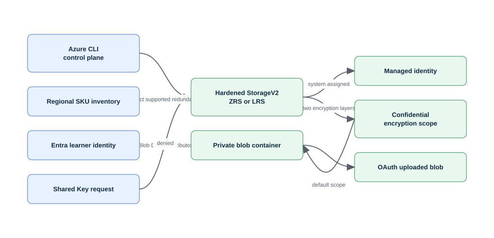

<!-- BEGIN GENERATED AZ104 V2 -->
# Lab 06: Secure storage accounts, redundancy, encryption, and keys

[Previous: Lab 05](../05-policy-costs-advisor/README.md) · [Catalog](../README.md) · [Next: Lab 07](../07-storage-network-sas/README.md)

This self-contained lab uses Azure CLI commands hosted in PowerShell. Complete the guided lane or the automated lane—not both with the same run ID.

## Scenario, role, and outcome

Scenario: A storage administrator hardening a general-purpose account is responding to an operational request: Select supported redundancy, create an infrastructure-encrypted account, authorize blob access with identity, and prove Shared Key denial.

Learner role: A storage administrator hardening a general-purpose account.

Outcome: Select supported redundancy, create an infrastructure-encrypted account, authorize blob access with identity, and prove Shared Key denial.

| Item | Value |
|---|---|
| Duration | 90 minutes |
| Difficulty | foundational |
| Cost class | `low` |
| Command surface | Azure CLI (`az`, `az rest`, Bicep, AzCopy, or KQL where required) hosted in PowerShell |
| Live state | Not executed during this offline rebuild |

Completion criteria:

- All required checkpoints report pass.
- The deterministic break/fix is injected, diagnosed, and repaired.
- cleanup.json reports no active run-owned resources, with any retained item explicitly documented.

## Objectives and checkpoints

| Objective | Skill | Checkpoints |
|---|---|---|
| `ST-ACCESS-04` | Manage access keys | `LAB06-CP01`, `LAB06-CP05` |
| `ST-ACCOUNTS-01` | Create and configure storage accounts | `LAB06-CP02`, `LAB06-CP05` |
| `ST-ACCOUNTS-02` | Configure Azure Storage redundancy | `LAB06-CP03`, `LAB06-CP05` |
| `ST-ACCOUNTS-04` | Configure storage account encryption | `LAB06-CP04`, `LAB06-CP05` |

The authoritative objective wording comes from the [Microsoft AZ-104 study guide](https://learn.microsoft.com/en-us/credentials/certifications/resources/study-guides/az-104), skills measured as of 2026-04-17.

## Architecture and service topology



The editable source is [architecture.mmd](diagrams/architecture.mmd). The control plane creates a ZRS-or-LRS StorageV2 account with two encryption layers. The signed-in Entra identity receives a blob data role and writes through OAuth. A separate Shared Key request is intentionally rejected.

## Concept primer and design decisions

Storage durability, transport security, authorization, and encryption are independent design choices. Redundancy availability is regional; infrastructure encryption is selected at creation; access keys are powerful credentials that must never enter evidence.

Design decisions:

- Select ZRS from live regional SKU restrictions and apply an explicit LRS fallback before creation.
- Require HTTPS and TLS 1.2 or later.
- Disable Shared Key, use a least-privilege blob data role, and rotate the secondary key without displaying it.

## Required and optional inputs

| Input | Required | Source | Safe example | Gate behavior |
|---|:---:|---|---|---|
| `run-id` — Unique lowercase run ownership identifier | Yes | parameter | `az104l06-01` | `block` |
| `subscription-id` — Expected disposable subscription ID | Yes | parameter-or-environment (`AZ104_SUBSCRIPTION_ID`) | `00000000-0000-0000-0000-000000000000` | `block` |
| `location` — Approved primary Azure region | Yes | parameter-or-environment (`AZ104_LOCATION`) | `westeurope` | `block` |

Secrets stay in temporary environment variables and are never written to `run.json`, validation evidence, or Git. A `skip-checkpoint` gate produces a visible partial result; it never becomes a pass.

## Read-only preflight

Sign in deliberately, inspect the active context, then run the lab preflight. It never signs in, changes context, installs an extension, registers a provider, or creates a resource.

```powershell
az login
az account show --query '{cloud:environmentName,subscription:id,tenant:tenantId,user:user.name}' --output json
./scripts/cli/Preflight.ps1 -SubscriptionId $env:AZ104_SUBSCRIPTION_ID -RunId 'az104l06-01' -Location 'westeurope'
```

Representative redacted output:

```text
context                 True  cloud=AzureCloud; tenant=<redacted>; subscription=<redacted>
azure-cli               True  2.88.x
provider:<namespace>    True  Registered
region                  True  westeurope
Preflight passed. It performed no Azure mutation.
```

If a required row fails, stop. Correct the local tool, context, provider, quota, SKU, region, permission, or input outside the lab, then rerun preflight.

## Task 1 — Select supported redundancy from regional SKU restrictions {#task-1}

Checkpoint: `LAB06-CP01`

Purpose and operational relevance: Query the Storage resource provider and choose ZRS only when the subscription and region permit it. Redundancy availability depends on region and subscription restrictions; guessing produces a failed deployment.

Run these commands from PowerShell. If you already used the automated lane, choose a new run ID before trying this guided lane.

```powershell
$skuUrl = "https://management.azure.com/subscriptions/$SubscriptionId/providers/Microsoft.Storage/skus?api-version=2023-05-01"
$skus = @(az rest --method get --url $skuUrl --output json | ConvertFrom-Json).value
$zrs = @($skus | Where-Object { $_.name -eq 'Standard_ZRS' -and $Location -in $_.locations -and @($_.restrictions | Where-Object { $_.type -eq 'location' -and $Location -in $_.values }).Count -eq 0 })
$selectedSku = if ($zrs.Count -gt 0) { 'Standard_ZRS' } else { 'Standard_LRS' }
$state.inputs['selected-redundancy'] = $selectedSku
Save-RunState
[pscustomobject]@{ location = $Location; selectedSku = $selectedSku; fallbackUsed = $selectedSku -eq 'Standard_LRS' }
```

Expected state: selected-redundancy is Standard_ZRS when unrestricted, otherwise Standard_LRS with fallbackUsed true.

Representative redacted output:

```text
location=westeurope; selectedSku=Standard_ZRS; fallbackUsed=False
```

Positive validation:

```powershell
$selectedRedundancy = [string]$state.inputs['selected-redundancy']
$deployedRedundancy = az storage account show --resource-group $ResourceGroupName --name $storage --query sku.name --output tsv
if ($selectedRedundancy -notin @('Standard_ZRS', 'Standard_LRS') -or $deployedRedundancy -ne $selectedRedundancy) {
  throw 'The persisted redundancy selection does not match the deployed storage SKU.'
}
$deployedRedundancy
```

Expected positive result: Exactly one supported selection is stored in run.json before account creation.

Negative validation:

```powershell
$conflict = @(az storage account list --resource-group $ResourceGroupName --output json | ConvertFrom-Json | Where-Object name -eq $storage)
if ($conflict.Count -ne 1 -or $conflict[0].tags.runId -ne $RunId) { throw 'Expected one run-owned deterministic storage account after deployment.' }
'Run-owned deterministic storage accounts: 1'
```

Expected negative result: Exactly one account has the deterministic name and current run ownership tag after deployment.

Evidence to retain:

- `LAB06-CP01` UTC result for select supported redundancy from regional SKU restrictions.
- Exact run-owned ID and asserted service properties from: Exactly one supported selection is stored in run.json before account creation.
- Negative-boundary outcome from: Exactly one account has the deterministic name and current run ownership tag after deployment.
- Cleanup dependency recorded for the objects created or configured by LAB06-CP01.

Common failure and safe retry: The SKU query is denied or location spelling does not match the provider's canonical location name. Correct the approved region and rerun the read-only SKU query; do not silently change regions.

Cleanup dependency: This checkpoint persists only the selected SKU.

## Task 2 — Create the hardened account with the selected redundancy {#task-2}

Checkpoint: `LAB06-CP02`

Purpose and operational relevance: Apply infrastructure encryption, TLS, HTTPS-only transport, public-access denial, Shared Key denial, and managed identity at creation. Infrastructure encryption cannot be enabled after account creation, so it belongs in the immutable deployment decision.

Run these commands from PowerShell. If you already used the automated lane, choose a new run ID before trying this guided lane.

```powershell
$storage = "st06$suffix"
$selectedSku = [string]$state.inputs['selected-redundancy']
$created = az storage account create --name $storage --resource-group $ResourceGroupName --location $Location --kind StorageV2 --sku $selectedSku --https-only true --min-tls-version TLS1_2 --allow-blob-public-access false --allow-shared-key-access false --require-infrastructure-encryption true --assign-identity --tags purpose=az104-lab labId=06 runId=$RunId --output json | ConvertFrom-Json
Add-ManagedObject -CheckpointId 'LAB06-CP02' -Kind 'azure-resource' -Id ([string]$created.id) -Name $storage -Type 'Microsoft.Storage/storageAccounts' -Scope "/subscriptions/$SubscriptionId/resourceGroups/$ResourceGroupName" -OwnershipMethod 'manifest-id-and-tags'
```

Expected state: The account uses the persisted SKU, TLS1_2, HTTPS only, infrastructure encryption, no public blobs, no Shared Key, and a system identity.

Representative redacted output:

```text
sku=Standard_ZRS; httpsOnly=True; minimumTls=TLS1_2; infrastructureEncryption=True; sharedKey=False
```

Positive validation:

```powershell
$account = az storage account show --resource-group $ResourceGroupName --name $storage --output json | ConvertFrom-Json
if ($account.sku.name -ne $state.inputs['selected-redundancy'] -or -not $account.encryption.requireInfrastructureEncryption -or $account.allowSharedKeyAccess) { throw 'Storage hardening state mismatch.' }
$account | Select-Object sku,minimumTlsVersion,enableHttpsTrafficOnly,allowSharedKeyAccess,encryption,identity
```

Expected positive result: Immutable and security properties match the design and the selected redundancy.

Negative validation:

```powershell
$account = az storage account show --resource-group $ResourceGroupName --name $storage --output json | ConvertFrom-Json
if ($account.allowBlobPublicAccess -or -not $account.identity.principalId) { throw 'Public access is enabled or managed identity is missing.' }
'Public blob access=False; managed identity present=True'
```

Expected negative result: Public blob access is disabled and the account identity exists.

Evidence to retain:

- `LAB06-CP02` UTC result for create the hardened account with the selected redundancy.
- Exact run-owned ID and asserted service properties from: Immutable and security properties match the design and the selected redundancy.
- Negative-boundary outcome from: Public blob access is disabled and the account identity exists.
- Cleanup dependency recorded for the objects created or configured by LAB06-CP02.

Common failure and safe retry: The selected SKU becomes restricted, the globally unique name is unavailable, or infrastructure encryption is unsupported for the requested kind. Requery SKUs and name availability; choose a new run ID for a new name rather than weakening encryption.

Cleanup dependency: Delete role assignments and data-plane objects before the account and resource group.

## Task 3 — Authorize and exercise identity-based blob access {#task-3}

Checkpoint: `LAB06-CP03`

Purpose and operational relevance: Assign Storage Blob Data Contributor to the signed-in learner, create an encryption scope and private container, and upload through OAuth. Management-plane ownership does not automatically grant blob data-plane authorization.

Run these commands from PowerShell. If you already used the automated lane, choose a new run ID before trying this guided lane.

```powershell
$storageId = az storage account show --resource-group $ResourceGroupName --name $storage --query id --output tsv
$learnerId = az ad signed-in-user show --query id --output tsv
if (-not $learnerId) { throw 'This interactive lab requires a signed-in Entra user for data-plane authorization.' }
$state.inputs['learner-object-id'] = $learnerId
Save-RunState
$assignment = az role assignment create --assignee-object-id $learnerId --assignee-principal-type User --role 'Storage Blob Data Contributor' --scope $storageId --output json | ConvertFrom-Json
Add-ManagedObject -CheckpointId 'LAB06-CP03' -Kind 'azure-resource' -Id ([string]$assignment.id) -Name 'Storage Blob Data Contributor' -Type 'Microsoft.Authorization/roleAssignments' -Scope $storageId -OwnershipMethod 'manifest-id'
az storage account encryption-scope create --resource-group $ResourceGroupName --account-name $storage --name confidential --key-source Microsoft.Storage --require-infrastructure-encryption true --output none
az storage container create --account-name $storage --name private --auth-mode login --default-encryption-scope confidential --deny-encryption-scope-override true --output none
$sample = Join-Path $StateDir 'identity-authorized.txt'
'Azure CLI OAuth data-plane validation' | Set-Content -LiteralPath $sample -Encoding utf8
az storage blob upload --account-name $storage --container-name private --name identity-authorized.txt --file $sample --auth-mode login --overwrite true --output none
```

Expected state: The learner has one account-scoped blob data role and the private blob was written with login auth into the infrastructure-encrypted scope.

Representative redacted output:

```text
role=Storage Blob Data Contributor; authMode=login; container=private; encryptionScope=confidential
```

Positive validation:

```powershell
$blob = az storage blob show --account-name $storage --container-name private --name identity-authorized.txt --auth-mode login --output json | ConvertFrom-Json
if ($blob.properties.encryptionScope -ne 'confidential') { throw 'Blob does not use the required encryption scope.' }
$blob | Select-Object name,properties
```

Expected positive result: OAuth can read the sample blob and its encryptionScope is confidential.

Negative validation:

```powershell
$assignments = @(az role assignment list --assignee-object-id $state.inputs['learner-object-id'] --scope $storageId --output json | ConvertFrom-Json | Where-Object roleDefinitionName -eq 'Storage Blob Data Contributor')
if ($assignments.Count -ne 1) { throw 'Expected exactly one learner blob data assignment.' }
'Blob data assignments at account: 1'
```

Expected negative result: No duplicate blob data role assignment exists.

Evidence to retain:

- `LAB06-CP03` UTC result for authorize and exercise identity-based blob access.
- Exact run-owned ID and asserted service properties from: OAuth can read the sample blob and its encryptionScope is confidential.
- Negative-boundary outcome from: No duplicate blob data role assignment exists.
- Cleanup dependency recorded for the objects created or configured by LAB06-CP03.

Common failure and safe retry: RBAC propagation delays data operations or the active Azure CLI identity is a service principal rather than a user. Wait for the exact assignment to propagate and retry the OAuth query; never enable Shared Key as a propagation workaround.

Cleanup dependency: Delete the data role and container contents before deleting the storage account.

## Task 4 — Prove that Shared Key authorization is denied {#task-4}

Checkpoint: `LAB06-CP04`

Purpose and operational relevance: Keep one account key only in memory, attempt a key-signed data request, require a 403-style failure, and clear the variable. Disabling Shared Key is meaningful only when a key-signed request is actually rejected while OAuth still works.

Run these commands from PowerShell. If you already used the automated lane, choose a new run ID before trying this guided lane.

```powershell
$accountKey = az storage account keys list --resource-group $ResourceGroupName --account-name $storage --query '[0].value' --output tsv
try {
    $PSNativeCommandUseErrorActionPreference = $false
    $denied = az storage container list --account-name $storage --account-key $accountKey --output none 2>&1
    $deniedExit = $LASTEXITCODE
    $PSNativeCommandUseErrorActionPreference = $true
    if ($deniedExit -eq 0) { throw 'Shared Key request unexpectedly succeeded.' }
} finally {
    $accountKey = $null
}
```

Expected state: The key-signed container listing fails, no key appears in output or state, and the OAuth blob query remains successful.

Representative redacted output:

```text
sharedKeyRequest=denied; keyPersisted=False; oauthRequest=pass
```

Positive validation:

```powershell
$oauthBlob = az storage blob exists --account-name $storage --container-name private --name identity-authorized.txt --auth-mode login --query exists --output tsv
if ($oauthBlob -ne 'true') { throw 'OAuth blob validation failed after Shared Key denial.' }
'OAuth blob exists=True'
```

Expected positive result: Identity authorization still reads the sample blob.

Negative validation:

```powershell
$allowSharedKey = az storage account show --resource-group $ResourceGroupName --name $storage --query allowSharedKeyAccess --output tsv
if ($allowSharedKey -ne 'false') { throw 'allowSharedKeyAccess is not false.' }
if (Select-String -Path (Join-Path $StateDir '*.json') -Pattern 'accountKey|AccountKey|AZURE_STORAGE_KEY' -ErrorAction SilentlyContinue) { throw 'A key-like field was persisted in state.' }
'Shared Key disabled; no key-like state fields found.'
```

Expected negative result: Shared Key remains disabled and no key material is persisted.

Evidence to retain:

- `LAB06-CP04` UTC result for prove that Shared Key authorization is denied.
- Exact run-owned ID and asserted service properties from: Identity authorization still reads the sample blob.
- Negative-boundary outcome from: Shared Key remains disabled and no key material is persisted.
- Cleanup dependency recorded for the objects created or configured by LAB06-CP04.

Common failure and safe retry: The script accidentally falls back to account-key discovery or logs the native error with sensitive arguments. Verify allowSharedKeyAccess and use explicit --auth-mode login for the positive path; never print or persist the key.

Cleanup dependency: No credential cleanup is needed because the key stays in memory; storage data is removed with the account.

## Task 5 — Rotate the secondary key and reconcile the hardened account {#task-5}

Checkpoint: `LAB06-CP05`

Purpose and operational relevance: Renew the unused secondary key without returning it, then verify redundancy, encryption, transport, authorization, and cleanup scope together. Key rotation remains necessary for dormant emergency credentials even when Shared Key authorization is disabled.

Run these commands from PowerShell. If you already used the automated lane, choose a new run ID before trying this guided lane.

```powershell
az storage account keys renew --resource-group $ResourceGroupName --account-name $storage --key secondary --output none
az storage account show --resource-group $ResourceGroupName --name $storage --query '{sku:sku.name,https:enableHttpsTrafficOnly,tls:minimumTlsVersion,sharedKey:allowSharedKeyAccess,publicBlob:allowBlobPublicAccess,infrastructureEncryption:encryption.requireInfrastructureEncryption}' --output table
```

Expected state: All hardened properties remain intact after a non-disclosing secondary-key rotation and the OAuth blob path still passes.

Representative redacted output:

```text
sku=<selected>; https=True; tls=TLS1_2; sharedKey=False; publicBlob=False; infrastructureEncryption=True
```

Positive validation:

```powershell
$account = az storage account show --resource-group $ResourceGroupName --name $storage --output json | ConvertFrom-Json
$pass = $account.sku.name -eq $state.inputs['selected-redundancy'] -and $account.minimumTlsVersion -eq 'TLS1_2' -and $account.enableHttpsTrafficOnly -and -not $account.allowSharedKeyAccess -and -not $account.allowBlobPublicAccess -and $account.encryption.requireInfrastructureEncryption
if (-not $pass) { throw 'One or more hardened account properties drifted.' }
$account | Select-Object id,sku,minimumTlsVersion,enableHttpsTrafficOnly,allowSharedKeyAccess,allowBlobPublicAccess,encryption
```

Expected positive result: Every security and redundancy property matches the persisted design.

Negative validation:

```powershell
$accounts = @(az storage account list --resource-group $ResourceGroupName --output json | ConvertFrom-Json)
if ($accounts.Count -ne 1 -or $accounts[0].name -ne $storage) { throw 'Unexpected storage-account inventory in the lab group.' }
'Run-owned storage accounts: 1'
```

Expected negative result: The lab resource group contains only the intended account.

Evidence to retain:

- `LAB06-CP05` UTC result for rotate the secondary key and reconcile the hardened account.
- Exact run-owned ID and asserted service properties from: Every security and redundancy property matches the persisted design.
- Negative-boundary outcome from: The lab resource group contains only the intended account.
- Cleanup dependency recorded for the objects created or configured by LAB06-CP05.

Common failure and safe retry: A security property drifted during troubleshooting or role propagation still blocks the OAuth validation. Repair only the mutable drifted property; infrastructure encryption requires account recreation with a new run ID.

Cleanup dependency: Remove assignment, blobs, container, encryption scope, account, then resource group and query the exact account ID.

## Final validation and result interpretation

Run independent deployment validation after all required checkpoints:

```powershell
./scripts/cli/Validate.ps1 -RunId 'az104l06-01' -Mode Deployment
az resource list --resource-group 'rg-az104-l06-az104l06-01' --query '[].{name:name,type:type}' --output table
```

- `pass`: every required positive and negative check passed.
- `partial`: every required check passed, but at least one optional gate was deliberately skipped.
- `fail`: a required checkpoint failed; do not record the lab as complete.

Keep the redacted `validation.json`; do not retain credentials, tokens, access keys, certificate material, email addresses, tenant IDs, or unredacted command output.

## Deterministic break/fix exercise

Injection: Attempt a container listing with a current account key after Shared Key authorization is disabled.

Expected symptom: The key-signed data request is denied while the OAuth blob query still succeeds.

Diagnose with a read-only service query:

```powershell
$conflict = @(az storage account list --resource-group $ResourceGroupName --output json | ConvertFrom-Json | Where-Object name -eq $storage)
if ($conflict.Count -ne 1 -or $conflict[0].tags.runId -ne $RunId) { throw 'Expected one run-owned deterministic storage account after deployment.' }
'Run-owned deterministic storage accounts: 1'
```

Diagnosis: Compare allowSharedKeyAccess with the two authorization paths and confirm no key was persisted.

Repair: Keep Shared Key disabled and use the least-privilege Entra data role for the retry.

Before/after evidence must show the failed negative or positive check before repair and the same check passing afterward. Do not inject a second fault until the first is removed.

## Optional job-style challenge

Recommend redundancy and encryption settings for a regional business app and justify recovery tradeoffs.

Deliver a short change record containing assumptions, exact commands, redacted evidence, cost and risk notes, rollback, and residual results. The challenge is optional and never changes required checkpoint status.

## Troubleshooting

| Symptom | Likely cause | Safe next step |
|---|---|---|
| Context mismatch | Active CLI context differs from `run.json` | Stop, inspect `az account show`, and select the intended disposable context yourself. |
| Provider or feature unavailable | Registration, region, feature, or SKU gate is unmet | Read the preflight result; do not register or enable tenant features implicitly. |
| Name already exists | The run ID is reused or a globally unique name collided | Keep existing state intact and choose a new run ID. |
| Expected state is delayed | The service is converging asynchronously | Repeat only the read-only query with bounded retries; do not duplicate creation. |
| Permission denied | Role, Graph scope, or data-plane authorization is insufficient | Confirm the declared least-privilege boundary; do not broaden access automatically. |
| Cleanup refuses ownership | ID, context, or tags differ from the manifest | Investigate the mismatch; never bypass ownership verification. |

## Cleanup and residual verification

Preview exact targets first, execute only after ownership review, then validate post-cleanup:

```powershell
./scripts/cli/Cleanup.ps1 -RunId 'az104l06-01'
./scripts/cli/Cleanup.ps1 -RunId 'az104l06-01' -Execute
./scripts/cli/Validate.ps1 -RunId 'az104l06-01' -Mode PostCleanup
$accounts = @(az storage account list --resource-group $ResourceGroupName --output json | ConvertFrom-Json)
if ($accounts.Count -ne 1 -or $accounts[0].name -ne $storage) { throw 'Unexpected storage-account inventory in the lab group.' }
'Run-owned storage accounts: 1'
```

`cleanup.json` passes only when no active manifest-managed object remains. Soft-deleted or intentionally retained items must be listed with their reason and expected disposition. The lifecycle never performs irreversible purge automatically.

## Exam debrief and assessment

Explain why the expected state, negative check, and cleanup boundary matter—not only which command was used. Map any missed concept back to its task anchor before reviewing the answer key.

Complete [QUESTIONS.md](assessment/QUESTIONS.md), then use [ANSWERS.md](assessment/ANSWERS.md) for option-by-option remediation. Scores of 85–100% indicate mastery, 70–84% indicate targeted review, and below 70% means repeat the mapped tasks.

## Microsoft Learn sources

- [Microsoft AZ-104 study guide](https://learn.microsoft.com/en-us/credentials/certifications/resources/study-guides/az-104)
- [Create an Azure storage account using Azure CLI](https://learn.microsoft.com/en-us/azure/storage/common/storage-account-create)
- [Azure Storage redundancy options](https://learn.microsoft.com/en-us/azure/storage/common/storage-redundancy)
- [Azure Storage encryption for data at rest](https://learn.microsoft.com/en-us/azure/storage/common/storage-service-encryption)
- [Prevent Shared Key authorization for Azure Storage](https://learn.microsoft.com/en-us/azure/storage/common/shared-key-authorization-prevent)
- [Authorize access to blobs using Azure CLI and Microsoft Entra ID](https://learn.microsoft.com/en-us/azure/storage/blobs/authorize-data-operations-cli)

## Lifecycle script appendix

The guided task blocks above and these executable scripts are generated from the same checkpoint data. The scripts are an optional automated lane; use a different run ID if you already completed the guided lane.

### `Preflight.ps1`

```powershell
# BEGIN GENERATED AZ104 V2
#requires -Version 7.4
[CmdletBinding()]
[Diagnostics.CodeAnalysis.SuppressMessageAttribute('PSAvoidUsingWriteHost', '', Justification = 'Interactive lab progress is intentionally written to the host.')]
[Diagnostics.CodeAnalysis.SuppressMessageAttribute('PSReviewUnusedParameter', '', Justification = 'All lifecycle scripts expose a stable cross-lab interface.')]
[Diagnostics.CodeAnalysis.SuppressMessageAttribute('PSUseDeclaredVarsMoreThanAssignments', '', Justification = 'Generated task variables are intentionally shared across checkpoint blocks.')]
param(
    [string]$SubscriptionId = $env:AZ104_SUBSCRIPTION_ID,
    [Parameter(Mandatory)][ValidatePattern('^[a-z0-9](?:[a-z0-9-]{0,30}[a-z0-9])?$')][string]$RunId,
    [Parameter(Mandatory)][ValidatePattern('^[a-z0-9]+$')][string]$Location,
    [string]$SecondaryLocation = $env:AZ104_SECONDARY_LOCATION
)

Set-StrictMode -Version Latest
$ErrorActionPreference = 'Stop'
$PSNativeCommandUseErrorActionPreference = $true

if (-not (Get-Command az -ErrorAction SilentlyContinue)) {
    throw 'Azure CLI is required. Run the repository readiness initializer, then retry.'
}

$account = az account show --output json | ConvertFrom-Json
if (-not $account) { throw 'No active Azure CLI context. Run az login deliberately before this lab.' }
if ($SubscriptionId -and [string]$account.id -ne $SubscriptionId) {
    throw "Context mismatch: active subscription is $($account.id), expected $SubscriptionId. Preflight will not switch it."
}
if (-not $SubscriptionId) { $SubscriptionId = [string]$account.id }
# The account read above is the mandatory context gate. All remaining Azure
# probes are collected as results instead of allowing one unavailable SKU or
# provider query to abort the readiness report before it can explain the gap.
$PSNativeCommandUseErrorActionPreference = $false
$suffix = (($RunId -replace '[^a-z0-9]', '') + '000000000000').Substring(0, 12)
$ResourceGroupName = $(if ('06' -in @('00', '01', '02')) { $null } else { "rg-az104-l06-$RunId" })

$checks = [System.Collections.Generic.List[object]]::new()
function Add-PreflightResult {
    param([string]$Id, [bool]$Required, [bool]$Passed, [string]$Actual)
    $checks.Add([pscustomobject]@{ id = $Id; required = $Required; passed = $Passed; actual = $Actual })
}

Add-PreflightResult -Id 'context' -Required $true -Passed $true -Actual "cloud=$($account.environmentName); tenant=<redacted>; subscription=<redacted>"
$azVersion = (az version --query '"azure-cli"' --output tsv)
$bicepVersion = (az bicep version 2>&1 | Out-String).Trim()
Add-PreflightResult -Id 'azure-cli' -Required $true -Passed ([bool]$azVersion) -Actual $azVersion
Add-PreflightResult -Id 'powershell' -Required $true -Passed ($PSVersionTable.PSVersion -ge [version]'7.4') -Actual $PSVersionTable.PSVersion.ToString()
Add-PreflightResult -Id 'bicep' -Required $true -Passed ([bool]$bicepVersion) -Actual $bicepVersion

$requiredEnvironmentVariables = @()
foreach ($variableName in $requiredEnvironmentVariables) {
    $present = -not [string]::IsNullOrWhiteSpace([Environment]::GetEnvironmentVariable($variableName))
    Add-PreflightResult -Id "input:$variableName" -Required $true -Passed $present -Actual $(if ($present) { 'present (value redacted)' } else { 'missing' })
}

$providers = @(
    'Microsoft.Storage'
)
foreach ($provider in $providers) {
    $registrationState = az provider show --namespace $provider --query registrationState --output tsv 2>$null
    Add-PreflightResult -Id "provider:$provider" -Required $true -Passed ($registrationState -eq 'Registered') -Actual $(if ($registrationState) { $registrationState } else { 'Unavailable' })
}

$knownLocation = az account list-locations --query "[?name=='$Location'].name | [0]" --output tsv
Add-PreflightResult -Id 'region' -Required $true -Passed ($knownLocation -eq $Location) -Actual $(if ($knownLocation) { $knownLocation } else { 'not available' })

$storage = "st06$suffix"

$probePassed = $true
$probeActual = 'assertion passed (output not persisted)'
try {
    $LASTEXITCODE = 0
    & {
$learnerId = az ad signed-in-user show --query id --output tsv
if (-not $learnerId) { throw 'An interactive Entra user is required for the OAuth data lane.' }
$skuUrl = "https://management.azure.com/subscriptions/$SubscriptionId/providers/Microsoft.Storage/skus?api-version=2023-05-01"
$skus = @(az rest --method get --url $skuUrl --output json | ConvertFrom-Json).value
if (@($skus | Where-Object { $Location -in $_.locations }).Count -eq 0) { throw 'No Storage SKU inventory was returned for the selected region.' }
    } | Out-Null
    if ($LASTEXITCODE -ne 0) { throw "native exit code $LASTEXITCODE" }
} catch {
    $probePassed = $false
    $probeActual = "assertion failed: $($_.Exception.GetType().Name)"
}
Add-PreflightResult -Id 'preflight.authored.lab06.identity-and-skus' -Required $true -Passed $probePassed -Actual $probeActual

$probePassed = $true
$probeActual = 'assertion passed (output not persisted)'
try {
    $LASTEXITCODE = 0
    & {
$availability = az storage account check-name --name $storage --output json | ConvertFrom-Json
if (-not $availability.nameAvailable) { throw "Storage name unavailable: $($availability.reason)" }
    } | Out-Null
    if ($LASTEXITCODE -ne 0) { throw "native exit code $LASTEXITCODE" }
} catch {
    $probePassed = $false
    $probeActual = "assertion failed: $($_.Exception.GetType().Name)"
}
Add-PreflightResult -Id 'preflight.authored.lab06.storage-name' -Required $true -Passed $probePassed -Actual $probeActual

$checks | Format-Table -AutoSize
$failedRequired = @($checks | Where-Object { $_.required -and -not $_.passed })
if ($failedRequired.Count -gt 0) {
    throw "Preflight blocked: $($failedRequired.id -join ', ')"
}
Write-Host 'Preflight passed. It performed no sign-in, context switch, provider registration, or Azure mutation.'
# END GENERATED AZ104 V2
```

### `Setup.ps1`

```powershell
# BEGIN GENERATED AZ104 V2
#requires -Version 7.4
[CmdletBinding()]
[Diagnostics.CodeAnalysis.SuppressMessageAttribute('PSAvoidUsingWriteHost', '', Justification = 'Interactive lab progress is intentionally written to the host.')]
[Diagnostics.CodeAnalysis.SuppressMessageAttribute('PSReviewUnusedParameter', '', Justification = 'All lifecycle scripts expose a stable cross-lab interface.')]
[Diagnostics.CodeAnalysis.SuppressMessageAttribute('PSUseDeclaredVarsMoreThanAssignments', '', Justification = 'Generated task variables are intentionally shared across checkpoint blocks.')]
param(
    [string]$SubscriptionId = $env:AZ104_SUBSCRIPTION_ID,
    [Parameter(Mandatory)][ValidatePattern('^[a-z0-9](?:[a-z0-9-]{0,30}[a-z0-9])?$')][string]$RunId,
    [Parameter(Mandatory)][ValidatePattern('^[a-z0-9]+$')][string]$Location,
    [string]$SecondaryLocation = $env:AZ104_SECONDARY_LOCATION,
    [switch]$AcknowledgeCost,
    [switch]$AcknowledgeTenantChange,
    [switch]$Execute
)

Set-StrictMode -Version Latest
$ErrorActionPreference = 'Stop'
$PSNativeCommandUseErrorActionPreference = $true

if (-not (Get-Command az -ErrorAction SilentlyContinue)) {
    throw 'Azure CLI is required. Run the repository readiness initializer, then retry.'
}

$LabRoot = (Resolve-Path (Join-Path $PSScriptRoot '../..')).Path
$StateDir = Join-Path $LabRoot ".state/$RunId"
$Manifest = Join-Path $StateDir 'run.json'
$ResourceGroupName = $(if ('06' -in @('00', '01', '02')) { $null } else { "rg-az104-l06-$RunId" })
$suffix = (($RunId -replace '[^a-z0-9]', '') + '000000000000').Substring(0, 12)

Write-Host 'LAB-06 execution plan'
Write-Host "  subscription: $SubscriptionId"
Write-Host "  location: $Location"
Write-Host '  command surface: Azure CLI hosted in PowerShell'
Write-Host '  state: run.json, validation.json, cleanup.json'
if (-not $Execute) {
    Write-Host 'Preview only. Review context, inputs, cost, tenant scope, and cleanup before using -Execute.'
    return
}
if ($false -and -not $AcknowledgeCost) { throw 'This lab requires -AcknowledgeCost before execution.' }
if ($false -and -not $AcknowledgeTenantChange) { throw 'This lab requires -AcknowledgeTenantChange before execution.' }

& (Join-Path $PSScriptRoot 'Preflight.ps1') -SubscriptionId $SubscriptionId -RunId $RunId -Location $Location -SecondaryLocation $SecondaryLocation
if (Test-Path -LiteralPath $Manifest) { throw "State already exists at $Manifest. Choose a new run ID." }
New-Item -ItemType Directory -Path $StateDir -Force | Out-Null
$account = az account show --output json | ConvertFrom-Json
if (-not $SubscriptionId) { $SubscriptionId = [string]$account.id }
$now = (Get-Date).ToUniversalTime().ToString('o')
$state = @{
    schemaVersion = '1.0.0'
    labId = 'LAB-06'
    runId = $RunId
    createdAt = $now
    updatedAt = $now
    status = 'initialized'
    context = @{ cloud = [string]$account.environmentName; tenantId = [string]$account.tenantId; subscriptionId = [string]$SubscriptionId }
    acknowledgements = @{ cost = [bool]$AcknowledgeCost; tenantChange = [bool]$AcknowledgeTenantChange }
    inputs = @{ 'location' = $Location; 'secondary-location' = $SecondaryLocation }
    checkpointStates = @(
        @{ checkpointId = 'LAB06-CP01'; required = $true; status = 'pending'; updatedAt = $now; message = 'Not started.' }
        @{ checkpointId = 'LAB06-CP02'; required = $true; status = 'pending'; updatedAt = $now; message = 'Not started.' }
        @{ checkpointId = 'LAB06-CP03'; required = $true; status = 'pending'; updatedAt = $now; message = 'Not started.' }
        @{ checkpointId = 'LAB06-CP04'; required = $true; status = 'pending'; updatedAt = $now; message = 'Not started.' }
        @{ checkpointId = 'LAB06-CP05'; required = $true; status = 'pending'; updatedAt = $now; message = 'Not started.' }
    )
    managedObjects = @()
    originalSettings = @()
}
$external = @{}

function Save-RunState {
    $state.updatedAt = (Get-Date).ToUniversalTime().ToString('o')
    $state | ConvertTo-Json -Depth 30 | Set-Content -LiteralPath $Manifest -Encoding utf8
}

function Save-ExternalState {
    foreach ($key in @($external.Keys)) {
        $value = $external[$key]
        if ($null -eq $value -or $value -is [string] -or $value -is [ValueType]) {
            $inputKey = 'external-' + (([string]$key -creplace '([a-z0-9])([A-Z])', '$1-$2') -replace '[^a-zA-Z0-9-]', '-').ToLowerInvariant()
            $state.inputs[$inputKey] = $value
        }
    }
    Save-RunState
}

function Write-CheckpointState {
    param([string]$CheckpointId, [string]$Status, [string]$Message)
    $entry = @($state.checkpointStates | Where-Object { $_.checkpointId -eq $CheckpointId })[0]
    $entry.status = $Status
    $entry.updatedAt = (Get-Date).ToUniversalTime().ToString('o')
    $entry.message = $Message
}

function Add-ManagedObject {
    param([string]$CheckpointId, [string]$Kind, [string]$Id, [string]$Name, [string]$Type, [string]$Scope, [string]$OwnershipMethod)
    if ([string]::IsNullOrWhiteSpace($Id)) { return }
    $existing = @($state.managedObjects | Where-Object { $_.id -eq $Id })
    if ($existing.Count -gt 0) { return }
    $expectedTags = @{}
    if ($OwnershipMethod -eq 'manifest-id-and-tags') {
        $expectedTags = @{ purpose = 'az104-lab'; labId = '06'; runId = $RunId }
    }
    $state.managedObjects += @{
        checkpointId = $CheckpointId
        kind = $Kind
        id = $Id
        name = $Name
        type = $Type
        scope = $Scope
        ownership = @{ method = $OwnershipMethod; expectedTags = $expectedTags }
        recordedAt = (Get-Date).ToUniversalTime().ToString('o')
        lifecycleStatus = 'active'
    }
    Save-RunState
}

function Sync-ManagedResource {
    param([string]$CheckpointId)
    # The entire recovery inventory is best effort so a state-helper or Azure
    # query failure cannot mask the original mutation error. Every object that
    # can be recovered is still persisted immediately as it is discovered.
    $nativePreference = $PSNativeCommandUseErrorActionPreference
    $PSNativeCommandUseErrorActionPreference = $false
    try {
        Save-ExternalState
        $resourceGroupNames = [System.Collections.Generic.HashSet[string]]::new([System.StringComparer]::OrdinalIgnoreCase)
        if ($ResourceGroupName) { $null = $resourceGroupNames.Add([string]$ResourceGroupName) }
        foreach ($key in @($external.Keys | Where-Object { [string]$_ -match '(?i)ResourceGroupName$' })) {
            if ($external[$key]) { $null = $resourceGroupNames.Add([string]$external[$key]) }
        }
        foreach ($groupName in $resourceGroupNames) {
            $groupJson = az group show --subscription $SubscriptionId --name $groupName --output json 2>$null
            $group = $(if ($LASTEXITCODE -eq 0 -and $groupJson) { $groupJson | ConvertFrom-Json } else { $null })
            if ($group) {
                $groupCheckpoint = $(if ([string]$group.name -eq [string]$ResourceGroupName) { 'LAB06-CP01' } else { $CheckpointId })
                Add-ManagedObject -CheckpointId $groupCheckpoint -Kind 'azure-resource' -Id ([string]$group.id) -Name ([string]$group.name) -Type 'Microsoft.Resources/resourceGroups' -Scope "/subscriptions/$SubscriptionId" -OwnershipMethod 'manifest-id-and-tags'
                $resourcesJson = az resource list --subscription $SubscriptionId --resource-group $groupName --output json 2>$null
                $resources = @($(if ($LASTEXITCODE -eq 0 -and $resourcesJson) { $resourcesJson | ConvertFrom-Json } else { @() }))
                foreach ($resource in $resources) {
                    Add-ManagedObject -CheckpointId $CheckpointId -Kind 'azure-resource' -Id ([string]$resource.id) -Name ([string]$resource.name) -Type ([string]$resource.type) -Scope ([string]$group.id) -OwnershipMethod 'manifest-id-and-tags'
                }
            }
        }
        if ($external.ContainsKey('groupId') -and $external.groupId) { Add-ManagedObject -CheckpointId $CheckpointId -Kind 'entra-object' -Id ([string]$external.groupId) -Name 'lab-group' -Type 'Microsoft.Graph/group' -Scope $state.context.tenantId -OwnershipMethod 'manifest-id' }
        if ($external.ContainsKey('guestUserId') -and $external.guestUserId) { Add-ManagedObject -CheckpointId $CheckpointId -Kind 'entra-object' -Id ([string]$external.guestUserId) -Name 'guest-user' -Type 'Microsoft.Graph/user' -Scope $state.context.tenantId -OwnershipMethod 'manifest-id' }
        if ($external.ContainsKey('userIds')) {
            foreach ($userId in @($external.userIds)) { Add-ManagedObject -CheckpointId $CheckpointId -Kind 'entra-object' -Id ([string]$userId) -Name 'lab-user' -Type 'Microsoft.Graph/user' -Scope $state.context.tenantId -OwnershipMethod 'manifest-id' }
        }
        if ($external.ContainsKey('delegationRecordId') -and $external.delegationRecordId) {
            Add-ManagedObject -CheckpointId $CheckpointId -Kind 'azure-resource' -Id ([string]$external.delegationRecordId) -Name ([string]$external.delegationRecordName) -Type 'Microsoft.Network/dnsZones/NS' -Scope ([string]$external.parentZoneId) -OwnershipMethod 'manifest-id'
        }
        if ($external.ContainsKey('connectionMonitorId') -and $external.connectionMonitorId) {
            Add-ManagedObject -CheckpointId $CheckpointId -Kind 'azure-resource' -Id ([string]$external.connectionMonitorId) -Name ([string]$external.connectionMonitorName) -Type 'Microsoft.Network/networkWatchers/connectionMonitors' -Scope ([string]$external.networkWatcherId) -OwnershipMethod 'manifest-id'
        }
    } catch {
        Write-Warning "Recovery inventory for $CheckpointId was incomplete: $($_.Exception.Message)"
    } finally {
        $PSNativeCommandUseErrorActionPreference = $nativePreference
    }
}

# The manifest exists before the first Azure mutation.
Save-RunState
$state.status = 'setup-in-progress'
Save-RunState

$expiresOn = (Get-Date).ToUniversalTime().AddDays(1).ToString('yyyy-MM-dd')
try {
    az group create --subscription $SubscriptionId --name $ResourceGroupName --location $Location --tags purpose=az104-lab labId=06 runId=$RunId expiresOn=$expiresOn --output none
} catch {
    Write-CheckpointState -CheckpointId 'LAB06-CP01' -Status 'fail' -Message "Resource-group boundary creation failed: $($_.Exception.GetType().Name)"
    $state.status = 'failed'
    Save-RunState
    throw
} finally {
    Sync-ManagedResource -CheckpointId 'LAB06-CP01'
}

# CHECKPOINT LAB06-CP01 BEGIN
try {
    Write-CheckpointState -CheckpointId 'LAB06-CP01' -Status 'in-progress' -Message 'Checkpoint execution started.'
    $activeCheckpointId = 'LAB06-CP01'
    Save-RunState

    $skuUrl = "https://management.azure.com/subscriptions/$SubscriptionId/providers/Microsoft.Storage/skus?api-version=2023-05-01"
    $skus = @(az rest --method get --url $skuUrl --output json | ConvertFrom-Json).value
    $zrs = @($skus | Where-Object { $_.name -eq 'Standard_ZRS' -and $Location -in $_.locations -and @($_.restrictions | Where-Object { $_.type -eq 'location' -and $Location -in $_.values }).Count -eq 0 })
    $selectedSku = if ($zrs.Count -gt 0) { 'Standard_ZRS' } else { 'Standard_LRS' }
    $state.inputs['selected-redundancy'] = $selectedSku
    Save-RunState
    [pscustomobject]@{ location = $Location; selectedSku = $selectedSku; fallbackUsed = $selectedSku -eq 'Standard_LRS' }

    Sync-ManagedResource -CheckpointId 'LAB06-CP01'
    Write-CheckpointState -CheckpointId 'LAB06-CP01' -Status 'pass' -Message 'selected-redundancy is Standard_ZRS when unrestricted, otherwise Standard_LRS with fallbackUsed true.'
    Save-RunState
} catch {
    Sync-ManagedResource -CheckpointId 'LAB06-CP01'
    Write-CheckpointState -CheckpointId 'LAB06-CP01' -Status 'fail' -Message "Checkpoint failed: $($_.Exception.GetType().Name)"
    $state.status = 'failed'
    Save-RunState
    throw
}
# CHECKPOINT LAB06-CP01 END

# CHECKPOINT LAB06-CP02 BEGIN
try {
    Write-CheckpointState -CheckpointId 'LAB06-CP02' -Status 'in-progress' -Message 'Checkpoint execution started.'
    $activeCheckpointId = 'LAB06-CP02'
    Save-RunState

    $storage = "st06$suffix"
    $selectedSku = [string]$state.inputs['selected-redundancy']
    try {
        $created = az storage account create --name $storage --resource-group $ResourceGroupName --location $Location --kind StorageV2 --sku $selectedSku --https-only true --min-tls-version TLS1_2 --allow-blob-public-access false --allow-shared-key-access false --require-infrastructure-encryption true --assign-identity --tags purpose=az104-lab labId=06 runId=$RunId --output json | ConvertFrom-Json
    } finally {
        Sync-ManagedResource -CheckpointId 'LAB06-CP02'
    }
    Add-ManagedObject -CheckpointId 'LAB06-CP02' -Kind 'azure-resource' -Id ([string]$created.id) -Name $storage -Type 'Microsoft.Storage/storageAccounts' -Scope "/subscriptions/$SubscriptionId/resourceGroups/$ResourceGroupName" -OwnershipMethod 'manifest-id-and-tags'

    Sync-ManagedResource -CheckpointId 'LAB06-CP02'
    Write-CheckpointState -CheckpointId 'LAB06-CP02' -Status 'pass' -Message 'The account uses the persisted SKU, TLS1_2, HTTPS only, infrastructure encryption, no public blobs, no Shared Key, and a system identity.'
    Save-RunState
} catch {
    Sync-ManagedResource -CheckpointId 'LAB06-CP02'
    Write-CheckpointState -CheckpointId 'LAB06-CP02' -Status 'fail' -Message "Checkpoint failed: $($_.Exception.GetType().Name)"
    $state.status = 'failed'
    Save-RunState
    throw
}
# CHECKPOINT LAB06-CP02 END

# CHECKPOINT LAB06-CP03 BEGIN
try {
    Write-CheckpointState -CheckpointId 'LAB06-CP03' -Status 'in-progress' -Message 'Checkpoint execution started.'
    $activeCheckpointId = 'LAB06-CP03'
    Save-RunState

    $storageId = az storage account show --resource-group $ResourceGroupName --name $storage --query id --output tsv
    $learnerId = az ad signed-in-user show --query id --output tsv
    if (-not $learnerId) { throw 'This interactive lab requires a signed-in Entra user for data-plane authorization.' }
    $state.inputs['learner-object-id'] = $learnerId
    Save-RunState
    try {
        $assignment = az role assignment create --assignee-object-id $learnerId --assignee-principal-type User --role 'Storage Blob Data Contributor' --scope $storageId --output json | ConvertFrom-Json
    } finally {
        Sync-ManagedResource -CheckpointId 'LAB06-CP03'
    }
    Add-ManagedObject -CheckpointId 'LAB06-CP03' -Kind 'azure-resource' -Id ([string]$assignment.id) -Name 'Storage Blob Data Contributor' -Type 'Microsoft.Authorization/roleAssignments' -Scope $storageId -OwnershipMethod 'manifest-id'
    try {
        az storage account encryption-scope create --resource-group $ResourceGroupName --account-name $storage --name confidential --key-source Microsoft.Storage --require-infrastructure-encryption true --output none
    } finally {
        Sync-ManagedResource -CheckpointId 'LAB06-CP03'
    }
    try {
        az storage container create --account-name $storage --name private --auth-mode login --default-encryption-scope confidential --deny-encryption-scope-override true --output none
    } finally {
        Sync-ManagedResource -CheckpointId 'LAB06-CP03'
    }
    $sample = Join-Path $StateDir 'identity-authorized.txt'
    'Azure CLI OAuth data-plane validation' | Set-Content -LiteralPath $sample -Encoding utf8
    az storage blob upload --account-name $storage --container-name private --name identity-authorized.txt --file $sample --auth-mode login --overwrite true --output none

    Sync-ManagedResource -CheckpointId 'LAB06-CP03'
    Write-CheckpointState -CheckpointId 'LAB06-CP03' -Status 'pass' -Message 'The learner has one account-scoped blob data role and the private blob was written with login auth into the infrastructure-encrypted scope.'
    Save-RunState
} catch {
    Sync-ManagedResource -CheckpointId 'LAB06-CP03'
    Write-CheckpointState -CheckpointId 'LAB06-CP03' -Status 'fail' -Message "Checkpoint failed: $($_.Exception.GetType().Name)"
    $state.status = 'failed'
    Save-RunState
    throw
}
# CHECKPOINT LAB06-CP03 END

# CHECKPOINT LAB06-CP04 BEGIN
try {
    Write-CheckpointState -CheckpointId 'LAB06-CP04' -Status 'in-progress' -Message 'Checkpoint execution started.'
    $activeCheckpointId = 'LAB06-CP04'
    Save-RunState

    $accountKey = az storage account keys list --resource-group $ResourceGroupName --account-name $storage --query '[0].value' --output tsv
    try {
        $PSNativeCommandUseErrorActionPreference = $false
        $denied = az storage container list --account-name $storage --account-key $accountKey --output none 2>&1
        $deniedExit = $LASTEXITCODE
        $PSNativeCommandUseErrorActionPreference = $true
        if ($deniedExit -eq 0) { throw 'Shared Key request unexpectedly succeeded.' }
    } finally {
        $accountKey = $null
    }

    Sync-ManagedResource -CheckpointId 'LAB06-CP04'
    Write-CheckpointState -CheckpointId 'LAB06-CP04' -Status 'pass' -Message 'The key-signed container listing fails, no key appears in output or state, and the OAuth blob query remains successful.'
    Save-RunState
} catch {
    Sync-ManagedResource -CheckpointId 'LAB06-CP04'
    Write-CheckpointState -CheckpointId 'LAB06-CP04' -Status 'fail' -Message "Checkpoint failed: $($_.Exception.GetType().Name)"
    $state.status = 'failed'
    Save-RunState
    throw
}
# CHECKPOINT LAB06-CP04 END

# CHECKPOINT LAB06-CP05 BEGIN
try {
    Write-CheckpointState -CheckpointId 'LAB06-CP05' -Status 'in-progress' -Message 'Checkpoint execution started.'
    $activeCheckpointId = 'LAB06-CP05'
    Save-RunState

    az storage account keys renew --resource-group $ResourceGroupName --account-name $storage --key secondary --output none
    az storage account show --resource-group $ResourceGroupName --name $storage --query '{sku:sku.name,https:enableHttpsTrafficOnly,tls:minimumTlsVersion,sharedKey:allowSharedKeyAccess,publicBlob:allowBlobPublicAccess,infrastructureEncryption:encryption.requireInfrastructureEncryption}' --output table

    Sync-ManagedResource -CheckpointId 'LAB06-CP05'
    Write-CheckpointState -CheckpointId 'LAB06-CP05' -Status 'pass' -Message 'All hardened properties remain intact after a non-disclosing secondary-key rotation and the OAuth blob path still passes.'
    Save-RunState
} catch {
    Sync-ManagedResource -CheckpointId 'LAB06-CP05'
    Write-CheckpointState -CheckpointId 'LAB06-CP05' -Status 'fail' -Message "Checkpoint failed: $($_.Exception.GetType().Name)"
    $state.status = 'failed'
    Save-RunState
    throw
}
# CHECKPOINT LAB06-CP05 END

$skippedRequired = @($state.checkpointStates | Where-Object { $_.required -and $_.status -eq 'skipped' })
if ($skippedRequired.Count -gt 0) {
    $state.status = 'failed'
    Save-RunState
    throw "Required checkpoints were skipped: $($skippedRequired.checkpointId -join ', ')"
}
$skippedOptional = @($state.checkpointStates | Where-Object { -not $_.required -and $_.status -eq 'skipped' })
$state.status = $(if ($skippedOptional.Count -gt 0) { 'partial' } else { 'setup-complete' })
Save-RunState
Write-Host "Setup result: $($state.status). State: $Manifest"
Write-Host "Next: ./Validate.ps1 -RunId $RunId -Mode Deployment"
# END GENERATED AZ104 V2
```

### `Validate.ps1`

```powershell
# BEGIN GENERATED AZ104 V2
#requires -Version 7.4
[CmdletBinding()]
[Diagnostics.CodeAnalysis.SuppressMessageAttribute('PSAvoidUsingWriteHost', '', Justification = 'Interactive lab progress is intentionally written to the host.')]
[Diagnostics.CodeAnalysis.SuppressMessageAttribute('PSReviewUnusedParameter', '', Justification = 'All lifecycle scripts expose a stable cross-lab interface.')]
[Diagnostics.CodeAnalysis.SuppressMessageAttribute('PSUseDeclaredVarsMoreThanAssignments', '', Justification = 'Generated task variables are intentionally shared across checkpoint blocks.')]
param(
    [string]$SubscriptionId = $env:AZ104_SUBSCRIPTION_ID,
    [Parameter(Mandatory)][ValidatePattern('^[a-z0-9](?:[a-z0-9-]{0,30}[a-z0-9])?$')][string]$RunId,
    [ValidateSet('Deployment', 'PostCleanup')][string]$Mode = 'Deployment'
)

Set-StrictMode -Version Latest
$ErrorActionPreference = 'Stop'
$PSNativeCommandUseErrorActionPreference = $true

if (-not (Get-Command az -ErrorAction SilentlyContinue)) {
    throw 'Azure CLI is required. Run the repository readiness initializer, then retry.'
}

$LabRoot = (Resolve-Path (Join-Path $PSScriptRoot '../..')).Path
$StateDir = Join-Path $LabRoot ".state/$RunId"
$Manifest = Join-Path $StateDir 'run.json'
$ValidationPath = Join-Path $StateDir 'validation.json'
if (-not (Test-Path -LiteralPath $Manifest)) { throw "Run manifest not found: $Manifest" }
$state = Get-Content -LiteralPath $Manifest -Raw | ConvertFrom-Json -AsHashtable
if ($state.labId -ne 'LAB-06' -or $state.runId -ne $RunId) { throw 'Manifest ownership does not match this lab and run ID.' }
$PSNativeCommandUseErrorActionPreference = $false
$accountJson = az account show --output json 2>$null
$account = $(if ($LASTEXITCODE -eq 0 -and $accountJson) { $accountJson | ConvertFrom-Json } else { $null })
if (-not $account -or [string]$account.tenantId -ne [string]$state.context.tenantId -or [string]$account.id -ne [string]$state.context.subscriptionId) {
    $capturedAt = (Get-Date).ToUniversalTime().ToString('o')
    $actualContext = $(if ($account) { "tenant=$($account.tenantId); subscription=$($account.id)" } else { 'active context unavailable' })
    $contextFailure = @{
        schemaVersion = '1.0.0'; labId = 'LAB-06'; runId = $RunId; mode = $Mode
        generatedAt = $capturedAt; result = 'fail'
        summary = @{ required = 1; passed = 0; failed = 1; skipped = 0 }
        checks = @(@{ id = 'context.active'; checkpointId = 'LAB06-CP01'; kind = 'context'; required = $true; status = 'fail'; message = 'Active Azure context does not match the run manifest.'; evidence = @{ command = 'az account show --output json'; expected = 'tenant and subscription exactly match run.json'; actual = $actualContext; capturedAt = $capturedAt; redacted = $true } })
    }
    $contextFailure | ConvertTo-Json -Depth 30 | Set-Content -LiteralPath $ValidationPath -Encoding utf8
    Write-Host "Validation $Mode result: fail"
    Write-Host "Artifact: $ValidationPath"
    exit 1
}
$SubscriptionId = [string]$state.context.subscriptionId
$Location = [string]$state.inputs['location']
$SecondaryLocation = [string]$state.inputs['secondary-location']
$ResourceGroupName = $(if ('06' -in @('00', '01', '02')) { $null } else { "rg-az104-l06-$RunId" })
$suffix = (($RunId -replace '[^a-z0-9]', '') + '000000000000').Substring(0, 12)
$storage = "st06$suffix"
$storageId = az storage account show --resource-group $ResourceGroupName --name $storage --query id --output tsv

$checks = [System.Collections.Generic.List[object]]::new()
function Add-ValidationCheck {
    param([string]$Id, [string]$CheckpointId, [string]$Kind, [bool]$Required, [bool]$Passed, [string]$Command, [string]$Expected, [string]$Actual, [bool]$Skipped = $false)
    $capturedAt = (Get-Date).ToUniversalTime().ToString('o')
    $checks.Add(@{
        id = $Id
        checkpointId = $CheckpointId
        kind = $Kind
        required = $Required
        status = $(if ($Skipped) { 'skipped' } elseif ($Passed) { 'pass' } else { 'fail' })
        message = $(if ($Skipped) { 'Optional gate was deliberately skipped.' } elseif ($Passed) { 'Expected state observed.' } else { 'Expected state was not observed.' })
        evidence = @{ command = $Command; expected = $Expected; actual = $Actual; capturedAt = $capturedAt; redacted = $true }
    })
}

# CHECKPOINT LAB06-CP01 BEGIN
$checkpointState = @($state.checkpointStates | Where-Object { $_.checkpointId -eq 'LAB06-CP01' })[0]
$checkpointObjects = @($state.managedObjects | Where-Object { $_.checkpointId -eq 'LAB06-CP01' })

if ($Mode -eq 'Deployment') {
    if ($checkpointState.status -eq 'skipped') {
        Add-ValidationCheck -Id 'lab06-cp01.positive' -CheckpointId 'LAB06-CP01' -Kind 'positive' -Required ([bool]$checkpointState.required) -Passed $true -Skipped $true -Command 'optional gate evaluation' -Expected 'The optional checkpoint is explicitly skipped when its documented input is absent.' -Actual 'optional gate absent'
        Add-ValidationCheck -Id 'lab06-cp01.negative' -CheckpointId 'LAB06-CP01' -Kind 'negative' -Required ([bool]$checkpointState.required) -Passed $true -Skipped $true -Command 'optional gate evaluation' -Expected 'No mutation occurs for a skipped optional checkpoint.' -Actual 'optional gate absent'
    } else {
    $positivePassed = $checkpointState.status -eq 'pass'
    $positiveActual = "checkpoint=$($checkpointState.status); managedObjects=$($checkpointObjects.Count)"
    foreach ($managedObject in $checkpointObjects) {
        if ($managedObject.type -eq 'Microsoft.Management/managementGroups') {
            $null = az account management-group show --name $managedObject.name --output none 2>$null
            if ($LASTEXITCODE -ne 0) { $positivePassed = $false; $positiveActual += "; missing=$($managedObject.id)" }
        } elseif ($managedObject.kind -eq 'azure-resource') {
            $null = az resource show --ids $managedObject.id --output none 2>$null
            if ($LASTEXITCODE -ne 0) { $positivePassed = $false; $positiveActual += "; missing=$($managedObject.id)" }
        } elseif ($managedObject.kind -eq 'entra-object') {
            $null = az rest --method get --url "https://graph.microsoft.com/v1.0/directoryObjects/$($managedObject.id)" --output none 2>$null
            if ($LASTEXITCODE -ne 0) { $positivePassed = $false; $positiveActual += "; missing=$($managedObject.id)" }
        }
    }

    # AUTHORED SERVICE ASSERTION: positive
    try {
        $LASTEXITCODE = 0
        & {
$selectedRedundancy = [string]$state.inputs['selected-redundancy']
$deployedRedundancy = az storage account show --resource-group $ResourceGroupName --name $storage --query sku.name --output tsv
if ($selectedRedundancy -notin @('Standard_ZRS', 'Standard_LRS') -or $deployedRedundancy -ne $selectedRedundancy) {
  throw 'The persisted redundancy selection does not match the deployed storage SKU.'
}
$deployedRedundancy
        } | Out-Null
        if ($LASTEXITCODE -ne 0) {
            $positivePassed = $false
            $positiveActual += "; serviceProbeExit=$LASTEXITCODE"
        } else {
            $positiveActual += '; serviceProbe=pass (output not persisted)'
        }
    } catch {
        $positivePassed = $false
        $positiveActual += "; serviceProbeError=$($_.Exception.GetType().Name)"
    }
    Add-ValidationCheck -Id 'lab06-cp01.positive' -CheckpointId 'LAB06-CP01' -Kind 'positive' -Required ([bool]$checkpointState.required) -Passed $positivePassed -Command 'query each manifest-recorded object by exact ID and run the authored service probe' -Expected 'Checkpoint state is pass, recorded objects exist, and service state matches.' -Actual $positiveActual

    $unsafe = @($checkpointObjects | Where-Object { $_.ownership.method -eq 'manifest-id-and-tags' -and ($_.ownership.expectedTags.runId -ne $RunId) })

    # AUTHORED SERVICE ASSERTION: negative
    $negativeProbePassed = $true
    $negativeProbeActual = 'serviceProbe=pass (output not persisted)'
    try {
        $LASTEXITCODE = 0
        & {
$conflict = @(az storage account list --resource-group $ResourceGroupName --output json | ConvertFrom-Json | Where-Object name -eq $storage)
if ($conflict.Count -ne 1 -or $conflict[0].tags.runId -ne $RunId) { throw 'Expected one run-owned deterministic storage account after deployment.' }
'Run-owned deterministic storage accounts: 1'
        } | Out-Null
        if ($LASTEXITCODE -ne 0) {
            $negativeProbePassed = $false
            $negativeProbeActual = "serviceProbeExit=$LASTEXITCODE"
        }
    } catch {
        $negativeProbePassed = $false
        $negativeProbeActual = "serviceProbeError=$($_.Exception.GetType().Name)"
    }
    $negativePassed = $unsafe.Count -eq 0 -and $negativeProbePassed
    $negativeActual = "unsafeObjects=$($unsafe.Count)" + "; $negativeProbeActual"
    Add-ValidationCheck -Id 'lab06-cp01.negative' -CheckpointId 'LAB06-CP01' -Kind 'negative' -Required ([bool]$checkpointState.required) -Passed $negativePassed -Command 'run the authored denied-state probe and compare manifest ownership' -Expected 'The service boundary and ownership checks both pass.' -Actual $negativeActual
    }
} else {
    $active = [System.Collections.Generic.List[string]]::new()
    foreach ($managedObject in $checkpointObjects) {
        if ($managedObject.type -eq 'Microsoft.Management/managementGroups') {
            $null = az account management-group show --name $managedObject.name --output none 2>$null
            if ($LASTEXITCODE -eq 0) { $active.Add([string]$managedObject.id) }
        } elseif ($managedObject.kind -eq 'azure-resource') {
            $null = az resource show --ids $managedObject.id --output none 2>$null
            if ($LASTEXITCODE -eq 0) { $active.Add([string]$managedObject.id) }
        } elseif ($managedObject.kind -eq 'entra-object') {
            $null = az rest --method get --url "https://graph.microsoft.com/v1.0/directoryObjects/$($managedObject.id)" --output none 2>$null
            if ($LASTEXITCODE -eq 0) { $active.Add([string]$managedObject.id) }
        }
    }
    Add-ValidationCheck -Id 'lab06-cp01.residual' -CheckpointId 'LAB06-CP01' -Kind 'residual' -Required ([bool]$checkpointState.required) -Passed ($active.Count -eq 0) -Command 'query every recorded object by exact ID after cleanup' -Expected 'No active manifest-managed object remains.' -Actual "active=$($active -join ',')"
}
# CHECKPOINT LAB06-CP01 END

# CHECKPOINT LAB06-CP02 BEGIN
$checkpointState = @($state.checkpointStates | Where-Object { $_.checkpointId -eq 'LAB06-CP02' })[0]
$checkpointObjects = @($state.managedObjects | Where-Object { $_.checkpointId -eq 'LAB06-CP02' })

if ($Mode -eq 'Deployment') {
    if ($checkpointState.status -eq 'skipped') {
        Add-ValidationCheck -Id 'lab06-cp02.positive' -CheckpointId 'LAB06-CP02' -Kind 'positive' -Required ([bool]$checkpointState.required) -Passed $true -Skipped $true -Command 'optional gate evaluation' -Expected 'The optional checkpoint is explicitly skipped when its documented input is absent.' -Actual 'optional gate absent'
        Add-ValidationCheck -Id 'lab06-cp02.negative' -CheckpointId 'LAB06-CP02' -Kind 'negative' -Required ([bool]$checkpointState.required) -Passed $true -Skipped $true -Command 'optional gate evaluation' -Expected 'No mutation occurs for a skipped optional checkpoint.' -Actual 'optional gate absent'
    } else {
    $positivePassed = $checkpointState.status -eq 'pass'
    $positiveActual = "checkpoint=$($checkpointState.status); managedObjects=$($checkpointObjects.Count)"
    foreach ($managedObject in $checkpointObjects) {
        if ($managedObject.type -eq 'Microsoft.Management/managementGroups') {
            $null = az account management-group show --name $managedObject.name --output none 2>$null
            if ($LASTEXITCODE -ne 0) { $positivePassed = $false; $positiveActual += "; missing=$($managedObject.id)" }
        } elseif ($managedObject.kind -eq 'azure-resource') {
            $null = az resource show --ids $managedObject.id --output none 2>$null
            if ($LASTEXITCODE -ne 0) { $positivePassed = $false; $positiveActual += "; missing=$($managedObject.id)" }
        } elseif ($managedObject.kind -eq 'entra-object') {
            $null = az rest --method get --url "https://graph.microsoft.com/v1.0/directoryObjects/$($managedObject.id)" --output none 2>$null
            if ($LASTEXITCODE -ne 0) { $positivePassed = $false; $positiveActual += "; missing=$($managedObject.id)" }
        }
    }

    # AUTHORED SERVICE ASSERTION: positive
    try {
        $LASTEXITCODE = 0
        & {
$account = az storage account show --resource-group $ResourceGroupName --name $storage --output json | ConvertFrom-Json
if ($account.sku.name -ne $state.inputs['selected-redundancy'] -or -not $account.encryption.requireInfrastructureEncryption -or $account.allowSharedKeyAccess) { throw 'Storage hardening state mismatch.' }
$account | Select-Object sku,minimumTlsVersion,enableHttpsTrafficOnly,allowSharedKeyAccess,encryption,identity
        } | Out-Null
        if ($LASTEXITCODE -ne 0) {
            $positivePassed = $false
            $positiveActual += "; serviceProbeExit=$LASTEXITCODE"
        } else {
            $positiveActual += '; serviceProbe=pass (output not persisted)'
        }
    } catch {
        $positivePassed = $false
        $positiveActual += "; serviceProbeError=$($_.Exception.GetType().Name)"
    }
    Add-ValidationCheck -Id 'lab06-cp02.positive' -CheckpointId 'LAB06-CP02' -Kind 'positive' -Required ([bool]$checkpointState.required) -Passed $positivePassed -Command 'query each manifest-recorded object by exact ID and run the authored service probe' -Expected 'Checkpoint state is pass, recorded objects exist, and service state matches.' -Actual $positiveActual

    $unsafe = @($checkpointObjects | Where-Object { $_.ownership.method -eq 'manifest-id-and-tags' -and ($_.ownership.expectedTags.runId -ne $RunId) })

    # AUTHORED SERVICE ASSERTION: negative
    $negativeProbePassed = $true
    $negativeProbeActual = 'serviceProbe=pass (output not persisted)'
    try {
        $LASTEXITCODE = 0
        & {
$account = az storage account show --resource-group $ResourceGroupName --name $storage --output json | ConvertFrom-Json
if ($account.allowBlobPublicAccess -or -not $account.identity.principalId) { throw 'Public access is enabled or managed identity is missing.' }
'Public blob access=False; managed identity present=True'
        } | Out-Null
        if ($LASTEXITCODE -ne 0) {
            $negativeProbePassed = $false
            $negativeProbeActual = "serviceProbeExit=$LASTEXITCODE"
        }
    } catch {
        $negativeProbePassed = $false
        $negativeProbeActual = "serviceProbeError=$($_.Exception.GetType().Name)"
    }
    $negativePassed = $unsafe.Count -eq 0 -and $negativeProbePassed
    $negativeActual = "unsafeObjects=$($unsafe.Count)" + "; $negativeProbeActual"
    Add-ValidationCheck -Id 'lab06-cp02.negative' -CheckpointId 'LAB06-CP02' -Kind 'negative' -Required ([bool]$checkpointState.required) -Passed $negativePassed -Command 'run the authored denied-state probe and compare manifest ownership' -Expected 'The service boundary and ownership checks both pass.' -Actual $negativeActual
    }
} else {
    $active = [System.Collections.Generic.List[string]]::new()
    foreach ($managedObject in $checkpointObjects) {
        if ($managedObject.type -eq 'Microsoft.Management/managementGroups') {
            $null = az account management-group show --name $managedObject.name --output none 2>$null
            if ($LASTEXITCODE -eq 0) { $active.Add([string]$managedObject.id) }
        } elseif ($managedObject.kind -eq 'azure-resource') {
            $null = az resource show --ids $managedObject.id --output none 2>$null
            if ($LASTEXITCODE -eq 0) { $active.Add([string]$managedObject.id) }
        } elseif ($managedObject.kind -eq 'entra-object') {
            $null = az rest --method get --url "https://graph.microsoft.com/v1.0/directoryObjects/$($managedObject.id)" --output none 2>$null
            if ($LASTEXITCODE -eq 0) { $active.Add([string]$managedObject.id) }
        }
    }
    Add-ValidationCheck -Id 'lab06-cp02.residual' -CheckpointId 'LAB06-CP02' -Kind 'residual' -Required ([bool]$checkpointState.required) -Passed ($active.Count -eq 0) -Command 'query every recorded object by exact ID after cleanup' -Expected 'No active manifest-managed object remains.' -Actual "active=$($active -join ',')"
}
# CHECKPOINT LAB06-CP02 END

# CHECKPOINT LAB06-CP03 BEGIN
$checkpointState = @($state.checkpointStates | Where-Object { $_.checkpointId -eq 'LAB06-CP03' })[0]
$checkpointObjects = @($state.managedObjects | Where-Object { $_.checkpointId -eq 'LAB06-CP03' })

if ($Mode -eq 'Deployment') {
    if ($checkpointState.status -eq 'skipped') {
        Add-ValidationCheck -Id 'lab06-cp03.positive' -CheckpointId 'LAB06-CP03' -Kind 'positive' -Required ([bool]$checkpointState.required) -Passed $true -Skipped $true -Command 'optional gate evaluation' -Expected 'The optional checkpoint is explicitly skipped when its documented input is absent.' -Actual 'optional gate absent'
        Add-ValidationCheck -Id 'lab06-cp03.negative' -CheckpointId 'LAB06-CP03' -Kind 'negative' -Required ([bool]$checkpointState.required) -Passed $true -Skipped $true -Command 'optional gate evaluation' -Expected 'No mutation occurs for a skipped optional checkpoint.' -Actual 'optional gate absent'
    } else {
    $positivePassed = $checkpointState.status -eq 'pass'
    $positiveActual = "checkpoint=$($checkpointState.status); managedObjects=$($checkpointObjects.Count)"
    foreach ($managedObject in $checkpointObjects) {
        if ($managedObject.type -eq 'Microsoft.Management/managementGroups') {
            $null = az account management-group show --name $managedObject.name --output none 2>$null
            if ($LASTEXITCODE -ne 0) { $positivePassed = $false; $positiveActual += "; missing=$($managedObject.id)" }
        } elseif ($managedObject.kind -eq 'azure-resource') {
            $null = az resource show --ids $managedObject.id --output none 2>$null
            if ($LASTEXITCODE -ne 0) { $positivePassed = $false; $positiveActual += "; missing=$($managedObject.id)" }
        } elseif ($managedObject.kind -eq 'entra-object') {
            $null = az rest --method get --url "https://graph.microsoft.com/v1.0/directoryObjects/$($managedObject.id)" --output none 2>$null
            if ($LASTEXITCODE -ne 0) { $positivePassed = $false; $positiveActual += "; missing=$($managedObject.id)" }
        }
    }

    # AUTHORED SERVICE ASSERTION: positive
    try {
        $LASTEXITCODE = 0
        & {
$blob = az storage blob show --account-name $storage --container-name private --name identity-authorized.txt --auth-mode login --output json | ConvertFrom-Json
if ($blob.properties.encryptionScope -ne 'confidential') { throw 'Blob does not use the required encryption scope.' }
$blob | Select-Object name,properties
        } | Out-Null
        if ($LASTEXITCODE -ne 0) {
            $positivePassed = $false
            $positiveActual += "; serviceProbeExit=$LASTEXITCODE"
        } else {
            $positiveActual += '; serviceProbe=pass (output not persisted)'
        }
    } catch {
        $positivePassed = $false
        $positiveActual += "; serviceProbeError=$($_.Exception.GetType().Name)"
    }
    Add-ValidationCheck -Id 'lab06-cp03.positive' -CheckpointId 'LAB06-CP03' -Kind 'positive' -Required ([bool]$checkpointState.required) -Passed $positivePassed -Command 'query each manifest-recorded object by exact ID and run the authored service probe' -Expected 'Checkpoint state is pass, recorded objects exist, and service state matches.' -Actual $positiveActual

    $unsafe = @($checkpointObjects | Where-Object { $_.ownership.method -eq 'manifest-id-and-tags' -and ($_.ownership.expectedTags.runId -ne $RunId) })

    # AUTHORED SERVICE ASSERTION: negative
    $negativeProbePassed = $true
    $negativeProbeActual = 'serviceProbe=pass (output not persisted)'
    try {
        $LASTEXITCODE = 0
        & {
$assignments = @(az role assignment list --assignee-object-id $state.inputs['learner-object-id'] --scope $storageId --output json | ConvertFrom-Json | Where-Object roleDefinitionName -eq 'Storage Blob Data Contributor')
if ($assignments.Count -ne 1) { throw 'Expected exactly one learner blob data assignment.' }
'Blob data assignments at account: 1'
        } | Out-Null
        if ($LASTEXITCODE -ne 0) {
            $negativeProbePassed = $false
            $negativeProbeActual = "serviceProbeExit=$LASTEXITCODE"
        }
    } catch {
        $negativeProbePassed = $false
        $negativeProbeActual = "serviceProbeError=$($_.Exception.GetType().Name)"
    }
    $negativePassed = $unsafe.Count -eq 0 -and $negativeProbePassed
    $negativeActual = "unsafeObjects=$($unsafe.Count)" + "; $negativeProbeActual"
    Add-ValidationCheck -Id 'lab06-cp03.negative' -CheckpointId 'LAB06-CP03' -Kind 'negative' -Required ([bool]$checkpointState.required) -Passed $negativePassed -Command 'run the authored denied-state probe and compare manifest ownership' -Expected 'The service boundary and ownership checks both pass.' -Actual $negativeActual
    }
} else {
    $active = [System.Collections.Generic.List[string]]::new()
    foreach ($managedObject in $checkpointObjects) {
        if ($managedObject.type -eq 'Microsoft.Management/managementGroups') {
            $null = az account management-group show --name $managedObject.name --output none 2>$null
            if ($LASTEXITCODE -eq 0) { $active.Add([string]$managedObject.id) }
        } elseif ($managedObject.kind -eq 'azure-resource') {
            $null = az resource show --ids $managedObject.id --output none 2>$null
            if ($LASTEXITCODE -eq 0) { $active.Add([string]$managedObject.id) }
        } elseif ($managedObject.kind -eq 'entra-object') {
            $null = az rest --method get --url "https://graph.microsoft.com/v1.0/directoryObjects/$($managedObject.id)" --output none 2>$null
            if ($LASTEXITCODE -eq 0) { $active.Add([string]$managedObject.id) }
        }
    }
    Add-ValidationCheck -Id 'lab06-cp03.residual' -CheckpointId 'LAB06-CP03' -Kind 'residual' -Required ([bool]$checkpointState.required) -Passed ($active.Count -eq 0) -Command 'query every recorded object by exact ID after cleanup' -Expected 'No active manifest-managed object remains.' -Actual "active=$($active -join ',')"
}
# CHECKPOINT LAB06-CP03 END

# CHECKPOINT LAB06-CP04 BEGIN
$checkpointState = @($state.checkpointStates | Where-Object { $_.checkpointId -eq 'LAB06-CP04' })[0]
$checkpointObjects = @($state.managedObjects | Where-Object { $_.checkpointId -eq 'LAB06-CP04' })

if ($Mode -eq 'Deployment') {
    if ($checkpointState.status -eq 'skipped') {
        Add-ValidationCheck -Id 'lab06-cp04.positive' -CheckpointId 'LAB06-CP04' -Kind 'positive' -Required ([bool]$checkpointState.required) -Passed $true -Skipped $true -Command 'optional gate evaluation' -Expected 'The optional checkpoint is explicitly skipped when its documented input is absent.' -Actual 'optional gate absent'
        Add-ValidationCheck -Id 'lab06-cp04.negative' -CheckpointId 'LAB06-CP04' -Kind 'negative' -Required ([bool]$checkpointState.required) -Passed $true -Skipped $true -Command 'optional gate evaluation' -Expected 'No mutation occurs for a skipped optional checkpoint.' -Actual 'optional gate absent'
    } else {
    $positivePassed = $checkpointState.status -eq 'pass'
    $positiveActual = "checkpoint=$($checkpointState.status); managedObjects=$($checkpointObjects.Count)"
    foreach ($managedObject in $checkpointObjects) {
        if ($managedObject.type -eq 'Microsoft.Management/managementGroups') {
            $null = az account management-group show --name $managedObject.name --output none 2>$null
            if ($LASTEXITCODE -ne 0) { $positivePassed = $false; $positiveActual += "; missing=$($managedObject.id)" }
        } elseif ($managedObject.kind -eq 'azure-resource') {
            $null = az resource show --ids $managedObject.id --output none 2>$null
            if ($LASTEXITCODE -ne 0) { $positivePassed = $false; $positiveActual += "; missing=$($managedObject.id)" }
        } elseif ($managedObject.kind -eq 'entra-object') {
            $null = az rest --method get --url "https://graph.microsoft.com/v1.0/directoryObjects/$($managedObject.id)" --output none 2>$null
            if ($LASTEXITCODE -ne 0) { $positivePassed = $false; $positiveActual += "; missing=$($managedObject.id)" }
        }
    }

    # AUTHORED SERVICE ASSERTION: positive
    try {
        $LASTEXITCODE = 0
        & {
$oauthBlob = az storage blob exists --account-name $storage --container-name private --name identity-authorized.txt --auth-mode login --query exists --output tsv
if ($oauthBlob -ne 'true') { throw 'OAuth blob validation failed after Shared Key denial.' }
'OAuth blob exists=True'
        } | Out-Null
        if ($LASTEXITCODE -ne 0) {
            $positivePassed = $false
            $positiveActual += "; serviceProbeExit=$LASTEXITCODE"
        } else {
            $positiveActual += '; serviceProbe=pass (output not persisted)'
        }
    } catch {
        $positivePassed = $false
        $positiveActual += "; serviceProbeError=$($_.Exception.GetType().Name)"
    }
    Add-ValidationCheck -Id 'lab06-cp04.positive' -CheckpointId 'LAB06-CP04' -Kind 'positive' -Required ([bool]$checkpointState.required) -Passed $positivePassed -Command 'query each manifest-recorded object by exact ID and run the authored service probe' -Expected 'Checkpoint state is pass, recorded objects exist, and service state matches.' -Actual $positiveActual

    $unsafe = @($checkpointObjects | Where-Object { $_.ownership.method -eq 'manifest-id-and-tags' -and ($_.ownership.expectedTags.runId -ne $RunId) })

    # AUTHORED SERVICE ASSERTION: negative
    $negativeProbePassed = $true
    $negativeProbeActual = 'serviceProbe=pass (output not persisted)'
    try {
        $LASTEXITCODE = 0
        & {
$allowSharedKey = az storage account show --resource-group $ResourceGroupName --name $storage --query allowSharedKeyAccess --output tsv
if ($allowSharedKey -ne 'false') { throw 'allowSharedKeyAccess is not false.' }
if (Select-String -Path (Join-Path $StateDir '*.json') -Pattern 'accountKey|AccountKey|AZURE_STORAGE_KEY' -ErrorAction SilentlyContinue) { throw 'A key-like field was persisted in state.' }
'Shared Key disabled; no key-like state fields found.'
        } | Out-Null
        if ($LASTEXITCODE -ne 0) {
            $negativeProbePassed = $false
            $negativeProbeActual = "serviceProbeExit=$LASTEXITCODE"
        }
    } catch {
        $negativeProbePassed = $false
        $negativeProbeActual = "serviceProbeError=$($_.Exception.GetType().Name)"
    }
    $negativePassed = $unsafe.Count -eq 0 -and $negativeProbePassed
    $negativeActual = "unsafeObjects=$($unsafe.Count)" + "; $negativeProbeActual"
    Add-ValidationCheck -Id 'lab06-cp04.negative' -CheckpointId 'LAB06-CP04' -Kind 'negative' -Required ([bool]$checkpointState.required) -Passed $negativePassed -Command 'run the authored denied-state probe and compare manifest ownership' -Expected 'The service boundary and ownership checks both pass.' -Actual $negativeActual
    }
} else {
    $active = [System.Collections.Generic.List[string]]::new()
    foreach ($managedObject in $checkpointObjects) {
        if ($managedObject.type -eq 'Microsoft.Management/managementGroups') {
            $null = az account management-group show --name $managedObject.name --output none 2>$null
            if ($LASTEXITCODE -eq 0) { $active.Add([string]$managedObject.id) }
        } elseif ($managedObject.kind -eq 'azure-resource') {
            $null = az resource show --ids $managedObject.id --output none 2>$null
            if ($LASTEXITCODE -eq 0) { $active.Add([string]$managedObject.id) }
        } elseif ($managedObject.kind -eq 'entra-object') {
            $null = az rest --method get --url "https://graph.microsoft.com/v1.0/directoryObjects/$($managedObject.id)" --output none 2>$null
            if ($LASTEXITCODE -eq 0) { $active.Add([string]$managedObject.id) }
        }
    }
    Add-ValidationCheck -Id 'lab06-cp04.residual' -CheckpointId 'LAB06-CP04' -Kind 'residual' -Required ([bool]$checkpointState.required) -Passed ($active.Count -eq 0) -Command 'query every recorded object by exact ID after cleanup' -Expected 'No active manifest-managed object remains.' -Actual "active=$($active -join ',')"
}
# CHECKPOINT LAB06-CP04 END

# CHECKPOINT LAB06-CP05 BEGIN
$checkpointState = @($state.checkpointStates | Where-Object { $_.checkpointId -eq 'LAB06-CP05' })[0]
$checkpointObjects = @($state.managedObjects | Where-Object { $_.checkpointId -eq 'LAB06-CP05' })

if ($Mode -eq 'Deployment') {
    if ($checkpointState.status -eq 'skipped') {
        Add-ValidationCheck -Id 'lab06-cp05.positive' -CheckpointId 'LAB06-CP05' -Kind 'positive' -Required ([bool]$checkpointState.required) -Passed $true -Skipped $true -Command 'optional gate evaluation' -Expected 'The optional checkpoint is explicitly skipped when its documented input is absent.' -Actual 'optional gate absent'
        Add-ValidationCheck -Id 'lab06-cp05.negative' -CheckpointId 'LAB06-CP05' -Kind 'negative' -Required ([bool]$checkpointState.required) -Passed $true -Skipped $true -Command 'optional gate evaluation' -Expected 'No mutation occurs for a skipped optional checkpoint.' -Actual 'optional gate absent'
    } else {
    $positivePassed = $checkpointState.status -eq 'pass'
    $positiveActual = "checkpoint=$($checkpointState.status); managedObjects=$($checkpointObjects.Count)"
    foreach ($managedObject in $checkpointObjects) {
        if ($managedObject.type -eq 'Microsoft.Management/managementGroups') {
            $null = az account management-group show --name $managedObject.name --output none 2>$null
            if ($LASTEXITCODE -ne 0) { $positivePassed = $false; $positiveActual += "; missing=$($managedObject.id)" }
        } elseif ($managedObject.kind -eq 'azure-resource') {
            $null = az resource show --ids $managedObject.id --output none 2>$null
            if ($LASTEXITCODE -ne 0) { $positivePassed = $false; $positiveActual += "; missing=$($managedObject.id)" }
        } elseif ($managedObject.kind -eq 'entra-object') {
            $null = az rest --method get --url "https://graph.microsoft.com/v1.0/directoryObjects/$($managedObject.id)" --output none 2>$null
            if ($LASTEXITCODE -ne 0) { $positivePassed = $false; $positiveActual += "; missing=$($managedObject.id)" }
        }
    }

    # AUTHORED SERVICE ASSERTION: positive
    try {
        $LASTEXITCODE = 0
        & {
$account = az storage account show --resource-group $ResourceGroupName --name $storage --output json | ConvertFrom-Json
$pass = $account.sku.name -eq $state.inputs['selected-redundancy'] -and $account.minimumTlsVersion -eq 'TLS1_2' -and $account.enableHttpsTrafficOnly -and -not $account.allowSharedKeyAccess -and -not $account.allowBlobPublicAccess -and $account.encryption.requireInfrastructureEncryption
if (-not $pass) { throw 'One or more hardened account properties drifted.' }
$account | Select-Object id,sku,minimumTlsVersion,enableHttpsTrafficOnly,allowSharedKeyAccess,allowBlobPublicAccess,encryption
        } | Out-Null
        if ($LASTEXITCODE -ne 0) {
            $positivePassed = $false
            $positiveActual += "; serviceProbeExit=$LASTEXITCODE"
        } else {
            $positiveActual += '; serviceProbe=pass (output not persisted)'
        }
    } catch {
        $positivePassed = $false
        $positiveActual += "; serviceProbeError=$($_.Exception.GetType().Name)"
    }
    Add-ValidationCheck -Id 'lab06-cp05.positive' -CheckpointId 'LAB06-CP05' -Kind 'positive' -Required ([bool]$checkpointState.required) -Passed $positivePassed -Command 'query each manifest-recorded object by exact ID and run the authored service probe' -Expected 'Checkpoint state is pass, recorded objects exist, and service state matches.' -Actual $positiveActual

    $unsafe = @($checkpointObjects | Where-Object { $_.ownership.method -eq 'manifest-id-and-tags' -and ($_.ownership.expectedTags.runId -ne $RunId) })

    # AUTHORED SERVICE ASSERTION: negative
    $negativeProbePassed = $true
    $negativeProbeActual = 'serviceProbe=pass (output not persisted)'
    try {
        $LASTEXITCODE = 0
        & {
$accounts = @(az storage account list --resource-group $ResourceGroupName --output json | ConvertFrom-Json)
if ($accounts.Count -ne 1 -or $accounts[0].name -ne $storage) { throw 'Unexpected storage-account inventory in the lab group.' }
'Run-owned storage accounts: 1'
        } | Out-Null
        if ($LASTEXITCODE -ne 0) {
            $negativeProbePassed = $false
            $negativeProbeActual = "serviceProbeExit=$LASTEXITCODE"
        }
    } catch {
        $negativeProbePassed = $false
        $negativeProbeActual = "serviceProbeError=$($_.Exception.GetType().Name)"
    }
    $negativePassed = $unsafe.Count -eq 0 -and $negativeProbePassed
    $negativeActual = "unsafeObjects=$($unsafe.Count)" + "; $negativeProbeActual"
    Add-ValidationCheck -Id 'lab06-cp05.negative' -CheckpointId 'LAB06-CP05' -Kind 'negative' -Required ([bool]$checkpointState.required) -Passed $negativePassed -Command 'run the authored denied-state probe and compare manifest ownership' -Expected 'The service boundary and ownership checks both pass.' -Actual $negativeActual
    }
} else {
    $active = [System.Collections.Generic.List[string]]::new()
    foreach ($managedObject in $checkpointObjects) {
        if ($managedObject.type -eq 'Microsoft.Management/managementGroups') {
            $null = az account management-group show --name $managedObject.name --output none 2>$null
            if ($LASTEXITCODE -eq 0) { $active.Add([string]$managedObject.id) }
        } elseif ($managedObject.kind -eq 'azure-resource') {
            $null = az resource show --ids $managedObject.id --output none 2>$null
            if ($LASTEXITCODE -eq 0) { $active.Add([string]$managedObject.id) }
        } elseif ($managedObject.kind -eq 'entra-object') {
            $null = az rest --method get --url "https://graph.microsoft.com/v1.0/directoryObjects/$($managedObject.id)" --output none 2>$null
            if ($LASTEXITCODE -eq 0) { $active.Add([string]$managedObject.id) }
        }
    }
    Add-ValidationCheck -Id 'lab06-cp05.residual' -CheckpointId 'LAB06-CP05' -Kind 'residual' -Required ([bool]$checkpointState.required) -Passed ($active.Count -eq 0) -Command 'query every recorded object by exact ID after cleanup' -Expected 'No active manifest-managed object remains.' -Actual "active=$($active -join ',')"
}
# CHECKPOINT LAB06-CP05 END

$requiredChecks = @($checks | Where-Object { $_.required })
$failedChecks = @($checks | Where-Object { $_.status -eq 'fail' })
$requiredSkippedChecks = @($checks | Where-Object { $_.required -and $_.status -eq 'skipped' })
$skippedChecks = @($checks | Where-Object { $_.status -eq 'skipped' })
$result = if ($failedChecks.Count -gt 0 -or $requiredSkippedChecks.Count -gt 0) { 'fail' } elseif ($skippedChecks.Count -gt 0) { 'partial' } else { 'pass' }
$document = @{
    schemaVersion = '1.0.0'
    labId = 'LAB-06'
    runId = $RunId
    mode = $Mode
    generatedAt = (Get-Date).ToUniversalTime().ToString('o')
    result = $result
    summary = @{
        required = $requiredChecks.Count
        passed = @($checks | Where-Object { $_.status -eq 'pass' }).Count
        failed = $failedChecks.Count
        skipped = $skippedChecks.Count
    }
    checks = @($checks)
}
$document | ConvertTo-Json -Depth 30 | Set-Content -LiteralPath $ValidationPath -Encoding utf8
Write-Host "Validation $Mode result: $result"
Write-Host "Artifact: $ValidationPath"
if ($result -eq 'fail') { exit 1 }
# END GENERATED AZ104 V2
```

### `Cleanup.ps1`

```powershell
# BEGIN GENERATED AZ104 V2
#requires -Version 7.4
[CmdletBinding()]
[Diagnostics.CodeAnalysis.SuppressMessageAttribute('PSAvoidUsingWriteHost', '', Justification = 'Interactive lab progress is intentionally written to the host.')]
[Diagnostics.CodeAnalysis.SuppressMessageAttribute('PSReviewUnusedParameter', '', Justification = 'All lifecycle scripts expose a stable cross-lab interface.')]
[Diagnostics.CodeAnalysis.SuppressMessageAttribute('PSUseDeclaredVarsMoreThanAssignments', '', Justification = 'Generated task variables are intentionally shared across checkpoint blocks.')]
param(
    [string]$SubscriptionId = $env:AZ104_SUBSCRIPTION_ID,
    [Parameter(Mandatory)][ValidatePattern('^[a-z0-9](?:[a-z0-9-]{0,30}[a-z0-9])?$')][string]$RunId,
    [switch]$Execute
)

Set-StrictMode -Version Latest
$ErrorActionPreference = 'Stop'
$PSNativeCommandUseErrorActionPreference = $true

if (-not (Get-Command az -ErrorAction SilentlyContinue)) {
    throw 'Azure CLI is required. Run the repository readiness initializer, then retry.'
}

$LabRoot = (Resolve-Path (Join-Path $PSScriptRoot '../..')).Path
$StateDir = Join-Path $LabRoot ".state/$RunId"
$Manifest = Join-Path $StateDir 'run.json'
$CleanupPath = Join-Path $StateDir 'cleanup.json'
if (-not (Test-Path -LiteralPath $Manifest)) { throw "Run manifest not found: $Manifest" }
$state = Get-Content -LiteralPath $Manifest -Raw | ConvertFrom-Json -AsHashtable
$active = @($state.managedObjects | Where-Object { $_.lifecycleStatus -eq 'active' })
function Write-CleanupRefusal {
    param([string]$Message)
    $refusalActions = @($active | ForEach-Object {
        @{ checkpointId = [string]$_.checkpointId; targetId = [string]$_.id; targetType = [string]$_.type; ownership = @{ method = [string]$_.ownership.method; verified = $false }; status = 'failed'; message = $Message }
    })
    $refusal = @{
        schemaVersion = '1.0.0'; labId = 'LAB-06'; runId = $RunId
        generatedAt = (Get-Date).ToUniversalTime().ToString('o')
        executionMode = $(if ($Execute) { 'execute' } else { 'preview' })
        result = $(if ($Execute) { 'fail' } else { 'preview' })
        ownershipVerified = $false; actions = $refusalActions
        residualChecks = @(@{ id = 'ownership.refusal'; command = 'compare manifest, active context, exact IDs, and ownership proof'; expected = 'all ownership checks pass before mutation'; actual = $Message; status = $(if ($Execute) { 'fail' } else { 'skipped' }) })
        activeManagedObjects = @($active | ForEach-Object id); retainedItems = @()
    }
    $refusal | ConvertTo-Json -Depth 30 | Set-Content -LiteralPath $CleanupPath -Encoding utf8
    throw $Message
}
if ($state.labId -ne 'LAB-06' -or $state.runId -ne $RunId) {
    Write-CleanupRefusal -Message 'Cleanup ownership refusal: manifest lab ID or run ID does not match.'
}
if ($Execute -and $active.Count -eq 0 -and $state.status -eq 'cleaned') {
    $priorRetained = @()
    if (Test-Path -LiteralPath $CleanupPath) {
        try { $priorRetained = @((Get-Content -LiteralPath $CleanupPath -Raw | ConvertFrom-Json).retainedItems) } catch { $priorRetained = @() }
    }
    $idempotent = @{
        schemaVersion = '1.0.0'; labId = 'LAB-06'; runId = $RunId
        generatedAt = (Get-Date).ToUniversalTime().ToString('o'); executionMode = 'execute'; result = 'pass'
        ownershipVerified = $true; actions = @(); activeManagedObjects = @(); retainedItems = $priorRetained
        residualChecks = @(@{ id = 'cleanup.idempotent'; command = 'read run.json active managed-object inventory'; expected = 'zero active manifest-managed objects'; actual = 'active=0; prior cleanup already completed'; status = 'pass' })
    }
    $idempotent | ConvertTo-Json -Depth 30 | Set-Content -LiteralPath $CleanupPath -Encoding utf8
    Write-Host 'Cleanup result: pass (already cleaned)'
    Write-Host "Artifact: $CleanupPath"
    return
}
try {
    $account = az account show --output json | ConvertFrom-Json
} catch {
    Write-CleanupRefusal -Message 'Cleanup ownership refusal: active Azure context could not be read.'
}
if ([string]$account.tenantId -ne [string]$state.context.tenantId -or [string]$account.id -ne [string]$state.context.subscriptionId) {
    Write-CleanupRefusal -Message 'Cleanup ownership refusal: active context does not match the manifest.'
}
$SubscriptionId = [string]$state.context.subscriptionId
$Location = [string]$state.inputs['location']
$SecondaryLocation = [string]$state.inputs['secondary-location']
$ResourceGroupName = $(if ('06' -in @('00', '01', '02')) { $null } else { "rg-az104-l06-$RunId" })
$suffix = (($RunId -replace '[^a-z0-9]', '') + '000000000000').Substring(0, 12)


$ownershipVerified = $true
$verifiedOwnershipById = @{}
$absentIds = [System.Collections.Generic.HashSet[string]]::new([System.StringComparer]::OrdinalIgnoreCase)
$verifiedResourceGroupIds = [System.Collections.Generic.List[string]]::new()
$resourceGroupObjects = @($active | Where-Object { $_.type -eq 'Microsoft.Resources/resourceGroups' })
$resourceGroupObject = $resourceGroupObjects | Select-Object -First 1
$nativeProbePreference = $PSNativeCommandUseErrorActionPreference
$PSNativeCommandUseErrorActionPreference = $false

# A manifest entry is necessary but is not, by itself, proof of ownership. Verify
# each manifest-id-and-tags boundary against the live Azure tags before mutation.
foreach ($groupObject in $resourceGroupObjects) {
    $groupVerified = $false
    try {
        $tagJson = az group show --ids $groupObject.id --query tags --output json 2>$null
        if ($LASTEXITCODE -eq 0 -and $tagJson) {
            $tags = $tagJson | ConvertFrom-Json -AsHashtable
            $expectedTags = $groupObject.ownership.expectedTags
            $groupVerified =
                $groupObject.ownership.method -eq 'manifest-id-and-tags' -and
                [string]$tags['purpose'] -eq [string]$expectedTags['purpose'] -and
                [string]$tags['labId'] -eq [string]$expectedTags['labId'] -and
                [string]$tags['runId'] -eq [string]$expectedTags['runId'] -and
                [string]$tags['purpose'] -eq 'az104-lab' -and
                [string]$tags['labId'] -eq '06' -and
                [string]$tags['runId'] -eq $RunId
        } else {
            $groupExists = az group exists --subscription $state.context.subscriptionId --name $groupObject.name --output tsv 2>$null
            if ($LASTEXITCODE -eq 0 -and $groupExists -eq 'false') {
                $null = $absentIds.Add([string]$groupObject.id)
                $groupVerified = $true
            }
        }
    } catch {
        $groupVerified = $false
    }
    $verifiedOwnershipById[[string]$groupObject.id] = $groupVerified
    if ($groupVerified) { $verifiedResourceGroupIds.Add([string]$groupObject.id) }
    if (-not $groupVerified) { $ownershipVerified = $false }
}

foreach ($object in $active) {
    $objectId = [string]$object.id
    if ($verifiedOwnershipById.ContainsKey($objectId)) { continue }
    $method = [string]$object.ownership.method
    $objectVerified = $false

    $absentGroupBoundary = @($resourceGroupObjects | Where-Object {
        $absentIds.Contains([string]$_.id) -and $objectId.StartsWith("$($_.id)/", [System.StringComparison]::OrdinalIgnoreCase)
    }).Count -gt 0
    if ($absentGroupBoundary) {
        $null = $absentIds.Add($objectId)
        $verifiedOwnershipById[$objectId] = $true
        continue
    }

    if ($method -eq 'manifest-id-and-tags' -and $object.kind -eq 'azure-resource') {
        $expectedTags = $object.ownership.expectedTags
        $manifestTagsMatch =
            [string]$expectedTags['purpose'] -eq 'az104-lab' -and
            [string]$expectedTags['labId'] -eq '06' -and
            [string]$expectedTags['runId'] -eq $RunId
        $verifiedByGroupBoundary = @($verifiedResourceGroupIds | Where-Object {
            $objectId.StartsWith("$_/", [System.StringComparison]::OrdinalIgnoreCase)
        }).Count -gt 0
        $verifiedByOwnTags = $false
        try {
            $tagJson = az resource show --ids $objectId --query tags --output json 2>$null
            if ($LASTEXITCODE -eq 0 -and $tagJson) {
                $tags = $tagJson | ConvertFrom-Json -AsHashtable
                $verifiedByOwnTags =
                    [string]$tags['purpose'] -eq [string]$expectedTags['purpose'] -and
                    [string]$tags['labId'] -eq [string]$expectedTags['labId'] -and
                    [string]$tags['runId'] -eq [string]$expectedTags['runId']
            } elseif ($verifiedByGroupBoundary) {
                $parentGroupObject = $resourceGroupObjects | Where-Object { $objectId.StartsWith("$($_.id)/", [System.StringComparison]::OrdinalIgnoreCase) } | Select-Object -First 1
                $exactCount = az resource list --resource-group $parentGroupObject.name --query "[?id=='$objectId'] | length(@)" --output tsv 2>$null
                if ($LASTEXITCODE -eq 0 -and [int]$exactCount -eq 0) {
                    $null = $absentIds.Add($objectId)
                    $verifiedByOwnTags = $true
                }
            }
        } catch {
            $verifiedByOwnTags = $false
        }
        $objectVerified = $manifestTagsMatch -and ($verifiedByOwnTags -or $verifiedByGroupBoundary)
    } elseif ($method -eq 'manifest-id' -and $object.kind -eq 'azure-resource' -and $object.type -eq 'Microsoft.Management/managementGroups') {
        try {
            $managementGroupJson = az account management-group show --name $object.name --expand --recurse --output json 2>&1
            if ($LASTEXITCODE -eq 0) {
                $managementGroup = $managementGroupJson | ConvertFrom-Json
                $objectVerified = [string]$managementGroup.id -eq $objectId -and @($managementGroup.children).Count -eq 0
            } elseif ([string]$managementGroupJson -match '(?i)404|not.?found') {
                $null = $absentIds.Add($objectId)
                $objectVerified = $true
            }
        } catch {
            $objectVerified = $false
        }
    } elseif ($method -eq 'manifest-id' -and $object.kind -eq 'entra-object') {
        try {
            $graphResult = az rest --method get --url "https://graph.microsoft.com/v1.0/directoryObjects/$objectId" --output none 2>&1
            if ($LASTEXITCODE -eq 0) {
                $objectVerified = $true
            } elseif ([string]$graphResult -match '(?i)404|Request_ResourceNotFound') {
                $null = $absentIds.Add($objectId)
                $objectVerified = $true
            }
        } catch {
            $objectVerified = $false
        }
    } elseif ($method -eq 'manifest-id' -and $object.kind -eq 'azure-resource') {
        try {
            $resourceResult = az resource show --ids $objectId --output none 2>&1
            if ($LASTEXITCODE -eq 0) {
                $objectVerified = $true
            } elseif ([string]$resourceResult -match '(?i)404|ResourceNotFound|could not be found') {
                $null = $absentIds.Add($objectId)
                $objectVerified = $true
            }
        } catch {
            $objectVerified = $false
        }
    } elseif ($method -eq 'local-path') {
        try {
            $candidate = if ([System.IO.Path]::IsPathRooted($objectId)) { $objectId } else { Join-Path $LabRoot $objectId }
            $fullPath = [System.IO.Path]::GetFullPath($candidate)
            $statePrefix = [System.IO.Path]::GetFullPath($StateDir).TrimEnd([System.IO.Path]::DirectorySeparatorChar) + [System.IO.Path]::DirectorySeparatorChar
            $inStateBoundary = $fullPath.StartsWith($statePrefix, [System.StringComparison]::OrdinalIgnoreCase)
            $objectVerified = $inStateBoundary
            if ($inStateBoundary -and -not (Test-Path -LiteralPath $fullPath)) { $null = $absentIds.Add($objectId) }
        } catch {
            $objectVerified = $false
        }
    }

    $verifiedOwnershipById[$objectId] = $objectVerified
    if (-not $objectVerified) { $ownershipVerified = $false }
}
$PSNativeCommandUseErrorActionPreference = $nativeProbePreference

if (-not $ownershipVerified) {
    $failedOwnershipIds = @($active | Where-Object { -not $verifiedOwnershipById[[string]$_.id] } | ForEach-Object id)
    Write-CleanupRefusal -Message "Cleanup ownership refusal: live ID and ownership proof failed for $($failedOwnershipIds -join ', ')."
}

$actions = [System.Collections.Generic.List[object]]::new()
$residualChecks = [System.Collections.Generic.List[object]]::new()
if (-not $Execute) {
    Write-Host 'Preview only. The exact manifest-owned targets below will not be changed.'
}

# CHECKPOINT LAB06-CP05 BEGIN
$targets = @($state.managedObjects | Where-Object { $_.checkpointId -eq 'LAB06-CP05' -and $_.lifecycleStatus -eq 'active' })
foreach ($target in $targets) {
    $alreadyAbsent = $absentIds.Contains([string]$target.id)
    $actions.Add(@{ checkpointId = 'LAB06-CP05'; targetId = [string]$target.id; targetType = [string]$target.type; ownership = @{ method = [string]$target.ownership.method; verified = [bool]$verifiedOwnershipById[[string]$target.id] }; status = $(if ($alreadyAbsent) { 'skipped' } else { 'preview' }); message = $(if ($alreadyAbsent) { 'The exact manifest ID was already absent; idempotent cleanup recorded the safe end state.' } elseif ($Execute) { 'Pending removal through the dependency-safe ownership boundary.' } else { 'Would remove this exact manifest-recorded target.' }) })
}
$state.updatedAt = (Get-Date).ToUniversalTime().ToString('o')
$state | ConvertTo-Json -Depth 30 | Set-Content -LiteralPath $Manifest -Encoding utf8
# CHECKPOINT LAB06-CP05 END

# CHECKPOINT LAB06-CP04 BEGIN
$targets = @($state.managedObjects | Where-Object { $_.checkpointId -eq 'LAB06-CP04' -and $_.lifecycleStatus -eq 'active' })
foreach ($target in $targets) {
    $alreadyAbsent = $absentIds.Contains([string]$target.id)
    $actions.Add(@{ checkpointId = 'LAB06-CP04'; targetId = [string]$target.id; targetType = [string]$target.type; ownership = @{ method = [string]$target.ownership.method; verified = [bool]$verifiedOwnershipById[[string]$target.id] }; status = $(if ($alreadyAbsent) { 'skipped' } else { 'preview' }); message = $(if ($alreadyAbsent) { 'The exact manifest ID was already absent; idempotent cleanup recorded the safe end state.' } elseif ($Execute) { 'Pending removal through the dependency-safe ownership boundary.' } else { 'Would remove this exact manifest-recorded target.' }) })
}
$state.updatedAt = (Get-Date).ToUniversalTime().ToString('o')
$state | ConvertTo-Json -Depth 30 | Set-Content -LiteralPath $Manifest -Encoding utf8
# CHECKPOINT LAB06-CP04 END

# CHECKPOINT LAB06-CP03 BEGIN
$targets = @($state.managedObjects | Where-Object { $_.checkpointId -eq 'LAB06-CP03' -and $_.lifecycleStatus -eq 'active' })
foreach ($target in $targets) {
    $alreadyAbsent = $absentIds.Contains([string]$target.id)
    $actions.Add(@{ checkpointId = 'LAB06-CP03'; targetId = [string]$target.id; targetType = [string]$target.type; ownership = @{ method = [string]$target.ownership.method; verified = [bool]$verifiedOwnershipById[[string]$target.id] }; status = $(if ($alreadyAbsent) { 'skipped' } else { 'preview' }); message = $(if ($alreadyAbsent) { 'The exact manifest ID was already absent; idempotent cleanup recorded the safe end state.' } elseif ($Execute) { 'Pending removal through the dependency-safe ownership boundary.' } else { 'Would remove this exact manifest-recorded target.' }) })
}
$state.updatedAt = (Get-Date).ToUniversalTime().ToString('o')
$state | ConvertTo-Json -Depth 30 | Set-Content -LiteralPath $Manifest -Encoding utf8
# CHECKPOINT LAB06-CP03 END

# CHECKPOINT LAB06-CP02 BEGIN
$targets = @($state.managedObjects | Where-Object { $_.checkpointId -eq 'LAB06-CP02' -and $_.lifecycleStatus -eq 'active' })
foreach ($target in $targets) {
    $alreadyAbsent = $absentIds.Contains([string]$target.id)
    $actions.Add(@{ checkpointId = 'LAB06-CP02'; targetId = [string]$target.id; targetType = [string]$target.type; ownership = @{ method = [string]$target.ownership.method; verified = [bool]$verifiedOwnershipById[[string]$target.id] }; status = $(if ($alreadyAbsent) { 'skipped' } else { 'preview' }); message = $(if ($alreadyAbsent) { 'The exact manifest ID was already absent; idempotent cleanup recorded the safe end state.' } elseif ($Execute) { 'Pending removal through the dependency-safe ownership boundary.' } else { 'Would remove this exact manifest-recorded target.' }) })
}
$state.updatedAt = (Get-Date).ToUniversalTime().ToString('o')
$state | ConvertTo-Json -Depth 30 | Set-Content -LiteralPath $Manifest -Encoding utf8
# CHECKPOINT LAB06-CP02 END

# CHECKPOINT LAB06-CP01 BEGIN
$targets = @($state.managedObjects | Where-Object { $_.checkpointId -eq 'LAB06-CP01' -and $_.lifecycleStatus -eq 'active' })
foreach ($target in $targets) {
    $alreadyAbsent = $absentIds.Contains([string]$target.id)
    $actions.Add(@{ checkpointId = 'LAB06-CP01'; targetId = [string]$target.id; targetType = [string]$target.type; ownership = @{ method = [string]$target.ownership.method; verified = [bool]$verifiedOwnershipById[[string]$target.id] }; status = $(if ($alreadyAbsent) { 'skipped' } else { 'preview' }); message = $(if ($alreadyAbsent) { 'The exact manifest ID was already absent; idempotent cleanup recorded the safe end state.' } elseif ($Execute) { 'Pending removal through the dependency-safe ownership boundary.' } else { 'Would remove this exact manifest-recorded target.' }) })
}
$state.updatedAt = (Get-Date).ToUniversalTime().ToString('o')
$state | ConvertTo-Json -Depth 30 | Set-Content -LiteralPath $Manifest -Encoding utf8
# CHECKPOINT LAB06-CP01 END

$cleanupFailure = $null
if ($Execute) {
    $PSNativeCommandUseErrorActionPreference = $true
    $state.status = 'cleanup-in-progress'
    $state.updatedAt = (Get-Date).ToUniversalTime().ToString('o')
    $state | ConvertTo-Json -Depth 30 | Set-Content -LiteralPath $Manifest -Encoding utf8

    try {
        # Restore shared or tenant-wide settings before removing the disposable
        # objects that were used to exercise them.
        foreach ($setting in @($state.originalSettings)) {
            if ($setting.targetId -eq 'authorizationPolicy' -and $setting.property -eq 'allowedToUseSSPR') {
                $restoreBody = @{ allowedToUseSSPR = [bool]$setting.value } | ConvertTo-Json -Compress
                az rest --method patch --url 'https://graph.microsoft.com/v1.0/policies/authorizationPolicy' --headers 'Content-Type=application/json' --body $restoreBody --output none
                $restored = az rest --method get --url 'https://graph.microsoft.com/v1.0/policies/authorizationPolicy?$select=allowedToUseSSPR' --query allowedToUseSSPR --output tsv
                if ([bool]::Parse([string]$restored) -ne [bool]$setting.value) {
                    throw 'Cleanup stopped because authorizationPolicy.allowedToUseSSPR was not restored.'
                }
            }
        }
        foreach ($object in @($active | Where-Object { $_.type -eq 'Microsoft.Management/managementGroups' -and -not $absentIds.Contains([string]$_.id) })) {
            az account management-group delete --name $object.name --output none
        }
        $hasLiveManagedTarget = @($active | Where-Object { -not $absentIds.Contains([string]$_.id) }).Count -gt 0
        if ($hasLiveManagedTarget) {

        }
        foreach ($groupToDelete in @($resourceGroupObjects | Where-Object { -not $absentIds.Contains([string]$_.id) })) {
            az group delete --ids $groupToDelete.id --yes
        }
        foreach ($object in @($active | Where-Object { $_.kind -eq 'entra-object' -and -not $absentIds.Contains([string]$_.id) })) {
            $collection = switch ([string]$object.type) {
                'Microsoft.Graph/user' { 'users' }
                'Microsoft.Graph/group' { 'groups' }
                default { 'directoryObjects' }
            }
            az rest --method delete --url "https://graph.microsoft.com/v1.0/$collection/$($object.id)" --output none 2>$null
        }
        foreach ($object in $state.managedObjects) {
            $object.lifecycleStatus = 'deleted'
        }
        foreach ($action in $actions) {
            if ($action.status -eq 'skipped') { continue }
            $action.status = 'deleted'
            $action.message = 'The exact manifest-recorded target was removed through its ownership boundary.'
        }
    } catch {
        $cleanupFailure = "Cleanup mutation failed: $($_.Exception.GetType().Name)"
        foreach ($action in $actions) {
            if ($action.status -eq 'preview') {
                $action.status = 'failed'
                $action.message = $cleanupFailure
            }
        }
    }
}

$PSNativeCommandUseErrorActionPreference = $false
$remaining = [System.Collections.Generic.List[string]]::new()
foreach ($object in $state.managedObjects) {
    if (-not $Execute -and $object.lifecycleStatus -eq 'active') { $remaining.Add([string]$object.id); continue }
    if ($Execute -and $object.type -eq 'Microsoft.Management/managementGroups') {
        $null = az account management-group show --name $object.name --output none 2>$null
        if ($LASTEXITCODE -eq 0) { $remaining.Add([string]$object.id) }
    } elseif ($Execute -and $object.type -eq 'Microsoft.Resources/resourceGroups') {
        $groupExists = az group exists --subscription $SubscriptionId --name $object.name --output tsv 2>$null
        if ($LASTEXITCODE -ne 0 -or $groupExists -ne 'false') { $remaining.Add([string]$object.id) }
    } elseif ($Execute -and $object.kind -eq 'azure-resource') {
        $null = az resource show --ids $object.id --output none 2>$null
        if ($LASTEXITCODE -eq 0) {
            $remaining.Add([string]$object.id)
        } elseif ($object.type -eq 'Microsoft.RecoveryServices/vaults' -and $false) {
            $deletedVault = az backup deleted-vault get --location $Location --name $object.name --output json 2>$null
            if ($LASTEXITCODE -eq 0 -and $deletedVault) {
                $object.lifecycleStatus = 'soft-deleted'
                foreach ($action in @($actions | Where-Object { [string]$_.targetId -eq [string]$object.id -and $_.status -ne 'skipped' })) {
                    $action.status = 'soft-deleted'
                    $action.message = 'The active ARM vault is absent and the exact recoverable deleted-vault record was confirmed; no purge was performed.'
                }
            } else {
                $remaining.Add([string]$object.id)
            }
        }
    } elseif ($Execute -and $object.kind -eq 'entra-object') {
        $null = az rest --method get --url "https://graph.microsoft.com/v1.0/directoryObjects/$($object.id)" --output none 2>$null
        if ($LASTEXITCODE -eq 0) { $remaining.Add([string]$object.id) }
    }
}
$residualChecks.Clear()
$checkpointRemaining = @($remaining | Where-Object { $_ -in @($state.managedObjects | Where-Object { $_.checkpointId -eq 'LAB06-CP01' } | ForEach-Object id) }); $residualChecks.Add(@{ id = 'cp01.residual'; command = 'query manifest-recorded IDs for LAB06-CP01'; expected = 'zero active objects for LAB06-CP01'; actual = "active=$($checkpointRemaining.Count)"; status = $(if ($Execute -and $checkpointRemaining.Count -eq 0) { 'pass' } elseif (-not $Execute) { 'skipped' } else { 'fail' }) })
$checkpointRemaining = @($remaining | Where-Object { $_ -in @($state.managedObjects | Where-Object { $_.checkpointId -eq 'LAB06-CP02' } | ForEach-Object id) }); $residualChecks.Add(@{ id = 'cp02.residual'; command = 'query manifest-recorded IDs for LAB06-CP02'; expected = 'zero active objects for LAB06-CP02'; actual = "active=$($checkpointRemaining.Count)"; status = $(if ($Execute -and $checkpointRemaining.Count -eq 0) { 'pass' } elseif (-not $Execute) { 'skipped' } else { 'fail' }) })
$checkpointRemaining = @($remaining | Where-Object { $_ -in @($state.managedObjects | Where-Object { $_.checkpointId -eq 'LAB06-CP03' } | ForEach-Object id) }); $residualChecks.Add(@{ id = 'cp03.residual'; command = 'query manifest-recorded IDs for LAB06-CP03'; expected = 'zero active objects for LAB06-CP03'; actual = "active=$($checkpointRemaining.Count)"; status = $(if ($Execute -and $checkpointRemaining.Count -eq 0) { 'pass' } elseif (-not $Execute) { 'skipped' } else { 'fail' }) })
$checkpointRemaining = @($remaining | Where-Object { $_ -in @($state.managedObjects | Where-Object { $_.checkpointId -eq 'LAB06-CP04' } | ForEach-Object id) }); $residualChecks.Add(@{ id = 'cp04.residual'; command = 'query manifest-recorded IDs for LAB06-CP04'; expected = 'zero active objects for LAB06-CP04'; actual = "active=$($checkpointRemaining.Count)"; status = $(if ($Execute -and $checkpointRemaining.Count -eq 0) { 'pass' } elseif (-not $Execute) { 'skipped' } else { 'fail' }) })
$checkpointRemaining = @($remaining | Where-Object { $_ -in @($state.managedObjects | Where-Object { $_.checkpointId -eq 'LAB06-CP05' } | ForEach-Object id) }); $residualChecks.Add(@{ id = 'cp05.residual'; command = 'query manifest-recorded IDs for LAB06-CP05'; expected = 'zero active objects for LAB06-CP05'; actual = "active=$($checkpointRemaining.Count)"; status = $(if ($Execute -and $checkpointRemaining.Count -eq 0) { 'pass' } elseif (-not $Execute) { 'skipped' } else { 'fail' }) })
if ($Execute -and $remaining.Count -gt 0) {
    foreach ($object in $state.managedObjects) {
        if ([string]$object.id -in @($remaining)) { $object.lifecycleStatus = 'active' }
    }
    foreach ($action in $actions) {
        if ([string]$action.targetId -in @($remaining) -and $action.status -ne 'skipped') {
            $action.status = 'failed'
            $action.message = 'Residual query found the target still active after cleanup.'
        }
    }
}
$result = if (-not $Execute) { 'preview' } elseif ($cleanupFailure -or $remaining.Count -gt 0) { 'fail' } else { 'pass' }
$cleanup = @{
    schemaVersion = '1.0.0'
    labId = 'LAB-06'
    runId = $RunId
    generatedAt = (Get-Date).ToUniversalTime().ToString('o')
    executionMode = $(if ($Execute) { 'execute' } else { 'preview' })
    result = $result
    ownershipVerified = $ownershipVerified
    actions = @($actions)
    residualChecks = @($residualChecks)
    activeManagedObjects = @($remaining)
    retainedItems = @(

    )
}
$cleanup | ConvertTo-Json -Depth 30 | Set-Content -LiteralPath $CleanupPath -Encoding utf8
if ($Execute) {
    if ($result -eq 'pass') { $state.status = 'cleaned' }
    $state.updatedAt = (Get-Date).ToUniversalTime().ToString('o')
    $state | ConvertTo-Json -Depth 30 | Set-Content -LiteralPath $Manifest -Encoding utf8
}
Write-Host "Cleanup result: $result"
Write-Host "Artifact: $CleanupPath"
Write-Host 'Irreversible purge is never automated; retained or soft-deleted items must be documented explicitly.'
if ($result -eq 'fail') { exit 1 }
# END GENERATED AZ104 V2
```

[Previous: Lab 05](../05-policy-costs-advisor/README.md) · [Catalog](../README.md) · [Next: Lab 07](../07-storage-network-sas/README.md)
<!-- END GENERATED AZ104 V2 -->
