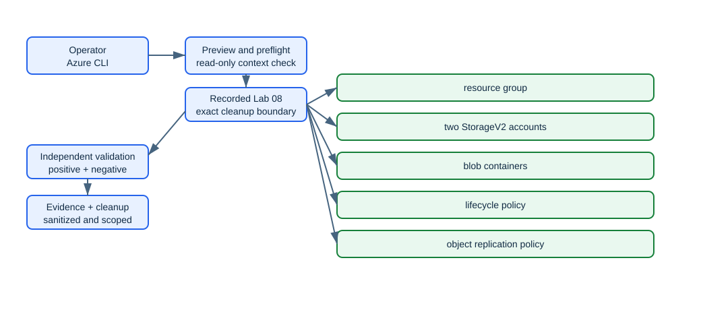

<!-- BEGIN GENERATED AZ104 V2 -->
# Lab 08: Manage Blob lifecycle, tiers, versioning, replication, and AzCopy

[Previous: Lab 07](../07-storage-network-sas/README.md) · [Catalog](../README.md) · [Next: Lab 09](../09-azure-files-identity/README.md)

This self-contained lab uses Azure CLI commands hosted in PowerShell. Complete the guided lane or the automated lane—not both with the same run ID.

## Scenario, role, and outcome

Scenario: A data-platform administrator managing blob retention and replication is responding to an operational request: Configure versioning, soft delete, lifecycle tiering, a two-sided object-replication policy, and an Entra-authorized AzCopy transfer.

Learner role: A data-platform administrator managing blob retention and replication.

Outcome: Configure versioning, soft delete, lifecycle tiering, a two-sided object-replication policy, and an Entra-authorized AzCopy transfer.

| Item | Value |
|---|---|
| Duration | 120 minutes |
| Difficulty | foundational |
| Cost class | `low` |
| Command surface | Azure CLI (`az`, `az rest`, Bicep, AzCopy, or KQL where required) hosted in PowerShell |
| Live state | Not executed during this offline rebuild |

Completion criteria:

- All required checkpoints report pass.
- The deterministic break/fix is injected, diagnosed, and repaired.
- cleanup.json reports no active run-owned resources, with any retained item explicitly documented.

## Objectives and checkpoints

| Objective | Skill | Checkpoints |
|---|---|---|
| `ST-ACCOUNTS-03` | Configure object replication | `LAB08-CP01`, `LAB08-CP05` |
| `ST-ACCOUNTS-05` | Manage data by using Azure Storage Explorer and AzCopy | `LAB08-CP02`, `LAB08-CP05` |
| `ST-DATA-02` | Create and configure a container in Azure Blob Storage | `LAB08-CP03`, `LAB08-CP05` |
| `ST-DATA-03` | Configure storage tiers | `LAB08-CP04`, `LAB08-CP05` |
| `ST-DATA-04` | Configure soft delete for blobs and containers | `LAB08-CP05` |
| `ST-DATA-06` | Configure blob lifecycle management | `LAB08-CP05` |
| `ST-DATA-07` | Configure blob versioning | `LAB08-CP05` |

The authoritative objective wording comes from the [Microsoft AZ-104 study guide](https://learn.microsoft.com/en-us/credentials/certifications/resources/study-guides/az-104), skills measured as of 2026-04-17.

## Architecture and service topology



The editable source is [architecture.mmd](diagrams/architecture.mmd). AzCopy writes a block blob to the source account with the learner's Azure CLI token. Versioning, change feed, and the source/destination copies of one object-replication policy move new versions to the destination. Lifecycle rules tier base blobs and delete older versions, while soft delete supplies short-term recovery.

## Concept primer and design decisions

Blob versions, soft delete, lifecycle management, tiers, and object replication solve different recovery and cost problems. Object replication depends on change feed and versioning; AzCopy moves data but does not replace a replication policy.

Design decisions:

- Enable prerequisites on both accounts before replication.
- Use lifecycle filters that target known blob types.
- Keep transfer credentials out of command history and state.

## Required and optional inputs

| Input | Required | Source | Safe example | Gate behavior |
|---|:---:|---|---|---|
| `run-id` — Unique lowercase run ownership identifier | Yes | parameter | `az104l08-01` | `block` |
| `subscription-id` — Expected disposable subscription ID | Yes | parameter-or-environment (`AZ104_SUBSCRIPTION_ID`) | `00000000-0000-0000-0000-000000000000` | `block` |
| `location` — Approved primary Azure region | Yes | parameter-or-environment (`AZ104_LOCATION`) | `westeurope` | `block` |

Secrets stay in temporary environment variables and are never written to `run.json`, validation evidence, or Git. A `skip-checkpoint` gate produces a visible partial result; it never becomes a pass.

## Read-only preflight

Sign in deliberately, inspect the active context, then run the lab preflight. It never signs in, changes context, installs an extension, registers a provider, or creates a resource.

```powershell
az login
az account show --query '{cloud:environmentName,subscription:id,tenant:tenantId,user:user.name}' --output json
./scripts/cli/Preflight.ps1 -SubscriptionId $env:AZ104_SUBSCRIPTION_ID -RunId 'az104l08-01' -Location 'westeurope'
```

Representative redacted output:

```text
context                 True  cloud=AzureCloud; tenant=<redacted>; subscription=<redacted>
azure-cli               True  2.88.x
provider:<namespace>    True  Registered
region                  True  westeurope
Preflight passed. It performed no Azure mutation.
```

If a required row fails, stop. Correct the local tool, context, provider, quota, SKU, region, permission, or input outside the lab, then rerun preflight.

## Task 1 — Confirm AzCopy, identity, and object-replication prerequisites {#task-1}

Checkpoint: `LAB08-CP01`

Purpose and operational relevance: Validate the local transfer tool, signed-in user, provider, and unique account names before creating endpoints. Object replication is asynchronous, but missing versioning, change feed, identity roles, or AzCopy must be discovered synchronously.

Run these commands from PowerShell. If you already used the automated lane, choose a new run ID before trying this guided lane.

```powershell
if (-not (Get-Command azcopy -ErrorAction SilentlyContinue)) { throw 'AzCopy v10 is required.' }
$learnerId = az ad signed-in-user show --query id --output tsv
if (-not $learnerId) { throw 'Use an interactive Entra user for the Azure CLI backed AzCopy path.' }
$state.inputs['learner-object-id'] = $learnerId
Save-RunState
azcopy --version
```

Expected state: AzCopy v10 and an interactive learner object ID are available before any storage account is created.

Representative redacted output:

```text
azcopy=10.x; learnerObjectId=<redacted>; sourceNameAvailable=True; destinationNameAvailable=True
```

Positive validation:

```powershell
$accounts = @(az storage account list --resource-group $ResourceGroupName --output json | ConvertFrom-Json)
if (@($accounts | Where-Object name -in @($source,$destination)).Count -ne 2) { throw 'Both replication accounts must exist during validation.' }
$accounts | Where-Object name -in @($source,$destination) | Select-Object id,name
```

Expected positive result: During deployment validation, both deterministic account IDs resolve.

Negative validation:

```powershell
$unownedAccounts = @(az storage account list --resource-group $ResourceGroupName --output json | ConvertFrom-Json | Where-Object {
  $_.name -in @($source, $destination) -and ($_.tags.labId -ne '08' -or $_.tags.runId -ne $RunId)
})
if ($unownedAccounts.Count -gt 0 -or -not $state.inputs['learner-object-id']) {
  throw 'A replication account is unowned or the learner object ID was not persisted.'
}
if (Select-String -Path (Join-Path $StateDir '*.json') -Pattern 'sasToken|accountKey|AZCOPY_SPA_CLIENT_SECRET' -ErrorAction SilentlyContinue) {
  throw 'Transfer credentials were persisted.'
}
'Owned replication accounts=2; learner ID recorded; transfer secrets recorded=0'
```

Expected negative result: The non-secret learner ID is recorded and no transfer credential exists in state.

Evidence to retain:

- `LAB08-CP01` UTC result for confirm AzCopy, identity, and object-replication prerequisites.
- Exact run-owned ID and asserted service properties from: During deployment validation, both deterministic account IDs resolve.
- Negative-boundary outcome from: The non-secret learner ID is recorded and no transfer credential exists in state.
- Cleanup dependency recorded for the objects created or configured by LAB08-CP01.

Common failure and safe retry: AzCopy is missing or the Azure CLI context is a service principal without the planned user data role. Correct readiness or use an approved interactive user; do not add a SAS fallback to this identity exercise.

Cleanup dependency: This checkpoint persists only a non-secret principal ID.

## Task 2 — Create and protect the source and destination accounts {#task-2}

Checkpoint: `LAB08-CP02`

Purpose and operational relevance: Persist each account immediately, configure soft delete and change feed, assign data roles, and install the source lifecycle rule. Both endpoints need recovery controls; each returned ID must survive a partial failure of the second account.

Run these commands from PowerShell. If you already used the automated lane, choose a new run ID before trying this guided lane.

```powershell
$source = "st08a$suffix"; $destination = "st08b$suffix"
foreach ($account in @($source,$destination)) {
    $created = az storage account create --name $account --resource-group $ResourceGroupName --location $Location --kind StorageV2 --sku Standard_LRS --https-only true --min-tls-version TLS1_2 --allow-blob-public-access false --allow-cross-tenant-replication false --tags purpose=az104-lab labId=08 runId=$RunId --output json | ConvertFrom-Json
    Add-ManagedObject -CheckpointId 'LAB08-CP02' -Kind 'azure-resource' -Id ([string]$created.id) -Name $account -Type 'Microsoft.Storage/storageAccounts' -Scope "/subscriptions/$SubscriptionId/resourceGroups/$ResourceGroupName" -OwnershipMethod 'manifest-id-and-tags'
    az storage account blob-service-properties update --account-name $account --resource-group $ResourceGroupName --enable-change-feed true --enable-delete-retention true --delete-retention-days 7 --enable-container-delete-retention true --container-delete-retention-days 7 --output none
    $assignment = az role assignment create --assignee-object-id $state.inputs['learner-object-id'] --assignee-principal-type User --role 'Storage Blob Data Contributor' --scope $created.id --output json | ConvertFrom-Json
    Add-ManagedObject -CheckpointId 'LAB08-CP02' -Kind 'azure-resource' -Id ([string]$assignment.id) -Name "BlobContributor-$account" -Type 'Microsoft.Authorization/roleAssignments' -Scope ([string]$created.id) -OwnershipMethod 'manifest-id'
}
az storage account blob-service-properties update --account-name $source --resource-group $ResourceGroupName --enable-versioning true --output none
az storage account blob-service-properties update --account-name $destination --resource-group $ResourceGroupName --enable-versioning false --output none
az storage container create --name source --account-name $source --auth-mode login --output none
az storage container create --name destination --account-name $destination --auth-mode login --output none
$policyPath = Join-Path $StateDir 'lifecycle-policy.json'
@{ rules = @(@{ enabled = $true; name = 'tier-and-expire-versions'; type = 'Lifecycle'; definition = @{ actions = @{ baseBlob = @{ tierToCool = @{ daysAfterModificationGreaterThan = 30 } }; version = @{ delete = @{ daysAfterCreationGreaterThan = 45 } } }; filters = @{ blobTypes = @('blockBlob') } } }) } | ConvertTo-Json -Depth 15 | Set-Content -LiteralPath $policyPath -Encoding utf8
az storage account management-policy create --account-name $source --resource-group $ResourceGroupName --policy "@$policyPath" --output none
```

Expected state: Both accounts have change feed and soft delete; source versioning is on, destination versioning is intentionally off for the next break/fix, and lifecycle manages base blobs and versions.

Representative redacted output:

```text
accounts=2; softDeleteDays=7; changeFeed=True; sourceVersioning=True; destinationVersioning=False; lifecycleRules=1
```

Positive validation:

```powershell
$sourceProps = az storage account blob-service-properties show --resource-group $ResourceGroupName --account-name $source --output json | ConvertFrom-Json
if (-not $sourceProps.changeFeed.enabled -or -not $sourceProps.isVersioningEnabled -or $sourceProps.deleteRetentionPolicy.days -ne 7) { throw 'Source protection settings mismatch.' }
$sourceProps
```

Expected positive result: Source change feed, versioning, and seven-day soft delete are enabled.

Negative validation:

```powershell
$destinationProps = az storage account blob-service-properties show --resource-group $ResourceGroupName --account-name $destination --output json | ConvertFrom-Json
if (-not $destinationProps.changeFeed.enabled -or $destinationProps.isVersioningEnabled) { throw 'Destination must have change feed on and versioning off before the injected failure.' }
$destinationProps
```

Expected negative result: Destination versioning is deliberately false before the replication break/fix.

Evidence to retain:

- `LAB08-CP02` UTC result for create and protect the source and destination accounts.
- Exact run-owned ID and asserted service properties from: Source change feed, versioning, and seven-day soft delete are enabled.
- Negative-boundary outcome from: Destination versioning is deliberately false before the replication break/fix.
- Cleanup dependency recorded for the objects created or configured by LAB08-CP02.

Common failure and safe retry: The second account fails after the first succeeds or data-role propagation delays container creation. Reconcile manifest IDs and account properties first; retry only the missing account or OAuth data operation.

Cleanup dependency: Delete object-replication policies before containers, roles, accounts, and the resource group.

## Task 3 — Inject the missing-versioning fault and build both policy copies {#task-3}

Checkpoint: `LAB08-CP03`

Purpose and operational relevance: Require replication creation to fail while destination versioning is off, repair the prerequisite, then apply the destination-generated policy to both endpoints. A destination-only policy is incomplete; the same policy ID and rules must exist on source and destination.

Run these commands from PowerShell. If you already used the automated lane, choose a new run ID before trying this guided lane.

```powershell
$sourceId = az storage account show --resource-group $ResourceGroupName --name $source --query id --output tsv
$destinationId = az storage account show --resource-group $ResourceGroupName --name $destination --query id --output tsv
$minimumCreation = (Get-Date).ToUniversalTime().ToString('yyyy-MM-ddTHH:mm:ssZ')
$PSNativeCommandUseErrorActionPreference = $false
$fault = az storage account or-policy create --resource-group $ResourceGroupName --account-name $destination --source-account $sourceId --destination-account $destinationId --source-container source --destination-container destination --min-creation-time $minimumCreation --output json 2>&1
$faultExit = $LASTEXITCODE
$PSNativeCommandUseErrorActionPreference = $true
if ($faultExit -eq 0) {
    $unexpectedPolicy = ([string]($fault -join "`n") | ConvertFrom-Json)
    $state.inputs['object-replication-policy-id'] = [string]$unexpectedPolicy.policyId
    Save-RunState
    throw 'Object replication unexpectedly succeeded while destination versioning was disabled; its policy ID was recorded for cleanup.'
}
az storage account blob-service-properties update --account-name $destination --resource-group $ResourceGroupName --enable-versioning true --output none
$destinationPolicy = az storage account or-policy create --resource-group $ResourceGroupName --account-name $destination --source-account $sourceId --destination-account $destinationId --source-container source --destination-container destination --min-creation-time $minimumCreation --output json | ConvertFrom-Json
$state.inputs['object-replication-policy-id'] = [string]$destinationPolicy.policyId
Save-RunState
az storage account or-policy show --resource-group $ResourceGroupName --account-name $destination --policy-id $state.inputs['object-replication-policy-id'] --output json |
    az storage account or-policy create --resource-group $ResourceGroupName --account-name $source --policy '@-' --output none
```

Expected state: The pre-repair attempt fails, destination versioning becomes true, and the same policy ID with one rule exists on both accounts.

Representative redacted output:

```text
fault=versioning-disabled; repaired=True; policyId=<redacted>; sourceRules=1; destinationRules=1
```

Positive validation:

```powershell
$policyId = [string]$state.inputs['object-replication-policy-id']
$sourcePolicy = az storage account or-policy show --resource-group $ResourceGroupName --account-name $source --policy-id $policyId --output json | ConvertFrom-Json
$destinationPolicy = az storage account or-policy show --resource-group $ResourceGroupName --account-name $destination --policy-id $policyId --output json | ConvertFrom-Json
if ($sourcePolicy.policyId -ne $destinationPolicy.policyId -or @($sourcePolicy.rules).Count -ne 1 -or @($destinationPolicy.rules).Count -ne 1) { throw 'Object-replication policy copies differ.' }
[pscustomobject]@{ policyId = $policyId; sourceRules = $sourcePolicy.rules.Count; destinationRules = $destinationPolicy.rules.Count }
```

Expected positive result: Both policy copies share one policy ID and one container rule.

Negative validation:

```powershell
foreach ($account in @($source,$destination)) {
    $properties = az storage account blob-service-properties show --resource-group $ResourceGroupName --account-name $account --output json | ConvertFrom-Json
    if (-not $properties.isVersioningEnabled -or -not $properties.changeFeed.enabled) { throw "Replication prerequisite missing on $account" }
}
'Versioning and change feed enabled on both accounts.'
```

Expected negative result: No endpoint remains without versioning or change feed after repair.

Evidence to retain:

- `LAB08-CP03` UTC result for inject the missing-versioning fault and build both policy copies.
- Exact run-owned ID and asserted service properties from: Both policy copies share one policy ID and one container rule.
- Negative-boundary outcome from: No endpoint remains without versioning or change feed after repair.
- Cleanup dependency recorded for the objects created or configured by LAB08-CP03.

Common failure and safe retry: The destination policy is created but not copied to source, or a retry creates a second policy. List both endpoints, reuse the recorded policy ID, and copy the existing destination definition to source.

Cleanup dependency: Delete the source policy copy first, then destination policy, containers, roles, and accounts.

## Task 4 — Transfer and version a blob with AzCopy using the Azure CLI token {#task-4}

Checkpoint: `LAB08-CP04`

Purpose and operational relevance: Use AZCLI auto-login, upload two revisions, and place the current version in Cool tier without SAS or account keys. AzCopy moves data; versioning preserves revisions and object replication independently copies eligible versions.

Run these commands from PowerShell. If you already used the automated lane, choose a new run ID before trying this guided lane.

```powershell
$sample = Join-Path $StateDir 'replication-sample.txt'
$tenantId = az account show --query tenantId --output tsv
$env:AZCOPY_AUTO_LOGIN_TYPE = 'AZCLI'
$env:AZCOPY_TENANT_ID = $tenantId
try {
    'revision 1' | Set-Content -LiteralPath $sample -Encoding utf8
    azcopy copy $sample "https://$source.blob.core.windows.net/source/replication-sample.txt" --from-to LocalBlob --overwrite=true
    'revision 2' | Set-Content -LiteralPath $sample -Encoding utf8
    azcopy copy $sample "https://$source.blob.core.windows.net/source/replication-sample.txt" --from-to LocalBlob --overwrite=true
} finally {
    Remove-Item Env:AZCOPY_AUTO_LOGIN_TYPE -ErrorAction SilentlyContinue
    Remove-Item Env:AZCOPY_TENANT_ID -ErrorAction SilentlyContinue
}
az storage blob set-tier --account-name $source --container-name source --name replication-sample.txt --tier Cool --auth-mode login --output none
```

Expected state: The source has a current Cool blob plus at least one prior version; eligible versions begin asynchronous replication to destination.

Representative redacted output:

```text
azcopyAuth=AZCLI; currentRevision=2; priorVersions>=1; accessTier=Cool; replication=asynchronous
```

Positive validation:

```powershell
$versions = @(az storage blob list --account-name $source --container-name source --include v --auth-mode login --output json | ConvertFrom-Json | Where-Object name -eq 'replication-sample.txt')
if ($versions.Count -lt 2 -or @($versions | Where-Object properties.accessTier -eq 'Cool').Count -lt 1) { throw 'Expected multiple versions and a Cool current blob.' }
$versions | Select-Object name,versionId,isCurrentVersion,properties
```

Expected positive result: At least two blob revisions are listed and the current blob is Cool.

Negative validation:

```powershell
if (Test-Path Env:AZCOPY_AUTO_LOGIN_TYPE) { throw 'AzCopy auto-login environment remained after transfer.' }
if (Select-String -Path (Join-Path $StateDir '*.json') -Pattern 'sasToken|accountKey|clientSecret' -ErrorAction SilentlyContinue) { throw 'A transfer secret is persisted.' }
'AzCopy auth environment cleared; persisted transfer secrets=0'
```

Expected negative result: Temporary AzCopy environment variables are cleared and no transfer credential is stored.

Evidence to retain:

- `LAB08-CP04` UTC result for transfer and version a blob with AzCopy using the Azure CLI token.
- Exact run-owned ID and asserted service properties from: At least two blob revisions are listed and the current blob is Cool.
- Negative-boundary outcome from: Temporary AzCopy environment variables are cleared and no transfer credential is stored.
- Cleanup dependency recorded for the objects created or configured by LAB08-CP04.

Common failure and safe retry: Blob data-role propagation delays AzCopy or the learner confuses upload completion with replication completion. Confirm the exact role and source blob first; retry AzCopy with AZCLI, then observe replication separately.

Cleanup dependency: Delete policy copies before source and destination containers and accounts.

## Task 5 — Reconcile protection, policy, versions, and asynchronous replication state {#task-5}

Checkpoint: `LAB08-CP05`

Purpose and operational relevance: Prove the lifecycle rule, recovery controls, two policy copies, source revisions, and observable replication status without pretending asynchronous convergence is immediate. A completed command is not a completed data-protection design; administrators correlate configuration and data state while treating replication latency explicitly.

Run these commands from PowerShell. If you already used the automated lane, choose a new run ID before trying this guided lane.

```powershell
$policyId = [string]$state.inputs['object-replication-policy-id']
$sourcePolicy = az storage account or-policy show --resource-group $ResourceGroupName --account-name $source --policy-id $policyId --output json | ConvertFrom-Json
$destinationPolicy = az storage account or-policy show --resource-group $ResourceGroupName --account-name $destination --policy-id $policyId --output json | ConvertFrom-Json
$lifecycle = az storage account management-policy show --resource-group $ResourceGroupName --account-name $source --output json | ConvertFrom-Json
$sourceVersions = @(az storage blob list --account-name $source --container-name source --include v --auth-mode login --output json | ConvertFrom-Json | Where-Object name -eq 'replication-sample.txt')
$destinationCopies = @(az storage blob list --account-name $destination --container-name destination --include v --auth-mode login --output json | ConvertFrom-Json | Where-Object name -eq 'replication-sample.txt')
if ($sourcePolicy.policyId -ne $destinationPolicy.policyId) { throw 'Replication policy IDs do not match.' }
if (@($lifecycle.policy.rules | Where-Object name -eq 'tier-and-expire-versions').Count -ne 1) { throw 'Lifecycle rule is missing.' }
if ($sourceVersions.Count -lt 2) { throw 'Source revisions are missing.' }
[pscustomobject]@{ policyId = $policyId; lifecycleRules = @($lifecycle.policy.rules).Count; sourceVersions = $sourceVersions.Count; destinationCopiesObserved = $destinationCopies.Count; replicationIsAsynchronous = $true }
```

Expected state: Both policy copies match, the lifecycle rule and source versions exist, and destination-copy count is reported as an observation rather than a synchronous pass gate.

Representative redacted output:

```text
policyCopies=2; lifecycleRules=1; sourceVersions>=2; destinationCopiesObserved=0..n; replicationIsAsynchronous=True
```

Positive validation:

```powershell
$policyId = [string]$state.inputs['object-replication-policy-id']
foreach ($account in @($source,$destination)) {
    $policy = az storage account or-policy show --resource-group $ResourceGroupName --account-name $account --policy-id $policyId --output json | ConvertFrom-Json
    if ($policy.policyId -ne $policyId -or @($policy.rules).Count -ne 1) { throw "Incomplete replication policy on $account" }
}
'Two matching object-replication policy copies are active.'
```

Expected positive result: Source and destination each expose one rule under the recorded policy ID.

Negative validation:

```powershell
$unownedAccounts = @(az storage account list --resource-group $ResourceGroupName --output json | ConvertFrom-Json | Where-Object { $_.name -in @($source,$destination) -and ($_.tags.labId -ne '08' -or $_.tags.runId -ne $RunId) })
if ($unownedAccounts.Count -ne 0) { throw 'A replication endpoint failed ownership validation.' }
if (-not $state.inputs['object-replication-policy-id']) { throw 'Replication policy ID was not persisted.' }
'Unowned endpoints=0; policy cleanup target recorded=True'
```

Expected negative result: Neither endpoint has conflicting ownership and the exact policy cleanup target is recorded.

Evidence to retain:

- `LAB08-CP05` UTC result for reconcile protection, policy, versions, and asynchronous replication state.
- Exact run-owned ID and asserted service properties from: Source and destination each expose one rule under the recorded policy ID.
- Negative-boundary outcome from: Neither endpoint has conflicting ownership and the exact policy cleanup target is recorded.
- Cleanup dependency recorded for the objects created or configured by LAB08-CP05.

Common failure and safe retry: Learners treat an empty destination immediately after upload as policy failure, or lose the policy ID needed for ordered cleanup. Requery both policy copies and source versions first; wait for replication separately and never create a second policy just to force convergence.

Cleanup dependency: Delete the source policy copy first, then the destination copy, containers, role assignments, accounts, and resource group.

## Final validation and result interpretation

Run independent deployment validation after all required checkpoints:

```powershell
./scripts/cli/Validate.ps1 -RunId 'az104l08-01' -Mode Deployment
az resource list --resource-group 'rg-az104-l08-az104l08-01' --query '[].{name:name,type:type}' --output table
```

- `pass`: every required positive and negative check passed.
- `partial`: every required check passed, but at least one optional gate was deliberately skipped.
- `fail`: a required checkpoint failed; do not record the lab as complete.

Keep the redacted `validation.json`; do not retain credentials, tokens, access keys, certificate material, email addresses, tenant IDs, or unredacted command output.

## Deterministic break/fix exercise

Injection: Disable versioning on one account before creating replication.

Expected symptom: The replication policy cannot be established.

Diagnose with a read-only service query:

```powershell
$unownedAccounts = @(az storage account list --resource-group $ResourceGroupName --output json | ConvertFrom-Json | Where-Object {
  $_.name -in @($source, $destination) -and ($_.tags.labId -ne '08' -or $_.tags.runId -ne $RunId)
})
if ($unownedAccounts.Count -gt 0 -or -not $state.inputs['learner-object-id']) {
  throw 'A replication account is unowned or the learner object ID was not persisted.'
}
if (Select-String -Path (Join-Path $StateDir '*.json') -Pattern 'sasToken|accountKey|AZCOPY_SPA_CLIENT_SECRET' -ErrorAction SilentlyContinue) {
  throw 'Transfer credentials were persisted.'
}
'Owned replication accounts=2; learner ID recorded; transfer secrets recorded=0'
```

Diagnosis: Inspect versioning and change-feed properties on both endpoints.

Repair: Restore the prerequisite, then recreate or reconcile the policy.

Before/after evidence must show the failed negative or positive check before repair and the same check passing afterward. Do not inject a second fault until the first is removed.

## Optional job-style challenge

Design a retention plan combining hot/cool tiers, version deletion, soft delete, and cross-account replication.

Deliver a short change record containing assumptions, exact commands, redacted evidence, cost and risk notes, rollback, and residual results. The challenge is optional and never changes required checkpoint status.

## Troubleshooting

| Symptom | Likely cause | Safe next step |
|---|---|---|
| Context mismatch | Active CLI context differs from `run.json` | Stop, inspect `az account show`, and select the intended disposable context yourself. |
| Provider or feature unavailable | Registration, region, feature, or SKU gate is unmet | Read the preflight result; do not register or enable tenant features implicitly. |
| Name already exists | The run ID is reused or a globally unique name collided | Keep existing state intact and choose a new run ID. |
| Expected state is delayed | The service is converging asynchronously | Repeat only the read-only query with bounded retries; do not duplicate creation. |
| Permission denied | Role, Graph scope, or data-plane authorization is insufficient | Confirm the declared least-privilege boundary; do not broaden access automatically. |
| Cleanup refuses ownership | ID, context, or tags differ from the manifest | Investigate the mismatch; never bypass ownership verification. |

## Cleanup and residual verification

Preview exact targets first, execute only after ownership review, then validate post-cleanup:

```powershell
./scripts/cli/Cleanup.ps1 -RunId 'az104l08-01'
./scripts/cli/Cleanup.ps1 -RunId 'az104l08-01' -Execute
./scripts/cli/Validate.ps1 -RunId 'az104l08-01' -Mode PostCleanup
$unownedAccounts = @(az storage account list --resource-group $ResourceGroupName --output json | ConvertFrom-Json | Where-Object { $_.name -in @($source,$destination) -and ($_.tags.labId -ne '08' -or $_.tags.runId -ne $RunId) })
if ($unownedAccounts.Count -ne 0) { throw 'A replication endpoint failed ownership validation.' }
if (-not $state.inputs['object-replication-policy-id']) { throw 'Replication policy ID was not persisted.' }
'Unowned endpoints=0; policy cleanup target recorded=True'
```

`cleanup.json` passes only when no active manifest-managed object remains. Soft-deleted or intentionally retained items must be listed with their reason and expected disposition. The lifecycle never performs irreversible purge automatically.

## Exam debrief and assessment

Explain why the expected state, negative check, and cleanup boundary matter—not only which command was used. Map any missed concept back to its task anchor before reviewing the answer key.

Complete [QUESTIONS.md](assessment/QUESTIONS.md), then use [ANSWERS.md](assessment/ANSWERS.md) for option-by-option remediation. Scores of 85–100% indicate mastery, 70–84% indicate targeted review, and below 70% means repeat the mapped tasks.

## Microsoft Learn sources

- [Microsoft AZ-104 study guide](https://learn.microsoft.com/en-us/credentials/certifications/resources/study-guides/az-104)
- [Azure Blob Storage lifecycle management overview](https://learn.microsoft.com/en-us/azure/storage/blobs/lifecycle-management-overview)
- [Azure Blob Storage versioning overview](https://learn.microsoft.com/en-us/azure/storage/blobs/versioning-overview)
- [Soft delete for Azure blobs](https://learn.microsoft.com/en-us/azure/storage/blobs/soft-delete-blob-overview)
- [Configure object replication for block blobs with Azure CLI](https://learn.microsoft.com/en-us/azure/storage/blobs/object-replication-configure-cli)
- [Authorize AzCopy with Azure CLI credentials](https://learn.microsoft.com/en-us/azure/storage/common/storage-use-azcopy-authorize-azure-active-directory)

## Lifecycle script appendix

The guided task blocks above and these executable scripts are generated from the same checkpoint data. The scripts are an optional automated lane; use a different run ID if you already completed the guided lane.

### `Preflight.ps1`

```powershell
# BEGIN GENERATED AZ104 V2
#requires -Version 7.4
[CmdletBinding()]
[Diagnostics.CodeAnalysis.SuppressMessageAttribute('PSAvoidUsingWriteHost', '', Justification = 'Interactive lab progress is intentionally written to the host.')]
[Diagnostics.CodeAnalysis.SuppressMessageAttribute('PSReviewUnusedParameter', '', Justification = 'All lifecycle scripts expose a stable cross-lab interface.')]
[Diagnostics.CodeAnalysis.SuppressMessageAttribute('PSUseDeclaredVarsMoreThanAssignments', '', Justification = 'Generated task variables are intentionally shared across checkpoint blocks.')]
param(
    [string]$SubscriptionId = $env:AZ104_SUBSCRIPTION_ID,
    [Parameter(Mandatory)][ValidatePattern('^[a-z0-9](?:[a-z0-9-]{0,30}[a-z0-9])?$')][string]$RunId,
    [Parameter(Mandatory)][ValidatePattern('^[a-z0-9]+$')][string]$Location,
    [string]$SecondaryLocation = $env:AZ104_SECONDARY_LOCATION
)

Set-StrictMode -Version Latest
$ErrorActionPreference = 'Stop'
$PSNativeCommandUseErrorActionPreference = $true

if (-not (Get-Command az -ErrorAction SilentlyContinue)) {
    throw 'Azure CLI is required. Run the repository readiness initializer, then retry.'
}

$account = az account show --output json | ConvertFrom-Json
if (-not $account) { throw 'No active Azure CLI context. Run az login deliberately before this lab.' }
if ($SubscriptionId -and [string]$account.id -ne $SubscriptionId) {
    throw "Context mismatch: active subscription is $($account.id), expected $SubscriptionId. Preflight will not switch it."
}
if (-not $SubscriptionId) { $SubscriptionId = [string]$account.id }
# The account read above is the mandatory context gate. All remaining Azure
# probes are collected as results instead of allowing one unavailable SKU or
# provider query to abort the readiness report before it can explain the gap.
$PSNativeCommandUseErrorActionPreference = $false
$suffix = (($RunId -replace '[^a-z0-9]', '') + '000000000000').Substring(0, 12)
$ResourceGroupName = $(if ('08' -in @('00', '01', '02')) { $null } else { "rg-az104-l08-$RunId" })

$checks = [System.Collections.Generic.List[object]]::new()
function Add-PreflightResult {
    param([string]$Id, [bool]$Required, [bool]$Passed, [string]$Actual)
    $checks.Add([pscustomobject]@{ id = $Id; required = $Required; passed = $Passed; actual = $Actual })
}

Add-PreflightResult -Id 'context' -Required $true -Passed $true -Actual "cloud=$($account.environmentName); tenant=<redacted>; subscription=<redacted>"
$azVersion = (az version --query '"azure-cli"' --output tsv)
$bicepVersion = (az bicep version 2>&1 | Out-String).Trim()
Add-PreflightResult -Id 'azure-cli' -Required $true -Passed ([bool]$azVersion) -Actual $azVersion
Add-PreflightResult -Id 'powershell' -Required $true -Passed ($PSVersionTable.PSVersion -ge [version]'7.4') -Actual $PSVersionTable.PSVersion.ToString()
Add-PreflightResult -Id 'bicep' -Required $true -Passed ([bool]$bicepVersion) -Actual $bicepVersion

$requiredEnvironmentVariables = @()
foreach ($variableName in $requiredEnvironmentVariables) {
    $present = -not [string]::IsNullOrWhiteSpace([Environment]::GetEnvironmentVariable($variableName))
    Add-PreflightResult -Id "input:$variableName" -Required $true -Passed $present -Actual $(if ($present) { 'present (value redacted)' } else { 'missing' })
}

$providers = @(
    'Microsoft.Storage'
)
foreach ($provider in $providers) {
    $registrationState = az provider show --namespace $provider --query registrationState --output tsv 2>$null
    Add-PreflightResult -Id "provider:$provider" -Required $true -Passed ($registrationState -eq 'Registered') -Actual $(if ($registrationState) { $registrationState } else { 'Unavailable' })
}

$knownLocation = az account list-locations --query "[?name=='$Location'].name | [0]" --output tsv
Add-PreflightResult -Id 'region' -Required $true -Passed ($knownLocation -eq $Location) -Actual $(if ($knownLocation) { $knownLocation } else { 'not available' })

$azCopy = Get-Command azcopy -ErrorAction SilentlyContinue
Add-PreflightResult -Id 'azcopy' -Required $true -Passed ([bool]$azCopy) -Actual $(if ($azCopy) { $azCopy.Source } else { 'missing' })

$source = "st08a$suffix"
$destination = "st08b$suffix"

$probePassed = $true
$probeActual = 'assertion passed (output not persisted)'
try {
    $LASTEXITCODE = 0
    & {
$learnerId = az ad signed-in-user show --query id --output tsv
if (-not $learnerId) { throw 'An interactive Entra user is required for the AZCLI AzCopy lane.' }
foreach ($account in @($source,$destination)) {
    $availability = az storage account check-name --name $account --output json | ConvertFrom-Json
    if (-not $availability.nameAvailable) { throw "Storage name unavailable: $account ($($availability.reason))" }
}
    } | Out-Null
    if ($LASTEXITCODE -ne 0) { throw "native exit code $LASTEXITCODE" }
} catch {
    $probePassed = $false
    $probeActual = "assertion failed: $($_.Exception.GetType().Name)"
}
Add-PreflightResult -Id 'preflight.authored.lab08.identity-and-names' -Required $true -Passed $probePassed -Actual $probeActual

$checks | Format-Table -AutoSize
$failedRequired = @($checks | Where-Object { $_.required -and -not $_.passed })
if ($failedRequired.Count -gt 0) {
    throw "Preflight blocked: $($failedRequired.id -join ', ')"
}
Write-Host 'Preflight passed. It performed no sign-in, context switch, provider registration, or Azure mutation.'
# END GENERATED AZ104 V2
```

### `Setup.ps1`

```powershell
# BEGIN GENERATED AZ104 V2
#requires -Version 7.4
[CmdletBinding()]
[Diagnostics.CodeAnalysis.SuppressMessageAttribute('PSAvoidUsingWriteHost', '', Justification = 'Interactive lab progress is intentionally written to the host.')]
[Diagnostics.CodeAnalysis.SuppressMessageAttribute('PSReviewUnusedParameter', '', Justification = 'All lifecycle scripts expose a stable cross-lab interface.')]
[Diagnostics.CodeAnalysis.SuppressMessageAttribute('PSUseDeclaredVarsMoreThanAssignments', '', Justification = 'Generated task variables are intentionally shared across checkpoint blocks.')]
param(
    [string]$SubscriptionId = $env:AZ104_SUBSCRIPTION_ID,
    [Parameter(Mandatory)][ValidatePattern('^[a-z0-9](?:[a-z0-9-]{0,30}[a-z0-9])?$')][string]$RunId,
    [Parameter(Mandatory)][ValidatePattern('^[a-z0-9]+$')][string]$Location,
    [string]$SecondaryLocation = $env:AZ104_SECONDARY_LOCATION,
    [switch]$AcknowledgeCost,
    [switch]$AcknowledgeTenantChange,
    [switch]$Execute
)

Set-StrictMode -Version Latest
$ErrorActionPreference = 'Stop'
$PSNativeCommandUseErrorActionPreference = $true

if (-not (Get-Command az -ErrorAction SilentlyContinue)) {
    throw 'Azure CLI is required. Run the repository readiness initializer, then retry.'
}

$LabRoot = (Resolve-Path (Join-Path $PSScriptRoot '../..')).Path
$StateDir = Join-Path $LabRoot ".state/$RunId"
$Manifest = Join-Path $StateDir 'run.json'
$ResourceGroupName = $(if ('08' -in @('00', '01', '02')) { $null } else { "rg-az104-l08-$RunId" })
$suffix = (($RunId -replace '[^a-z0-9]', '') + '000000000000').Substring(0, 12)

Write-Host 'LAB-08 execution plan'
Write-Host "  subscription: $SubscriptionId"
Write-Host "  location: $Location"
Write-Host '  command surface: Azure CLI hosted in PowerShell'
Write-Host '  state: run.json, validation.json, cleanup.json'
if (-not $Execute) {
    Write-Host 'Preview only. Review context, inputs, cost, tenant scope, and cleanup before using -Execute.'
    return
}
if ($false -and -not $AcknowledgeCost) { throw 'This lab requires -AcknowledgeCost before execution.' }
if ($false -and -not $AcknowledgeTenantChange) { throw 'This lab requires -AcknowledgeTenantChange before execution.' }

& (Join-Path $PSScriptRoot 'Preflight.ps1') -SubscriptionId $SubscriptionId -RunId $RunId -Location $Location -SecondaryLocation $SecondaryLocation
if (Test-Path -LiteralPath $Manifest) { throw "State already exists at $Manifest. Choose a new run ID." }
New-Item -ItemType Directory -Path $StateDir -Force | Out-Null
$account = az account show --output json | ConvertFrom-Json
if (-not $SubscriptionId) { $SubscriptionId = [string]$account.id }
$now = (Get-Date).ToUniversalTime().ToString('o')
$state = @{
    schemaVersion = '1.0.0'
    labId = 'LAB-08'
    runId = $RunId
    createdAt = $now
    updatedAt = $now
    status = 'initialized'
    context = @{ cloud = [string]$account.environmentName; tenantId = [string]$account.tenantId; subscriptionId = [string]$SubscriptionId }
    acknowledgements = @{ cost = [bool]$AcknowledgeCost; tenantChange = [bool]$AcknowledgeTenantChange }
    inputs = @{ 'location' = $Location; 'secondary-location' = $SecondaryLocation }
    checkpointStates = @(
        @{ checkpointId = 'LAB08-CP01'; required = $true; status = 'pending'; updatedAt = $now; message = 'Not started.' }
        @{ checkpointId = 'LAB08-CP02'; required = $true; status = 'pending'; updatedAt = $now; message = 'Not started.' }
        @{ checkpointId = 'LAB08-CP03'; required = $true; status = 'pending'; updatedAt = $now; message = 'Not started.' }
        @{ checkpointId = 'LAB08-CP04'; required = $true; status = 'pending'; updatedAt = $now; message = 'Not started.' }
        @{ checkpointId = 'LAB08-CP05'; required = $true; status = 'pending'; updatedAt = $now; message = 'Not started.' }
    )
    managedObjects = @()
    originalSettings = @()
}
$external = @{}

function Save-RunState {
    $state.updatedAt = (Get-Date).ToUniversalTime().ToString('o')
    $state | ConvertTo-Json -Depth 30 | Set-Content -LiteralPath $Manifest -Encoding utf8
}

function Save-ExternalState {
    foreach ($key in @($external.Keys)) {
        $value = $external[$key]
        if ($null -eq $value -or $value -is [string] -or $value -is [ValueType]) {
            $inputKey = 'external-' + (([string]$key -creplace '([a-z0-9])([A-Z])', '$1-$2') -replace '[^a-zA-Z0-9-]', '-').ToLowerInvariant()
            $state.inputs[$inputKey] = $value
        }
    }
    Save-RunState
}

function Write-CheckpointState {
    param([string]$CheckpointId, [string]$Status, [string]$Message)
    $entry = @($state.checkpointStates | Where-Object { $_.checkpointId -eq $CheckpointId })[0]
    $entry.status = $Status
    $entry.updatedAt = (Get-Date).ToUniversalTime().ToString('o')
    $entry.message = $Message
}

function Add-ManagedObject {
    param([string]$CheckpointId, [string]$Kind, [string]$Id, [string]$Name, [string]$Type, [string]$Scope, [string]$OwnershipMethod)
    if ([string]::IsNullOrWhiteSpace($Id)) { return }
    $existing = @($state.managedObjects | Where-Object { $_.id -eq $Id })
    if ($existing.Count -gt 0) { return }
    $expectedTags = @{}
    if ($OwnershipMethod -eq 'manifest-id-and-tags') {
        $expectedTags = @{ purpose = 'az104-lab'; labId = '08'; runId = $RunId }
    }
    $state.managedObjects += @{
        checkpointId = $CheckpointId
        kind = $Kind
        id = $Id
        name = $Name
        type = $Type
        scope = $Scope
        ownership = @{ method = $OwnershipMethod; expectedTags = $expectedTags }
        recordedAt = (Get-Date).ToUniversalTime().ToString('o')
        lifecycleStatus = 'active'
    }
    Save-RunState
}

function Sync-ManagedResource {
    param([string]$CheckpointId)
    # The entire recovery inventory is best effort so a state-helper or Azure
    # query failure cannot mask the original mutation error. Every object that
    # can be recovered is still persisted immediately as it is discovered.
    $nativePreference = $PSNativeCommandUseErrorActionPreference
    $PSNativeCommandUseErrorActionPreference = $false
    try {
        Save-ExternalState
        $resourceGroupNames = [System.Collections.Generic.HashSet[string]]::new([System.StringComparer]::OrdinalIgnoreCase)
        if ($ResourceGroupName) { $null = $resourceGroupNames.Add([string]$ResourceGroupName) }
        foreach ($key in @($external.Keys | Where-Object { [string]$_ -match '(?i)ResourceGroupName$' })) {
            if ($external[$key]) { $null = $resourceGroupNames.Add([string]$external[$key]) }
        }
        foreach ($groupName in $resourceGroupNames) {
            $groupJson = az group show --subscription $SubscriptionId --name $groupName --output json 2>$null
            $group = $(if ($LASTEXITCODE -eq 0 -and $groupJson) { $groupJson | ConvertFrom-Json } else { $null })
            if ($group) {
                $groupCheckpoint = $(if ([string]$group.name -eq [string]$ResourceGroupName) { 'LAB08-CP01' } else { $CheckpointId })
                Add-ManagedObject -CheckpointId $groupCheckpoint -Kind 'azure-resource' -Id ([string]$group.id) -Name ([string]$group.name) -Type 'Microsoft.Resources/resourceGroups' -Scope "/subscriptions/$SubscriptionId" -OwnershipMethod 'manifest-id-and-tags'
                $resourcesJson = az resource list --subscription $SubscriptionId --resource-group $groupName --output json 2>$null
                $resources = @($(if ($LASTEXITCODE -eq 0 -and $resourcesJson) { $resourcesJson | ConvertFrom-Json } else { @() }))
                foreach ($resource in $resources) {
                    Add-ManagedObject -CheckpointId $CheckpointId -Kind 'azure-resource' -Id ([string]$resource.id) -Name ([string]$resource.name) -Type ([string]$resource.type) -Scope ([string]$group.id) -OwnershipMethod 'manifest-id-and-tags'
                }
            }
        }
        if ($external.ContainsKey('groupId') -and $external.groupId) { Add-ManagedObject -CheckpointId $CheckpointId -Kind 'entra-object' -Id ([string]$external.groupId) -Name 'lab-group' -Type 'Microsoft.Graph/group' -Scope $state.context.tenantId -OwnershipMethod 'manifest-id' }
        if ($external.ContainsKey('guestUserId') -and $external.guestUserId) { Add-ManagedObject -CheckpointId $CheckpointId -Kind 'entra-object' -Id ([string]$external.guestUserId) -Name 'guest-user' -Type 'Microsoft.Graph/user' -Scope $state.context.tenantId -OwnershipMethod 'manifest-id' }
        if ($external.ContainsKey('userIds')) {
            foreach ($userId in @($external.userIds)) { Add-ManagedObject -CheckpointId $CheckpointId -Kind 'entra-object' -Id ([string]$userId) -Name 'lab-user' -Type 'Microsoft.Graph/user' -Scope $state.context.tenantId -OwnershipMethod 'manifest-id' }
        }
        if ($external.ContainsKey('delegationRecordId') -and $external.delegationRecordId) {
            Add-ManagedObject -CheckpointId $CheckpointId -Kind 'azure-resource' -Id ([string]$external.delegationRecordId) -Name ([string]$external.delegationRecordName) -Type 'Microsoft.Network/dnsZones/NS' -Scope ([string]$external.parentZoneId) -OwnershipMethod 'manifest-id'
        }
        if ($external.ContainsKey('connectionMonitorId') -and $external.connectionMonitorId) {
            Add-ManagedObject -CheckpointId $CheckpointId -Kind 'azure-resource' -Id ([string]$external.connectionMonitorId) -Name ([string]$external.connectionMonitorName) -Type 'Microsoft.Network/networkWatchers/connectionMonitors' -Scope ([string]$external.networkWatcherId) -OwnershipMethod 'manifest-id'
        }
    } catch {
        Write-Warning "Recovery inventory for $CheckpointId was incomplete: $($_.Exception.Message)"
    } finally {
        $PSNativeCommandUseErrorActionPreference = $nativePreference
    }
}

# The manifest exists before the first Azure mutation.
Save-RunState
$state.status = 'setup-in-progress'
Save-RunState

$expiresOn = (Get-Date).ToUniversalTime().AddDays(1).ToString('yyyy-MM-dd')
try {
    az group create --subscription $SubscriptionId --name $ResourceGroupName --location $Location --tags purpose=az104-lab labId=08 runId=$RunId expiresOn=$expiresOn --output none
} catch {
    Write-CheckpointState -CheckpointId 'LAB08-CP01' -Status 'fail' -Message "Resource-group boundary creation failed: $($_.Exception.GetType().Name)"
    $state.status = 'failed'
    Save-RunState
    throw
} finally {
    Sync-ManagedResource -CheckpointId 'LAB08-CP01'
}

# CHECKPOINT LAB08-CP01 BEGIN
try {
    Write-CheckpointState -CheckpointId 'LAB08-CP01' -Status 'in-progress' -Message 'Checkpoint execution started.'
    $activeCheckpointId = 'LAB08-CP01'
    Save-RunState

    if (-not (Get-Command azcopy -ErrorAction SilentlyContinue)) { throw 'AzCopy v10 is required.' }
    $learnerId = az ad signed-in-user show --query id --output tsv
    if (-not $learnerId) { throw 'Use an interactive Entra user for the Azure CLI backed AzCopy path.' }
    $state.inputs['learner-object-id'] = $learnerId
    Save-RunState
    azcopy --version

    Sync-ManagedResource -CheckpointId 'LAB08-CP01'
    Write-CheckpointState -CheckpointId 'LAB08-CP01' -Status 'pass' -Message 'AzCopy v10 and an interactive learner object ID are available before any storage account is created.'
    Save-RunState
} catch {
    Sync-ManagedResource -CheckpointId 'LAB08-CP01'
    Write-CheckpointState -CheckpointId 'LAB08-CP01' -Status 'fail' -Message "Checkpoint failed: $($_.Exception.GetType().Name)"
    $state.status = 'failed'
    Save-RunState
    throw
}
# CHECKPOINT LAB08-CP01 END

# CHECKPOINT LAB08-CP02 BEGIN
try {
    Write-CheckpointState -CheckpointId 'LAB08-CP02' -Status 'in-progress' -Message 'Checkpoint execution started.'
    $activeCheckpointId = 'LAB08-CP02'
    Save-RunState

    $source = "st08a$suffix"; $destination = "st08b$suffix"
    foreach ($account in @($source,$destination)) {
    try {
            $created = az storage account create --name $account --resource-group $ResourceGroupName --location $Location --kind StorageV2 --sku Standard_LRS --https-only true --min-tls-version TLS1_2 --allow-blob-public-access false --allow-cross-tenant-replication false --tags purpose=az104-lab labId=08 runId=$RunId --output json | ConvertFrom-Json
    } finally {
        Sync-ManagedResource -CheckpointId 'LAB08-CP02'
    }
        Add-ManagedObject -CheckpointId 'LAB08-CP02' -Kind 'azure-resource' -Id ([string]$created.id) -Name $account -Type 'Microsoft.Storage/storageAccounts' -Scope "/subscriptions/$SubscriptionId/resourceGroups/$ResourceGroupName" -OwnershipMethod 'manifest-id-and-tags'
        az storage account blob-service-properties update --account-name $account --resource-group $ResourceGroupName --enable-change-feed true --enable-delete-retention true --delete-retention-days 7 --enable-container-delete-retention true --container-delete-retention-days 7 --output none
    try {
            $assignment = az role assignment create --assignee-object-id $state.inputs['learner-object-id'] --assignee-principal-type User --role 'Storage Blob Data Contributor' --scope $created.id --output json | ConvertFrom-Json
    } finally {
        Sync-ManagedResource -CheckpointId 'LAB08-CP02'
    }
        Add-ManagedObject -CheckpointId 'LAB08-CP02' -Kind 'azure-resource' -Id ([string]$assignment.id) -Name "BlobContributor-$account" -Type 'Microsoft.Authorization/roleAssignments' -Scope ([string]$created.id) -OwnershipMethod 'manifest-id'
    }
    az storage account blob-service-properties update --account-name $source --resource-group $ResourceGroupName --enable-versioning true --output none
    az storage account blob-service-properties update --account-name $destination --resource-group $ResourceGroupName --enable-versioning false --output none
    try {
        az storage container create --name source --account-name $source --auth-mode login --output none
    } finally {
        Sync-ManagedResource -CheckpointId 'LAB08-CP02'
    }
    try {
        az storage container create --name destination --account-name $destination --auth-mode login --output none
    } finally {
        Sync-ManagedResource -CheckpointId 'LAB08-CP02'
    }
    $policyPath = Join-Path $StateDir 'lifecycle-policy.json'
    @{ rules = @(@{ enabled = $true; name = 'tier-and-expire-versions'; type = 'Lifecycle'; definition = @{ actions = @{ baseBlob = @{ tierToCool = @{ daysAfterModificationGreaterThan = 30 } }; version = @{ delete = @{ daysAfterCreationGreaterThan = 45 } } }; filters = @{ blobTypes = @('blockBlob') } } }) } | ConvertTo-Json -Depth 15 | Set-Content -LiteralPath $policyPath -Encoding utf8
    try {
        az storage account management-policy create --account-name $source --resource-group $ResourceGroupName --policy "@$policyPath" --output none
    } finally {
        Sync-ManagedResource -CheckpointId 'LAB08-CP02'
    }

    Sync-ManagedResource -CheckpointId 'LAB08-CP02'
    Write-CheckpointState -CheckpointId 'LAB08-CP02' -Status 'pass' -Message 'Both accounts have change feed and soft delete; source versioning is on, destination versioning is intentionally off for the next break/fix, and lifecycle manages base blobs and versions.'
    Save-RunState
} catch {
    Sync-ManagedResource -CheckpointId 'LAB08-CP02'
    Write-CheckpointState -CheckpointId 'LAB08-CP02' -Status 'fail' -Message "Checkpoint failed: $($_.Exception.GetType().Name)"
    $state.status = 'failed'
    Save-RunState
    throw
}
# CHECKPOINT LAB08-CP02 END

# CHECKPOINT LAB08-CP03 BEGIN
try {
    Write-CheckpointState -CheckpointId 'LAB08-CP03' -Status 'in-progress' -Message 'Checkpoint execution started.'
    $activeCheckpointId = 'LAB08-CP03'
    Save-RunState

    $sourceId = az storage account show --resource-group $ResourceGroupName --name $source --query id --output tsv
    $destinationId = az storage account show --resource-group $ResourceGroupName --name $destination --query id --output tsv
    $minimumCreation = (Get-Date).ToUniversalTime().ToString('yyyy-MM-ddTHH:mm:ssZ')
    $PSNativeCommandUseErrorActionPreference = $false
    try {
        $fault = az storage account or-policy create --resource-group $ResourceGroupName --account-name $destination --source-account $sourceId --destination-account $destinationId --source-container source --destination-container destination --min-creation-time $minimumCreation --output json 2>&1
    } finally {
        Sync-ManagedResource -CheckpointId 'LAB08-CP03'
    }
    $faultExit = $LASTEXITCODE
    $PSNativeCommandUseErrorActionPreference = $true
    if ($faultExit -eq 0) {
        $unexpectedPolicy = ([string]($fault -join "`n") | ConvertFrom-Json)
        $state.inputs['object-replication-policy-id'] = [string]$unexpectedPolicy.policyId
        Save-RunState
        throw 'Object replication unexpectedly succeeded while destination versioning was disabled; its policy ID was recorded for cleanup.'
    }
    az storage account blob-service-properties update --account-name $destination --resource-group $ResourceGroupName --enable-versioning true --output none
    try {
        $destinationPolicy = az storage account or-policy create --resource-group $ResourceGroupName --account-name $destination --source-account $sourceId --destination-account $destinationId --source-container source --destination-container destination --min-creation-time $minimumCreation --output json | ConvertFrom-Json
    } finally {
        Sync-ManagedResource -CheckpointId 'LAB08-CP03'
    }
    $state.inputs['object-replication-policy-id'] = [string]$destinationPolicy.policyId
    Save-RunState
    az storage account or-policy show --resource-group $ResourceGroupName --account-name $destination --policy-id $state.inputs['object-replication-policy-id'] --output json |
    try {
            az storage account or-policy create --resource-group $ResourceGroupName --account-name $source --policy '@-' --output none
    } finally {
        Sync-ManagedResource -CheckpointId 'LAB08-CP03'
    }

    Sync-ManagedResource -CheckpointId 'LAB08-CP03'
    Write-CheckpointState -CheckpointId 'LAB08-CP03' -Status 'pass' -Message 'The pre-repair attempt fails, destination versioning becomes true, and the same policy ID with one rule exists on both accounts.'
    Save-RunState
} catch {
    Sync-ManagedResource -CheckpointId 'LAB08-CP03'
    Write-CheckpointState -CheckpointId 'LAB08-CP03' -Status 'fail' -Message "Checkpoint failed: $($_.Exception.GetType().Name)"
    $state.status = 'failed'
    Save-RunState
    throw
}
# CHECKPOINT LAB08-CP03 END

# CHECKPOINT LAB08-CP04 BEGIN
try {
    Write-CheckpointState -CheckpointId 'LAB08-CP04' -Status 'in-progress' -Message 'Checkpoint execution started.'
    $activeCheckpointId = 'LAB08-CP04'
    Save-RunState

    $sample = Join-Path $StateDir 'replication-sample.txt'
    $tenantId = az account show --query tenantId --output tsv
    $env:AZCOPY_AUTO_LOGIN_TYPE = 'AZCLI'
    $env:AZCOPY_TENANT_ID = $tenantId
    try {
        'revision 1' | Set-Content -LiteralPath $sample -Encoding utf8
        azcopy copy $sample "https://$source.blob.core.windows.net/source/replication-sample.txt" --from-to LocalBlob --overwrite=true
        'revision 2' | Set-Content -LiteralPath $sample -Encoding utf8
        azcopy copy $sample "https://$source.blob.core.windows.net/source/replication-sample.txt" --from-to LocalBlob --overwrite=true
    } finally {
        Remove-Item Env:AZCOPY_AUTO_LOGIN_TYPE -ErrorAction SilentlyContinue
        Remove-Item Env:AZCOPY_TENANT_ID -ErrorAction SilentlyContinue
    }
    az storage blob set-tier --account-name $source --container-name source --name replication-sample.txt --tier Cool --auth-mode login --output none

    Sync-ManagedResource -CheckpointId 'LAB08-CP04'
    Write-CheckpointState -CheckpointId 'LAB08-CP04' -Status 'pass' -Message 'The source has a current Cool blob plus at least one prior version; eligible versions begin asynchronous replication to destination.'
    Save-RunState
} catch {
    Sync-ManagedResource -CheckpointId 'LAB08-CP04'
    Write-CheckpointState -CheckpointId 'LAB08-CP04' -Status 'fail' -Message "Checkpoint failed: $($_.Exception.GetType().Name)"
    $state.status = 'failed'
    Save-RunState
    throw
}
# CHECKPOINT LAB08-CP04 END

# CHECKPOINT LAB08-CP05 BEGIN
try {
    Write-CheckpointState -CheckpointId 'LAB08-CP05' -Status 'in-progress' -Message 'Checkpoint execution started.'
    $activeCheckpointId = 'LAB08-CP05'
    Save-RunState

    $policyId = [string]$state.inputs['object-replication-policy-id']
    $sourcePolicy = az storage account or-policy show --resource-group $ResourceGroupName --account-name $source --policy-id $policyId --output json | ConvertFrom-Json
    $destinationPolicy = az storage account or-policy show --resource-group $ResourceGroupName --account-name $destination --policy-id $policyId --output json | ConvertFrom-Json
    $lifecycle = az storage account management-policy show --resource-group $ResourceGroupName --account-name $source --output json | ConvertFrom-Json
    $sourceVersions = @(az storage blob list --account-name $source --container-name source --include v --auth-mode login --output json | ConvertFrom-Json | Where-Object name -eq 'replication-sample.txt')
    $destinationCopies = @(az storage blob list --account-name $destination --container-name destination --include v --auth-mode login --output json | ConvertFrom-Json | Where-Object name -eq 'replication-sample.txt')
    if ($sourcePolicy.policyId -ne $destinationPolicy.policyId) { throw 'Replication policy IDs do not match.' }
    if (@($lifecycle.policy.rules | Where-Object name -eq 'tier-and-expire-versions').Count -ne 1) { throw 'Lifecycle rule is missing.' }
    if ($sourceVersions.Count -lt 2) { throw 'Source revisions are missing.' }
    [pscustomobject]@{ policyId = $policyId; lifecycleRules = @($lifecycle.policy.rules).Count; sourceVersions = $sourceVersions.Count; destinationCopiesObserved = $destinationCopies.Count; replicationIsAsynchronous = $true }

    Sync-ManagedResource -CheckpointId 'LAB08-CP05'
    Write-CheckpointState -CheckpointId 'LAB08-CP05' -Status 'pass' -Message 'Both policy copies match, the lifecycle rule and source versions exist, and destination-copy count is reported as an observation rather than a synchronous pass gate.'
    Save-RunState
} catch {
    Sync-ManagedResource -CheckpointId 'LAB08-CP05'
    Write-CheckpointState -CheckpointId 'LAB08-CP05' -Status 'fail' -Message "Checkpoint failed: $($_.Exception.GetType().Name)"
    $state.status = 'failed'
    Save-RunState
    throw
}
# CHECKPOINT LAB08-CP05 END

$skippedRequired = @($state.checkpointStates | Where-Object { $_.required -and $_.status -eq 'skipped' })
if ($skippedRequired.Count -gt 0) {
    $state.status = 'failed'
    Save-RunState
    throw "Required checkpoints were skipped: $($skippedRequired.checkpointId -join ', ')"
}
$skippedOptional = @($state.checkpointStates | Where-Object { -not $_.required -and $_.status -eq 'skipped' })
$state.status = $(if ($skippedOptional.Count -gt 0) { 'partial' } else { 'setup-complete' })
Save-RunState
Write-Host "Setup result: $($state.status). State: $Manifest"
Write-Host "Next: ./Validate.ps1 -RunId $RunId -Mode Deployment"
# END GENERATED AZ104 V2
```

### `Validate.ps1`

```powershell
# BEGIN GENERATED AZ104 V2
#requires -Version 7.4
[CmdletBinding()]
[Diagnostics.CodeAnalysis.SuppressMessageAttribute('PSAvoidUsingWriteHost', '', Justification = 'Interactive lab progress is intentionally written to the host.')]
[Diagnostics.CodeAnalysis.SuppressMessageAttribute('PSReviewUnusedParameter', '', Justification = 'All lifecycle scripts expose a stable cross-lab interface.')]
[Diagnostics.CodeAnalysis.SuppressMessageAttribute('PSUseDeclaredVarsMoreThanAssignments', '', Justification = 'Generated task variables are intentionally shared across checkpoint blocks.')]
param(
    [string]$SubscriptionId = $env:AZ104_SUBSCRIPTION_ID,
    [Parameter(Mandatory)][ValidatePattern('^[a-z0-9](?:[a-z0-9-]{0,30}[a-z0-9])?$')][string]$RunId,
    [ValidateSet('Deployment', 'PostCleanup')][string]$Mode = 'Deployment'
)

Set-StrictMode -Version Latest
$ErrorActionPreference = 'Stop'
$PSNativeCommandUseErrorActionPreference = $true

if (-not (Get-Command az -ErrorAction SilentlyContinue)) {
    throw 'Azure CLI is required. Run the repository readiness initializer, then retry.'
}

$LabRoot = (Resolve-Path (Join-Path $PSScriptRoot '../..')).Path
$StateDir = Join-Path $LabRoot ".state/$RunId"
$Manifest = Join-Path $StateDir 'run.json'
$ValidationPath = Join-Path $StateDir 'validation.json'
if (-not (Test-Path -LiteralPath $Manifest)) { throw "Run manifest not found: $Manifest" }
$state = Get-Content -LiteralPath $Manifest -Raw | ConvertFrom-Json -AsHashtable
if ($state.labId -ne 'LAB-08' -or $state.runId -ne $RunId) { throw 'Manifest ownership does not match this lab and run ID.' }
$PSNativeCommandUseErrorActionPreference = $false
$accountJson = az account show --output json 2>$null
$account = $(if ($LASTEXITCODE -eq 0 -and $accountJson) { $accountJson | ConvertFrom-Json } else { $null })
if (-not $account -or [string]$account.tenantId -ne [string]$state.context.tenantId -or [string]$account.id -ne [string]$state.context.subscriptionId) {
    $capturedAt = (Get-Date).ToUniversalTime().ToString('o')
    $actualContext = $(if ($account) { "tenant=$($account.tenantId); subscription=$($account.id)" } else { 'active context unavailable' })
    $contextFailure = @{
        schemaVersion = '1.0.0'; labId = 'LAB-08'; runId = $RunId; mode = $Mode
        generatedAt = $capturedAt; result = 'fail'
        summary = @{ required = 1; passed = 0; failed = 1; skipped = 0 }
        checks = @(@{ id = 'context.active'; checkpointId = 'LAB08-CP01'; kind = 'context'; required = $true; status = 'fail'; message = 'Active Azure context does not match the run manifest.'; evidence = @{ command = 'az account show --output json'; expected = 'tenant and subscription exactly match run.json'; actual = $actualContext; capturedAt = $capturedAt; redacted = $true } })
    }
    $contextFailure | ConvertTo-Json -Depth 30 | Set-Content -LiteralPath $ValidationPath -Encoding utf8
    Write-Host "Validation $Mode result: fail"
    Write-Host "Artifact: $ValidationPath"
    exit 1
}
$SubscriptionId = [string]$state.context.subscriptionId
$Location = [string]$state.inputs['location']
$SecondaryLocation = [string]$state.inputs['secondary-location']
$ResourceGroupName = $(if ('08' -in @('00', '01', '02')) { $null } else { "rg-az104-l08-$RunId" })
$suffix = (($RunId -replace '[^a-z0-9]', '') + '000000000000').Substring(0, 12)
$source = "st08a$suffix"
$destination = "st08b$suffix"

$checks = [System.Collections.Generic.List[object]]::new()
function Add-ValidationCheck {
    param([string]$Id, [string]$CheckpointId, [string]$Kind, [bool]$Required, [bool]$Passed, [string]$Command, [string]$Expected, [string]$Actual, [bool]$Skipped = $false)
    $capturedAt = (Get-Date).ToUniversalTime().ToString('o')
    $checks.Add(@{
        id = $Id
        checkpointId = $CheckpointId
        kind = $Kind
        required = $Required
        status = $(if ($Skipped) { 'skipped' } elseif ($Passed) { 'pass' } else { 'fail' })
        message = $(if ($Skipped) { 'Optional gate was deliberately skipped.' } elseif ($Passed) { 'Expected state observed.' } else { 'Expected state was not observed.' })
        evidence = @{ command = $Command; expected = $Expected; actual = $Actual; capturedAt = $capturedAt; redacted = $true }
    })
}

# CHECKPOINT LAB08-CP01 BEGIN
$checkpointState = @($state.checkpointStates | Where-Object { $_.checkpointId -eq 'LAB08-CP01' })[0]
$checkpointObjects = @($state.managedObjects | Where-Object { $_.checkpointId -eq 'LAB08-CP01' })

if ($Mode -eq 'Deployment') {
    if ($checkpointState.status -eq 'skipped') {
        Add-ValidationCheck -Id 'lab08-cp01.positive' -CheckpointId 'LAB08-CP01' -Kind 'positive' -Required ([bool]$checkpointState.required) -Passed $true -Skipped $true -Command 'optional gate evaluation' -Expected 'The optional checkpoint is explicitly skipped when its documented input is absent.' -Actual 'optional gate absent'
        Add-ValidationCheck -Id 'lab08-cp01.negative' -CheckpointId 'LAB08-CP01' -Kind 'negative' -Required ([bool]$checkpointState.required) -Passed $true -Skipped $true -Command 'optional gate evaluation' -Expected 'No mutation occurs for a skipped optional checkpoint.' -Actual 'optional gate absent'
    } else {
    $positivePassed = $checkpointState.status -eq 'pass'
    $positiveActual = "checkpoint=$($checkpointState.status); managedObjects=$($checkpointObjects.Count)"
    foreach ($managedObject in $checkpointObjects) {
        if ($managedObject.type -eq 'Microsoft.Management/managementGroups') {
            $null = az account management-group show --name $managedObject.name --output none 2>$null
            if ($LASTEXITCODE -ne 0) { $positivePassed = $false; $positiveActual += "; missing=$($managedObject.id)" }
        } elseif ($managedObject.kind -eq 'azure-resource') {
            $null = az resource show --ids $managedObject.id --output none 2>$null
            if ($LASTEXITCODE -ne 0) { $positivePassed = $false; $positiveActual += "; missing=$($managedObject.id)" }
        } elseif ($managedObject.kind -eq 'entra-object') {
            $null = az rest --method get --url "https://graph.microsoft.com/v1.0/directoryObjects/$($managedObject.id)" --output none 2>$null
            if ($LASTEXITCODE -ne 0) { $positivePassed = $false; $positiveActual += "; missing=$($managedObject.id)" }
        }
    }

    # AUTHORED SERVICE ASSERTION: positive
    try {
        $LASTEXITCODE = 0
        & {
$accounts = @(az storage account list --resource-group $ResourceGroupName --output json | ConvertFrom-Json)
if (@($accounts | Where-Object name -in @($source,$destination)).Count -ne 2) { throw 'Both replication accounts must exist during validation.' }
$accounts | Where-Object name -in @($source,$destination) | Select-Object id,name
        } | Out-Null
        if ($LASTEXITCODE -ne 0) {
            $positivePassed = $false
            $positiveActual += "; serviceProbeExit=$LASTEXITCODE"
        } else {
            $positiveActual += '; serviceProbe=pass (output not persisted)'
        }
    } catch {
        $positivePassed = $false
        $positiveActual += "; serviceProbeError=$($_.Exception.GetType().Name)"
    }
    Add-ValidationCheck -Id 'lab08-cp01.positive' -CheckpointId 'LAB08-CP01' -Kind 'positive' -Required ([bool]$checkpointState.required) -Passed $positivePassed -Command 'query each manifest-recorded object by exact ID and run the authored service probe' -Expected 'Checkpoint state is pass, recorded objects exist, and service state matches.' -Actual $positiveActual

    $unsafe = @($checkpointObjects | Where-Object { $_.ownership.method -eq 'manifest-id-and-tags' -and ($_.ownership.expectedTags.runId -ne $RunId) })

    # AUTHORED SERVICE ASSERTION: negative
    $negativeProbePassed = $true
    $negativeProbeActual = 'serviceProbe=pass (output not persisted)'
    try {
        $LASTEXITCODE = 0
        & {
$unownedAccounts = @(az storage account list --resource-group $ResourceGroupName --output json | ConvertFrom-Json | Where-Object {
  $_.name -in @($source, $destination) -and ($_.tags.labId -ne '08' -or $_.tags.runId -ne $RunId)
})
if ($unownedAccounts.Count -gt 0 -or -not $state.inputs['learner-object-id']) {
  throw 'A replication account is unowned or the learner object ID was not persisted.'
}
if (Select-String -Path (Join-Path $StateDir '*.json') -Pattern 'sasToken|accountKey|AZCOPY_SPA_CLIENT_SECRET' -ErrorAction SilentlyContinue) {
  throw 'Transfer credentials were persisted.'
}
'Owned replication accounts=2; learner ID recorded; transfer secrets recorded=0'
        } | Out-Null
        if ($LASTEXITCODE -ne 0) {
            $negativeProbePassed = $false
            $negativeProbeActual = "serviceProbeExit=$LASTEXITCODE"
        }
    } catch {
        $negativeProbePassed = $false
        $negativeProbeActual = "serviceProbeError=$($_.Exception.GetType().Name)"
    }
    $negativePassed = $unsafe.Count -eq 0 -and $negativeProbePassed
    $negativeActual = "unsafeObjects=$($unsafe.Count)" + "; $negativeProbeActual"
    Add-ValidationCheck -Id 'lab08-cp01.negative' -CheckpointId 'LAB08-CP01' -Kind 'negative' -Required ([bool]$checkpointState.required) -Passed $negativePassed -Command 'run the authored denied-state probe and compare manifest ownership' -Expected 'The service boundary and ownership checks both pass.' -Actual $negativeActual
    }
} else {
    $active = [System.Collections.Generic.List[string]]::new()
    foreach ($managedObject in $checkpointObjects) {
        if ($managedObject.type -eq 'Microsoft.Management/managementGroups') {
            $null = az account management-group show --name $managedObject.name --output none 2>$null
            if ($LASTEXITCODE -eq 0) { $active.Add([string]$managedObject.id) }
        } elseif ($managedObject.kind -eq 'azure-resource') {
            $null = az resource show --ids $managedObject.id --output none 2>$null
            if ($LASTEXITCODE -eq 0) { $active.Add([string]$managedObject.id) }
        } elseif ($managedObject.kind -eq 'entra-object') {
            $null = az rest --method get --url "https://graph.microsoft.com/v1.0/directoryObjects/$($managedObject.id)" --output none 2>$null
            if ($LASTEXITCODE -eq 0) { $active.Add([string]$managedObject.id) }
        }
    }
    Add-ValidationCheck -Id 'lab08-cp01.residual' -CheckpointId 'LAB08-CP01' -Kind 'residual' -Required ([bool]$checkpointState.required) -Passed ($active.Count -eq 0) -Command 'query every recorded object by exact ID after cleanup' -Expected 'No active manifest-managed object remains.' -Actual "active=$($active -join ',')"
}
# CHECKPOINT LAB08-CP01 END

# CHECKPOINT LAB08-CP02 BEGIN
$checkpointState = @($state.checkpointStates | Where-Object { $_.checkpointId -eq 'LAB08-CP02' })[0]
$checkpointObjects = @($state.managedObjects | Where-Object { $_.checkpointId -eq 'LAB08-CP02' })

if ($Mode -eq 'Deployment') {
    if ($checkpointState.status -eq 'skipped') {
        Add-ValidationCheck -Id 'lab08-cp02.positive' -CheckpointId 'LAB08-CP02' -Kind 'positive' -Required ([bool]$checkpointState.required) -Passed $true -Skipped $true -Command 'optional gate evaluation' -Expected 'The optional checkpoint is explicitly skipped when its documented input is absent.' -Actual 'optional gate absent'
        Add-ValidationCheck -Id 'lab08-cp02.negative' -CheckpointId 'LAB08-CP02' -Kind 'negative' -Required ([bool]$checkpointState.required) -Passed $true -Skipped $true -Command 'optional gate evaluation' -Expected 'No mutation occurs for a skipped optional checkpoint.' -Actual 'optional gate absent'
    } else {
    $positivePassed = $checkpointState.status -eq 'pass'
    $positiveActual = "checkpoint=$($checkpointState.status); managedObjects=$($checkpointObjects.Count)"
    foreach ($managedObject in $checkpointObjects) {
        if ($managedObject.type -eq 'Microsoft.Management/managementGroups') {
            $null = az account management-group show --name $managedObject.name --output none 2>$null
            if ($LASTEXITCODE -ne 0) { $positivePassed = $false; $positiveActual += "; missing=$($managedObject.id)" }
        } elseif ($managedObject.kind -eq 'azure-resource') {
            $null = az resource show --ids $managedObject.id --output none 2>$null
            if ($LASTEXITCODE -ne 0) { $positivePassed = $false; $positiveActual += "; missing=$($managedObject.id)" }
        } elseif ($managedObject.kind -eq 'entra-object') {
            $null = az rest --method get --url "https://graph.microsoft.com/v1.0/directoryObjects/$($managedObject.id)" --output none 2>$null
            if ($LASTEXITCODE -ne 0) { $positivePassed = $false; $positiveActual += "; missing=$($managedObject.id)" }
        }
    }

    # AUTHORED SERVICE ASSERTION: positive
    try {
        $LASTEXITCODE = 0
        & {
$sourceProps = az storage account blob-service-properties show --resource-group $ResourceGroupName --account-name $source --output json | ConvertFrom-Json
if (-not $sourceProps.changeFeed.enabled -or -not $sourceProps.isVersioningEnabled -or $sourceProps.deleteRetentionPolicy.days -ne 7) { throw 'Source protection settings mismatch.' }
$sourceProps
        } | Out-Null
        if ($LASTEXITCODE -ne 0) {
            $positivePassed = $false
            $positiveActual += "; serviceProbeExit=$LASTEXITCODE"
        } else {
            $positiveActual += '; serviceProbe=pass (output not persisted)'
        }
    } catch {
        $positivePassed = $false
        $positiveActual += "; serviceProbeError=$($_.Exception.GetType().Name)"
    }
    Add-ValidationCheck -Id 'lab08-cp02.positive' -CheckpointId 'LAB08-CP02' -Kind 'positive' -Required ([bool]$checkpointState.required) -Passed $positivePassed -Command 'query each manifest-recorded object by exact ID and run the authored service probe' -Expected 'Checkpoint state is pass, recorded objects exist, and service state matches.' -Actual $positiveActual

    $unsafe = @($checkpointObjects | Where-Object { $_.ownership.method -eq 'manifest-id-and-tags' -and ($_.ownership.expectedTags.runId -ne $RunId) })

    # AUTHORED SERVICE ASSERTION: negative
    $negativeProbePassed = $true
    $negativeProbeActual = 'serviceProbe=pass (output not persisted)'
    try {
        $LASTEXITCODE = 0
        & {
$destinationProps = az storage account blob-service-properties show --resource-group $ResourceGroupName --account-name $destination --output json | ConvertFrom-Json
if (-not $destinationProps.changeFeed.enabled -or $destinationProps.isVersioningEnabled) { throw 'Destination must have change feed on and versioning off before the injected failure.' }
$destinationProps
        } | Out-Null
        if ($LASTEXITCODE -ne 0) {
            $negativeProbePassed = $false
            $negativeProbeActual = "serviceProbeExit=$LASTEXITCODE"
        }
    } catch {
        $negativeProbePassed = $false
        $negativeProbeActual = "serviceProbeError=$($_.Exception.GetType().Name)"
    }
    $negativePassed = $unsafe.Count -eq 0 -and $negativeProbePassed
    $negativeActual = "unsafeObjects=$($unsafe.Count)" + "; $negativeProbeActual"
    Add-ValidationCheck -Id 'lab08-cp02.negative' -CheckpointId 'LAB08-CP02' -Kind 'negative' -Required ([bool]$checkpointState.required) -Passed $negativePassed -Command 'run the authored denied-state probe and compare manifest ownership' -Expected 'The service boundary and ownership checks both pass.' -Actual $negativeActual
    }
} else {
    $active = [System.Collections.Generic.List[string]]::new()
    foreach ($managedObject in $checkpointObjects) {
        if ($managedObject.type -eq 'Microsoft.Management/managementGroups') {
            $null = az account management-group show --name $managedObject.name --output none 2>$null
            if ($LASTEXITCODE -eq 0) { $active.Add([string]$managedObject.id) }
        } elseif ($managedObject.kind -eq 'azure-resource') {
            $null = az resource show --ids $managedObject.id --output none 2>$null
            if ($LASTEXITCODE -eq 0) { $active.Add([string]$managedObject.id) }
        } elseif ($managedObject.kind -eq 'entra-object') {
            $null = az rest --method get --url "https://graph.microsoft.com/v1.0/directoryObjects/$($managedObject.id)" --output none 2>$null
            if ($LASTEXITCODE -eq 0) { $active.Add([string]$managedObject.id) }
        }
    }
    Add-ValidationCheck -Id 'lab08-cp02.residual' -CheckpointId 'LAB08-CP02' -Kind 'residual' -Required ([bool]$checkpointState.required) -Passed ($active.Count -eq 0) -Command 'query every recorded object by exact ID after cleanup' -Expected 'No active manifest-managed object remains.' -Actual "active=$($active -join ',')"
}
# CHECKPOINT LAB08-CP02 END

# CHECKPOINT LAB08-CP03 BEGIN
$checkpointState = @($state.checkpointStates | Where-Object { $_.checkpointId -eq 'LAB08-CP03' })[0]
$checkpointObjects = @($state.managedObjects | Where-Object { $_.checkpointId -eq 'LAB08-CP03' })

if ($Mode -eq 'Deployment') {
    if ($checkpointState.status -eq 'skipped') {
        Add-ValidationCheck -Id 'lab08-cp03.positive' -CheckpointId 'LAB08-CP03' -Kind 'positive' -Required ([bool]$checkpointState.required) -Passed $true -Skipped $true -Command 'optional gate evaluation' -Expected 'The optional checkpoint is explicitly skipped when its documented input is absent.' -Actual 'optional gate absent'
        Add-ValidationCheck -Id 'lab08-cp03.negative' -CheckpointId 'LAB08-CP03' -Kind 'negative' -Required ([bool]$checkpointState.required) -Passed $true -Skipped $true -Command 'optional gate evaluation' -Expected 'No mutation occurs for a skipped optional checkpoint.' -Actual 'optional gate absent'
    } else {
    $positivePassed = $checkpointState.status -eq 'pass'
    $positiveActual = "checkpoint=$($checkpointState.status); managedObjects=$($checkpointObjects.Count)"
    foreach ($managedObject in $checkpointObjects) {
        if ($managedObject.type -eq 'Microsoft.Management/managementGroups') {
            $null = az account management-group show --name $managedObject.name --output none 2>$null
            if ($LASTEXITCODE -ne 0) { $positivePassed = $false; $positiveActual += "; missing=$($managedObject.id)" }
        } elseif ($managedObject.kind -eq 'azure-resource') {
            $null = az resource show --ids $managedObject.id --output none 2>$null
            if ($LASTEXITCODE -ne 0) { $positivePassed = $false; $positiveActual += "; missing=$($managedObject.id)" }
        } elseif ($managedObject.kind -eq 'entra-object') {
            $null = az rest --method get --url "https://graph.microsoft.com/v1.0/directoryObjects/$($managedObject.id)" --output none 2>$null
            if ($LASTEXITCODE -ne 0) { $positivePassed = $false; $positiveActual += "; missing=$($managedObject.id)" }
        }
    }

    # AUTHORED SERVICE ASSERTION: positive
    try {
        $LASTEXITCODE = 0
        & {
$policyId = [string]$state.inputs['object-replication-policy-id']
$sourcePolicy = az storage account or-policy show --resource-group $ResourceGroupName --account-name $source --policy-id $policyId --output json | ConvertFrom-Json
$destinationPolicy = az storage account or-policy show --resource-group $ResourceGroupName --account-name $destination --policy-id $policyId --output json | ConvertFrom-Json
if ($sourcePolicy.policyId -ne $destinationPolicy.policyId -or @($sourcePolicy.rules).Count -ne 1 -or @($destinationPolicy.rules).Count -ne 1) { throw 'Object-replication policy copies differ.' }
[pscustomobject]@{ policyId = $policyId; sourceRules = $sourcePolicy.rules.Count; destinationRules = $destinationPolicy.rules.Count }
        } | Out-Null
        if ($LASTEXITCODE -ne 0) {
            $positivePassed = $false
            $positiveActual += "; serviceProbeExit=$LASTEXITCODE"
        } else {
            $positiveActual += '; serviceProbe=pass (output not persisted)'
        }
    } catch {
        $positivePassed = $false
        $positiveActual += "; serviceProbeError=$($_.Exception.GetType().Name)"
    }
    Add-ValidationCheck -Id 'lab08-cp03.positive' -CheckpointId 'LAB08-CP03' -Kind 'positive' -Required ([bool]$checkpointState.required) -Passed $positivePassed -Command 'query each manifest-recorded object by exact ID and run the authored service probe' -Expected 'Checkpoint state is pass, recorded objects exist, and service state matches.' -Actual $positiveActual

    $unsafe = @($checkpointObjects | Where-Object { $_.ownership.method -eq 'manifest-id-and-tags' -and ($_.ownership.expectedTags.runId -ne $RunId) })

    # AUTHORED SERVICE ASSERTION: negative
    $negativeProbePassed = $true
    $negativeProbeActual = 'serviceProbe=pass (output not persisted)'
    try {
        $LASTEXITCODE = 0
        & {
foreach ($account in @($source,$destination)) {
    $properties = az storage account blob-service-properties show --resource-group $ResourceGroupName --account-name $account --output json | ConvertFrom-Json
    if (-not $properties.isVersioningEnabled -or -not $properties.changeFeed.enabled) { throw "Replication prerequisite missing on $account" }
}
'Versioning and change feed enabled on both accounts.'
        } | Out-Null
        if ($LASTEXITCODE -ne 0) {
            $negativeProbePassed = $false
            $negativeProbeActual = "serviceProbeExit=$LASTEXITCODE"
        }
    } catch {
        $negativeProbePassed = $false
        $negativeProbeActual = "serviceProbeError=$($_.Exception.GetType().Name)"
    }
    $negativePassed = $unsafe.Count -eq 0 -and $negativeProbePassed
    $negativeActual = "unsafeObjects=$($unsafe.Count)" + "; $negativeProbeActual"
    Add-ValidationCheck -Id 'lab08-cp03.negative' -CheckpointId 'LAB08-CP03' -Kind 'negative' -Required ([bool]$checkpointState.required) -Passed $negativePassed -Command 'run the authored denied-state probe and compare manifest ownership' -Expected 'The service boundary and ownership checks both pass.' -Actual $negativeActual
    }
} else {
    $active = [System.Collections.Generic.List[string]]::new()
    foreach ($managedObject in $checkpointObjects) {
        if ($managedObject.type -eq 'Microsoft.Management/managementGroups') {
            $null = az account management-group show --name $managedObject.name --output none 2>$null
            if ($LASTEXITCODE -eq 0) { $active.Add([string]$managedObject.id) }
        } elseif ($managedObject.kind -eq 'azure-resource') {
            $null = az resource show --ids $managedObject.id --output none 2>$null
            if ($LASTEXITCODE -eq 0) { $active.Add([string]$managedObject.id) }
        } elseif ($managedObject.kind -eq 'entra-object') {
            $null = az rest --method get --url "https://graph.microsoft.com/v1.0/directoryObjects/$($managedObject.id)" --output none 2>$null
            if ($LASTEXITCODE -eq 0) { $active.Add([string]$managedObject.id) }
        }
    }
    Add-ValidationCheck -Id 'lab08-cp03.residual' -CheckpointId 'LAB08-CP03' -Kind 'residual' -Required ([bool]$checkpointState.required) -Passed ($active.Count -eq 0) -Command 'query every recorded object by exact ID after cleanup' -Expected 'No active manifest-managed object remains.' -Actual "active=$($active -join ',')"
}
# CHECKPOINT LAB08-CP03 END

# CHECKPOINT LAB08-CP04 BEGIN
$checkpointState = @($state.checkpointStates | Where-Object { $_.checkpointId -eq 'LAB08-CP04' })[0]
$checkpointObjects = @($state.managedObjects | Where-Object { $_.checkpointId -eq 'LAB08-CP04' })

if ($Mode -eq 'Deployment') {
    if ($checkpointState.status -eq 'skipped') {
        Add-ValidationCheck -Id 'lab08-cp04.positive' -CheckpointId 'LAB08-CP04' -Kind 'positive' -Required ([bool]$checkpointState.required) -Passed $true -Skipped $true -Command 'optional gate evaluation' -Expected 'The optional checkpoint is explicitly skipped when its documented input is absent.' -Actual 'optional gate absent'
        Add-ValidationCheck -Id 'lab08-cp04.negative' -CheckpointId 'LAB08-CP04' -Kind 'negative' -Required ([bool]$checkpointState.required) -Passed $true -Skipped $true -Command 'optional gate evaluation' -Expected 'No mutation occurs for a skipped optional checkpoint.' -Actual 'optional gate absent'
    } else {
    $positivePassed = $checkpointState.status -eq 'pass'
    $positiveActual = "checkpoint=$($checkpointState.status); managedObjects=$($checkpointObjects.Count)"
    foreach ($managedObject in $checkpointObjects) {
        if ($managedObject.type -eq 'Microsoft.Management/managementGroups') {
            $null = az account management-group show --name $managedObject.name --output none 2>$null
            if ($LASTEXITCODE -ne 0) { $positivePassed = $false; $positiveActual += "; missing=$($managedObject.id)" }
        } elseif ($managedObject.kind -eq 'azure-resource') {
            $null = az resource show --ids $managedObject.id --output none 2>$null
            if ($LASTEXITCODE -ne 0) { $positivePassed = $false; $positiveActual += "; missing=$($managedObject.id)" }
        } elseif ($managedObject.kind -eq 'entra-object') {
            $null = az rest --method get --url "https://graph.microsoft.com/v1.0/directoryObjects/$($managedObject.id)" --output none 2>$null
            if ($LASTEXITCODE -ne 0) { $positivePassed = $false; $positiveActual += "; missing=$($managedObject.id)" }
        }
    }

    # AUTHORED SERVICE ASSERTION: positive
    try {
        $LASTEXITCODE = 0
        & {
$versions = @(az storage blob list --account-name $source --container-name source --include v --auth-mode login --output json | ConvertFrom-Json | Where-Object name -eq 'replication-sample.txt')
if ($versions.Count -lt 2 -or @($versions | Where-Object properties.accessTier -eq 'Cool').Count -lt 1) { throw 'Expected multiple versions and a Cool current blob.' }
$versions | Select-Object name,versionId,isCurrentVersion,properties
        } | Out-Null
        if ($LASTEXITCODE -ne 0) {
            $positivePassed = $false
            $positiveActual += "; serviceProbeExit=$LASTEXITCODE"
        } else {
            $positiveActual += '; serviceProbe=pass (output not persisted)'
        }
    } catch {
        $positivePassed = $false
        $positiveActual += "; serviceProbeError=$($_.Exception.GetType().Name)"
    }
    Add-ValidationCheck -Id 'lab08-cp04.positive' -CheckpointId 'LAB08-CP04' -Kind 'positive' -Required ([bool]$checkpointState.required) -Passed $positivePassed -Command 'query each manifest-recorded object by exact ID and run the authored service probe' -Expected 'Checkpoint state is pass, recorded objects exist, and service state matches.' -Actual $positiveActual

    $unsafe = @($checkpointObjects | Where-Object { $_.ownership.method -eq 'manifest-id-and-tags' -and ($_.ownership.expectedTags.runId -ne $RunId) })

    # AUTHORED SERVICE ASSERTION: negative
    $negativeProbePassed = $true
    $negativeProbeActual = 'serviceProbe=pass (output not persisted)'
    try {
        $LASTEXITCODE = 0
        & {
if (Test-Path Env:AZCOPY_AUTO_LOGIN_TYPE) { throw 'AzCopy auto-login environment remained after transfer.' }
if (Select-String -Path (Join-Path $StateDir '*.json') -Pattern 'sasToken|accountKey|clientSecret' -ErrorAction SilentlyContinue) { throw 'A transfer secret is persisted.' }
'AzCopy auth environment cleared; persisted transfer secrets=0'
        } | Out-Null
        if ($LASTEXITCODE -ne 0) {
            $negativeProbePassed = $false
            $negativeProbeActual = "serviceProbeExit=$LASTEXITCODE"
        }
    } catch {
        $negativeProbePassed = $false
        $negativeProbeActual = "serviceProbeError=$($_.Exception.GetType().Name)"
    }
    $negativePassed = $unsafe.Count -eq 0 -and $negativeProbePassed
    $negativeActual = "unsafeObjects=$($unsafe.Count)" + "; $negativeProbeActual"
    Add-ValidationCheck -Id 'lab08-cp04.negative' -CheckpointId 'LAB08-CP04' -Kind 'negative' -Required ([bool]$checkpointState.required) -Passed $negativePassed -Command 'run the authored denied-state probe and compare manifest ownership' -Expected 'The service boundary and ownership checks both pass.' -Actual $negativeActual
    }
} else {
    $active = [System.Collections.Generic.List[string]]::new()
    foreach ($managedObject in $checkpointObjects) {
        if ($managedObject.type -eq 'Microsoft.Management/managementGroups') {
            $null = az account management-group show --name $managedObject.name --output none 2>$null
            if ($LASTEXITCODE -eq 0) { $active.Add([string]$managedObject.id) }
        } elseif ($managedObject.kind -eq 'azure-resource') {
            $null = az resource show --ids $managedObject.id --output none 2>$null
            if ($LASTEXITCODE -eq 0) { $active.Add([string]$managedObject.id) }
        } elseif ($managedObject.kind -eq 'entra-object') {
            $null = az rest --method get --url "https://graph.microsoft.com/v1.0/directoryObjects/$($managedObject.id)" --output none 2>$null
            if ($LASTEXITCODE -eq 0) { $active.Add([string]$managedObject.id) }
        }
    }
    Add-ValidationCheck -Id 'lab08-cp04.residual' -CheckpointId 'LAB08-CP04' -Kind 'residual' -Required ([bool]$checkpointState.required) -Passed ($active.Count -eq 0) -Command 'query every recorded object by exact ID after cleanup' -Expected 'No active manifest-managed object remains.' -Actual "active=$($active -join ',')"
}
# CHECKPOINT LAB08-CP04 END

# CHECKPOINT LAB08-CP05 BEGIN
$checkpointState = @($state.checkpointStates | Where-Object { $_.checkpointId -eq 'LAB08-CP05' })[0]
$checkpointObjects = @($state.managedObjects | Where-Object { $_.checkpointId -eq 'LAB08-CP05' })

if ($Mode -eq 'Deployment') {
    if ($checkpointState.status -eq 'skipped') {
        Add-ValidationCheck -Id 'lab08-cp05.positive' -CheckpointId 'LAB08-CP05' -Kind 'positive' -Required ([bool]$checkpointState.required) -Passed $true -Skipped $true -Command 'optional gate evaluation' -Expected 'The optional checkpoint is explicitly skipped when its documented input is absent.' -Actual 'optional gate absent'
        Add-ValidationCheck -Id 'lab08-cp05.negative' -CheckpointId 'LAB08-CP05' -Kind 'negative' -Required ([bool]$checkpointState.required) -Passed $true -Skipped $true -Command 'optional gate evaluation' -Expected 'No mutation occurs for a skipped optional checkpoint.' -Actual 'optional gate absent'
    } else {
    $positivePassed = $checkpointState.status -eq 'pass'
    $positiveActual = "checkpoint=$($checkpointState.status); managedObjects=$($checkpointObjects.Count)"
    foreach ($managedObject in $checkpointObjects) {
        if ($managedObject.type -eq 'Microsoft.Management/managementGroups') {
            $null = az account management-group show --name $managedObject.name --output none 2>$null
            if ($LASTEXITCODE -ne 0) { $positivePassed = $false; $positiveActual += "; missing=$($managedObject.id)" }
        } elseif ($managedObject.kind -eq 'azure-resource') {
            $null = az resource show --ids $managedObject.id --output none 2>$null
            if ($LASTEXITCODE -ne 0) { $positivePassed = $false; $positiveActual += "; missing=$($managedObject.id)" }
        } elseif ($managedObject.kind -eq 'entra-object') {
            $null = az rest --method get --url "https://graph.microsoft.com/v1.0/directoryObjects/$($managedObject.id)" --output none 2>$null
            if ($LASTEXITCODE -ne 0) { $positivePassed = $false; $positiveActual += "; missing=$($managedObject.id)" }
        }
    }

    # AUTHORED SERVICE ASSERTION: positive
    try {
        $LASTEXITCODE = 0
        & {
$policyId = [string]$state.inputs['object-replication-policy-id']
foreach ($account in @($source,$destination)) {
    $policy = az storage account or-policy show --resource-group $ResourceGroupName --account-name $account --policy-id $policyId --output json | ConvertFrom-Json
    if ($policy.policyId -ne $policyId -or @($policy.rules).Count -ne 1) { throw "Incomplete replication policy on $account" }
}
'Two matching object-replication policy copies are active.'
        } | Out-Null
        if ($LASTEXITCODE -ne 0) {
            $positivePassed = $false
            $positiveActual += "; serviceProbeExit=$LASTEXITCODE"
        } else {
            $positiveActual += '; serviceProbe=pass (output not persisted)'
        }
    } catch {
        $positivePassed = $false
        $positiveActual += "; serviceProbeError=$($_.Exception.GetType().Name)"
    }
    Add-ValidationCheck -Id 'lab08-cp05.positive' -CheckpointId 'LAB08-CP05' -Kind 'positive' -Required ([bool]$checkpointState.required) -Passed $positivePassed -Command 'query each manifest-recorded object by exact ID and run the authored service probe' -Expected 'Checkpoint state is pass, recorded objects exist, and service state matches.' -Actual $positiveActual

    $unsafe = @($checkpointObjects | Where-Object { $_.ownership.method -eq 'manifest-id-and-tags' -and ($_.ownership.expectedTags.runId -ne $RunId) })

    # AUTHORED SERVICE ASSERTION: negative
    $negativeProbePassed = $true
    $negativeProbeActual = 'serviceProbe=pass (output not persisted)'
    try {
        $LASTEXITCODE = 0
        & {
$unownedAccounts = @(az storage account list --resource-group $ResourceGroupName --output json | ConvertFrom-Json | Where-Object { $_.name -in @($source,$destination) -and ($_.tags.labId -ne '08' -or $_.tags.runId -ne $RunId) })
if ($unownedAccounts.Count -ne 0) { throw 'A replication endpoint failed ownership validation.' }
if (-not $state.inputs['object-replication-policy-id']) { throw 'Replication policy ID was not persisted.' }
'Unowned endpoints=0; policy cleanup target recorded=True'
        } | Out-Null
        if ($LASTEXITCODE -ne 0) {
            $negativeProbePassed = $false
            $negativeProbeActual = "serviceProbeExit=$LASTEXITCODE"
        }
    } catch {
        $negativeProbePassed = $false
        $negativeProbeActual = "serviceProbeError=$($_.Exception.GetType().Name)"
    }
    $negativePassed = $unsafe.Count -eq 0 -and $negativeProbePassed
    $negativeActual = "unsafeObjects=$($unsafe.Count)" + "; $negativeProbeActual"
    Add-ValidationCheck -Id 'lab08-cp05.negative' -CheckpointId 'LAB08-CP05' -Kind 'negative' -Required ([bool]$checkpointState.required) -Passed $negativePassed -Command 'run the authored denied-state probe and compare manifest ownership' -Expected 'The service boundary and ownership checks both pass.' -Actual $negativeActual
    }
} else {
    $active = [System.Collections.Generic.List[string]]::new()
    foreach ($managedObject in $checkpointObjects) {
        if ($managedObject.type -eq 'Microsoft.Management/managementGroups') {
            $null = az account management-group show --name $managedObject.name --output none 2>$null
            if ($LASTEXITCODE -eq 0) { $active.Add([string]$managedObject.id) }
        } elseif ($managedObject.kind -eq 'azure-resource') {
            $null = az resource show --ids $managedObject.id --output none 2>$null
            if ($LASTEXITCODE -eq 0) { $active.Add([string]$managedObject.id) }
        } elseif ($managedObject.kind -eq 'entra-object') {
            $null = az rest --method get --url "https://graph.microsoft.com/v1.0/directoryObjects/$($managedObject.id)" --output none 2>$null
            if ($LASTEXITCODE -eq 0) { $active.Add([string]$managedObject.id) }
        }
    }
    Add-ValidationCheck -Id 'lab08-cp05.residual' -CheckpointId 'LAB08-CP05' -Kind 'residual' -Required ([bool]$checkpointState.required) -Passed ($active.Count -eq 0) -Command 'query every recorded object by exact ID after cleanup' -Expected 'No active manifest-managed object remains.' -Actual "active=$($active -join ',')"
}
# CHECKPOINT LAB08-CP05 END

$requiredChecks = @($checks | Where-Object { $_.required })
$failedChecks = @($checks | Where-Object { $_.status -eq 'fail' })
$requiredSkippedChecks = @($checks | Where-Object { $_.required -and $_.status -eq 'skipped' })
$skippedChecks = @($checks | Where-Object { $_.status -eq 'skipped' })
$result = if ($failedChecks.Count -gt 0 -or $requiredSkippedChecks.Count -gt 0) { 'fail' } elseif ($skippedChecks.Count -gt 0) { 'partial' } else { 'pass' }
$document = @{
    schemaVersion = '1.0.0'
    labId = 'LAB-08'
    runId = $RunId
    mode = $Mode
    generatedAt = (Get-Date).ToUniversalTime().ToString('o')
    result = $result
    summary = @{
        required = $requiredChecks.Count
        passed = @($checks | Where-Object { $_.status -eq 'pass' }).Count
        failed = $failedChecks.Count
        skipped = $skippedChecks.Count
    }
    checks = @($checks)
}
$document | ConvertTo-Json -Depth 30 | Set-Content -LiteralPath $ValidationPath -Encoding utf8
Write-Host "Validation $Mode result: $result"
Write-Host "Artifact: $ValidationPath"
if ($result -eq 'fail') { exit 1 }
# END GENERATED AZ104 V2
```

### `Cleanup.ps1`

```powershell
# BEGIN GENERATED AZ104 V2
#requires -Version 7.4
[CmdletBinding()]
[Diagnostics.CodeAnalysis.SuppressMessageAttribute('PSAvoidUsingWriteHost', '', Justification = 'Interactive lab progress is intentionally written to the host.')]
[Diagnostics.CodeAnalysis.SuppressMessageAttribute('PSReviewUnusedParameter', '', Justification = 'All lifecycle scripts expose a stable cross-lab interface.')]
[Diagnostics.CodeAnalysis.SuppressMessageAttribute('PSUseDeclaredVarsMoreThanAssignments', '', Justification = 'Generated task variables are intentionally shared across checkpoint blocks.')]
param(
    [string]$SubscriptionId = $env:AZ104_SUBSCRIPTION_ID,
    [Parameter(Mandatory)][ValidatePattern('^[a-z0-9](?:[a-z0-9-]{0,30}[a-z0-9])?$')][string]$RunId,
    [switch]$Execute
)

Set-StrictMode -Version Latest
$ErrorActionPreference = 'Stop'
$PSNativeCommandUseErrorActionPreference = $true

if (-not (Get-Command az -ErrorAction SilentlyContinue)) {
    throw 'Azure CLI is required. Run the repository readiness initializer, then retry.'
}

$LabRoot = (Resolve-Path (Join-Path $PSScriptRoot '../..')).Path
$StateDir = Join-Path $LabRoot ".state/$RunId"
$Manifest = Join-Path $StateDir 'run.json'
$CleanupPath = Join-Path $StateDir 'cleanup.json'
if (-not (Test-Path -LiteralPath $Manifest)) { throw "Run manifest not found: $Manifest" }
$state = Get-Content -LiteralPath $Manifest -Raw | ConvertFrom-Json -AsHashtable
$active = @($state.managedObjects | Where-Object { $_.lifecycleStatus -eq 'active' })
function Write-CleanupRefusal {
    param([string]$Message)
    $refusalActions = @($active | ForEach-Object {
        @{ checkpointId = [string]$_.checkpointId; targetId = [string]$_.id; targetType = [string]$_.type; ownership = @{ method = [string]$_.ownership.method; verified = $false }; status = 'failed'; message = $Message }
    })
    $refusal = @{
        schemaVersion = '1.0.0'; labId = 'LAB-08'; runId = $RunId
        generatedAt = (Get-Date).ToUniversalTime().ToString('o')
        executionMode = $(if ($Execute) { 'execute' } else { 'preview' })
        result = $(if ($Execute) { 'fail' } else { 'preview' })
        ownershipVerified = $false; actions = $refusalActions
        residualChecks = @(@{ id = 'ownership.refusal'; command = 'compare manifest, active context, exact IDs, and ownership proof'; expected = 'all ownership checks pass before mutation'; actual = $Message; status = $(if ($Execute) { 'fail' } else { 'skipped' }) })
        activeManagedObjects = @($active | ForEach-Object id); retainedItems = @()
    }
    $refusal | ConvertTo-Json -Depth 30 | Set-Content -LiteralPath $CleanupPath -Encoding utf8
    throw $Message
}
if ($state.labId -ne 'LAB-08' -or $state.runId -ne $RunId) {
    Write-CleanupRefusal -Message 'Cleanup ownership refusal: manifest lab ID or run ID does not match.'
}
if ($Execute -and $active.Count -eq 0 -and $state.status -eq 'cleaned') {
    $priorRetained = @()
    if (Test-Path -LiteralPath $CleanupPath) {
        try { $priorRetained = @((Get-Content -LiteralPath $CleanupPath -Raw | ConvertFrom-Json).retainedItems) } catch { $priorRetained = @() }
    }
    $idempotent = @{
        schemaVersion = '1.0.0'; labId = 'LAB-08'; runId = $RunId
        generatedAt = (Get-Date).ToUniversalTime().ToString('o'); executionMode = 'execute'; result = 'pass'
        ownershipVerified = $true; actions = @(); activeManagedObjects = @(); retainedItems = $priorRetained
        residualChecks = @(@{ id = 'cleanup.idempotent'; command = 'read run.json active managed-object inventory'; expected = 'zero active manifest-managed objects'; actual = 'active=0; prior cleanup already completed'; status = 'pass' })
    }
    $idempotent | ConvertTo-Json -Depth 30 | Set-Content -LiteralPath $CleanupPath -Encoding utf8
    Write-Host 'Cleanup result: pass (already cleaned)'
    Write-Host "Artifact: $CleanupPath"
    return
}
try {
    $account = az account show --output json | ConvertFrom-Json
} catch {
    Write-CleanupRefusal -Message 'Cleanup ownership refusal: active Azure context could not be read.'
}
if ([string]$account.tenantId -ne [string]$state.context.tenantId -or [string]$account.id -ne [string]$state.context.subscriptionId) {
    Write-CleanupRefusal -Message 'Cleanup ownership refusal: active context does not match the manifest.'
}
$SubscriptionId = [string]$state.context.subscriptionId
$Location = [string]$state.inputs['location']
$SecondaryLocation = [string]$state.inputs['secondary-location']
$ResourceGroupName = $(if ('08' -in @('00', '01', '02')) { $null } else { "rg-az104-l08-$RunId" })
$suffix = (($RunId -replace '[^a-z0-9]', '') + '000000000000').Substring(0, 12)
$source = "st08a$suffix"
$destination = "st08b$suffix"
$replicationPolicyId = [string]$state.inputs['object-replication-policy-id']

$ownershipVerified = $true
$verifiedOwnershipById = @{}
$absentIds = [System.Collections.Generic.HashSet[string]]::new([System.StringComparer]::OrdinalIgnoreCase)
$verifiedResourceGroupIds = [System.Collections.Generic.List[string]]::new()
$resourceGroupObjects = @($active | Where-Object { $_.type -eq 'Microsoft.Resources/resourceGroups' })
$resourceGroupObject = $resourceGroupObjects | Select-Object -First 1
$nativeProbePreference = $PSNativeCommandUseErrorActionPreference
$PSNativeCommandUseErrorActionPreference = $false

# A manifest entry is necessary but is not, by itself, proof of ownership. Verify
# each manifest-id-and-tags boundary against the live Azure tags before mutation.
foreach ($groupObject in $resourceGroupObjects) {
    $groupVerified = $false
    try {
        $tagJson = az group show --ids $groupObject.id --query tags --output json 2>$null
        if ($LASTEXITCODE -eq 0 -and $tagJson) {
            $tags = $tagJson | ConvertFrom-Json -AsHashtable
            $expectedTags = $groupObject.ownership.expectedTags
            $groupVerified =
                $groupObject.ownership.method -eq 'manifest-id-and-tags' -and
                [string]$tags['purpose'] -eq [string]$expectedTags['purpose'] -and
                [string]$tags['labId'] -eq [string]$expectedTags['labId'] -and
                [string]$tags['runId'] -eq [string]$expectedTags['runId'] -and
                [string]$tags['purpose'] -eq 'az104-lab' -and
                [string]$tags['labId'] -eq '08' -and
                [string]$tags['runId'] -eq $RunId
        } else {
            $groupExists = az group exists --subscription $state.context.subscriptionId --name $groupObject.name --output tsv 2>$null
            if ($LASTEXITCODE -eq 0 -and $groupExists -eq 'false') {
                $null = $absentIds.Add([string]$groupObject.id)
                $groupVerified = $true
            }
        }
    } catch {
        $groupVerified = $false
    }
    $verifiedOwnershipById[[string]$groupObject.id] = $groupVerified
    if ($groupVerified) { $verifiedResourceGroupIds.Add([string]$groupObject.id) }
    if (-not $groupVerified) { $ownershipVerified = $false }
}

foreach ($object in $active) {
    $objectId = [string]$object.id
    if ($verifiedOwnershipById.ContainsKey($objectId)) { continue }
    $method = [string]$object.ownership.method
    $objectVerified = $false

    $absentGroupBoundary = @($resourceGroupObjects | Where-Object {
        $absentIds.Contains([string]$_.id) -and $objectId.StartsWith("$($_.id)/", [System.StringComparison]::OrdinalIgnoreCase)
    }).Count -gt 0
    if ($absentGroupBoundary) {
        $null = $absentIds.Add($objectId)
        $verifiedOwnershipById[$objectId] = $true
        continue
    }

    if ($method -eq 'manifest-id-and-tags' -and $object.kind -eq 'azure-resource') {
        $expectedTags = $object.ownership.expectedTags
        $manifestTagsMatch =
            [string]$expectedTags['purpose'] -eq 'az104-lab' -and
            [string]$expectedTags['labId'] -eq '08' -and
            [string]$expectedTags['runId'] -eq $RunId
        $verifiedByGroupBoundary = @($verifiedResourceGroupIds | Where-Object {
            $objectId.StartsWith("$_/", [System.StringComparison]::OrdinalIgnoreCase)
        }).Count -gt 0
        $verifiedByOwnTags = $false
        try {
            $tagJson = az resource show --ids $objectId --query tags --output json 2>$null
            if ($LASTEXITCODE -eq 0 -and $tagJson) {
                $tags = $tagJson | ConvertFrom-Json -AsHashtable
                $verifiedByOwnTags =
                    [string]$tags['purpose'] -eq [string]$expectedTags['purpose'] -and
                    [string]$tags['labId'] -eq [string]$expectedTags['labId'] -and
                    [string]$tags['runId'] -eq [string]$expectedTags['runId']
            } elseif ($verifiedByGroupBoundary) {
                $parentGroupObject = $resourceGroupObjects | Where-Object { $objectId.StartsWith("$($_.id)/", [System.StringComparison]::OrdinalIgnoreCase) } | Select-Object -First 1
                $exactCount = az resource list --resource-group $parentGroupObject.name --query "[?id=='$objectId'] | length(@)" --output tsv 2>$null
                if ($LASTEXITCODE -eq 0 -and [int]$exactCount -eq 0) {
                    $null = $absentIds.Add($objectId)
                    $verifiedByOwnTags = $true
                }
            }
        } catch {
            $verifiedByOwnTags = $false
        }
        $objectVerified = $manifestTagsMatch -and ($verifiedByOwnTags -or $verifiedByGroupBoundary)
    } elseif ($method -eq 'manifest-id' -and $object.kind -eq 'azure-resource' -and $object.type -eq 'Microsoft.Management/managementGroups') {
        try {
            $managementGroupJson = az account management-group show --name $object.name --expand --recurse --output json 2>&1
            if ($LASTEXITCODE -eq 0) {
                $managementGroup = $managementGroupJson | ConvertFrom-Json
                $objectVerified = [string]$managementGroup.id -eq $objectId -and @($managementGroup.children).Count -eq 0
            } elseif ([string]$managementGroupJson -match '(?i)404|not.?found') {
                $null = $absentIds.Add($objectId)
                $objectVerified = $true
            }
        } catch {
            $objectVerified = $false
        }
    } elseif ($method -eq 'manifest-id' -and $object.kind -eq 'entra-object') {
        try {
            $graphResult = az rest --method get --url "https://graph.microsoft.com/v1.0/directoryObjects/$objectId" --output none 2>&1
            if ($LASTEXITCODE -eq 0) {
                $objectVerified = $true
            } elseif ([string]$graphResult -match '(?i)404|Request_ResourceNotFound') {
                $null = $absentIds.Add($objectId)
                $objectVerified = $true
            }
        } catch {
            $objectVerified = $false
        }
    } elseif ($method -eq 'manifest-id' -and $object.kind -eq 'azure-resource') {
        try {
            $resourceResult = az resource show --ids $objectId --output none 2>&1
            if ($LASTEXITCODE -eq 0) {
                $objectVerified = $true
            } elseif ([string]$resourceResult -match '(?i)404|ResourceNotFound|could not be found') {
                $null = $absentIds.Add($objectId)
                $objectVerified = $true
            }
        } catch {
            $objectVerified = $false
        }
    } elseif ($method -eq 'local-path') {
        try {
            $candidate = if ([System.IO.Path]::IsPathRooted($objectId)) { $objectId } else { Join-Path $LabRoot $objectId }
            $fullPath = [System.IO.Path]::GetFullPath($candidate)
            $statePrefix = [System.IO.Path]::GetFullPath($StateDir).TrimEnd([System.IO.Path]::DirectorySeparatorChar) + [System.IO.Path]::DirectorySeparatorChar
            $inStateBoundary = $fullPath.StartsWith($statePrefix, [System.StringComparison]::OrdinalIgnoreCase)
            $objectVerified = $inStateBoundary
            if ($inStateBoundary -and -not (Test-Path -LiteralPath $fullPath)) { $null = $absentIds.Add($objectId) }
        } catch {
            $objectVerified = $false
        }
    }

    $verifiedOwnershipById[$objectId] = $objectVerified
    if (-not $objectVerified) { $ownershipVerified = $false }
}
$PSNativeCommandUseErrorActionPreference = $nativeProbePreference

if (-not $ownershipVerified) {
    $failedOwnershipIds = @($active | Where-Object { -not $verifiedOwnershipById[[string]$_.id] } | ForEach-Object id)
    Write-CleanupRefusal -Message "Cleanup ownership refusal: live ID and ownership proof failed for $($failedOwnershipIds -join ', ')."
}

$actions = [System.Collections.Generic.List[object]]::new()
$residualChecks = [System.Collections.Generic.List[object]]::new()
if (-not $Execute) {
    Write-Host 'Preview only. The exact manifest-owned targets below will not be changed.'
}

# CHECKPOINT LAB08-CP05 BEGIN
$targets = @($state.managedObjects | Where-Object { $_.checkpointId -eq 'LAB08-CP05' -and $_.lifecycleStatus -eq 'active' })
foreach ($target in $targets) {
    $alreadyAbsent = $absentIds.Contains([string]$target.id)
    $actions.Add(@{ checkpointId = 'LAB08-CP05'; targetId = [string]$target.id; targetType = [string]$target.type; ownership = @{ method = [string]$target.ownership.method; verified = [bool]$verifiedOwnershipById[[string]$target.id] }; status = $(if ($alreadyAbsent) { 'skipped' } else { 'preview' }); message = $(if ($alreadyAbsent) { 'The exact manifest ID was already absent; idempotent cleanup recorded the safe end state.' } elseif ($Execute) { 'Pending removal through the dependency-safe ownership boundary.' } else { 'Would remove this exact manifest-recorded target.' }) })
}
$state.updatedAt = (Get-Date).ToUniversalTime().ToString('o')
$state | ConvertTo-Json -Depth 30 | Set-Content -LiteralPath $Manifest -Encoding utf8
# CHECKPOINT LAB08-CP05 END

# CHECKPOINT LAB08-CP04 BEGIN
$targets = @($state.managedObjects | Where-Object { $_.checkpointId -eq 'LAB08-CP04' -and $_.lifecycleStatus -eq 'active' })
foreach ($target in $targets) {
    $alreadyAbsent = $absentIds.Contains([string]$target.id)
    $actions.Add(@{ checkpointId = 'LAB08-CP04'; targetId = [string]$target.id; targetType = [string]$target.type; ownership = @{ method = [string]$target.ownership.method; verified = [bool]$verifiedOwnershipById[[string]$target.id] }; status = $(if ($alreadyAbsent) { 'skipped' } else { 'preview' }); message = $(if ($alreadyAbsent) { 'The exact manifest ID was already absent; idempotent cleanup recorded the safe end state.' } elseif ($Execute) { 'Pending removal through the dependency-safe ownership boundary.' } else { 'Would remove this exact manifest-recorded target.' }) })
}
$state.updatedAt = (Get-Date).ToUniversalTime().ToString('o')
$state | ConvertTo-Json -Depth 30 | Set-Content -LiteralPath $Manifest -Encoding utf8
# CHECKPOINT LAB08-CP04 END

# CHECKPOINT LAB08-CP03 BEGIN
$targets = @($state.managedObjects | Where-Object { $_.checkpointId -eq 'LAB08-CP03' -and $_.lifecycleStatus -eq 'active' })
foreach ($target in $targets) {
    $alreadyAbsent = $absentIds.Contains([string]$target.id)
    $actions.Add(@{ checkpointId = 'LAB08-CP03'; targetId = [string]$target.id; targetType = [string]$target.type; ownership = @{ method = [string]$target.ownership.method; verified = [bool]$verifiedOwnershipById[[string]$target.id] }; status = $(if ($alreadyAbsent) { 'skipped' } else { 'preview' }); message = $(if ($alreadyAbsent) { 'The exact manifest ID was already absent; idempotent cleanup recorded the safe end state.' } elseif ($Execute) { 'Pending removal through the dependency-safe ownership boundary.' } else { 'Would remove this exact manifest-recorded target.' }) })
}
$state.updatedAt = (Get-Date).ToUniversalTime().ToString('o')
$state | ConvertTo-Json -Depth 30 | Set-Content -LiteralPath $Manifest -Encoding utf8
# CHECKPOINT LAB08-CP03 END

# CHECKPOINT LAB08-CP02 BEGIN
$targets = @($state.managedObjects | Where-Object { $_.checkpointId -eq 'LAB08-CP02' -and $_.lifecycleStatus -eq 'active' })
foreach ($target in $targets) {
    $alreadyAbsent = $absentIds.Contains([string]$target.id)
    $actions.Add(@{ checkpointId = 'LAB08-CP02'; targetId = [string]$target.id; targetType = [string]$target.type; ownership = @{ method = [string]$target.ownership.method; verified = [bool]$verifiedOwnershipById[[string]$target.id] }; status = $(if ($alreadyAbsent) { 'skipped' } else { 'preview' }); message = $(if ($alreadyAbsent) { 'The exact manifest ID was already absent; idempotent cleanup recorded the safe end state.' } elseif ($Execute) { 'Pending removal through the dependency-safe ownership boundary.' } else { 'Would remove this exact manifest-recorded target.' }) })
}
$state.updatedAt = (Get-Date).ToUniversalTime().ToString('o')
$state | ConvertTo-Json -Depth 30 | Set-Content -LiteralPath $Manifest -Encoding utf8
# CHECKPOINT LAB08-CP02 END

# CHECKPOINT LAB08-CP01 BEGIN
$targets = @($state.managedObjects | Where-Object { $_.checkpointId -eq 'LAB08-CP01' -and $_.lifecycleStatus -eq 'active' })
foreach ($target in $targets) {
    $alreadyAbsent = $absentIds.Contains([string]$target.id)
    $actions.Add(@{ checkpointId = 'LAB08-CP01'; targetId = [string]$target.id; targetType = [string]$target.type; ownership = @{ method = [string]$target.ownership.method; verified = [bool]$verifiedOwnershipById[[string]$target.id] }; status = $(if ($alreadyAbsent) { 'skipped' } else { 'preview' }); message = $(if ($alreadyAbsent) { 'The exact manifest ID was already absent; idempotent cleanup recorded the safe end state.' } elseif ($Execute) { 'Pending removal through the dependency-safe ownership boundary.' } else { 'Would remove this exact manifest-recorded target.' }) })
}
$state.updatedAt = (Get-Date).ToUniversalTime().ToString('o')
$state | ConvertTo-Json -Depth 30 | Set-Content -LiteralPath $Manifest -Encoding utf8
# CHECKPOINT LAB08-CP01 END

$cleanupFailure = $null
if ($Execute) {
    $PSNativeCommandUseErrorActionPreference = $true
    $state.status = 'cleanup-in-progress'
    $state.updatedAt = (Get-Date).ToUniversalTime().ToString('o')
    $state | ConvertTo-Json -Depth 30 | Set-Content -LiteralPath $Manifest -Encoding utf8

    try {
        # Restore shared or tenant-wide settings before removing the disposable
        # objects that were used to exercise them.
        foreach ($setting in @($state.originalSettings)) {
            if ($setting.targetId -eq 'authorizationPolicy' -and $setting.property -eq 'allowedToUseSSPR') {
                $restoreBody = @{ allowedToUseSSPR = [bool]$setting.value } | ConvertTo-Json -Compress
                az rest --method patch --url 'https://graph.microsoft.com/v1.0/policies/authorizationPolicy' --headers 'Content-Type=application/json' --body $restoreBody --output none
                $restored = az rest --method get --url 'https://graph.microsoft.com/v1.0/policies/authorizationPolicy?$select=allowedToUseSSPR' --query allowedToUseSSPR --output tsv
                if ([bool]::Parse([string]$restored) -ne [bool]$setting.value) {
                    throw 'Cleanup stopped because authorizationPolicy.allowedToUseSSPR was not restored.'
                }
            }
        }
        foreach ($object in @($active | Where-Object { $_.type -eq 'Microsoft.Management/managementGroups' -and -not $absentIds.Contains([string]$_.id) })) {
            az account management-group delete --name $object.name --output none
        }
        $hasLiveManagedTarget = @($active | Where-Object { -not $absentIds.Contains([string]$_.id) }).Count -gt 0
        if ($hasLiveManagedTarget) {
if ($replicationPolicyId) {
    $cleanupNativePreference = $PSNativeCommandUseErrorActionPreference
    $PSNativeCommandUseErrorActionPreference = $false
    try {
        foreach ($account in @($source,$destination)) {
            $policy = az storage account or-policy show --resource-group $ResourceGroupName --account-name $account --policy-id $replicationPolicyId --output json 2>$null
            if ($LASTEXITCODE -eq 0 -and $policy) {
                az storage account or-policy delete --resource-group $ResourceGroupName --account-name $account --policy-id $replicationPolicyId --output none
                if ($LASTEXITCODE -ne 0) { throw "Object-replication policy cleanup failed on $account." }
            }
        }
    } finally {
        $PSNativeCommandUseErrorActionPreference = $cleanupNativePreference
    }
}
        }
        foreach ($groupToDelete in @($resourceGroupObjects | Where-Object { -not $absentIds.Contains([string]$_.id) })) {
            az group delete --ids $groupToDelete.id --yes
        }
        foreach ($object in @($active | Where-Object { $_.kind -eq 'entra-object' -and -not $absentIds.Contains([string]$_.id) })) {
            $collection = switch ([string]$object.type) {
                'Microsoft.Graph/user' { 'users' }
                'Microsoft.Graph/group' { 'groups' }
                default { 'directoryObjects' }
            }
            az rest --method delete --url "https://graph.microsoft.com/v1.0/$collection/$($object.id)" --output none 2>$null
        }
        foreach ($object in $state.managedObjects) {
            $object.lifecycleStatus = 'deleted'
        }
        foreach ($action in $actions) {
            if ($action.status -eq 'skipped') { continue }
            $action.status = 'deleted'
            $action.message = 'The exact manifest-recorded target was removed through its ownership boundary.'
        }
    } catch {
        $cleanupFailure = "Cleanup mutation failed: $($_.Exception.GetType().Name)"
        foreach ($action in $actions) {
            if ($action.status -eq 'preview') {
                $action.status = 'failed'
                $action.message = $cleanupFailure
            }
        }
    }
}

$PSNativeCommandUseErrorActionPreference = $false
$remaining = [System.Collections.Generic.List[string]]::new()
foreach ($object in $state.managedObjects) {
    if (-not $Execute -and $object.lifecycleStatus -eq 'active') { $remaining.Add([string]$object.id); continue }
    if ($Execute -and $object.type -eq 'Microsoft.Management/managementGroups') {
        $null = az account management-group show --name $object.name --output none 2>$null
        if ($LASTEXITCODE -eq 0) { $remaining.Add([string]$object.id) }
    } elseif ($Execute -and $object.type -eq 'Microsoft.Resources/resourceGroups') {
        $groupExists = az group exists --subscription $SubscriptionId --name $object.name --output tsv 2>$null
        if ($LASTEXITCODE -ne 0 -or $groupExists -ne 'false') { $remaining.Add([string]$object.id) }
    } elseif ($Execute -and $object.kind -eq 'azure-resource') {
        $null = az resource show --ids $object.id --output none 2>$null
        if ($LASTEXITCODE -eq 0) {
            $remaining.Add([string]$object.id)
        } elseif ($object.type -eq 'Microsoft.RecoveryServices/vaults' -and $false) {
            $deletedVault = az backup deleted-vault get --location $Location --name $object.name --output json 2>$null
            if ($LASTEXITCODE -eq 0 -and $deletedVault) {
                $object.lifecycleStatus = 'soft-deleted'
                foreach ($action in @($actions | Where-Object { [string]$_.targetId -eq [string]$object.id -and $_.status -ne 'skipped' })) {
                    $action.status = 'soft-deleted'
                    $action.message = 'The active ARM vault is absent and the exact recoverable deleted-vault record was confirmed; no purge was performed.'
                }
            } else {
                $remaining.Add([string]$object.id)
            }
        }
    } elseif ($Execute -and $object.kind -eq 'entra-object') {
        $null = az rest --method get --url "https://graph.microsoft.com/v1.0/directoryObjects/$($object.id)" --output none 2>$null
        if ($LASTEXITCODE -eq 0) { $remaining.Add([string]$object.id) }
    }
}
$residualChecks.Clear()
$checkpointRemaining = @($remaining | Where-Object { $_ -in @($state.managedObjects | Where-Object { $_.checkpointId -eq 'LAB08-CP01' } | ForEach-Object id) }); $residualChecks.Add(@{ id = 'cp01.residual'; command = 'query manifest-recorded IDs for LAB08-CP01'; expected = 'zero active objects for LAB08-CP01'; actual = "active=$($checkpointRemaining.Count)"; status = $(if ($Execute -and $checkpointRemaining.Count -eq 0) { 'pass' } elseif (-not $Execute) { 'skipped' } else { 'fail' }) })
$checkpointRemaining = @($remaining | Where-Object { $_ -in @($state.managedObjects | Where-Object { $_.checkpointId -eq 'LAB08-CP02' } | ForEach-Object id) }); $residualChecks.Add(@{ id = 'cp02.residual'; command = 'query manifest-recorded IDs for LAB08-CP02'; expected = 'zero active objects for LAB08-CP02'; actual = "active=$($checkpointRemaining.Count)"; status = $(if ($Execute -and $checkpointRemaining.Count -eq 0) { 'pass' } elseif (-not $Execute) { 'skipped' } else { 'fail' }) })
$checkpointRemaining = @($remaining | Where-Object { $_ -in @($state.managedObjects | Where-Object { $_.checkpointId -eq 'LAB08-CP03' } | ForEach-Object id) }); $residualChecks.Add(@{ id = 'cp03.residual'; command = 'query manifest-recorded IDs for LAB08-CP03'; expected = 'zero active objects for LAB08-CP03'; actual = "active=$($checkpointRemaining.Count)"; status = $(if ($Execute -and $checkpointRemaining.Count -eq 0) { 'pass' } elseif (-not $Execute) { 'skipped' } else { 'fail' }) })
$checkpointRemaining = @($remaining | Where-Object { $_ -in @($state.managedObjects | Where-Object { $_.checkpointId -eq 'LAB08-CP04' } | ForEach-Object id) }); $residualChecks.Add(@{ id = 'cp04.residual'; command = 'query manifest-recorded IDs for LAB08-CP04'; expected = 'zero active objects for LAB08-CP04'; actual = "active=$($checkpointRemaining.Count)"; status = $(if ($Execute -and $checkpointRemaining.Count -eq 0) { 'pass' } elseif (-not $Execute) { 'skipped' } else { 'fail' }) })
$checkpointRemaining = @($remaining | Where-Object { $_ -in @($state.managedObjects | Where-Object { $_.checkpointId -eq 'LAB08-CP05' } | ForEach-Object id) }); $residualChecks.Add(@{ id = 'cp05.residual'; command = 'query manifest-recorded IDs for LAB08-CP05'; expected = 'zero active objects for LAB08-CP05'; actual = "active=$($checkpointRemaining.Count)"; status = $(if ($Execute -and $checkpointRemaining.Count -eq 0) { 'pass' } elseif (-not $Execute) { 'skipped' } else { 'fail' }) })
if ($Execute -and $remaining.Count -gt 0) {
    foreach ($object in $state.managedObjects) {
        if ([string]$object.id -in @($remaining)) { $object.lifecycleStatus = 'active' }
    }
    foreach ($action in $actions) {
        if ([string]$action.targetId -in @($remaining) -and $action.status -ne 'skipped') {
            $action.status = 'failed'
            $action.message = 'Residual query found the target still active after cleanup.'
        }
    }
}
$result = if (-not $Execute) { 'preview' } elseif ($cleanupFailure -or $remaining.Count -gt 0) { 'fail' } else { 'pass' }
$cleanup = @{
    schemaVersion = '1.0.0'
    labId = 'LAB-08'
    runId = $RunId
    generatedAt = (Get-Date).ToUniversalTime().ToString('o')
    executionMode = $(if ($Execute) { 'execute' } else { 'preview' })
    result = $result
    ownershipVerified = $ownershipVerified
    actions = @($actions)
    residualChecks = @($residualChecks)
    activeManagedObjects = @($remaining)
    retainedItems = @(

    )
}
$cleanup | ConvertTo-Json -Depth 30 | Set-Content -LiteralPath $CleanupPath -Encoding utf8
if ($Execute) {
    if ($result -eq 'pass') { $state.status = 'cleaned' }
    $state.updatedAt = (Get-Date).ToUniversalTime().ToString('o')
    $state | ConvertTo-Json -Depth 30 | Set-Content -LiteralPath $Manifest -Encoding utf8
}
Write-Host "Cleanup result: $result"
Write-Host "Artifact: $CleanupPath"
Write-Host 'Irreversible purge is never automated; retained or soft-deleted items must be documented explicitly.'
if ($result -eq 'fail') { exit 1 }
# END GENERATED AZ104 V2
```

[Previous: Lab 07](../07-storage-network-sas/README.md) · [Catalog](../README.md) · [Next: Lab 09](../09-azure-files-identity/README.md)
<!-- END GENERATED AZ104 V2 -->
