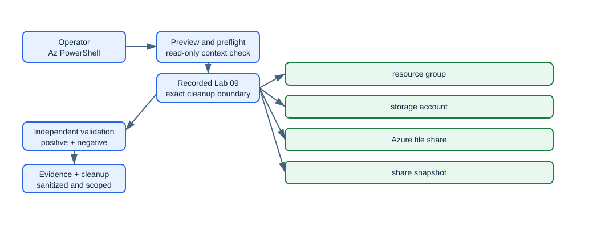

<!-- BEGIN GENERATED AZ104 V2 -->
# Lab 09: Configure Azure Files, snapshots, soft delete, and identity access

[Previous: Lab 08](../08-blob-lifecycle-replication/README.md) · [Catalog](../README.md) · [Next: Lab 10](../10-arm-bicep-lifecycle/README.md)

This self-contained lab uses Azure CLI commands hosted in PowerShell. Complete the guided lane or the automated lane—not both with the same run ID.

## Scenario, role, and outcome

Scenario: A file-services administrator publishing a recoverable team share is responding to an operational request: Publish a bounded SMB share, protect real content with a snapshot and soft delete, and optionally configure a gated Microsoft Entra Kerberos and share-RBAC path.

Learner role: A file-services administrator publishing a recoverable team share.

Outcome: Publish a bounded SMB share, protect real content with a snapshot and soft delete, and optionally configure a gated Microsoft Entra Kerberos and share-RBAC path.

| Item | Value |
|---|---|
| Duration | 135 minutes |
| Difficulty | foundational |
| Cost class | `low` |
| Command surface | Azure CLI (`az`, `az rest`, Bicep, AzCopy, or KQL where required) hosted in PowerShell |
| Live state | Not executed during this offline rebuild |

Completion criteria:

- All required checkpoints report pass.
- The deterministic break/fix is injected, diagnosed, and repaired.
- cleanup.json reports no active run-owned resources, with any retained item explicitly documented.

## Objectives and checkpoints

| Objective | Skill | Checkpoints |
|---|---|---|
| `ST-ACCESS-05` | Configure identity-based access for Azure Files | `LAB09-CP01`, `LAB09-CP05` |
| `ST-ACCOUNTS-05` | Manage data by using Azure Storage Explorer and AzCopy | `LAB09-CP02`, `LAB09-CP05` |
| `ST-DATA-01` | Create and configure a file share in Azure Files | `LAB09-CP03`, `LAB09-CP05` |
| `ST-DATA-05` | Configure snapshots and soft delete for Azure Files | `LAB09-CP04`, `LAB09-CP05` |

The authoritative objective wording comes from the [Microsoft AZ-104 study guide](https://learn.microsoft.com/en-us/credentials/certifications/resources/study-guides/az-104), skills measured as of 2026-04-17.

## Architecture and service topology



The editable source is [architecture.mmd](diagrams/architecture.mmd). Azure Resource Manager creates the storage account, file share, snapshot, protection settings, and optional share-level RBAC. The bootstrap data path writes one sample file with a key held only in memory. In the gated lane, a compatible client obtains an Entra Kerberos ticket and reaches the SMB endpoint, where share RBAC and file ACLs form separate authorization layers.

## Concept primer and design decisions

Azure Files data protection combines share snapshots with share soft delete. Identity-based SMB access additionally requires exactly one directory source, share-level RBAC, client Kerberos prerequisites, and file/directory ACLs; an Azure CLI control-plane success alone does not prove that a client can mount the share.

Design decisions:

- Use a bounded quota and transaction-optimized tier.
- Take a snapshot only after sample content exists.
- Gate Microsoft Entra Kerberos because enabling it creates tenant-integrated state and still requires approved consent, Conditional Access, and client configuration outside this lab.
- Use an account key only in memory for the bootstrap file operation because Azure Files identity authorization is an SMB path, not an Azure CLI file-data OAuth demonstration.

## Required and optional inputs

| Input | Required | Source | Safe example | Gate behavior |
|---|:---:|---|---|---|
| `run-id` — Unique lowercase run ownership identifier | Yes | parameter | `az104l09-01` | `block` |
| `subscription-id` — Expected disposable subscription ID | Yes | parameter-or-environment (`AZ104_SUBSCRIPTION_ID`) | `00000000-0000-0000-0000-000000000000` | `block` |
| `location` — Approved primary Azure region | Yes | parameter-or-environment (`AZ104_LOCATION`) | `westeurope` | `block` |
| `files-identity-source` — Authorized Entra Kerberos, AD DS, or managed-domain integration path | No | environment (`AZ104_FILES_IDENTITY_SOURCE`) | `entra-kerberos` | `skip-checkpoint` |
| `files-principal-object-id` — Disposable principal for Azure Files data-plane RBAC | No | environment (`AZ104_FILES_PRINCIPAL_OBJECT_ID`) | `00000000-0000-0000-0000-000000000000` | `skip-checkpoint` |

Secrets stay in temporary environment variables and are never written to `run.json`, validation evidence, or Git. A `skip-checkpoint` gate produces a visible partial result; it never becomes a pass.

## Read-only preflight

Sign in deliberately, inspect the active context, then run the lab preflight. It never signs in, changes context, installs an extension, registers a provider, or creates a resource.

```powershell
az login
az account show --query '{cloud:environmentName,subscription:id,tenant:tenantId,user:user.name}' --output json
./scripts/cli/Preflight.ps1 -SubscriptionId $env:AZ104_SUBSCRIPTION_ID -RunId 'az104l09-01' -Location 'westeurope'
```

Representative redacted output:

```text
context                 True  cloud=AzureCloud; tenant=<redacted>; subscription=<redacted>
azure-cli               True  2.88.x
provider:<namespace>    True  Registered
region                  True  westeurope
Preflight passed. It performed no Azure mutation.
```

If a required row fails, stop. Correct the local tool, context, provider, quota, SKU, region, permission, or input outside the lab, then rerun preflight.

## Task 1 — Baseline name, provider, and optional identity prerequisites {#task-1}

Checkpoint: `LAB09-CP01`

Purpose and operational relevance: Confirm global name availability and inventory the optional directory-source request before any storage mutation. Name collisions and incomplete tenant prerequisites should fail before a billable endpoint or tenant-integrated service principal is created.

Run these commands from PowerShell. If you already used the automated lane, choose a new run ID before trying this guided lane.

```powershell
$storage = "st09$suffix"
$share = 'teamfiles'
$availability = az storage account check-name --name $storage --output json | ConvertFrom-Json
if (-not $availability.nameAvailable) { throw "Storage name unavailable: $($availability.reason)" }
$requestedIdentitySource = [Environment]::GetEnvironmentVariable('AZ104_FILES_IDENTITY_SOURCE')
if ($requestedIdentitySource -and $requestedIdentitySource -cne 'entra-kerberos') { throw 'Only the documented entra-kerberos optional lane is supported.' }
```

Expected state: The deterministic account name is available and any requested identity source exactly selects the documented gated path.

Representative redacted output:

```text
storageNameAvailable=True; identityLane=not-requested|entra-kerberos
```

Positive validation:

```powershell
$account = az storage account show --resource-group $ResourceGroupName --name $storage --output json | ConvertFrom-Json
if ($account.tags.labId -ne '09' -or $account.tags.runId -ne $RunId) { throw 'Storage-account ownership tags mismatch.' }
$account | Select-Object id,name,tags
```

Expected positive result: During deployment validation, the deterministic account resolves with exact lab and run ownership tags.

Negative validation:

```powershell
$duplicates = @(az storage account list --resource-group $ResourceGroupName --output json | ConvertFrom-Json | Where-Object name -eq $storage)
if ($duplicates.Count -ne 1) { throw "Expected exactly one deterministic storage account; found $($duplicates.Count)." }
'Deterministic storage accounts in run scope: 1'
```

Expected negative result: No duplicate or conflicting endpoint exists in the run resource group.

Evidence to retain:

- `LAB09-CP01` UTC result for baseline name, provider, and optional identity prerequisites.
- Exact run-owned ID and asserted service properties from: During deployment validation, the deterministic account resolves with exact lab and run ownership tags.
- Negative-boundary outcome from: No duplicate or conflicting endpoint exists in the run resource group.
- Cleanup dependency recorded for the objects created or configured by LAB09-CP01.

Common failure and safe retry: The account name was used by a prior run or a learner supplies an unsupported identity-source label. Choose a new run ID for a collision; use exactly entra-kerberos only after the documented tenant prerequisites are approved.

Cleanup dependency: This read-only checkpoint creates nothing.

## Task 2 — Create a bounded SMB share and enable share soft delete {#task-2}

Checkpoint: `LAB09-CP02`

Purpose and operational relevance: Create and immediately record the storage account and ARM file-share IDs, then enable seven-day share recovery. A recoverable ownership trail must exist before a later file, snapshot, or identity operation can fail.

Run these commands from PowerShell. If you already used the automated lane, choose a new run ID before trying this guided lane.

```powershell
$created = az storage account create --resource-group $ResourceGroupName --name $storage --location $Location --sku Standard_LRS --kind StorageV2 --https-only true --min-tls-version TLS1_2 --allow-blob-public-access false --allow-shared-key-access true --tags purpose=az104-lab labId=09 runId=$RunId --output json | ConvertFrom-Json
Add-ManagedObject -CheckpointId 'LAB09-CP02' -Kind 'azure-resource' -Id ([string]$created.id) -Name $storage -Type 'Microsoft.Storage/storageAccounts' -Scope "/subscriptions/$SubscriptionId/resourceGroups/$ResourceGroupName" -OwnershipMethod 'manifest-id-and-tags'
az storage account file-service-properties update --resource-group $ResourceGroupName --account-name $storage --enable-delete-retention true --delete-retention-days 7 --output none
$createdShare = az storage share-rm create --resource-group $ResourceGroupName --storage-account $storage --name $share --quota 20 --access-tier TransactionOptimized --enabled-protocols SMB --metadata labId=09 runId=$RunId --output json | ConvertFrom-Json
Add-ManagedObject -CheckpointId 'LAB09-CP02' -Kind 'azure-resource' -Id ([string]$createdShare.id) -Name $share -Type 'Microsoft.Storage/storageAccounts/fileServices/shares' -Scope ([string]$created.id) -OwnershipMethod 'manifest-id'
```

Expected state: A tagged Standard_LRS account contains one 20-GiB transaction-optimized SMB share and seven-day share soft delete is enabled.

Representative redacted output:

```text
account=st09<suffix>; share=teamfiles; quotaGiB=20; tier=TransactionOptimized; softDeleteDays=7
```

Positive validation:

```powershell
$shareState = az storage share-rm show --resource-group $ResourceGroupName --storage-account $storage --name $share --output json | ConvertFrom-Json
$fileService = az storage account file-service-properties show --resource-group $ResourceGroupName --account-name $storage --output json | ConvertFrom-Json
if ($shareState.shareQuota -ne 20 -or $shareState.accessTier -ne 'TransactionOptimized') { throw 'Share quota or access tier mismatch.' }
if (-not $fileService.shareDeleteRetentionPolicy.enabled -or $fileService.shareDeleteRetentionPolicy.days -ne 7) { throw 'Share soft-delete settings mismatch.' }
[pscustomobject]@{ shareId = $shareState.id; quotaGiB = $shareState.shareQuota; tier = $shareState.accessTier; softDeleteDays = $fileService.shareDeleteRetentionPolicy.days }
```

Expected positive result: The share reports the bounded quota and tier while file-service properties report seven-day retention.

Negative validation:

```powershell
$account = az storage account show --resource-group $ResourceGroupName --name $storage --output json | ConvertFrom-Json
if (-not $account.enableHttpsTrafficOnly -or $account.minimumTlsVersion -ne 'TLS1_2' -or $account.allowBlobPublicAccess) { throw 'Storage transport or public-access baseline mismatch.' }
'HTTPS-only=True; minimumTLS=TLS1_2; blobPublicAccess=False'
```

Expected negative result: No insecure transport or public blob access conflicts with the file-service baseline.

Evidence to retain:

- `LAB09-CP02` UTC result for create a bounded SMB share and enable share soft delete.
- Exact run-owned ID and asserted service properties from: The share reports the bounded quota and tier while file-service properties report seven-day retention.
- Negative-boundary outcome from: No insecure transport or public blob access conflicts with the file-service baseline.
- Cleanup dependency recorded for the objects created or configured by LAB09-CP02.

Common failure and safe retry: Share creation is attempted before the account converges or a retry changes quota without reconciling the recorded ID. Query the account and share by exact names, preserve any returned IDs, then repeat only the missing idempotent property update.

Cleanup dependency: Remove the optional identity role, restored share and snapshots before deleting the account and resource group.

## Task 3 — Write sample content and capture a share snapshot {#task-3}

Checkpoint: `LAB09-CP03`

Purpose and operational relevance: Bootstrap one real file using a key held only in memory, then persist the returned snapshot time immediately. A snapshot taken before content exists proves little, while persisting a key would create a credential incident.

Run these commands from PowerShell. If you already used the automated lane, choose a new run ID before trying this guided lane.

```powershell
$sample = Join-Path $StateDir 'sample.txt'
'AZ-104 Azure Files protected sample' | Set-Content -LiteralPath $sample -Encoding utf8
$accountKey = az storage account keys list --resource-group $ResourceGroupName --account-name $storage --query '[0].value' --output tsv
if (-not $accountKey) { throw 'A temporary bootstrap key could not be obtained.' }
try {
    az storage file upload --account-name $storage --share-name $share --source $sample --path sample.txt --account-key $accountKey --output none
} finally {
    $accountKey = $null
    Remove-Variable accountKey -ErrorAction SilentlyContinue
}
$snapshot = az storage share-rm snapshot --resource-group $ResourceGroupName --storage-account $storage --name $share --output json | ConvertFrom-Json
if ([string]::IsNullOrWhiteSpace([string]$snapshot.snapshotTime)) { throw 'Snapshot creation returned no snapshot time.' }
$state.inputs['share-snapshot-time'] = [string]$snapshot.snapshotTime
Save-RunState
```

Expected state: The active share contains sample.txt and an ARM-visible snapshot time is recorded without an account key in state.

Representative redacted output:

```text
file=sample.txt; snapshotTime=<redacted>; persistedAccountKeys=0
```

Positive validation:

```powershell
$validationKey = az storage account keys list --resource-group $ResourceGroupName --account-name $storage --query '[0].value' --output tsv
try {
    $fileExists = az storage file exists --account-name $storage --share-name $share --path sample.txt --account-key $validationKey --output json | ConvertFrom-Json
    if (-not $fileExists.exists) { throw 'The protected sample file is missing.' }
} finally {
    $validationKey = $null
    Remove-Variable validationKey -ErrorAction SilentlyContinue
}
$snapshots = @(az storage share-rm list --resource-group $ResourceGroupName --storage-account $storage --include-snapshot true --output json | ConvertFrom-Json | Where-Object snapshotTime -eq $state.inputs['share-snapshot-time'])
if ($snapshots.Count -ne 1) { throw 'The recorded snapshot is missing.' }
[pscustomobject]@{ fileExists = $true; recordedSnapshotCount = $snapshots.Count }
```

Expected positive result: The live file exists and exactly one snapshot matches the recorded snapshot time.

Negative validation:

```powershell
$shareId = az storage share-rm show --resource-group $ResourceGroupName --storage-account $storage --name $share --query id --output tsv
if (-not $shareId -or -not $state.inputs['share-snapshot-time']) {
  throw 'The live share or recorded snapshot recovery target is missing.'
}
if (Select-String -Path (Join-Path $StateDir '*.json') -Pattern 'accountKey|connectionString|sasToken' -ErrorAction SilentlyContinue) {
  throw 'A storage credential was persisted.'
}
'Live share=1; persisted storage credentials=0; snapshot recovery target recorded=True'
```

Expected negative result: No account key, connection string, or SAS is persisted, while the non-secret snapshot time is retained.

Evidence to retain:

- `LAB09-CP03` UTC result for write sample content and capture a share snapshot.
- Exact run-owned ID and asserted service properties from: The live file exists and exactly one snapshot matches the recorded snapshot time.
- Negative-boundary outcome from: No account key, connection string, or SAS is persisted, while the non-secret snapshot time is retained.
- Cleanup dependency recorded for the objects created or configured by LAB09-CP03.

Common failure and safe retry: The sample upload uses an unsupported OAuth assumption for Azure Files, or the snapshot is taken before data exists. Keep the bootstrap key only in the current variable, verify the active file, and create a new snapshot only when the prior snapshot has no recorded time.

Cleanup dependency: Delete snapshots with the share during cleanup; never persist or attempt to purge an account key.

## Task 4 — Configure the gated Entra Kerberos and share-RBAC path {#task-4}

Checkpoint: `LAB09-CP04`

Purpose and operational relevance: With exact authorization inputs, enable the single supported identity source, inject a missing-role fault, and restore the least-privileged share data role. Kerberos authentication and Azure RBAC authorization are distinct; a valid ticket is still denied when the share-level data role is absent.

Run these commands from PowerShell. If you already used the automated lane, choose a new run ID before trying this guided lane.

```powershell
$requestedSource = [Environment]::GetEnvironmentVariable('AZ104_FILES_IDENTITY_SOURCE')
if ($requestedSource -cne 'entra-kerberos') { throw 'Identity mutation requires AZ104_FILES_IDENTITY_SOURCE exactly entra-kerberos.' }
$identityPrincipalId = [Environment]::GetEnvironmentVariable('AZ104_FILES_PRINCIPAL_OBJECT_ID')
$principal = az rest --method GET --url "https://graph.microsoft.com/v1.0/directoryObjects/$identityPrincipalId?`$select=id,@odata.type" --output json | ConvertFrom-Json
if ($principal.id -ne $identityPrincipalId) { throw 'The approved identity principal did not resolve.' }
$principalType = switch ([string]$principal.'@odata.type') { '#microsoft.graph.user' { 'User' } '#microsoft.graph.group' { 'Group' } '#microsoft.graph.servicePrincipal' { 'ServicePrincipal' } default { throw 'Unsupported principal type for share RBAC.' } }
$state.inputs['files-principal-object-id'] = $identityPrincipalId
$state.inputs['files-identity-source'] = $requestedSource
Save-RunState
$updatedAccount = az storage account update --name $storage --resource-group $ResourceGroupName --enable-files-aadkerb true --output json | ConvertFrom-Json
if ($updatedAccount.azureFilesIdentityBasedAuthentication.directoryServiceOptions -ne 'AADKERB') { throw 'Entra Kerberos did not become the active identity source.' }
$shareId = az storage share-rm show --resource-group $ResourceGroupName --storage-account $storage --name $share --query id --output tsv
$injected = az role assignment create --assignee-object-id $identityPrincipalId --assignee-principal-type $principalType --role 'Storage File Data SMB Share Contributor' --scope $shareId --output json | ConvertFrom-Json
Add-ManagedObject -CheckpointId 'LAB09-CP04' -Kind 'azure-resource' -Id ([string]$injected.id) -Name 'injected-file-share-contributor' -Type 'Microsoft.Authorization/roleAssignments' -Scope $shareId -OwnershipMethod 'manifest-id'
az role assignment delete --ids $injected.id
$injectedRecord = @($state.managedObjects | Where-Object id -eq $injected.id)[0]
$injectedRecord.lifecycleStatus = 'deleted'
Save-RunState
$missing = @(az role assignment list --assignee-object-id $identityPrincipalId --scope $shareId --output json | ConvertFrom-Json | Where-Object roleDefinitionName -eq 'Storage File Data SMB Share Contributor')
if ($missing.Count -ne 0) { throw 'The missing-role fault was not established.' }
$repaired = az role assignment create --assignee-object-id $identityPrincipalId --assignee-principal-type $principalType --role 'Storage File Data SMB Share Contributor' --scope $shareId --output json | ConvertFrom-Json
Add-ManagedObject -CheckpointId 'LAB09-CP04' -Kind 'azure-resource' -Id ([string]$repaired.id) -Name 'file-share-contributor' -Type 'Microsoft.Authorization/roleAssignments' -Scope $shareId -OwnershipMethod 'manifest-id'
```

Expected state: AADKERB is the only identity source and the approved principal has exactly the intended share-scoped SMB data role after the missing-role fault is repaired.

Representative redacted output:

```text
identitySource=AADKERB; injectedRoleRemoved=True; repairedRoleCount=1; clientMountVerification=external-prerequisite
```

Positive validation:

```powershell
$identity = az storage account show --resource-group $ResourceGroupName --name $storage --query azureFilesIdentityBasedAuthentication --output json | ConvertFrom-Json
if ($identity.directoryServiceOptions -ne 'AADKERB') { throw 'AADKERB is not the configured identity source.' }
$shareId = az storage share-rm show --resource-group $ResourceGroupName --storage-account $storage --name $share --query id --output tsv
$roles = @(az role assignment list --assignee-object-id $identityPrincipalId --scope $shareId --output json | ConvertFrom-Json | Where-Object roleDefinitionName -eq 'Storage File Data SMB Share Contributor')
if ($roles.Count -ne 1) { throw "Expected one repaired share role; found $($roles.Count)." }
[pscustomobject]@{ identitySource = $identity.directoryServiceOptions; shareRoleCount = $roles.Count }
```

Expected positive result: The account reports AADKERB and the approved principal has exactly one share-scoped SMB Share Contributor assignment.

Negative validation:

```powershell
$shareId = az storage share-rm show --resource-group $ResourceGroupName --storage-account $storage --name $share --query id --output tsv
$excess = @(az role assignment list --assignee-object-id $identityPrincipalId --scope $shareId --output json | ConvertFrom-Json | Where-Object { $_.roleDefinitionName -in @('Owner','Contributor','Storage File Data SMB Share Elevated Contributor') })
if ($excess.Count -ne 0) { throw 'An excessive direct role remains at share scope.' }
'Excessive direct share roles: 0'
```

Expected negative result: Owner, Contributor, and elevated SMB ACL-management roles are absent at the exact share scope.

Evidence to retain:

- `LAB09-CP04` UTC result for configure the gated Entra Kerberos and share-RBAC path.
- Exact run-owned ID and asserted service properties from: The account reports AADKERB and the approved principal has exactly one share-scoped SMB Share Contributor assignment.
- Negative-boundary outcome from: Owner, Contributor, and elevated SMB ACL-management roles are absent at the exact share scope.
- Cleanup dependency recorded for the objects created or configured by LAB09-CP04.

Common failure and safe retry: The storage flag is mistaken for completed client access; missing tenant consent, Conditional Access exclusion, client ticket policy, or ACLs still blocks SMB. Inspect the identity source and exact share assignment first; complete the named external prerequisites rather than granting a broader Azure role.

Cleanup dependency: Delete the recorded role assignment and disable Entra Kerberos before deleting the share, account, and resource group.

## Task 5 — Delete and restore the protected share, then reconcile readiness {#task-5}

Checkpoint: `LAB09-CP05`

Purpose and operational relevance: Exercise share soft delete against the real sample, persist the deleted-version recovery target, restore it, and prove content survived. A retention setting is only operationally useful when administrators can identify and restore the exact deleted generation.

Run these commands from PowerShell. If you already used the automated lane, choose a new run ID before trying this guided lane.

```powershell
az storage share-rm delete --resource-group $ResourceGroupName --storage-account $storage --name $share --include snapshots --yes
$deleted = @(az storage share-rm list --resource-group $ResourceGroupName --storage-account $storage --include-deleted true --output json | ConvertFrom-Json | Where-Object { $_.name -eq $share -and $_.deleted })
if ($deleted.Count -ne 1 -or [string]::IsNullOrWhiteSpace([string]$deleted[0].deletedVersion)) { throw 'Expected one recoverable deleted share generation.' }
$state.inputs['deleted-share-version'] = [string]$deleted[0].deletedVersion
Save-RunState
$restored = az storage share-rm restore --resource-group $ResourceGroupName --storage-account $storage --name $share --deleted-version $state.inputs['deleted-share-version'] --output json | ConvertFrom-Json
if (-not $restored.id) { throw 'Share restore returned no resource ID.' }
```

Expected state: The original share generation is soft-deleted, identified by deletedVersion, restored under the same name, and its sample content remains readable.

Representative redacted output:

```text
softDeletedGenerations=1; deletedVersion=<redacted>; restored=True; sampleExists=True
```

Positive validation:

```powershell
$restoredShare = az storage share-rm show --resource-group $ResourceGroupName --storage-account $storage --name $share --output json | ConvertFrom-Json
if (-not $restoredShare.id -or $restoredShare.shareQuota -ne 20) { throw 'Restored share state is incomplete.' }
$validationKey = az storage account keys list --resource-group $ResourceGroupName --account-name $storage --query '[0].value' --output tsv
try {
    $fileExists = az storage file exists --account-name $storage --share-name $share --path sample.txt --account-key $validationKey --output json | ConvertFrom-Json
    if (-not $fileExists.exists) { throw 'Sample content did not survive share restore.' }
} finally {
    $validationKey = $null
    Remove-Variable validationKey -ErrorAction SilentlyContinue
}
[pscustomobject]@{ restoredShareId = $restoredShare.id; sampleExists = $true }
```

Expected positive result: The restored active share has its original quota and still contains sample.txt.

Negative validation:

```powershell
$deleted = @(az storage share-rm list --resource-group $ResourceGroupName --storage-account $storage --include-deleted true --output json | ConvertFrom-Json | Where-Object { $_.name -eq $share -and $_.deleted })
if ($deleted.Count -ne 0) { throw 'A deleted generation remains after the restore exercise.' }
if (-not $state.inputs['deleted-share-version']) { throw 'The recovery target was not persisted.' }
'Unrestored deleted generations=0; recovery target recorded=True'
```

Expected negative result: No unrestored soft-deleted generation remains and the non-secret deletedVersion evidence is recorded.

Evidence to retain:

- `LAB09-CP05` UTC result for delete and restore the protected share, then reconcile readiness.
- Exact run-owned ID and asserted service properties from: The restored active share has its original quota and still contains sample.txt.
- Negative-boundary outcome from: No unrestored soft-deleted generation remains and the non-secret deletedVersion evidence is recorded.
- Cleanup dependency recorded for the objects created or configured by LAB09-CP05.

Common failure and safe retry: Cleanup-style deletion is confused with an irreversible purge, or restore is attempted without the exact deletedVersion. List deleted shares read-only, match the run-owned name, and restore only the recorded generation; never purge a recovery item automatically.

Cleanup dependency: Final cleanup may delete the restored share with snapshots, but it must list the expected soft-deleted retention item in cleanup.json rather than purge it.

## Final validation and result interpretation

Run independent deployment validation after all required checkpoints:

```powershell
./scripts/cli/Validate.ps1 -RunId 'az104l09-01' -Mode Deployment
az resource list --resource-group 'rg-az104-l09-az104l09-01' --query '[].{name:name,type:type}' --output table
```

- `pass`: every required positive and negative check passed.
- `partial`: every required check passed, but at least one optional gate was deliberately skipped.
- `fail`: a required checkpoint failed; do not record the lab as complete.

Keep the redacted `validation.json`; do not retain credentials, tokens, access keys, certificate material, email addresses, tenant IDs, or unredacted command output.

## Deterministic break/fix exercise

Injection: Remove the exact share-scoped SMB data role after enabling the optional Entra Kerberos identity source.

Expected symptom: A compatible client may obtain a Kerberos ticket but is denied at share authorization.

Diagnose with a read-only service query:

```powershell
$duplicates = @(az storage account list --resource-group $ResourceGroupName --output json | ConvertFrom-Json | Where-Object name -eq $storage)
if ($duplicates.Count -ne 1) { throw "Expected exactly one deterministic storage account; found $($duplicates.Count)." }
'Deterministic storage accounts in run scope: 1'
```

Diagnosis: Separate the account identity-source query from the principal's direct RBAC assignments at the exact share ID.

Repair: Recreate only Storage File Data SMB Share Contributor for the approved principal and retain the returned assignment ID.

Before/after evidence must show the failed negative or positive check before repair and the same check passing afterward. Do not inject a second fault until the first is removed.

## Optional job-style challenge

Write a migration checklist covering identity source, ACL translation, AzCopy, snapshots, and rollback.

Deliver a short change record containing assumptions, exact commands, redacted evidence, cost and risk notes, rollback, and residual results. The challenge is optional and never changes required checkpoint status.

## Troubleshooting

| Symptom | Likely cause | Safe next step |
|---|---|---|
| Context mismatch | Active CLI context differs from `run.json` | Stop, inspect `az account show`, and select the intended disposable context yourself. |
| Provider or feature unavailable | Registration, region, feature, or SKU gate is unmet | Read the preflight result; do not register or enable tenant features implicitly. |
| Name already exists | The run ID is reused or a globally unique name collided | Keep existing state intact and choose a new run ID. |
| Expected state is delayed | The service is converging asynchronously | Repeat only the read-only query with bounded retries; do not duplicate creation. |
| Permission denied | Role, Graph scope, or data-plane authorization is insufficient | Confirm the declared least-privilege boundary; do not broaden access automatically. |
| Cleanup refuses ownership | ID, context, or tags differ from the manifest | Investigate the mismatch; never bypass ownership verification. |

## Cleanup and residual verification

Preview exact targets first, execute only after ownership review, then validate post-cleanup:

```powershell
./scripts/cli/Cleanup.ps1 -RunId 'az104l09-01'
./scripts/cli/Cleanup.ps1 -RunId 'az104l09-01' -Execute
./scripts/cli/Validate.ps1 -RunId 'az104l09-01' -Mode PostCleanup
$deleted = @(az storage share-rm list --resource-group $ResourceGroupName --storage-account $storage --include-deleted true --output json | ConvertFrom-Json | Where-Object { $_.name -eq $share -and $_.deleted })
if ($deleted.Count -ne 0) { throw 'A deleted generation remains after the restore exercise.' }
if (-not $state.inputs['deleted-share-version']) { throw 'The recovery target was not persisted.' }
'Unrestored deleted generations=0; recovery target recorded=True'
```

`cleanup.json` passes only when no active manifest-managed object remains. Soft-deleted or intentionally retained items must be listed with their reason and expected disposition. The lifecycle never performs irreversible purge automatically.

## Exam debrief and assessment

Explain why the expected state, negative check, and cleanup boundary matter—not only which command was used. Map any missed concept back to its task anchor before reviewing the answer key.

Complete [QUESTIONS.md](assessment/QUESTIONS.md), then use [ANSWERS.md](assessment/ANSWERS.md) for option-by-option remediation. Scores of 85–100% indicate mastery, 70–84% indicate targeted review, and below 70% means repeat the mapped tasks.

## Microsoft Learn sources

- [Microsoft AZ-104 study guide](https://learn.microsoft.com/en-us/credentials/certifications/resources/study-guides/az-104)
- [Create an Azure file share with Azure CLI](https://learn.microsoft.com/en-us/azure/storage/files/storage-how-to-create-file-share)
- [Use Azure Files share snapshots](https://learn.microsoft.com/en-us/azure/storage/files/storage-snapshots-files)
- [Enable soft delete for Azure file shares](https://learn.microsoft.com/en-us/azure/storage/files/storage-files-prevent-file-share-deletion)
- [Microsoft Entra Kerberos authentication for Azure Files](https://learn.microsoft.com/en-us/azure/storage/files/storage-files-identity-auth-hybrid-identities-enable)
- [Assign share-level permissions to an identity](https://learn.microsoft.com/en-us/azure/storage/files/storage-files-identity-assign-share-level-permissions)

## Lifecycle script appendix

The guided task blocks above and these executable scripts are generated from the same checkpoint data. The scripts are an optional automated lane; use a different run ID if you already completed the guided lane.

### `Preflight.ps1`

```powershell
# BEGIN GENERATED AZ104 V2
#requires -Version 7.4
[CmdletBinding()]
[Diagnostics.CodeAnalysis.SuppressMessageAttribute('PSAvoidUsingWriteHost', '', Justification = 'Interactive lab progress is intentionally written to the host.')]
[Diagnostics.CodeAnalysis.SuppressMessageAttribute('PSReviewUnusedParameter', '', Justification = 'All lifecycle scripts expose a stable cross-lab interface.')]
[Diagnostics.CodeAnalysis.SuppressMessageAttribute('PSUseDeclaredVarsMoreThanAssignments', '', Justification = 'Generated task variables are intentionally shared across checkpoint blocks.')]
param(
    [string]$SubscriptionId = $env:AZ104_SUBSCRIPTION_ID,
    [Parameter(Mandatory)][ValidatePattern('^[a-z0-9](?:[a-z0-9-]{0,30}[a-z0-9])?$')][string]$RunId,
    [Parameter(Mandatory)][ValidatePattern('^[a-z0-9]+$')][string]$Location,
    [string]$SecondaryLocation = $env:AZ104_SECONDARY_LOCATION
)

Set-StrictMode -Version Latest
$ErrorActionPreference = 'Stop'
$PSNativeCommandUseErrorActionPreference = $true

if (-not (Get-Command az -ErrorAction SilentlyContinue)) {
    throw 'Azure CLI is required. Run the repository readiness initializer, then retry.'
}

$account = az account show --output json | ConvertFrom-Json
if (-not $account) { throw 'No active Azure CLI context. Run az login deliberately before this lab.' }
if ($SubscriptionId -and [string]$account.id -ne $SubscriptionId) {
    throw "Context mismatch: active subscription is $($account.id), expected $SubscriptionId. Preflight will not switch it."
}
if (-not $SubscriptionId) { $SubscriptionId = [string]$account.id }
# The account read above is the mandatory context gate. All remaining Azure
# probes are collected as results instead of allowing one unavailable SKU or
# provider query to abort the readiness report before it can explain the gap.
$PSNativeCommandUseErrorActionPreference = $false
$suffix = (($RunId -replace '[^a-z0-9]', '') + '000000000000').Substring(0, 12)
$ResourceGroupName = $(if ('09' -in @('00', '01', '02')) { $null } else { "rg-az104-l09-$RunId" })

$checks = [System.Collections.Generic.List[object]]::new()
function Add-PreflightResult {
    param([string]$Id, [bool]$Required, [bool]$Passed, [string]$Actual)
    $checks.Add([pscustomobject]@{ id = $Id; required = $Required; passed = $Passed; actual = $Actual })
}

Add-PreflightResult -Id 'context' -Required $true -Passed $true -Actual "cloud=$($account.environmentName); tenant=<redacted>; subscription=<redacted>"
$azVersion = (az version --query '"azure-cli"' --output tsv)
$bicepVersion = (az bicep version 2>&1 | Out-String).Trim()
Add-PreflightResult -Id 'azure-cli' -Required $true -Passed ([bool]$azVersion) -Actual $azVersion
Add-PreflightResult -Id 'powershell' -Required $true -Passed ($PSVersionTable.PSVersion -ge [version]'7.4') -Actual $PSVersionTable.PSVersion.ToString()
Add-PreflightResult -Id 'bicep' -Required $true -Passed ([bool]$bicepVersion) -Actual $bicepVersion

$requiredEnvironmentVariables = @()
foreach ($variableName in $requiredEnvironmentVariables) {
    $present = -not [string]::IsNullOrWhiteSpace([Environment]::GetEnvironmentVariable($variableName))
    Add-PreflightResult -Id "input:$variableName" -Required $true -Passed $present -Actual $(if ($present) { 'present (value redacted)' } else { 'missing' })
}

$providers = @(
    'Microsoft.Storage'
)
foreach ($provider in $providers) {
    $registrationState = az provider show --namespace $provider --query registrationState --output tsv 2>$null
    Add-PreflightResult -Id "provider:$provider" -Required $true -Passed ($registrationState -eq 'Registered') -Actual $(if ($registrationState) { $registrationState } else { 'Unavailable' })
}

$knownLocation = az account list-locations --query "[?name=='$Location'].name | [0]" --output tsv
Add-PreflightResult -Id 'region' -Required $true -Passed ($knownLocation -eq $Location) -Actual $(if ($knownLocation) { $knownLocation } else { 'not available' })

$gatePresent = -not [string]::IsNullOrWhiteSpace([Environment]::GetEnvironmentVariable('AZ104_FILES_PRINCIPAL_OBJECT_ID'))
Add-PreflightResult -Id 'optional-gate:AZ104_FILES_PRINCIPAL_OBJECT_ID' -Required $false -Passed $gatePresent -Actual $(if ($gatePresent) { 'present (value redacted)' } else { 'absent; checkpoint will be skipped' })

$gateMatches = [string]::Equals([Environment]::GetEnvironmentVariable('AZ104_FILES_IDENTITY_SOURCE'), 'entra-kerberos', [StringComparison]::Ordinal)
Add-PreflightResult -Id 'optional-gate:AZ104_FILES_IDENTITY_SOURCE' -Required $false -Passed $gateMatches -Actual $(if ($gateMatches) { 'exact affirmative value supplied (value redacted)' } else { 'absent or not exact; checkpoint will be skipped' })

$azCopy = Get-Command azcopy -ErrorAction SilentlyContinue
Add-PreflightResult -Id 'azcopy' -Required $true -Passed ([bool]$azCopy) -Actual $(if ($azCopy) { $azCopy.Source } else { 'missing' })

$storage = "st09$suffix"
$requestedIdentitySource = [Environment]::GetEnvironmentVariable('AZ104_FILES_IDENTITY_SOURCE')
$requestedPrincipalId = [Environment]::GetEnvironmentVariable('AZ104_FILES_PRINCIPAL_OBJECT_ID')

$probePassed = $true
$probeActual = 'assertion passed (output not persisted)'
try {
    $LASTEXITCODE = 0
    & {
$availability = az storage account check-name --name $storage --output json | ConvertFrom-Json
if (-not $availability.nameAvailable) { throw "Storage name unavailable: $($availability.reason)" }
    } | Out-Null
    if ($LASTEXITCODE -ne 0) { throw "native exit code $LASTEXITCODE" }
} catch {
    $probePassed = $false
    $probeActual = "assertion failed: $($_.Exception.GetType().Name)"
}
Add-PreflightResult -Id 'preflight.authored.lab09.storage-name' -Required $true -Passed $probePassed -Actual $probeActual

$probePassed = $true
$probeActual = 'assertion passed (output not persisted)'
try {
    $LASTEXITCODE = 0
    & {
if ($requestedIdentitySource -or $requestedPrincipalId) {
    if ($requestedIdentitySource -cne 'entra-kerberos') { throw 'AZ104_FILES_IDENTITY_SOURCE must be exactly entra-kerberos.' }
    if ([string]::IsNullOrWhiteSpace($requestedPrincipalId)) { throw 'AZ104_FILES_PRINCIPAL_OBJECT_ID is required with the identity source.' }
    $principal = az rest --method GET --url "https://graph.microsoft.com/v1.0/directoryObjects/$requestedPrincipalId?`$select=id" --output json | ConvertFrom-Json
    if ($principal.id -ne $requestedPrincipalId) { throw 'The approved Azure Files principal did not resolve.' }
}
    } | Out-Null
    if ($LASTEXITCODE -ne 0) { throw "native exit code $LASTEXITCODE" }
} catch {
    $probePassed = $false
    $probeActual = "assertion failed: $($_.Exception.GetType().Name)"
}
Add-PreflightResult -Id 'preflight.authored.lab09.identity-gate' -Required $false -Passed $probePassed -Actual $probeActual

$checks | Format-Table -AutoSize
$failedRequired = @($checks | Where-Object { $_.required -and -not $_.passed })
if ($failedRequired.Count -gt 0) {
    throw "Preflight blocked: $($failedRequired.id -join ', ')"
}
Write-Host 'Preflight passed. It performed no sign-in, context switch, provider registration, or Azure mutation.'
# END GENERATED AZ104 V2
```

### `Setup.ps1`

```powershell
# BEGIN GENERATED AZ104 V2
#requires -Version 7.4
[CmdletBinding()]
[Diagnostics.CodeAnalysis.SuppressMessageAttribute('PSAvoidUsingWriteHost', '', Justification = 'Interactive lab progress is intentionally written to the host.')]
[Diagnostics.CodeAnalysis.SuppressMessageAttribute('PSReviewUnusedParameter', '', Justification = 'All lifecycle scripts expose a stable cross-lab interface.')]
[Diagnostics.CodeAnalysis.SuppressMessageAttribute('PSUseDeclaredVarsMoreThanAssignments', '', Justification = 'Generated task variables are intentionally shared across checkpoint blocks.')]
param(
    [string]$SubscriptionId = $env:AZ104_SUBSCRIPTION_ID,
    [Parameter(Mandatory)][ValidatePattern('^[a-z0-9](?:[a-z0-9-]{0,30}[a-z0-9])?$')][string]$RunId,
    [Parameter(Mandatory)][ValidatePattern('^[a-z0-9]+$')][string]$Location,
    [string]$SecondaryLocation = $env:AZ104_SECONDARY_LOCATION,
    [switch]$AcknowledgeCost,
    [switch]$AcknowledgeTenantChange,
    [switch]$Execute
)

Set-StrictMode -Version Latest
$ErrorActionPreference = 'Stop'
$PSNativeCommandUseErrorActionPreference = $true

if (-not (Get-Command az -ErrorAction SilentlyContinue)) {
    throw 'Azure CLI is required. Run the repository readiness initializer, then retry.'
}

$LabRoot = (Resolve-Path (Join-Path $PSScriptRoot '../..')).Path
$StateDir = Join-Path $LabRoot ".state/$RunId"
$Manifest = Join-Path $StateDir 'run.json'
$ResourceGroupName = $(if ('09' -in @('00', '01', '02')) { $null } else { "rg-az104-l09-$RunId" })
$suffix = (($RunId -replace '[^a-z0-9]', '') + '000000000000').Substring(0, 12)

Write-Host 'LAB-09 execution plan'
Write-Host "  subscription: $SubscriptionId"
Write-Host "  location: $Location"
Write-Host '  command surface: Azure CLI hosted in PowerShell'
Write-Host '  state: run.json, validation.json, cleanup.json'
if (-not $Execute) {
    Write-Host 'Preview only. Review context, inputs, cost, tenant scope, and cleanup before using -Execute.'
    return
}
if ($false -and -not $AcknowledgeCost) { throw 'This lab requires -AcknowledgeCost before execution.' }
if ($true -and -not $AcknowledgeTenantChange) { throw 'This lab requires -AcknowledgeTenantChange before execution.' }

& (Join-Path $PSScriptRoot 'Preflight.ps1') -SubscriptionId $SubscriptionId -RunId $RunId -Location $Location -SecondaryLocation $SecondaryLocation
if (Test-Path -LiteralPath $Manifest) { throw "State already exists at $Manifest. Choose a new run ID." }
New-Item -ItemType Directory -Path $StateDir -Force | Out-Null
$account = az account show --output json | ConvertFrom-Json
if (-not $SubscriptionId) { $SubscriptionId = [string]$account.id }
$now = (Get-Date).ToUniversalTime().ToString('o')
$state = @{
    schemaVersion = '1.0.0'
    labId = 'LAB-09'
    runId = $RunId
    createdAt = $now
    updatedAt = $now
    status = 'initialized'
    context = @{ cloud = [string]$account.environmentName; tenantId = [string]$account.tenantId; subscriptionId = [string]$SubscriptionId }
    acknowledgements = @{ cost = [bool]$AcknowledgeCost; tenantChange = [bool]$AcknowledgeTenantChange }
    inputs = @{ 'location' = $Location; 'secondary-location' = $SecondaryLocation }
    checkpointStates = @(
        @{ checkpointId = 'LAB09-CP01'; required = $true; status = 'pending'; updatedAt = $now; message = 'Not started.' }
        @{ checkpointId = 'LAB09-CP02'; required = $true; status = 'pending'; updatedAt = $now; message = 'Not started.' }
        @{ checkpointId = 'LAB09-CP03'; required = $true; status = 'pending'; updatedAt = $now; message = 'Not started.' }
        @{ checkpointId = 'LAB09-CP04'; required = $false; status = 'pending'; updatedAt = $now; message = 'Not started.' }
        @{ checkpointId = 'LAB09-CP05'; required = $true; status = 'pending'; updatedAt = $now; message = 'Not started.' }
    )
    managedObjects = @()
    originalSettings = @()
}
$external = @{}

function Save-RunState {
    $state.updatedAt = (Get-Date).ToUniversalTime().ToString('o')
    $state | ConvertTo-Json -Depth 30 | Set-Content -LiteralPath $Manifest -Encoding utf8
}

function Save-ExternalState {
    foreach ($key in @($external.Keys)) {
        $value = $external[$key]
        if ($null -eq $value -or $value -is [string] -or $value -is [ValueType]) {
            $inputKey = 'external-' + (([string]$key -creplace '([a-z0-9])([A-Z])', '$1-$2') -replace '[^a-zA-Z0-9-]', '-').ToLowerInvariant()
            $state.inputs[$inputKey] = $value
        }
    }
    Save-RunState
}

function Write-CheckpointState {
    param([string]$CheckpointId, [string]$Status, [string]$Message)
    $entry = @($state.checkpointStates | Where-Object { $_.checkpointId -eq $CheckpointId })[0]
    $entry.status = $Status
    $entry.updatedAt = (Get-Date).ToUniversalTime().ToString('o')
    $entry.message = $Message
}

function Add-ManagedObject {
    param([string]$CheckpointId, [string]$Kind, [string]$Id, [string]$Name, [string]$Type, [string]$Scope, [string]$OwnershipMethod)
    if ([string]::IsNullOrWhiteSpace($Id)) { return }
    $existing = @($state.managedObjects | Where-Object { $_.id -eq $Id })
    if ($existing.Count -gt 0) { return }
    $expectedTags = @{}
    if ($OwnershipMethod -eq 'manifest-id-and-tags') {
        $expectedTags = @{ purpose = 'az104-lab'; labId = '09'; runId = $RunId }
    }
    $state.managedObjects += @{
        checkpointId = $CheckpointId
        kind = $Kind
        id = $Id
        name = $Name
        type = $Type
        scope = $Scope
        ownership = @{ method = $OwnershipMethod; expectedTags = $expectedTags }
        recordedAt = (Get-Date).ToUniversalTime().ToString('o')
        lifecycleStatus = 'active'
    }
    Save-RunState
}

function Sync-ManagedResource {
    param([string]$CheckpointId)
    # The entire recovery inventory is best effort so a state-helper or Azure
    # query failure cannot mask the original mutation error. Every object that
    # can be recovered is still persisted immediately as it is discovered.
    $nativePreference = $PSNativeCommandUseErrorActionPreference
    $PSNativeCommandUseErrorActionPreference = $false
    try {
        Save-ExternalState
        $resourceGroupNames = [System.Collections.Generic.HashSet[string]]::new([System.StringComparer]::OrdinalIgnoreCase)
        if ($ResourceGroupName) { $null = $resourceGroupNames.Add([string]$ResourceGroupName) }
        foreach ($key in @($external.Keys | Where-Object { [string]$_ -match '(?i)ResourceGroupName$' })) {
            if ($external[$key]) { $null = $resourceGroupNames.Add([string]$external[$key]) }
        }
        foreach ($groupName in $resourceGroupNames) {
            $groupJson = az group show --subscription $SubscriptionId --name $groupName --output json 2>$null
            $group = $(if ($LASTEXITCODE -eq 0 -and $groupJson) { $groupJson | ConvertFrom-Json } else { $null })
            if ($group) {
                $groupCheckpoint = $(if ([string]$group.name -eq [string]$ResourceGroupName) { 'LAB09-CP01' } else { $CheckpointId })
                Add-ManagedObject -CheckpointId $groupCheckpoint -Kind 'azure-resource' -Id ([string]$group.id) -Name ([string]$group.name) -Type 'Microsoft.Resources/resourceGroups' -Scope "/subscriptions/$SubscriptionId" -OwnershipMethod 'manifest-id-and-tags'
                $resourcesJson = az resource list --subscription $SubscriptionId --resource-group $groupName --output json 2>$null
                $resources = @($(if ($LASTEXITCODE -eq 0 -and $resourcesJson) { $resourcesJson | ConvertFrom-Json } else { @() }))
                foreach ($resource in $resources) {
                    Add-ManagedObject -CheckpointId $CheckpointId -Kind 'azure-resource' -Id ([string]$resource.id) -Name ([string]$resource.name) -Type ([string]$resource.type) -Scope ([string]$group.id) -OwnershipMethod 'manifest-id-and-tags'
                }
            }
        }
        if ($external.ContainsKey('groupId') -and $external.groupId) { Add-ManagedObject -CheckpointId $CheckpointId -Kind 'entra-object' -Id ([string]$external.groupId) -Name 'lab-group' -Type 'Microsoft.Graph/group' -Scope $state.context.tenantId -OwnershipMethod 'manifest-id' }
        if ($external.ContainsKey('guestUserId') -and $external.guestUserId) { Add-ManagedObject -CheckpointId $CheckpointId -Kind 'entra-object' -Id ([string]$external.guestUserId) -Name 'guest-user' -Type 'Microsoft.Graph/user' -Scope $state.context.tenantId -OwnershipMethod 'manifest-id' }
        if ($external.ContainsKey('userIds')) {
            foreach ($userId in @($external.userIds)) { Add-ManagedObject -CheckpointId $CheckpointId -Kind 'entra-object' -Id ([string]$userId) -Name 'lab-user' -Type 'Microsoft.Graph/user' -Scope $state.context.tenantId -OwnershipMethod 'manifest-id' }
        }
        if ($external.ContainsKey('delegationRecordId') -and $external.delegationRecordId) {
            Add-ManagedObject -CheckpointId $CheckpointId -Kind 'azure-resource' -Id ([string]$external.delegationRecordId) -Name ([string]$external.delegationRecordName) -Type 'Microsoft.Network/dnsZones/NS' -Scope ([string]$external.parentZoneId) -OwnershipMethod 'manifest-id'
        }
        if ($external.ContainsKey('connectionMonitorId') -and $external.connectionMonitorId) {
            Add-ManagedObject -CheckpointId $CheckpointId -Kind 'azure-resource' -Id ([string]$external.connectionMonitorId) -Name ([string]$external.connectionMonitorName) -Type 'Microsoft.Network/networkWatchers/connectionMonitors' -Scope ([string]$external.networkWatcherId) -OwnershipMethod 'manifest-id'
        }
    } catch {
        Write-Warning "Recovery inventory for $CheckpointId was incomplete: $($_.Exception.Message)"
    } finally {
        $PSNativeCommandUseErrorActionPreference = $nativePreference
    }
}

# The manifest exists before the first Azure mutation.
Save-RunState
$state.status = 'setup-in-progress'
Save-RunState

$expiresOn = (Get-Date).ToUniversalTime().AddDays(1).ToString('yyyy-MM-dd')
try {
    az group create --subscription $SubscriptionId --name $ResourceGroupName --location $Location --tags purpose=az104-lab labId=09 runId=$RunId expiresOn=$expiresOn --output none
} catch {
    Write-CheckpointState -CheckpointId 'LAB09-CP01' -Status 'fail' -Message "Resource-group boundary creation failed: $($_.Exception.GetType().Name)"
    $state.status = 'failed'
    Save-RunState
    throw
} finally {
    Sync-ManagedResource -CheckpointId 'LAB09-CP01'
}

# CHECKPOINT LAB09-CP01 BEGIN
try {
    Write-CheckpointState -CheckpointId 'LAB09-CP01' -Status 'in-progress' -Message 'Checkpoint execution started.'
    $activeCheckpointId = 'LAB09-CP01'
    Save-RunState

    $storage = "st09$suffix"
    $share = 'teamfiles'
    $availability = az storage account check-name --name $storage --output json | ConvertFrom-Json
    if (-not $availability.nameAvailable) { throw "Storage name unavailable: $($availability.reason)" }
    $requestedIdentitySource = [Environment]::GetEnvironmentVariable('AZ104_FILES_IDENTITY_SOURCE')
    if ($requestedIdentitySource -and $requestedIdentitySource -cne 'entra-kerberos') { throw 'Only the documented entra-kerberos optional lane is supported.' }

    Sync-ManagedResource -CheckpointId 'LAB09-CP01'
    Write-CheckpointState -CheckpointId 'LAB09-CP01' -Status 'pass' -Message 'The deterministic account name is available and any requested identity source exactly selects the documented gated path.'
    Save-RunState
} catch {
    Sync-ManagedResource -CheckpointId 'LAB09-CP01'
    Write-CheckpointState -CheckpointId 'LAB09-CP01' -Status 'fail' -Message "Checkpoint failed: $($_.Exception.GetType().Name)"
    $state.status = 'failed'
    Save-RunState
    throw
}
# CHECKPOINT LAB09-CP01 END

# CHECKPOINT LAB09-CP02 BEGIN
try {
    Write-CheckpointState -CheckpointId 'LAB09-CP02' -Status 'in-progress' -Message 'Checkpoint execution started.'
    $activeCheckpointId = 'LAB09-CP02'
    Save-RunState

    try {
        $created = az storage account create --resource-group $ResourceGroupName --name $storage --location $Location --sku Standard_LRS --kind StorageV2 --https-only true --min-tls-version TLS1_2 --allow-blob-public-access false --allow-shared-key-access true --tags purpose=az104-lab labId=09 runId=$RunId --output json | ConvertFrom-Json
    } finally {
        Sync-ManagedResource -CheckpointId 'LAB09-CP02'
    }
    Add-ManagedObject -CheckpointId 'LAB09-CP02' -Kind 'azure-resource' -Id ([string]$created.id) -Name $storage -Type 'Microsoft.Storage/storageAccounts' -Scope "/subscriptions/$SubscriptionId/resourceGroups/$ResourceGroupName" -OwnershipMethod 'manifest-id-and-tags'
    az storage account file-service-properties update --resource-group $ResourceGroupName --account-name $storage --enable-delete-retention true --delete-retention-days 7 --output none
    try {
        $createdShare = az storage share-rm create --resource-group $ResourceGroupName --storage-account $storage --name $share --quota 20 --access-tier TransactionOptimized --enabled-protocols SMB --metadata labId=09 runId=$RunId --output json | ConvertFrom-Json
    } finally {
        Sync-ManagedResource -CheckpointId 'LAB09-CP02'
    }
    Add-ManagedObject -CheckpointId 'LAB09-CP02' -Kind 'azure-resource' -Id ([string]$createdShare.id) -Name $share -Type 'Microsoft.Storage/storageAccounts/fileServices/shares' -Scope ([string]$created.id) -OwnershipMethod 'manifest-id'

    Sync-ManagedResource -CheckpointId 'LAB09-CP02'
    Write-CheckpointState -CheckpointId 'LAB09-CP02' -Status 'pass' -Message 'A tagged Standard_LRS account contains one 20-GiB transaction-optimized SMB share and seven-day share soft delete is enabled.'
    Save-RunState
} catch {
    Sync-ManagedResource -CheckpointId 'LAB09-CP02'
    Write-CheckpointState -CheckpointId 'LAB09-CP02' -Status 'fail' -Message "Checkpoint failed: $($_.Exception.GetType().Name)"
    $state.status = 'failed'
    Save-RunState
    throw
}
# CHECKPOINT LAB09-CP02 END

# CHECKPOINT LAB09-CP03 BEGIN
try {
    Write-CheckpointState -CheckpointId 'LAB09-CP03' -Status 'in-progress' -Message 'Checkpoint execution started.'
    $activeCheckpointId = 'LAB09-CP03'
    Save-RunState

    $sample = Join-Path $StateDir 'sample.txt'
    'AZ-104 Azure Files protected sample' | Set-Content -LiteralPath $sample -Encoding utf8
    $accountKey = az storage account keys list --resource-group $ResourceGroupName --account-name $storage --query '[0].value' --output tsv
    if (-not $accountKey) { throw 'A temporary bootstrap key could not be obtained.' }
    try {
        az storage file upload --account-name $storage --share-name $share --source $sample --path sample.txt --account-key $accountKey --output none
    } finally {
        $accountKey = $null
        Remove-Variable accountKey -ErrorAction SilentlyContinue
    }
    $snapshot = az storage share-rm snapshot --resource-group $ResourceGroupName --storage-account $storage --name $share --output json | ConvertFrom-Json
    if ([string]::IsNullOrWhiteSpace([string]$snapshot.snapshotTime)) { throw 'Snapshot creation returned no snapshot time.' }
    $state.inputs['share-snapshot-time'] = [string]$snapshot.snapshotTime
    Save-RunState

    Sync-ManagedResource -CheckpointId 'LAB09-CP03'
    Write-CheckpointState -CheckpointId 'LAB09-CP03' -Status 'pass' -Message 'The active share contains sample.txt and an ARM-visible snapshot time is recorded without an account key in state.'
    Save-RunState
} catch {
    Sync-ManagedResource -CheckpointId 'LAB09-CP03'
    Write-CheckpointState -CheckpointId 'LAB09-CP03' -Status 'fail' -Message "Checkpoint failed: $($_.Exception.GetType().Name)"
    $state.status = 'failed'
    Save-RunState
    throw
}
# CHECKPOINT LAB09-CP03 END

# CHECKPOINT LAB09-CP04 BEGIN
if (-not ((-not [string]::IsNullOrWhiteSpace([Environment]::GetEnvironmentVariable('AZ104_FILES_PRINCIPAL_OBJECT_ID'))) -and [string]::Equals([Environment]::GetEnvironmentVariable('AZ104_FILES_IDENTITY_SOURCE'), 'entra-kerberos', [StringComparison]::Ordinal))) {
    Write-CheckpointState -CheckpointId 'LAB09-CP04' -Status 'skipped' -Message 'Optional input or exact authorization gate was not satisfied.'
    Save-RunState
} else {
try {
    Write-CheckpointState -CheckpointId 'LAB09-CP04' -Status 'in-progress' -Message 'Checkpoint execution started.'
    $activeCheckpointId = 'LAB09-CP04'
    Save-RunState

    $requestedSource = [Environment]::GetEnvironmentVariable('AZ104_FILES_IDENTITY_SOURCE')
    if ($requestedSource -cne 'entra-kerberos') { throw 'Identity mutation requires AZ104_FILES_IDENTITY_SOURCE exactly entra-kerberos.' }
    $identityPrincipalId = [Environment]::GetEnvironmentVariable('AZ104_FILES_PRINCIPAL_OBJECT_ID')
    $principal = az rest --method GET --url "https://graph.microsoft.com/v1.0/directoryObjects/$identityPrincipalId?`$select=id,@odata.type" --output json | ConvertFrom-Json
    if ($principal.id -ne $identityPrincipalId) { throw 'The approved identity principal did not resolve.' }
    $principalType = switch ([string]$principal.'@odata.type') { '#microsoft.graph.user' { 'User' } '#microsoft.graph.group' { 'Group' } '#microsoft.graph.servicePrincipal' { 'ServicePrincipal' } default { throw 'Unsupported principal type for share RBAC.' } }
    $state.inputs['files-principal-object-id'] = $identityPrincipalId
    $state.inputs['files-identity-source'] = $requestedSource
    Save-RunState
    $updatedAccount = az storage account update --name $storage --resource-group $ResourceGroupName --enable-files-aadkerb true --output json | ConvertFrom-Json
    if ($updatedAccount.azureFilesIdentityBasedAuthentication.directoryServiceOptions -ne 'AADKERB') { throw 'Entra Kerberos did not become the active identity source.' }
    $shareId = az storage share-rm show --resource-group $ResourceGroupName --storage-account $storage --name $share --query id --output tsv
    try {
        $injected = az role assignment create --assignee-object-id $identityPrincipalId --assignee-principal-type $principalType --role 'Storage File Data SMB Share Contributor' --scope $shareId --output json | ConvertFrom-Json
    } finally {
        Sync-ManagedResource -CheckpointId 'LAB09-CP04'
    }
    Add-ManagedObject -CheckpointId 'LAB09-CP04' -Kind 'azure-resource' -Id ([string]$injected.id) -Name 'injected-file-share-contributor' -Type 'Microsoft.Authorization/roleAssignments' -Scope $shareId -OwnershipMethod 'manifest-id'
    az role assignment delete --ids $injected.id
    $injectedRecord = @($state.managedObjects | Where-Object id -eq $injected.id)[0]
    $injectedRecord.lifecycleStatus = 'deleted'
    Save-RunState
    $missing = @(az role assignment list --assignee-object-id $identityPrincipalId --scope $shareId --output json | ConvertFrom-Json | Where-Object roleDefinitionName -eq 'Storage File Data SMB Share Contributor')
    if ($missing.Count -ne 0) { throw 'The missing-role fault was not established.' }
    try {
        $repaired = az role assignment create --assignee-object-id $identityPrincipalId --assignee-principal-type $principalType --role 'Storage File Data SMB Share Contributor' --scope $shareId --output json | ConvertFrom-Json
    } finally {
        Sync-ManagedResource -CheckpointId 'LAB09-CP04'
    }
    Add-ManagedObject -CheckpointId 'LAB09-CP04' -Kind 'azure-resource' -Id ([string]$repaired.id) -Name 'file-share-contributor' -Type 'Microsoft.Authorization/roleAssignments' -Scope $shareId -OwnershipMethod 'manifest-id'

    Sync-ManagedResource -CheckpointId 'LAB09-CP04'
    Write-CheckpointState -CheckpointId 'LAB09-CP04' -Status 'pass' -Message 'AADKERB is the only identity source and the approved principal has exactly the intended share-scoped SMB data role after the missing-role fault is repaired.'
    Save-RunState
} catch {
    Sync-ManagedResource -CheckpointId 'LAB09-CP04'
    Write-CheckpointState -CheckpointId 'LAB09-CP04' -Status 'fail' -Message "Checkpoint failed: $($_.Exception.GetType().Name)"
    $state.status = 'failed'
    Save-RunState
    throw
}
}
# CHECKPOINT LAB09-CP04 END

# CHECKPOINT LAB09-CP05 BEGIN
try {
    Write-CheckpointState -CheckpointId 'LAB09-CP05' -Status 'in-progress' -Message 'Checkpoint execution started.'
    $activeCheckpointId = 'LAB09-CP05'
    Save-RunState

    az storage share-rm delete --resource-group $ResourceGroupName --storage-account $storage --name $share --include snapshots --yes
    $deleted = @(az storage share-rm list --resource-group $ResourceGroupName --storage-account $storage --include-deleted true --output json | ConvertFrom-Json | Where-Object { $_.name -eq $share -and $_.deleted })
    if ($deleted.Count -ne 1 -or [string]::IsNullOrWhiteSpace([string]$deleted[0].deletedVersion)) { throw 'Expected one recoverable deleted share generation.' }
    $state.inputs['deleted-share-version'] = [string]$deleted[0].deletedVersion
    Save-RunState
    $restored = az storage share-rm restore --resource-group $ResourceGroupName --storage-account $storage --name $share --deleted-version $state.inputs['deleted-share-version'] --output json | ConvertFrom-Json
    if (-not $restored.id) { throw 'Share restore returned no resource ID.' }

    Sync-ManagedResource -CheckpointId 'LAB09-CP05'
    Write-CheckpointState -CheckpointId 'LAB09-CP05' -Status 'pass' -Message 'The original share generation is soft-deleted, identified by deletedVersion, restored under the same name, and its sample content remains readable.'
    Save-RunState
} catch {
    Sync-ManagedResource -CheckpointId 'LAB09-CP05'
    Write-CheckpointState -CheckpointId 'LAB09-CP05' -Status 'fail' -Message "Checkpoint failed: $($_.Exception.GetType().Name)"
    $state.status = 'failed'
    Save-RunState
    throw
}
# CHECKPOINT LAB09-CP05 END

$skippedRequired = @($state.checkpointStates | Where-Object { $_.required -and $_.status -eq 'skipped' })
if ($skippedRequired.Count -gt 0) {
    $state.status = 'failed'
    Save-RunState
    throw "Required checkpoints were skipped: $($skippedRequired.checkpointId -join ', ')"
}
$skippedOptional = @($state.checkpointStates | Where-Object { -not $_.required -and $_.status -eq 'skipped' })
$state.status = $(if ($skippedOptional.Count -gt 0) { 'partial' } else { 'setup-complete' })
Save-RunState
Write-Host "Setup result: $($state.status). State: $Manifest"
Write-Host "Next: ./Validate.ps1 -RunId $RunId -Mode Deployment"
# END GENERATED AZ104 V2
```

### `Validate.ps1`

```powershell
# BEGIN GENERATED AZ104 V2
#requires -Version 7.4
[CmdletBinding()]
[Diagnostics.CodeAnalysis.SuppressMessageAttribute('PSAvoidUsingWriteHost', '', Justification = 'Interactive lab progress is intentionally written to the host.')]
[Diagnostics.CodeAnalysis.SuppressMessageAttribute('PSReviewUnusedParameter', '', Justification = 'All lifecycle scripts expose a stable cross-lab interface.')]
[Diagnostics.CodeAnalysis.SuppressMessageAttribute('PSUseDeclaredVarsMoreThanAssignments', '', Justification = 'Generated task variables are intentionally shared across checkpoint blocks.')]
param(
    [string]$SubscriptionId = $env:AZ104_SUBSCRIPTION_ID,
    [Parameter(Mandatory)][ValidatePattern('^[a-z0-9](?:[a-z0-9-]{0,30}[a-z0-9])?$')][string]$RunId,
    [ValidateSet('Deployment', 'PostCleanup')][string]$Mode = 'Deployment'
)

Set-StrictMode -Version Latest
$ErrorActionPreference = 'Stop'
$PSNativeCommandUseErrorActionPreference = $true

if (-not (Get-Command az -ErrorAction SilentlyContinue)) {
    throw 'Azure CLI is required. Run the repository readiness initializer, then retry.'
}

$LabRoot = (Resolve-Path (Join-Path $PSScriptRoot '../..')).Path
$StateDir = Join-Path $LabRoot ".state/$RunId"
$Manifest = Join-Path $StateDir 'run.json'
$ValidationPath = Join-Path $StateDir 'validation.json'
if (-not (Test-Path -LiteralPath $Manifest)) { throw "Run manifest not found: $Manifest" }
$state = Get-Content -LiteralPath $Manifest -Raw | ConvertFrom-Json -AsHashtable
if ($state.labId -ne 'LAB-09' -or $state.runId -ne $RunId) { throw 'Manifest ownership does not match this lab and run ID.' }
$PSNativeCommandUseErrorActionPreference = $false
$accountJson = az account show --output json 2>$null
$account = $(if ($LASTEXITCODE -eq 0 -and $accountJson) { $accountJson | ConvertFrom-Json } else { $null })
if (-not $account -or [string]$account.tenantId -ne [string]$state.context.tenantId -or [string]$account.id -ne [string]$state.context.subscriptionId) {
    $capturedAt = (Get-Date).ToUniversalTime().ToString('o')
    $actualContext = $(if ($account) { "tenant=$($account.tenantId); subscription=$($account.id)" } else { 'active context unavailable' })
    $contextFailure = @{
        schemaVersion = '1.0.0'; labId = 'LAB-09'; runId = $RunId; mode = $Mode
        generatedAt = $capturedAt; result = 'fail'
        summary = @{ required = 1; passed = 0; failed = 1; skipped = 0 }
        checks = @(@{ id = 'context.active'; checkpointId = 'LAB09-CP01'; kind = 'context'; required = $true; status = 'fail'; message = 'Active Azure context does not match the run manifest.'; evidence = @{ command = 'az account show --output json'; expected = 'tenant and subscription exactly match run.json'; actual = $actualContext; capturedAt = $capturedAt; redacted = $true } })
    }
    $contextFailure | ConvertTo-Json -Depth 30 | Set-Content -LiteralPath $ValidationPath -Encoding utf8
    Write-Host "Validation $Mode result: fail"
    Write-Host "Artifact: $ValidationPath"
    exit 1
}
$SubscriptionId = [string]$state.context.subscriptionId
$Location = [string]$state.inputs['location']
$SecondaryLocation = [string]$state.inputs['secondary-location']
$ResourceGroupName = $(if ('09' -in @('00', '01', '02')) { $null } else { "rg-az104-l09-$RunId" })
$suffix = (($RunId -replace '[^a-z0-9]', '') + '000000000000').Substring(0, 12)
$storage = "st09$suffix"
$share = 'teamfiles'
$identityPrincipalId = [string]$state.inputs['files-principal-object-id']

$checks = [System.Collections.Generic.List[object]]::new()
function Add-ValidationCheck {
    param([string]$Id, [string]$CheckpointId, [string]$Kind, [bool]$Required, [bool]$Passed, [string]$Command, [string]$Expected, [string]$Actual, [bool]$Skipped = $false)
    $capturedAt = (Get-Date).ToUniversalTime().ToString('o')
    $checks.Add(@{
        id = $Id
        checkpointId = $CheckpointId
        kind = $Kind
        required = $Required
        status = $(if ($Skipped) { 'skipped' } elseif ($Passed) { 'pass' } else { 'fail' })
        message = $(if ($Skipped) { 'Optional gate was deliberately skipped.' } elseif ($Passed) { 'Expected state observed.' } else { 'Expected state was not observed.' })
        evidence = @{ command = $Command; expected = $Expected; actual = $Actual; capturedAt = $capturedAt; redacted = $true }
    })
}

# CHECKPOINT LAB09-CP01 BEGIN
$checkpointState = @($state.checkpointStates | Where-Object { $_.checkpointId -eq 'LAB09-CP01' })[0]
$checkpointObjects = @($state.managedObjects | Where-Object { $_.checkpointId -eq 'LAB09-CP01' })

if ($Mode -eq 'Deployment') {
    if ($checkpointState.status -eq 'skipped') {
        Add-ValidationCheck -Id 'lab09-cp01.positive' -CheckpointId 'LAB09-CP01' -Kind 'positive' -Required ([bool]$checkpointState.required) -Passed $true -Skipped $true -Command 'optional gate evaluation' -Expected 'The optional checkpoint is explicitly skipped when its documented input is absent.' -Actual 'optional gate absent'
        Add-ValidationCheck -Id 'lab09-cp01.negative' -CheckpointId 'LAB09-CP01' -Kind 'negative' -Required ([bool]$checkpointState.required) -Passed $true -Skipped $true -Command 'optional gate evaluation' -Expected 'No mutation occurs for a skipped optional checkpoint.' -Actual 'optional gate absent'
    } else {
    $positivePassed = $checkpointState.status -eq 'pass'
    $positiveActual = "checkpoint=$($checkpointState.status); managedObjects=$($checkpointObjects.Count)"
    foreach ($managedObject in $checkpointObjects) {
        if ($managedObject.type -eq 'Microsoft.Management/managementGroups') {
            $null = az account management-group show --name $managedObject.name --output none 2>$null
            if ($LASTEXITCODE -ne 0) { $positivePassed = $false; $positiveActual += "; missing=$($managedObject.id)" }
        } elseif ($managedObject.kind -eq 'azure-resource') {
            $null = az resource show --ids $managedObject.id --output none 2>$null
            if ($LASTEXITCODE -ne 0) { $positivePassed = $false; $positiveActual += "; missing=$($managedObject.id)" }
        } elseif ($managedObject.kind -eq 'entra-object') {
            $null = az rest --method get --url "https://graph.microsoft.com/v1.0/directoryObjects/$($managedObject.id)" --output none 2>$null
            if ($LASTEXITCODE -ne 0) { $positivePassed = $false; $positiveActual += "; missing=$($managedObject.id)" }
        }
    }

    # AUTHORED SERVICE ASSERTION: positive
    try {
        $LASTEXITCODE = 0
        & {
$account = az storage account show --resource-group $ResourceGroupName --name $storage --output json | ConvertFrom-Json
if ($account.tags.labId -ne '09' -or $account.tags.runId -ne $RunId) { throw 'Storage-account ownership tags mismatch.' }
$account | Select-Object id,name,tags
        } | Out-Null
        if ($LASTEXITCODE -ne 0) {
            $positivePassed = $false
            $positiveActual += "; serviceProbeExit=$LASTEXITCODE"
        } else {
            $positiveActual += '; serviceProbe=pass (output not persisted)'
        }
    } catch {
        $positivePassed = $false
        $positiveActual += "; serviceProbeError=$($_.Exception.GetType().Name)"
    }
    Add-ValidationCheck -Id 'lab09-cp01.positive' -CheckpointId 'LAB09-CP01' -Kind 'positive' -Required ([bool]$checkpointState.required) -Passed $positivePassed -Command 'query each manifest-recorded object by exact ID and run the authored service probe' -Expected 'Checkpoint state is pass, recorded objects exist, and service state matches.' -Actual $positiveActual

    $unsafe = @($checkpointObjects | Where-Object { $_.ownership.method -eq 'manifest-id-and-tags' -and ($_.ownership.expectedTags.runId -ne $RunId) })

    # AUTHORED SERVICE ASSERTION: negative
    $negativeProbePassed = $true
    $negativeProbeActual = 'serviceProbe=pass (output not persisted)'
    try {
        $LASTEXITCODE = 0
        & {
$duplicates = @(az storage account list --resource-group $ResourceGroupName --output json | ConvertFrom-Json | Where-Object name -eq $storage)
if ($duplicates.Count -ne 1) { throw "Expected exactly one deterministic storage account; found $($duplicates.Count)." }
'Deterministic storage accounts in run scope: 1'
        } | Out-Null
        if ($LASTEXITCODE -ne 0) {
            $negativeProbePassed = $false
            $negativeProbeActual = "serviceProbeExit=$LASTEXITCODE"
        }
    } catch {
        $negativeProbePassed = $false
        $negativeProbeActual = "serviceProbeError=$($_.Exception.GetType().Name)"
    }
    $negativePassed = $unsafe.Count -eq 0 -and $negativeProbePassed
    $negativeActual = "unsafeObjects=$($unsafe.Count)" + "; $negativeProbeActual"
    Add-ValidationCheck -Id 'lab09-cp01.negative' -CheckpointId 'LAB09-CP01' -Kind 'negative' -Required ([bool]$checkpointState.required) -Passed $negativePassed -Command 'run the authored denied-state probe and compare manifest ownership' -Expected 'The service boundary and ownership checks both pass.' -Actual $negativeActual
    }
} else {
    $active = [System.Collections.Generic.List[string]]::new()
    foreach ($managedObject in $checkpointObjects) {
        if ($managedObject.type -eq 'Microsoft.Management/managementGroups') {
            $null = az account management-group show --name $managedObject.name --output none 2>$null
            if ($LASTEXITCODE -eq 0) { $active.Add([string]$managedObject.id) }
        } elseif ($managedObject.kind -eq 'azure-resource') {
            $null = az resource show --ids $managedObject.id --output none 2>$null
            if ($LASTEXITCODE -eq 0) { $active.Add([string]$managedObject.id) }
        } elseif ($managedObject.kind -eq 'entra-object') {
            $null = az rest --method get --url "https://graph.microsoft.com/v1.0/directoryObjects/$($managedObject.id)" --output none 2>$null
            if ($LASTEXITCODE -eq 0) { $active.Add([string]$managedObject.id) }
        }
    }
    Add-ValidationCheck -Id 'lab09-cp01.residual' -CheckpointId 'LAB09-CP01' -Kind 'residual' -Required ([bool]$checkpointState.required) -Passed ($active.Count -eq 0) -Command 'query every recorded object by exact ID after cleanup' -Expected 'No active manifest-managed object remains.' -Actual "active=$($active -join ',')"
}
# CHECKPOINT LAB09-CP01 END

# CHECKPOINT LAB09-CP02 BEGIN
$checkpointState = @($state.checkpointStates | Where-Object { $_.checkpointId -eq 'LAB09-CP02' })[0]
$checkpointObjects = @($state.managedObjects | Where-Object { $_.checkpointId -eq 'LAB09-CP02' })

if ($Mode -eq 'Deployment') {
    if ($checkpointState.status -eq 'skipped') {
        Add-ValidationCheck -Id 'lab09-cp02.positive' -CheckpointId 'LAB09-CP02' -Kind 'positive' -Required ([bool]$checkpointState.required) -Passed $true -Skipped $true -Command 'optional gate evaluation' -Expected 'The optional checkpoint is explicitly skipped when its documented input is absent.' -Actual 'optional gate absent'
        Add-ValidationCheck -Id 'lab09-cp02.negative' -CheckpointId 'LAB09-CP02' -Kind 'negative' -Required ([bool]$checkpointState.required) -Passed $true -Skipped $true -Command 'optional gate evaluation' -Expected 'No mutation occurs for a skipped optional checkpoint.' -Actual 'optional gate absent'
    } else {
    $positivePassed = $checkpointState.status -eq 'pass'
    $positiveActual = "checkpoint=$($checkpointState.status); managedObjects=$($checkpointObjects.Count)"
    foreach ($managedObject in $checkpointObjects) {
        if ($managedObject.type -eq 'Microsoft.Management/managementGroups') {
            $null = az account management-group show --name $managedObject.name --output none 2>$null
            if ($LASTEXITCODE -ne 0) { $positivePassed = $false; $positiveActual += "; missing=$($managedObject.id)" }
        } elseif ($managedObject.kind -eq 'azure-resource') {
            $null = az resource show --ids $managedObject.id --output none 2>$null
            if ($LASTEXITCODE -ne 0) { $positivePassed = $false; $positiveActual += "; missing=$($managedObject.id)" }
        } elseif ($managedObject.kind -eq 'entra-object') {
            $null = az rest --method get --url "https://graph.microsoft.com/v1.0/directoryObjects/$($managedObject.id)" --output none 2>$null
            if ($LASTEXITCODE -ne 0) { $positivePassed = $false; $positiveActual += "; missing=$($managedObject.id)" }
        }
    }

    # AUTHORED SERVICE ASSERTION: positive
    try {
        $LASTEXITCODE = 0
        & {
$shareState = az storage share-rm show --resource-group $ResourceGroupName --storage-account $storage --name $share --output json | ConvertFrom-Json
$fileService = az storage account file-service-properties show --resource-group $ResourceGroupName --account-name $storage --output json | ConvertFrom-Json
if ($shareState.shareQuota -ne 20 -or $shareState.accessTier -ne 'TransactionOptimized') { throw 'Share quota or access tier mismatch.' }
if (-not $fileService.shareDeleteRetentionPolicy.enabled -or $fileService.shareDeleteRetentionPolicy.days -ne 7) { throw 'Share soft-delete settings mismatch.' }
[pscustomobject]@{ shareId = $shareState.id; quotaGiB = $shareState.shareQuota; tier = $shareState.accessTier; softDeleteDays = $fileService.shareDeleteRetentionPolicy.days }
        } | Out-Null
        if ($LASTEXITCODE -ne 0) {
            $positivePassed = $false
            $positiveActual += "; serviceProbeExit=$LASTEXITCODE"
        } else {
            $positiveActual += '; serviceProbe=pass (output not persisted)'
        }
    } catch {
        $positivePassed = $false
        $positiveActual += "; serviceProbeError=$($_.Exception.GetType().Name)"
    }
    Add-ValidationCheck -Id 'lab09-cp02.positive' -CheckpointId 'LAB09-CP02' -Kind 'positive' -Required ([bool]$checkpointState.required) -Passed $positivePassed -Command 'query each manifest-recorded object by exact ID and run the authored service probe' -Expected 'Checkpoint state is pass, recorded objects exist, and service state matches.' -Actual $positiveActual

    $unsafe = @($checkpointObjects | Where-Object { $_.ownership.method -eq 'manifest-id-and-tags' -and ($_.ownership.expectedTags.runId -ne $RunId) })

    # AUTHORED SERVICE ASSERTION: negative
    $negativeProbePassed = $true
    $negativeProbeActual = 'serviceProbe=pass (output not persisted)'
    try {
        $LASTEXITCODE = 0
        & {
$account = az storage account show --resource-group $ResourceGroupName --name $storage --output json | ConvertFrom-Json
if (-not $account.enableHttpsTrafficOnly -or $account.minimumTlsVersion -ne 'TLS1_2' -or $account.allowBlobPublicAccess) { throw 'Storage transport or public-access baseline mismatch.' }
'HTTPS-only=True; minimumTLS=TLS1_2; blobPublicAccess=False'
        } | Out-Null
        if ($LASTEXITCODE -ne 0) {
            $negativeProbePassed = $false
            $negativeProbeActual = "serviceProbeExit=$LASTEXITCODE"
        }
    } catch {
        $negativeProbePassed = $false
        $negativeProbeActual = "serviceProbeError=$($_.Exception.GetType().Name)"
    }
    $negativePassed = $unsafe.Count -eq 0 -and $negativeProbePassed
    $negativeActual = "unsafeObjects=$($unsafe.Count)" + "; $negativeProbeActual"
    Add-ValidationCheck -Id 'lab09-cp02.negative' -CheckpointId 'LAB09-CP02' -Kind 'negative' -Required ([bool]$checkpointState.required) -Passed $negativePassed -Command 'run the authored denied-state probe and compare manifest ownership' -Expected 'The service boundary and ownership checks both pass.' -Actual $negativeActual
    }
} else {
    $active = [System.Collections.Generic.List[string]]::new()
    foreach ($managedObject in $checkpointObjects) {
        if ($managedObject.type -eq 'Microsoft.Management/managementGroups') {
            $null = az account management-group show --name $managedObject.name --output none 2>$null
            if ($LASTEXITCODE -eq 0) { $active.Add([string]$managedObject.id) }
        } elseif ($managedObject.kind -eq 'azure-resource') {
            $null = az resource show --ids $managedObject.id --output none 2>$null
            if ($LASTEXITCODE -eq 0) { $active.Add([string]$managedObject.id) }
        } elseif ($managedObject.kind -eq 'entra-object') {
            $null = az rest --method get --url "https://graph.microsoft.com/v1.0/directoryObjects/$($managedObject.id)" --output none 2>$null
            if ($LASTEXITCODE -eq 0) { $active.Add([string]$managedObject.id) }
        }
    }
    Add-ValidationCheck -Id 'lab09-cp02.residual' -CheckpointId 'LAB09-CP02' -Kind 'residual' -Required ([bool]$checkpointState.required) -Passed ($active.Count -eq 0) -Command 'query every recorded object by exact ID after cleanup' -Expected 'No active manifest-managed object remains.' -Actual "active=$($active -join ',')"
}
# CHECKPOINT LAB09-CP02 END

# CHECKPOINT LAB09-CP03 BEGIN
$checkpointState = @($state.checkpointStates | Where-Object { $_.checkpointId -eq 'LAB09-CP03' })[0]
$checkpointObjects = @($state.managedObjects | Where-Object { $_.checkpointId -eq 'LAB09-CP03' })

if ($Mode -eq 'Deployment') {
    if ($checkpointState.status -eq 'skipped') {
        Add-ValidationCheck -Id 'lab09-cp03.positive' -CheckpointId 'LAB09-CP03' -Kind 'positive' -Required ([bool]$checkpointState.required) -Passed $true -Skipped $true -Command 'optional gate evaluation' -Expected 'The optional checkpoint is explicitly skipped when its documented input is absent.' -Actual 'optional gate absent'
        Add-ValidationCheck -Id 'lab09-cp03.negative' -CheckpointId 'LAB09-CP03' -Kind 'negative' -Required ([bool]$checkpointState.required) -Passed $true -Skipped $true -Command 'optional gate evaluation' -Expected 'No mutation occurs for a skipped optional checkpoint.' -Actual 'optional gate absent'
    } else {
    $positivePassed = $checkpointState.status -eq 'pass'
    $positiveActual = "checkpoint=$($checkpointState.status); managedObjects=$($checkpointObjects.Count)"
    foreach ($managedObject in $checkpointObjects) {
        if ($managedObject.type -eq 'Microsoft.Management/managementGroups') {
            $null = az account management-group show --name $managedObject.name --output none 2>$null
            if ($LASTEXITCODE -ne 0) { $positivePassed = $false; $positiveActual += "; missing=$($managedObject.id)" }
        } elseif ($managedObject.kind -eq 'azure-resource') {
            $null = az resource show --ids $managedObject.id --output none 2>$null
            if ($LASTEXITCODE -ne 0) { $positivePassed = $false; $positiveActual += "; missing=$($managedObject.id)" }
        } elseif ($managedObject.kind -eq 'entra-object') {
            $null = az rest --method get --url "https://graph.microsoft.com/v1.0/directoryObjects/$($managedObject.id)" --output none 2>$null
            if ($LASTEXITCODE -ne 0) { $positivePassed = $false; $positiveActual += "; missing=$($managedObject.id)" }
        }
    }

    # AUTHORED SERVICE ASSERTION: positive
    try {
        $LASTEXITCODE = 0
        & {
$validationKey = az storage account keys list --resource-group $ResourceGroupName --account-name $storage --query '[0].value' --output tsv
try {
    $fileExists = az storage file exists --account-name $storage --share-name $share --path sample.txt --account-key $validationKey --output json | ConvertFrom-Json
    if (-not $fileExists.exists) { throw 'The protected sample file is missing.' }
} finally {
    $validationKey = $null
    Remove-Variable validationKey -ErrorAction SilentlyContinue
}
$snapshots = @(az storage share-rm list --resource-group $ResourceGroupName --storage-account $storage --include-snapshot true --output json | ConvertFrom-Json | Where-Object snapshotTime -eq $state.inputs['share-snapshot-time'])
if ($snapshots.Count -ne 1) { throw 'The recorded snapshot is missing.' }
[pscustomobject]@{ fileExists = $true; recordedSnapshotCount = $snapshots.Count }
        } | Out-Null
        if ($LASTEXITCODE -ne 0) {
            $positivePassed = $false
            $positiveActual += "; serviceProbeExit=$LASTEXITCODE"
        } else {
            $positiveActual += '; serviceProbe=pass (output not persisted)'
        }
    } catch {
        $positivePassed = $false
        $positiveActual += "; serviceProbeError=$($_.Exception.GetType().Name)"
    }
    Add-ValidationCheck -Id 'lab09-cp03.positive' -CheckpointId 'LAB09-CP03' -Kind 'positive' -Required ([bool]$checkpointState.required) -Passed $positivePassed -Command 'query each manifest-recorded object by exact ID and run the authored service probe' -Expected 'Checkpoint state is pass, recorded objects exist, and service state matches.' -Actual $positiveActual

    $unsafe = @($checkpointObjects | Where-Object { $_.ownership.method -eq 'manifest-id-and-tags' -and ($_.ownership.expectedTags.runId -ne $RunId) })

    # AUTHORED SERVICE ASSERTION: negative
    $negativeProbePassed = $true
    $negativeProbeActual = 'serviceProbe=pass (output not persisted)'
    try {
        $LASTEXITCODE = 0
        & {
$shareId = az storage share-rm show --resource-group $ResourceGroupName --storage-account $storage --name $share --query id --output tsv
if (-not $shareId -or -not $state.inputs['share-snapshot-time']) {
  throw 'The live share or recorded snapshot recovery target is missing.'
}
if (Select-String -Path (Join-Path $StateDir '*.json') -Pattern 'accountKey|connectionString|sasToken' -ErrorAction SilentlyContinue) {
  throw 'A storage credential was persisted.'
}
'Live share=1; persisted storage credentials=0; snapshot recovery target recorded=True'
        } | Out-Null
        if ($LASTEXITCODE -ne 0) {
            $negativeProbePassed = $false
            $negativeProbeActual = "serviceProbeExit=$LASTEXITCODE"
        }
    } catch {
        $negativeProbePassed = $false
        $negativeProbeActual = "serviceProbeError=$($_.Exception.GetType().Name)"
    }
    $negativePassed = $unsafe.Count -eq 0 -and $negativeProbePassed
    $negativeActual = "unsafeObjects=$($unsafe.Count)" + "; $negativeProbeActual"
    Add-ValidationCheck -Id 'lab09-cp03.negative' -CheckpointId 'LAB09-CP03' -Kind 'negative' -Required ([bool]$checkpointState.required) -Passed $negativePassed -Command 'run the authored denied-state probe and compare manifest ownership' -Expected 'The service boundary and ownership checks both pass.' -Actual $negativeActual
    }
} else {
    $active = [System.Collections.Generic.List[string]]::new()
    foreach ($managedObject in $checkpointObjects) {
        if ($managedObject.type -eq 'Microsoft.Management/managementGroups') {
            $null = az account management-group show --name $managedObject.name --output none 2>$null
            if ($LASTEXITCODE -eq 0) { $active.Add([string]$managedObject.id) }
        } elseif ($managedObject.kind -eq 'azure-resource') {
            $null = az resource show --ids $managedObject.id --output none 2>$null
            if ($LASTEXITCODE -eq 0) { $active.Add([string]$managedObject.id) }
        } elseif ($managedObject.kind -eq 'entra-object') {
            $null = az rest --method get --url "https://graph.microsoft.com/v1.0/directoryObjects/$($managedObject.id)" --output none 2>$null
            if ($LASTEXITCODE -eq 0) { $active.Add([string]$managedObject.id) }
        }
    }
    Add-ValidationCheck -Id 'lab09-cp03.residual' -CheckpointId 'LAB09-CP03' -Kind 'residual' -Required ([bool]$checkpointState.required) -Passed ($active.Count -eq 0) -Command 'query every recorded object by exact ID after cleanup' -Expected 'No active manifest-managed object remains.' -Actual "active=$($active -join ',')"
}
# CHECKPOINT LAB09-CP03 END

# CHECKPOINT LAB09-CP04 BEGIN
$checkpointState = @($state.checkpointStates | Where-Object { $_.checkpointId -eq 'LAB09-CP04' })[0]
$checkpointObjects = @($state.managedObjects | Where-Object { $_.checkpointId -eq 'LAB09-CP04' })

if ($Mode -eq 'Deployment') {
    if ($checkpointState.status -eq 'skipped') {
        Add-ValidationCheck -Id 'lab09-cp04.positive' -CheckpointId 'LAB09-CP04' -Kind 'positive' -Required ([bool]$checkpointState.required) -Passed $true -Skipped $true -Command 'optional gate evaluation' -Expected 'The optional checkpoint is explicitly skipped when its documented input is absent.' -Actual 'optional gate absent'
        Add-ValidationCheck -Id 'lab09-cp04.negative' -CheckpointId 'LAB09-CP04' -Kind 'negative' -Required ([bool]$checkpointState.required) -Passed $true -Skipped $true -Command 'optional gate evaluation' -Expected 'No mutation occurs for a skipped optional checkpoint.' -Actual 'optional gate absent'
    } else {
    $positivePassed = $checkpointState.status -eq 'pass'
    $positiveActual = "checkpoint=$($checkpointState.status); managedObjects=$($checkpointObjects.Count)"
    foreach ($managedObject in $checkpointObjects) {
        if ($managedObject.type -eq 'Microsoft.Management/managementGroups') {
            $null = az account management-group show --name $managedObject.name --output none 2>$null
            if ($LASTEXITCODE -ne 0) { $positivePassed = $false; $positiveActual += "; missing=$($managedObject.id)" }
        } elseif ($managedObject.kind -eq 'azure-resource') {
            $null = az resource show --ids $managedObject.id --output none 2>$null
            if ($LASTEXITCODE -ne 0) { $positivePassed = $false; $positiveActual += "; missing=$($managedObject.id)" }
        } elseif ($managedObject.kind -eq 'entra-object') {
            $null = az rest --method get --url "https://graph.microsoft.com/v1.0/directoryObjects/$($managedObject.id)" --output none 2>$null
            if ($LASTEXITCODE -ne 0) { $positivePassed = $false; $positiveActual += "; missing=$($managedObject.id)" }
        }
    }

    # AUTHORED SERVICE ASSERTION: positive
    try {
        $LASTEXITCODE = 0
        & {
$identity = az storage account show --resource-group $ResourceGroupName --name $storage --query azureFilesIdentityBasedAuthentication --output json | ConvertFrom-Json
if ($identity.directoryServiceOptions -ne 'AADKERB') { throw 'AADKERB is not the configured identity source.' }
$shareId = az storage share-rm show --resource-group $ResourceGroupName --storage-account $storage --name $share --query id --output tsv
$roles = @(az role assignment list --assignee-object-id $identityPrincipalId --scope $shareId --output json | ConvertFrom-Json | Where-Object roleDefinitionName -eq 'Storage File Data SMB Share Contributor')
if ($roles.Count -ne 1) { throw "Expected one repaired share role; found $($roles.Count)." }
[pscustomobject]@{ identitySource = $identity.directoryServiceOptions; shareRoleCount = $roles.Count }
        } | Out-Null
        if ($LASTEXITCODE -ne 0) {
            $positivePassed = $false
            $positiveActual += "; serviceProbeExit=$LASTEXITCODE"
        } else {
            $positiveActual += '; serviceProbe=pass (output not persisted)'
        }
    } catch {
        $positivePassed = $false
        $positiveActual += "; serviceProbeError=$($_.Exception.GetType().Name)"
    }
    Add-ValidationCheck -Id 'lab09-cp04.positive' -CheckpointId 'LAB09-CP04' -Kind 'positive' -Required ([bool]$checkpointState.required) -Passed $positivePassed -Command 'query each manifest-recorded object by exact ID and run the authored service probe' -Expected 'Checkpoint state is pass, recorded objects exist, and service state matches.' -Actual $positiveActual

    $unsafe = @($checkpointObjects | Where-Object { $_.ownership.method -eq 'manifest-id-and-tags' -and ($_.ownership.expectedTags.runId -ne $RunId) })

    # AUTHORED SERVICE ASSERTION: negative
    $negativeProbePassed = $true
    $negativeProbeActual = 'serviceProbe=pass (output not persisted)'
    try {
        $LASTEXITCODE = 0
        & {
$shareId = az storage share-rm show --resource-group $ResourceGroupName --storage-account $storage --name $share --query id --output tsv
$excess = @(az role assignment list --assignee-object-id $identityPrincipalId --scope $shareId --output json | ConvertFrom-Json | Where-Object { $_.roleDefinitionName -in @('Owner','Contributor','Storage File Data SMB Share Elevated Contributor') })
if ($excess.Count -ne 0) { throw 'An excessive direct role remains at share scope.' }
'Excessive direct share roles: 0'
        } | Out-Null
        if ($LASTEXITCODE -ne 0) {
            $negativeProbePassed = $false
            $negativeProbeActual = "serviceProbeExit=$LASTEXITCODE"
        }
    } catch {
        $negativeProbePassed = $false
        $negativeProbeActual = "serviceProbeError=$($_.Exception.GetType().Name)"
    }
    $negativePassed = $unsafe.Count -eq 0 -and $negativeProbePassed
    $negativeActual = "unsafeObjects=$($unsafe.Count)" + "; $negativeProbeActual"
    Add-ValidationCheck -Id 'lab09-cp04.negative' -CheckpointId 'LAB09-CP04' -Kind 'negative' -Required ([bool]$checkpointState.required) -Passed $negativePassed -Command 'run the authored denied-state probe and compare manifest ownership' -Expected 'The service boundary and ownership checks both pass.' -Actual $negativeActual
    }
} else {
    $active = [System.Collections.Generic.List[string]]::new()
    foreach ($managedObject in $checkpointObjects) {
        if ($managedObject.type -eq 'Microsoft.Management/managementGroups') {
            $null = az account management-group show --name $managedObject.name --output none 2>$null
            if ($LASTEXITCODE -eq 0) { $active.Add([string]$managedObject.id) }
        } elseif ($managedObject.kind -eq 'azure-resource') {
            $null = az resource show --ids $managedObject.id --output none 2>$null
            if ($LASTEXITCODE -eq 0) { $active.Add([string]$managedObject.id) }
        } elseif ($managedObject.kind -eq 'entra-object') {
            $null = az rest --method get --url "https://graph.microsoft.com/v1.0/directoryObjects/$($managedObject.id)" --output none 2>$null
            if ($LASTEXITCODE -eq 0) { $active.Add([string]$managedObject.id) }
        }
    }
    Add-ValidationCheck -Id 'lab09-cp04.residual' -CheckpointId 'LAB09-CP04' -Kind 'residual' -Required ([bool]$checkpointState.required) -Passed ($active.Count -eq 0) -Command 'query every recorded object by exact ID after cleanup' -Expected 'No active manifest-managed object remains.' -Actual "active=$($active -join ',')"
}
# CHECKPOINT LAB09-CP04 END

# CHECKPOINT LAB09-CP05 BEGIN
$checkpointState = @($state.checkpointStates | Where-Object { $_.checkpointId -eq 'LAB09-CP05' })[0]
$checkpointObjects = @($state.managedObjects | Where-Object { $_.checkpointId -eq 'LAB09-CP05' })

if ($Mode -eq 'Deployment') {
    if ($checkpointState.status -eq 'skipped') {
        Add-ValidationCheck -Id 'lab09-cp05.positive' -CheckpointId 'LAB09-CP05' -Kind 'positive' -Required ([bool]$checkpointState.required) -Passed $true -Skipped $true -Command 'optional gate evaluation' -Expected 'The optional checkpoint is explicitly skipped when its documented input is absent.' -Actual 'optional gate absent'
        Add-ValidationCheck -Id 'lab09-cp05.negative' -CheckpointId 'LAB09-CP05' -Kind 'negative' -Required ([bool]$checkpointState.required) -Passed $true -Skipped $true -Command 'optional gate evaluation' -Expected 'No mutation occurs for a skipped optional checkpoint.' -Actual 'optional gate absent'
    } else {
    $positivePassed = $checkpointState.status -eq 'pass'
    $positiveActual = "checkpoint=$($checkpointState.status); managedObjects=$($checkpointObjects.Count)"
    foreach ($managedObject in $checkpointObjects) {
        if ($managedObject.type -eq 'Microsoft.Management/managementGroups') {
            $null = az account management-group show --name $managedObject.name --output none 2>$null
            if ($LASTEXITCODE -ne 0) { $positivePassed = $false; $positiveActual += "; missing=$($managedObject.id)" }
        } elseif ($managedObject.kind -eq 'azure-resource') {
            $null = az resource show --ids $managedObject.id --output none 2>$null
            if ($LASTEXITCODE -ne 0) { $positivePassed = $false; $positiveActual += "; missing=$($managedObject.id)" }
        } elseif ($managedObject.kind -eq 'entra-object') {
            $null = az rest --method get --url "https://graph.microsoft.com/v1.0/directoryObjects/$($managedObject.id)" --output none 2>$null
            if ($LASTEXITCODE -ne 0) { $positivePassed = $false; $positiveActual += "; missing=$($managedObject.id)" }
        }
    }

    # AUTHORED SERVICE ASSERTION: positive
    try {
        $LASTEXITCODE = 0
        & {
$restoredShare = az storage share-rm show --resource-group $ResourceGroupName --storage-account $storage --name $share --output json | ConvertFrom-Json
if (-not $restoredShare.id -or $restoredShare.shareQuota -ne 20) { throw 'Restored share state is incomplete.' }
$validationKey = az storage account keys list --resource-group $ResourceGroupName --account-name $storage --query '[0].value' --output tsv
try {
    $fileExists = az storage file exists --account-name $storage --share-name $share --path sample.txt --account-key $validationKey --output json | ConvertFrom-Json
    if (-not $fileExists.exists) { throw 'Sample content did not survive share restore.' }
} finally {
    $validationKey = $null
    Remove-Variable validationKey -ErrorAction SilentlyContinue
}
[pscustomobject]@{ restoredShareId = $restoredShare.id; sampleExists = $true }
        } | Out-Null
        if ($LASTEXITCODE -ne 0) {
            $positivePassed = $false
            $positiveActual += "; serviceProbeExit=$LASTEXITCODE"
        } else {
            $positiveActual += '; serviceProbe=pass (output not persisted)'
        }
    } catch {
        $positivePassed = $false
        $positiveActual += "; serviceProbeError=$($_.Exception.GetType().Name)"
    }
    Add-ValidationCheck -Id 'lab09-cp05.positive' -CheckpointId 'LAB09-CP05' -Kind 'positive' -Required ([bool]$checkpointState.required) -Passed $positivePassed -Command 'query each manifest-recorded object by exact ID and run the authored service probe' -Expected 'Checkpoint state is pass, recorded objects exist, and service state matches.' -Actual $positiveActual

    $unsafe = @($checkpointObjects | Where-Object { $_.ownership.method -eq 'manifest-id-and-tags' -and ($_.ownership.expectedTags.runId -ne $RunId) })

    # AUTHORED SERVICE ASSERTION: negative
    $negativeProbePassed = $true
    $negativeProbeActual = 'serviceProbe=pass (output not persisted)'
    try {
        $LASTEXITCODE = 0
        & {
$deleted = @(az storage share-rm list --resource-group $ResourceGroupName --storage-account $storage --include-deleted true --output json | ConvertFrom-Json | Where-Object { $_.name -eq $share -and $_.deleted })
if ($deleted.Count -ne 0) { throw 'A deleted generation remains after the restore exercise.' }
if (-not $state.inputs['deleted-share-version']) { throw 'The recovery target was not persisted.' }
'Unrestored deleted generations=0; recovery target recorded=True'
        } | Out-Null
        if ($LASTEXITCODE -ne 0) {
            $negativeProbePassed = $false
            $negativeProbeActual = "serviceProbeExit=$LASTEXITCODE"
        }
    } catch {
        $negativeProbePassed = $false
        $negativeProbeActual = "serviceProbeError=$($_.Exception.GetType().Name)"
    }
    $negativePassed = $unsafe.Count -eq 0 -and $negativeProbePassed
    $negativeActual = "unsafeObjects=$($unsafe.Count)" + "; $negativeProbeActual"
    Add-ValidationCheck -Id 'lab09-cp05.negative' -CheckpointId 'LAB09-CP05' -Kind 'negative' -Required ([bool]$checkpointState.required) -Passed $negativePassed -Command 'run the authored denied-state probe and compare manifest ownership' -Expected 'The service boundary and ownership checks both pass.' -Actual $negativeActual
    }
} else {
    $active = [System.Collections.Generic.List[string]]::new()
    foreach ($managedObject in $checkpointObjects) {
        if ($managedObject.type -eq 'Microsoft.Management/managementGroups') {
            $null = az account management-group show --name $managedObject.name --output none 2>$null
            if ($LASTEXITCODE -eq 0) { $active.Add([string]$managedObject.id) }
        } elseif ($managedObject.kind -eq 'azure-resource') {
            $null = az resource show --ids $managedObject.id --output none 2>$null
            if ($LASTEXITCODE -eq 0) { $active.Add([string]$managedObject.id) }
        } elseif ($managedObject.kind -eq 'entra-object') {
            $null = az rest --method get --url "https://graph.microsoft.com/v1.0/directoryObjects/$($managedObject.id)" --output none 2>$null
            if ($LASTEXITCODE -eq 0) { $active.Add([string]$managedObject.id) }
        }
    }
    Add-ValidationCheck -Id 'lab09-cp05.residual' -CheckpointId 'LAB09-CP05' -Kind 'residual' -Required ([bool]$checkpointState.required) -Passed ($active.Count -eq 0) -Command 'query every recorded object by exact ID after cleanup' -Expected 'No active manifest-managed object remains.' -Actual "active=$($active -join ',')"
}
# CHECKPOINT LAB09-CP05 END

$requiredChecks = @($checks | Where-Object { $_.required })
$failedChecks = @($checks | Where-Object { $_.status -eq 'fail' })
$requiredSkippedChecks = @($checks | Where-Object { $_.required -and $_.status -eq 'skipped' })
$skippedChecks = @($checks | Where-Object { $_.status -eq 'skipped' })
$result = if ($failedChecks.Count -gt 0 -or $requiredSkippedChecks.Count -gt 0) { 'fail' } elseif ($skippedChecks.Count -gt 0) { 'partial' } else { 'pass' }
$document = @{
    schemaVersion = '1.0.0'
    labId = 'LAB-09'
    runId = $RunId
    mode = $Mode
    generatedAt = (Get-Date).ToUniversalTime().ToString('o')
    result = $result
    summary = @{
        required = $requiredChecks.Count
        passed = @($checks | Where-Object { $_.status -eq 'pass' }).Count
        failed = $failedChecks.Count
        skipped = $skippedChecks.Count
    }
    checks = @($checks)
}
$document | ConvertTo-Json -Depth 30 | Set-Content -LiteralPath $ValidationPath -Encoding utf8
Write-Host "Validation $Mode result: $result"
Write-Host "Artifact: $ValidationPath"
if ($result -eq 'fail') { exit 1 }
# END GENERATED AZ104 V2
```

### `Cleanup.ps1`

```powershell
# BEGIN GENERATED AZ104 V2
#requires -Version 7.4
[CmdletBinding()]
[Diagnostics.CodeAnalysis.SuppressMessageAttribute('PSAvoidUsingWriteHost', '', Justification = 'Interactive lab progress is intentionally written to the host.')]
[Diagnostics.CodeAnalysis.SuppressMessageAttribute('PSReviewUnusedParameter', '', Justification = 'All lifecycle scripts expose a stable cross-lab interface.')]
[Diagnostics.CodeAnalysis.SuppressMessageAttribute('PSUseDeclaredVarsMoreThanAssignments', '', Justification = 'Generated task variables are intentionally shared across checkpoint blocks.')]
param(
    [string]$SubscriptionId = $env:AZ104_SUBSCRIPTION_ID,
    [Parameter(Mandatory)][ValidatePattern('^[a-z0-9](?:[a-z0-9-]{0,30}[a-z0-9])?$')][string]$RunId,
    [switch]$Execute
)

Set-StrictMode -Version Latest
$ErrorActionPreference = 'Stop'
$PSNativeCommandUseErrorActionPreference = $true

if (-not (Get-Command az -ErrorAction SilentlyContinue)) {
    throw 'Azure CLI is required. Run the repository readiness initializer, then retry.'
}

$LabRoot = (Resolve-Path (Join-Path $PSScriptRoot '../..')).Path
$StateDir = Join-Path $LabRoot ".state/$RunId"
$Manifest = Join-Path $StateDir 'run.json'
$CleanupPath = Join-Path $StateDir 'cleanup.json'
if (-not (Test-Path -LiteralPath $Manifest)) { throw "Run manifest not found: $Manifest" }
$state = Get-Content -LiteralPath $Manifest -Raw | ConvertFrom-Json -AsHashtable
$active = @($state.managedObjects | Where-Object { $_.lifecycleStatus -eq 'active' })
function Write-CleanupRefusal {
    param([string]$Message)
    $refusalActions = @($active | ForEach-Object {
        @{ checkpointId = [string]$_.checkpointId; targetId = [string]$_.id; targetType = [string]$_.type; ownership = @{ method = [string]$_.ownership.method; verified = $false }; status = 'failed'; message = $Message }
    })
    $refusal = @{
        schemaVersion = '1.0.0'; labId = 'LAB-09'; runId = $RunId
        generatedAt = (Get-Date).ToUniversalTime().ToString('o')
        executionMode = $(if ($Execute) { 'execute' } else { 'preview' })
        result = $(if ($Execute) { 'fail' } else { 'preview' })
        ownershipVerified = $false; actions = $refusalActions
        residualChecks = @(@{ id = 'ownership.refusal'; command = 'compare manifest, active context, exact IDs, and ownership proof'; expected = 'all ownership checks pass before mutation'; actual = $Message; status = $(if ($Execute) { 'fail' } else { 'skipped' }) })
        activeManagedObjects = @($active | ForEach-Object id); retainedItems = @()
    }
    $refusal | ConvertTo-Json -Depth 30 | Set-Content -LiteralPath $CleanupPath -Encoding utf8
    throw $Message
}
if ($state.labId -ne 'LAB-09' -or $state.runId -ne $RunId) {
    Write-CleanupRefusal -Message 'Cleanup ownership refusal: manifest lab ID or run ID does not match.'
}
if ($Execute -and $active.Count -eq 0 -and $state.status -eq 'cleaned') {
    $priorRetained = @()
    if (Test-Path -LiteralPath $CleanupPath) {
        try { $priorRetained = @((Get-Content -LiteralPath $CleanupPath -Raw | ConvertFrom-Json).retainedItems) } catch { $priorRetained = @() }
    }
    $idempotent = @{
        schemaVersion = '1.0.0'; labId = 'LAB-09'; runId = $RunId
        generatedAt = (Get-Date).ToUniversalTime().ToString('o'); executionMode = 'execute'; result = 'pass'
        ownershipVerified = $true; actions = @(); activeManagedObjects = @(); retainedItems = $priorRetained
        residualChecks = @(@{ id = 'cleanup.idempotent'; command = 'read run.json active managed-object inventory'; expected = 'zero active manifest-managed objects'; actual = 'active=0; prior cleanup already completed'; status = 'pass' })
    }
    $idempotent | ConvertTo-Json -Depth 30 | Set-Content -LiteralPath $CleanupPath -Encoding utf8
    Write-Host 'Cleanup result: pass (already cleaned)'
    Write-Host "Artifact: $CleanupPath"
    return
}
try {
    $account = az account show --output json | ConvertFrom-Json
} catch {
    Write-CleanupRefusal -Message 'Cleanup ownership refusal: active Azure context could not be read.'
}
if ([string]$account.tenantId -ne [string]$state.context.tenantId -or [string]$account.id -ne [string]$state.context.subscriptionId) {
    Write-CleanupRefusal -Message 'Cleanup ownership refusal: active context does not match the manifest.'
}
$SubscriptionId = [string]$state.context.subscriptionId
$Location = [string]$state.inputs['location']
$SecondaryLocation = [string]$state.inputs['secondary-location']
$ResourceGroupName = $(if ('09' -in @('00', '01', '02')) { $null } else { "rg-az104-l09-$RunId" })
$suffix = (($RunId -replace '[^a-z0-9]', '') + '000000000000').Substring(0, 12)
$storage = "st09$suffix"

$ownershipVerified = $true
$verifiedOwnershipById = @{}
$absentIds = [System.Collections.Generic.HashSet[string]]::new([System.StringComparer]::OrdinalIgnoreCase)
$verifiedResourceGroupIds = [System.Collections.Generic.List[string]]::new()
$resourceGroupObjects = @($active | Where-Object { $_.type -eq 'Microsoft.Resources/resourceGroups' })
$resourceGroupObject = $resourceGroupObjects | Select-Object -First 1
$nativeProbePreference = $PSNativeCommandUseErrorActionPreference
$PSNativeCommandUseErrorActionPreference = $false

# A manifest entry is necessary but is not, by itself, proof of ownership. Verify
# each manifest-id-and-tags boundary against the live Azure tags before mutation.
foreach ($groupObject in $resourceGroupObjects) {
    $groupVerified = $false
    try {
        $tagJson = az group show --ids $groupObject.id --query tags --output json 2>$null
        if ($LASTEXITCODE -eq 0 -and $tagJson) {
            $tags = $tagJson | ConvertFrom-Json -AsHashtable
            $expectedTags = $groupObject.ownership.expectedTags
            $groupVerified =
                $groupObject.ownership.method -eq 'manifest-id-and-tags' -and
                [string]$tags['purpose'] -eq [string]$expectedTags['purpose'] -and
                [string]$tags['labId'] -eq [string]$expectedTags['labId'] -and
                [string]$tags['runId'] -eq [string]$expectedTags['runId'] -and
                [string]$tags['purpose'] -eq 'az104-lab' -and
                [string]$tags['labId'] -eq '09' -and
                [string]$tags['runId'] -eq $RunId
        } else {
            $groupExists = az group exists --subscription $state.context.subscriptionId --name $groupObject.name --output tsv 2>$null
            if ($LASTEXITCODE -eq 0 -and $groupExists -eq 'false') {
                $null = $absentIds.Add([string]$groupObject.id)
                $groupVerified = $true
            }
        }
    } catch {
        $groupVerified = $false
    }
    $verifiedOwnershipById[[string]$groupObject.id] = $groupVerified
    if ($groupVerified) { $verifiedResourceGroupIds.Add([string]$groupObject.id) }
    if (-not $groupVerified) { $ownershipVerified = $false }
}

foreach ($object in $active) {
    $objectId = [string]$object.id
    if ($verifiedOwnershipById.ContainsKey($objectId)) { continue }
    $method = [string]$object.ownership.method
    $objectVerified = $false

    $absentGroupBoundary = @($resourceGroupObjects | Where-Object {
        $absentIds.Contains([string]$_.id) -and $objectId.StartsWith("$($_.id)/", [System.StringComparison]::OrdinalIgnoreCase)
    }).Count -gt 0
    if ($absentGroupBoundary) {
        $null = $absentIds.Add($objectId)
        $verifiedOwnershipById[$objectId] = $true
        continue
    }

    if ($method -eq 'manifest-id-and-tags' -and $object.kind -eq 'azure-resource') {
        $expectedTags = $object.ownership.expectedTags
        $manifestTagsMatch =
            [string]$expectedTags['purpose'] -eq 'az104-lab' -and
            [string]$expectedTags['labId'] -eq '09' -and
            [string]$expectedTags['runId'] -eq $RunId
        $verifiedByGroupBoundary = @($verifiedResourceGroupIds | Where-Object {
            $objectId.StartsWith("$_/", [System.StringComparison]::OrdinalIgnoreCase)
        }).Count -gt 0
        $verifiedByOwnTags = $false
        try {
            $tagJson = az resource show --ids $objectId --query tags --output json 2>$null
            if ($LASTEXITCODE -eq 0 -and $tagJson) {
                $tags = $tagJson | ConvertFrom-Json -AsHashtable
                $verifiedByOwnTags =
                    [string]$tags['purpose'] -eq [string]$expectedTags['purpose'] -and
                    [string]$tags['labId'] -eq [string]$expectedTags['labId'] -and
                    [string]$tags['runId'] -eq [string]$expectedTags['runId']
            } elseif ($verifiedByGroupBoundary) {
                $parentGroupObject = $resourceGroupObjects | Where-Object { $objectId.StartsWith("$($_.id)/", [System.StringComparison]::OrdinalIgnoreCase) } | Select-Object -First 1
                $exactCount = az resource list --resource-group $parentGroupObject.name --query "[?id=='$objectId'] | length(@)" --output tsv 2>$null
                if ($LASTEXITCODE -eq 0 -and [int]$exactCount -eq 0) {
                    $null = $absentIds.Add($objectId)
                    $verifiedByOwnTags = $true
                }
            }
        } catch {
            $verifiedByOwnTags = $false
        }
        $objectVerified = $manifestTagsMatch -and ($verifiedByOwnTags -or $verifiedByGroupBoundary)
    } elseif ($method -eq 'manifest-id' -and $object.kind -eq 'azure-resource' -and $object.type -eq 'Microsoft.Management/managementGroups') {
        try {
            $managementGroupJson = az account management-group show --name $object.name --expand --recurse --output json 2>&1
            if ($LASTEXITCODE -eq 0) {
                $managementGroup = $managementGroupJson | ConvertFrom-Json
                $objectVerified = [string]$managementGroup.id -eq $objectId -and @($managementGroup.children).Count -eq 0
            } elseif ([string]$managementGroupJson -match '(?i)404|not.?found') {
                $null = $absentIds.Add($objectId)
                $objectVerified = $true
            }
        } catch {
            $objectVerified = $false
        }
    } elseif ($method -eq 'manifest-id' -and $object.kind -eq 'entra-object') {
        try {
            $graphResult = az rest --method get --url "https://graph.microsoft.com/v1.0/directoryObjects/$objectId" --output none 2>&1
            if ($LASTEXITCODE -eq 0) {
                $objectVerified = $true
            } elseif ([string]$graphResult -match '(?i)404|Request_ResourceNotFound') {
                $null = $absentIds.Add($objectId)
                $objectVerified = $true
            }
        } catch {
            $objectVerified = $false
        }
    } elseif ($method -eq 'manifest-id' -and $object.kind -eq 'azure-resource') {
        try {
            $resourceResult = az resource show --ids $objectId --output none 2>&1
            if ($LASTEXITCODE -eq 0) {
                $objectVerified = $true
            } elseif ([string]$resourceResult -match '(?i)404|ResourceNotFound|could not be found') {
                $null = $absentIds.Add($objectId)
                $objectVerified = $true
            }
        } catch {
            $objectVerified = $false
        }
    } elseif ($method -eq 'local-path') {
        try {
            $candidate = if ([System.IO.Path]::IsPathRooted($objectId)) { $objectId } else { Join-Path $LabRoot $objectId }
            $fullPath = [System.IO.Path]::GetFullPath($candidate)
            $statePrefix = [System.IO.Path]::GetFullPath($StateDir).TrimEnd([System.IO.Path]::DirectorySeparatorChar) + [System.IO.Path]::DirectorySeparatorChar
            $inStateBoundary = $fullPath.StartsWith($statePrefix, [System.StringComparison]::OrdinalIgnoreCase)
            $objectVerified = $inStateBoundary
            if ($inStateBoundary -and -not (Test-Path -LiteralPath $fullPath)) { $null = $absentIds.Add($objectId) }
        } catch {
            $objectVerified = $false
        }
    }

    $verifiedOwnershipById[$objectId] = $objectVerified
    if (-not $objectVerified) { $ownershipVerified = $false }
}
$PSNativeCommandUseErrorActionPreference = $nativeProbePreference

if (-not $ownershipVerified) {
    $failedOwnershipIds = @($active | Where-Object { -not $verifiedOwnershipById[[string]$_.id] } | ForEach-Object id)
    Write-CleanupRefusal -Message "Cleanup ownership refusal: live ID and ownership proof failed for $($failedOwnershipIds -join ', ')."
}

$actions = [System.Collections.Generic.List[object]]::new()
$residualChecks = [System.Collections.Generic.List[object]]::new()
if (-not $Execute) {
    Write-Host 'Preview only. The exact manifest-owned targets below will not be changed.'
}

# CHECKPOINT LAB09-CP05 BEGIN
$targets = @($state.managedObjects | Where-Object { $_.checkpointId -eq 'LAB09-CP05' -and $_.lifecycleStatus -eq 'active' })
foreach ($target in $targets) {
    $alreadyAbsent = $absentIds.Contains([string]$target.id)
    $actions.Add(@{ checkpointId = 'LAB09-CP05'; targetId = [string]$target.id; targetType = [string]$target.type; ownership = @{ method = [string]$target.ownership.method; verified = [bool]$verifiedOwnershipById[[string]$target.id] }; status = $(if ($alreadyAbsent) { 'skipped' } else { 'preview' }); message = $(if ($alreadyAbsent) { 'The exact manifest ID was already absent; idempotent cleanup recorded the safe end state.' } elseif ($Execute) { 'Pending removal through the dependency-safe ownership boundary.' } else { 'Would remove this exact manifest-recorded target.' }) })
}
$state.updatedAt = (Get-Date).ToUniversalTime().ToString('o')
$state | ConvertTo-Json -Depth 30 | Set-Content -LiteralPath $Manifest -Encoding utf8
# CHECKPOINT LAB09-CP05 END

# CHECKPOINT LAB09-CP04 BEGIN
$targets = @($state.managedObjects | Where-Object { $_.checkpointId -eq 'LAB09-CP04' -and $_.lifecycleStatus -eq 'active' })
foreach ($target in $targets) {
    $alreadyAbsent = $absentIds.Contains([string]$target.id)
    $actions.Add(@{ checkpointId = 'LAB09-CP04'; targetId = [string]$target.id; targetType = [string]$target.type; ownership = @{ method = [string]$target.ownership.method; verified = [bool]$verifiedOwnershipById[[string]$target.id] }; status = $(if ($alreadyAbsent) { 'skipped' } else { 'preview' }); message = $(if ($alreadyAbsent) { 'The exact manifest ID was already absent; idempotent cleanup recorded the safe end state.' } elseif ($Execute) { 'Pending removal through the dependency-safe ownership boundary.' } else { 'Would remove this exact manifest-recorded target.' }) })
}
$state.updatedAt = (Get-Date).ToUniversalTime().ToString('o')
$state | ConvertTo-Json -Depth 30 | Set-Content -LiteralPath $Manifest -Encoding utf8
# CHECKPOINT LAB09-CP04 END

# CHECKPOINT LAB09-CP03 BEGIN
$targets = @($state.managedObjects | Where-Object { $_.checkpointId -eq 'LAB09-CP03' -and $_.lifecycleStatus -eq 'active' })
foreach ($target in $targets) {
    $alreadyAbsent = $absentIds.Contains([string]$target.id)
    $actions.Add(@{ checkpointId = 'LAB09-CP03'; targetId = [string]$target.id; targetType = [string]$target.type; ownership = @{ method = [string]$target.ownership.method; verified = [bool]$verifiedOwnershipById[[string]$target.id] }; status = $(if ($alreadyAbsent) { 'skipped' } else { 'preview' }); message = $(if ($alreadyAbsent) { 'The exact manifest ID was already absent; idempotent cleanup recorded the safe end state.' } elseif ($Execute) { 'Pending removal through the dependency-safe ownership boundary.' } else { 'Would remove this exact manifest-recorded target.' }) })
}
$state.updatedAt = (Get-Date).ToUniversalTime().ToString('o')
$state | ConvertTo-Json -Depth 30 | Set-Content -LiteralPath $Manifest -Encoding utf8
# CHECKPOINT LAB09-CP03 END

# CHECKPOINT LAB09-CP02 BEGIN
$targets = @($state.managedObjects | Where-Object { $_.checkpointId -eq 'LAB09-CP02' -and $_.lifecycleStatus -eq 'active' })
foreach ($target in $targets) {
    $alreadyAbsent = $absentIds.Contains([string]$target.id)
    $actions.Add(@{ checkpointId = 'LAB09-CP02'; targetId = [string]$target.id; targetType = [string]$target.type; ownership = @{ method = [string]$target.ownership.method; verified = [bool]$verifiedOwnershipById[[string]$target.id] }; status = $(if ($alreadyAbsent) { 'skipped' } else { 'preview' }); message = $(if ($alreadyAbsent) { 'The exact manifest ID was already absent; idempotent cleanup recorded the safe end state.' } elseif ($Execute) { 'Pending removal through the dependency-safe ownership boundary.' } else { 'Would remove this exact manifest-recorded target.' }) })
}
$state.updatedAt = (Get-Date).ToUniversalTime().ToString('o')
$state | ConvertTo-Json -Depth 30 | Set-Content -LiteralPath $Manifest -Encoding utf8
# CHECKPOINT LAB09-CP02 END

# CHECKPOINT LAB09-CP01 BEGIN
$targets = @($state.managedObjects | Where-Object { $_.checkpointId -eq 'LAB09-CP01' -and $_.lifecycleStatus -eq 'active' })
foreach ($target in $targets) {
    $alreadyAbsent = $absentIds.Contains([string]$target.id)
    $actions.Add(@{ checkpointId = 'LAB09-CP01'; targetId = [string]$target.id; targetType = [string]$target.type; ownership = @{ method = [string]$target.ownership.method; verified = [bool]$verifiedOwnershipById[[string]$target.id] }; status = $(if ($alreadyAbsent) { 'skipped' } else { 'preview' }); message = $(if ($alreadyAbsent) { 'The exact manifest ID was already absent; idempotent cleanup recorded the safe end state.' } elseif ($Execute) { 'Pending removal through the dependency-safe ownership boundary.' } else { 'Would remove this exact manifest-recorded target.' }) })
}
$state.updatedAt = (Get-Date).ToUniversalTime().ToString('o')
$state | ConvertTo-Json -Depth 30 | Set-Content -LiteralPath $Manifest -Encoding utf8
# CHECKPOINT LAB09-CP01 END

$cleanupFailure = $null
if ($Execute) {
    $PSNativeCommandUseErrorActionPreference = $true
    $state.status = 'cleanup-in-progress'
    $state.updatedAt = (Get-Date).ToUniversalTime().ToString('o')
    $state | ConvertTo-Json -Depth 30 | Set-Content -LiteralPath $Manifest -Encoding utf8

    try {
        # Restore shared or tenant-wide settings before removing the disposable
        # objects that were used to exercise them.
        foreach ($setting in @($state.originalSettings)) {
            if ($setting.targetId -eq 'authorizationPolicy' -and $setting.property -eq 'allowedToUseSSPR') {
                $restoreBody = @{ allowedToUseSSPR = [bool]$setting.value } | ConvertTo-Json -Compress
                az rest --method patch --url 'https://graph.microsoft.com/v1.0/policies/authorizationPolicy' --headers 'Content-Type=application/json' --body $restoreBody --output none
                $restored = az rest --method get --url 'https://graph.microsoft.com/v1.0/policies/authorizationPolicy?$select=allowedToUseSSPR' --query allowedToUseSSPR --output tsv
                if ([bool]::Parse([string]$restored) -ne [bool]$setting.value) {
                    throw 'Cleanup stopped because authorizationPolicy.allowedToUseSSPR was not restored.'
                }
            }
        }
        foreach ($object in @($active | Where-Object { $_.type -eq 'Microsoft.Management/managementGroups' -and -not $absentIds.Contains([string]$_.id) })) {
            az account management-group delete --name $object.name --output none
        }
        $hasLiveManagedTarget = @($active | Where-Object { -not $absentIds.Contains([string]$_.id) }).Count -gt 0
        if ($hasLiveManagedTarget) {
$accountJson = az storage account show --resource-group $ResourceGroupName --name $storage --output json 2>$null
if ($LASTEXITCODE -eq 0 -and $accountJson) {
    $accountState = $accountJson | ConvertFrom-Json
    if ($accountState.tags.labId -ne '09' -or $accountState.tags.runId -ne $RunId) {
        throw 'Cleanup stopped because the Azure Files account ownership tags do not match.'
    }
    if ($accountState.azureFilesIdentityBasedAuthentication.directoryServiceOptions -eq 'AADKERB') {
        az storage account update --resource-group $ResourceGroupName --name $storage --enable-files-aadkerb false --output none
        $remainingSource = az storage account show --resource-group $ResourceGroupName --name $storage --query azureFilesIdentityBasedAuthentication.directoryServiceOptions --output tsv
        if ($remainingSource -eq 'AADKERB') { throw 'Cleanup stopped because Entra Kerberos was not disabled.' }
    }
}
        }
        foreach ($groupToDelete in @($resourceGroupObjects | Where-Object { -not $absentIds.Contains([string]$_.id) })) {
            az group delete --ids $groupToDelete.id --yes
        }
        foreach ($object in @($active | Where-Object { $_.kind -eq 'entra-object' -and -not $absentIds.Contains([string]$_.id) })) {
            $collection = switch ([string]$object.type) {
                'Microsoft.Graph/user' { 'users' }
                'Microsoft.Graph/group' { 'groups' }
                default { 'directoryObjects' }
            }
            az rest --method delete --url "https://graph.microsoft.com/v1.0/$collection/$($object.id)" --output none 2>$null
        }
        foreach ($object in $state.managedObjects) {
            $object.lifecycleStatus = 'deleted'
        }
        foreach ($action in $actions) {
            if ($action.status -eq 'skipped') { continue }
            $action.status = 'deleted'
            $action.message = 'The exact manifest-recorded target was removed through its ownership boundary.'
        }
    } catch {
        $cleanupFailure = "Cleanup mutation failed: $($_.Exception.GetType().Name)"
        foreach ($action in $actions) {
            if ($action.status -eq 'preview') {
                $action.status = 'failed'
                $action.message = $cleanupFailure
            }
        }
    }
}

$PSNativeCommandUseErrorActionPreference = $false
$remaining = [System.Collections.Generic.List[string]]::new()
foreach ($object in $state.managedObjects) {
    if (-not $Execute -and $object.lifecycleStatus -eq 'active') { $remaining.Add([string]$object.id); continue }
    if ($Execute -and $object.type -eq 'Microsoft.Management/managementGroups') {
        $null = az account management-group show --name $object.name --output none 2>$null
        if ($LASTEXITCODE -eq 0) { $remaining.Add([string]$object.id) }
    } elseif ($Execute -and $object.type -eq 'Microsoft.Resources/resourceGroups') {
        $groupExists = az group exists --subscription $SubscriptionId --name $object.name --output tsv 2>$null
        if ($LASTEXITCODE -ne 0 -or $groupExists -ne 'false') { $remaining.Add([string]$object.id) }
    } elseif ($Execute -and $object.kind -eq 'azure-resource') {
        $null = az resource show --ids $object.id --output none 2>$null
        if ($LASTEXITCODE -eq 0) {
            $remaining.Add([string]$object.id)
        } elseif ($object.type -eq 'Microsoft.RecoveryServices/vaults' -and $false) {
            $deletedVault = az backup deleted-vault get --location $Location --name $object.name --output json 2>$null
            if ($LASTEXITCODE -eq 0 -and $deletedVault) {
                $object.lifecycleStatus = 'soft-deleted'
                foreach ($action in @($actions | Where-Object { [string]$_.targetId -eq [string]$object.id -and $_.status -ne 'skipped' })) {
                    $action.status = 'soft-deleted'
                    $action.message = 'The active ARM vault is absent and the exact recoverable deleted-vault record was confirmed; no purge was performed.'
                }
            } else {
                $remaining.Add([string]$object.id)
            }
        }
    } elseif ($Execute -and $object.kind -eq 'entra-object') {
        $null = az rest --method get --url "https://graph.microsoft.com/v1.0/directoryObjects/$($object.id)" --output none 2>$null
        if ($LASTEXITCODE -eq 0) { $remaining.Add([string]$object.id) }
    }
}
$residualChecks.Clear()
$checkpointRemaining = @($remaining | Where-Object { $_ -in @($state.managedObjects | Where-Object { $_.checkpointId -eq 'LAB09-CP01' } | ForEach-Object id) }); $residualChecks.Add(@{ id = 'cp01.residual'; command = 'query manifest-recorded IDs for LAB09-CP01'; expected = 'zero active objects for LAB09-CP01'; actual = "active=$($checkpointRemaining.Count)"; status = $(if ($Execute -and $checkpointRemaining.Count -eq 0) { 'pass' } elseif (-not $Execute) { 'skipped' } else { 'fail' }) })
$checkpointRemaining = @($remaining | Where-Object { $_ -in @($state.managedObjects | Where-Object { $_.checkpointId -eq 'LAB09-CP02' } | ForEach-Object id) }); $residualChecks.Add(@{ id = 'cp02.residual'; command = 'query manifest-recorded IDs for LAB09-CP02'; expected = 'zero active objects for LAB09-CP02'; actual = "active=$($checkpointRemaining.Count)"; status = $(if ($Execute -and $checkpointRemaining.Count -eq 0) { 'pass' } elseif (-not $Execute) { 'skipped' } else { 'fail' }) })
$checkpointRemaining = @($remaining | Where-Object { $_ -in @($state.managedObjects | Where-Object { $_.checkpointId -eq 'LAB09-CP03' } | ForEach-Object id) }); $residualChecks.Add(@{ id = 'cp03.residual'; command = 'query manifest-recorded IDs for LAB09-CP03'; expected = 'zero active objects for LAB09-CP03'; actual = "active=$($checkpointRemaining.Count)"; status = $(if ($Execute -and $checkpointRemaining.Count -eq 0) { 'pass' } elseif (-not $Execute) { 'skipped' } else { 'fail' }) })
$checkpointRemaining = @($remaining | Where-Object { $_ -in @($state.managedObjects | Where-Object { $_.checkpointId -eq 'LAB09-CP04' } | ForEach-Object id) }); $residualChecks.Add(@{ id = 'cp04.residual'; command = 'query manifest-recorded IDs for LAB09-CP04'; expected = 'zero active objects for LAB09-CP04'; actual = "active=$($checkpointRemaining.Count)"; status = $(if ($Execute -and $checkpointRemaining.Count -eq 0) { 'pass' } elseif (-not $Execute) { 'skipped' } else { 'fail' }) })
$checkpointRemaining = @($remaining | Where-Object { $_ -in @($state.managedObjects | Where-Object { $_.checkpointId -eq 'LAB09-CP05' } | ForEach-Object id) }); $residualChecks.Add(@{ id = 'cp05.residual'; command = 'query manifest-recorded IDs for LAB09-CP05'; expected = 'zero active objects for LAB09-CP05'; actual = "active=$($checkpointRemaining.Count)"; status = $(if ($Execute -and $checkpointRemaining.Count -eq 0) { 'pass' } elseif (-not $Execute) { 'skipped' } else { 'fail' }) })
if ($Execute -and $remaining.Count -gt 0) {
    foreach ($object in $state.managedObjects) {
        if ([string]$object.id -in @($remaining)) { $object.lifecycleStatus = 'active' }
    }
    foreach ($action in $actions) {
        if ([string]$action.targetId -in @($remaining) -and $action.status -ne 'skipped') {
            $action.status = 'failed'
            $action.message = 'Residual query found the target still active after cleanup.'
        }
    }
}
$result = if (-not $Execute) { 'preview' } elseif ($cleanupFailure -or $remaining.Count -gt 0) { 'fail' } else { 'pass' }
$cleanup = @{
    schemaVersion = '1.0.0'
    labId = 'LAB-09'
    runId = $RunId
    generatedAt = (Get-Date).ToUniversalTime().ToString('o')
    executionMode = $(if ($Execute) { 'execute' } else { 'preview' })
    result = $result
    ownershipVerified = $ownershipVerified
    actions = @($actions)
    residualChecks = @($residualChecks)
    activeManagedObjects = @($remaining)
    retainedItems = @(

    )
}
$cleanup | ConvertTo-Json -Depth 30 | Set-Content -LiteralPath $CleanupPath -Encoding utf8
if ($Execute) {
    if ($result -eq 'pass') { $state.status = 'cleaned' }
    $state.updatedAt = (Get-Date).ToUniversalTime().ToString('o')
    $state | ConvertTo-Json -Depth 30 | Set-Content -LiteralPath $Manifest -Encoding utf8
}
Write-Host "Cleanup result: $result"
Write-Host "Artifact: $CleanupPath"
Write-Host 'Irreversible purge is never automated; retained or soft-deleted items must be documented explicitly.'
if ($result -eq 'fail') { exit 1 }
# END GENERATED AZ104 V2
```

[Previous: Lab 08](../08-blob-lifecycle-replication/README.md) · [Catalog](../README.md) · [Next: Lab 10](../10-arm-bicep-lifecycle/README.md)
<!-- END GENERATED AZ104 V2 -->
