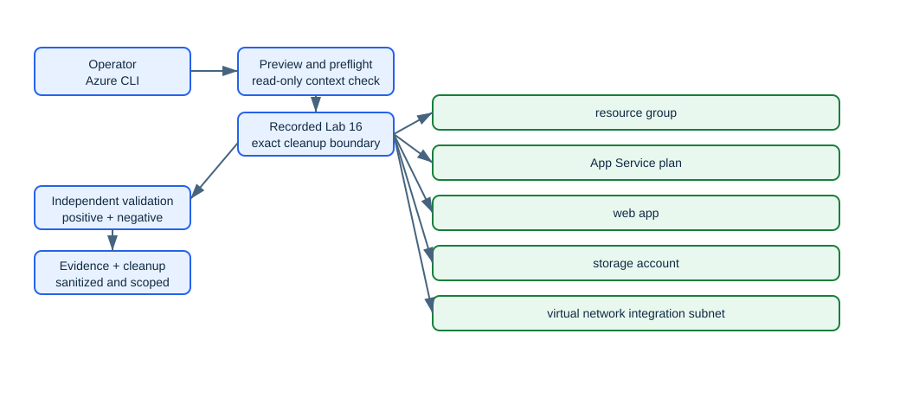

# Lab 16: Configure App Service TLS, DNS, backup, and networking

> Status: **offline-authored and contract-tested; live Azure verification is pending.**

Create a web app, storage-backed backup target, and VNet integration subnet; inspect TLS settings, then map an owned DNS name and bind a certificate only when external DNS and certificate prerequisites are supplied.

This folder is self-contained. It does not depend on another lab's runtime state. Use a disposable environment, keep the generated run manifest, and never substitute a production scope for a missing lab prerequisite.

## Learning objectives

| ID | Microsoft AZ-104 objective |
|---|---|
| `CP-APP-04` | Configure certificates and Transport Layer Security (TLS) for an App Service |
| `CP-APP-05` | Map an existing custom DNS name to an App Service |
| `CP-APP-06` | Configure backup for an App Service |
| `CP-APP-07` | Configure networking settings for an App Service |
| `NW-DNSLB-01` | Configure Azure DNS |

Blueprint source: [Microsoft AZ-104 study guide](https://learn.microsoft.com/en-us/credentials/certifications/resources/study-guides/az-104), effective 2026-04-17.

## Architecture



The editable Mermaid source is [diagrams/architecture.mmd](diagrams/architecture.mmd). The diagram describes the learning boundary, not a production reference architecture.

## Scenario and outcome

You are the Azure administrator for a training environment. Your task is to implement the smallest isolated configuration that demonstrates the mapped exam objectives, validate it independently, capture sanitized evidence, and remove only what this run recorded.

The key design idea is: **Custom hostnames prove DNS control, certificate bindings prove TLS identity, VNet integration governs outbound connectivity, and backups require protected storage access.**

## Time, cost, and permissions

| Item | Value |
|---|---|
| Estimated time | 150 minutes |
| Cost class | `moderate` |
| Command surface | Azure CLI |
| Required boundary | Website Contributor, Network Contributor, and Storage Account Contributor; control of the DNS zone and certificate for gated paths |
| External/live gate | Custom DNS and certificate steps require AZ104_CUSTOM_HOSTNAME plus an owned DNS zone and an authorized certificate; they remain gated otherwise. |

Cost is not a fixed promise. Check current pricing, free allowances, quotas, and regional availability before using `--execute` or `-Execute`. Labs marked moderate or elevated should be cleaned up in the same study session.

## Resources and dependencies

| # | Intended resource or object |
|---:|---|
| 1 | resource group |
| 2 | App Service plan |
| 3 | web app |
| 4 | storage account |
| 5 | virtual network integration subnet |
| 6 | optional custom hostname and TLS binding |

- Resource providers observed by preflight: `Microsoft.Network`, `Microsoft.Storage`, `Microsoft.Web`
- PowerShell modules used when applicable: No extra PowerShell modules
- Repository state: `.state/<run-id>/run.json` and `.state/<run-id>/validation.json`
- Secrets, access keys, SAS tokens, generated passwords, and shared keys must remain in memory and must not enter the manifest, command evidence, or Git history.

## Safety contract

1. Preflight is read-only. It does not sign in, register providers, or switch the active context.
2. Setup is preview-only unless the explicit execution switch is supplied.
3. State is written before the first cloud mutation and updated with exact returned IDs.
4. Validation reads live state independently; it does not repair a failed configuration.
5. Cleanup previews exact targets, verifies run ownership, then requires the explicit execution switch.
6. Tenant-wide, DNS, licensing, notification, failover, and policy gates are never guessed.

## Before you begin

- Use a disposable non-production tenant/subscription and verify the displayed tenant and subscription IDs.
- Install the declared command surface and supporting dependencies.
- Confirm the role boundary above at the smallest possible scope.
- Review provider registration and quota output; preflight reports requirements but does not register providers.
- Read the external gate. An unavailable gate is a documented `skipped` checkpoint, not a pass.
- Choose a unique run ID matching `^[a-z0-9-]+$`, such as `az104l16-01`.

## Run the lab

Run these commands from this lab folder. The examples intentionally use placeholders rather than silently reading an arbitrary subscription.

### 1. Preview

```sh
./scripts/cli/setup.sh --subscription-id <subscription-id> --location <region> --run-id az104l16-01
```

Review the context, names, tags, cost class, providers, and gated branches printed by the script.

### 2. Execute the approved baseline

```sh
./scripts/cli/setup.sh --subscription-id <subscription-id> --location <region> --run-id az104l16-01 --execute
```

The script records its run before creating resources. If a cloud operation fails partway through, keep the state directory and use validation plus cleanup against that exact run.

### 3. Complete and reason through the checkpoints

### Checkpoint 1: Create an App Service plan and web app with HTTPS-only and minimum TLS 1

Create an App Service plan and web app with HTTPS-only and minimum TLS 1.2.

Evidence to retain:

- The command output or exact resource/object ID for checkpoint 1.
- A positive assertion proving the intended state.
- A negative assertion showing that broader or anonymous access was not introduced.
- Any asynchronous operation state, timestamp, and final result.

### Checkpoint 2: Create a delegated integration subnet and configure regional VNet integration

Create a delegated integration subnet and configure regional VNet integration.

Evidence to retain:

- The command output or exact resource/object ID for checkpoint 2.
- A positive assertion proving the intended state.
- A negative assertion showing that broader or anonymous access was not introduced.
- Any asynchronous operation state, timestamp, and final result.

### Checkpoint 3: Create a private backup container and configure an App Service backup schedule without exposing its SAS

Create a private backup container and configure an App Service backup schedule without exposing its SAS.

Evidence to retain:

- The command output or exact resource/object ID for checkpoint 3.
- A positive assertion proving the intended state.
- A negative assertion showing that broader or anonymous access was not introduced.
- Any asynchronous operation state, timestamp, and final result.

### Checkpoint 4: Validate the DNS TXT/CNAME records and bind AZ104_CUSTOM_HOSTNAME and AZ104_CERTIFICATE_PATH only when supplied

Validate the DNS TXT/CNAME records and bind AZ104_CUSTOM_HOSTNAME and AZ104_CERTIFICATE_PATH only when supplied.

Evidence to retain:

- The command output or exact resource/object ID for checkpoint 4.
- A positive assertion proving the intended state.
- A negative assertion showing that broader or anonymous access was not introduced.
- Any asynchronous operation state, timestamp, and final result.

### 4. Validate independently

```sh
./scripts/cli/validate.sh --subscription-id <subscription-id> --run-id az104l16-01
```

Inspect `.state/az104l16-01/validation.json`. A `pass` applies only to checks that could be executed. A gated or asynchronous path must remain `warning` or `skipped` until its evidence exists.

Positive checks should prove the intended resources, configuration, relationships, or health. Negative checks should prove that anonymous access, excess scope, accidental inheritance, unresolved DNS, unhealthy probes, or unrecorded resources were not introduced where the scenario forbids them.

## Portal evidence

Portal screenshots are planned evidence captured only during an authorized live run. Until then every entry in [images/portal/manifest.yml](images/portal/manifest.yml) stays `pending`, and no placeholder image is committed. Capture and sanitization rules live in [images/README.md](images/README.md).

| Planned file | Checkpoint | Portal blade | Evidence |
|---|---:|---|---|
| `01-configuration-general-settings.png` | 1 | App Service > Configuration > General settings | HTTPS-only and minimum inbound TLS |
| `02-app-service-networking.png` | 2 | App Service > Networking | Regional VNet integration |
| `03-app-service-backups.png` | 3 | App Service > Backups | Backup destination and schedule with secrets hidden |
| `04-app-service-custom-domains.png` | 4 | App Service > Custom domains | Validated custom hostname and TLS binding when gated inputs exist |

## Break/fix exercise

1. Pick one reversible configuration created inside the recorded lab boundary.
2. Record the exact ID and current value.
3. Introduce one bounded mismatch; do not weaken a tenant-wide or production control.
4. Run validation and connect the failed check to an exact CLI/PowerShell query and the machine-readable validation result.
5. Repair only the identified setting, rerun validation, and compare the evidence.

The [solution notes](solution/README.md) provide a diagnostic sequence without hiding the reasoning behind an opaque repair script.

## Cleanup

Preview cleanup first:

```sh
./scripts/cli/cleanup.sh --subscription-id <subscription-id> --run-id az104l16-01
```

After verifying every printed target belongs to this run:

```sh
./scripts/cli/cleanup.sh --subscription-id <subscription-id> --run-id az104l16-01 --execute
```

Run validation again after deletion. Some services use soft delete, retained recovery points, asynchronous deletion, or external DNS/tenant state; the cleanup report must distinguish active cleanup from retention and must list residual items instead of claiming success prematurely.

## Exam practice

- Complete [assessment/QUESTIONS.md](assessment/QUESTIONS.md) without opening the answer key.
- Review [assessment/ANSWERS.md](assessment/ANSWERS.md) and trace each explanation to its Microsoft Learn source.
- Revisit every mapped objective whose answer you could not justify from the resource state.

## Microsoft Learn sources

- [https://learn.microsoft.com/en-us/azure/app-service/configure-ssl-bindings](https://learn.microsoft.com/en-us/azure/app-service/configure-ssl-bindings)
- [https://learn.microsoft.com/en-us/azure/app-service/app-service-web-tutorial-custom-domain](https://learn.microsoft.com/en-us/azure/app-service/app-service-web-tutorial-custom-domain)
- [https://learn.microsoft.com/en-us/azure/app-service/manage-backup](https://learn.microsoft.com/en-us/azure/app-service/manage-backup)
- [https://learn.microsoft.com/en-us/azure/app-service/overview-vnet-integration](https://learn.microsoft.com/en-us/azure/app-service/overview-vnet-integration)

Last curriculum/source review: 2026-08-30. Azure interfaces and command modules evolve; confirm current syntax in the linked primary documentation before a live run.
