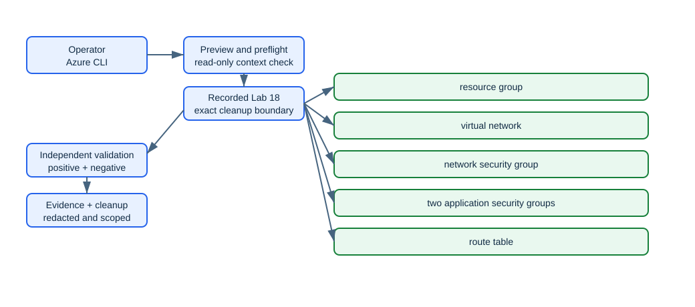

# Lab 18: Control traffic with routes, NSGs, ASGs, and effective rules

> Status: **offline-authored and contract-tested; live Azure verification is pending.**

Create an application network, NSG, application security groups, route table, and test NICs; apply narrowly scoped rules, inspect effective routes and security rules, and diagnose a deliberately blocked flow.

This folder is self-contained. It does not depend on another lab's runtime state. Use a disposable environment, keep the generated run manifest, and never substitute a production scope for a missing lab prerequisite.

## Learning objectives

| ID | Microsoft AZ-104 objective |
|---|---|
| `NW-VNET-04` | Configure user-defined routes |
| `NW-VNET-05` | Troubleshoot network connectivity |
| `NW-SECURE-01` | Create and configure network security groups (NSGs) and application security groups |
| `NW-SECURE-02` | Evaluate effective security rules in NSGs |

Blueprint source: [Microsoft AZ-104 study guide](https://learn.microsoft.com/en-us/credentials/certifications/resources/study-guides/az-104), effective 2026-04-17.

## Architecture



The editable Mermaid source is [diagrams/architecture.mmd](diagrams/architecture.mmd). The diagram describes the learning boundary, not a production reference architecture.

## Scenario and outcome

You are the Azure administrator for a training environment. Your task is to implement the smallest isolated configuration that demonstrates the mapped exam objectives, validate it independently, retain redacted command evidence, and remove only what this run recorded.

The key design idea is: **NSG evaluation uses priority and direction, ASGs replace hard-coded IP membership, and route selection uses longest-prefix matching before connectivity diagnostics explain the result.**

## Time, cost, and permissions

| Item | Value |
|---|---|
| Estimated time | 120 minutes |
| Cost class | `low` |
| Command surface | Azure CLI |
| Required boundary | Network Contributor on the lab resource group |
| External/live gate | None beyond the declared role and a disposable subscription. |

Cost is not a fixed promise. Check current pricing, free allowances, quotas, and regional availability before using `--execute` or `-Execute`. Labs marked moderate or elevated should be cleaned up in the same study session.

## Resources and dependencies

| # | Intended resource or object |
|---:|---|
| 1 | resource group |
| 2 | virtual network |
| 3 | network security group |
| 4 | two application security groups |
| 5 | route table |
| 6 | test network interfaces |

- Resource providers observed by preflight: `Microsoft.Network`
- PowerShell modules used when applicable: No extra PowerShell modules
- Repository state: `.state/<run-id>/run.json` and `.state/<run-id>/validation.json`
- Secrets, access keys, SAS tokens, generated passwords, and shared keys must remain in memory and must not enter the manifest, command evidence, or Git history.

## Safety contract

1. Preflight is read-only. It does not sign in, register providers, or switch the active context.
2. Setup is preview-only unless the explicit execution switch is supplied.
3. State is written before the first cloud mutation and updated with exact returned IDs.
4. Validation reads live state independently; it does not repair a failed configuration.
5. Cleanup previews exact targets, verifies run ownership, then requires the explicit execution switch.
6. Tenant-wide, DNS, licensing, notification, failover, and policy gates are never guessed.

## Before you begin

- Use a disposable non-production tenant/subscription and verify the displayed tenant and subscription IDs.
- Install the declared command surface and supporting dependencies.
- Confirm the role boundary above at the smallest possible scope.
- Review provider registration and quota output; preflight reports requirements but does not register providers.
- Read the external gate. An unavailable gate is a documented `skipped` checkpoint, not a pass.
- Choose a unique run ID matching `^[a-z0-9-]+$`, such as `az104l18-01`.

<!-- BEGIN GENERATED INLINE COMMANDS -->
## Complete inline command implementation

The lifecycle commands below are the complete learner-facing implementation. They are embedded from the retained script files so the README and automation cannot drift. Review each stage here before running it. Use a different run ID if you later try the optional scripted lane against the same sandbox.

### Preflight: `scripts/cli/preflight.sh`

```bash
#!/usr/bin/env bash
set -euo pipefail

SUBSCRIPTION_ID="${AZURE_SUBSCRIPTION_ID:-}"
LOCATION="${AZURE_LOCATION:-}"

while [[ $# -gt 0 ]]; do
  case "$1" in
    --subscription-id) SUBSCRIPTION_ID="$2"; shift 2 ;;
    --location) LOCATION="$2"; shift 2 ;;
    *) echo "Unknown argument: $1" >&2; exit 2 ;;
  esac
done

[[ -n "$SUBSCRIPTION_ID" ]] || { echo "Supply --subscription-id or AZURE_SUBSCRIPTION_ID." >&2; exit 2; }
[[ -n "$LOCATION" ]] || { echo "Supply --location or AZURE_LOCATION." >&2; exit 2; }

require_tool() { command -v "$1" >/dev/null 2>&1 || { echo "Missing required tool: $1" >&2; exit 3; }; }
require_tool az
require_tool jq


ACCOUNT_JSON="$(az account show --output json)"
ACTIVE_SUBSCRIPTION="$(jq -r '.id' <<<"$ACCOUNT_JSON")"
ACTIVE_TENANT="$(jq -r '.tenantId' <<<"$ACCOUNT_JSON")"
[[ "$ACTIVE_SUBSCRIPTION" == "$SUBSCRIPTION_ID" ]] || {
  echo "Context mismatch: active subscription is $ACTIVE_SUBSCRIPTION, expected $SUBSCRIPTION_ID." >&2
  echo "Select the intended context yourself; this script will not change it." >&2
  exit 4
}

echo "Lab: LAB-18"
echo "Tenant: $ACTIVE_TENANT"
echo "Subscription: $ACTIVE_SUBSCRIPTION"
echo "Location: $LOCATION"
echo "Cost class: low"
echo "Role boundary: Network Contributor on the lab resource group"

for provider in Microsoft.Network; do
  state="$(az provider show --namespace "$provider" --query registrationState --output tsv 2>/dev/null || true)"
  printf 'Provider %-38s %s
' "$provider" "${state:-Unavailable}"
done

echo "Preflight is read-only. Register missing providers only after an explicit scope and cost review."
```

### Setup: `scripts/cli/setup.sh`

```bash
#!/usr/bin/env bash
set -euo pipefail

LAB_ROOT="$(cd "$(dirname "${BASH_SOURCE[0]}")/../.." && pwd)"
SUBSCRIPTION_ID="${AZURE_SUBSCRIPTION_ID:-}"
LOCATION="${AZURE_LOCATION:-}"
SECONDARY_LOCATION="${AZURE_SECONDARY_LOCATION:-}"
RUN_ID=""
EXECUTE=false

while [[ $# -gt 0 ]]; do
  case "$1" in
    --subscription-id) SUBSCRIPTION_ID="$2"; shift 2 ;;
    --location) LOCATION="$2"; shift 2 ;;
    --secondary-location) SECONDARY_LOCATION="$2"; shift 2 ;;
    --run-id) RUN_ID="$2"; shift 2 ;;
    --execute) EXECUTE=true; shift ;;
    *) echo "Unknown argument: $1" >&2; exit 2 ;;
  esac
done

[[ -n "$SUBSCRIPTION_ID" && -n "$LOCATION" && -n "$RUN_ID" ]] || {
  echo "Usage: $0 --subscription-id ID --location REGION --run-id RUN [--secondary-location REGION] [--execute]" >&2
  exit 2
}
[[ "$RUN_ID" =~ ^[a-z0-9-]+$ ]] || { echo "Run ID must match ^[a-z0-9-]+$." >&2; exit 2; }

RG="rg-az104-l18-${RUN_ID}"
SUFFIX="$(printf '%s' "$RUN_ID" | tr -cd 'a-z0-9' | tail -c 12)"
STATE_DIR="$LAB_ROOT/.state/$RUN_ID"
MANIFEST="$STATE_DIR/run.json"
EXPIRES_ON="$(date -u -d '+1 day' +%F 2>/dev/null || date -u +%F)"

echo "LAB-18 plan"
echo "  subscription: $SUBSCRIPTION_ID"
echo "  location: $LOCATION"
echo "  resource group: $RG"
echo "  cost class: low"
echo "  external gate: None beyond the declared role and a disposable subscription."
echo "  resources: resource group, virtual network, network security group, two application security groups, route table, test network interfaces"

if [[ "$EXECUTE" != true ]]; then
  echo "Preview only. Re-run with --execute after approving context, permissions, cost, and gates."
  exit 0
fi

"$LAB_ROOT/scripts/cli/preflight.sh" --subscription-id "$SUBSCRIPTION_ID" --location "$LOCATION"
[[ ! -e "$MANIFEST" ]] || { echo "State already exists at $MANIFEST; choose a new run ID." >&2; exit 5; }
mkdir -p "$STATE_DIR"
TENANT_ID="$(az account show --query tenantId --output tsv)"
jq -n   --arg labId "LAB-18" --arg runId "$RUN_ID" --arg tenantId "$TENANT_ID"   --arg subscriptionId "$SUBSCRIPTION_ID" --arg location "$LOCATION" --arg rgName "$RG"   --arg createdAt "$(date -u +%Y-%m-%dT%H:%M:%SZ)"   '{labId:$labId,runId:$runId,tenantId:$tenantId,subscriptionId:$subscriptionId,location:$location,createdAt:$createdAt,status:"recorded-before-mutation",resourceGroup:{name:$rgName,id:null},resources:[],external:{}}' >"$MANIFEST"

az group create --subscription "$SUBSCRIPTION_ID" --name "$RG" --location "$LOCATION"   --tags purpose=az104-lab labId=18 runId="$RUN_ID" expiresOn="$EXPIRES_ON" --output none
RG_ID="$(az group show --subscription "$SUBSCRIPTION_ID" --name "$RG" --query id --output tsv)"
jq --arg id "$RG_ID" '.resourceGroup.id=$id | .status="baseline-created"' "$MANIFEST" >"$MANIFEST.tmp"
mv -f "$MANIFEST.tmp" "$MANIFEST"

VNET="vnet-${SUFFIX}"
NSG="nsg-${SUFFIX}"
ASG_FRONT="asg-front-${SUFFIX}"
ASG_BACK="asg-back-${SUFFIX}"
ROUTE="rt-${SUFFIX}"
az network vnet create --resource-group "$RG" --name "$VNET" --address-prefixes 10.18.0.0/16 --subnet-name app --subnet-prefixes 10.18.1.0/24 --output none
az network nsg create --resource-group "$RG" --name "$NSG" --output none
az network asg create --resource-group "$RG" --name "$ASG_FRONT" --location "$LOCATION" --output none
az network asg create --resource-group "$RG" --name "$ASG_BACK" --location "$LOCATION" --output none
az network nsg rule create --resource-group "$RG" --nsg-name "$NSG" --name AllowFrontendToBackend443 --priority 200 --direction Inbound --access Allow --protocol Tcp --source-asgs "$ASG_FRONT" --destination-asgs "$ASG_BACK" --destination-port-ranges 443 --output none
az network route-table create --resource-group "$RG" --name "$ROUTE" --location "$LOCATION" --output none
az network route-table route create --resource-group "$RG" --route-table-name "$ROUTE" --name DefaultToInternet --address-prefix 0.0.0.0/0 --next-hop-type Internet --output none
az network vnet subnet update --resource-group "$RG" --vnet-name "$VNET" --name app --network-security-group "$NSG" --route-table "$ROUTE" --output none

az resource list --subscription "$SUBSCRIPTION_ID" --resource-group "$RG" --output json >"$STATE_DIR/resources.json"
jq --slurpfile resources "$STATE_DIR/resources.json" '.resources=($resources[0] | map({id,name,type,location})) | .status="setup-complete"' "$MANIFEST" >"$MANIFEST.tmp"
mv -f "$MANIFEST.tmp" "$MANIFEST"
echo "Setup complete. State: $MANIFEST"
echo "Run scripts/cli/validate.sh before recording command evidence."
```

### Validate: `scripts/cli/validate.sh`

```bash
#!/usr/bin/env bash
set -euo pipefail

LAB_ROOT="$(cd "$(dirname "${BASH_SOURCE[0]}")/../.." && pwd)"
SUBSCRIPTION_ID="${AZURE_SUBSCRIPTION_ID:-}"
RUN_ID=""
while [[ $# -gt 0 ]]; do
  case "$1" in
    --subscription-id) SUBSCRIPTION_ID="$2"; shift 2 ;;
    --run-id) RUN_ID="$2"; shift 2 ;;
    *) echo "Unknown argument: $1" >&2; exit 2 ;;
  esac
done
[[ -n "$SUBSCRIPTION_ID" && -n "$RUN_ID" ]] || { echo "Supply --subscription-id and --run-id." >&2; exit 2; }

STATE_DIR="$LAB_ROOT/.state/$RUN_ID"
MANIFEST="$STATE_DIR/run.json"
REPORT="$STATE_DIR/validation.json"
[[ -f "$MANIFEST" ]] || { echo "Missing state: $MANIFEST" >&2; exit 5; }
ACTIVE_SUB="$(az account show --query id --output tsv)"
[[ "$ACTIVE_SUB" == "$SUBSCRIPTION_ID" ]] || { echo "Active subscription does not match the requested subscription." >&2; exit 4; }
RECORDED_SUB="$(jq -r '.subscriptionId' "$MANIFEST")"
[[ "$RECORDED_SUB" == "$SUBSCRIPTION_ID" ]] || { echo "Recorded subscription mismatch." >&2; exit 4; }
RG="$(jq -r '.resourceGroup.name' "$MANIFEST")"
RG_ID="$(jq -r '.resourceGroup.id' "$MANIFEST")"

checks='[]'
add_check() {
  checks="$(jq -c --arg id "$1" --arg status "$2" --arg message "$3" '. + [{id:$id,status:$status,message:$message}]' <<<"$checks")"
}

actual_rg_id="$(az group show --subscription "$SUBSCRIPTION_ID" --name "$RG" --query id --output tsv 2>/dev/null || true)"
if [[ -z "$actual_rg_id" ]]; then
  add_check context.resource-group fail "The recorded resource group is absent."
elif [[ "${actual_rg_id,,}" != "${RG_ID,,}" ]]; then
  add_check context.resource-group fail "The resource-group ID does not match the run manifest."
else
  add_check context.resource-group pass "The exact recorded resource group exists."
fi

purpose="$(az group show --name "$RG" --query tags.purpose --output tsv 2>/dev/null || true)"
lab_id="$(az group show --name "$RG" --query tags.labId --output tsv 2>/dev/null || true)"
run_id="$(az group show --name "$RG" --query tags.runId --output tsv 2>/dev/null || true)"
if [[ "$purpose" == "az104-lab" && "$lab_id" == "18" && "$run_id" == "$RUN_ID" ]]; then
  add_check ownership.tags pass "purpose, labId, and runId tags match the manifest."
else
  add_check ownership.tags fail "Ownership tags do not match; cleanup must not proceed."
fi

resources="$(az resource list --subscription "$SUBSCRIPTION_ID" --resource-group "$RG" --output json 2>/dev/null || echo '[]')"
EXPECTED_TYPES=(
  "Microsoft.Network/networkSecurityGroups"
  "Microsoft.Network/applicationSecurityGroups"
  "Microsoft.Network/routeTables"
  "Microsoft.Network/virtualNetworks"
)
if [[ "${#EXPECTED_TYPES[@]}" -eq 0 ]]; then
  add_check resources.baseline warning "This lab validates external or tenant-scoped state separately."
else
  for expected in "${EXPECTED_TYPES[@]}"; do
    count="$(jq --arg expected "${expected,,}" '[.[] | select((.type | ascii_downcase) == $expected)] | length' <<<"$resources")"
    if [[ "$count" -gt 0 ]]; then
      add_check "resource.$(tr '/.' '--' <<<"$expected")" pass "Found $count resource(s) of type $expected."
    else
      add_check "resource.$(tr '/.' '--' <<<"$expected")" warning "No top-level resource of type $expected was returned; inspect nested or gated checkpoint state."
    fi
  done
fi

failures="$(jq '[.[] | select(.status == "fail")] | length' <<<"$checks")"
warnings="$(jq '[.[] | select(.status == "warning" or .status == "skipped")] | length' <<<"$checks")"
result=pass
[[ "$warnings" -eq 0 ]] || result=partial
[[ "$failures" -eq 0 ]] || result=fail
jq -n --arg labId "LAB-18" --arg runId "$RUN_ID" --arg generatedAt "$(date -u +%Y-%m-%dT%H:%M:%SZ)" --arg result "$result" --argjson checks "$checks"   '{labId:$labId,runId:$runId,generatedAt:$generatedAt,result:$result,checks:$checks}' >"$REPORT"
cat "$REPORT"
[[ "$result" != fail ]]
```

### Cleanup: `scripts/cli/cleanup.sh`

```bash
#!/usr/bin/env bash
set -euo pipefail

LAB_ROOT="$(cd "$(dirname "${BASH_SOURCE[0]}")/../.." && pwd)"
SUBSCRIPTION_ID="${AZURE_SUBSCRIPTION_ID:-}"
RUN_ID=""
EXECUTE=false
while [[ $# -gt 0 ]]; do
  case "$1" in
    --subscription-id) SUBSCRIPTION_ID="$2"; shift 2 ;;
    --run-id) RUN_ID="$2"; shift 2 ;;
    --execute) EXECUTE=true; shift ;;
    *) echo "Unknown argument: $1" >&2; exit 2 ;;
  esac
done
[[ -n "$SUBSCRIPTION_ID" && -n "$RUN_ID" ]] || { echo "Supply --subscription-id and --run-id." >&2; exit 2; }

MANIFEST="$LAB_ROOT/.state/$RUN_ID/run.json"
[[ -f "$MANIFEST" ]] || { echo "Missing state: $MANIFEST" >&2; exit 5; }
[[ "$(az account show --query id --output tsv)" == "$SUBSCRIPTION_ID" ]] || { echo "Active subscription mismatch." >&2; exit 4; }
[[ "$(jq -r '.subscriptionId' "$MANIFEST")" == "$SUBSCRIPTION_ID" ]] || { echo "Recorded subscription mismatch." >&2; exit 4; }
RG="$(jq -r '.resourceGroup.name' "$MANIFEST")"
RG_ID="$(jq -r '.resourceGroup.id' "$MANIFEST")"
echo "Cleanup preview for LAB-18:"
echo "  exact resource group ID: $RG_ID"
echo "  recorded child resources: $(jq '.resources | length' "$MANIFEST")"
echo "  residual/soft-delete behavior must be audited after deletion."
if [[ "$EXECUTE" != true ]]; then
  echo "Preview only. Re-run with --execute after checking every target."
  exit 0
fi

actual="$(az group show --name "$RG" --query id --output tsv 2>/dev/null || true)"
if [[ -z "$actual" ]]; then echo "Resource group is already absent; cleanup is idempotent."; exit 0; fi
purpose="$(az group show --name "$RG" --query tags.purpose --output tsv)"
lab_id="$(az group show --name "$RG" --query tags.labId --output tsv)"
run_id="$(az group show --name "$RG" --query tags.runId --output tsv)"
[[ "${actual,,}" == "${RG_ID,,}" && "$purpose" == az104-lab && "$lab_id" == 18 && "$run_id" == "$RUN_ID" ]] || {
  echo "ID or ownership-tag verification failed; refusing cleanup." >&2; exit 6;
}

az group delete --ids "$RG_ID" --yes --output none

if az group exists --name "$RG" | grep -qi true; then
  echo "Resource group still exists; deletion may be asynchronous or blocked." >&2
  exit 7
fi
jq '.status="cleanup-complete"' "$MANIFEST" >"$MANIFEST.tmp" && mv -f "$MANIFEST.tmp" "$MANIFEST"
echo "Active resource-group cleanup complete. Audit soft-deleted or externally retained items separately."
```

<!-- END GENERATED INLINE COMMANDS -->
## Run the lab

The complete learner-facing implementations are embedded above. The commands in this section are optional shortcuts that run the identical retained script files. Run them from this lab folder. The examples intentionally use placeholders rather than silently reading an arbitrary subscription.

### 1. Preview

```sh
./scripts/cli/setup.sh --subscription-id <subscription-id> --location <region> --run-id az104l18-01
```

Review the context, names, tags, cost class, providers, and gated branches printed by the script.

### 2. Execute the approved baseline

```sh
./scripts/cli/setup.sh --subscription-id <subscription-id> --location <region> --run-id az104l18-01 --execute
```

The script records its run before creating resources. If a cloud operation fails partway through, keep the state directory and use validation plus cleanup against that exact run.

### 3. Complete and reason through the checkpoints

### Checkpoint 1: Create frontend and backend ASGs and associate test NIC configurations

Create frontend and backend ASGs and associate test NIC configurations.

Evidence to retain:

- The command output or exact resource/object ID for checkpoint 1.
- A positive assertion proving the intended state.
- A negative assertion showing that broader or anonymous access was not introduced.
- Any asynchronous operation state, timestamp, and final result.

### Checkpoint 2: Create ordered NSG rules that allow only the intended application flow and preserve default deny behavior

Create ordered NSG rules that allow only the intended application flow and preserve default deny behavior.

Evidence to retain:

- The command output or exact resource/object ID for checkpoint 2.
- A positive assertion proving the intended state.
- A negative assertion showing that broader or anonymous access was not introduced.
- Any asynchronous operation state, timestamp, and final result.

### Checkpoint 3: Associate a route table containing a documented user-defined route with the application subnet

Associate a route table containing a documented user-defined route with the application subnet.

Evidence to retain:

- The command output or exact resource/object ID for checkpoint 3.
- A positive assertion proving the intended state.
- A negative assertion showing that broader or anonymous access was not introduced.
- Any asynchronous operation state, timestamp, and final result.

### Checkpoint 4: Use effective NSG and route queries plus Network Watcher diagnostics to explain a blocked connection

Use effective NSG and route queries plus Network Watcher diagnostics to explain a blocked connection.

Evidence to retain:

- The command output or exact resource/object ID for checkpoint 4.
- A positive assertion proving the intended state.
- A negative assertion showing that broader or anonymous access was not introduced.
- Any asynchronous operation state, timestamp, and final result.

### 4. Validate independently

```sh
./scripts/cli/validate.sh --subscription-id <subscription-id> --run-id az104l18-01
```

Inspect `.state/az104l18-01/validation.json`. A `pass` applies only to checks that could be executed. A gated or asynchronous path must remain `warning` or `skipped` until its evidence exists.

Positive checks should prove the intended resources, configuration, relationships, or health. Negative checks should prove that anonymous access, excess scope, accidental inheritance, unresolved DNS, unhealthy probes, or unrecorded resources were not introduced where the scenario forbids them.

## Break/fix exercise

1. Pick one reversible configuration created inside the recorded lab boundary.
2. Record the exact ID and current value.
3. Introduce one bounded mismatch; do not weaken a tenant-wide or production control.
4. Run validation and connect the failed check to an exact CLI/PowerShell query and the machine-readable validation result.
5. Repair only the identified setting, rerun validation, and compare the evidence.

The [solution notes](solution/README.md) provide a diagnostic sequence without hiding the reasoning behind an opaque repair script.

## Cleanup

Preview cleanup first:

```sh
./scripts/cli/cleanup.sh --subscription-id <subscription-id> --run-id az104l18-01
```

After verifying every printed target belongs to this run:

```sh
./scripts/cli/cleanup.sh --subscription-id <subscription-id> --run-id az104l18-01 --execute
```

Run validation again after deletion. Some services use soft delete, retained recovery points, asynchronous deletion, or external DNS/tenant state; the cleanup report must distinguish active cleanup from retention and must list residual items instead of claiming success prematurely.

## Exam practice

- Complete [assessment/QUESTIONS.md](assessment/QUESTIONS.md) without opening the answer key.
- Review [assessment/ANSWERS.md](assessment/ANSWERS.md) and trace each explanation to its Microsoft Learn source.
- Revisit every mapped objective whose answer you could not justify from the resource state.

## Microsoft Learn sources

- [https://learn.microsoft.com/en-us/azure/virtual-network/manage-network-security-group](https://learn.microsoft.com/en-us/azure/virtual-network/manage-network-security-group)
- [https://learn.microsoft.com/en-us/azure/virtual-network/application-security-groups](https://learn.microsoft.com/en-us/azure/virtual-network/application-security-groups)
- [https://learn.microsoft.com/en-us/azure/virtual-network/manage-route-table](https://learn.microsoft.com/en-us/azure/virtual-network/manage-route-table)
- [https://learn.microsoft.com/en-us/azure/network-watcher/network-watcher-ip-flow-verify-overview](https://learn.microsoft.com/en-us/azure/network-watcher/network-watcher-ip-flow-verify-overview)

Last curriculum/source review: 2026-08-30. Azure interfaces and command modules evolve; confirm current syntax in the linked primary documentation before a live run.
