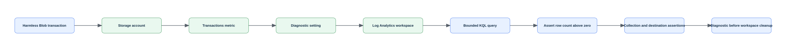

# Lab 22: Collect and analyze Azure Monitor metrics, logs, and Insights

> Status: **offline-authored and contract-tested; live Azure verification is pending.**

Create a Log Analytics workspace and storage account, send supported resource logs and metrics through diagnostic settings, query tables with KQL, inspect platform metrics, and review Insights onboarding requirements for VMs, storage, and networks.

This folder is self-contained. It does not depend on another lab's runtime state. Use a disposable environment, keep the generated run manifest, and never substitute a production scope for a missing lab prerequisite.

## Learning objectives

| ID | Microsoft AZ-104 objective |
|---|---|
| `MR-MONITOR-01` | Interpret metrics in Azure Monitor |
| `MR-MONITOR-02` | Configure log settings in Azure Monitor |
| `MR-MONITOR-03` | Query and analyze logs in Azure Monitor |
| `MR-MONITOR-05` | Configure and interpret monitoring of virtual machines, storage accounts, and networks by using Azure Monitor Insights |
| `MR-MONITOR-06` | Use Azure Network Watcher and Connection monitor |

Blueprint source: [Microsoft AZ-104 study guide](https://learn.microsoft.com/en-us/credentials/certifications/resources/study-guides/az-104), effective 2026-04-17.

## Architecture



The editable Mermaid source is [diagrams/architecture.mmd](diagrams/architecture.mmd). The diagram describes the learning boundary, not a production reference architecture.

## Scenario and outcome

You are the Azure administrator for a training environment. Your task is to implement the smallest isolated configuration that demonstrates the mapped exam objectives, validate it independently, capture sanitized evidence, and remove only what this run recorded.

The key design idea is: **Metrics are numeric time series, logs are queryable records with ingestion delay and cost, and Insights packages add curated collection and interpretation for particular resource types.**

## Time, cost, and permissions

| Item | Value |
|---|---|
| Estimated time | 135 minutes |
| Cost class | `moderate` |
| Command surface | Azure CLI and KQL |
| Required boundary | Monitoring Contributor and Log Analytics Contributor on the lab resource group |
| External/live gate | None beyond the declared role and a disposable subscription. |

Cost is not a fixed promise. Check current pricing, free allowances, quotas, and regional availability before using `--execute` or `-Execute`. Labs marked moderate or elevated should be cleaned up in the same study session.

## Resources and dependencies

| # | Intended resource or object |
|---:|---|
| 1 | resource group |
| 2 | Log Analytics workspace |
| 3 | storage account |
| 4 | diagnostic setting |
| 5 | optional data collection rule |

- Resource providers observed by preflight: `Microsoft.Insights`, `Microsoft.OperationalInsights`, `Microsoft.Storage`
- PowerShell modules used when applicable: No extra PowerShell modules
- Repository state: `.state/<run-id>/run.json` and `.state/<run-id>/validation.json`
- Secrets, access keys, SAS tokens, generated passwords, and shared keys must remain in memory and must not enter the manifest, command evidence, or Git history.

## Safety contract

1. Preflight is read-only. It does not sign in, register providers, or switch the active context.
2. Setup is preview-only unless the explicit execution switch is supplied.
3. State is written before the first cloud mutation and updated with exact returned IDs.
4. Validation reads live state independently; it does not repair a failed configuration.
5. Cleanup previews exact targets, verifies run ownership, then requires the explicit execution switch.
6. Tenant-wide, DNS, licensing, notification, failover, and policy gates are never guessed.

## Before you begin

- Use a disposable non-production tenant/subscription and verify the displayed tenant and subscription IDs.
- Install the declared command surface and supporting dependencies.
- Confirm the role boundary above at the smallest possible scope.
- Review provider registration and quota output; preflight reports requirements but does not register providers.
- Read the external gate. An unavailable gate is a documented `skipped` checkpoint, not a pass.
- Choose a unique run ID matching `^[a-z0-9-]+$`, such as `az104l22-01`.

## Run the lab

Run these commands from this lab folder. The examples intentionally use placeholders rather than silently reading an arbitrary subscription.

### 1. Preview

```sh
./scripts/cli/setup.sh --subscription-id <subscription-id> --location <region> --run-id az104l22-01
```

Review the context, names, tags, cost class, providers, and gated branches printed by the script.

### 2. Execute the approved baseline

```sh
./scripts/cli/setup.sh --subscription-id <subscription-id> --location <region> --run-id az104l22-01 --execute
```

The script records its run before creating resources. If a cloud operation fails partway through, keep the state directory and use validation plus cleanup against that exact run.

### 3. Complete and reason through the checkpoints

### Checkpoint 1: Create a Log Analytics workspace with bounded retention and a monitored storage account

Create a Log Analytics workspace with bounded retention and a monitored storage account.

Evidence to retain:

- The command output or exact resource/object ID for checkpoint 1.
- A positive assertion proving the intended state.
- A negative assertion showing that broader or anonymous access was not introduced.
- Any asynchronous operation state, timestamp, and final result.

### Checkpoint 2: Discover diagnostic categories and create settings that send supported logs and metrics to the workspace

Discover diagnostic categories and create settings that send supported logs and metrics to the workspace.

Evidence to retain:

- The command output or exact resource/object ID for checkpoint 2.
- A positive assertion proving the intended state.
- A negative assertion showing that broader or anonymous access was not introduced.
- Any asynchronous operation state, timestamp, and final result.

### Checkpoint 3: Run KQL queries that summarize activity by operation, result, and time range without assuming immediate ingestion

Run KQL queries that summarize activity by operation, result, and time range without assuming immediate ingestion.

Evidence to retain:

- The command output or exact resource/object ID for checkpoint 3.
- A positive assertion proving the intended state.
- A negative assertion showing that broader or anonymous access was not introduced.
- Any asynchronous operation state, timestamp, and final result.

### Checkpoint 4: Query platform metrics and compare baseline monitoring with VM, Storage, and Network Insights dependencies

Query platform metrics and compare baseline monitoring with VM, Storage, and Network Insights dependencies.

Evidence to retain:

- The command output or exact resource/object ID for checkpoint 4.
- A positive assertion proving the intended state.
- A negative assertion showing that broader or anonymous access was not introduced.
- Any asynchronous operation state, timestamp, and final result.

### 4. Validate independently

```sh
./scripts/cli/validate.sh --subscription-id <subscription-id> --run-id az104l22-01
```

Inspect `.state/az104l22-01/validation.json`. A `pass` applies only to checks that could be executed. A gated or asynchronous path must remain `warning` or `skipped` until its evidence exists.

Positive checks should prove the intended resources, configuration, relationships, or health. Negative checks should prove that anonymous access, excess scope, accidental inheritance, unresolved DNS, unhealthy probes, or unrecorded resources were not introduced where the scenario forbids them.

## Portal evidence

Portal screenshots are planned evidence captured only during an authorized live run. Until then every entry in [images/portal/manifest.yml](images/portal/manifest.yml) stays `pending`, and no placeholder image is committed. Capture and sanitization rules live in [images/README.md](images/README.md).

| Planned file | Checkpoint | Portal blade | Evidence |
|---|---:|---|---|
| `01-monitor-metrics.png` | 4 | Monitor > Metrics | Selected resource metric, aggregation, and time grain |
| `02-log-analytics-workspace-logs.png` | 3 | Log Analytics workspace > Logs | KQL query text and returned schema/results |
| `03-resource-diagnostic-settings.png` | 2 | Resource > Diagnostic settings | Destination workspace and enabled categories |
| `04-monitor-insights.png` | 4 | Monitor > Insights | Onboarding or interpreted health for VM, storage, and network |

## Break/fix exercise

1. Pick one reversible configuration created inside the recorded lab boundary.
2. Record the exact ID and current value.
3. Introduce one bounded mismatch; do not weaken a tenant-wide or production control.
4. Run validation and connect the failed check to an exact CLI/PowerShell query and the machine-readable validation result.
5. Repair only the identified setting, rerun validation, and compare the evidence.

The [solution notes](solution/README.md) provide a diagnostic sequence without hiding the reasoning behind an opaque repair script.

## Cleanup

Preview cleanup first:

```sh
./scripts/cli/cleanup.sh --subscription-id <subscription-id> --run-id az104l22-01
```

After verifying every printed target belongs to this run:

```sh
./scripts/cli/cleanup.sh --subscription-id <subscription-id> --run-id az104l22-01 --execute
```

Run validation again after deletion. Some services use soft delete, retained recovery points, asynchronous deletion, or external DNS/tenant state; the cleanup report must distinguish active cleanup from retention and must list residual items instead of claiming success prematurely.

## Exam practice

- Complete [assessment/QUESTIONS.md](assessment/QUESTIONS.md) without opening the answer key.
- Review [assessment/ANSWERS.md](assessment/ANSWERS.md) and trace each explanation to its Microsoft Learn source.
- Revisit every mapped objective whose answer you could not justify from the resource state.

## Microsoft Learn sources

- [https://learn.microsoft.com/en-us/azure/azure-monitor/metrics/metrics-getting-started](https://learn.microsoft.com/en-us/azure/azure-monitor/metrics/metrics-getting-started)
- [https://learn.microsoft.com/en-us/azure/azure-monitor/essentials/diagnostic-settings](https://learn.microsoft.com/en-us/azure/azure-monitor/essentials/diagnostic-settings)
- [https://learn.microsoft.com/en-us/azure/azure-monitor/logs/log-query-overview](https://learn.microsoft.com/en-us/azure/azure-monitor/logs/log-query-overview)
- [https://learn.microsoft.com/en-us/azure/azure-monitor/insights/insights-overview](https://learn.microsoft.com/en-us/azure/azure-monitor/insights/insights-overview)
- [https://learn.microsoft.com/en-us/azure/network-watcher/connection-monitor-overview](https://learn.microsoft.com/en-us/azure/network-watcher/connection-monitor-overview)

Last curriculum/source review: 2026-08-30. Azure interfaces and command modules evolve; confirm current syntax in the linked primary documentation before a live run.
