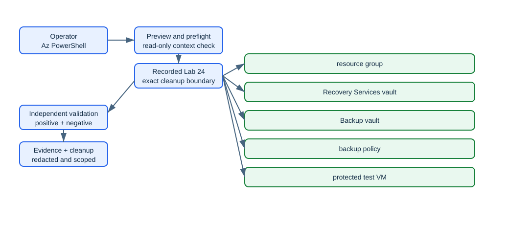

# Lab 24: Configure Azure Backup policies, protection, restore, reports, and alerts

> Status: **offline-authored and contract-tested; live Azure verification is pending.**

Create both Recovery Services and Backup vault resource types, define a VM backup policy, protect a small VM, trigger and monitor an on-demand backup, perform a file-level restore workflow, and configure monitoring evidence.

This folder is self-contained. It does not depend on another lab's runtime state. Use a disposable environment, keep the generated run manifest, and never substitute a production scope for a missing lab prerequisite.

## Learning objectives

| ID | Microsoft AZ-104 objective |
|---|---|
| `MR-RECOVERY-01` | Create a Recovery Services vault |
| `MR-RECOVERY-02` | Create an Azure Backup vault |
| `MR-RECOVERY-03` | Create and configure a backup policy |
| `MR-RECOVERY-04` | Perform backup and restore operations by using Azure Backup |
| `MR-RECOVERY-07` | Configure and interpret reports and alerts for backups |

Blueprint source: [Microsoft AZ-104 study guide](https://learn.microsoft.com/en-us/credentials/certifications/resources/study-guides/az-104), effective 2026-04-17.

## Architecture



The editable Mermaid source is [diagrams/architecture.mmd](diagrams/architecture.mmd). The diagram describes the learning boundary, not a production reference architecture.

## Scenario and outcome

You are the Azure administrator for a training environment. Your task is to implement the smallest isolated configuration that demonstrates the mapped exam objectives, validate it independently, capture sanitized evidence, and remove only what this run recorded.

The key design idea is: **Vault type must match the workload, protection creates retained recovery points, and vault deletion requires ordered removal of protected items, soft-delete state, and dependencies.**

## Time, cost, and permissions

| Item | Value |
|---|---|
| Estimated time | 150 minutes |
| Cost class | `moderate` |
| Command surface | Az PowerShell |
| Required boundary | Backup Contributor and Virtual Machine Contributor on the lab resource group |
| External/live gate | None beyond the declared role and a disposable subscription. |

Cost is not a fixed promise. Check current pricing, free allowances, quotas, and regional availability before using `--execute` or `-Execute`. Labs marked moderate or elevated should be cleaned up in the same study session.

## Resources and dependencies

| # | Intended resource or object |
|---:|---|
| 1 | resource group |
| 2 | Recovery Services vault |
| 3 | Backup vault |
| 4 | backup policy |
| 5 | protected test VM |
| 6 | backup instance and restore job |

- Resource providers observed by preflight: `Microsoft.Compute`, `Microsoft.DataProtection`, `Microsoft.RecoveryServices`
- PowerShell modules used when applicable: `Az.Accounts`, `Az.Resources`, `Az.RecoveryServices`, `Az.DataProtection`, `Az.Compute`, `Az.Network`
- Repository state: `.state/<run-id>/run.json` and `.state/<run-id>/validation.json`
- Secrets, access keys, SAS tokens, generated passwords, and shared keys must remain in memory and must not enter the manifest, command evidence, or Git history.

## Safety contract

1. Preflight is read-only. It does not sign in, register providers, or switch the active context.
2. Setup is preview-only unless the explicit execution switch is supplied.
3. State is written before the first cloud mutation and updated with exact returned IDs.
4. Validation reads live state independently; it does not repair a failed configuration.
5. Cleanup previews exact targets, verifies run ownership, then requires the explicit execution switch.
6. Tenant-wide, DNS, licensing, notification, failover, and policy gates are never guessed.

## Before you begin

- Use a disposable non-production tenant/subscription and verify the displayed tenant and subscription IDs.
- Install the declared command surface and supporting dependencies.
- Confirm the role boundary above at the smallest possible scope.
- Review provider registration and quota output; preflight reports requirements but does not register providers.
- Read the external gate. An unavailable gate is a documented `skipped` checkpoint, not a pass.
- Choose a unique run ID matching `^[a-z0-9-]+$`, such as `az104l24-01`.

## Run the lab

Run these commands from this lab folder. The examples intentionally use placeholders rather than silently reading an arbitrary subscription.

### 1. Preview

```ps1
pwsh ./scripts/powershell/Setup.ps1 -RunId az104l24-01 -SubscriptionId <subscription-id> -Location <region>
```

Review the context, names, tags, cost class, providers, and gated branches printed by the script.

### 2. Execute the approved baseline

```ps1
pwsh ./scripts/powershell/Setup.ps1 -RunId az104l24-01 -SubscriptionId <subscription-id> -Location <region> -Execute
```

The script records its run before creating resources. If a cloud operation fails partway through, keep the state directory and use validation plus cleanup against that exact run.

### 3. Complete and reason through the checkpoints

### Checkpoint 1: Create a Recovery Services vault and a separate modern Backup vault and compare their supported workloadsCreate a Recovery Services vault and a separate modern Backup vault and compare their supported workloads.Evidence to retain:- The command output or exact resource/object ID for checkpoint 1.- A positive assertion proving the intended state.- A negative assertion showing that broader or anonymous access was not introduced.- Any asynchronous operation state, timestamp, and final result.### Checkpoint 2: Create a bounded-retention VM backup policy and enable protection for the test VMCreate a bounded-retention VM backup policy and enable protection for the test VM.Evidence to retain:- The command output or exact resource/object ID for checkpoint 2.- A positive assertion proving the intended state.- A negative assertion showing that broader or anonymous access was not introduced.- Any asynchronous operation state, timestamp, and final result.### Checkpoint 3: Trigger an on-demand backup, monitor its asynchronous job, and preserve evidence before restore testingTrigger an on-demand backup, monitor its asynchronous job, and preserve evidence before restore testing.Evidence to retain:- The command output or exact resource/object ID for checkpoint 3.- A positive assertion proving the intended state.- A negative assertion showing that broader or anonymous access was not introduced.- Any asynchronous operation state, timestamp, and final result.### Checkpoint 4: Run a restore workflow, inspect Backup reports/alerts prerequisites, then stop protection and delete backup data before vault cleanupRun a restore workflow, inspect Backup reports/alerts prerequisites, then stop protection and delete backup data before vault cleanup.Evidence to retain:- The command output or exact resource/object ID for checkpoint 4.- A positive assertion proving the intended state.- A negative assertion showing that broader or anonymous access was not introduced.- Any asynchronous operation state, timestamp, and final result.
### 4. Validate independently

```ps1
pwsh ./scripts/powershell/Validate.ps1 -RunId az104l24-01 -SubscriptionId <subscription-id>
```

Inspect `.state/az104l24-01/validation.json`. A `pass` applies only to checks that could be executed. A gated or asynchronous path must remain `warning` or `skipped` until its evidence exists.

Positive checks should prove the intended resources, configuration, relationships, or health. Negative checks should prove that anonymous access, excess scope, accidental inheritance, unresolved DNS, unhealthy probes, or unrecorded resources were not introduced where the scenario forbids them.

## Break/fix exercise

1. Pick one reversible configuration created inside the recorded lab boundary.
2. Record the exact ID and current value.
3. Introduce one bounded mismatch; do not weaken a tenant-wide or production control.
4. Run validation and connect the failed check to an exact CLI/PowerShell query and the machine-readable validation result.
5. Repair only the identified setting, rerun validation, and compare the evidence.

The [solution notes](solution/README.md) provide a diagnostic sequence without hiding the reasoning behind an opaque repair script.

## Cleanup

Preview cleanup first:

```ps1
pwsh ./scripts/powershell/Cleanup.ps1 -RunId az104l24-01 -SubscriptionId <subscription-id>
```

After verifying every printed target belongs to this run:

```ps1
pwsh ./scripts/powershell/Cleanup.ps1 -RunId az104l24-01 -SubscriptionId <subscription-id> -Execute
```

Run validation again after deletion. Some services use soft delete, retained recovery points, asynchronous deletion, or external DNS/tenant state; the cleanup report must distinguish active cleanup from retention and must list residual items instead of claiming success prematurely.

## Exam practice

- Complete [assessment/QUESTIONS.md](assessment/QUESTIONS.md) without opening the answer key.
- Review [assessment/ANSWERS.md](assessment/ANSWERS.md) and trace each explanation to its Microsoft Learn source.
- Revisit every mapped objective whose answer you could not justify from the resource state.

## Microsoft Learn sources

- [https://learn.microsoft.com/en-us/azure/backup/backup-create-recovery-services-vault](https://learn.microsoft.com/en-us/azure/backup/backup-create-recovery-services-vault)
- [https://learn.microsoft.com/en-us/azure/backup/create-manage-backup-vault](https://learn.microsoft.com/en-us/azure/backup/create-manage-backup-vault)
- [https://learn.microsoft.com/en-us/azure/backup/quick-backup-vm-powershell](https://learn.microsoft.com/en-us/azure/backup/quick-backup-vm-powershell)
- [https://learn.microsoft.com/en-us/azure/backup/backup-azure-restore-files-from-vm](https://learn.microsoft.com/en-us/azure/backup/backup-azure-restore-files-from-vm)
- [https://learn.microsoft.com/en-us/azure/backup/configure-reports](https://learn.microsoft.com/en-us/azure/backup/configure-reports)
- [https://learn.microsoft.com/en-us/azure/backup/backup-azure-monitoring-built-in-monitor](https://learn.microsoft.com/en-us/azure/backup/backup-azure-monitoring-built-in-monitor)

Last curriculum/source review: 2026-08-30. Azure interfaces and command modules evolve; confirm current syntax in the linked primary documentation before a live run.
