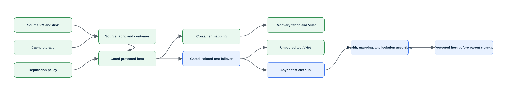

# Lab 25: Replicate and fail over an Azure VM with Site Recovery

> Status: **offline-authored and contract-tested; live Azure verification is pending.**

Create isolated source and recovery networks, a small source VM, and a Recovery Services vault; configure Azure-to-Azure replication, run an isolated test failover, clean it up, and document planned/unplanned failover and reprotection gates.

This folder is self-contained. It does not depend on another lab's runtime state. Use a disposable environment, keep the generated run manifest, and never substitute a production scope for a missing lab prerequisite.

## Learning objectives

| ID | Microsoft AZ-104 objective |
|---|---|
| `MR-RECOVERY-05` | Configure Azure Site Recovery for Azure resources |
| `MR-RECOVERY-06` | Perform a failover to a secondary region by using Site Recovery |

Blueprint source: [Microsoft AZ-104 study guide](https://learn.microsoft.com/en-us/credentials/certifications/resources/study-guides/az-104), effective 2026-04-17.

## Architecture



The editable Mermaid source is [diagrams/architecture.mmd](diagrams/architecture.mmd). The diagram describes the learning boundary, not a production reference architecture.

## Scenario and outcome

You are the Azure administrator for a training environment. Your task is to implement the smallest isolated configuration that demonstrates the mapped exam objectives, validate it independently, capture sanitized evidence, and remove only what this run recorded.

The key design idea is: **Test failover validates recovery without committing production direction, while planned/unplanned failover, commit, reprotect, and failback are separate state transitions with cost and data-loss implications.**

## Time, cost, and permissions

| Item | Value |
|---|---|
| Estimated time | 180 minutes |
| Cost class | `elevated` |
| Command surface | Az PowerShell |
| Required boundary | Site Recovery Contributor, Virtual Machine Contributor, and Network Contributor on both region scopes |
| External/live gate | This elevated lab requires two approved regions and explicit cost review before live execution; test failover must use an isolated network. |

Cost is not a fixed promise. Check current pricing, free allowances, quotas, and regional availability before using `--execute` or `-Execute`. Labs marked moderate or elevated should be cleaned up in the same study session.

## Resources and dependencies

| # | Intended resource or object |
|---:|---|
| 1 | resource group |
| 2 | source and recovery VNets |
| 3 | source VM |
| 4 | Recovery Services vault |
| 5 | ASR fabric/container mappings |
| 6 | replicated item |

- Resource providers observed by preflight: `Microsoft.Compute`, `Microsoft.Network`, `Microsoft.RecoveryServices`
- PowerShell modules used when applicable: `Az.Accounts`, `Az.Resources`, `Az.RecoveryServices`, `Az.Compute`, `Az.Network`
- Repository state: `.state/<run-id>/run.json` and `.state/<run-id>/validation.json`
- Secrets, access keys, SAS tokens, generated passwords, and shared keys must remain in memory and must not enter the manifest, command evidence, or Git history.

## Safety contract

1. Preflight is read-only. It does not sign in, register providers, or switch the active context.
2. Setup is preview-only unless the explicit execution switch is supplied.
3. State is written before the first cloud mutation and updated with exact returned IDs.
4. Validation reads live state independently; it does not repair a failed configuration.
5. Cleanup previews exact targets, verifies run ownership, then requires the explicit execution switch.
6. Tenant-wide, DNS, licensing, notification, failover, and policy gates are never guessed.

## Before you begin

- Use a disposable non-production tenant/subscription and verify the displayed tenant and subscription IDs.
- Install the declared command surface and supporting dependencies.
- Confirm the role boundary above at the smallest possible scope.
- Review provider registration and quota output; preflight reports requirements but does not register providers.
- Read the external gate. An unavailable gate is a documented `skipped` checkpoint, not a pass.
- Choose a unique run ID matching `^[a-z0-9-]+$`, such as `az104l25-01`.

## Run the lab

Run these commands from this lab folder. The examples intentionally use placeholders rather than silently reading an arbitrary subscription.

### 1. Preview

```ps1
pwsh ./scripts/powershell/Setup.ps1 -RunId az104l25-01 -SubscriptionId <subscription-id> -Location <region>
```

Review the context, names, tags, cost class, providers, and gated branches printed by the script.

### 2. Execute the approved baseline

```ps1
pwsh ./scripts/powershell/Setup.ps1 -RunId az104l25-01 -SubscriptionId <subscription-id> -Location <region> -Execute
```

The script records its run before creating resources. If a cloud operation fails partway through, keep the state directory and use validation plus cleanup against that exact run.

### 3. Complete and reason through the checkpoints

### Checkpoint 1: Create non-overlapping source and recovery VNets in the configured primary and secondary regions

Create non-overlapping source and recovery VNets in the configured primary and secondary regions.

Evidence to retain:

- The command output or exact resource/object ID for checkpoint 1.
- A positive assertion proving the intended state.
- A negative assertion showing that broader or anonymous access was not introduced.
- Any asynchronous operation state, timestamp, and final result.

### Checkpoint 2: Create a source VM and Recovery Services vault, then configure Azure-to-Azure fabric, container, policy, and network mappings

Create a source VM and Recovery Services vault, then configure Azure-to-Azure fabric, container, policy, and network mappings.

Evidence to retain:

- The command output or exact resource/object ID for checkpoint 2.
- A positive assertion proving the intended state.
- A negative assertion showing that broader or anonymous access was not introduced.
- Any asynchronous operation state, timestamp, and final result.

### Checkpoint 3: Enable replication and wait for protected health before running an isolated test failover into a test subnet

Enable replication and wait for protected health before running an isolated test failover into a test subnet.

Evidence to retain:

- The command output or exact resource/object ID for checkpoint 3.
- A positive assertion proving the intended state.
- A negative assertion showing that broader or anonymous access was not introduced.
- Any asynchronous operation state, timestamp, and final result.

### Checkpoint 4: Clean up test failover, compare planned and unplanned failover, and remove replication in the required order before vault deletion

Clean up test failover, compare planned and unplanned failover, and remove replication in the required order before vault deletion.

Evidence to retain:

- The command output or exact resource/object ID for checkpoint 4.
- A positive assertion proving the intended state.
- A negative assertion showing that broader or anonymous access was not introduced.
- Any asynchronous operation state, timestamp, and final result.

### 4. Validate independently

```ps1
pwsh ./scripts/powershell/Validate.ps1 -RunId az104l25-01 -SubscriptionId <subscription-id>
```

Inspect `.state/az104l25-01/validation.json`. A `pass` applies only to checks that could be executed. A gated or asynchronous path must remain `warning` or `skipped` until its evidence exists.

Positive checks should prove the intended resources, configuration, relationships, or health. Negative checks should prove that anonymous access, excess scope, accidental inheritance, unresolved DNS, unhealthy probes, or unrecorded resources were not introduced where the scenario forbids them.

## Portal evidence

Portal screenshots are planned evidence captured only during an authorized live run. Until then every entry in [images/portal/manifest.yml](images/portal/manifest.yml) stays `pending`, and no placeholder image is committed. Capture and sanitization rules live in [images/README.md](images/README.md).

| Planned file | Checkpoint | Portal blade | Evidence |
|---|---:|---|---|
| `01-recovery-services-vault-replicated-items.png` | 3 | Recovery Services vault > Replicated items | Replication health, RPO, and recovery region |
| `02-replicated-item-compute-and-network.png` | 3 | Replicated item > Compute and Network | Target VM, disk, VNet, subnet, and IP choices |
| `03-recovery-services-vault-site-recovery-jobs.png` | 4 | Recovery Services vault > Site Recovery jobs | Test failover and cleanup job sequence |
| `04-resource-group-recovery-vm.png` | 3 | Resource group > Recovery VM | Isolated test-failover VM before cleanup |

## Break/fix exercise

1. Pick one reversible configuration created inside the recorded lab boundary.
2. Record the exact ID and current value.
3. Introduce one bounded mismatch; do not weaken a tenant-wide or production control.
4. Run validation and connect the failed check to an exact CLI/PowerShell query and the machine-readable validation result.
5. Repair only the identified setting, rerun validation, and compare the evidence.

The [solution notes](solution/README.md) provide a diagnostic sequence without hiding the reasoning behind an opaque repair script.

## Cleanup

Preview cleanup first:

```ps1
pwsh ./scripts/powershell/Cleanup.ps1 -RunId az104l25-01 -SubscriptionId <subscription-id>
```

After verifying every printed target belongs to this run:

```ps1
pwsh ./scripts/powershell/Cleanup.ps1 -RunId az104l25-01 -SubscriptionId <subscription-id> -Execute
```

Run validation again after deletion. Some services use soft delete, retained recovery points, asynchronous deletion, or external DNS/tenant state; the cleanup report must distinguish active cleanup from retention and must list residual items instead of claiming success prematurely.

## Exam practice

- Complete [assessment/QUESTIONS.md](assessment/QUESTIONS.md) without opening the answer key.
- Review [assessment/ANSWERS.md](assessment/ANSWERS.md) and trace each explanation to its Microsoft Learn source.
- Revisit every mapped objective whose answer you could not justify from the resource state.

## Microsoft Learn sources

- [https://learn.microsoft.com/en-us/azure/site-recovery/azure-to-azure-powershell](https://learn.microsoft.com/en-us/azure/site-recovery/azure-to-azure-powershell)
- [https://learn.microsoft.com/en-us/azure/site-recovery/azure-to-azure-tutorial-dr-drill](https://learn.microsoft.com/en-us/azure/site-recovery/azure-to-azure-tutorial-dr-drill)
- [https://learn.microsoft.com/en-us/azure/site-recovery/azure-to-azure-tutorial-failover-failback](https://learn.microsoft.com/en-us/azure/site-recovery/azure-to-azure-tutorial-failover-failback)
- [https://learn.microsoft.com/en-us/azure/site-recovery/site-recovery-manage-registration-and-protection](https://learn.microsoft.com/en-us/azure/site-recovery/site-recovery-manage-registration-and-protection)

Last curriculum/source review: 2026-08-30. Azure interfaces and command modules evolve; confirm current syntax in the linked primary documentation before a live run.
