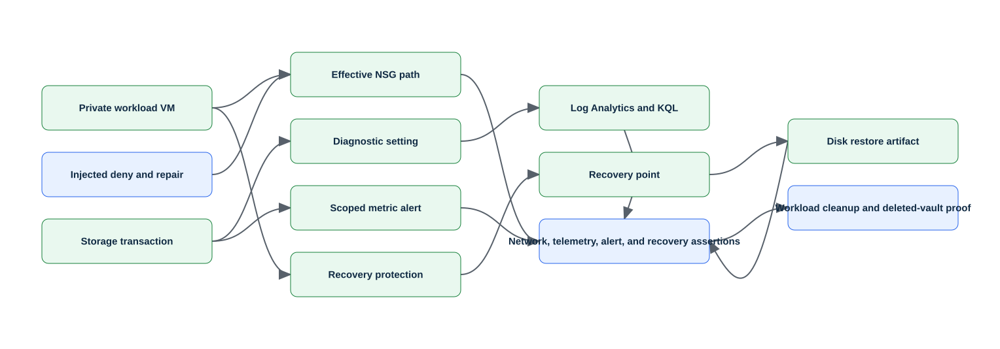

# Lab 27: Capstone — Operate, troubleshoot, back up, and recover an Azure workload

> Status: **offline-authored and contract-tested; live Azure verification is pending.**

Deploy or discover an isolated workload, interpret access and policy state, diagnose a network fault, query logs and metrics, respond to alerts, restore protected data, and execute a documented recovery decision before complete cleanup.

This folder is self-contained. It does not depend on another lab's runtime state. Use a disposable environment, keep the generated run manifest, and never substitute a production scope for a missing lab prerequisite.

## Learning objectives

| ID | Microsoft AZ-104 objective |
|---|---|
| `IG-ACCESS-03` | Interpret access assignments |
| `IG-GOVERN-01` | Implement and manage Azure Policy |
| `IG-GOVERN-02` | Configure resource locks |
| `IG-GOVERN-04` | Manage resource groups |
| `IG-GOVERN-06` | Manage costs by using alerts, budgets, and Azure Advisor recommendations |
| `NW-VNET-05` | Troubleshoot network connectivity |
| `NW-SECURE-02` | Evaluate effective security rules in NSGs |
| `NW-DNSLB-03` | Troubleshoot load balancing |
| `MR-MONITOR-03` | Query and analyze logs in Azure Monitor |
| `MR-MONITOR-04` | Set up alert rules, action groups, and alert processing rules in Azure Monitor |
| `MR-MONITOR-05` | Configure and interpret monitoring of virtual machines, storage accounts, and networks by using Azure Monitor Insights |
| `MR-MONITOR-06` | Use Azure Network Watcher and Connection monitor |
| `MR-RECOVERY-04` | Perform backup and restore operations by using Azure Backup |
| `MR-RECOVERY-06` | Perform a failover to a secondary region by using Site Recovery |
| `MR-RECOVERY-07` | Configure and interpret reports and alerts for backups |

Blueprint source: [Microsoft AZ-104 study guide](https://learn.microsoft.com/en-us/credentials/certifications/resources/study-guides/az-104), effective 2026-04-17.

## Architecture



The editable Mermaid source is [diagrams/architecture.mmd](diagrams/architecture.mmd). The diagram describes the learning boundary, not a production reference architecture.

## Scenario and outcome

You are the Azure administrator for a training environment. Your task is to implement the smallest isolated configuration that demonstrates the mapped exam objectives, validate it independently, retain redacted command evidence, and remove only what this run recorded.

The key design idea is: **Operations should follow evidence: establish baseline, detect and scope the fault, repair the smallest cause, validate service state, then prove backup or recovery objectives before cleanup.**

## Time, cost, and permissions

| Item | Value |
|---|---|
| Estimated time | 180 minutes |
| Cost class | `elevated` |
| Command surface | Az PowerShell and KQL |
| Required boundary | Contributor, Monitoring Contributor, Backup Contributor, and Network Contributor on the capstone resource group |
| External/live gate | The live recovery drill requires cost review and an isolated workload; production failover or irreversible deletion is never inferred from this capstone. |

Cost is not a fixed promise. Check current pricing, free allowances, quotas, and regional availability before using `--execute` or `-Execute`. Labs marked moderate or elevated should be cleaned up in the same study session.

## Resources and dependencies

| # | Intended resource or object |
|---:|---|
| 1 | resource group |
| 2 | test workload |
| 3 | Log Analytics workspace |
| 4 | alerts |
| 5 | Recovery Services vault |
| 6 | backup policy |
| 7 | fault injection and recovery evidence |

- Resource providers observed by preflight: `Microsoft.Authorization`, `Microsoft.Compute`, `Microsoft.Insights`, `Microsoft.Network`, `Microsoft.OperationalInsights`, `Microsoft.RecoveryServices`
- PowerShell modules used when applicable: `Az.Accounts`, `Az.Resources`, `Az.Network`, `Az.Compute`, `Az.Monitor`, `Az.OperationalInsights`, `Az.RecoveryServices`
- Repository state: `.state/<run-id>/run.json` and `.state/<run-id>/validation.json`
- Secrets, access keys, SAS tokens, generated passwords, and shared keys must remain in memory and must not enter the manifest, command evidence, or Git history.

## Safety contract

1. Preflight is read-only. It does not sign in, register providers, or switch the active context.
2. Setup is preview-only unless the explicit execution switch is supplied.
3. State is written before the first cloud mutation and updated with exact returned IDs.
4. Validation reads live state independently; it does not repair a failed configuration.
5. Cleanup previews exact targets, verifies run ownership, then requires the explicit execution switch.
6. Tenant-wide, DNS, licensing, notification, failover, and policy gates are never guessed.

## Before you begin

- Use a disposable non-production tenant/subscription and verify the displayed tenant and subscription IDs.
- Install the declared command surface and supporting dependencies.
- Confirm the role boundary above at the smallest possible scope.
- Review provider registration and quota output; preflight reports requirements but does not register providers.
- Read the external gate. An unavailable gate is a documented `skipped` checkpoint, not a pass.
- Choose a unique run ID matching `^[a-z0-9-]+$`, such as `az104l27-01`.

<!-- BEGIN GENERATED INLINE COMMANDS -->
## Complete inline command implementation

The lifecycle commands below are the complete learner-facing implementation. They are embedded from the retained script files so the README and automation cannot drift. Review each stage here before running it. Use a different run ID if you later try the optional scripted lane against the same sandbox.

### Preflight: `scripts/powershell/Preflight.ps1`

```powershell
#requires -Version 7.4
[CmdletBinding()]
[Diagnostics.CodeAnalysis.SuppressMessageAttribute('PSAvoidUsingWriteHost', '', Justification = 'Interactive lab progress is intentionally written to the host.')]
[Diagnostics.CodeAnalysis.SuppressMessageAttribute('PSReviewUnusedParameter', '', Justification = 'All lanes keep a consistent explicit context interface.')]
param(
    [Parameter(Mandatory)][string]$SubscriptionId,
    [Parameter(Mandatory)][string]$Location
)

$ErrorActionPreference = 'Stop'
$requiredModules = @(
    'Az.Accounts',
    'Az.Resources',
    'Az.Network',
    'Az.Compute',
    'Az.Monitor',
    'Az.OperationalInsights',
    'Az.RecoveryServices'
)
foreach ($module in $requiredModules) {
    if (-not (Get-Module -ListAvailable -Name $module)) { throw "Missing required module: $module" }
}

if (-not $SubscriptionId) { throw 'Supply -SubscriptionId explicitly.' }
$context = Get-AzContext
if (-not $context) { throw 'No Az PowerShell context is active. Sign in deliberately before running this lab.' }
if ($context.Subscription.Id -ne $SubscriptionId) {
    throw "Context mismatch: active subscription is $($context.Subscription.Id), expected $SubscriptionId. This script will not switch it."
}
Write-Host "Tenant: $($context.Tenant.Id)"
Write-Host "Subscription: $($context.Subscription.Id)"
Write-Host 'Lab: LAB-27'
Write-Host 'Location:' $Location
Write-Host 'Cost class: elevated'
Write-Host 'Role boundary: Contributor, Monitoring Contributor, Backup Contributor, and Network Contributor on the capstone resource group'
$providers = @(
    'Microsoft.Authorization',
    'Microsoft.Compute',
    'Microsoft.Insights',
    'Microsoft.Network',
    'Microsoft.OperationalInsights',
    'Microsoft.RecoveryServices'
)
foreach ($provider in $providers) {
    $item = Get-AzResourceProvider -ProviderNamespace $provider -ErrorAction SilentlyContinue
    $states = @($item.ResourceTypes.RegistrationState | Sort-Object -Unique) -join ','
    Write-Host ("Provider {0,-38} {1}" -f $provider, $(if ($states) { $states } else { 'Unavailable' }))
}
Write-Host 'Preflight is read-only. It does not connect, change context, register providers, or create resources.'
```

### Setup: `scripts/powershell/Setup.ps1`

```powershell
#requires -Version 7.4
[CmdletBinding()]
[Diagnostics.CodeAnalysis.SuppressMessageAttribute('PSAvoidUsingWriteHost', '', Justification = 'Interactive lab progress is intentionally written to the host.')]
[Diagnostics.CodeAnalysis.SuppressMessageAttribute('PSReviewUnusedParameter', '', Justification = 'All lanes keep a consistent explicit context and region interface.')]
[Diagnostics.CodeAnalysis.SuppressMessageAttribute('PSUseDeclaredVarsMoreThanAssignments', '', Justification = 'Named checkpoint results improve readability even when the object is used only to enforce failure handling.')]
[Diagnostics.CodeAnalysis.SuppressMessageAttribute('PSAvoidUsingConvertToSecureStringWithPlainText', '', Justification = 'The disposable generated VMSS credential remains in memory and is never persisted.')]
param(
    [Parameter(Mandatory)][string]$SubscriptionId,
    [Parameter(Mandatory)][ValidatePattern('^[a-z0-9-]+$')][string]$RunId,
    [Parameter(Mandatory)][string]$Location,
    [string]$SecondaryLocation = $env:AZURE_SECONDARY_LOCATION,
    [switch]$Execute
)

$ErrorActionPreference = 'Stop'
$LabRoot = (Resolve-Path (Join-Path $PSScriptRoot '../..')).Path
$ResourceGroupName = 'rg-az104-l27-' + $RunId
$suffix = (($RunId -replace '[^a-z0-9]', '') + '000000000000').Substring(0, 12)
$StateDir = Join-Path $LabRoot ".state/$RunId"
$Manifest = Join-Path $StateDir 'run.json'

Write-Host 'LAB-27 plan'
Write-Host '  subscription:' $(if ($SubscriptionId) { $SubscriptionId } else { 'tenant-scoped / not applicable' })
Write-Host '  location:' $Location
Write-Host '  resource group:' $(if ($true) { $ResourceGroupName } else { 'none (tenant objects)' })
Write-Host '  cost class: elevated'
Write-Host '  external gate: The live recovery drill requires cost review and an isolated workload; production failover or irreversible deletion is never inferred from this capstone.'
Write-Host '  resources: resource group, test workload, Log Analytics workspace, alerts, Recovery Services vault, backup policy, fault injection and recovery evidence'
if (-not $Execute) {
    Write-Host 'Preview only. Re-run with -Execute after approving context, permissions, cost, and gates.'
    return
}

& (Join-Path $PSScriptRoot 'Preflight.ps1') -SubscriptionId $SubscriptionId -Location $Location
if (Test-Path -LiteralPath $Manifest) { throw "State already exists at $Manifest; choose a new run ID." }
New-Item -ItemType Directory -Path $StateDir -Force | Out-Null
$context = Get-AzContext
$TenantId = $context.Tenant.Id
$state = [ordered]@{
    labId = 'LAB-27'
    runId = $RunId
    tenantId = $TenantId
    subscriptionId = $SubscriptionId
    location = $Location
    createdAt = (Get-Date).ToUniversalTime().ToString('o')
    status = 'recorded-before-mutation'
    resourceGroup = [ordered]@{ name = $(if ($true) { $ResourceGroupName } else { $null }); id = $null }
    resources = @()
    external = [ordered]@{}
}
$state | ConvertTo-Json -Depth 20 | Set-Content -LiteralPath $Manifest -Encoding utf8
$tags = @{ purpose = 'az104-lab'; labId = '27'; runId = $RunId; expiresOn = (Get-Date).ToUniversalTime().AddDays(1).ToString('yyyy-MM-dd') }
$resourceGroup = New-AzResourceGroup -Name $ResourceGroupName -Location $Location -Tag $tags
$state.resourceGroup.id = $resourceGroup.ResourceId
$state.status = 'baseline-created'
$state | ConvertTo-Json -Depth 20 | Set-Content -LiteralPath $Manifest -Encoding utf8

$workspace = New-AzOperationalInsightsWorkspace -ResourceGroupName $ResourceGroupName -Name ("law-" + $suffix) -Location $Location -Sku PerGB2018 -RetentionInDays 30
$vault = New-AzRecoveryServicesVault -ResourceGroupName $ResourceGroupName -Name ("rsv-" + $suffix) -Location $Location
$vnet = New-AzVirtualNetwork -ResourceGroupName $ResourceGroupName -Location $Location -Name ("vnet-" + $suffix) -AddressPrefix '10.27.0.0/16'
$vnet | Add-AzVirtualNetworkSubnetConfig -Name workload -AddressPrefix '10.27.1.0/24' | Set-AzVirtualNetwork | Out-Null
$state.external.workspaceId = $workspace.ResourceId
$state.external.recoveryVaultId = $vault.ID

$state.resources = @(Get-AzResource -ResourceGroupName $ResourceGroupName | ForEach-Object {
    [ordered]@{ id = $_.ResourceId; name = $_.Name; type = $_.ResourceType; location = $_.Location }
})
$state.status = 'setup-complete'
$state | ConvertTo-Json -Depth 20 | Set-Content -LiteralPath $Manifest -Encoding utf8
Write-Host "Setup complete. State: $Manifest"
Write-Host 'Run Validate.ps1 before recording command evidence.'
```

### Validate: `scripts/powershell/Validate.ps1`

```powershell
#requires -Version 7.4
[CmdletBinding()]
[Diagnostics.CodeAnalysis.SuppressMessageAttribute('PSReviewUnusedParameter', '', Justification = 'Tenant and subscription lanes share a consistent validation interface.')]
param(
    [Parameter(Mandatory)][string]$SubscriptionId,
    [Parameter(Mandatory)][ValidatePattern('^[a-z0-9-]+$')][string]$RunId
)

$ErrorActionPreference = 'Stop'
$LabRoot = (Resolve-Path (Join-Path $PSScriptRoot '../..')).Path
$StateDir = Join-Path $LabRoot ".state/$RunId"
$Manifest = Join-Path $StateDir 'run.json'
$Report = Join-Path $StateDir 'validation.json'
if (-not (Test-Path -LiteralPath $Manifest)) { throw "Missing state: $Manifest" }
$state = Get-Content -LiteralPath $Manifest -Raw | ConvertFrom-Json -Depth 20
$checks = [System.Collections.Generic.List[object]]::new()
function Add-Check([string]$Id, [string]$Status, [string]$Message) {
    $checks.Add([ordered]@{ id = $Id; status = $Status; message = $Message })
}

$context = Get-AzContext
if (-not $context -or $context.Subscription.Id -ne $SubscriptionId) { throw 'Active Az context does not match -SubscriptionId.' }
if ($state.subscriptionId -ne $SubscriptionId) { throw 'Recorded subscription mismatch.' }
$rg = Get-AzResourceGroup -Name $state.resourceGroup.name -ErrorAction SilentlyContinue
if (-not $rg) { Add-Check 'context.resource-group' 'fail' 'The recorded resource group is absent.' }
elseif ($rg.ResourceId -ne $state.resourceGroup.id) { Add-Check 'context.resource-group' 'fail' 'The resource-group ID differs from the manifest.' }
else { Add-Check 'context.resource-group' 'pass' 'The exact recorded resource group exists.' }
if ($rg -and $rg.Tags.purpose -eq 'az104-lab' -and $rg.Tags.labId -eq '27' -and $rg.Tags.runId -eq $RunId) {
    Add-Check 'ownership.tags' 'pass' 'purpose, labId, and runId tags match.'
} else { Add-Check 'ownership.tags' 'fail' 'Ownership tags do not match.' }
$resources = @(Get-AzResource -ResourceGroupName $state.resourceGroup.name -ErrorAction SilentlyContinue)
$expectedTypes = @(
    'Microsoft.Compute/virtualMachines',
    'Microsoft.OperationalInsights/workspaces',
    'Microsoft.RecoveryServices/vaults'
)
foreach ($type in $expectedTypes) {
    $count = @($resources | Where-Object ResourceType -eq $type).Count
    if ($count -gt 0) { Add-Check ("resource." + ($type -replace '[/\.]','-')) 'pass' "Found $count resource(s) of type $type." }
    else { Add-Check ("resource." + ($type -replace '[/\.]','-')) 'warning' "No top-level $type was returned; inspect nested or gated state." }
}
$failures = @($checks | Where-Object status -eq 'fail').Count
$warnings = @($checks | Where-Object status -in @('warning','skipped')).Count
$result = if ($failures -gt 0) { 'fail' } elseif ($warnings -gt 0) { 'partial' } else { 'pass' }
$output = [ordered]@{ labId = 'LAB-27'; runId = $RunId; generatedAt = (Get-Date).ToUniversalTime().ToString('o'); result = $result; checks = @($checks) }
$output | ConvertTo-Json -Depth 20 | Set-Content -LiteralPath $Report -Encoding utf8
$output | ConvertTo-Json -Depth 20
if ($result -eq 'fail') { exit 1 }
```

### Cleanup: `scripts/powershell/Cleanup.ps1`

```powershell
#requires -Version 7.4
[CmdletBinding()]
[Diagnostics.CodeAnalysis.SuppressMessageAttribute('PSAvoidUsingWriteHost', '', Justification = 'Interactive cleanup previews are intentionally written to the host.')]
[Diagnostics.CodeAnalysis.SuppressMessageAttribute('PSReviewUnusedParameter', '', Justification = 'Tenant and subscription lanes share a consistent cleanup interface.')]
param(
    [Parameter(Mandatory)][string]$SubscriptionId,
    [Parameter(Mandatory)][ValidatePattern('^[a-z0-9-]+$')][string]$RunId,
    [switch]$Execute
)

$ErrorActionPreference = 'Stop'
$LabRoot = (Resolve-Path (Join-Path $PSScriptRoot '../..')).Path
$Manifest = Join-Path $LabRoot ".state/$RunId/run.json"
if (-not (Test-Path -LiteralPath $Manifest)) { throw "Missing state: $Manifest" }
$state = Get-Content -LiteralPath $Manifest -Raw | ConvertFrom-Json -Depth 20
Write-Host 'Cleanup preview for LAB-27'
Write-Host '  exact target:' $state.resourceGroup.id
Write-Host '  residual/soft-delete behavior must be audited after deletion.'
if (-not $Execute) { Write-Host 'Preview only. Re-run with -Execute after checking every target.'; return }
$context = Get-AzContext
if (-not $context -or $context.Subscription.Id -ne $SubscriptionId) { throw 'Active Az context does not match -SubscriptionId.' }
if ($state.subscriptionId -ne $SubscriptionId) { throw 'Recorded subscription mismatch.' }
$rg = Get-AzResourceGroup -Name $state.resourceGroup.name -ErrorAction SilentlyContinue
if (-not $rg) { Write-Host 'Resource group is already absent; cleanup is idempotent.'; return }
if ($rg.ResourceId -ne $state.resourceGroup.id -or $rg.Tags.purpose -ne 'az104-lab' -or $rg.Tags.labId -ne '27' -or $rg.Tags.runId -ne $RunId) {
    throw 'ID or ownership-tag verification failed; refusing cleanup.'
}

Remove-AzResourceGroup -Id $state.resourceGroup.id -Force
$remaining = Get-AzResourceGroup -Name $state.resourceGroup.name -ErrorAction SilentlyContinue
if ($remaining) { throw 'Resource group still exists; inspect soft-delete dependencies, locks, or asynchronous operations.' }
Write-Host 'Active resource-group cleanup completed. Audit soft-deleted and externally retained items separately.'
$state.status = 'cleanup-complete'
$state | ConvertTo-Json -Depth 20 | Set-Content -LiteralPath $Manifest -Encoding utf8
```

<!-- END GENERATED INLINE COMMANDS -->
## Run the lab

The complete learner-facing implementations are embedded above. The commands in this section are optional shortcuts that run the identical retained script files. Run them from this lab folder. The examples intentionally use placeholders rather than silently reading an arbitrary subscription.

### 1. Preview

```ps1
pwsh ./scripts/powershell/Setup.ps1 -RunId az104l27-01 -SubscriptionId <subscription-id> -Location <region>
```

Review the context, names, tags, cost class, providers, and gated branches printed by the script.

### 2. Execute the approved baseline

```ps1
pwsh ./scripts/powershell/Setup.ps1 -RunId az104l27-01 -SubscriptionId <subscription-id> -Location <region> -Execute
```

The script records its run before creating resources. If a cloud operation fails partway through, keep the state directory and use validation plus cleanup against that exact run.

### 3. Complete and reason through the checkpoints

### Checkpoint 1: Inventory the workload, interpret direct/inherited access, policy compliance, tags, locks, and current health before changing anything

Inventory the workload, interpret direct/inherited access, policy compliance, tags, locks, and current health before changing anything.

Evidence to retain:

- The command output or exact resource/object ID for checkpoint 1.
- A positive assertion proving the intended state.
- A negative assertion showing that broader or anonymous access was not introduced.
- Any asynchronous operation state, timestamp, and final result.

### Checkpoint 2: Inject one bounded NSG or load-balancer fault, use effective rules and Network Watcher evidence to diagnose it, then repair only the identified cause

Inject one bounded NSG or load-balancer fault, use effective rules and Network Watcher evidence to diagnose it, then repair only the identified cause.

Evidence to retain:

- The command output or exact resource/object ID for checkpoint 2.
- A positive assertion proving the intended state.
- A negative assertion showing that broader or anonymous access was not introduced.
- Any asynchronous operation state, timestamp, and final result.

### Checkpoint 3: Query metrics/logs, process an alert, and record the operational timeline and validation output

Query metrics/logs, process an alert, and record the operational timeline and validation output.

Evidence to retain:

- The command output or exact resource/object ID for checkpoint 3.
- A positive assertion proving the intended state.
- A negative assertion showing that broader or anonymous access was not introduced.
- Any asynchronous operation state, timestamp, and final result.

### Checkpoint 4: Protect the test workload, run a restore or isolated recovery drill, verify recovered state, and remove protection/resources in dependency order

Protect the test workload, run a restore or isolated recovery drill, verify recovered state, and remove protection/resources in dependency order.

Evidence to retain:

- The command output or exact resource/object ID for checkpoint 4.
- A positive assertion proving the intended state.
- A negative assertion showing that broader or anonymous access was not introduced.
- Any asynchronous operation state, timestamp, and final result.

### 4. Validate independently

```ps1
pwsh ./scripts/powershell/Validate.ps1 -RunId az104l27-01 -SubscriptionId <subscription-id>
```

Inspect `.state/az104l27-01/validation.json`. A `pass` applies only to checks that could be executed. A gated or asynchronous path must remain `warning` or `skipped` until its evidence exists.

Positive checks should prove the intended resources, configuration, relationships, or health. Negative checks should prove that anonymous access, excess scope, accidental inheritance, unresolved DNS, unhealthy probes, or unrecorded resources were not introduced where the scenario forbids them.

## Break/fix exercise

1. Pick one reversible configuration created inside the recorded lab boundary.
2. Record the exact ID and current value.
3. Introduce one bounded mismatch; do not weaken a tenant-wide or production control.
4. Run validation and connect the failed check to an exact CLI/PowerShell query and the machine-readable validation result.
5. Repair only the identified setting, rerun validation, and compare the evidence.

The [solution notes](solution/README.md) provide a diagnostic sequence without hiding the reasoning behind an opaque repair script.

## Cleanup

Preview cleanup first:

```ps1
pwsh ./scripts/powershell/Cleanup.ps1 -RunId az104l27-01 -SubscriptionId <subscription-id>
```

After verifying every printed target belongs to this run:

```ps1
pwsh ./scripts/powershell/Cleanup.ps1 -RunId az104l27-01 -SubscriptionId <subscription-id> -Execute
```

Run validation again after deletion. Some services use soft delete, retained recovery points, asynchronous deletion, or external DNS/tenant state; the cleanup report must distinguish active cleanup from retention and must list residual items instead of claiming success prematurely.

## Exam practice

This hands-on lab has no separate question set. Use the generated
[domain question-bank index](../../docs/question-bank-index.md) after completing the practical work.

## Microsoft Learn sources

- [https://learn.microsoft.com/en-us/azure/network-watcher/network-watcher-ip-flow-verify-overview](https://learn.microsoft.com/en-us/azure/network-watcher/network-watcher-ip-flow-verify-overview)
- [https://learn.microsoft.com/en-us/azure/azure-monitor/logs/log-query-overview](https://learn.microsoft.com/en-us/azure/azure-monitor/logs/log-query-overview)
- [https://learn.microsoft.com/en-us/azure/azure-monitor/alerts/alerts-overview](https://learn.microsoft.com/en-us/azure/azure-monitor/alerts/alerts-overview)
- [https://learn.microsoft.com/en-us/azure/backup/backup-azure-vms-introduction](https://learn.microsoft.com/en-us/azure/backup/backup-azure-vms-introduction)
- [https://learn.microsoft.com/en-us/azure/role-based-access-control/check-access](https://learn.microsoft.com/en-us/azure/role-based-access-control/check-access)

Last curriculum/source review: 2026-08-30. Azure interfaces and command modules evolve; confirm current syntax in the linked primary documentation before a live run.
